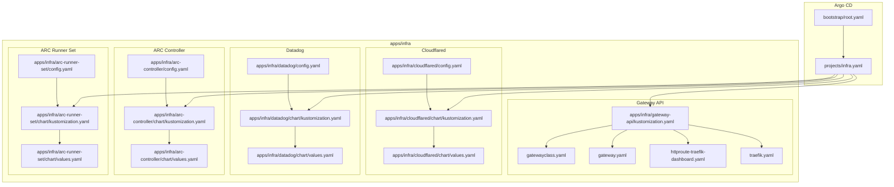
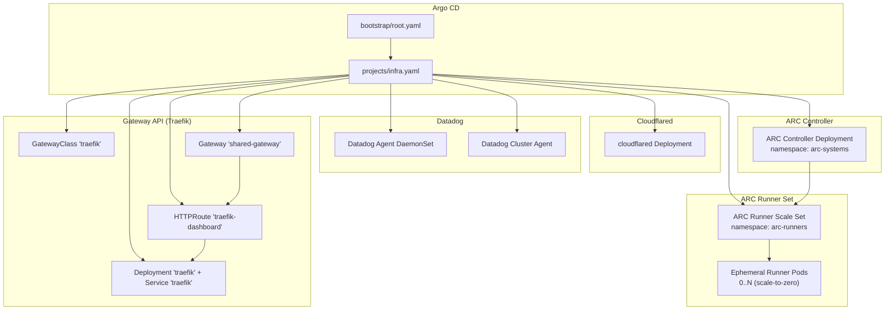
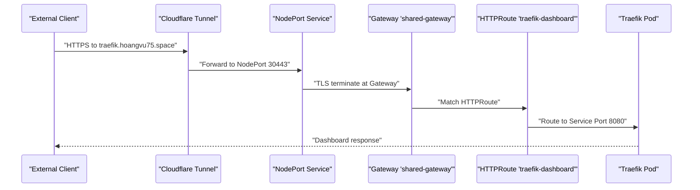
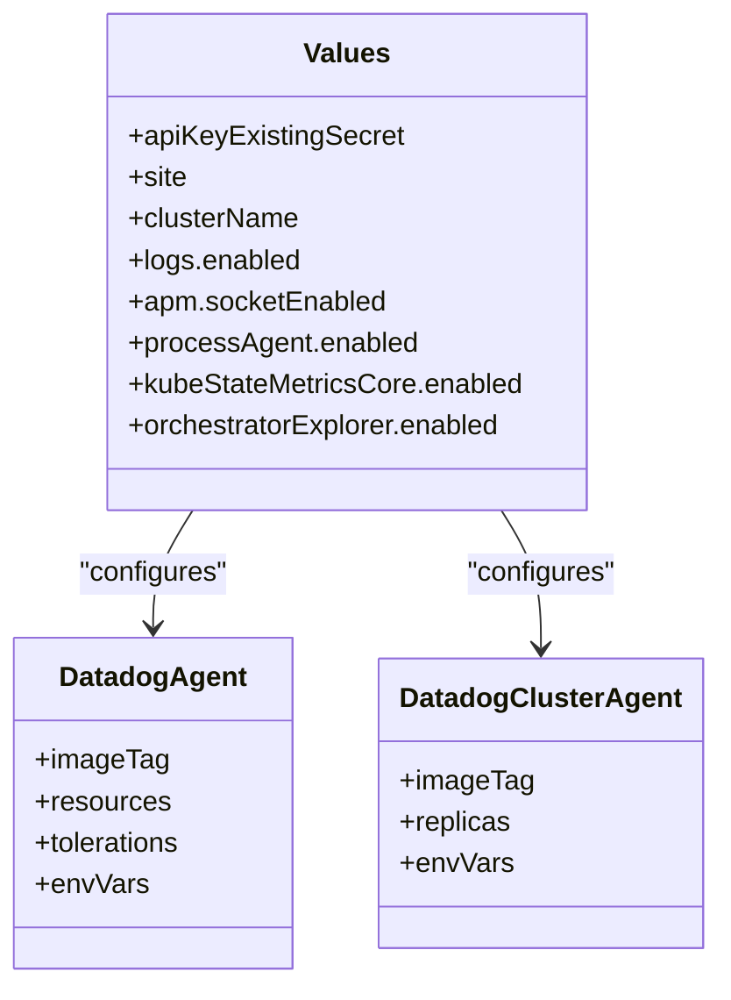
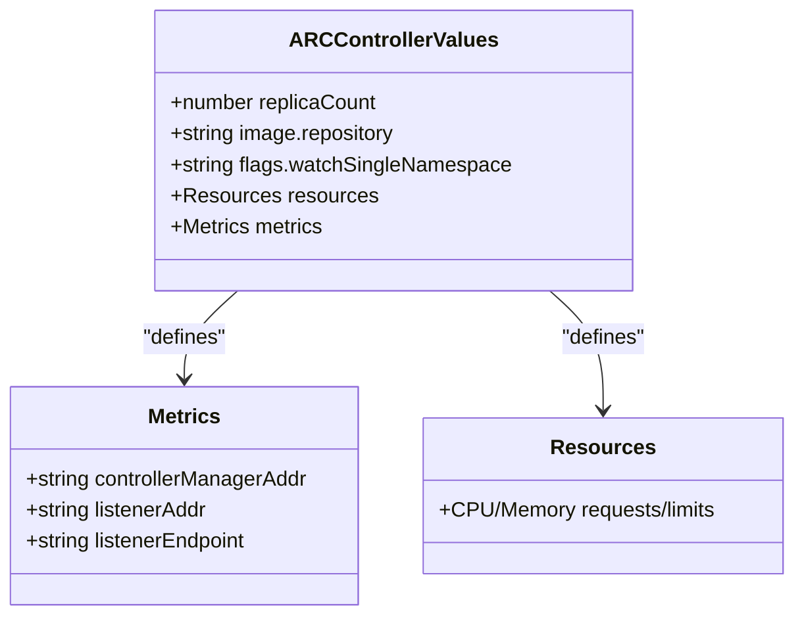
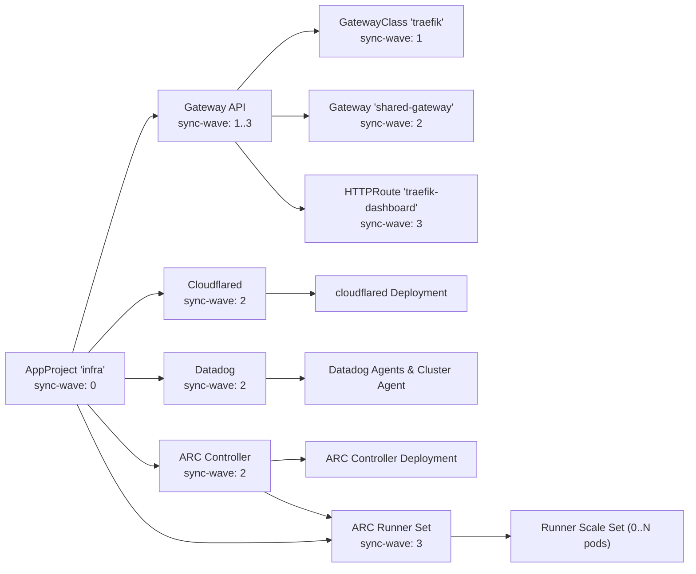

# Infrastructure Applications

<cite>
**Referenced Files in This Document**
- [gateway.yaml](file://apps/infra/gateway-api/chart/gateway.yaml)
- [traefik.yaml](file://apps/infra/gateway-api/chart/traefik.yaml)
- [gatewayclass.yaml](file://apps/infra/gateway-api/chart/gatewayclass.yaml)
- [httproute-traefik-dashboard.yaml](file://apps/infra/gateway-api/chart/httproute-traefik-dashboard.yaml)
- [kustomization.yaml](file://apps/infra/gateway-api/kustomization.yaml)
- [config.yaml](file://apps/infra/gateway-api/config.yaml)
- [values.yaml](file://apps/infra/cloudflared/chart/values.yaml)
- [kustomization.yaml](file://apps/infra/cloudflared/chart/kustomization.yaml)
- [config.yaml](file://apps/infra/cloudflared/config.yaml)
- [values.yaml](file://apps/infra/datadog/chart/values.yaml)
- [kustomization.yaml](file://apps/infra/datadog/chart/kustomization.yaml)
- [config.yaml](file://apps/infra/datadog/config.yaml)
- [arc-controller kustomization.yaml](file://apps/infra/arc-controller/chart/kustomization.yaml)
- [arc-controller values.yaml](file://apps/infra/arc-controller/chart/values.yaml)
- [arc-runner-set kustomization.yaml](file://apps/infra/arc-runner-set/chart/kustomization.yaml)
- [arc-runner-set values.yaml](file://apps/infra/arc-runner-set/chart/values.yaml)
- [root.yaml](file://bootstrap/root.yaml)
- [infra.yaml](file://projects/infra.yaml)
</cite>

## Table of Contents
1. [Introduction](#introduction)
2. [Project Structure](#project-structure)
3. [Core Components](#core-components)
4. [Architecture Overview](#architecture-overview)
5. [Detailed Component Analysis](#detailed-component-analysis)
6. [Dependency Analysis](#dependency-analysis)
7. [Performance Considerations](#performance-considerations)
8. [Troubleshooting Guide](#troubleshooting-guide)
9. [Conclusion](#conclusion)
10. [Appendices](#appendices)

## Introduction
This document describes the foundational infrastructure applications that power the Kubernetes cluster. It covers:
- Gateway API controller setup with Traefik as the ingress controller, including GatewayClass, Gateway, and HTTPRoute definitions
- Cloudflare Tunnel configuration for secure external access via the cloudflared pod
- Datadog monitoring agent deployment for observability and metrics collection
- GitHub Actions Runner Controller for self-hosted CI/CD runners on the cluster
- Deployment order (sync waves) and interdependencies among infrastructure components
- Networking considerations and integration patterns with the broader infrastructure
- Troubleshooting tips and performance optimization strategies

## Project Structure
The infrastructure stack is organized under apps/infra with five primary subsystems:
- Gateway API (Traefik): Defines the GatewayClass, Gateway, and HTTPRoute for ingress routing
- Cloudflared: Helm-based deployment of Cloudflare Tunnel client
- Datadog: Helm-based monitoring and observability agent
- ARC Controller: GitHub Actions Runner Controller (manages AutoscalingRunnerSet CRDs)
- ARC Runner Set: Self-hosted runner scale set for CI/CD workloads

**Diagram sources**
- [root.yaml:1-37](file://bootstrap/root.yaml#L1-L37)
- [infra.yaml:1-85](file://projects/infra.yaml#L1-L85)
- [kustomization.yaml:1-8](file://apps/infra/gateway-api/kustomization.yaml#L1-L8)
- [values.yaml:1-40](file://apps/infra/cloudflared/chart/values.yaml#L1-L40)
- [kustomization.yaml:1-11](file://apps/infra/cloudflared/chart/kustomization.yaml#L1-L11)
- [config.yaml:1-4](file://apps/infra/cloudflared/config.yaml#L1-L4)
- [values.yaml:1-98](file://apps/infra/datadog/chart/values.yaml#L1-L98)
- [kustomization.yaml:1-11](file://apps/infra/datadog/chart/kustomization.yaml#L1-L11)
- [config.yaml:1-6](file://apps/infra/datadog/config.yaml#L1-L6)

**Section sources**
- [root.yaml:1-37](file://bootstrap/root.yaml#L1-L37)
- [infra.yaml:1-85](file://projects/infra.yaml#L1-L85)
- [kustomization.yaml:1-8](file://apps/infra/gateway-api/kustomization.yaml#L1-L8)
- [kustomization.yaml:1-11](file://apps/infra/cloudflared/chart/kustomization.yaml#L1-L11)
- [kustomization.yaml:1-11](file://apps/infra/datadog/chart/kustomization.yaml#L1-L11)

## Core Components
- Traefik Gateway API controller: Provides GatewayClass, Gateway, and HTTPRoute resources to expose services via HTTP/HTTPS with TLS termination and optional dashboard route
- Cloudflare Tunnel client: Runs cloudflared pods to securely proxy traffic to internal services
- Datadog monitoring: Deploys the Datadog Agent and Cluster Agent with logs, APM, process, and orchestrator explorer enabled
- ARC Controller: GitHub Actions Runner Controller that manages AutoscalingRunnerSet resources in the arc-runners namespace
- ARC Runner Set: Self-hosted runner scale set for CI/CD, scaling 0..N runners with Docker-in-Docker mode

Key deployment annotations and sync waves:
- Gateway API resources use sync waves to ensure CRDs and controller install before applying GatewayClass, Gateway, and HTTPRoute
- Cloudflared and Datadog are configured with sync wave 2 to deploy after the Gateway API stack is ready
- ARC Controller uses sync-wave 2 (deploys after namespaces and secrets)
- ARC Runner Set uses sync-wave 3 (deploys after controller to ensure CRDs exist)

**Section sources**
- [gatewayclass.yaml:1-10](file://apps/infra/gateway-api/chart/gatewayclass.yaml#L1-L10)
- [gateway.yaml:1-27](file://apps/infra/gateway-api/chart/gateway.yaml#L1-L27)
- [httproute-traefik-dashboard.yaml:1-30](file://apps/infra/gateway-api/chart/httproute-traefik-dashboard.yaml#L1-L30)
- [traefik.yaml:1-120](file://apps/infra/gateway-api/chart/traefik.yaml#L1-L120)
- [values.yaml:1-40](file://apps/infra/cloudflared/chart/values.yaml#L1-L40)
- [values.yaml:1-98](file://apps/infra/datadog/chart/values.yaml#L1-L98)
- [config.yaml:1-4](file://apps/infra/cloudflared/config.yaml#L1-L4)
- [config.yaml:1-6](file://apps/infra/datadog/config.yaml#L1-L6)

## Architecture Overview
The infrastructure stack integrates Argo CD with Kustomize/Helm to manage three subsystems. The Gateway API controller exposes services through Traefik, while Cloudflare Tunnel provides secure external access. Datadog provides observability across the cluster.

**Diagram sources**
- [root.yaml:1-37](file://bootstrap/root.yaml#L1-L37)
- [infra.yaml:1-85](file://projects/infra.yaml#L1-L85)
- [gatewayclass.yaml:1-10](file://apps/infra/gateway-api/chart/gatewayclass.yaml#L1-L10)
- [gateway.yaml:1-27](file://apps/infra/gateway-api/chart/gateway.yaml#L1-L27)
- [httproute-traefik-dashboard.yaml:1-30](file://apps/infra/gateway-api/chart/httproute-traefik-dashboard.yaml#L1-L30)
- [traefik.yaml:1-120](file://apps/infra/gateway-api/chart/traefik.yaml#L1-L120)
- [values.yaml:1-40](file://apps/infra/cloudflared/chart/values.yaml#L1-L40)
- [values.yaml:1-98](file://apps/infra/datadog/chart/values.yaml#L1-L98)

## Detailed Component Analysis

### Gateway API Controller (Traefik)
- GatewayClass defines the controller name for Traefik’s Gateway API implementation
- Gateway provisions HTTP/HTTPS listeners and references a TLS certificate secret
- HTTPRoute routes dashboard traffic to Traefik’s admin port with header modifications
- Traefik Deployment runs with Gateway API providers and entrypoints for HTTP/HTTPS

**Diagram sources**
- [gateway.yaml:1-27](file://apps/infra/gateway-api/chart/gateway.yaml#L1-L27)
- [httproute-traefik-dashboard.yaml:1-30](file://apps/infra/gateway-api/chart/httproute-traefik-dashboard.yaml#L1-L30)
- [traefik.yaml:98-120](file://apps/infra/gateway-api/chart/traefik.yaml#L98-L120)

**Section sources**
- [gatewayclass.yaml:1-10](file://apps/infra/gateway-api/chart/gatewayclass.yaml#L1-L10)
- [gateway.yaml:1-27](file://apps/infra/gateway-api/chart/gateway.yaml#L1-L27)
- [httproute-traefik-dashboard.yaml:1-30](file://apps/infra/gateway-api/chart/httproute-traefik-dashboard.yaml#L1-L30)
- [traefik.yaml:1-120](file://apps/infra/gateway-api/chart/traefik.yaml#L1-L120)

### Cloudflare Tunnel (cloudflared)
- Helm chart deploys cloudflared as a Deployment with two replicas
- Uses a secret reference for the tunnel token via environment injection
- Disables probes and sets resource requests/limits
- Exposed via a ServiceAccount and RBAC bindings (as defined by the Helm chart)

**Diagram sources**
- [values.yaml:11-18](file://apps/infra/cloudflared/chart/values.yaml#L11-L18)
- [values.yaml:19-21](file://apps/infra/cloudflared/chart/values.yaml#L19-L21)

**Section sources**
- [values.yaml:1-40](file://apps/infra/cloudflared/chart/values.yaml#L1-L40)
- [kustomization.yaml:1-11](file://apps/infra/cloudflared/chart/kustomization.yaml#L1-L11)
- [config.yaml:1-4](file://apps/infra/cloudflared/config.yaml#L1-L4)

### Datadog Monitoring
- Deploys Datadog Agent and Cluster Agent with logs, APM, process, and orchestrator explorer enabled
- Disables auto-config for control-plane components to avoid initialization issues
- Sets toleration for control-plane nodes and configures resource requests/limits
- Uses a Kubernetes secret for the Datadog API key

**Diagram sources**
- [values.yaml:1-98](file://apps/infra/datadog/chart/values.yaml#L1-L98)

**Section sources**
- [values.yaml:1-98](file://apps/infra/datadog/chart/values.yaml#L1-L98)
- [kustomization.yaml:1-11](file://apps/infra/datadog/chart/kustomization.yaml#L1-L11)
- [config.yaml:1-6](file://apps/infra/datadog/config.yaml#L1-L6)

### ARC Controller
- Deploys the GitHub Actions Runner Controller (gha-runner-scale-set-controller) as a single replica
- Watches only the `arc-runners` namespace via `flags.watchSingleNamespace`
- Exposes metrics endpoint on port 8080 for monitoring
- Configured with constrained resource requests/limits (100m/128Mi → 500m/512Mi)

**Diagram sources**
- [arc-controller values.yaml:1-21](file://apps/infra/arc-controller/chart/values.yaml#L1-L21)

**Section sources**
- [arc-controller kustomization.yaml:1-11](file://apps/infra/arc-controller/chart/kustomization.yaml#L1-L11)
- [arc-controller values.yaml:1-21](file://apps/infra/arc-controller/chart/values.yaml#L1-L21)
- [arc-controller config.yaml:1-4](file://apps/infra/arc-controller/config.yaml#L1-L4)

### ARC Runner Scale Set
- Deploys a self-hosted runner scale set (gha-runner-scale-set) registered against a GitHub repository
- Uses GitHub PAT stored in `arc-github-config` Secret for authentication
- Scales from 0 to 5 runners (minRunners=0, maxRunners=5) with scale-to-zero when idle
- Uses Docker-in-Docker (dind) container mode for workflow compatibility
- Runner image: `ghcr.io/actions/actions-runner:latest`
- Default target repository: `https://github.com/Hoangvu75/k8s_manifest`

**Section sources**
- [arc-runner-set kustomization.yaml:1-11](file://apps/infra/arc-runner-set/chart/kustomization.yaml#L1-L11)
- [arc-runner-set values.yaml:1-30](file://apps/infra/arc-runner-set/chart/values.yaml#L1-L30)
- [arc-runner-set config.yaml:1-4](file://apps/infra/arc-runner-set/config.yaml#L1-L4)

## Dependency Analysis
The deployment order is orchestrated via Argo CD sync waves and Kustomize/Helm configuration. The sequence ensures prerequisites are established before dependent resources.

**Diagram sources**
- [infra.yaml:27-27](file://projects/infra.yaml#L27-L27)
- [gatewayclass.yaml:6-6](file://apps/infra/gateway-api/chart/gatewayclass.yaml#L6-L6)
- [gateway.yaml:7-7](file://apps/infra/gateway-api/chart/gateway.yaml#L7-L7)
- [httproute-traefik-dashboard.yaml:7-7](file://apps/infra/gateway-api/chart/httproute-traefik-dashboard.yaml#L7-L7)
- [config.yaml:3-3](file://apps/infra/cloudflared/config.yaml#L3-L3)
- [config.yaml:5-5](file://apps/infra/datadog/config.yaml#L5-L5)
- [arc-controller config.yaml:3-3](file://apps/infra/arc-controller/config.yaml#L3-L3)
- [arc-runner-set config.yaml:3-3](file://apps/infra/arc-runner-set/config.yaml#L3-L3)
- [arc-controller config.yaml:3-3](file://apps/infra/arc-controller/config.yaml#L3-L3)
- [arc-runner-set config.yaml:3-3](file://apps/infra/arc-runner-set/config.yaml#L3-L3)

**Section sources**
- [infra.yaml:1-85](file://projects/infra.yaml#L1-L85)
- [gatewayclass.yaml:1-10](file://apps/infra/gateway-api/chart/gatewayclass.yaml#L1-L10)
- [gateway.yaml:1-27](file://apps/infra/gateway-api/chart/gateway.yaml#L1-L27)
- [httproute-traefik-dashboard.yaml:1-30](file://apps/infra/gateway-api/chart/httproute-traefik-dashboard.yaml#L1-L30)
- [config.yaml:1-6](file://apps/infra/cloudflared/config.yaml#L1-L6)
- [config.yaml:1-6](file://apps/infra/datadog/config.yaml#L1-L6)
- [arc-controller config.yaml:1-4](file://apps/infra/arc-controller/config.yaml#L1-L4)
- [arc-runner-set config.yaml:1-4](file://apps/infra/arc-runner-set/config.yaml#L1-L4)

## Performance Considerations
- Traefik resource requests/limits are modest; monitor CPU/memory usage post-deployment and adjust as needed
- Cloudflared replicas are set to two; ensure adequate CPU and memory headroom for tunnel operations
- Datadog agents and Cluster Agent consume resources; scale replicas cautiously and tune log collection and APM sampling
- ARC Controller runs as a single replica with modest resources; monitor and scale if needed
- ARC Runner Set scales from 0 to maxRunners (default: 5); adjust maxRunners based on cluster capacity
- Gateway API listeners expose HTTP/HTTPS; ensure DNS and certificate management align with traffic patterns to minimize retries

[No sources needed since this section provides general guidance]

## Troubleshooting Guide
Common issues and resolutions:
- Gateway API not recognized
  - Verify GatewayClass exists and controller name matches the installed controller
  - Confirm Gateway API CRDs are installed before applying Gateway/GatewayClass
  - Check Gateway status and events for TLS certificate errors
- HTTPRoute not routing to Traefik dashboard
  - Ensure HTTPRoute references the correct Gateway and Service port
  - Validate NodePort service mapping and Traefik admin port exposure
- Cloudflared connectivity failures
  - Confirm TUNNEL_TOKEN secret is present and mounted
  - Check cloudflared logs for handshake or token errors
- Datadog agent initialization errors
  - Verify API key secret exists and matches the configured secret name
  - Review Cluster Agent logs for admission controller or RBAC issues
  - Temporarily disable auto-config for control-plane integrations if experiencing initialization failures
- ARC Controller not starting
  - Verify arc-controller chart version and CRD installation
  - Check watchSingleNamespace flag targets arc-runners
- ARC Runner Set not registering
  - Confirm arc-github-config Secret exists in arc-runners namespace with valid github_token
  - Verify githubConfigUrl points to a reachable repository

**Section sources**
- [gatewayclass.yaml:1-10](file://apps/infra/gateway-api/chart/gatewayclass.yaml#L1-L10)
- [gateway.yaml:1-27](file://apps/infra/gateway-api/chart/gateway.yaml#L1-L27)
- [httproute-traefik-dashboard.yaml:1-30](file://apps/infra/gateway-api/chart/httproute-traefik-dashboard.yaml#L1-L30)
- [traefik.yaml:98-120](file://apps/infra/gateway-api/chart/traefik.yaml#L98-L120)
- [values.yaml:11-18](file://apps/infra/cloudflared/chart/values.yaml#L11-L18)
- [values.yaml:1-98](file://apps/infra/datadog/chart/values.yaml#L1-L98)

## Conclusion
The infrastructure stack combines Gateway API with Traefik for modern ingress, Cloudflare Tunnel for secure external access, Datadog for comprehensive observability, and GitHub Actions Runner Controller for self-hosted CI/CD runners. The defined sync waves and configuration ensure a reliable rollout order and operational stability. Monitor resource usage and adjust configurations as your workload grows.

[No sources needed since this section summarizes without analyzing specific files]

## Appendices

### Deployment Order and Sync Waves
- AppProject “infra” sets initial sync wave and project-level automation
- Gateway API resources:
  - GatewayClass: wave 1
  - Gateway: wave 2
  - HTTPRoute: wave 3
- Cloudflared and Datadog: wave 2
- ARC Controller: wave 2
- ARC Runner Set: wave 3

**Section sources**
- [infra.yaml:1-85](file://projects/infra.yaml#L1-L85)
- [gatewayclass.yaml:6-6](file://apps/infra/gateway-api/chart/gatewayclass.yaml#L6-L6)
- [gateway.yaml:7-7](file://apps/infra/gateway-api/chart/gateway.yaml#L7-L7)
- [httproute-traefik-dashboard.yaml:7-7](file://apps/infra/gateway-api/chart/httproute-traefik-dashboard.yaml#L7-L7)
- [config.yaml:3-3](file://apps/infra/cloudflared/config.yaml#L3-L3)
- [config.yaml:5-5](file://apps/infra/datadog/config.yaml#L5-L5)