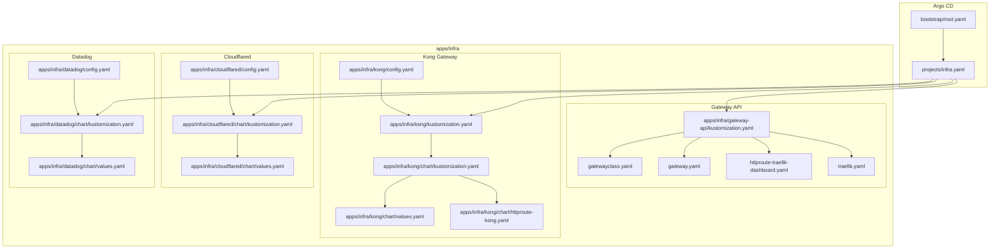
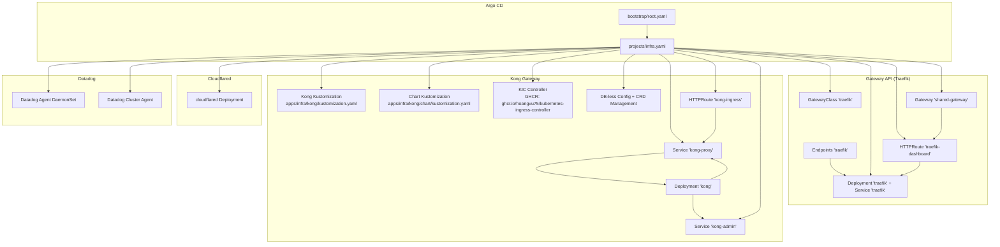
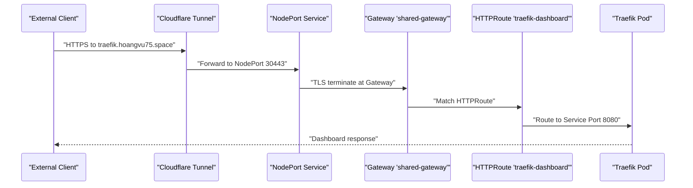
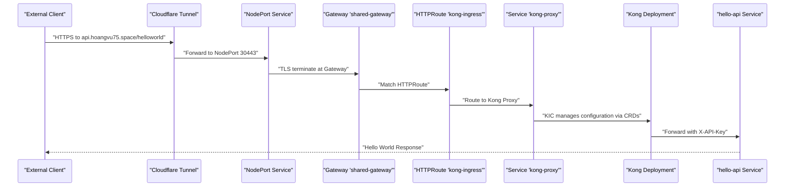
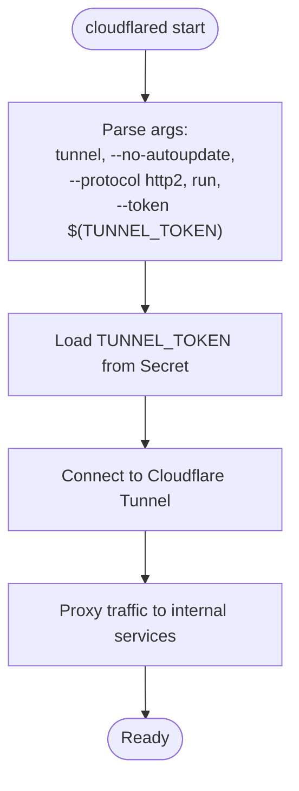
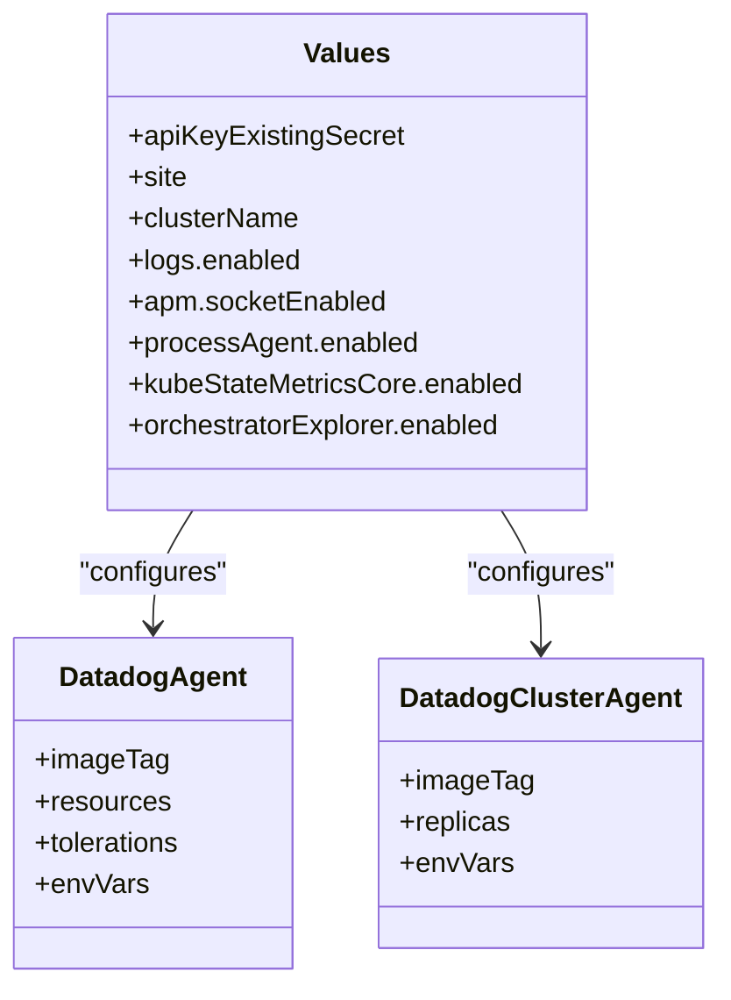
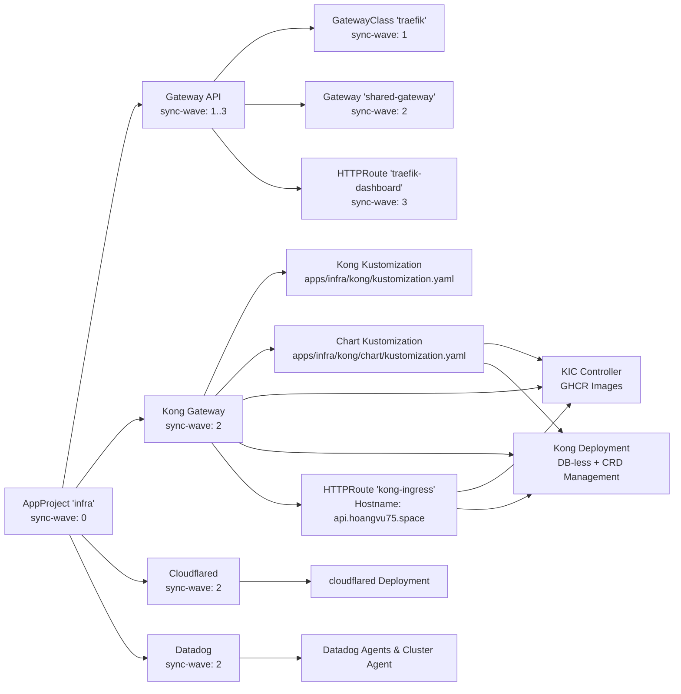

# Infrastructure Applications

<cite>
**Referenced Files in This Document**
- [gateway.yaml](file://apps/infra/gateway-api/chart/gateway.yaml)
- [gatewayclass.yaml](file://apps/infra/gateway-api/chart/gatewayclass.yaml)
- [traefik.yaml](file://apps/infra/gateway-api/chart/traefik.yaml)
- [httproute-traefik-dashboard.yaml](file://apps/infra/gateway-api/chart/httproute-traefik-dashboard.yaml)
- [kustomization.yaml](file://apps/infra/gateway-api/kustomization.yaml)
- [config.yaml](file://apps/infra/gateway-api/config.yaml)
- [values.yaml](file://apps/infra/cloudflared/chart/values.yaml)
- [kustomization.yaml](file://apps/infra/cloudflared/chart/kustomization.yaml)
- [config.yaml](file://apps/infra/cloudflared/config.yaml)
- [values.yaml](file://apps/infra/datadog/chart/values.yaml)
- [kustomization.yaml](file://apps/infra/datadog/chart/kustomization.yaml)
- [config.yaml](file://apps/infra/datadog/config.yaml)
- [kustomization.yaml](file://apps/infra/kong/kustomization.yaml)
- [chart/kustomization.yaml](file://apps/infra/kong/chart/kustomization.yaml)
- [values.yaml](file://apps/infra/kong/chart/values.yaml)
- [httproute-kong.yaml](file://apps/infra/kong/chart/httproute-kong.yaml)
- [root.yaml](file://bootstrap/root.yaml)
- [infra.yaml](file://projects/infra.yaml)
</cite>

## Update Summary
**Changes Made**
- Updated Kong Gateway configuration to reflect new subdirectory structure with automatic resource discovery via kustomization.yaml files
- Documented enhanced Kong architecture with Helm-based deployment using KIC-managed CRDs and GHCR images
- Revised deployment patterns to show improved sync wave coordination for new directory layout
- Updated integration patterns to demonstrate seamless Gateway API and KIC-managed configuration
- Enhanced troubleshooting guidance for the reorganized Kong infrastructure

## Table of Contents
1. [Introduction](#introduction)
2. [Project Structure](#project-structure)
3. [Core Components](#core-components)
4. [Architecture Overview](#architecture-overview)
5. [Detailed Component Analysis](#detailed-component-analysis)
6. [Dependency Analysis](#dependency-analysis)
7. [Performance Considerations](#performance-considerations)
8. [Troubleshooting Guide](#troubleshooting-guide)
9. [Conclusion](#conclusion)
10. [Appendices](#appendices)

## Introduction
This document describes the foundational infrastructure applications that power the Kubernetes cluster. It covers:
- Gateway API controller setup with Traefik as the ingress controller, including GatewayClass, Gateway, and HTTPRoute definitions
- Kong Gateway deployment with reorganized subdirectory structure and KIC-managed CRDs using GHCR images
- Cloudflare Tunnel configuration for secure external access via the cloudflared pod
- Datadog monitoring agent deployment for observability and metrics collection
- Deployment order (sync waves) and interdependencies among infrastructure components
- Networking considerations and integration patterns with the broader infrastructure
- Troubleshooting tips and performance optimization strategies

## Project Structure
The infrastructure stack is organized under apps/infra with four primary subsystems:
- Gateway API (Traefik): Defines the GatewayClass, Gateway, and HTTPRoute for ingress routing
- Kong Gateway: Reorganized Helm-based deployment with automatic resource discovery via kustomization.yaml files
- Cloudflared: Helm-based deployment of Cloudflare Tunnel client
- Datadog: Helm-based monitoring and observability agent

**Diagram sources**
- [root.yaml:1-37](file://bootstrap/root.yaml#L1-L37)
- [infra.yaml:1-85](file://projects/infra.yaml#L1-L85)
- [kustomization.yaml:1-8](file://apps/infra/gateway-api/kustomization.yaml#L1-L8)
- [kustomization.yaml:1-9](file://apps/infra/kong/kustomization.yaml#L1-L9)
- [chart/kustomization.yaml:1-18](file://apps/infra/kong/chart/kustomization.yaml#L1-L18)
- [values.yaml:1-43](file://apps/infra/kong/chart/values.yaml#L1-L43)
- [httproute-kong.yaml:1-30](file://apps/infra/kong/chart/httproute-kong.yaml#L1-L30)
- [config.yaml:1-4](file://apps/infra/kong/config.yaml#L1-L4)
- [values.yaml:1-40](file://apps/infra/cloudflared/chart/values.yaml#L1-L40)
- [kustomization.yaml:1-11](file://apps/infra/cloudflared/chart/kustomization.yaml#L1-L11)
- [config.yaml:1-4](file://apps/infra/cloudflared/config.yaml#L1-L4)
- [values.yaml:1-103](file://apps/infra/datadog/chart/values.yaml#L1-L103)
- [kustomization.yaml:1-11](file://apps/infra/datadog/chart/kustomization.yaml#L1-L11)
- [config.yaml:1-6](file://apps/infra/datadog/config.yaml#L1-L6)

**Section sources**
- [root.yaml:1-37](file://bootstrap/root.yaml#L1-L37)
- [infra.yaml:1-85](file://projects/infra.yaml#L1-L85)
- [kustomization.yaml:1-8](file://apps/infra/gateway-api/kustomization.yaml#L1-L8)
- [kustomization.yaml:1-9](file://apps/infra/kong/kustomization.yaml#L1-L9)
- [chart/kustomization.yaml:1-18](file://apps/infra/kong/chart/kustomization.yaml#L1-L18)
- [kustomization.yaml:1-11](file://apps/infra/cloudflared/chart/kustomization.yaml#L1-L11)
- [kustomization.yaml:1-11](file://apps/infra/datadog/chart/kustomization.yaml#L1-L11)

## Core Components
- **Traefik Gateway API controller**: Provides GatewayClass, Gateway, and HTTPRoute resources to expose services via HTTP/HTTPS with TLS termination and optional dashboard route
- **Kong Gateway**: Reorganized Helm-based deployment using KIC-managed CRDs with GHCR images, featuring automatic resource discovery via kustomization.yaml files
- Cloudflare Tunnel client: Runs cloudflared pods to securely proxy traffic to internal services
- Datadog monitoring: Deploys the Datadog Agent and Cluster Agent with logs, APM, process, and orchestrator explorer enabled

Key deployment annotations and sync waves:
- Gateway API resources use sync waves to ensure CRDs and controller install before applying GatewayClass, Gateway, and HTTPRoute
- Kong Gateway uses sync wave 2 to deploy after Gateway API stack but before Cloudflared and Datadog
- Cloudflared and Datadog are configured with sync wave annotations to deploy after the Gateway API stack is ready

**Section sources**
- [gatewayclass.yaml:1-10](file://apps/infra/gateway-api/chart/gatewayclass.yaml#L1-L10)
- [gateway.yaml:1-34](file://apps/infra/gateway-api/chart/gateway.yaml#L1-L34)
- [httproute-traefik-dashboard.yaml:1-30](file://apps/infra/gateway-api/chart/httproute-traefik-dashboard.yaml#L1-L30)
- [traefik.yaml:1-157](file://apps/infra/gateway-api/chart/traefik.yaml#L1-L157)
- [chart/kustomization.yaml:1-18](file://apps/infra/kong/chart/kustomization.yaml#L1-L18)
- [values.yaml:1-43](file://apps/infra/kong/chart/values.yaml#L1-L43)
- [httproute-kong.yaml:1-30](file://apps/infra/kong/chart/httproute-kong.yaml#L1-L30)
- [config.yaml:1-4](file://apps/infra/kong/config.yaml#L1-L4)
- [values.yaml:1-40](file://apps/infra/cloudflared/chart/values.yaml#L1-L40)
- [values.yaml:1-103](file://apps/infra/datadog/chart/values.yaml#L1-L103)
- [config.yaml:1-4](file://apps/infra/cloudflared/config.yaml#L1-L4)
- [config.yaml:1-6](file://apps/infra/datadog/config.yaml#L1-L6)

## Architecture Overview
The infrastructure stack integrates Argo CD with Kustomize/Helm to manage four subsystems. The Gateway API controller exposes services through both Traefik and Kong, while Cloudflare Tunnel provides secure external access. Datadog provides observability across the cluster. The Kong Gateway now features a reorganized directory structure with automatic resource discovery.

**Diagram sources**
- [root.yaml:1-37](file://bootstrap/root.yaml#L1-L37)
- [infra.yaml:1-85](file://projects/infra.yaml#L1-L85)
- [gatewayclass.yaml:1-10](file://apps/infra/gateway-api/chart/gatewayclass.yaml#L1-L10)
- [gateway.yaml:1-34](file://apps/infra/gateway-api/chart/gateway.yaml#L1-L34)
- [httproute-traefik-dashboard.yaml:1-30](file://apps/infra/gateway-api/chart/httproute-traefik-dashboard.yaml#L1-L30)
- [traefik.yaml:59-157](file://apps/infra/gateway-api/chart/traefik.yaml#L59-L157)
- [kustomization.yaml:1-9](file://apps/infra/kong/kustomization.yaml#L1-L9)
- [chart/kustomization.yaml:1-18](file://apps/infra/kong/chart/kustomization.yaml#L1-L18)
- [values.yaml:6-11](file://apps/infra/kong/chart/values.yaml#L6-L11)
- [values.yaml:13-17](file://apps/infra/kong/chart/values.yaml#L13-L17)
- [httproute-kong.yaml:1-30](file://apps/infra/kong/chart/httproute-kong.yaml#L1-L30)

## Detailed Component Analysis

### Gateway API Controller (Traefik)
- GatewayClass defines the controller name for Traefik's Gateway API implementation
- Gateway provisions HTTP/HTTPS listeners and references a TLS certificate secret
- HTTPRoute routes dashboard traffic to Traefik's admin port with header modifications
- Traefik Deployment runs with Gateway API providers and entrypoints for HTTP/HTTPS

**Diagram sources**
- [gateway.yaml:1-34](file://apps/infra/gateway-api/chart/gateway.yaml#L1-L34)
- [httproute-traefik-dashboard.yaml:1-30](file://apps/infra/gateway-api/chart/httproute-traefik-dashboard.yaml#L1-L30)
- [traefik.yaml:119-157](file://apps/infra/gateway-api/chart/traefik.yaml#L119-L157)

**Section sources**
- [gatewayclass.yaml:1-10](file://apps/infra/gateway-api/chart/gatewayclass.yaml#L1-L10)
- [gateway.yaml:1-34](file://apps/infra/gateway-api/chart/gateway.yaml#L1-L34)
- [httproute-traefik-dashboard.yaml:1-30](file://apps/infra/gateway-api/chart/httproute-traefik-dashboard.yaml#L1-L30)
- [traefik.yaml:1-157](file://apps/infra/gateway-api/chart/traefik.yaml#L1-L157)

### Kong Gateway Infrastructure
Kong Gateway now features a reorganized directory structure with automatic resource discovery:

- **Reorganized Directory Structure**: The Kong deployment now uses a two-level kustomization approach with apps/infra/kong/kustomization.yaml delegating to apps/infra/kong/chart/kustomization.yaml
- **Automatic Resource Discovery**: The chart-level kustomization.yaml automatically discovers and includes plugins, consumers, ingress, and services subdirectories
- **KIC-managed CRDs**: Kong Ingress Controller (KIC) manages Kong configuration via Kubernetes CRDs with automatic CRD installation
- **GHCR Images**: Both Kong and KIC use GHCR repositories with specific version tags
  - KIC: `ghcr.io/hoangvu75/kubernetes-ingress-controller:3.3`
  - Kong: `ghcr.io/hoangvu75/kong:3.9.1-ubuntu`
- **DB-less Mode**: Kong continues to operate without a database using declarative configuration
- **Service Routing**: Routes traffic to hello-api service at http://hello-api.hello-api:5678
- **HTTPRoute Definition**: Maps to shared-gateway with hostname api.hoangvu75.space and path prefix "/"
- **Header Modifications**: Adds X-Forwarded-Proto and X-Forwarded-Port headers for proper upstream handling

**Diagram sources**
- [httproute-kong.yaml:1-30](file://apps/infra/kong/chart/httproute-kong.yaml#L1-L30)
- [chart/kustomization.yaml:1-18](file://apps/infra/kong/chart/kustomization.yaml#L1-L18)
- [values.yaml:6-11](file://apps/infra/kong/chart/values.yaml#L6-L11)
- [values.yaml:13-17](file://apps/infra/kong/chart/values.yaml#L13-L17)
- [traefik.yaml:120-157](file://apps/infra/gateway-api/chart/traefik.yaml#L120-L157)

**Section sources**
- [kustomization.yaml:1-9](file://apps/infra/kong/kustomization.yaml#L1-L9)
- [chart/kustomization.yaml:1-18](file://apps/infra/kong/chart/kustomization.yaml#L1-L18)
- [values.yaml:1-43](file://apps/infra/kong/chart/values.yaml#L1-L43)
- [httproute-kong.yaml:1-30](file://apps/infra/kong/chart/httproute-kong.yaml#L1-L30)
- [config.yaml:1-4](file://apps/infra/kong/config.yaml#L1-L4)

### Cloudflare Tunnel (cloudflared)
- Helm chart deploys cloudflared as a Deployment with two replicas
- Uses a secret reference for the tunnel token via environment injection
- Disables probes and sets resource requests/limits
- Exposed via a ServiceAccount and RBAC bindings (as defined by the Helm chart)

**Diagram sources**
- [values.yaml:11-18](file://apps/infra/cloudflared/chart/values.yaml#L11-L18)
- [values.yaml:19-21](file://apps/infra/cloudflared/chart/values.yaml#L19-L21)

**Section sources**
- [values.yaml:1-40](file://apps/infra/cloudflared/chart/values.yaml#L1-L40)
- [kustomization.yaml:1-11](file://apps/infra/cloudflared/chart/kustomization.yaml#L1-L11)
- [config.yaml:1-4](file://apps/infra/cloudflared/config.yaml#L1-L4)

### Datadog Monitoring
- Deploys Datadog Agent and Cluster Agent with logs, APM, process, and orchestrator explorer enabled
- Disables auto-config for control-plane components to avoid initialization issues
- Sets toleration for control-plane nodes and configures resource requests/limits
- Uses a Kubernetes secret for the Datadog API key

**Diagram sources**
- [values.yaml:1-103](file://apps/infra/datadog/chart/values.yaml#L1-L103)

**Section sources**
- [values.yaml:1-103](file://apps/infra/datadog/chart/values.yaml#L1-L103)
- [kustomization.yaml:1-11](file://apps/infra/datadog/chart/kustomization.yaml#L1-L11)
- [config.yaml:1-6](file://apps/infra/datadog/config.yaml#L1-L6)

## Dependency Analysis
The deployment order is orchestrated via Argo CD sync waves and Kustomize/Helm configuration. The sequence ensures prerequisites are established before dependent resources. The reorganized Kong structure maintains the same deployment coordination.

**Diagram sources**
- [infra.yaml:27-27](file://projects/infra.yaml#L27-L27)
- [gatewayclass.yaml:6-6](file://apps/infra/gateway-api/chart/gatewayclass.yaml#L6-L6)
- [gateway.yaml:7-7](file://apps/infra/gateway-api/chart/gateway.yaml#L7-L7)
- [httproute-traefik-dashboard.yaml:7-7](file://apps/infra/gateway-api/chart/httproute-traefik-dashboard.yaml#L7-L7)
- [chart/kustomization.yaml:7-7](file://apps/infra/kong/chart/kustomization.yaml#L7-L7)
- [kustomization.yaml:7-7](file://apps/infra/kong/kustomization.yaml#L7-L7)
- [httproute-kong.yaml:7-7](file://apps/infra/kong/chart/httproute-kong.yaml#L7-L7)
- [config.yaml:3-3](file://apps/infra/cloudflared/config.yaml#L3-L3)
- [config.yaml:5-5](file://apps/infra/datadog/config.yaml#L5-L5)

**Section sources**
- [infra.yaml:1-85](file://projects/infra.yaml#L1-L85)
- [gatewayclass.yaml:1-10](file://apps/infra/gateway-api/chart/gatewayclass.yaml#L1-L10)
- [gateway.yaml:1-34](file://apps/infra/gateway-api/chart/gateway.yaml#L1-L34)
- [httproute-traefik-dashboard.yaml:1-30](file://apps/infra/gateway-api/chart/httproute-traefik-dashboard.yaml#L1-L30)
- [chart/kustomization.yaml:1-18](file://apps/infra/kong/chart/kustomization.yaml#L1-L18)
- [kustomization.yaml:1-9](file://apps/infra/kong/kustomization.yaml#L1-L9)
- [httproute-kong.yaml:1-30](file://apps/infra/kong/chart/httproute-kong.yaml#L1-L30)
- [config.yaml:1-4](file://apps/infra/kong/config.yaml#L1-L4)
- [config.yaml:1-6](file://apps/infra/cloudflared/config.yaml#L1-L6)
- [config.yaml:1-6](file://apps/infra/datadog/config.yaml#L1-L6)

## Performance Considerations
- Traefik resource requests/limits are modest; monitor CPU/memory usage post-deployment and adjust as needed
- Kong Gateway requires careful resource planning due to KIC overhead and API processing
- Cloudflared replicas are set to two; ensure adequate CPU and memory headroom for tunnel operations
- Datadog agents and Cluster Agent consume resources; scale replicas cautiously and tune log collection and APM sampling
- Gateway API listeners expose HTTP/HTTPS; ensure DNS and certificate management align with traffic patterns to minimize retries
- The reorganized Kong structure improves deployment efficiency through automatic resource discovery
- KIC-managed configuration provides better performance through centralized CRD management

## Troubleshooting Guide
Common issues and resolutions:
- Gateway API not recognized
  - Verify GatewayClass exists and controller name matches the installed controller
  - Confirm Gateway API CRDs are installed before applying Gateway/GatewayClass
  - Check Gateway status and events for TLS certificate errors
- HTTPRoute not routing to Traefik dashboard
  - Ensure HTTPRoute references the correct Gateway and Service port
  - Validate NodePort service mapping and Traefik admin port exposure
- Kong Gateway Configuration Issues
  - Verify KIC controller is running and managing CRDs properly
  - Check that Kong deployment is using GHCR images with correct tags
  - Ensure HTTPRoute 'kong-ingress' is properly linked to the shared-gateway
  - Validate that CRD installation completed successfully
  - **Check the reorganized directory structure**: Verify apps/infra/kong/kustomization.yaml delegates to chart/kustomization.yaml
  - **Verify automatic resource discovery**: Ensure chart/kustomization.yaml includes plugins, consumers, ingress, and services directories
- Kong Service Routing Problems
  - Confirm hello-api service is reachable at http://hello-api.hello-api:5678
  - Verify Kong proxy service is running and listening on port 80
  - Check Kong deployment logs for configuration loading errors
  - Ensure KIC is properly managing Kong configuration via CRDs
- Cloudflared connectivity failures
  - Confirm TUNNEL_TOKEN secret is present and mounted
  - Check cloudflared logs for handshake or token errors
- Datadog agent initialization errors
  - Verify API key secret exists and matches the configured secret name
  - Review Cluster Agent logs for admission controller or RBAC issues
  - Temporarily disable auto-config for control-plane integrations if experiencing initialization failures

**Section sources**
- [gatewayclass.yaml:1-10](file://apps/infra/gateway-api/chart/gatewayclass.yaml#L1-L10)
- [gateway.yaml:1-34](file://apps/infra/gateway-api/chart/gateway.yaml#L1-L34)
- [httproute-traefik-dashboard.yaml:1-30](file://apps/infra/gateway-api/chart/httproute-traefik-dashboard.yaml#L1-L30)
- [traefik.yaml:119-157](file://apps/infra/gateway-api/chart/traefik.yaml#L119-L157)
- [chart/kustomization.yaml:1-18](file://apps/infra/kong/chart/kustomization.yaml#L1-L18)
- [values.yaml:6-11](file://apps/infra/kong/chart/values.yaml#L6-L11)
- [values.yaml:13-17](file://apps/infra/kong/chart/values.yaml#L13-L17)
- [httproute-kong.yaml:1-30](file://apps/infra/kong/chart/httproute-kong.yaml#L1-L30)
- [values.yaml:11-18](file://apps/infra/cloudflared/chart/values.yaml#L11-L18)
- [values.yaml:1-103](file://apps/infra/datadog/chart/values.yaml#L1-L103)

## Conclusion
The infrastructure stack combines Gateway API with both Traefik and Kong for modern ingress, Cloudflare Tunnel for secure external access, and Datadog for comprehensive observability. The reorganized Kong Gateway now features improved directory structure with automatic resource discovery via kustomization.yaml files, providing better configuration management and reliability. The defined sync waves and configuration ensure a reliable rollout order and operational stability. Monitor resource usage and adjust configurations as your workload grows, particularly for Kong's KIC overhead and CRD management requirements.

## Appendices

### Deployment Order and Sync Waves
- AppProject "infra" sets initial sync wave and project-level automation
- Gateway API resources:
  - GatewayClass: wave 1
  - Gateway: wave 2
  - HTTPRoute: wave 3
- Kong Gateway: wave 2 (deploys after Gateway API, before Cloudflared and Datadog)
  - **Reorganized Structure**: apps/infra/kong/kustomization.yaml delegates to chart/kustomization.yaml
  - **Automatic Discovery**: chart/kustomization.yaml automatically includes plugins, consumers, ingress, and services
- Cloudflared and Datadog: wave 2

**Section sources**
- [infra.yaml:1-85](file://projects/infra.yaml#L1-L85)
- [gatewayclass.yaml:6-6](file://apps/infra/gateway-api/chart/gatewayclass.yaml#L6-L6)
- [gateway.yaml:7-7](file://apps/infra/gateway-api/chart/gateway.yaml#L7-L7)
- [httproute-traefik-dashboard.yaml:7-7](file://apps/infra/gateway-api/chart/httproute-traefik-dashboard.yaml#L7-L7)
- [chart/kustomization.yaml:7-7](file://apps/infra/kong/chart/kustomization.yaml#L7-L7)
- [kustomization.yaml:7-7](file://apps/infra/kong/kustomization.yaml#L7-L7)
- [httproute-kong.yaml:7-7](file://apps/infra/kong/chart/httproute-kong.yaml#L7-L7)
- [config.yaml:3-3](file://apps/infra/cloudflared/config.yaml#L3-L3)
- [config.yaml:5-5](file://apps/infra/datadog/config.yaml#L5-L5)