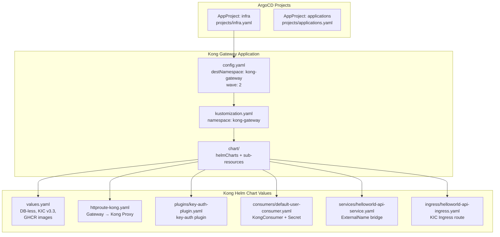
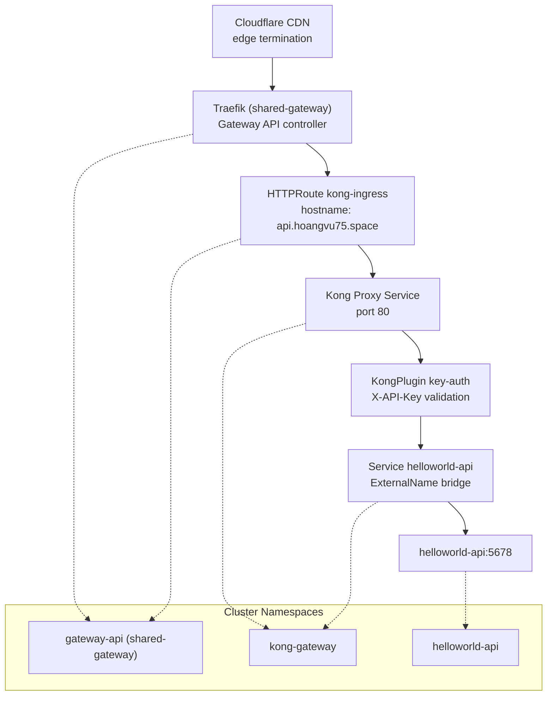
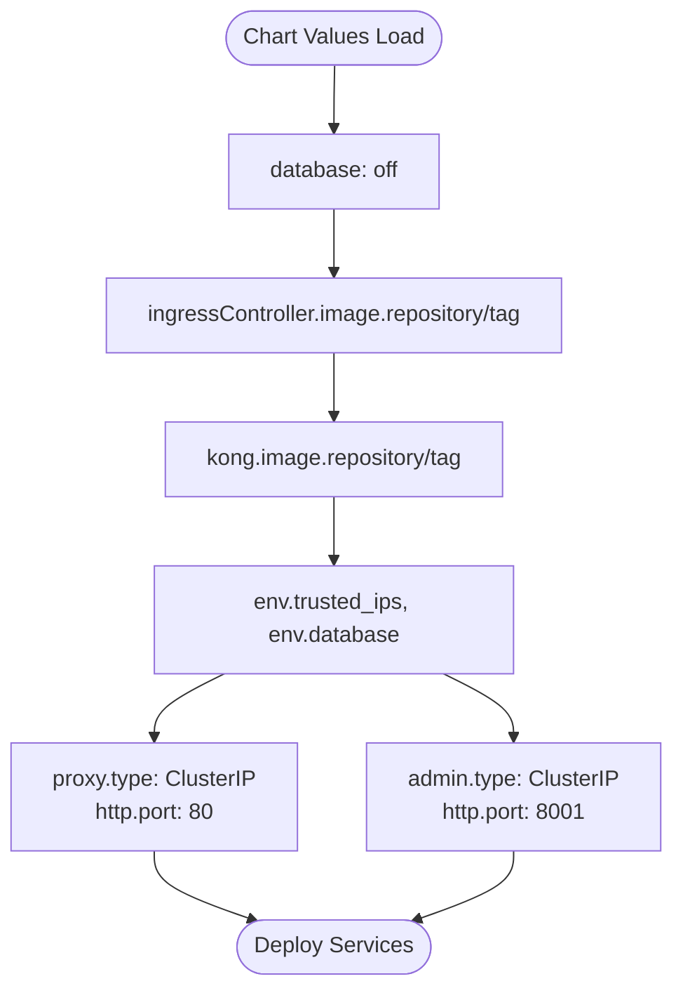
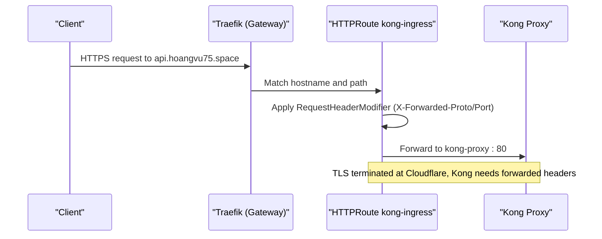
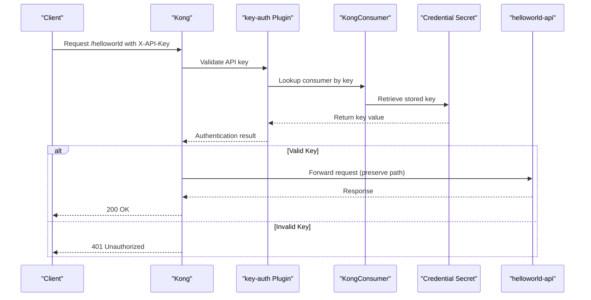
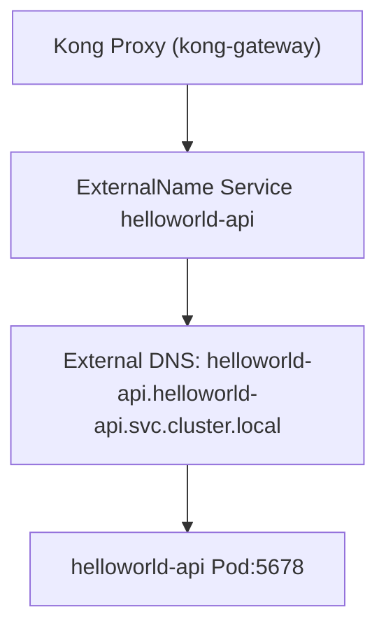
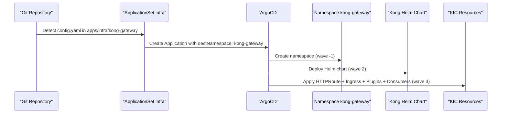
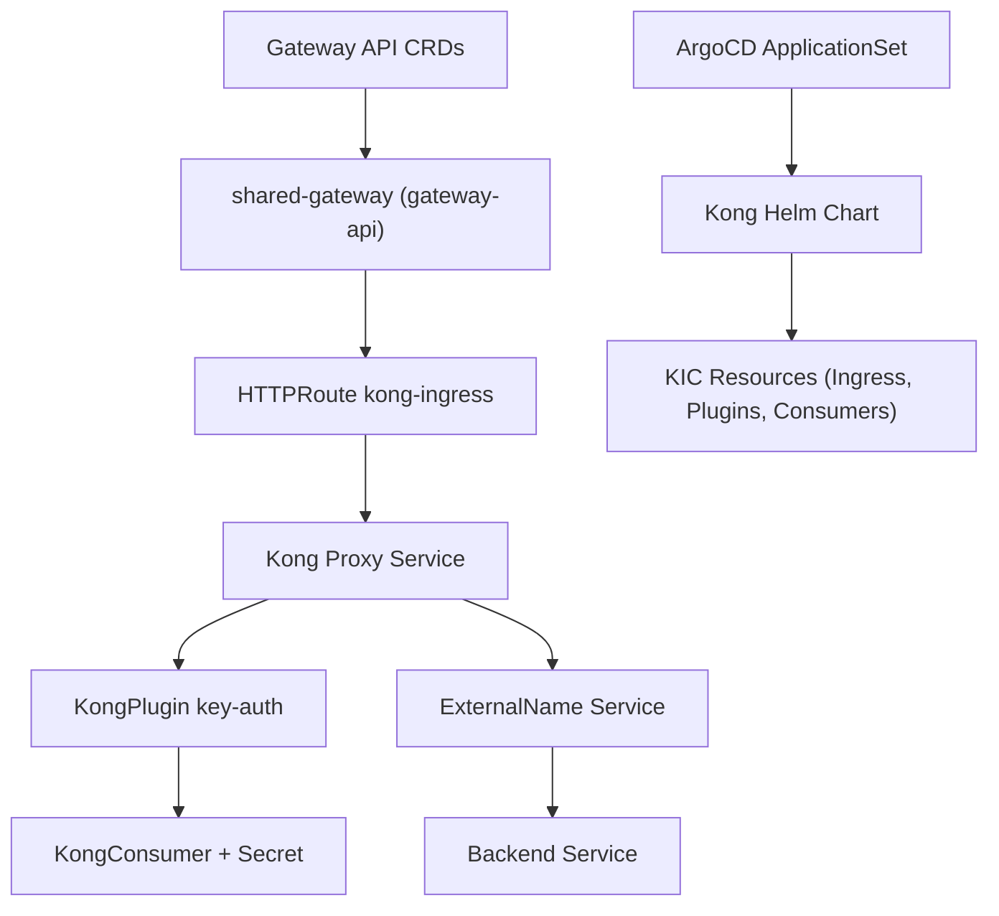

# Kong Gateway Integration

<cite>
**Referenced Files in This Document**
- [values.yaml](file://apps/infra/kong-gateway/chart/values.yaml)
- [kustomization.yaml](file://apps/infra/kong-gateway/chart/kustomization.yaml)
- [httproute-kong.yaml](file://apps/infra/kong-gateway/chart/httproute-kong.yaml)
- [key-auth-plugin.yaml](file://apps/infra/kong-gateway/chart/plugins/key-auth-plugin.yaml)
- [default-user-consumer.yaml](file://apps/infra/kong-gateway/chart/consumers/default-user-consumer.yaml)
- [helloworld-api-service.yaml](file://apps/infra/kong-gateway/chart/services/helloworld-api-service.yaml)
- [helloworld-api-ingress.yaml](file://apps/infra/kong-gateway/chart/ingress/helloworld-api-ingress.yaml)
- [config.yaml](file://apps/infra/kong-gateway/config.yaml)
- [kustomization.yaml](file://apps/infra/kong-gateway/kustomization.yaml)
- [README.md](file://guide/6. kong_gateway/README.md)
- [README.md](file://README.md)
- [httproute-argocd.yaml](file://apps/infra/argocd-ingress/chart/httproute-argocd.yaml)
- [httproute-rancher.yaml](file://apps/infra/rancher/chart/httproute-rancher.yaml)
- [infra.yaml](file://projects/infra.yaml)
- [applications.yaml](file://projects/applications.yaml)
</cite>

## Table of Contents
1. [Introduction](#introduction)
2. [Project Structure](#project-structure)
3. [Core Components](#core-components)
4. [Architecture Overview](#architecture-overview)
5. [Detailed Component Analysis](#detailed-component-analysis)
6. [Dependency Analysis](#dependency-analysis)
7. [Performance Considerations](#performance-considerations)
8. [Troubleshooting Guide](#troubleshooting-guide)
9. [Conclusion](#conclusion)

## Introduction
This document explains the Kong Gateway integration within the GitOps-managed Kubernetes cluster. It focuses on how Kong is deployed as an API authentication layer between Traefik and backend applications, using the Kong Ingress Controller (KIC) and Kubernetes Gateway API. The integration leverages ArgoCD ApplicationSets to automatically discover and deploy Kong resources, enabling API key authentication for protected endpoints.

## Project Structure
The Kong Gateway integration is organized under the infrastructure applications path. The structure supports declarative deployment via Helm and Kustomize, with ArgoCD managing synchronization across sync waves.

**Diagram sources**
- [infra.yaml:24-86](file://projects/infra.yaml#L24-L86)
- [applications.yaml:24-85](file://projects/applications.yaml#L24-L85)
- [config.yaml:1-4](file://apps/infra/kong-gateway/config.yaml#L1-L4)
- [kustomization.yaml:1-8](file://apps/infra/kong-gateway/kustomization.yaml#L1-L8)
- [kustomization.yaml:4-18](file://apps/infra/kong-gateway/chart/kustomization.yaml#L4-L18)
- [values.yaml:1-39](file://apps/infra/kong-gateway/chart/values.yaml#L1-L39)
- [httproute-kong.yaml:1-30](file://apps/infra/kong-gateway/chart/httproute-kong.yaml#L1-L30)
- [key-auth-plugin.yaml:1-12](file://apps/infra/kong-gateway/chart/plugins/key-auth-plugin.yaml#L1-L12)
- [default-user-consumer.yaml:1-24](file://apps/infra/kong-gateway/chart/consumers/default-user-consumer.yaml#L1-L24)
- [helloworld-api-service.yaml:1-11](file://apps/infra/kong-gateway/chart/services/helloworld-api-service.yaml#L1-L11)
- [helloworld-api-ingress.yaml:1-21](file://apps/infra/kong-gateway/chart/ingress/helloworld-api-ingress.yaml#L1-L21)

**Section sources**
- [README.md:122-149](file://README.md#L122-L149)
- [README.md:96-150](file://README.md#L96-L150)

## Core Components
- Kong Helm Chart Values: Defines DB-less operation, KIC configuration, image sources, and service ports.
- HTTPRoute for Kong: Routes traffic from the shared Gateway to the Kong Proxy service.
- KongPlugin: Enables key-auth authentication globally or per route.
- KongConsumer and Secret: Creates API key credentials for clients.
- KIC Ingress: Translates Kubernetes Ingress into Kong routes and attaches plugins.
- ExternalName Service: Bridges cross-namespace backend access from the kong-gateway namespace.

**Section sources**
- [values.yaml:1-39](file://apps/infra/kong-gateway/chart/values.yaml#L1-L39)
- [httproute-kong.yaml:1-30](file://apps/infra/kong-gateway/chart/httproute-kong.yaml#L1-L30)
- [key-auth-plugin.yaml:1-12](file://apps/infra/kong-gateway/chart/plugins/key-auth-plugin.yaml#L1-L12)
- [default-user-consumer.yaml:1-24](file://apps/infra/kong-gateway/chart/consumers/default-user-consumer.yaml#L1-L24)
- [helloworld-api-ingress.yaml:1-21](file://apps/infra/kong-gateway/chart/ingress/helloworld-api-ingress.yaml#L1-L21)
- [helloworld-api-service.yaml:1-11](file://apps/infra/kong-gateway/chart/services/helloworld-api-service.yaml#L1-L11)

## Architecture Overview
The integration establishes a layered ingress flow: Cloudflare → Traefik (shared-gateway) → Kong (key-auth) → backend application. Gateway API HTTPRoutes define hostname-based routing, while Kong handles authentication and route translation via KIC.

**Diagram sources**
- [README.md:5-42](file://README.md#L5-L42)
- [httproute-kong.yaml:1-30](file://apps/infra/kong-gateway/chart/httproute-kong.yaml#L1-L30)
- [helloworld-api-service.yaml:1-11](file://apps/infra/kong-gateway/chart/services/helloworld-api-service.yaml#L1-L11)
- [helloworld-api-ingress.yaml:1-21](file://apps/infra/kong-gateway/chart/ingress/helloworld-api-ingress.yaml#L1-L21)

**Section sources**
- [README.md:44-56](file://README.md#L44-L56)
- [README.md:57-65](file://README.md#L57-L65)

## Detailed Component Analysis

### Kong Helm Chart Configuration
- DB-less Operation: Disables database for simplified deployment.
- KIC Version: Uses a specific KIC image and tag for compatibility.
- Images: Pulls Kong and KIC from GHCR to avoid Docker Hub rate limits.
- Proxy/Admin Services: Defines ClusterIP services for proxy and admin interfaces.
- Environment Variables: Sets trusted IPs and KIC behavior.

**Diagram sources**
- [values.yaml:16-39](file://apps/infra/kong-gateway/chart/values.yaml#L16-L39)

**Section sources**
- [values.yaml:1-39](file://apps/infra/kong-gateway/chart/values.yaml#L1-L39)

### HTTPRoute to Kong Proxy
- Parent Reference: Attaches to the shared Gateway named "shared-gateway".
- Hostname: Restricts routing to "api.hoangvu75.space".
- Header Filters: Sets forwarded protocol and port for proper HTTPS detection behind Cloudflare.
- Backend: Routes to the Kong Proxy service on port 80.

**Diagram sources**
- [httproute-kong.yaml:1-30](file://apps/infra/kong-gateway/chart/httproute-kong.yaml#L1-L30)

**Section sources**
- [httproute-kong.yaml:1-30](file://apps/infra/kong-gateway/chart/httproute-kong.yaml#L1-L30)

### API Key Authentication Flow
- KongPlugin: Enables key-auth with configurable key names and credential hiding.
- KongConsumer: Associates a username with a credential secret.
- Secret: Stores the API key value used for authentication.
- KIC Ingress: Applies the plugin to specific routes and preserves original paths.

**Diagram sources**
- [key-auth-plugin.yaml:1-12](file://apps/infra/kong-gateway/chart/plugins/key-auth-plugin.yaml#L1-L12)
- [default-user-consumer.yaml:1-24](file://apps/infra/kong-gateway/chart/consumers/default-user-consumer.yaml#L1-L24)
- [helloworld-api-ingress.yaml:1-21](file://apps/infra/kong-gateway/chart/ingress/helloworld-api-ingress.yaml#L1-L21)

**Section sources**
- [key-auth-plugin.yaml:1-12](file://apps/infra/kong-gateway/chart/plugins/key-auth-plugin.yaml#L1-L12)
- [default-user-consumer.yaml:1-24](file://apps/infra/kong-gateway/chart/consumers/default-user-consumer.yaml#L1-L24)
- [helloworld-api-ingress.yaml:1-21](file://apps/infra/kong-gateway/chart/ingress/helloworld-api-ingress.yaml#L1-L21)

### Cross-Namespace Backend Bridge
- ExternalName Service: Allows Kong Proxy to reach backend services in different namespaces by referencing the external cluster DNS name.
- Placement: Located in the kong-gateway namespace to satisfy KIC/Kong constraints.

**Diagram sources**
- [helloworld-api-service.yaml:1-11](file://apps/infra/kong-gateway/chart/services/helloworld-api-service.yaml#L1-L11)

**Section sources**
- [helloworld-api-service.yaml:1-11](file://apps/infra/kong-gateway/chart/services/helloworld-api-service.yaml#L1-L11)

### ArgoCD Discovery and Sync Waves
- ApplicationSet Discovery: Scans for config.yaml files under apps/infra to create Applications.
- Sync Waves: Control order of deployment:
  - Wave -2: AppProjects
  - Wave -1: Namespaces
  - Wave 0: ApplicationSets and Traefik
  - Wave 1: Secrets
  - Wave 2: Kong and other mid-tier resources
  - Wave 3: HTTPRoutes and KIC resources (Ingress, KongPlugin, KongConsumer)

**Diagram sources**
- [infra.yaml:33-86](file://projects/infra.yaml#L33-L86)
- [config.yaml:1-4](file://apps/infra/kong-gateway/config.yaml#L1-L4)
- [README.md:85-95](file://README.md#L85-L95)

**Section sources**
- [infra.yaml:24-86](file://projects/infra.yaml#L24-L86)
- [applications.yaml:24-85](file://projects/applications.yaml#L24-L85)
- [config.yaml:1-4](file://apps/infra/kong-gateway/config.yaml#L1-L4)
- [README.md:85-95](file://README.md#L85-L95)

## Dependency Analysis
The Kong integration depends on:
- Gateway API CRDs and shared gateway for routing.
- Kong Ingress Controller for translating Kubernetes resources to Kong routes.
- KongPlugin and KongConsumer for authentication.
- ExternalName Service for cross-namespace backend access.
- ArgoCD ApplicationSets for automated discovery and deployment.

**Diagram sources**
- [README.md:5-42](file://README.md#L5-L42)
- [httproute-kong.yaml:1-30](file://apps/infra/kong-gateway/chart/httproute-kong.yaml#L1-L30)
- [key-auth-plugin.yaml:1-12](file://apps/infra/kong-gateway/chart/plugins/key-auth-plugin.yaml#L1-L12)
- [default-user-consumer.yaml:1-24](file://apps/infra/kong-gateway/chart/consumers/default-user-consumer.yaml#L1-L24)
- [helloworld-api-service.yaml:1-11](file://apps/infra/kong-gateway/chart/services/helloworld-api-service.yaml#L1-L11)
- [kustomization.yaml:4-18](file://apps/infra/kong-gateway/chart/kustomization.yaml#L4-L18)

**Section sources**
- [README.md:184-189](file://README.md#L184-L189)

## Performance Considerations
- DB-less Mode: Reduces operational overhead but restricts advanced features like OAuth2 token storage.
- KIC Enabled: Required for ArgoCD builds; disabling it breaks the pipeline.
- Image Sources: Using GHCR avoids Docker Hub rate limits and improves reliability.
- Namespace Constraints: ExternalName services are necessary when backends are outside kong-gateway.

[No sources needed since this section provides general guidance]

## Troubleshooting Guide
Common issues and resolutions:
- KIC Wipes DB-less Config: Routes disappear because KIC manages configuration via CRDs; ensure CRD-based setup is used.
- Credential Not Created: Verify KongConsumer includes the credentials array referencing the Secret.
- KIC Disabled Breaks Build: Keep ingressController.enabled true; manage configuration via CRDs.
- Docker Hub Rate Limits: Switch to GHCR images as configured in values.yaml.
- Namespace Override by ArgoCD: Use ExternalName services for cross-namespace backends.
- Hard-coded KIC Environment: Cannot disable KIC via values; keep enabled and rely on CRDs.
- OAuth2 Incompatibility: OAuth2 requires PostgreSQL; use key-auth for DB-less deployments.

**Section sources**
- [README.md:137-148](file://guide/6. kong_gateway/README.md#L137-L148)

## Conclusion
The Kong Gateway integration provides a robust, GitOps-driven API authentication layer. By leveraging Gateway API HTTPRoutes, KIC-managed CRDs, and ArgoCD ApplicationSets, the system achieves predictable deployments with clear sync ordering. The DB-less configuration simplifies operations while maintaining strong security through API key authentication.