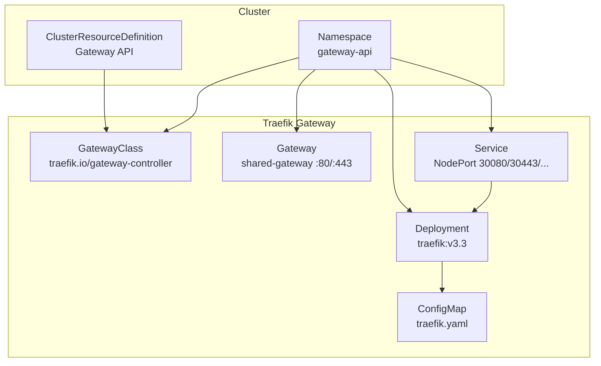
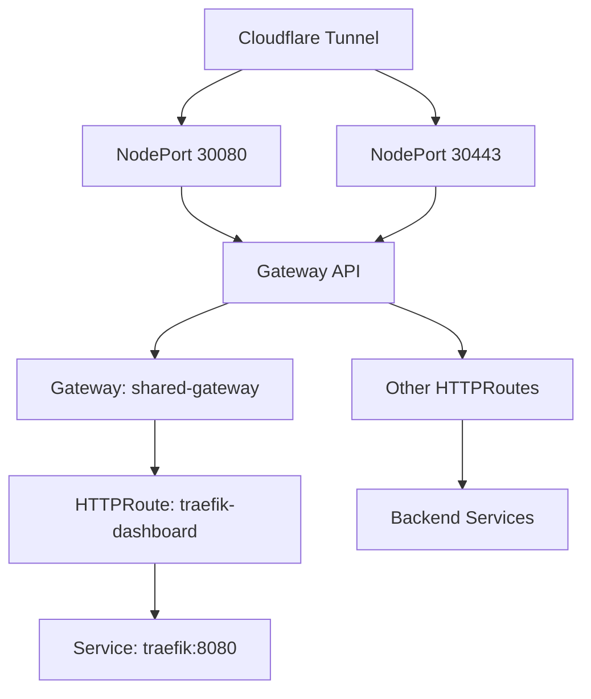
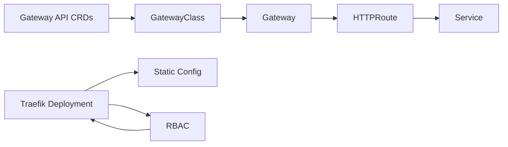

# Traefik Gateway v3.3

<cite>
**Referenced Files in This Document**
- [README.md](file://README.md)
- [gateway.yaml](file://apps/infra/traefik-gateway/chart/gateway.yaml)
- [gatewayclass.yaml](file://apps/infra/traefik-gateway/chart/gatewayclass.yaml)
- [traefik.yaml](file://apps/infra/traefik-gateway/chart/traefik.yaml)
- [traefik-static.yaml](file://apps/infra/traefik-gateway/chart/traefik-static.yaml)
- [httproute-traefik-dashboard.yaml](file://apps/infra/traefik-gateway/chart/httproute-traefik-dashboard.yaml)
- [kustomization.yaml](file://apps/infra/traefik-gateway/kustomization.yaml)
- [config.yaml](file://apps/infra/traefik-gateway/config.yaml)
- [ingressroutetcp.yaml](file://apps/applications/tcp-demo/chart/ingressroutetcp.yaml)
- [ingressrouteudp.yaml](file://apps/applications/udp-demo/chart/ingressrouteudp.yaml)
- [service.yaml](file://apps/applications/tcp-demo/chart/service.yaml)
- [service.yaml](file://apps/applications/udp-demo/chart/service.yaml)
- [README.md](file://guide/6. kong_gateway/README.md)
</cite>

## Table of Contents
1. [Introduction](#introduction)
2. [Project Structure](#project-structure)
3. [Core Components](#core-components)
4. [Architecture Overview](#architecture-overview)
5. [Detailed Component Analysis](#detailed-component-analysis)
6. [Dependency Analysis](#dependency-analysis)
7. [Performance Considerations](#performance-considerations)
8. [Troubleshooting Guide](#troubleshooting-guide)
9. [Conclusion](#conclusion)

## Introduction
This document explains the Traefik Gateway v3.3 implementation in this GitOps repository. It covers how Traefik acts as a Kubernetes Gateway API controller, exposing HTTP/HTTPS/TCP/UDP entry points, integrating with TLS certificates, and forwarding traffic to backend services. It also documents the sync order, RBAC model, and operational characteristics such as metrics, access logging, and tracing.

## Project Structure
The Traefik Gateway stack is organized under apps/infra/traefik-gateway and includes:
- GatewayClass and Gateway resources to define the controller and listeners
- A Deployment and Service for Traefik v3.3
- Static configuration for entry points, metrics, access log, and tracing
- An HTTPRoute to expose the Traefik dashboard
- Kustomization and config for namespace scoping and ArgoCD sync waves

**Diagram sources**
- [gatewayclass.yaml:1-10](file://apps/infra/traefik-gateway/chart/gatewayclass.yaml#L1-L10)
- [gateway.yaml:1-34](file://apps/infra/traefik-gateway/chart/gateway.yaml#L1-L34)
- [traefik.yaml:57-155](file://apps/infra/traefik-gateway/chart/traefik.yaml#L57-L155)
- [traefik-static.yaml:1-42](file://apps/infra/traefik-gateway/chart/traefik-static.yaml#L1-L42)
- [kustomization.yaml:1-10](file://apps/infra/traefik-gateway/kustomization.yaml#L1-L10)

**Section sources**
- [README.md:117-122](file://README.md#L117-L122)
- [kustomization.yaml:1-10](file://apps/infra/traefik-gateway/kustomization.yaml#L1-L10)
- [config.yaml:1-5](file://apps/infra/traefik-gateway/config.yaml#L1-L5)

## Core Components
- GatewayClass: Declares the controller name and description for Traefik Gateway API implementation.
- Gateway: Defines listeners for HTTP (:80) and HTTPS (:443) with TLS termination and namespace-based route scoping.
- Deployment: Runs Traefik v3.3 with container ports for web, websecure, admin, TCP, UDP, and metrics.
- Service: Exposes Traefik via NodePort on ports 30080/30443/30900/30901/30082.
- RBAC: Grants Traefik permissions to watch Gateway API resources, Services, Endpoints, Secrets, and ConfigMaps.
- Static Config: Enables Kubernetes Gateway provider, sets entry points, metrics, access log, and tracing.

**Section sources**
- [gatewayclass.yaml:1-10](file://apps/infra/traefik-gateway/chart/gatewayclass.yaml#L1-L10)
- [gateway.yaml:1-34](file://apps/infra/traefik-gateway/chart/gateway.yaml#L1-L34)
- [traefik.yaml:57-155](file://apps/infra/traefik-gateway/chart/traefik.yaml#L57-L155)
- [traefik-static.yaml:1-42](file://apps/infra/traefik-gateway/chart/traefik-static.yaml#L1-L42)

## Architecture Overview
Traefik operates as the Gateway API controller in the gateway-api namespace. It exposes NodePorts for HTTP/HTTPS/TCP/UDP and metrics, and integrates with TLS certificates stored as Kubernetes Secrets. HTTPRoutes attached to the shared-gateway forward traffic to backend Services. The dashboard is exposed via an HTTPRoute pointing to the Traefik admin port.

**Diagram sources**
- [README.md:5-42](file://README.md#L5-L42)
- [gateway.yaml:1-34](file://apps/infra/traefik-gateway/chart/gateway.yaml#L1-L34)
- [httproute-traefik-dashboard.yaml:1-30](file://apps/infra/traefik-gateway/chart/httproute-traefik-dashboard.yaml#L1-L30)
- [traefik.yaml:118-155](file://apps/infra/traefik-gateway/chart/traefik.yaml#L118-L155)

## Detailed Component Analysis

### GatewayClass
- Purpose: Registers the Traefik controller with the Gateway API.
- Controller name: Matches the Gateway specification used by the Traefik Gateway controller.
- Sync wave: Ensures proper ordering during ArgoCD synchronization.

**Section sources**
- [gatewayclass.yaml:1-10](file://apps/infra/traefik-gateway/chart/gatewayclass.yaml#L1-L10)

### Gateway
- Purpose: Defines listeners for HTTP and HTTPS protocols.
- HTTP listener: Port 80 with namespace scoping via label selector.
- HTTPS listener: Port 443 with TLS termination and certificate reference to a Secret.
- Allowed routes: Restricted to namespaces labeled for exposure.

**Section sources**
- [gateway.yaml:1-34](file://apps/infra/traefik-gateway/chart/gateway.yaml#L1-L34)

### Traefik Deployment and Service
- Container image: Traefik v3.3.
- Ports: web (:80), websecure (:443), admin (:8080), tcp (:9000), udp (:9001), metrics (:9082).
- NodePort exposure: 30080/30443/30900/30901/30082.
- Metrics: Prometheus scraping enabled.
- RBAC: ClusterRole and ClusterRoleBinding grant necessary permissions.

**Section sources**
- [traefik.yaml:57-155](file://apps/infra/traefik-gateway/chart/traefik.yaml#L57-L155)

### Static Configuration
- Providers: Kubernetes CRD and Kubernetes Gateway providers enabled.
- Entry points: web (:80), websecure (:443), tcp (:9000), udp (:9001/udp), metrics (:9082).
- Metrics: Prometheus exporter configured with entry point and labels.
- Access log: JSON format with status code filtering and field configuration.
- Tracing: OpenTelemetry HTTP exporter sending traces to Datadog.
- Log level: INFO.

**Section sources**
- [traefik-static.yaml:1-42](file://apps/infra/traefik-gateway/chart/traefik-static.yaml#L1-L42)

### HTTPRoute for Dashboard
- Purpose: Exposes the Traefik dashboard at a dedicated hostname.
- Parent reference: Binds to the shared-gateway in the same namespace.
- Filters: Adds forwarded proto and port headers for secure contexts.
- Backend: Routes to the Traefik Service on port 8080.

**Section sources**
- [httproute-traefik-dashboard.yaml:1-30](file://apps/infra/traefik-gateway/chart/httproute-traefik-dashboard.yaml#L1-L30)

### TCP and UDP Routing (Demo)
- TCP demo: IngressRouteTCP listens on the tcp entry point and forwards to a ClusterIP Service.
- UDP demo: IngressRouteUDP listens on the udp entry point and forwards to a ClusterIP Service with UDP protocol.
- Both demos use the Traefik static entry points and are orchestrated by the Gateway.

**Section sources**
- [ingressroutetcp.yaml:1-16](file://apps/applications/tcp-demo/chart/ingressroutetcp.yaml#L1-L16)
- [ingressrouteudp.yaml:1-15](file://apps/applications/udp-demo/chart/ingressrouteudp.yaml#L1-L15)
- [service.yaml:1-14](file://apps/applications/tcp-demo/chart/service.yaml#L1-14)
- [service.yaml:1-15](file://apps/applications/udp-demo/chart/service.yaml#L1-15)

### RBAC and Permissions
- ClusterRole grants read/watch access to Services, Endpoints, Secrets, Namespaces, and Gateway API resources.
- Includes permissions for Traefik CRDs (IngressRouteTCP/UDP, Middlewares, etc.).
- ClusterRoleBinding binds the Role to the ServiceAccount used by the Traefik Deployment.

**Section sources**
- [traefik.yaml:8-43](file://apps/infra/traefik-gateway/chart/traefik.yaml#L8-L43)

### Kustomization and Namespace Management
- Namespace: gateway-api is applied consistently across resources.
- Resources include Gateway API CRDs, CRDs, and the Traefik chart.
- Config: Destinations namespace and sync policy for ArgoCD.

**Section sources**
- [kustomization.yaml:1-10](file://apps/infra/traefik-gateway/kustomization.yaml#L1-L10)
- [config.yaml:1-5](file://apps/infra/traefik-gateway/config.yaml#L1-L5)

## Dependency Analysis
Traefik depends on:
- Gateway API CRDs installed via upstream release
- Kubernetes Gateway provider to reconcile Gateway and HTTPRoute resources
- RBAC to watch and manage Gateway API resources and backend Services
- Static configuration for entry points and observability

**Diagram sources**
- [kustomization.yaml:7](file://apps/infra/traefik-gateway/kustomization.yaml#L7)
- [gatewayclass.yaml:1-10](file://apps/infra/traefik-gateway/chart/gatewayclass.yaml#L1-L10)
- [gateway.yaml:1-34](file://apps/infra/traefik-gateway/chart/gateway.yaml#L1-L34)
- [httproute-traefik-dashboard.yaml:1-30](file://apps/infra/traefik-gateway/chart/httproute-traefik-dashboard.yaml#L1-L30)
- [traefik.yaml:57-155](file://apps/infra/traefik-gateway/chart/traefik.yaml#L57-L155)

**Section sources**
- [kustomization.yaml:7](file://apps/infra/traefik-gateway/kustomization.yaml#L7)
- [traefik-static.yaml:5-8](file://apps/infra/traefik-gateway/chart/traefik-static.yaml#L5-L8)

## Performance Considerations
- Resource requests and limits are modest, suitable for low-to-moderate traffic.
- Metrics endpoint is enabled for monitoring and alerting.
- Access logs are filtered and formatted for efficient processing.
- Tracing is configured to Datadog for distributed tracing.

[No sources needed since this section provides general guidance]

## Troubleshooting Guide
- Verify GatewayClass and Gateway exist in the gateway-api namespace and are reconciled.
- Confirm the Traefik Deployment is running and the Service exposes NodePorts.
- Check HTTPRoute binding to the Gateway and backend Service reachability.
- Review Traefik logs for provider reconciliation errors or misconfigurations.
- Validate TLS certificate Secret availability and permissions.

**Section sources**
- [gatewayclass.yaml:1-10](file://apps/infra/traefik-gateway/chart/gatewayclass.yaml#L1-L10)
- [gateway.yaml:1-34](file://apps/infra/traefik-gateway/chart/gateway.yaml#L1-L34)
- [traefik.yaml:57-155](file://apps/infra/traefik-gateway/chart/traefik.yaml#L57-L155)
- [traefik-static.yaml:22-42](file://apps/infra/traefik-gateway/chart/traefik-static.yaml#L22-L42)

## Conclusion
The Traefik Gateway v3.3 setup provides a robust, standards-based ingress solution integrated with Gateway API, TLS termination, and observability. Its configuration is GitOps-friendly, with clear sync ordering and namespace scoping to support predictable deployments across environments.