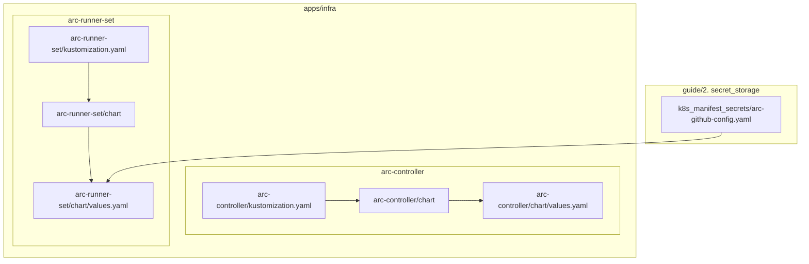
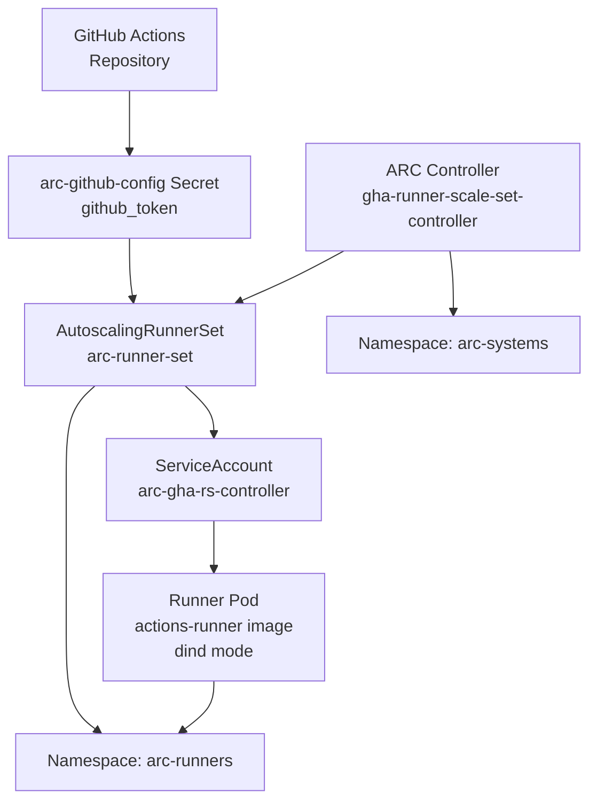
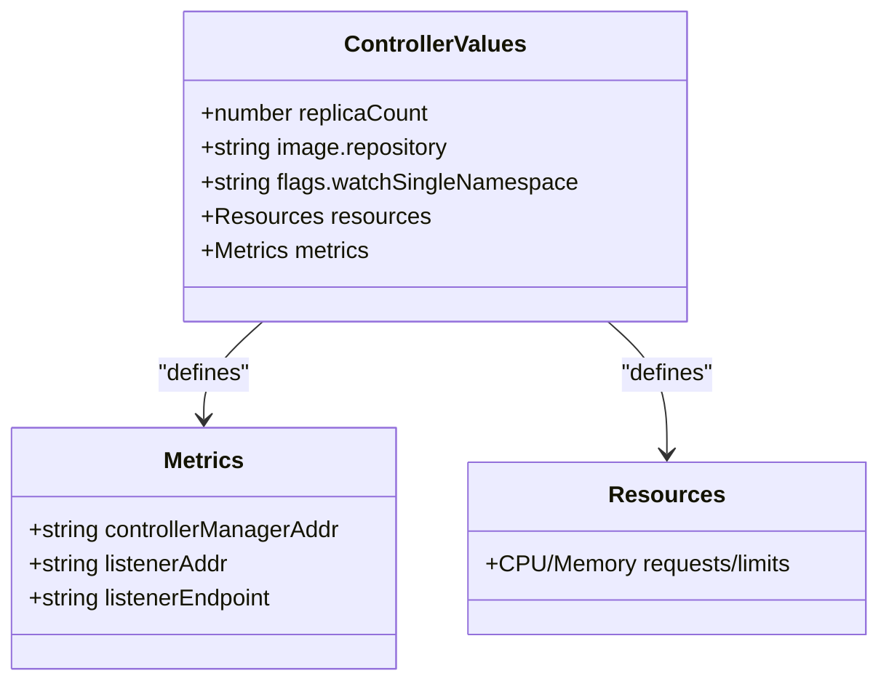
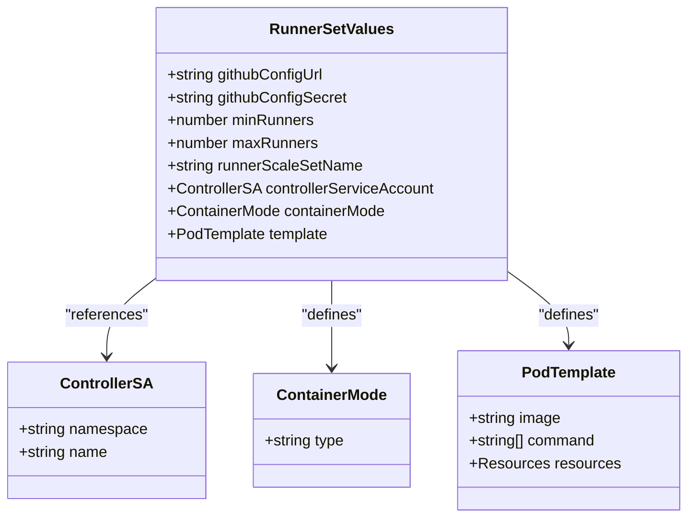
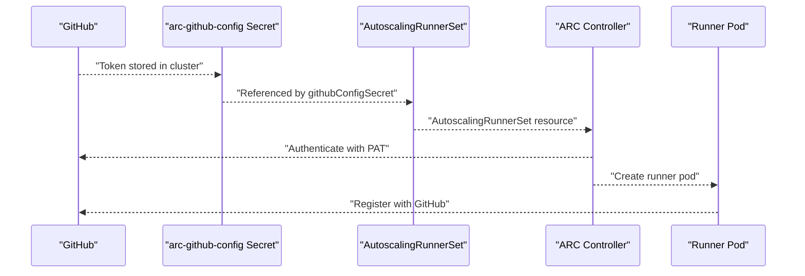
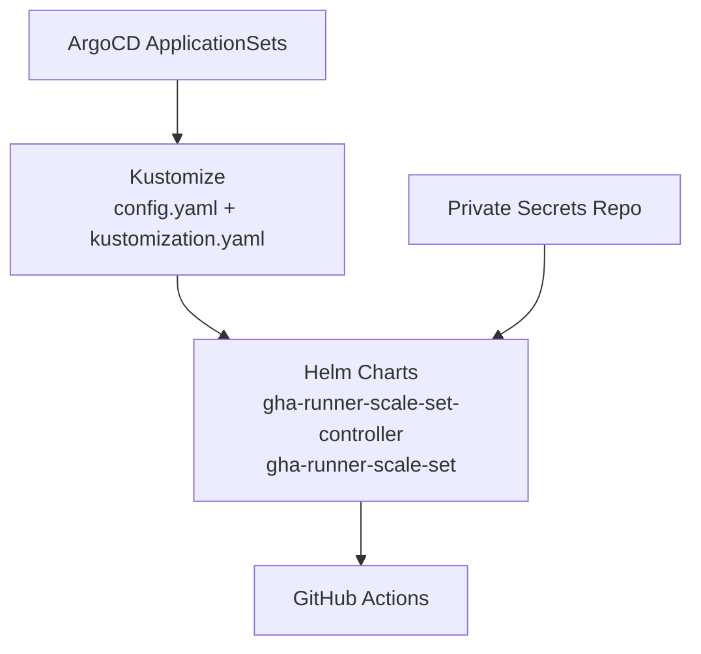

# GitHub Actions Runner Controller

<cite>
**Referenced Files in This Document**
- [README.md](file://README.md)
- [arc-controller config.yaml](file://apps/infra/arc-controller/config.yaml)
- [arc-controller kustomization.yaml](file://apps/infra/arc-controller/kustomization.yaml)
- [arc-controller chart kustomization.yaml](file://apps/infra/arc-controller/chart/kustomization.yaml)
- [arc-controller chart values.yaml](file://apps/infra/arc-controller/chart/values.yaml)
- [arc-runner-set config.yaml](file://apps/infra/arc-runner-set/config.yaml)
- [arc-runner-set kustomization.yaml](file://apps/infra/arc-runner-set/kustomization.yaml)
- [arc-runner-set chart kustomization.yaml](file://apps/infra/arc-runner-set/chart/kustomization.yaml)
- [arc-runner-set chart values.yaml](file://apps/infra/arc-runner-set/chart/values.yaml)
- [arc-github-config.yaml](file://guide/2. secret_storage/k8s_manifest_secrets/arc-github-config.yaml)
</cite>

## Table of Contents
1. [Introduction](#introduction)
2. [Project Structure](#project-structure)
3. [Core Components](#core-components)
4. [Architecture Overview](#architecture-overview)
5. [Detailed Component Analysis](#detailed-component-analysis)
6. [Dependency Analysis](#dependency-analysis)
7. [Performance Considerations](#performance-considerations)
8. [Troubleshooting Guide](#troubleshooting-guide)
9. [Conclusion](#conclusion)

## Introduction
This document describes the GitHub Actions Runner Controller (ARC) implementation in the cluster, focusing on the Autoscaling Runner Scale Sets (ARSS) mode. The ARC consists of two primary parts:
- ARC Controller: Watches and manages AutoscalingRunnerSet resources in the arc-runners namespace
- ARC Runner Set: A self-hosted runner scale set that dynamically provisions runners on-demand

The implementation leverages Actions Runner Controller Helm charts from the official GitHub Actions registry, configured via Kustomize and ArgoCD ApplicationSets. Runners are ephemeral and scale from 0 to N based on queued jobs, integrating with GitHub via a personal access token stored in a cluster Secret.

## Project Structure
The ARC components are organized under apps/infra with dedicated folders for controller and runner set, each containing Kustomize configuration and Helm chart references.

**Diagram sources**
- [arc-controller kustomization.yaml:1-8](file://apps/infra/arc-controller/kustomization.yaml#L1-L8)
- [arc-controller chart kustomization.yaml:1-11](file://apps/infra/arc-controller/chart/kustomization.yaml#L1-L11)
- [arc-controller chart values.yaml:1-21](file://apps/infra/arc-controller/chart/values.yaml#L1-L21)
- [arc-runner-set kustomization.yaml:1-8](file://apps/infra/arc-runner-set/kustomization.yaml#L1-L8)
- [arc-runner-set chart kustomization.yaml:1-11](file://apps/infra/arc-runner-set/chart/kustomization.yaml#L1-L11)
- [arc-runner-set chart values.yaml:1-30](file://apps/infra/arc-runner-set/chart/values.yaml#L1-L30)
- [arc-github-config.yaml:1-8](file://guide/2. secret_storage/k8s_manifest_secrets/arc-github-config.yaml#L1-L8)

**Section sources**
- [README.md:180-196](file://README.md#L180-L196)
- [arc-controller config.yaml:1-4](file://apps/infra/arc-controller/config.yaml#L1-L4)
- [arc-controller kustomization.yaml:1-8](file://apps/infra/arc-controller/kustomization.yaml#L1-L8)
- [arc-runner-set config.yaml:1-4](file://apps/infra/arc-runner-set/config.yaml#L1-L4)
- [arc-runner-set kustomization.yaml:1-8](file://apps/infra/arc-runner-set/kustomization.yaml#L1-L8)

## Core Components
- ARC Controller (gha-runner-scale-set-controller)
  - Watches the arc-runners namespace for AutoscalingRunnerSet resources
  - Exposes metrics endpoint for monitoring
  - Runs as a single replica with constrained CPU/memory resources

- ARC Runner Set (gha-runner-scale-set)
  - Self-hosted runner scale set named "arc-runner-set"
  - Scales 0..N runners based on job queue
  - Uses Docker-in-Docker (dind) container mode
  - Runner image ghcr.io/actions/actions-runner:latest
  - Authentication via GitHub PAT stored in arc-github-config Secret

**Section sources**
- [arc-controller chart values.yaml:1-21](file://apps/infra/arc-controller/chart/values.yaml#L1-L21)
- [arc-runner-set chart values.yaml:1-30](file://apps/infra/arc-runner-set/chart/values.yaml#L1-L30)
- [arc-github-config.yaml:1-8](file://guide/2. secret_storage/k8s_manifest_secrets/arc-github-config.yaml#L1-L8)

## Architecture Overview
The ARC system integrates with GitHub via a Personal Access Token and provisions runners on-demand. The controller watches AutoscalingRunnerSet resources and orchestrates runner pods according to scaling policies.

**Diagram sources**
- [arc-controller chart values.yaml:7-8](file://apps/infra/arc-controller/chart/values.yaml#L7-L8)
- [arc-runner-set chart values.yaml:1-30](file://apps/infra/arc-runner-set/chart/values.yaml#L1-L30)
- [arc-runner-set chart values.yaml:10-12](file://apps/infra/arc-runner-set/chart/values.yaml#L10-L12)
- [arc-github-config.yaml:7-8](file://guide/2. secret_storage/k8s_manifest_secrets/arc-github-config.yaml#L7-L8)

## Detailed Component Analysis

### ARC Controller Analysis
The controller is deployed via Helm chart gha-runner-scale-set-controller and configured to watch the arc-runners namespace. It exposes metrics on port 8080 and runs with modest resource requests/limits.

**Diagram sources**
- [arc-controller chart values.yaml:1-21](file://apps/infra/arc-controller/chart/values.yaml#L1-L21)

**Section sources**
- [arc-controller chart kustomization.yaml:1-11](file://apps/infra/arc-controller/chart/kustomization.yaml#L1-L11)
- [arc-controller chart values.yaml:1-21](file://apps/infra/arc-controller/chart/values.yaml#L1-L21)
- [arc-controller config.yaml:1-4](file://apps/infra/arc-controller/config.yaml#L1-L4)

### ARC Runner Set Analysis
The runner set is deployed via Helm chart gha-runner-scale-set with the following key characteristics:
- GitHub configuration URL and Secret name
- Scaling bounds: minRunners=0, maxRunners=5
- Runner scale set name: arc-runner-set
- Controller ServiceAccount in arc-systems namespace
- Container mode: dind
- Runner template with CPU/memory requests/limits
- Default runner image ghcr.io/actions/actions-runner:latest

**Diagram sources**
- [arc-runner-set chart values.yaml:1-30](file://apps/infra/arc-runner-set/chart/values.yaml#L1-L30)

**Section sources**
- [arc-runner-set chart kustomization.yaml:1-11](file://apps/infra/arc-runner-set/chart/kustomization.yaml#L1-L11)
- [arc-runner-set chart values.yaml:1-30](file://apps/infra/arc-runner-set/chart/values.yaml#L1-L30)
- [arc-runner-set config.yaml:1-4](file://apps/infra/arc-runner-set/config.yaml#L1-L4)

### GitHub Authentication Flow
The runner set authenticates with GitHub using a Personal Access Token stored in a cluster Secret. The controller uses this token to register and manage runners.

**Diagram sources**
- [arc-runner-set chart values.yaml:1-3](file://apps/infra/arc-runner-set/chart/values.yaml#L1-L3)
- [arc-github-config.yaml:7-8](file://guide/2. secret_storage/k8s_manifest_secrets/arc-github-config.yaml#L7-L8)
- [arc-controller chart values.yaml:7-8](file://apps/infra/arc-controller/chart/values.yaml#L7-L8)

**Section sources**
- [arc-runner-set chart values.yaml:1-3](file://apps/infra/arc-runner-set/chart/values.yaml#L1-L3)
- [arc-github-config.yaml:1-8](file://guide/2. secret_storage/k8s_manifest_secrets/arc-github-config.yaml#L1-L8)

## Dependency Analysis
The ARC system depends on several layers:
- ArgoCD ApplicationSets discover and deploy the ARC components
- Kustomize injects namespace and sync-wave annotations
- Helm charts from ghcr.io/actions/actions-runner-controller-charts
- Private secrets repository for credentials
- GitHub for authentication and job dispatch

**Diagram sources**
- [README.md:66-95](file://README.md#L66-L95)
- [arc-controller kustomization.yaml:1-8](file://apps/infra/arc-controller/kustomization.yaml#L1-L8)
- [arc-runner-set kustomization.yaml:1-8](file://apps/infra/arc-runner-set/kustomization.yaml#L1-L8)
- [arc-runner-set chart kustomization.yaml:4-10](file://apps/infra/arc-runner-set/chart/kustomization.yaml#L4-L10)

**Section sources**
- [README.md:66-95](file://README.md#L66-L95)
- [arc-controller config.yaml:1-4](file://apps/infra/arc-controller/config.yaml#L1-L4)
- [arc-runner-set config.yaml:1-4](file://apps/infra/arc-runner-set/config.yaml#L1-L4)

## Performance Considerations
- Resource allocation: Runner pods specify CPU and memory requests/limits suitable for typical CI workloads
- Scaling policy: minRunners=0 allows cost savings when idle; maxRunners=5 caps concurrent runners
- Metrics: Controller exposes Prometheus-compatible metrics for monitoring
- Namespace isolation: Controller watches arc-runners only, reducing overhead

[No sources needed since this section provides general guidance]

## Troubleshooting Guide
Common issues and resolutions:
- Authentication failures: Verify github_token exists in arc-github-config Secret
- Controller not watching: Confirm watchSingleNamespace flag targets arc-runners
- No runners scaling: Check AutoscalingRunnerSet resource presence and min/max values
- Resource exhaustion: Review runner pod resource requests/limits and cluster capacity

**Section sources**
- [arc-runner-set chart values.yaml:1-30](file://apps/infra/arc-runner-set/chart/values.yaml#L1-L30)
- [arc-controller chart values.yaml:7-8](file://apps/infra/arc-controller/chart/values.yaml#L7-L8)
- [arc-github-config.yaml:7-8](file://guide/2. secret_storage/k8s_manifest_secrets/arc-github-config.yaml#L7-L8)

## Conclusion
The GitHub Actions Runner Controller implementation provides a scalable, GitOps-friendly solution for self-hosted runners. By leveraging ArgoCD, Kustomize, and Helm, the system achieves automated provisioning and scaling of runners while maintaining security through centralized secret management and namespace isolation.