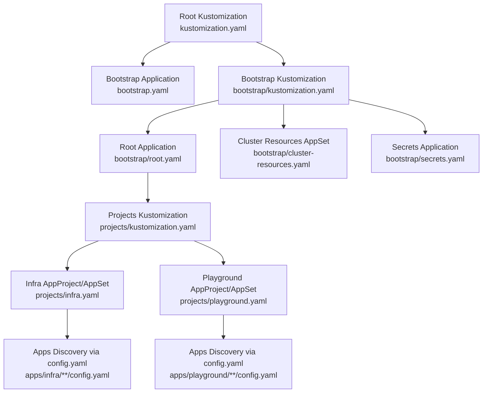
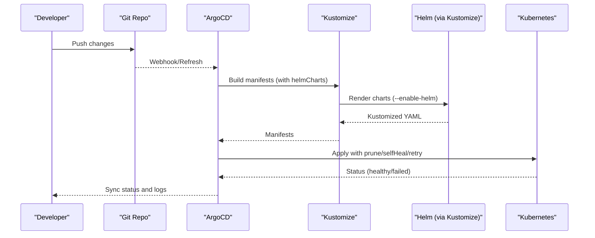
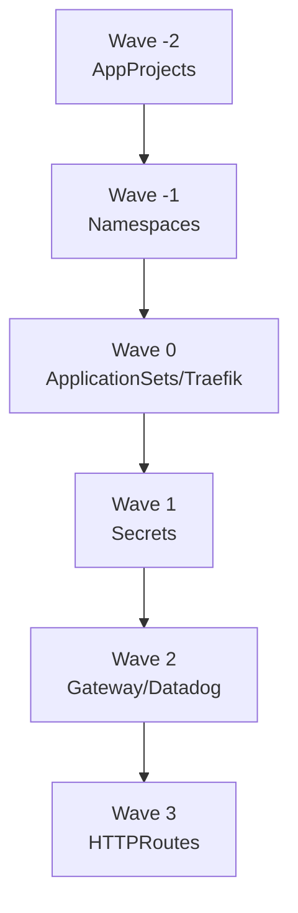
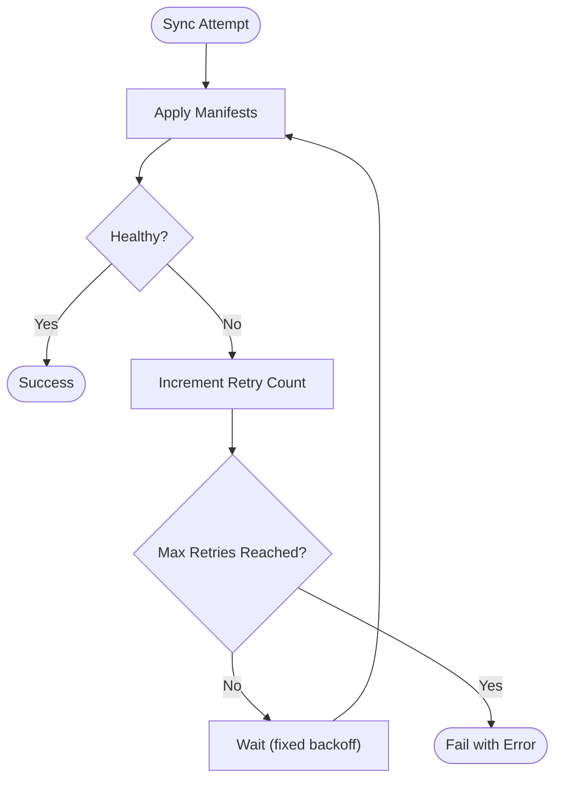
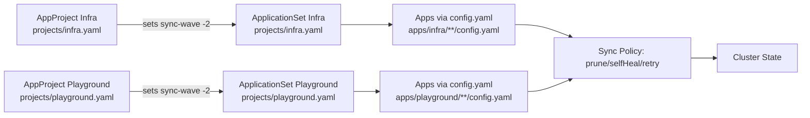

# Operational Features

<cite>
**Referenced Files in This Document**
- [README.md](file://README.md)
- [bootstrap.yaml](file://bootstrap.yaml)
- [kustomization.yaml](file://kustomization.yaml)
- [bootstrap/kustomization.yaml](file://bootstrap/kustomization.yaml)
- [bootstrap/root.yaml](file://bootstrap/root.yaml)
- [bootstrap/cluster-resources.yaml](file://bootstrap/cluster-resources.yaml)
- [bootstrap/secrets.yaml](file://bootstrap/secrets.yaml)
- [projects/kustomization.yaml](file://projects/kustomization.yaml)
- [projects/infra.yaml](file://projects/infra.yaml)
- [projects/playground.yaml](file://projects/playground.yaml)
- [apps/infra/gateway-api/config.yaml](file://apps/infra/gateway-api/config.yaml)
- [apps/infra/datadog/config.yaml](file://apps/infra/datadog/config.yaml)
- [apps/playground/argocd-ingress/config.yaml](file://apps/playground/argocd-ingress/config.yaml)
</cite>

## Table of Contents
1. [Introduction](#introduction)
2. [Project Structure](#project-structure)
3. [Core Components](#core-components)
4. [Architecture Overview](#architecture-overview)
5. [Detailed Component Analysis](#detailed-component-analysis)
6. [Dependency Analysis](#dependency-analysis)
7. [Performance Considerations](#performance-considerations)
8. [Troubleshooting Guide](#troubleshooting-guide)
9. [Conclusion](#conclusion)
10. [Appendices](#appendices)

## Introduction
This document explains the operational features that ensure system reliability and maintainability in this GitOps-driven Kubernetes cluster. It focuses on:
- Sync wave ordering (-2 to +3) and how it controls deployment sequence and dependency resolution
- Pruning and self-healing mechanisms that keep cluster state consistent
- Retry policies and error handling strategies
- Monitoring approaches for detecting and resolving deployment issues
- Operational procedures for troubleshooting, rollbacks, and disaster recovery
- Best practices for system health, performance optimization, and capacity planning

## Project Structure
The repository follows a layered GitOps structure:
- Root Kustomize composes a bootstrap Application that points to the bootstrap directory
- The bootstrap directory defines the root Application and ApplicationSets for infrastructure and playground projects
- Projects define AppProjects and ApplicationSets that discover applications via config.yaml files
- Applications render Kustomize manifests (with Helm support) and are synced by ArgoCD

**Diagram sources**
- [kustomization.yaml:1-21](file://kustomization.yaml#L1-L21)
- [bootstrap.yaml:1-26](file://bootstrap.yaml#L1-L26)
- [bootstrap/kustomization.yaml:1-38](file://bootstrap/kustomization.yaml#L1-L38)
- [bootstrap/root.yaml:1-37](file://bootstrap/root.yaml#L1-L37)
- [bootstrap/cluster-resources.yaml:1-33](file://bootstrap/cluster-resources.yaml#L1-L33)
- [bootstrap/secrets.yaml:1-24](file://bootstrap/secrets.yaml#L1-L24)
- [projects/kustomization.yaml:1-22](file://projects/kustomization.yaml#L1-L22)
- [projects/infra.yaml:1-85](file://projects/infra.yaml#L1-L85)
- [projects/playground.yaml:1-90](file://projects/playground.yaml#L1-L90)

**Section sources**
- [README.md:57-118](file://README.md#L57-L118)
- [kustomization.yaml:1-21](file://kustomization.yaml#L1-L21)
- [bootstrap/kustomization.yaml:1-38](file://bootstrap/kustomization.yaml#L1-L38)
- [projects/kustomization.yaml:1-22](file://projects/kustomization.yaml#L1-L22)

## Core Components
- Bootstrap Application: Applies bootstrap resources and seeds the root Application
- Root Application: Points to projects and manages AppProjects and ApplicationSets
- AppProjects: Define project-level policies and sync waves
- ApplicationSets: Discover and generate Applications from config.yaml files
- Applications: Render Kustomize manifests (including Helm) and apply automated policies

Key operational policies:
- Automated sync with prune and self-heal enabled
- Retry policy with bounded backoff
- Sync waves for deterministic ordering
- Namespace creation options and dry-run skipping for robustness

**Section sources**
- [bootstrap.yaml:19-25](file://bootstrap.yaml#L19-L25)
- [bootstrap/root.yaml:29-36](file://bootstrap/root.yaml#L29-L36)
- [bootstrap/cluster-resources.yaml:29-32](file://bootstrap/cluster-resources.yaml#L29-L32)
- [bootstrap/secrets.yaml:18-23](file://bootstrap/secrets.yaml#L18-L23)
- [projects/infra.yaml:5-6](file://projects/infra.yaml#L5-L6)
- [projects/infra.yaml:61-71](file://projects/infra.yaml#L61-L71)
- [projects/playground.yaml:5-6](file://projects/playground.yaml#L5-L6)
- [projects/playground.yaml:66-74](file://projects/playground.yaml#L66-L74)

## Architecture Overview
The operational flow ensures safe, ordered, and resilient deployments:
- Initial bootstrap installs the root Application
- Root Application discovers AppProjects and ApplicationSets
- AppProjects set global sync waves and options
- ApplicationSets generate Applications per app folder
- Applications apply manifests with automated policies and optional per-app sync waves

**Diagram sources**
- [README.md:68-74](file://README.md#L68-L74)
- [projects/infra.yaml:59-60](file://projects/infra.yaml#L59-L60)
- [projects/playground.yaml:59-60](file://projects/playground.yaml#L59-L60)

## Detailed Component Analysis

### Sync Wave Ordering System
Sync waves enforce deterministic deployment order across the cluster:
- Wave -2: AppProjects (sets project-level policies and sync options)
- Wave -1: Cluster-scoped resources (namespaces, cluster roles, etc.)
- Wave 0: Core platform components (ApplicationSets, Traefik)
- Wave 1: Secrets from private repository
- Wave 2: Mid-tier resources (Gateway, Datadog)
- Wave 3: HTTPRoutes (must run after Gateway exists)

Per-app overrides are supported via annotations in config.yaml. The system ensures dependencies resolve in the intended order.

**Diagram sources**
- [README.md:76-85](file://README.md#L76-L85)
- [projects/infra.yaml:5-6](file://projects/infra.yaml#L5-L6)
- [projects/infra.yaml:26-27](file://projects/infra.yaml#L26-L27)
- [bootstrap/cluster-resources.yaml:4-5](file://bootstrap/cluster-resources.yaml#L4-L5)
- [bootstrap/secrets.yaml:6-7](file://bootstrap/secrets.yaml#L6-L7)
- [apps/infra/datadog/config.yaml:5](file://apps/infra/datadog/config.yaml#L5)
- [apps/playground/argocd-ingress/config.yaml:3](file://apps/playground/argocd-ingress/config.yaml#L3)

**Section sources**
- [README.md:76-85](file://README.md#L76-L85)
- [projects/infra.yaml:5-6](file://projects/infra.yaml#L5-L6)
- [projects/infra.yaml:26-27](file://projects/infra.yaml#L26-L27)
- [bootstrap/cluster-resources.yaml:4-5](file://bootstrap/cluster-resources.yaml#L4-L5)
- [bootstrap/secrets.yaml:6-7](file://bootstrap/secrets.yaml#L6-L7)
- [apps/infra/datadog/config.yaml:5](file://apps/infra/datadog/config.yaml#L5)
- [apps/playground/argocd-ingress/config.yaml:3](file://apps/playground/argocd-ingress/config.yaml#L3)

### Pruning and Self-Healing Mechanisms
Pruning removes resources that are no longer managed by ArgoCD, preventing drift. Self-healing reconciles differences between desired and current states automatically. Both are enabled globally across bootstrap and project-level Applications.

Operational implications:
- Drift is minimized by removing orphaned resources
- Accidental manual changes are reverted automatically
- Use caution during maintenance windows to avoid unintended deletions

**Section sources**
- [bootstrap.yaml:22](file://bootstrap.yaml#L22)
- [bootstrap/root.yaml:32](file://bootstrap/root.yaml#L32)
- [bootstrap/cluster-resources.yaml:32](file://bootstrap/cluster-resources.yaml#L32)
- [bootstrap/secrets.yaml:20](file://bootstrap/secrets.yaml#L20)
- [projects/infra.yaml:64](file://projects/infra.yaml#L64)
- [projects/playground.yaml:65](file://projects/playground.yaml#L65)

### Retry Policies and Error Handling
Retry policies prevent transient failures from blocking progress. The configuration specifies:
- Maximum retry attempts
- Fixed-duration backoff
- Maximum backoff duration

These policies improve resilience against temporary network or API server issues.

**Diagram sources**
- [projects/infra.yaml:66-71](file://projects/infra.yaml#L66-L71)
- [projects/playground.yaml:66-71](file://projects/playground.yaml#L66-L71)

**Section sources**
- [projects/infra.yaml:66-71](file://projects/infra.yaml#L66-L71)
- [projects/playground.yaml:66-71](file://projects/playground.yaml#L66-L71)

### Monitoring and Observability
Monitoring is essential for detecting and resolving deployment issues proactively. Recommended practices:
- Use built-in ArgoCD UI and CLI to track sync status and events
- Leverage cluster-level metrics and logs for deeper diagnostics
- Integrate with centralized logging and alerting systems
- Monitor sync waves and retry counts to identify recurring issues

[No sources needed since this section provides general guidance]

### Operational Procedures

#### Troubleshooting Common Problems
- Resource drift: Verify prune and self-heal settings; check recent diffs and sync logs
- Dependency failures: Confirm sync wave ordering; ensure dependent resources (e.g., Gateway) are healthy before downstream resources (e.g., HTTPRoute)
- Transient failures: Inspect retry counts and backoff behavior; investigate intermittent network/API issues
- Namespace creation: Enable namespace creation option for new apps; validate destination namespaces exist or are creatable

**Section sources**
- [projects/infra.yaml:64-65](file://projects/infra.yaml#L64-L65)
- [projects/playground.yaml:72-74](file://projects/playground.yaml#L72-L74)
- [apps/playground/argocd-ingress/config.yaml:3](file://apps/playground/argocd-ingress/config.yaml#L3)

#### Rollback Scenarios
- Use ArgoCD’s rollback feature to revert to a previous healthy revision
- For problematic sync waves, temporarily adjust wave numbers or disable affected ApplicationSets
- Tag releases explicitly to facilitate targeted rollbacks

**Section sources**
- [README.md:120-127](file://README.md#L120-L127)

#### Disaster Recovery Processes
- Maintain a clean separation between public and private repos (public manifests vs. secrets)
- Keep ArgoCD root Application and ApplicationSets intact to rebuild cluster state
- Re-apply bootstrap and root Application to restore discovery and generation of Applications

**Section sources**
- [README.md:160-163](file://README.md#L160-L163)
- [bootstrap.yaml:15-18](file://bootstrap.yaml#L15-L18)
- [bootstrap/root.yaml:15-18](file://bootstrap/root.yaml#L15-L18)

### Best Practices
- Enforce strict GitOps discipline: no manual kubectl edits to cluster state
- Use sync waves to codify dependencies and reduce race conditions
- Configure retries appropriately for your environment’s stability profile
- Keep secrets in a private repository and reference them via ArgoCD Applications
- Prefer OCI Helm charts and Kustomize for reproducible builds

**Section sources**
- [README.md:120-127](file://README.md#L120-L127)
- [README.md:160-163](file://README.md#L160-L163)

## Dependency Analysis
The operational dependencies center around ArgoCD’s automated policies and sync waves:

**Diagram sources**
- [projects/infra.yaml:5-6](file://projects/infra.yaml#L5-L6)
- [projects/infra.yaml:26-27](file://projects/infra.yaml#L26-L27)
- [projects/playground.yaml:5-6](file://projects/playground.yaml#L5-L6)
- [projects/playground.yaml:26-27](file://projects/playground.yaml#L26-L27)
- [apps/infra/gateway-api/config.yaml:1-6](file://apps/infra/gateway-api/config.yaml#L1-L6)
- [apps/infra/datadog/config.yaml:1-6](file://apps/infra/datadog/config.yaml#L1-L6)
- [apps/playground/argocd-ingress/config.yaml:1-4](file://apps/playground/argocd-ingress/config.yaml#L1-L4)

**Section sources**
- [projects/infra.yaml:1-85](file://projects/infra.yaml#L1-L85)
- [projects/playground.yaml:1-90](file://projects/playground.yaml#L1-L90)

## Performance Considerations
- Limit concurrent syncs by tuning ApplicationSet requeue intervals and retry backoffs
- Use skip-dry-run options judiciously to reduce reconciliation overhead for known-safe resources
- Monitor sync wave execution to avoid unnecessary contention between dependent resources
- Keep manifests minimal and leverage Kustomize overlays to reduce build times

[No sources needed since this section provides general guidance]

## Troubleshooting Guide
- Check ArgoCD Application statuses and event logs for sync failures
- Validate sync wave annotations in app config.yaml files
- Review retry counts and backoff behavior to distinguish transient vs. persistent errors
- Confirm namespace creation settings for new applications
- Investigate network/API server issues if failures correlate with external dependencies

**Section sources**
- [projects/infra.yaml:66-71](file://projects/infra.yaml#L66-L71)
- [projects/playground.yaml:66-71](file://projects/playground.yaml#L66-L71)
- [apps/playground/argocd-ingress/config.yaml:3](file://apps/playground/argocd-ingress/config.yaml#L3)

## Conclusion
This GitOps setup enforces reliable, repeatable deployments through deterministic sync waves, robust pruning and self-healing, and resilient retry policies. By following the documented operational procedures and best practices, teams can maintain system health, quickly diagnose issues, and recover from incidents with minimal downtime.

[No sources needed since this section summarizes without analyzing specific files]

## Appendices
- Reference: Sync wave definitions and ordering
  - [README.md:76-85](file://README.md#L76-L85)
- Reference: Per-app override via config.yaml annotations
  - [apps/infra/datadog/config.yaml:5](file://apps/infra/datadog/config.yaml#L5)
  - [apps/playground/argocd-ingress/config.yaml:3](file://apps/playground/argocd-ingress/config.yaml#L3)
- Reference: Project-level sync options and waves
  - [projects/infra.yaml:5-6](file://projects/infra.yaml#L5-L6)
  - [projects/playground.yaml:5-6](file://projects/playground.yaml#L5-L6)