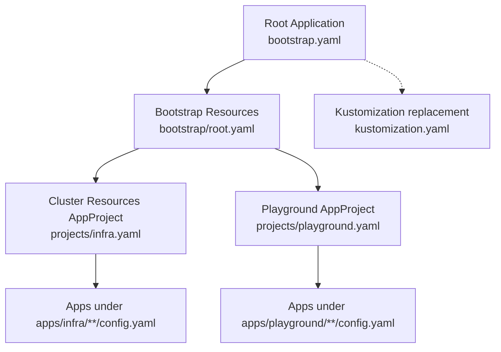
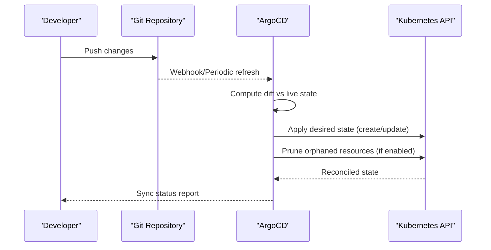
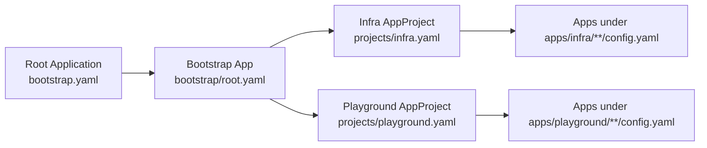

# Pruning and Self-Healing Mechanisms

<cite>
**Referenced Files in This Document**
- [README.md](file://README.md)
- [bootstrap.yaml](file://bootstrap.yaml)
- [kustomization.yaml](file://kustomization.yaml)
- [bootstrap/root.yaml](file://bootstrap/root.yaml)
- [bootstrap/cluster-resources.yaml](file://bootstrap/cluster-resources.yaml)
- [bootstrap/secrets.yaml](file://bootstrap/secrets.yaml)
- [projects/infra.yaml](file://projects/infra.yaml)
- [projects/playground.yaml](file://projects/playground.yaml)
- [apps/infra/gateway-api/config.yaml](file://apps/infra/gateway-api/config.yaml)
- [apps/infra/cloudflared/config.yaml](file://apps/infra/cloudflared/config.yaml)
- [apps/playground/argocd-ingress/config.yaml](file://apps/playground/argocd-ingress/config.yaml)
- [apps/playground/rancher/config.yaml](file://apps/playground/rancher/config.yaml)
- [apps/playground/cert-manager/config.yaml](file://apps/playground/cert-manager/config.yaml)
</cite>

## Table of Contents
1. [Introduction](#introduction)
2. [Project Structure](#project-structure)
3. [Core Components](#core-components)
4. [Architecture Overview](#architecture-overview)
5. [Detailed Component Analysis](#detailed-component-analysis)
6. [Dependency Analysis](#dependency-analysis)
7. [Performance Considerations](#performance-considerations)
8. [Troubleshooting Guide](#troubleshooting-guide)
9. [Conclusion](#conclusion)

## Introduction
This document explains how pruning and self-healing mechanisms maintain cluster state consistency in this GitOps setup powered by ArgoCD, Kustomize, and Helm. It focuses on:
- How ArgoCD automatically removes orphaned resources when applications are deleted or modified
- Pruning policies: which resource types are pruned, which namespaces are affected, and safety mechanisms
- Self-healing behavior that restores desired state when drift occurs
- Configuration options controlling pruning behavior, selective pruning, and best practices
- Examples of common scenarios where pruning and self-healing are triggered

## Project Structure
The repository organizes ArgoCD resources across three layers:
- Root Application and bootstrap chain
- AppProjects and ApplicationSets
- Individual applications with per-app configuration

**Diagram sources**
- [bootstrap.yaml:1-26](file://bootstrap.yaml#L1-L26)
- [bootstrap/root.yaml:1-37](file://bootstrap/root.yaml#L1-L37)
- [projects/infra.yaml:1-85](file://projects/infra.yaml#L1-L85)
- [projects/playground.yaml:1-90](file://projects/playground.yaml#L1-L90)
- [kustomization.yaml:1-21](file://kustomization.yaml#L1-L21)

**Section sources**
- [README.md:57-118](file://README.md#L57-L118)
- [bootstrap.yaml:1-26](file://bootstrap.yaml#L1-L26)
- [kustomization.yaml:1-21](file://kustomization.yaml#L1-L21)

## Core Components
- Root Application enables automated sync, pruning, and self-healing to bootstrap the cluster.
- Bootstrap ApplicationSet provisions cluster-scoped resources and sets safe defaults.
- AppProjects define resource whitelists and prune-last ordering.
- ApplicationSets discover apps via config.yaml files and apply per-app overrides.
- Per-application config.yaml controls destination namespace and sync wave.

Key pruning and self-healing indicators:
- Automated pruning and self-heal flags are set at the root, bootstrap, and application levels.
- Sync waves coordinate order to minimize conflicts during pruning.
- Namespace creation and dry-run options are configured per application.

**Section sources**
- [bootstrap.yaml:19-25](file://bootstrap.yaml#L19-L25)
- [bootstrap/root.yaml:29-36](file://bootstrap/root.yaml#L29-L36)
- [bootstrap/cluster-resources.yaml:13-32](file://bootstrap/cluster-resources.yaml#L13-L32)
- [projects/infra.yaml:5,61-65](file://projects/infra.yaml#L5,L61-L65)
- [projects/playground.yaml:5,61-74](file://projects/playground.yaml#L5,L61-L74)
- [apps/infra/gateway-api/config.yaml:1-6](file://apps/infra/gateway-api/config.yaml#L1-L6)
- [apps/infra/cloudflared/config.yaml:1-4](file://apps/infra/cloudflared/config.yaml#L1-L4)
- [apps/playground/argocd-ingress/config.yaml:1-4](file://apps/playground/argocd-ingress/config.yaml#L1-L4)
- [apps/playground/rancher/config.yaml:1-5](file://apps/playground/rancher/config.yaml#L1-L5)
- [apps/playground/cert-manager/config.yaml:1-5](file://apps/playground/cert-manager/config.yaml#L1-L5)

## Architecture Overview
The pruning and self-healing lifecycle is orchestrated by ArgoCD’s automated sync policy. At each Application or ApplicationSet, ArgoCD compares live cluster state against the declared manifests and reconciles differences.

[No sources needed since this diagram shows conceptual workflow, not actual code structure]

## Detailed Component Analysis

### Root Application and Bootstrap Chain
- The root Application enables automated sync with pruning and self-healing globally.
- Kustomize replaces placeholder repo URLs at build time, ensuring the root Application points to the correct repository.

Implications:
- Any change to the root Application’s automated policy affects the entire bootstrap chain.
- Pruning and self-healing propagate downstream to child Applications.

**Section sources**
- [bootstrap.yaml:19-25](file://bootstrap.yaml#L19-L25)
- [kustomization.yaml:10-21](file://kustomization.yaml#L10-L21)

### Bootstrap ApplicationSet (Cluster Resources)
- Defines an ApplicationSet to provision cluster-scoped resources with a dedicated sync wave.
- Includes a preservation flag to avoid deleting managed resources upon deletion.

Implications:
- Cluster-scoped resources are created first and preserved when the ApplicationSet is removed.
- Pruning is scoped to the ApplicationSet’s generated Applications, not the set itself.

**Section sources**
- [bootstrap/cluster-resources.yaml:13-32](file://bootstrap/cluster-resources.yaml#L13-L32)

### AppProjects and Prune-Last Ordering
- AppProjects annotate prune-last behavior to delay pruning until later sync waves.
- Whitelists enable broad access to cluster and namespace resources for declarative management.

Implications:
- Pruning occurs after earlier waves have stabilized, reducing risk of cascading deletions.
- Resource drift is minimized by allowing self-heal to reconcile differences continuously.

**Section sources**
- [projects/infra.yaml:5,10-20](file://projects/infra.yaml#L5,L10-L20)
- [projects/playground.yaml:5,9-20](file://projects/playground.yaml#L5,L9-L20)

### ApplicationSets and Automated Policies
- ApplicationSets generated from Git repositories inherit automated pruning and self-healing.
- Retry policies and sync options improve resilience and reduce false positives.

Implications:
- Drift detection triggers reconciliation across all generated Applications.
- Dry-run and skip-dry-run options tailor behavior per project.

**Section sources**
- [projects/infra.yaml:61-74](file://projects/infra.yaml#L61-L74)
- [projects/playground.yaml:61-90](file://projects/playground.yaml#L61-L90)

### Per-Application Configuration
- Applications specify destination namespaces and optional sync waves.
- Sync options like namespace creation and skip-dry-run fine-tune pruning behavior.

Examples:
- Gateway API app targets a dedicated namespace and requests namespace creation.
- Playground apps target argocd and cattle-system namespaces with late sync waves.

**Section sources**
- [apps/infra/gateway-api/config.yaml:1-6](file://apps/infra/gateway-api/config.yaml#L1-L6)
- [apps/infra/cloudflared/config.yaml:1-4](file://apps/infra/cloudflared/config.yaml#L1-L4)
- [apps/playground/argocd-ingress/config.yaml:1-4](file://apps/playground/argocd-ingress/config.yaml#L1-L4)
- [apps/playground/rancher/config.yaml:1-5](file://apps/playground/rancher/config.yaml#L1-L5)
- [apps/playground/cert-manager/config.yaml:1-5](file://apps/playground/cert-manager/config.yaml#L1-L5)

## Dependency Analysis
Pruning and self-healing depend on the following relationships:
- Root Application → Bootstrap → AppProjects → ApplicationSets → Applications
- Sync waves ensure ordered reconciliation, reducing race conditions during pruning
- Per-app overrides (destination namespace, sync options) influence which resources are pruned and how aggressively

**Diagram sources**
- [bootstrap.yaml:1-26](file://bootstrap.yaml#L1-L26)
- [bootstrap/root.yaml:1-37](file://bootstrap/root.yaml#L1-L37)
- [projects/infra.yaml:1-85](file://projects/infra.yaml#L1-L85)
- [projects/playground.yaml:1-90](file://projects/playground.yaml#L1-L90)

**Section sources**
- [README.md:76-86](file://README.md#L76-L86)
- [projects/infra.yaml:25-85](file://projects/infra.yaml#L25-L85)
- [projects/playground.yaml:24-90](file://projects/playground.yaml#L24-L90)

## Performance Considerations
- Prune-last ordering reduces cascading deletions by deferring pruning to later sync waves.
- Retry policies on ApplicationSets mitigate transient failures during reconciliation.
- Dry-run and skip-dry-run options balance safety and speed depending on workload.

[No sources needed since this section provides general guidance]

## Troubleshooting Guide
Common issues and mitigations:
- Accidental deletions during pruning
  - Mitigation: Use prune-last ordering at the AppProject level and configure sync waves to stabilize early resources.
  - Evidence: AppProject annotations set prune-last and sync waves are defined across projects.

- Namespace drift or missing namespaces
  - Mitigation: Enable namespace creation in sync options for Applications requiring new namespaces.
  - Evidence: Applications declare namespace creation options in their configs.

- Late synchronization of dependent resources
  - Mitigation: Assign appropriate sync waves to ensure dependent resources (e.g., Gateways) exist before dependent HTTPRoutes.
  - Evidence: Applications set sync waves in their configs.

- Stuck reconciliation due to transient errors
  - Mitigation: Configure retry policies on ApplicationSets to back off and retry.
  - Evidence: ApplicationSets include retry limits and backoff durations.

**Section sources**
- [projects/infra.yaml:5,66-71](file://projects/infra.yaml#L5,L66-L71)
- [projects/playground.yaml:5,66-71](file://projects/playground.yaml#L5,L66-L71)
- [apps/infra/gateway-api/config.yaml:1-6](file://apps/infra/gateway-api/config.yaml#L1-L6)
- [apps/infra/cloudflared/config.yaml:1-4](file://apps/infra/cloudflared/config.yaml#L1-L4)
- [apps/playground/argocd-ingress/config.yaml:1-4](file://apps/playground/argocd-ingress/config.yaml#L1-L4)
- [apps/playground/rancher/config.yaml:1-5](file://apps/playground/rancher/config.yaml#L1-L5)
- [apps/playground/cert-manager/config.yaml:1-5](file://apps/playground/cert-manager/config.yaml#L1-L5)

## Conclusion
Pruning and self-healing are central to maintaining cluster state consistency in this GitOps setup. Automated policies at the root, bootstrap, AppProjects, and ApplicationSets ensure that:
- Orphaned resources are pruned systematically after stabilization
- Desired state is restored automatically when drift occurs
- Safety mechanisms like prune-last ordering, sync waves, and retry policies reduce risk and improve reliability

By aligning per-app configuration with these mechanisms—such as setting destination namespaces, enabling namespace creation, and assigning appropriate sync waves—teams can confidently manage evolving workloads while preserving stability.