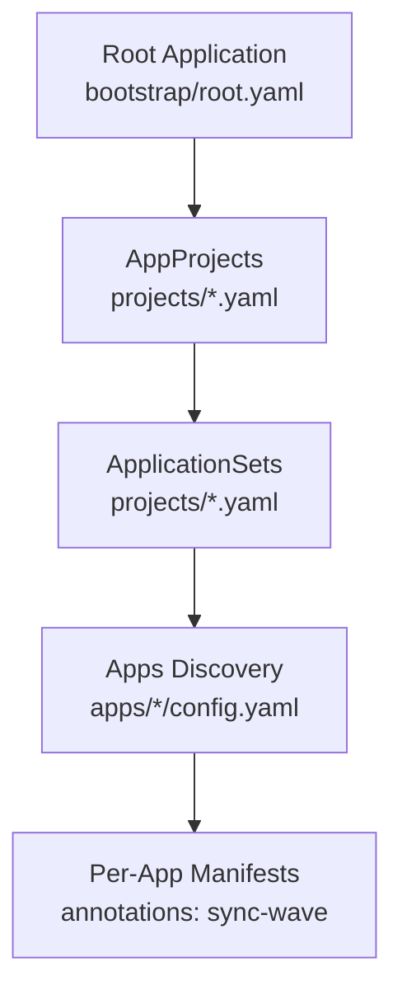
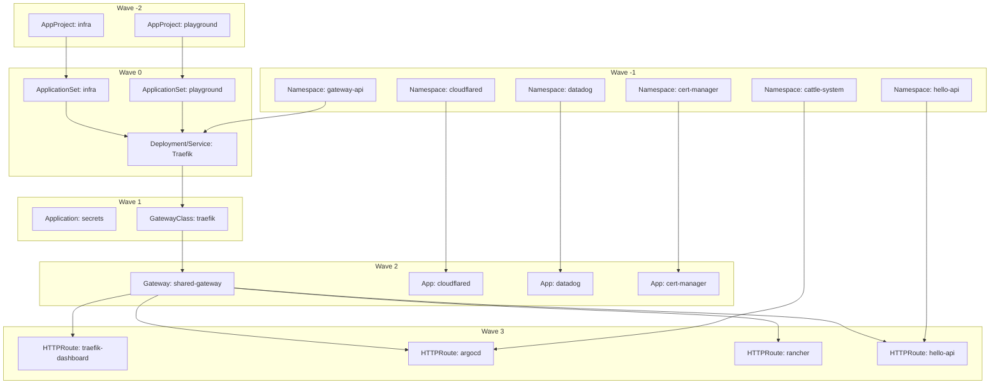
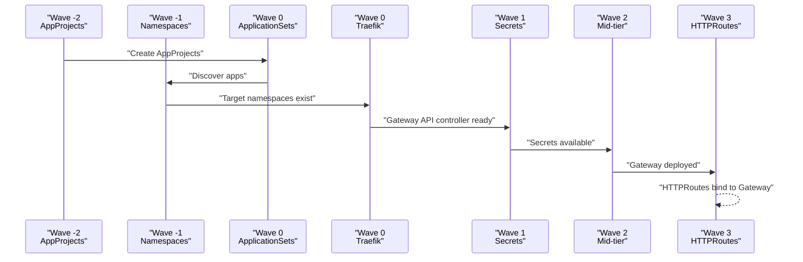
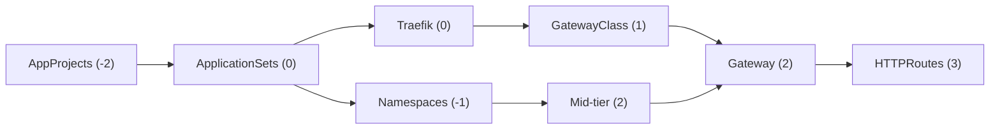

# Sync Ordering and Deployment Strategy

<cite>
**Referenced Files in This Document**
- [README.md](file://README.md)
- [projects/infra.yaml](file://projects/infra.yaml)
- [projects/playground.yaml](file://projects/playground.yaml)
- [bootstrap/cluster-resources.yaml](file://bootstrap/cluster-resources.yaml)
- [bootstrap/secrets.yaml](file://bootstrap/secrets.yaml)
- [cluster-resources/default/namespace.yaml](file://cluster-resources/default/namespace.yaml)
- [apps/infra/gateway-api/chart/kustomization.yaml](file://apps/infra/gateway-api/chart/kustomization.yaml)
- [apps/infra/gateway-api/chart/traefik.yaml](file://apps/infra/gateway-api/chart/traefik.yaml)
- [apps/infra/gateway-api/chart/gatewayclass.yaml](file://apps/infra/gateway-api/chart/gatewayclass.yaml)
- [apps/infra/gateway-api/chart/gateway.yaml](file://apps/infra/gateway-api/chart/gateway.yaml)
- [apps/infra/gateway-api/chart/httproute-traefik-dashboard.yaml](file://apps/infra/gateway-api/chart/httproute-traefik-dashboard.yaml)
- [apps/playground/argocd-ingress/chart/httproute-argocd.yaml](file://apps/playground/argocd-ingress/chart/httproute-argocd.yaml)
- [apps/playground/rancher/chart/httproute-rancher.yaml](file://apps/playground/rancher/chart/httproute-rancher.yaml)
- [apps/playground/hello-api/chart/values-httproute.yaml](file://apps/playground/hello-api/chart/values-httproute.yaml)
- [apps/infra/cloudflared/config.yaml](file://apps/infra/cloudflared/config.yaml)
- [apps/infra/datadog/config.yaml](file://apps/infra/datadog/config.yaml)
- [apps/playground/cert-manager/config.yaml](file://apps/playground/cert-manager/config.yaml)
</cite>

## Table of Contents
1. [Introduction](#introduction)
2. [Project Structure](#project-structure)
3. [Core Components](#core-components)
4. [Architecture Overview](#architecture-overview)
5. [Detailed Component Analysis](#detailed-component-analysis)
6. [Dependency Analysis](#dependency-analysis)
7. [Performance Considerations](#performance-considerations)
8. [Troubleshooting Guide](#troubleshooting-guide)
9. [Conclusion](#conclusion)

## Introduction
This document explains the sync ordering system used to control deployment sequence and dependency resolution across the GitOps pipeline. It covers the sync wave system ranging from -2 to +3, detailing which resources belong to each wave and how later waves depend on earlier resources being ready. Practical examples show how to assign sync waves to applications using annotations, and troubleshooting guidance helps resolve common ordering issues.

## Project Structure
The repository organizes cluster bootstrapping and application deployment into a deterministic chain:
- Bootstrapping creates the root Application and AppProjects/ApplicationSets.
- AppProjects define projects and are applied early (wave -2).
- ApplicationSets discover and render applications from per-app config files.
- Per-app manifests use annotations to specify sync waves for ordered synchronization.

**Diagram sources**
- [README.md:61-75](file://README.md#L61-L75)
- [projects/infra.yaml:1-21](file://projects/infra.yaml#L1-L21)
- [projects/playground.yaml:1-21](file://projects/playground.yaml#L1-L21)

**Section sources**
- [README.md:57-86](file://README.md#L57-L86)
- [projects/infra.yaml:1-85](file://projects/infra.yaml#L1-L85)
- [projects/playground.yaml:1-90](file://projects/playground.yaml#L1-L90)

## Core Components
The sync wave system enforces a strict order:
- Wave -2: AppProjects
- Wave -1: Namespaces
- Wave 0: ApplicationSets, Traefik Deployment
- Wave 1: Secrets from private repo
- Wave 2: Mid-tier resources (Gateway, Cloudflared, Datadog, cert-manager)
- Wave 3: HTTPRoutes (dependent on Gateway availability)

Key implementation points:
- AppProjects are applied with wave -2 to establish projects before ApplicationSets.
- Namespaces are applied with wave -1 so downstream apps can target them.
- ApplicationSets are applied with wave 0 to discover and render apps.
- Traefik Deployment and Service are applied with wave 0 to provide Gateway API support.
- GatewayClass is applied with wave 1 to register the Gateway controller.
- Gateway is applied with wave 2 to expose services.
- HTTPRoutes are applied with wave 3 to route traffic to backends.

**Section sources**
- [README.md:76-85](file://README.md#L76-L85)
- [projects/infra.yaml:6](file://projects/infra.yaml#L6)
- [projects/playground.yaml:6](file://projects/playground.yaml#L6)
- [bootstrap/cluster-resources.yaml:5](file://bootstrap/cluster-resources.yaml#L5)
- [bootstrap/secrets.yaml:7](file://bootstrap/secrets.yaml#L7)
- [apps/infra/gateway-api/chart/traefik.yaml:61](file://apps/infra/gateway-api/chart/traefik.yaml#L61-L62)
- [apps/infra/gateway-api/chart/traefik.yaml:103](file://apps/infra/gateway-api/chart/traefik.yaml#L103-L104)
- [apps/infra/gateway-api/chart/gatewayclass.yaml:6](file://apps/infra/gateway-api/chart/gatewayclass.yaml#L6)
- [apps/infra/gateway-api/chart/gateway.yaml:7](file://apps/infra/gateway-api/chart/gateway.yaml#L7)
- [apps/infra/gateway-api/chart/httproute-traefik-dashboard.yaml:7](file://apps/infra/gateway-api/chart/httproute-traefik-dashboard.yaml#L7)
- [apps/playground/argocd-ingress/chart/httproute-argocd.yaml:7](file://apps/playground/argocd-ingress/chart/httproute-argocd.yaml#L7)
- [apps/playground/rancher/chart/httproute-rancher.yaml:7](file://apps/playground/rancher/chart/httproute-rancher.yaml#L7)
- [apps/playground/hello-api/chart/values-httproute.yaml:4](file://apps/playground/hello-api/chart/values-httproute.yaml#L4)

## Architecture Overview
The sync order ensures dependencies are satisfied before dependent resources are created. The following diagram maps the waves to their responsibilities and dependencies.

**Diagram sources**
- [projects/infra.yaml:6](file://projects/infra.yaml#L6)
- [projects/playground.yaml:6](file://projects/playground.yaml#L6)
- [cluster-resources/default/namespace.yaml:8-51](file://cluster-resources/default/namespace.yaml#L8-L51)
- [bootstrap/cluster-resources.yaml:5](file://bootstrap/cluster-resources.yaml#L5)
- [bootstrap/secrets.yaml:7](file://bootstrap/secrets.yaml#L7)
- [apps/infra/gateway-api/chart/traefik.yaml:61-62](file://apps/infra/gateway-api/chart/traefik.yaml#L61-L62)
- [apps/infra/gateway-api/chart/traefik.yaml:103-104](file://apps/infra/gateway-api/chart/traefik.yaml#L103-L104)
- [apps/infra/gateway-api/chart/gatewayclass.yaml:6](file://apps/infra/gateway-api/chart/gatewayclass.yaml#L6)
- [apps/infra/gateway-api/chart/gateway.yaml:7](file://apps/infra/gateway-api/chart/gateway.yaml#L7)
- [apps/infra/gateway-api/chart/httproute-traefik-dashboard.yaml:7](file://apps/infra/gateway-api/chart/httproute-traefik-dashboard.yaml#L7)
- [apps/playground/argocd-ingress/chart/httproute-argocd.yaml:7](file://apps/playground/argocd-ingress/chart/httproute-argocd.yaml#L7)
- [apps/playground/rancher/chart/httproute-rancher.yaml:7](file://apps/playground/rancher/chart/httproute-rancher.yaml#L7)
- [apps/playground/hello-api/chart/values-httproute.yaml:4](file://apps/playground/hello-api/chart/values-httproute.yaml#L4)

## Detailed Component Analysis

### Sync Waves and Resource Assignments
- Wave -2: AppProjects define projects and destinations for ApplicationSets.
- Wave -1: Namespaces ensure target namespaces exist before apps deploy.
- Wave 0: ApplicationSets discover apps; Traefik Deployment/Service provide Gateway API controller.
- Wave 1: Secrets application provides credentials for protected resources.
- Wave 2: Mid-tier apps (Gateway, Cloudflared, Datadog, cert-manager) depend on namespaces and secrets.
- Wave 3: HTTPRoutes depend on Gateway existence and backend Services.

Examples of annotations in manifests:
- ApplicationSet infra: [projects/infra.yaml:27](file://projects/infra.yaml#L27)
- ApplicationSet playground: [projects/playground.yaml:27](file://projects/playground.yaml#L27)
- Application: secrets: [bootstrap/secrets.yaml:7](file://bootstrap/secrets.yaml#L7)
- Namespace: [cluster-resources/default/namespace.yaml:8-51](file://cluster-resources/default/namespace.yaml#L8-L51)
- Traefik Deployment: [apps/infra/gateway-api/chart/traefik.yaml:61-62](file://apps/infra/gateway-api/chart/traefik.yaml#L61-L62)
- Traefik Service: [apps/infra/gateway-api/chart/traefik.yaml:103-104](file://apps/infra/gateway-api/chart/traefik.yaml#L103-L104)
- GatewayClass: [apps/infra/gateway-api/chart/gatewayclass.yaml:6](file://apps/infra/gateway-api/chart/gatewayclass.yaml#L6)
- Gateway: [apps/infra/gateway-api/chart/gateway.yaml:7](file://apps/infra/gateway-api/chart/gateway.yaml#L7)
- HTTPRoute: traefik-dashboard: [apps/infra/gateway-api/chart/httproute-traefik-dashboard.yaml:7](file://apps/infra/gateway-api/chart/httproute-traefik-dashboard.yaml#L7)
- HTTPRoute: argocd: [apps/playground/argocd-ingress/chart/httproute-argocd.yaml:7](file://apps/playground/argocd-ingress/chart/httproute-argocd.yaml#L7)
- HTTPRoute: rancher: [apps/playground/rancher/chart/httproute-rancher.yaml:7](file://apps/playground/rancher/chart/httproute-rancher.yaml#L7)
- HTTPRoute: hello-api: [apps/playground/hello-api/chart/values-httproute.yaml:4](file://apps/playground/hello-api/chart/values-httproute.yaml#L4)
- App: cloudflared: [apps/infra/cloudflared/config.yaml:3](file://apps/infra/cloudflared/config.yaml#L3)
- App: datadog: [apps/infra/datadog/config.yaml:5](file://apps/infra/datadog/config.yaml#L5)
- App: cert-manager: [apps/playground/cert-manager/config.yaml:3](file://apps/playground/cert-manager/config.yaml#L3)

**Section sources**
- [README.md:76-85](file://README.md#L76-L85)
- [projects/infra.yaml:6](file://projects/infra.yaml#L6)
- [projects/playground.yaml:6](file://projects/playground.yaml#L6)
- [bootstrap/cluster-resources.yaml:5](file://bootstrap/cluster-resources.yaml#L5)
- [bootstrap/secrets.yaml:7](file://bootstrap/secrets.yaml#L7)
- [cluster-resources/default/namespace.yaml:8-51](file://cluster-resources/default/namespace.yaml#L8-L51)
- [apps/infra/gateway-api/chart/kustomization.yaml:1-8](file://apps/infra/gateway-api/chart/kustomization.yaml#L1-L8)
- [apps/infra/gateway-api/chart/traefik.yaml:61-62](file://apps/infra/gateway-api/chart/traefik.yaml#L61-L62)
- [apps/infra/gateway-api/chart/traefik.yaml:103-104](file://apps/infra/gateway-api/chart/traefik.yaml#L103-L104)
- [apps/infra/gateway-api/chart/gatewayclass.yaml:6](file://apps/infra/gateway-api/chart/gatewayclass.yaml#L6)
- [apps/infra/gateway-api/chart/gateway.yaml:7](file://apps/infra/gateway-api/chart/gateway.yaml#L7)
- [apps/infra/gateway-api/chart/httproute-traefik-dashboard.yaml:7](file://apps/infra/gateway-api/chart/httproute-traefik-dashboard.yaml#L7)
- [apps/playground/argocd-ingress/chart/httproute-argocd.yaml:7](file://apps/playground/argocd-ingress/chart/httproute-argocd.yaml#L7)
- [apps/playground/rancher/chart/httproute-rancher.yaml:7](file://apps/playground/rancher/chart/httproute-rancher.yaml#L7)
- [apps/playground/hello-api/chart/values-httproute.yaml:4](file://apps/playground/hello-api/chart/values-httproute.yaml#L4)
- [apps/infra/cloudflared/config.yaml:3](file://apps/infra/cloudflared/config.yaml#L3)
- [apps/infra/datadog/config.yaml:5](file://apps/infra/datadog/config.yaml#L5)
- [apps/playground/cert-manager/config.yaml:3](file://apps/playground/cert-manager/config.yaml#L3)

### Sync Wave Assignment Examples
To assign a sync wave to an application:
- Add an annotation to the Application or Kustomize template patch:
  - Example path: [README.md:136-142](file://README.md#L136-L142)
- Typical placements:
  - ApplicationSet templatePatch: [projects/infra.yaml:74-85](file://projects/infra.yaml#L74-L85)
  - ApplicationSet templatePatch: [projects/playground.yaml:75-90](file://projects/playground.yaml#L75-L90)
  - Individual app config: [apps/infra/cloudflared/config.yaml:3](file://apps/infra/cloudflared/config.yaml#L3), [apps/infra/datadog/config.yaml:5](file://apps/infra/datadog/config.yaml#L5), [apps/playground/cert-manager/config.yaml:3](file://apps/playground/cert-manager/config.yaml#L3)

Best practices:
- Keep waves contiguous around the core path (Waves -2 to +3).
- Avoid negative waves beyond -2 unless defining AppProjects.
- Use Wave 3 for HTTPRoutes to ensure Gateway readiness.
- Use Wave 2 for mid-tier resources that require namespaces and secrets.

**Section sources**
- [README.md:128-142](file://README.md#L128-L142)
- [projects/infra.yaml:74-85](file://projects/infra.yaml#L74-L85)
- [projects/playground.yaml:75-90](file://projects/playground.yaml#L75-L90)
- [apps/infra/cloudflared/config.yaml:3](file://apps/infra/cloudflared/config.yaml#L3)
- [apps/infra/datadog/config.yaml:5](file://apps/infra/datadog/config.yaml#L5)
- [apps/playground/cert-manager/config.yaml:3](file://apps/playground/cert-manager/config.yaml#L3)

### Dependency Chain Visualization
The dependency chain ensures that each wave waits for prerequisites from earlier waves.

**Diagram sources**
- [projects/infra.yaml:6](file://projects/infra.yaml#L6)
- [projects/playground.yaml:6](file://projects/playground.yaml#L6)
- [bootstrap/cluster-resources.yaml:5](file://bootstrap/cluster-resources.yaml#L5)
- [bootstrap/secrets.yaml:7](file://bootstrap/secrets.yaml#L7)
- [apps/infra/gateway-api/chart/traefik.yaml:61-62](file://apps/infra/gateway-api/chart/traefik.yaml#L61-L62)
- [apps/infra/gateway-api/chart/traefik.yaml:103-104](file://apps/infra/gateway-api/chart/traefik.yaml#L103-L104)
- [apps/infra/gateway-api/chart/gatewayclass.yaml:6](file://apps/infra/gateway-api/chart/gatewayclass.yaml#L6)
- [apps/infra/gateway-api/chart/gateway.yaml:7](file://apps/infra/gateway-api/chart/gateway.yaml#L7)
- [apps/infra/gateway-api/chart/httproute-traefik-dashboard.yaml:7](file://apps/infra/gateway-api/chart/httproute-traefik-dashboard.yaml#L7)
- [apps/playground/argocd-ingress/chart/httproute-argocd.yaml:7](file://apps/playground/argocd-ingress/chart/httproute-argocd.yaml#L7)
- [apps/playground/rancher/chart/httproute-rancher.yaml:7](file://apps/playground/rancher/chart/httproute-rancher.yaml#L7)
- [apps/playground/hello-api/chart/values-httproute.yaml:4](file://apps/playground/hello-api/chart/values-httproute.yaml#L4)

## Dependency Analysis
This section maps the explicit dependencies between waves and resources.

**Diagram sources**
- [projects/infra.yaml:6](file://projects/infra.yaml#L6)
- [projects/playground.yaml:6](file://projects/playground.yaml#L6)
- [bootstrap/cluster-resources.yaml:5](file://bootstrap/cluster-resources.yaml#L5)
- [bootstrap/secrets.yaml:7](file://bootstrap/secrets.yaml#L7)
- [apps/infra/gateway-api/chart/traefik.yaml:61-62](file://apps/infra/gateway-api/chart/traefik.yaml#L61-L62)
- [apps/infra/gateway-api/chart/traefik.yaml:103-104](file://apps/infra/gateway-api/chart/traefik.yaml#L103-L104)
- [apps/infra/gateway-api/chart/gatewayclass.yaml:6](file://apps/infra/gateway-api/chart/gatewayclass.yaml#L6)
- [apps/infra/gateway-api/chart/gateway.yaml:7](file://apps/infra/gateway-api/chart/gateway.yaml#L7)
- [apps/infra/gateway-api/chart/httproute-traefik-dashboard.yaml:7](file://apps/infra/gateway-api/chart/httproute-traefik-dashboard.yaml#L7)
- [apps/playground/argocd-ingress/chart/httproute-argocd.yaml:7](file://apps/playground/argocd-ingress/chart/httproute-argocd.yaml#L7)
- [apps/playground/rancher/chart/httproute-rancher.yaml:7](file://apps/playground/rancher/chart/httproute-rancher.yaml#L7)
- [apps/playground/hello-api/chart/values-httproute.yaml:4](file://apps/playground/hello-api/chart/values-httproute.yaml#L4)

**Section sources**
- [README.md:76-85](file://README.md#L76-L85)
- [apps/infra/gateway-api/chart/kustomization.yaml:1-8](file://apps/infra/gateway-api/chart/kustomization.yaml#L1-L8)

## Performance Considerations
- Minimize cross-wave dependencies by grouping related resources into the same wave when feasible.
- Use Wave 3 for HTTPRoutes to avoid unnecessary retries caused by missing Gateways.
- Keep ApplicationSets focused on discovery and rendering; avoid heavy workloads in Wave 0 that could delay Traefik readiness.
- Leverage Argo CD’s automated sync policies and retry/backoff settings to reduce manual intervention.

## Troubleshooting Guide
Common issues and resolutions:
- HTTPRoute fails to bind:
  - Cause: Gateway does not exist yet.
  - Resolution: Ensure Gateway is in Wave 2 and HTTPRoutes are in Wave 3.
  - References: [apps/infra/gateway-api/chart/gateway.yaml:7](file://apps/infra/gateway-api/chart/gateway.yaml#L7), [apps/infra/gateway-api/chart/httproute-traefik-dashboard.yaml:7](file://apps/infra/gateway-api/chart/httproute-traefik-dashboard.yaml#L7)
- HTTPRoute points to wrong backend:
  - Cause: Backend Service not yet created or misconfigured.
  - Resolution: Verify backend Service exists in the same namespace and port alignment.
- Namespace missing:
  - Cause: Target namespace not created before app deployment.
  - Resolution: Set namespaces to Wave -1 and ensure CreateNamespace sync option is effective.
  - References: [cluster-resources/default/namespace.yaml:8-51](file://cluster-resources/default/namespace.yaml#L8-L51)
- Secrets unavailable:
  - Cause: Secrets Application not in Wave 1.
  - Resolution: Confirm secrets Application uses sync-wave 1 and Secrets are present before dependent apps.
  - References: [bootstrap/secrets.yaml:7](file://bootstrap/secrets.yaml#L7)
- ApplicationSet not discovering apps:
  - Cause: Missing or incorrect destNamespace in app config.
  - Resolution: Set destNamespace in app config and ensure ApplicationSet templatePatch applies annotations.
  - References: [projects/infra.yaml:74-85](file://projects/infra.yaml#L74-L85), [projects/playground.yaml:75-90](file://projects/playground.yaml#L75-L90)
- Mid-tier app fails to start:
  - Cause: Missing namespace or secret.
  - Resolution: Move to Wave 2 and ensure namespaces (Wave -1) and secrets (Wave 1) are ready.
  - References: [apps/infra/cloudflared/config.yaml:3](file://apps/infra/cloudflared/config.yaml#L3), [apps/infra/datadog/config.yaml:5](file://apps/infra/datadog/config.yaml#L5), [apps/playground/cert-manager/config.yaml:3](file://apps/playground/cert-manager/config.yaml#L3)

**Section sources**
- [apps/infra/gateway-api/chart/gateway.yaml:7](file://apps/infra/gateway-api/chart/gateway.yaml#L7)
- [apps/infra/gateway-api/chart/httproute-traefik-dashboard.yaml:7](file://apps/infra/gateway-api/chart/httproute-traefik-dashboard.yaml#L7)
- [cluster-resources/default/namespace.yaml:8-51](file://cluster-resources/default/namespace.yaml#L8-L51)
- [bootstrap/secrets.yaml:7](file://bootstrap/secrets.yaml#L7)
- [projects/infra.yaml:74-85](file://projects/infra.yaml#L74-L85)
- [projects/playground.yaml:75-90](file://projects/playground.yaml#L75-L90)
- [apps/infra/cloudflared/config.yaml:3](file://apps/infra/cloudflared/config.yaml#L3)
- [apps/infra/datadog/config.yaml:5](file://apps/infra/datadog/config.yaml#L5)
- [apps/playground/cert-manager/config.yaml:3](file://apps/playground/cert-manager/config.yaml#L3)

## Conclusion
The sync wave system enforces a predictable, layered deployment sequence. By assigning AppProjects to Wave -2, namespaces to Wave -1, ApplicationSets and Traefik to Wave 0, Secrets to Wave 1, mid-tier resources to Wave 2, and HTTPRoutes to Wave 3, the system ensures dependencies are satisfied before dependent resources are created. Use annotations to control ordering per application and follow the troubleshooting steps to resolve common issues quickly.