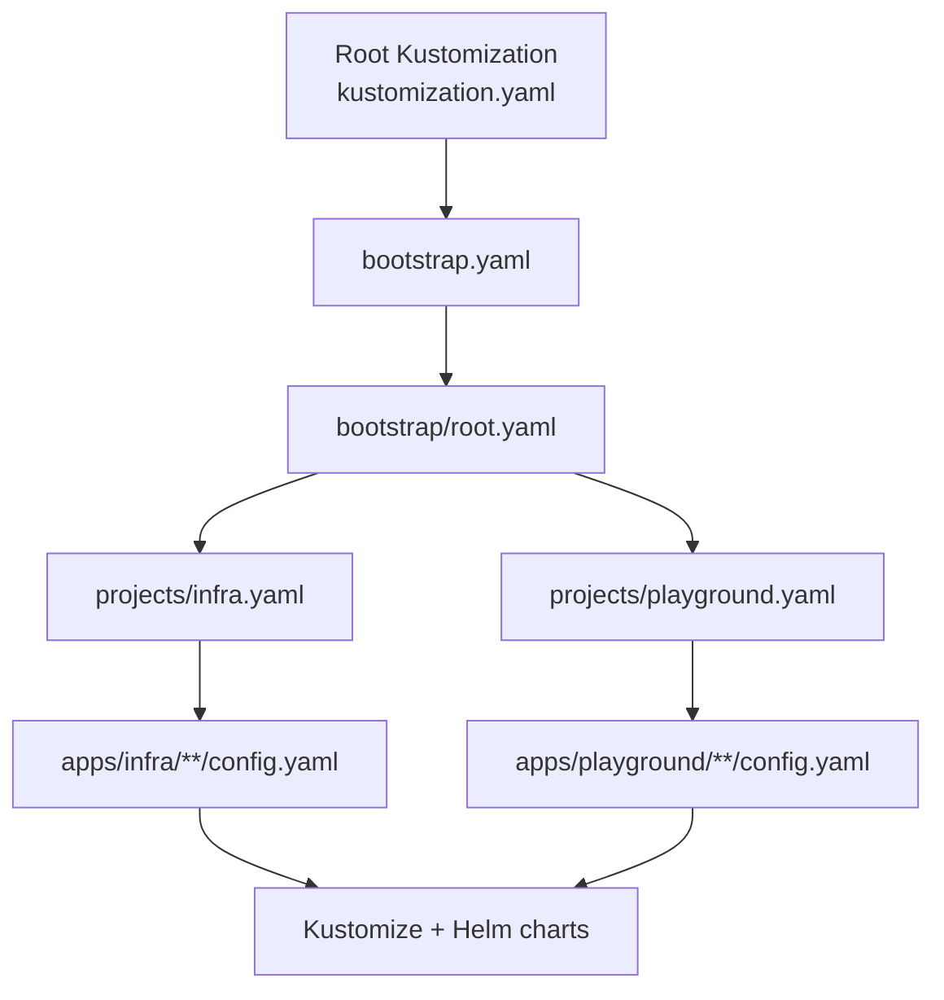
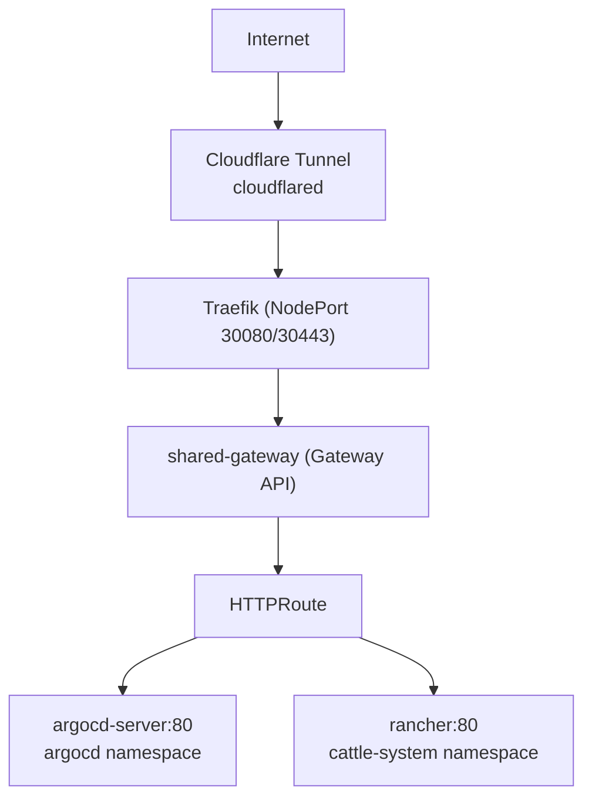
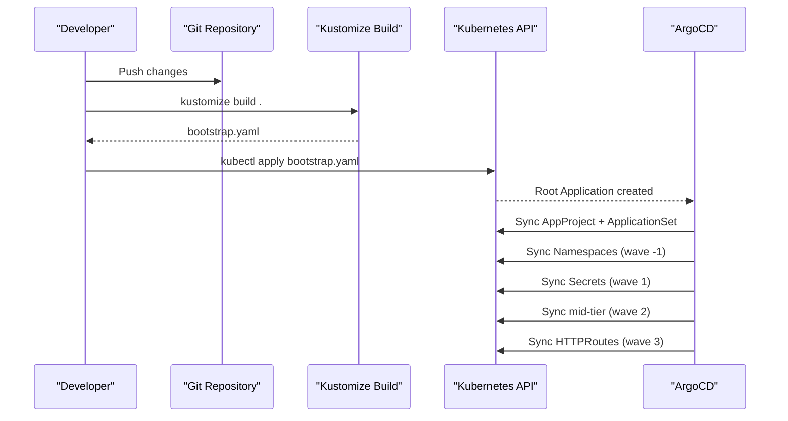
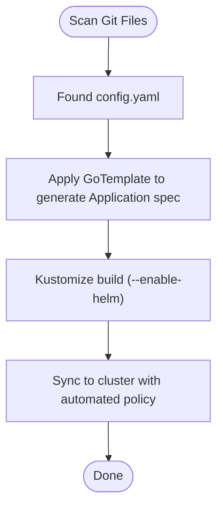
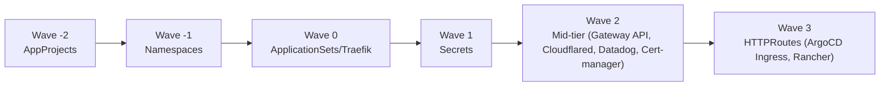

# Troubleshooting and Recovery Procedures

<cite>
**Referenced Files in This Document**
- [README.md](file://README.md)
- [bootstrap.yaml](file://bootstrap.yaml)
- [bootstrap/root.yaml](file://bootstrap/root.yaml)
- [projects/infra.yaml](file://projects/infra.yaml)
- [projects/playground.yaml](file://projects/playground.yaml)
- [apps/infra/gateway-api/kustomization.yaml](file://apps/infra/gateway-api/kustomization.yaml)
- [apps/infra/gateway-api/config.yaml](file://apps/infra/gateway-api/config.yaml)
- [apps/infra/cloudflared/kustomization.yaml](file://apps/infra/cloudflared/kustomization.yaml)
- [apps/infra/cloudflared/config.yaml](file://apps/infra/cloudflared/config.yaml)
- [apps/infra/datadog/kustomization.yaml](file://apps/infra/datadog/kustomization.yaml)
- [apps/infra/datadog/config.yaml](file://apps/infra/datadog/config.yaml)
- [apps/playground/argocd-ingress/kustomization.yaml](file://apps/playground/argocd-ingress/kustomization.yaml)
- [apps/playground/argocd-ingress/config.yaml](file://apps/playground/argocd-ingress/config.yaml)
- [apps/playground/rancher/kustomization.yaml](file://apps/playground/rancher/kustomization.yaml)
- [apps/playground/rancher/config.yaml](file://apps/playground/rancher/config.yaml)
- [apps/playground/cert-manager/kustomization.yaml](file://apps/playground/cert-manager/kustomization.yaml)
- [apps/playground/cert-manager/config.yaml](file://apps/playground/cert-manager/config.yaml)
- [guide/argocd/argo_cd.md](file://guide/argocd/argo_cd.md)
</cite>

## Table of Contents
1. [Introduction](#introduction)
2. [Project Structure](#project-structure)
3. [Core Components](#core-components)
4. [Architecture Overview](#architecture-overview)
5. [Detailed Component Analysis](#detailed-component-analysis)
6. [Dependency Analysis](#dependency-analysis)
7. [Performance Considerations](#performance-considerations)
8. [Troubleshooting Guide](#troubleshooting-guide)
9. [Conclusion](#conclusion)
10. [Appendices](#appendices)

## Introduction
This document provides a comprehensive troubleshooting and recovery guide for the GitOps-managed Kubernetes cluster using ArgoCD, Kustomize, and Helm. It covers systematic diagnosis of sync failures, resource conflicts, and dependency resolution issues, along with step-by-step manual intervention procedures, rollback scenarios, and disaster recovery processes. It also includes debugging techniques via the ArgoCD CLI and web interface, log analysis methods, common error patterns with solutions, and checklists for routine maintenance, performance monitoring, and capacity planning. Escalation procedures and when to involve cluster administrators are outlined for complex or persistent issues.

## Project Structure
The repository follows a layered GitOps structure:
- Root Kustomization builds a bootstrap Application that seeds the cluster with foundational resources.
- Bootstrap applies the root Application, which points to the projects directory containing AppProjects and ApplicationSets.
- ApplicationSets discover applications via config.yaml files located under apps/infra and apps/playground, rendering Kustomize manifests (with Helm support) and syncing them into the cluster.
- Sync order is enforced via sync-wave annotations to ensure dependencies resolve in the correct sequence.

**Diagram sources**
- [README.md:61-75](file://README.md#L61-L75)
- [bootstrap.yaml:10-18](file://bootstrap.yaml#L10-L18)
- [bootstrap/root.yaml:15-18](file://bootstrap/root.yaml#L15-L18)
- [projects/infra.yaml:33-58](file://projects/infra.yaml#L33-L58)
- [projects/playground.yaml:33-58](file://projects/playground.yaml#L33-L58)

**Section sources**
- [README.md:61-75](file://README.md#L61-L75)
- [bootstrap.yaml:10-18](file://bootstrap.yaml#L10-L18)
- [bootstrap/root.yaml:15-18](file://bootstrap/root.yaml#L15-L18)
- [projects/infra.yaml:33-58](file://projects/infra.yaml#L33-L58)
- [projects/playground.yaml:33-58](file://projects/playground.yaml#L33-L58)

## Core Components
- Root Application: Seeds the cluster with AppProjects and ApplicationSets.
- AppProjects: Define resource whitelists and destinations for safe, scoped deployments.
- ApplicationSets: Discover and generate Applications from config.yaml files across infra and playground.
- Applications: Render Kustomize manifests (including Helm charts) and sync to the cluster with automated policies.
- Sync Waves: Enforce deterministic ordering for dependencies (e.g., Gateway API before HTTPRoutes).

Key configuration anchors:
- Root Application and ignore differences for ApplicationSet and ConfigMap annotations.
- AppProjects with cluster and namespace resource whitelists.
- ApplicationSets with Git file generators and template-driven Application specs.
- Per-app config.yaml with destNamespace and sync-wave annotations.

**Section sources**
- [bootstrap/root.yaml:19-36](file://bootstrap/root.yaml#L19-L36)
- [projects/infra.yaml:1-21](file://projects/infra.yaml#L1-L21)
- [projects/playground.yaml:1-21](file://projects/playground.yaml#L1-L21)
- [projects/infra.yaml:33-85](file://projects/infra.yaml#L33-L85)
- [projects/playground.yaml:33-90](file://projects/playground.yaml#L33-L90)
- [apps/infra/gateway-api/config.yaml:1-6](file://apps/infra/gateway-api/config.yaml#L1-L6)
- [apps/playground/argocd-ingress/config.yaml:1-4](file://apps/playground/argocd-ingress/config.yaml#L1-L4)
- [apps/infra/cloudflared/config.yaml:1-4](file://apps/infra/cloudflared/config.yaml#L1-L4)
- [apps/infra/datadog/config.yaml:1-6](file://apps/infra/datadog/config.yaml#L1-L6)
- [apps/playground/rancher/config.yaml:1-5](file://apps/playground/rancher/config.yaml#L1-L5)
- [apps/playground/cert-manager/config.yaml:1-5](file://apps/playground/cert-manager/config.yaml#L1-L5)

## Architecture Overview
The cluster’s ingress and exposure rely on Cloudflare tunnels and Gateway API:
- Cloudflare Edge routes to cloudflared tunnel, which forwards to Traefik via NodePort.
- Traefik acts as the Gateway API controller and routes traffic to shared-gateway.
- HTTPRoute resources route by hostname to backend Services.
- ArgoCD UI and Rancher are exposed via HTTPRoute to respective hostnames.

**Diagram sources**
- [README.md:38-56](file://README.md#L38-L56)

**Section sources**
- [README.md:38-56](file://README.md#L38-L56)

## Detailed Component Analysis

### Root Application and Bootstrap Chain
- The root Application points to the projects directory and automates sync with pruning and self-healing enabled.
- It ignores differences for ApplicationSet and a specific ConfigMap annotation to prevent drift.
- The bootstrap chain ensures deterministic ordering: AppProjects, Namespaces, ApplicationSets/Traefik, Secrets, mid-tier resources, and finally HTTPRoutes.

**Diagram sources**
- [README.md:61-86](file://README.md#L61-L86)
- [bootstrap/root.yaml:19-36](file://bootstrap/root.yaml#L19-L36)

**Section sources**
- [README.md:61-86](file://README.md#L61-L86)
- [bootstrap/root.yaml:19-36](file://bootstrap/root.yaml#L19-L36)

### Application Discovery and Rendering
- ApplicationSets scan the repository for config.yaml files under apps/infra and apps/playground.
- Templates derive Application names, destinations, and Kustomize build options (including Helm).
- Retry policies and sync options are configured at the ApplicationSet level.

**Diagram sources**
- [projects/infra.yaml:33-85](file://projects/infra.yaml#L33-L85)
- [projects/playground.yaml:33-90](file://projects/playground.yaml#L33-L90)

**Section sources**
- [projects/infra.yaml:33-85](file://projects/infra.yaml#L33-L85)
- [projects/playground.yaml:33-90](file://projects/playground.yaml#L33-L90)

### Per-App Configuration Anchors
- Gateway API: Requires CRDs installed first; deployed in the gateway-api namespace with explicit sync options.
- Cloudflared, Datadog, Cert-manager: Deployed in dedicated namespaces with sync-wave annotations to enforce ordering.
- ArgoCD Ingress and Rancher: Exposed via HTTPRoute with sync-wave set to occur after Gateway exists.

**Section sources**
- [apps/infra/gateway-api/kustomization.yaml:1-9](file://apps/infra/gateway-api/kustomization.yaml#L1-L9)
- [apps/infra/gateway-api/config.yaml:1-6](file://apps/infra/gateway-api/config.yaml#L1-L6)
- [apps/infra/cloudflared/kustomization.yaml:1-8](file://apps/infra/cloudflared/kustomization.yaml#L1-L8)
- [apps/infra/cloudflared/config.yaml:1-4](file://apps/infra/cloudflared/config.yaml#L1-L4)
- [apps/infra/datadog/kustomization.yaml:1-8](file://apps/infra/datadog/kustomization.yaml#L1-L8)
- [apps/infra/datadog/config.yaml:1-6](file://apps/infra/datadog/config.yaml#L1-L6)
- [apps/playground/argocd-ingress/kustomization.yaml:1-9](file://apps/playground/argocd-ingress/kustomization.yaml#L1-L9)
- [apps/playground/argocd-ingress/config.yaml:1-4](file://apps/playground/argocd-ingress/config.yaml#L1-L4)
- [apps/playground/rancher/kustomization.yaml:1-9](file://apps/playground/rancher/kustomization.yaml#L1-L9)
- [apps/playground/rancher/config.yaml:1-5](file://apps/playground/rancher/config.yaml#L1-L5)
- [apps/playground/cert-manager/kustomization.yaml:1-6](file://apps/playground/cert-manager/kustomization.yaml#L1-L6)
- [apps/playground/cert-manager/config.yaml:1-5](file://apps/playground/cert-manager/config.yaml#L1-L5)

## Dependency Analysis
- Sync waves ensure correct sequencing: AppProjects (-2), Namespaces (-1), ApplicationSets/Traefik (0), Secrets (1), mid-tier (2), HTTPRoutes (3).
- Gateway API CRDs must be present before Gateway and HTTPRoute resources.
- HTTPRoutes depend on Gateway existence; ArgoCD Ingress and Rancher sync-wave values place them after Gateway.

**Diagram sources**
- [README.md:76-86](file://README.md#L76-L86)
- [apps/infra/gateway-api/config.yaml:1-6](file://apps/infra/gateway-api/config.yaml#L1-L6)
- [apps/playground/argocd-ingress/config.yaml:1-4](file://apps/playground/argocd-ingress/config.yaml#L1-L4)
- [apps/playground/rancher/config.yaml:1-5](file://apps/playground/rancher/config.yaml#L1-L5)

**Section sources**
- [README.md:76-86](file://README.md#L76-L86)
- [apps/infra/gateway-api/config.yaml:1-6](file://apps/infra/gateway-api/config.yaml#L1-L6)
- [apps/playground/argocd-ingress/config.yaml:1-4](file://apps/playground/argocd-ingress/config.yaml#L1-L4)
- [apps/playground/rancher/config.yaml:1-5](file://apps/playground/rancher/config.yaml#L1-L5)

## Performance Considerations
- Enable Helm support in Kustomize build options for efficient chart rendering.
- Use retry policies on ApplicationSets to handle transient failures during discovery and sync.
- Leverage CreateNamespace and SkipDryRunOnMissingResource sync options to reduce friction for new namespaces and missing resources.
- Monitor ArgoCD server and repo-server logs for long-running syncs or repeated retries.
- Keep sync waves minimal and purposeful to avoid unnecessary contention.

[No sources needed since this section provides general guidance]

## Troubleshooting Guide

### Diagnostic Checklist
- Verify ArgoCD installation and initial admin credentials.
- Confirm bootstrap Application exists and is healthy.
- Review AppProjects and ApplicationSets for errors or misconfiguration.
- Inspect Application statuses and recent events.
- Validate sync waves and ordering across dependent resources.
- Check network path: Cloudflare tunnel connectivity, Traefik readiness, Gateway API controller, and HTTPRoute matches.
- Analyze logs for ArgoCD components and application workloads.

**Section sources**
- [guide/argocd/argo_cd.md:1-34](file://guide/argocd/argo_cd.md#L1-L34)
- [bootstrap.yaml:10-26](file://bootstrap.yaml#L10-L26)
- [bootstrap/root.yaml:19-36](file://bootstrap/root.yaml#L19-L36)
- [projects/infra.yaml:33-85](file://projects/infra.yaml#L33-L85)
- [projects/playground.yaml:33-90](file://projects/playground.yaml#L33-L90)

### Sync Failures
Symptoms:
- Applications stuck in OutOfSync state.
- Repeated retries without progress.
- Missing namespaces or resources.

Systematic approach:
1. Inspect Application details in the ArgoCD UI or CLI to identify failing resources.
2. Check ApplicationSet generator logs and Kustomize/Helm render errors.
3. Validate repo credentials and access to private repositories.
4. Adjust sync options (e.g., CreateNamespace, SkipDryRunOnMissingResource) if appropriate.
5. Temporarily increase retry limits cautiously.
6. Manually trigger a sync dry-run and apply to confirm fix.

Manual intervention steps:
- Patch ApplicationSet or Application to correct misconfigurations.
- Temporarily remove problematic annotations or labels.
- Force resync after fixing Kustomize templates or Helm values.

Rollback scenarios:
- Use ArgoCD UI or CLI to roll back to a previous successful revision.
- If pruning removed critical resources, restore them manually or re-apply the ApplicationSet.

Disaster recovery:
- Recreate the Root Application if deleted.
- Re-apply bootstrap YAML to re-seed AppProjects and ApplicationSets.
- Rebuild and re-apply bootstrap YAML if the cluster state diverges.

**Section sources**
- [projects/infra.yaml:61-71](file://projects/infra.yaml#L61-L71)
- [projects/playground.yaml:66-71](file://projects/playground.yaml#L66-L71)
- [projects/playground.yaml:72-74](file://projects/playground.yaml#L72-L74)
- [guide/argocd/argo_cd.md:24-33](file://guide/argocd/argo_cd.md#L24-L33)

### Resource Conflicts
Symptoms:
- Duplicate resource creation attempts.
- Conflicting labels or annotations.
- Namespace mismatch errors.

Resolution:
- Align destNamespace in config.yaml with intended namespace.
- Remove conflicting labels/annotations or reconcile them upstream.
- Use ApplicationSet templatePatch to normalize metadata consistently.

**Section sources**
- [apps/infra/gateway-api/config.yaml:1-6](file://apps/infra/gateway-api/config.yaml#L1-L6)
- [apps/playground/argocd-ingress/config.yaml:1-4](file://apps/playground/argocd-ingress/config.yaml#L1-L4)
- [apps/playground/rancher/config.yaml:1-5](file://apps/playground/rancher/config.yaml#L1-L5)
- [apps/playground/cert-manager/config.yaml:1-5](file://apps/playground/cert-manager/config.yaml#L1-L5)

### Dependency Resolution Problems
Symptoms:
- HTTPRoutes fail to attach to Gateway.
- Services unreachable via hostname.
- Missing Gateway API CRDs.

Resolution:
- Ensure Gateway API CRDs are installed before creating Gateways or HTTPRoutes.
- Verify Gateway exists and is ready before creating HTTPRoutes.
- Confirm sync-wave values place HTTPRoutes after Gateway.

**Section sources**
- [apps/infra/gateway-api/kustomization.yaml:1-9](file://apps/infra/gateway-api/kustomization.yaml#L1-L9)
- [apps/infra/gateway-api/config.yaml:1-6](file://apps/infra/gateway-api/config.yaml#L1-L6)
- [apps/playground/argocd-ingress/config.yaml:1-4](file://apps/playground/argocd-ingress/config.yaml#L1-L4)
- [README.md:76-86](file://README.md#L76-L86)

### Debugging Techniques
- ArgoCD CLI:
  - List Applications and Projects.
  - Describe Application status and events.
  - Get Application logs from ArgoCD components.
- Web Interface:
  - Inspect Application health, sync status, and recent events.
  - Compare live vs desired state.
- Logs:
  - ArgoCD server, repo-server, application-controller.
  - Application-specific pods for rendering and runtime errors.

**Section sources**
- [guide/argocd/argo_cd.md:1-34](file://guide/argocd/argo_cd.md#L1-L34)

### Common Error Patterns and Solutions
- Missing private repository credentials:
  - Apply repository secrets and restart repo-server if needed.
- Kustomize/Helm rendering failures:
  - Validate Kustomize patches and Helm values.
  - Use dry-run to catch errors early.
- Namespace creation failures:
  - Enable CreateNamespace option in sync options.
- Pruning conflicts:
  - Use PruneLast and careful sync-waves to minimize destructive changes.

**Section sources**
- [guide/argocd/argo_cd.md:18-22](file://guide/argocd/argo_cd.md#L18-L22)
- [projects/playground.yaml:72-74](file://projects/playground.yaml#L72-L74)
- [projects/infra.yaml:61-71](file://projects/infra.yaml#L61-L71)

### Rollback Scenarios
- Roll back to a known-good Application revision via ArgoCD UI or CLI.
- If critical resources were pruned, re-apply the ApplicationSet or recreate resources manually.
- For partial failures, pause auto-sync, fix the issue, then resume.

**Section sources**
- [projects/infra.yaml:61-71](file://projects/infra.yaml#L61-L71)
- [projects/playground.yaml:66-71](file://projects/playground.yaml#L66-L71)

### Disaster Recovery Processes
- Recreate the Root Application if deleted accidentally.
- Re-apply bootstrap YAML to restore AppProjects and ApplicationSets.
- Rebuild and re-apply bootstrap YAML if cluster state diverges from Git.

**Section sources**
- [guide/argocd/argo_cd.md:29-33](file://guide/argocd/argo_cd.md#L29-L33)

### Routine Maintenance, Performance Monitoring, and Capacity Planning
- Routine maintenance:
  - Periodically review Application health and event history.
  - Audit sync waves and ordering for new applications.
  - Validate repository credentials and chart sources.
- Performance monitoring:
  - Track ArgoCD server and repo-server CPU/memory usage.
  - Observe sync durations and retry counts.
- Capacity planning:
  - Plan ApplicationSet scale and concurrent syncs.
  - Consider increasing retry backoff for noisy environments.

**Section sources**
- [projects/infra.yaml:61-71](file://projects/infra.yaml#L61-L71)
- [projects/playground.yaml:66-71](file://projects/playground.yaml#L66-L71)

### Escalation Procedures
Escalate when:
- Persistent sync failures persist after applying fixes.
- Cluster-wide instability occurs during sync.
- Critical production services are impacted.

Involve cluster administrators for:
- Cluster-level resource constraints or RBAC issues.
- Network or ingress stack problems outside ArgoCD.
- Repository access or credential rotation.

**Section sources**
- [README.md:120-127](file://README.md#L120-L127)

## Conclusion
This troubleshooting guide consolidates practical procedures for diagnosing and resolving ArgoCD sync failures, resource conflicts, and dependency issues within a structured GitOps pipeline. By following the diagnostic checklist, applying targeted fixes, and leveraging rollback and disaster recovery procedures, most operational issues can be resolved efficiently. For persistent or cluster-wide problems, escalate appropriately and involve cluster administrators.

## Appendices

### Appendix A: Quick Reference for Sync Waves
- Wave -2: AppProjects
- Wave -1: Namespaces
- Wave 0: ApplicationSets, Traefik Deployment
- Wave 1: Secrets from private repo
- Wave 2: Mid-tier resources (Gateway API, Cloudflared, Datadog, Cert-manager)
- Wave 3: HTTPRoutes (ArgoCD Ingress, Rancher)

**Section sources**
- [README.md:76-86](file://README.md#L76-L86)