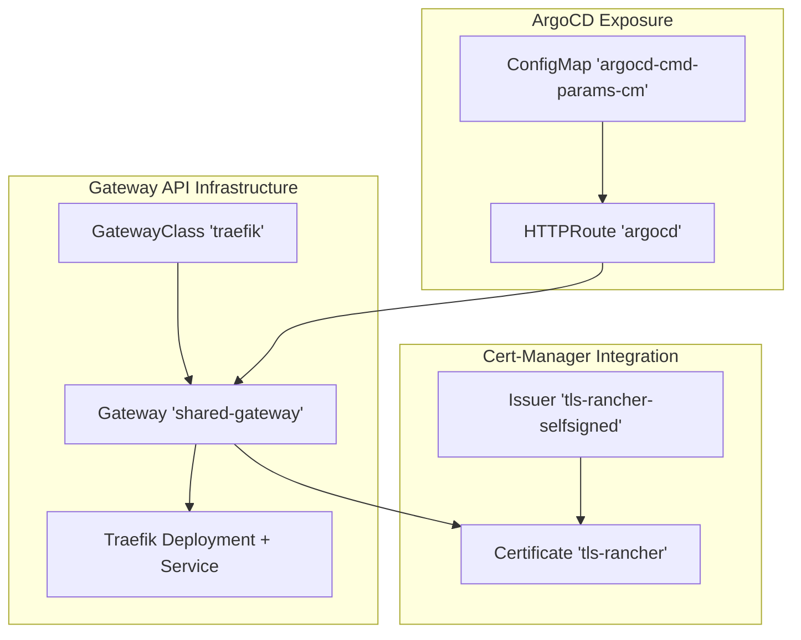
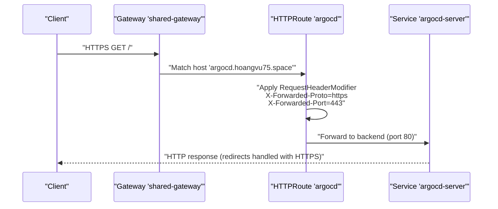
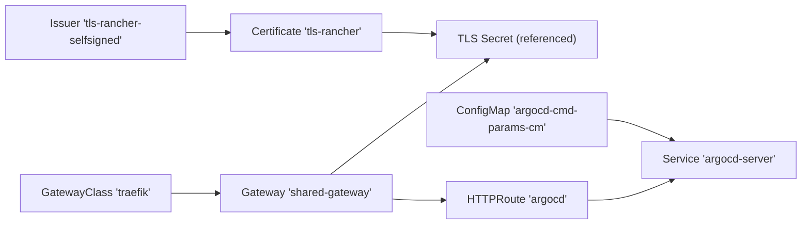
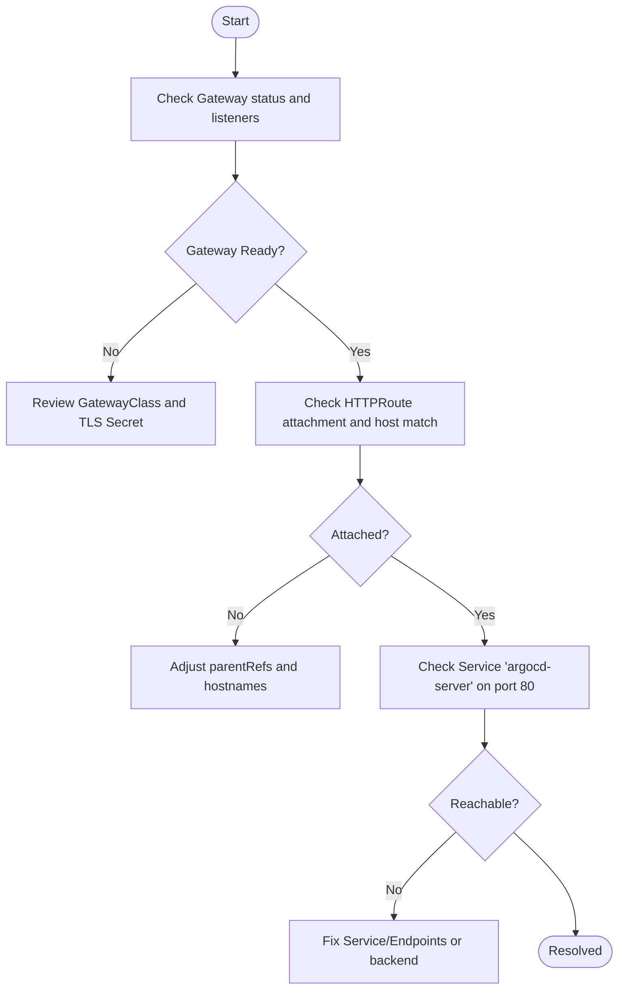

# ArgoCD Ingress Exposure

<cite>
**Referenced Files in This Document**
- [httproute-argocd.yaml](file://apps/playground/argocd-ingress/chart/httproute-argocd.yaml)
- [argocd-cmd-params-cm.yaml](file://apps/playground/argocd-ingress/chart/argocd-cmd-params-cm.yaml)
- [gateway.yaml](file://apps/infra/gateway-api/chart/gateway.yaml)
- [gatewayclass.yaml](file://apps/infra/gateway-api/chart/gatewayclass.yaml)
- [traefik.yaml](file://apps/infra/gateway-api/chart/traefik.yaml)
- [httproute-traefik-dashboard.yaml](file://apps/infra/gateway-api/chart/httproute-traefik-dashboard.yaml)
- [tls-rancher-ca.yaml](file://apps/playground/cert-manager/chart/tls-rancher-ca.yaml)
- [kustomization.yaml (argocd-ingress)](file://apps/playground/argocd-ingress/kustomization.yaml)
- [config.yaml (argocd-ingress)](file://apps/playground/argocd-ingress/config.yaml)
- [values.yaml (argocd-ingress chart)](file://apps/playground/argocd-ingress/chart/values.yaml)
- [kustomization.yaml (cert-manager)](file://apps/playground/cert-manager/kustomization.yaml)
- [values.yaml (rancher chart)](file://apps/playground/rancher/chart/values.yaml)
</cite>

## Table of Contents
1. [Introduction](#introduction)
2. [Project Structure](#project-structure)
3. [Core Components](#core-components)
4. [Architecture Overview](#architecture-overview)
5. [Detailed Component Analysis](#detailed-component-analysis)
6. [Dependency Analysis](#dependency-analysis)
7. [Performance Considerations](#performance-considerations)
8. [Security Considerations](#security-considerations)
9. [Troubleshooting Guide](#troubleshooting-guide)
10. [Conclusion](#conclusion)

## Introduction
This document explains how ArgoCD is exposed securely via Gateway API through an ingress controller, focusing on HTTPRoute configuration for host-based routing and TLS termination, integration with cert-manager for automated certificates, ArgoCD command parameters for web/API customization, and the relationship between ingress exposure and cluster DNS. It also covers ingress class selection, load balancer configuration, network policy considerations, and practical troubleshooting steps for connectivity and certificate validation issues.

## Project Structure
The ArgoCD ingress exposure is implemented across two primary areas:
- Gateway API infrastructure (Traefik-based) providing the Gateway and HTTPRoute controller
- ArgoCD-specific Gateway API resources and ArgoCD command parameters for secure access

**Diagram sources**
- [gatewayclass.yaml:1-10](file://apps/infra/gateway-api/chart/gatewayclass.yaml#L1-L10)
- [gateway.yaml:1-27](file://apps/infra/gateway-api/chart/gateway.yaml#L1-L27)
- [traefik.yaml:1-120](file://apps/infra/gateway-api/chart/traefik.yaml#L1-L120)
- [httproute-argocd.yaml:1-29](file://apps/playground/argocd-ingress/chart/httproute-argocd.yaml#L1-L29)
- [argocd-cmd-params-cm.yaml:1-13](file://apps/playground/argocd-ingress/chart/argocd-cmd-params-cm.yaml#L1-L13)
- [tls-rancher-ca.yaml:1-34](file://apps/playground/cert-manager/chart/tls-rancher-ca.yaml#L1-L34)

**Section sources**
- [kustomization.yaml (argocd-ingress):1-9](file://apps/playground/argocd-ingress/kustomization.yaml#L1-L9)
- [config.yaml (argocd-ingress):1-4](file://apps/playground/argocd-ingress/config.yaml#L1-L4)
- [values.yaml (argocd-ingress chart):1-7](file://apps/playground/argocd-ingress/chart/values.yaml#L1-L7)

## Core Components
- GatewayClass defines the controller implementing Gateway API (Traefik).
- Gateway configures listeners for HTTP/HTTPS, enables TLS termination, and binds to a certificate Secret.
- HTTPRoute routes traffic to ArgoCD server with host-based matching and header manipulation for proper HTTPS detection.
- ArgoCD command parameters ConfigMap sets insecure mode for demonstration; production should enforce TLS.
- Cert-manager Issuer/Certificate produce a CA used by downstream components.

Key implementation references:
- GatewayClass: [gatewayclass.yaml:1-10](file://apps/infra/gateway-api/chart/gatewayclass.yaml#L1-L10)
- Gateway: [gateway.yaml:1-27](file://apps/infra/gateway-api/chart/gateway.yaml#L1-L27)
- HTTPRoute: [httproute-argocd.yaml:1-29](file://apps/playground/argocd-ingress/chart/httproute-argocd.yaml#L1-L29)
- ArgoCD cmd params: [argocd-cmd-params-cm.yaml:1-13](file://apps/playground/argocd-ingress/chart/argocd-cmd-params-cm.yaml#L1-L13)
- Cert-manager CA: [tls-rancher-ca.yaml:1-34](file://apps/playground/cert-manager/chart/tls-rancher-ca.yaml#L1-L34)

**Section sources**
- [gatewayclass.yaml:1-10](file://apps/infra/gateway-api/chart/gatewayclass.yaml#L1-L10)
- [gateway.yaml:1-27](file://apps/infra/gateway-api/chart/gateway.yaml#L1-L27)
- [httproute-argocd.yaml:1-29](file://apps/playground/argocd-ingress/chart/httproute-argocd.yaml#L1-L29)
- [argocd-cmd-params-cm.yaml:1-13](file://apps/playground/argocd-ingress/chart/argocd-cmd-params-cm.yaml#L1-L13)
- [tls-rancher-ca.yaml:1-34](file://apps/playground/cert-manager/chart/tls-rancher-ca.yaml#L1-L34)

## Architecture Overview
End-to-end flow for secure ArgoCD access:
- External clients connect to the Gateway on port 443.
- TLS termination occurs at the Gateway using a certificate Secret.
- HTTPRoute selects the route by hostname and forwards to the ArgoCD server backend.
- Header modifiers ensure the backend sees HTTPS and correct port for redirects and links.

**Diagram sources**
- [gateway.yaml:1-27](file://apps/infra/gateway-api/chart/gateway.yaml#L1-L27)
- [httproute-argocd.yaml:1-29](file://apps/playground/argocd-ingress/chart/httproute-argocd.yaml#L1-L29)

## Detailed Component Analysis

### HTTPRoute for ArgoCD
- Host-based routing: Matches the configured hostname for ArgoCD.
- Path matching: Root path prefix routed to the ArgoCD server.
- Header manipulation: Adds forwarded proto/port headers to ensure correct HTTPS handling in the backend.
- Backend reference: Routes to the ArgoCD server Service on port 80.

Operational implications:
- The backend expects HTTPS due to header injection; ensure ArgoCD is configured accordingly.
- Path prefix routing supports mounting under subpaths if needed.

**Section sources**
- [httproute-argocd.yaml:1-29](file://apps/playground/argocd-ingress/chart/httproute-argocd.yaml#L1-L29)

### Gateway and TLS Termination
- GatewayClass: Selects the Traefik controller for Gateway API.
- Gateway listeners:
  - HTTP listener on port 80.
  - HTTPS listener on port 443 with TLS termination.
- TLS configuration references a certificate Secret for wildcard domain coverage.

Operational implications:
- Certificate Secret must exist in the Gateway namespace and be reconciled by cert-manager.
- HTTPS listener enables secure ingress; HTTP listener can redirect to HTTPS if desired.

**Section sources**
- [gatewayclass.yaml:1-10](file://apps/infra/gateway-api/chart/gatewayclass.yaml#L1-L10)
- [gateway.yaml:1-27](file://apps/infra/gateway-api/chart/gateway.yaml#L1-L27)

### ArgoCD Command Parameters
- ConfigMap sets server insecure mode for demonstration purposes.
- Production deployments should disable insecure mode and rely on TLS termination at the Gateway.

Recommendations:
- Remove or invert insecure mode after TLS is fully validated.
- Ensure ArgoCD server recognizes forwarded headers for accurate URL generation.

**Section sources**
- [argocd-cmd-params-cm.yaml:1-13](file://apps/playground/argocd-ingress/chart/argocd-cmd-params-cm.yaml#L1-L13)

### Cert-manager Integration
- Self-signed Issuer generates a CA.
- Certificate resource issues a long-lived CA certificate stored as a Kubernetes Secret.
- The Gateway references this Secret for TLS termination.

Operational implications:
- Ensure the certificate Secret exists and is mounted by the Gateway.
- Renewal and validity windows are configured for long-term stability.

**Section sources**
- [tls-rancher-ca.yaml:1-34](file://apps/playground/cert-manager/chart/tls-rancher-ca.yaml#L1-L34)
- [gateway.yaml:23-27](file://apps/infra/gateway-api/chart/gateway.yaml#L23-L27)

### Relationship Between Ingress Exposure and Cluster DNS
- HTTPRoute hostname must resolve to the Gateway’s external IP or CNAME.
- External DNS or tunneling (e.g., cloudflared) should forward traffic to the Gateway endpoint.
- Internal cluster DNS resolves Services; external reachability depends on the Gateway’s Service exposure.

[No sources needed since this section provides general guidance]

### Ingress Class Selection and Load Balancer Configuration
- Gateway API is used instead of traditional Ingress; the controller is Traefik.
- Gateway exposes listeners on standard ports; TLS termination is configured at the Gateway.
- Service exposure uses a NodePort-type Service for Traefik; adjust to LoadBalancer or IngressClass if needed in your environment.

**Section sources**
- [gatewayclass.yaml:1-10](file://apps/infra/gateway-api/chart/gatewayclass.yaml#L1-L10)
- [gateway.yaml:1-27](file://apps/infra/gateway-api/chart/gateway.yaml#L1-L27)
- [traefik.yaml:98-120](file://apps/infra/gateway-api/chart/traefik.yaml#L98-L120)

### Network Policy Settings
- Restrict inbound traffic to the Gateway Service (ports 80/443) from trusted networks.
- Allow outbound to ArgoCD server Service on port 80.
- Limit cert-manager Issuer/Certificate access to necessary namespaces.

[No sources needed since this section provides general guidance]

## Dependency Analysis
The following diagram shows dependencies among key resources:

**Diagram sources**
- [gatewayclass.yaml:1-10](file://apps/infra/gateway-api/chart/gatewayclass.yaml#L1-L10)
- [gateway.yaml:1-27](file://apps/infra/gateway-api/chart/gateway.yaml#L1-L27)
- [httproute-argocd.yaml:1-29](file://apps/playground/argocd-ingress/chart/httproute-argocd.yaml#L1-L29)
- [argocd-cmd-params-cm.yaml:1-13](file://apps/playground/argocd-ingress/chart/argocd-cmd-params-cm.yaml#L1-L13)
- [tls-rancher-ca.yaml:1-34](file://apps/playground/cert-manager/chart/tls-rancher-ca.yaml#L1-L34)

**Section sources**
- [gatewayclass.yaml:1-10](file://apps/infra/gateway-api/chart/gatewayclass.yaml#L1-L10)
- [gateway.yaml:1-27](file://apps/infra/gateway-api/chart/gateway.yaml#L1-L27)
- [httproute-argocd.yaml:1-29](file://apps/playground/argocd-ingress/chart/httproute-argocd.yaml#L1-L29)
- [argocd-cmd-params-cm.yaml:1-13](file://apps/playground/argocd-ingress/chart/argocd-cmd-params-cm.yaml#L1-L13)
- [tls-rancher-ca.yaml:1-34](file://apps/playground/cert-manager/chart/tls-rancher-ca.yaml#L1-L34)

## Performance Considerations
- Keep Gateway and HTTPRoute resources minimal and co-located with the application namespace for fast reconciliation.
- Use appropriate sync waves to ensure cert-manager Secrets are ready before the Gateway attempts to mount them.
- Monitor Traefik metrics and logs for latency and error rates.

[No sources needed since this section provides general guidance]

## Security Considerations
- Authentication bypass prevention:
  - Disable insecure mode in production; rely on TLS termination and backend authentication.
  - Ensure HTTPRoute header modifiers reflect HTTPS so ArgoCD generates secure URLs.
- Access control:
  - Restrict HTTPRoute attachment to trusted namespaces.
  - Apply NetworkPolicies to limit inbound/outbound traffic to the Gateway and ArgoCD.
- Certificate management:
  - Use a robust Issuer (e.g., ACME) in production; the current setup uses a self-signed CA for demonstration.
  - Configure appropriate validity/renewal windows and monitor certificate expiry.

**Section sources**
- [argocd-cmd-params-cm.yaml:12-12](file://apps/playground/argocd-ingress/chart/argocd-cmd-params-cm.yaml#L12-L12)
- [httproute-argocd.yaml:20-26](file://apps/playground/argocd-ingress/chart/httproute-argocd.yaml#L20-L26)
- [gateway.yaml:23-27](file://apps/infra/gateway-api/chart/gateway.yaml#L23-L27)
- [tls-rancher-ca.yaml:1-34](file://apps/playground/cert-manager/chart/tls-rancher-ca.yaml#L1-L34)

## Troubleshooting Guide

### Ingress Connectivity Issues
- Verify Gateway status and listeners:
  - Confirm GatewayClass is recognized and the Gateway has accepted listeners.
- Check HTTPRoute attachment:
  - Ensure the HTTPRoute is attached to the Gateway and selecting the correct host.
- Validate backend reachability:
  - Confirm the ArgoCD server Service responds on port 80 from the Gateway pod.

**Diagram sources**
- [gateway.yaml:1-27](file://apps/infra/gateway-api/chart/gateway.yaml#L1-L27)
- [httproute-argocd.yaml:1-29](file://apps/playground/argocd-ingress/chart/httproute-argocd.yaml#L1-L29)

**Section sources**
- [gateway.yaml:1-27](file://apps/infra/gateway-api/chart/gateway.yaml#L1-L27)
- [httproute-argocd.yaml:1-29](file://apps/playground/argocd-ingress/chart/httproute-argocd.yaml#L1-L29)

### Certificate Validation Problems
- Confirm the TLS Secret referenced by the Gateway exists and is valid.
- Ensure cert-manager Issuer/Certificate are healthy and reconciled.
- Validate DNS resolution of the hostname used in HTTPRoute to the Gateway endpoint.

**Section sources**
- [gateway.yaml:23-27](file://apps/infra/gateway-api/chart/gateway.yaml#L23-L27)
- [tls-rancher-ca.yaml:1-34](file://apps/playground/cert-manager/chart/tls-rancher-ca.yaml#L1-L34)

### ArgoCD Web Interface and API Behavior
- If links appear as HTTP or redirects fail:
  - Verify forwarded headers are applied by the HTTPRoute.
  - Review ArgoCD command parameters for insecure mode and update as needed.

**Section sources**
- [httproute-argocd.yaml:20-26](file://apps/playground/argocd-ingress/chart/httproute-argocd.yaml#L20-L26)
- [argocd-cmd-params-cm.yaml:12-12](file://apps/playground/argocd-ingress/chart/argocd-cmd-params-cm.yaml#L12-L12)

## Conclusion
This configuration demonstrates a secure, Gateway API–based ingress for ArgoCD with TLS termination at the Gateway and host-based routing. The setup leverages cert-manager for certificate lifecycle management and HTTPRoute header modifiers to ensure the backend handles HTTPS correctly. For production, replace the self-signed CA with a public Issuer, enforce TLS-only access, and apply strict network policies and monitoring.