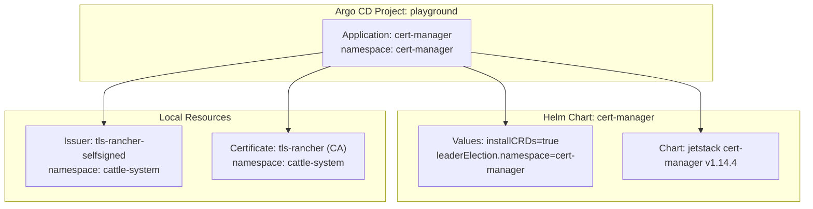
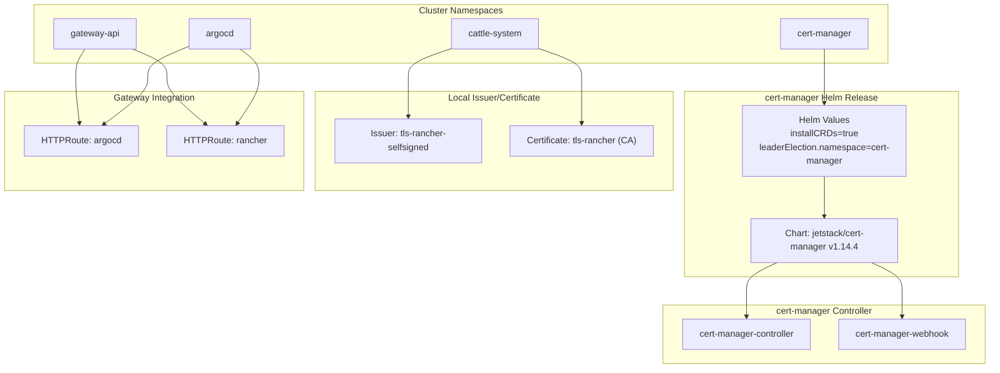
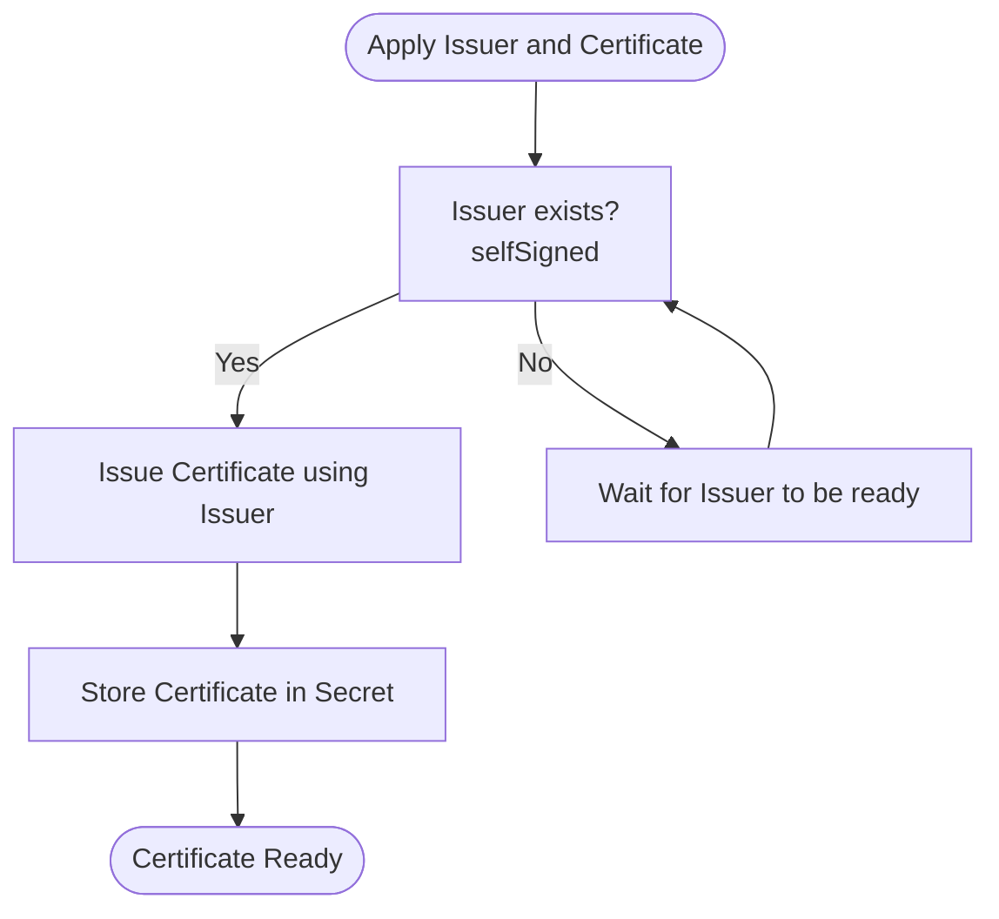
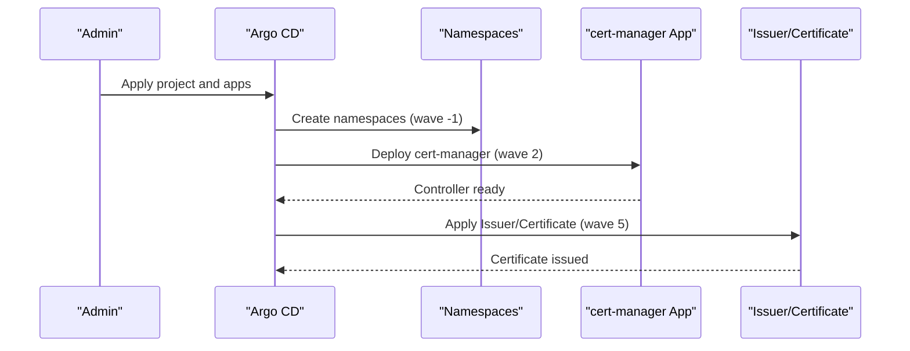
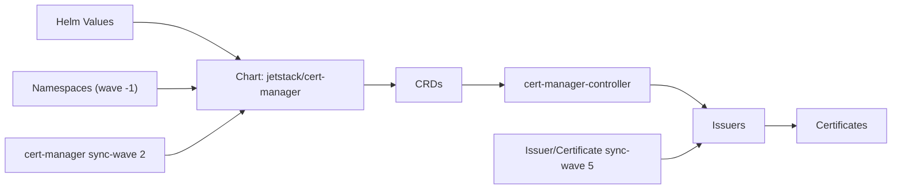

# Certificate Manager Application

<cite>
**Referenced Files in This Document**
- [values.yaml](file://apps/playground/cert-manager/chart/values.yaml)
- [kustomization.yaml](file://apps/playground/cert-manager/chart/kustomization.yaml)
- [tls-rancher-ca.yaml](file://apps/playground/cert-manager/chart/tls-rancher-ca.yaml)
- [config.yaml](file://apps/playground/cert-manager/config.yaml)
- [kustomization.yaml](file://apps/playground/cert-manager/kustomization.yaml)
- [namespace.yaml](file://cluster-resources/default/namespaces.yaml)
- [playground.yaml](file://projects/playground.yaml)
- [httproute-argocd.yaml](file://apps/playground/argocd-ingress/chart/httproute-argocd.yaml)
- [httproute-rancher.yaml](file://apps/playground/rancher/chart/httproute-rancher.yaml)
</cite>

## Table of Contents
1. [Introduction](#introduction)
2. [Project Structure](#project-structure)
3. [Core Components](#core-components)
4. [Architecture Overview](#architecture-overview)
5. [Detailed Component Analysis](#detailed-component-analysis)
6. [Dependency Analysis](#dependency-analysis)
7. [Performance Considerations](#performance-considerations)
8. [Troubleshooting Guide](#troubleshooting-guide)
9. [Conclusion](#conclusion)
10. [Appendices](#appendices)

## Introduction
This document explains the cert-manager application setup and usage within the playground project. It covers installation via the official Helm chart, CRD installation, and custom configuration values. It also documents Issuer and Certificate resources used to issue a self-signed CA certificate for Rancher, along with namespace isolation and Argo CD sync wave ordering to ensure reliable certificate issuance. Practical examples show how to request certificates and integrate them with Gateway API HTTPRoute resources. Security considerations for private key management and certificate rotation are included.

## Project Structure
The cert-manager deployment is managed as a Helm chart within the playground project and orchestrated by Argo CD. The chart installs cert-manager and its CRDs, and a small set of local resources defines a self-signed Issuer and a CA Certificate for internal use.

**Diagram sources**
- [kustomization.yaml:4-10](file://apps/playground/cert-manager/chart/kustomization.yaml#L4-L10)
- [values.yaml:1-6](file://apps/playground/cert-manager/chart/values.yaml#L1-L6)
- [tls-rancher-ca.yaml:1-34](file://apps/playground/cert-manager/chart/tls-rancher-ca.yaml#L1-L34)

**Section sources**
- [kustomization.yaml:1-6](file://apps/playground/cert-manager/kustomization.yaml#L1-L6)
- [kustomization.yaml:1-13](file://apps/playground/cert-manager/chart/kustomization.yaml#L1-L13)
- [values.yaml:1-6](file://apps/playground/cert-manager/chart/values.yaml#L1-L6)

## Core Components
- Helm Chart: The cert-manager Helm chart is configured with installCRDs enabled and leader election configured to operate within the cert-manager namespace. The chart is fetched from the official Jetstack repository and pinned to a specific version.
- Local Issuer and Certificate: A self-signed Issuer is defined in the cattle-system namespace, and a CA Certificate is requested from that Issuer. The Certificate specifies key algorithm, size, duration, renewal window, usages, and the issuer reference.

Key configuration highlights:
- CRD installation controlled via values.
- Leader election namespace configured for cert-manager.
- Self-signed Issuer and CA Certificate with explicit durations and renewal windows.

**Section sources**
- [kustomization.yaml:4-10](file://apps/playground/cert-manager/chart/kustomization.yaml#L4-L10)
- [values.yaml:1-6](file://apps/playground/cert-manager/chart/values.yaml#L1-L6)
- [tls-rancher-ca.yaml:1-34](file://apps/playground/cert-manager/chart/tls-rancher-ca.yaml#L1-L34)

## Architecture Overview
The cert-manager stack is installed via Helm and depends on CRDs being present. Issuers and Certificates are applied after the controller is ready. Namespace isolation ensures cert-manager and related resources live in dedicated namespaces. Argo CD enforces sync waves so that prerequisites (namespaces, Gateways) are created before dependent resources.

**Diagram sources**
- [values.yaml:1-6](file://apps/playground/cert-manager/chart/values.yaml#L1-L6)
- [kustomization.yaml:4-10](file://apps/playground/cert-manager/chart/kustomization.yaml#L4-L10)
- [tls-rancher-ca.yaml:1-34](file://apps/playground/cert-manager/chart/tls-rancher-ca.yaml#L1-L34)
- [httproute-argocd.yaml:1-29](file://apps/playground/argocd-ingress/chart/httproute-argocd.yaml#L1-L29)
- [httproute-rancher.yaml:1-30](file://apps/playground/rancher/chart/httproute-rancher.yaml#L1-L30)

## Detailed Component Analysis

### Helm Chart Setup
- Chart source and version: The chart is fetched from the official Jetstack repository and pinned to a specific version.
- installCRDs: Enabled to ensure CRDs are installed alongside the release.
- leaderElection.namespace: Set to the cert-manager namespace to align leadership election with the controller’s operational namespace.

Operational implications:
- Enabling CRD installation avoids manual pre-steps but requires appropriate RBAC.
- Leader election in the cert-manager namespace ensures predictable coordination among controller replicas.

**Section sources**
- [kustomization.yaml:4-10](file://apps/playground/cert-manager/chart/kustomization.yaml#L4-L10)
- [values.yaml:1-6](file://apps/playground/cert-manager/chart/values.yaml#L1-L6)

### Local Issuer and Certificate (Self-Signed CA)
- Issuer: A self-signed Issuer is defined in the cattle-system namespace with an annotation to delay synchronization until later waves.
- Certificate: A CA Certificate is requested from the self-signed Issuer. It sets:
  - Secret name for the resulting certificate
  - Duration and renewal window
  - Private key algorithm and size
  - Usages indicating certificate and CRL signing
  - Issuer reference to the self-signed Issuer

**Diagram sources**
- [tls-rancher-ca.yaml:1-34](file://apps/playground/cert-manager/chart/tls-rancher-ca.yaml#L1-L34)

**Section sources**
- [tls-rancher-ca.yaml:1-34](file://apps/playground/cert-manager/chart/tls-rancher-ca.yaml#L1-L34)

### Namespace Isolation and Sync Waves
- Namespaces: Dedicated namespaces are created early with negative sync waves to ensure they exist before applications attempt to use them.
- cert-manager application: Configured with a positive sync wave to deploy after prerequisites.
- Internal Issuer/Certificate: Annotated with a later sync wave to ensure the cert-manager controller is ready before issuing.

**Diagram sources**
- [namespace.yaml:1-52](file://cluster-resources/default/namespaces.yaml#L1-L52)
- [config.yaml:1-5](file://apps/playground/cert-manager/config.yaml#L1-L5)
- [tls-rancher-ca.yaml:6-17](file://apps/playground/cert-manager/chart/tls-rancher-ca.yaml#L6-L17)

**Section sources**
- [namespace.yaml:1-52](file://cluster-resources/default/namespaces.yaml#L1-L52)
- [config.yaml:1-5](file://apps/playground/cert-manager/config.yaml#L1-L5)
- [tls-rancher-ca.yaml:6-17](file://apps/playground/cert-manager/chart/tls-rancher-ca.yaml#L6-L17)

### Gateway API Integration Example
While this repository does not define ACME Issuers or HTTP-01/DNS-01 challenges, it demonstrates how to route traffic to services using HTTPRoute and how certificates are typically referenced in higher-level components.

- HTTPRoute for argocd references a Gateway and sets forwarded headers.
- HTTPRoute for rancher similarly references a Gateway and routes to the service.

These routes illustrate where TLS certificates would be attached in production setups (e.g., via Gateway TLS settings or Ingress annotations in other environments).

**Section sources**
- [httproute-argocd.yaml:1-29](file://apps/playground/argocd-ingress/chart/httproute-argocd.yaml#L1-L29)
- [httproute-rancher.yaml:1-30](file://apps/playground/rancher/chart/httproute-rancher.yaml#L1-L30)

## Dependency Analysis
The cert-manager application depends on:
- Helm chart availability and correct version pinning
- CRDs installed prior to controller readiness
- Controller readiness before issuing Certificates
- Namespace existence before applying resources

**Diagram sources**
- [values.yaml:1-6](file://apps/playground/cert-manager/chart/values.yaml#L1-L6)
- [kustomization.yaml:4-10](file://apps/playground/cert-manager/chart/kustomization.yaml#L4-L10)
- [namespace.yaml:1-52](file://cluster-resources/default/namespaces.yaml#L1-L52)
- [config.yaml:1-5](file://apps/playground/cert-manager/config.yaml#L1-L5)
- [tls-rancher-ca.yaml:6-17](file://apps/playground/cert-manager/chart/tls-rancher-ca.yaml#L6-L17)

**Section sources**
- [values.yaml:1-6](file://apps/playground/cert-manager/chart/values.yaml#L1-L6)
- [kustomization.yaml:4-10](file://apps/playground/cert-manager/chart/kustomization.yaml#L4-L10)
- [namespace.yaml:1-52](file://cluster-resources/default/namespaces.yaml#L1-L52)
- [config.yaml:1-5](file://apps/playground/cert-manager/config.yaml#L1-L5)
- [tls-rancher-ca.yaml:6-17](file://apps/playground/cert-manager/chart/tls-rancher-ca.yaml#L6-L17)

## Performance Considerations
- Keep the cert-manager version pinned to a tested release to avoid unexpected behavioral changes.
- Limit the number of concurrent Certificate requests during initial bootstrapping to reduce load on the API server.
- Use appropriate renewBefore and duration settings to balance certificate lifetime and rotation overhead.
- Ensure adequate CPU/memory requests/limits for the cert-manager pods to maintain responsiveness under load.

## Troubleshooting Guide
Common issues and resolutions:
- CRDs missing: Verify installCRDs is enabled and the release includes CRDs. Check that the cert-manager namespace exists and the controller is running.
- Issuer not ready: Confirm the Issuer resource is applied after the controller is ready. Adjust sync waves accordingly.
- Certificate pending: Inspect the Certificate status for reasons such as invalid issuer reference, insufficient permissions, or misconfigured private key parameters.
- Namespace creation delays: Ensure namespace resources are applied with earlier sync waves than dependent resources.
- ACME challenges (when used): If integrating ACME later, verify DNS-01 or HTTP-01 credentials and webhook configurations. Ensure DNS records propagate or HTTP-01 challenges are reachable.

**Section sources**
- [values.yaml:1-6](file://apps/playground/cert-manager/chart/values.yaml#L1-L6)
- [config.yaml:1-5](file://apps/playground/cert-manager/config.yaml#L1-L5)
- [tls-rancher-ca.yaml:6-17](file://apps/playground/cert-manager/chart/tls-rancher-ca.yaml#L6-L17)

## Conclusion
The cert-manager application in this project is deployed via a pinned Helm chart with CRDs installed automatically. A self-signed Issuer and CA Certificate are provisioned in the cattle-system namespace with careful sync wave ordering to ensure reliability. While this repository focuses on a self-signed CA for internal use, the same patterns apply when integrating with ACME providers and Gateway API routing. Proper namespace isolation, sync waves, and certificate lifecycle settings are essential for robust TLS certificate management.

## Appendices

### Practical Examples Index
- Installing cert-manager via Helm with CRDs and leader election configuration
  - [values.yaml:1-6](file://apps/playground/cert-manager/chart/values.yaml#L1-L6)
  - [kustomization.yaml:4-10](file://apps/playground/cert-manager/chart/kustomization.yaml#L4-L10)
- Defining a self-signed Issuer and CA Certificate
  - [tls-rancher-ca.yaml:1-34](file://apps/playground/cert-manager/chart/tls-rancher-ca.yaml#L1-L34)
- Applying cert-manager with namespace isolation and sync waves
  - [namespace.yaml:1-52](file://cluster-resources/default/namespaces.yaml#L1-L52)
  - [config.yaml:1-5](file://apps/playground/cert-manager/config.yaml#L1-L5)
- Routing traffic via HTTPRoute (for reference)
  - [httproute-argocd.yaml:1-29](file://apps/playground/argocd-ingress/chart/httproute-argocd.yaml#L1-L29)
  - [httproute-rancher.yaml:1-30](file://apps/playground/rancher/chart/httproute-rancher.yaml#L1-L30)