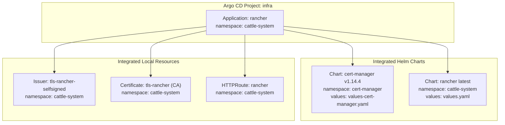
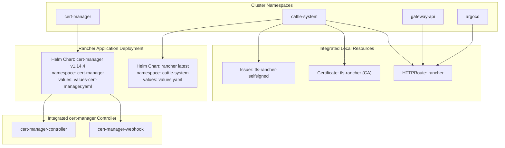
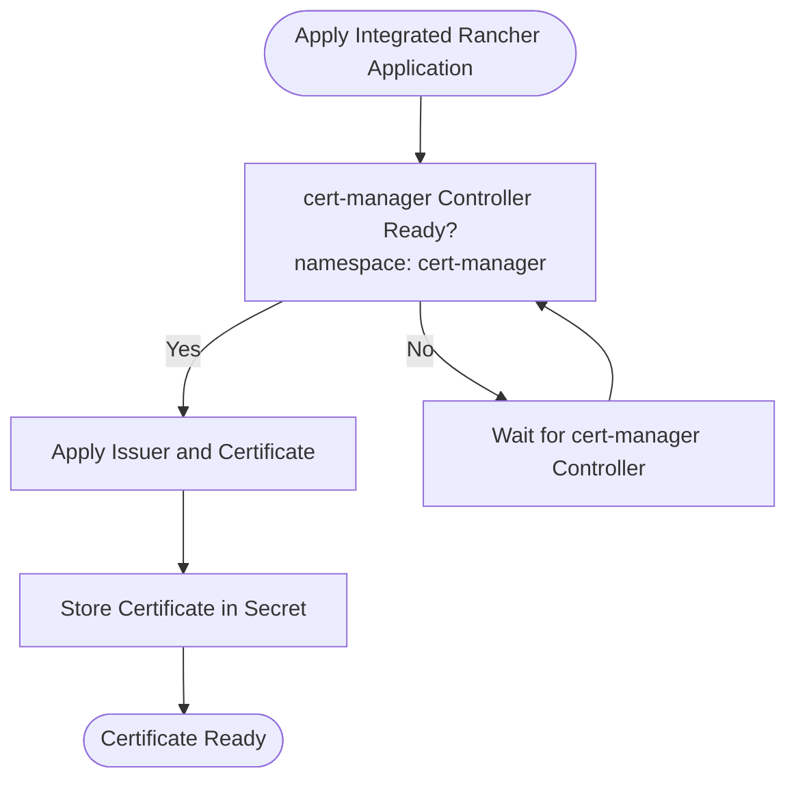
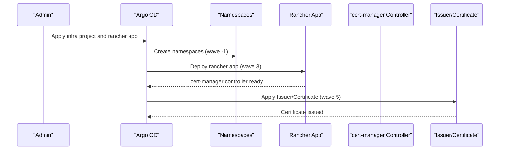
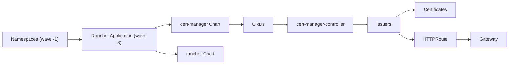

# Certificate Manager Application

<cite>
**Referenced Files in This Document**
- [values-cert-manager.yaml](file://apps/infra/rancher/chart/values-cert-manager.yaml)
- [kustomization.yaml](file://apps/infra/rancher/chart/kustomization.yaml)
- [tls-rancher-ca.yaml](file://apps/infra/rancher/chart/tls-rancher-ca.yaml)
- [config.yaml](file://apps/infra/rancher/config.yaml)
- [kustomization.yaml](file://apps/infra/rancher/kustomization.yaml)
- [namespace.yaml](file://cluster-resources/default/namespace.yaml)
- [infra.yaml](file://projects/infra.yaml)
- [httproute-rancher.yaml](file://apps/infra/rancher/chart/httproute-rancher.yaml)
</cite>

## Update Summary
**Changes Made**
- Updated architecture overview to reflect the consolidation of cert-manager into the rancher application
- Revised project structure to show cert-manager as part of the rancher deployment rather than a standalone application
- Updated component analysis to reflect the new integrated approach
- Modified dependency analysis to show the relationship between rancher and cert-manager helm charts
- Updated troubleshooting guidance to address the new consolidated deployment model

## Table of Contents
1. [Introduction](#introduction)
2. [Project Structure](#project-structure)
3. [Core Components](#core-components)
4. [Architecture Overview](#architecture-overview)
5. [Detailed Component Analysis](#detailed-component-analysis)
6. [Dependency Analysis](#dependency-analysis)
7. [Performance Considerations](#performance-considerations)
8. [Troubleshooting Guide](#troubleshooting-guide)
9. [Conclusion](#conclusion)
10. [Appendices](#appendices)

## Introduction
This document explains the cert-manager application setup and usage within the rancher application deployment. The cert-manager functionality has been consolidated into the rancher application, making it an integral part of the rancher deployment rather than a standalone application. This document covers the integrated Helm chart setup, CRD installation, and custom configuration values. It also documents the Issuer and Certificate resources used to issue a self-signed CA certificate for Rancher, along with namespace isolation and Argo CD sync wave ordering to ensure reliable certificate issuance. Practical examples show how to request certificates and integrate them with Gateway API HTTPRoute resources. Security considerations for private key management and certificate rotation are included.

## Project Structure
The cert-manager functionality is now integrated directly into the rancher application deployment. The rancher application manages both the rancher server and the cert-manager components through a single Helm chart configuration. The cert-manager is deployed as part of the rancher application with its own values file and shares the same namespace configuration.

**Diagram sources**
- [kustomization.yaml:4-19](file://apps/infra/rancher/chart/kustomization.yaml#L4-L19)
- [values-cert-manager.yaml:1-6](file://apps/infra/rancher/chart/values-cert-manager.yaml#L1-L6)
- [tls-rancher-ca.yaml:1-34](file://apps/infra/rancher/chart/tls-rancher-ca.yaml#L1-L34)

**Section sources**
- [kustomization.yaml:1-9](file://apps/infra/rancher/kustomization.yaml#L1-L9)
- [kustomization.yaml:4-19](file://apps/infra/rancher/chart/kustomization.yaml#L4-L19)
- [values-cert-manager.yaml:1-6](file://apps/infra/rancher/chart/values-cert-manager.yaml#L1-L6)

## Core Components
The rancher application now includes integrated cert-manager functionality through a consolidated Helm chart configuration. The cert-manager is configured as part of the rancher deployment with dedicated values and shares the same namespace management approach.

- **Integrated Helm Charts**: The rancher application manages both the rancher server and cert-manager components through a single kustomization file that defines two separate Helm charts: cert-manager and rancher.
- **Cert-manager Configuration**: The cert-manager chart is configured with installCRDs enabled and leader election configured to operate within the cert-manager namespace.
- **Local Issuer and Certificate**: A self-signed Issuer is defined in the cattle-system namespace, and a CA Certificate is requested from that Issuer. The Certificate specifies key algorithm, size, duration, renewal window, usages, and the issuer reference.
- **Shared Namespace Management**: Both cert-manager and rancher share the same namespace configuration through the rancher application's namespace setting.

Key configuration highlights:
- Integrated Helm chart management for both cert-manager and rancher
- CRD installation controlled via values-cert-manager.yaml
- Leader election namespace configured for cert-manager
- Self-signed Issuer and CA Certificate with explicit durations and renewal windows
- Shared namespace configuration across both applications

**Section sources**
- [kustomization.yaml:4-19](file://apps/infra/rancher/chart/kustomization.yaml#L4-L19)
- [values-cert-manager.yaml:1-6](file://apps/infra/rancher/chart/values-cert-manager.yaml#L1-L6)
- [tls-rancher-ca.yaml:1-34](file://apps/infra/rancher/chart/tls-rancher-ca.yaml#L1-L34)
- [config.yaml:1-5](file://apps/infra/rancher/config.yaml#L1-L5)

## Architecture Overview
The cert-manager functionality is now integrated directly into the rancher application deployment. The rancher application manages both the rancher server and cert-manager components through a unified Helm chart configuration. This consolidation eliminates the need for a separate cert-manager application while maintaining all cert-manager functionality.

**Diagram sources**
- [kustomization.yaml:4-19](file://apps/infra/rancher/chart/kustomization.yaml#L4-L19)
- [values-cert-manager.yaml:1-6](file://apps/infra/rancher/chart/values-cert-manager.yaml#L1-L6)
- [tls-rancher-ca.yaml:1-34](file://apps/infra/rancher/chart/tls-rancher-ca.yaml#L1-L34)
- [httproute-rancher.yaml:1-30](file://apps/infra/rancher/chart/httproute-rancher.yaml#L1-L30)

## Detailed Component Analysis

### Integrated Helm Chart Setup
The rancher application now manages both cert-manager and rancher components through a unified Helm chart configuration. The kustomization file defines two separate Helm charts that are deployed together as part of the rancher application.

- **Cert-manager Chart**: Configured with installCRDs enabled and leader election namespace set to cert-manager
- **Rancher Chart**: Configured with hostname, bootstrap password, replicas, and ingress settings
- **Chart Repositories**: Uses official repositories for both charts with pinned versions
- **Namespace Management**: Each chart maintains its own namespace while being deployed together

Operational implications:
- Simplified deployment through unified application management
- Reduced complexity by eliminating separate cert-manager application
- Maintained separation of concerns through distinct namespaces
- Preserved all cert-manager functionality within the rancher deployment

**Section sources**
- [kustomization.yaml:4-19](file://apps/infra/rancher/chart/kustomization.yaml#L4-L19)
- [values-cert-manager.yaml:1-6](file://apps/infra/rancher/chart/values-cert-manager.yaml#L1-L6)
- [values.yaml:1-9](file://apps/infra/rancher/chart/values.yaml#L1-L9)

### Local Issuer and Certificate (Self-Signed CA)
The self-signed CA certificate and issuer are now part of the integrated rancher application deployment. These resources are applied alongside the rancher and cert-manager components with careful sync wave ordering.

- **Issuer**: A self-signed Issuer is defined in the cattle-system namespace with an annotation to delay synchronization until later waves
- **Certificate**: A CA Certificate is requested from the self-signed Issuer with the same configuration as before
- **Sync Wave Ordering**: Both resources are configured with sync wave 5 to ensure cert-manager controller is ready before issuance

**Diagram sources**
- [tls-rancher-ca.yaml:1-34](file://apps/infra/rancher/chart/tls-rancher-ca.yaml#L1-L34)
- [kustomization.yaml:17-19](file://apps/infra/rancher/chart/kustomization.yaml#L17-L19)

**Section sources**
- [tls-rancher-ca.yaml:1-34](file://apps/infra/rancher/chart/tls-rancher-ca.yaml#L1-L34)

### Namespace Isolation and Sync Waves
The namespace isolation strategy remains consistent with the previous architecture, ensuring proper deployment order and resource availability. The integrated approach maintains the same sync wave patterns while adding the rancher application layer.

- **Namespaces**: Dedicated namespaces are created early with negative sync waves to ensure they exist before applications attempt to use them
- **Rancher Application**: Configured with sync wave 3 to deploy after prerequisites but before certificate issuance
- **Internal Issuer/Certificate**: Annotated with sync wave 5 to ensure the cert-manager controller is ready before issuing
- **Shared Namespace Management**: Both cert-manager and rancher share the cattle-system namespace configuration

**Diagram sources**
- [namespace.yaml:1-60](file://cluster-resources/default/namespace.yaml#L1-L60)
- [config.yaml:1-5](file://apps/infra/rancher/config.yaml#L1-L5)
- [tls-rancher-ca.yaml:6-17](file://apps/infra/rancher/chart/tls-rancher-ca.yaml#L6-L17)

**Section sources**
- [namespace.yaml:1-60](file://cluster-resources/default/namespace.yaml#L1-L60)
- [config.yaml:1-5](file://apps/infra/rancher/config.yaml#L1-L5)
- [tls-rancher-ca.yaml:6-17](file://apps/infra/rancher/chart/tls-rancher-ca.yaml#L6-L17)

### Gateway API Integration Example
The Gateway API integration remains unchanged, demonstrating how traffic is routed to the rancher service using HTTPRoute resources. The certificate management is now handled internally by the integrated cert-manager within the rancher application.

- **HTTPRoute Configuration**: Routes traffic to the rancher service with proper header modifications
- **Gateway Reference**: References the shared gateway in the gateway-api namespace
- **Hostname Configuration**: Uses the rancher hostname for proper TLS termination
- **Backend Service**: Points to the rancher service on port 80

**Section sources**
- [httproute-rancher.yaml:1-30](file://apps/infra/rancher/chart/httproute-rancher.yaml#L1-L30)

## Dependency Analysis
The integrated rancher application deployment creates dependencies between the rancher application, cert-manager, and supporting infrastructure. The cert-manager is now a core component of the rancher deployment rather than a separate dependency.

**Diagram sources**
- [namespace.yaml:1-60](file://cluster-resources/default/namespace.yaml#L1-L60)
- [kustomization.yaml:4-19](file://apps/infra/rancher/chart/kustomization.yaml#L4-L19)
- [config.yaml:1-5](file://apps/infra/rancher/config.yaml#L1-L5)
- [tls-rancher-ca.yaml:6-17](file://apps/infra/rancher/chart/tls-rancher-ca.yaml#L6-L17)

**Section sources**
- [namespace.yaml:1-60](file://cluster-resources/default/namespace.yaml#L1-L60)
- [kustomization.yaml:4-19](file://apps/infra/rancher/chart/kustomization.yaml#L4-L19)
- [config.yaml:1-5](file://apps/infra/rancher/config.yaml#L1-L5)
- [tls-rancher-ca.yaml:6-17](file://apps/infra/rancher/chart/tls-rancher-ca.yaml#L6-L17)

## Performance Considerations
The integrated deployment model offers several performance benefits while maintaining the same operational characteristics:

- **Reduced Overhead**: Single application deployment reduces management overhead compared to separate cert-manager and rancher applications
- **Consistent Versioning**: Both components benefit from the same version pinning and update cycles
- **Resource Sharing**: Shared namespace management reduces resource duplication
- **Deployment Efficiency**: Unified deployment process simplifies scaling and maintenance operations
- **Maintainability**: Single point of configuration for both cert-manager and rancher components

## Troubleshooting Guide
The troubleshooting approach remains similar to the previous architecture, with additional considerations for the integrated deployment model:

**Updated** Common issues and resolutions for the integrated cert-manager within rancher:

- **CRDs missing**: Verify the cert-manager chart is configured with installCRDs enabled in values-cert-manager.yaml. Check that the cert-manager namespace exists and the controller is running as part of the rancher application deployment.
- **Issuer not ready**: Confirm the Issuer resource is applied after the cert-manager controller is ready. Adjust sync waves in the rancher application configuration if needed.
- **Certificate pending**: Inspect the Certificate status for reasons such as invalid issuer reference, insufficient permissions, or misconfigured private key parameters. Check the rancher application logs for cert-manager errors.
- **Namespace creation delays**: Ensure namespace resources are applied with earlier sync waves than dependent resources. The integrated approach maintains the same namespace dependency pattern.
- **Application deployment failures**: Since cert-manager is now part of the rancher application, troubleshoot deployment issues through the rancher application's sync waves and configuration.
- **ACME challenges (when used)**: If integrating ACME later, verify DNS-01 or HTTP-01 credentials and webhook configurations. Ensure DNS records propagate or HTTP-01 challenges are reachable through the integrated deployment.

**Section sources**
- [values-cert-manager.yaml:1-6](file://apps/infra/rancher/chart/values-cert-manager.yaml#L1-L6)
- [config.yaml:1-5](file://apps/infra/rancher/config.yaml#L1-L5)
- [tls-rancher-ca.yaml:6-17](file://apps/infra/rancher/chart/tls-rancher-ca.yaml#L6-L17)

## Conclusion
The cert-manager functionality has been successfully consolidated into the rancher application, creating a more streamlined and maintainable deployment model. The integrated approach maintains all cert-manager functionality while reducing complexity through unified application management. The same patterns for self-signed CA issuance, namespace isolation, and sync wave ordering continue to apply, but now within the context of the rancher application deployment. This consolidation provides better operational efficiency while preserving the reliability and security characteristics of the previous standalone cert-manager setup.

## Appendices

### Practical Examples Index
- **Installing integrated cert-manager and rancher via Helm with unified configuration**
  - [kustomization.yaml:4-19](file://apps/infra/rancher/chart/kustomization.yaml#L4-L19)
  - [values-cert-manager.yaml:1-6](file://apps/infra/rancher/chart/values-cert-manager.yaml#L1-L6)
  - [values.yaml:1-9](file://apps/infra/rancher/chart/values.yaml#L1-L9)
- **Defining a self-signed Issuer and CA Certificate within the rancher application**
  - [tls-rancher-ca.yaml:1-34](file://apps/infra/rancher/chart/tls-rancher-ca.yaml#L1-L34)
- **Applying integrated rancher application with namespace isolation and sync waves**
  - [namespace.yaml:1-60](file://cluster-resources/default/namespace.yaml#L1-L60)
  - [config.yaml:1-5](file://apps/infra/rancher/config.yaml#L1-L5)
- **Routing traffic via HTTPRoute (integrated with rancher application)**
  - [httproute-rancher.yaml:1-30](file://apps/infra/rancher/chart/httproute-rancher.yaml#L1-L30)