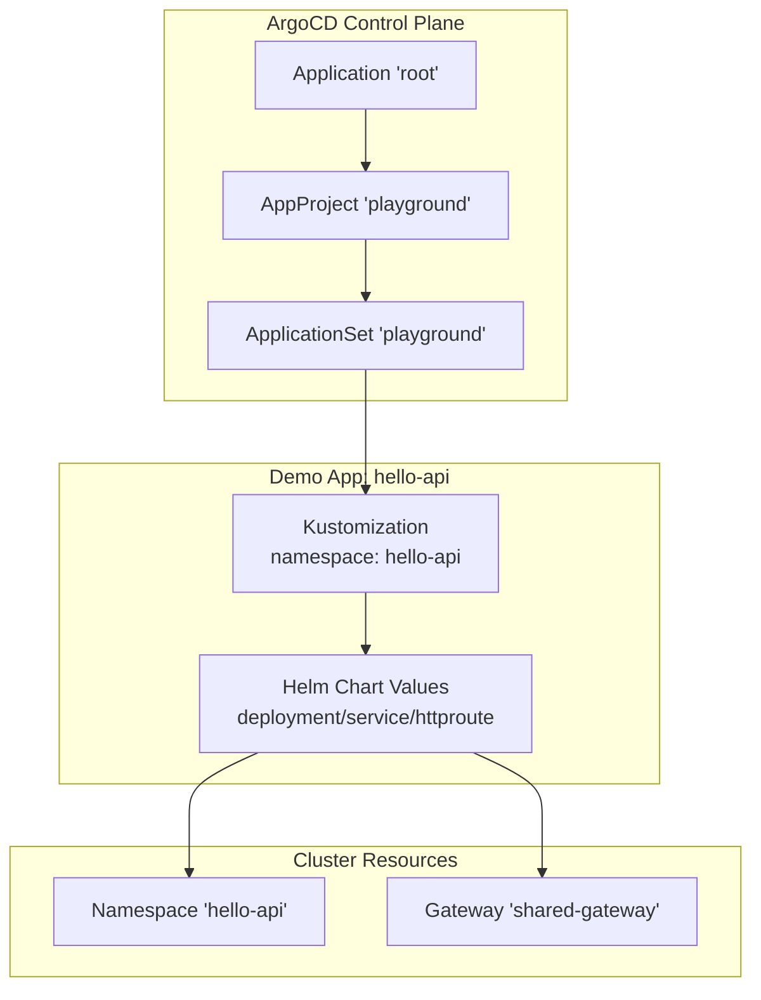
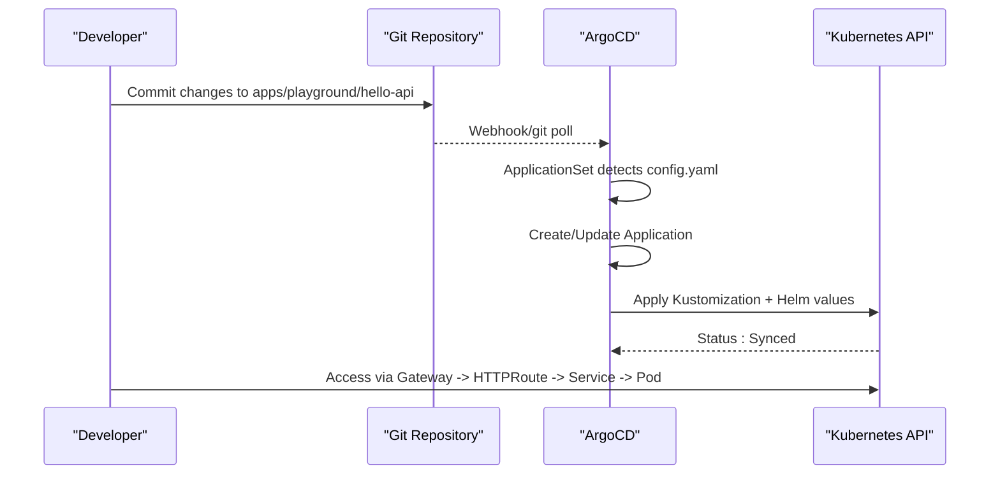
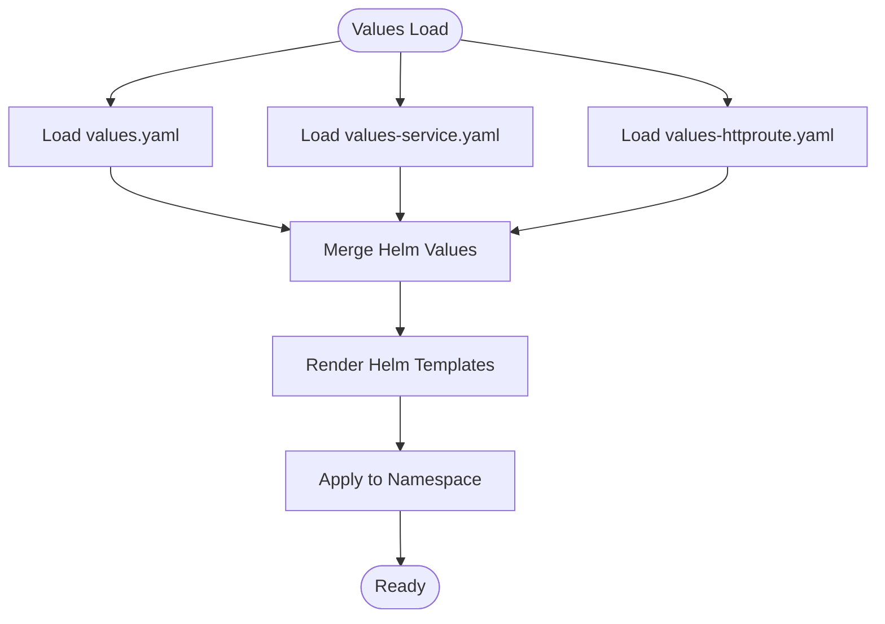
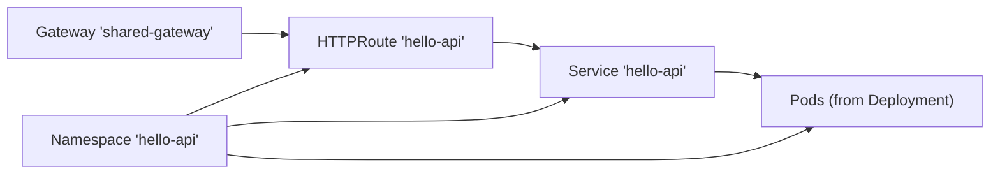

# Demo Applications

<cite>
**Referenced Files in This Document**
- [values.yaml](file://apps/playground/hello-api/chart/values.yaml)
- [values-service.yaml](file://apps/playground/hello-api/chart/values-service.yaml)
- [values-httproute.yaml](file://apps/playground/hello-api/chart/values-httproute.yaml)
- [kustomization.yaml](file://apps/playground/hello-api/kustomization.yaml)
- [config.yaml](file://apps/playground/hello-api/config.yaml)
- [playground.yaml](file://projects/playground.yaml)
- [namespace.yaml](file://cluster-resources/default/namespace.yaml)
- [gateway.yaml](file://apps/infra/gateway-api/chart/gateway.yaml)
- [httproute-argocd.yaml](file://apps/playground/argocd-ingress/chart/httproute-argocd.yaml)
- [httproute-rancher.yaml](file://apps/playground/rancher/chart/httproute-rancher.yaml)
- [root.yaml](file://bootstrap/root.yaml)
- [argo_cd.md](file://guide/argocd/argo_cd.md)
</cite>

## Update Summary
**Changes Made**
- Removed documentation for the HTTPRoute defaults component system
- Updated multi-value configuration approach to reflect direct HTTPRoute standardization
- Removed component-based standardization references throughout the document
- Updated dependency analysis to remove component relationships
- Revised architecture diagrams to show direct HTTPRoute configuration
- Updated troubleshooting guide to remove component-related issues

## Table of Contents
1. [Introduction](#introduction)
2. [Project Structure](#project-structure)
3. [Core Components](#core-components)
4. [Architecture Overview](#architecture-overview)
5. [Detailed Component Analysis](#detailed-component-analysis)
6. [Dependency Analysis](#dependency-analysis)
7. [Performance Considerations](#performance-considerations)
8. [Troubleshooting Guide](#troubleshooting-guide)
9. [Conclusion](#conclusion)
10. [Appendices](#appendices)

## Introduction
This document explains the demo applications deployed in the playground environment, focusing on the hello-api application. It covers configuration across multiple Helm values files (service, ingress via HTTPRoute, and deployment), ArgoCD-driven GitOps synchronization, namespace isolation, and practical update/rollback guidance. The demo applications now feature direct HTTPRoute standardization without the centralized component system.

## Project Structure
The playground is managed as an ArgoCD ApplicationSet that discovers and deploys demo applications from the repository. Each demo app defines its own Kustomization and Helm values, enabling modular configuration and safe separation of concerns. The applications now implement direct HTTPRoute standardization patterns for routing behavior across all demo applications.

**Diagram sources**
- [root.yaml:10-19](file://bootstrap/root.yaml#L10-L19)
- [playground.yaml:23-45](file://projects/playground.yaml#L23-L45)
- [kustomization.yaml:4](file://apps/playground/hello-api/kustomization.yaml#L4)
- [gateway.yaml:1-27](file://apps/infra/gateway-api/chart/gateway.yaml#L1-L27)

**Section sources**
- [playground.yaml:1-90](file://projects/playground.yaml#L1-L90)
- [root.yaml:1-37](file://bootstrap/root.yaml#L1-L37)
- [kustomization.yaml:1-8](file://apps/playground/hello-api/kustomization.yaml#L1-L8)

## Core Components
- Application discovery and deployment: Managed by an ApplicationSet that scans the apps/playground/**/config.yaml files and generates per-app Application resources. Namespaces are created automatically during sync.
- hello-api module: Composed of three Helm values overlays—deployment, service, and HTTPRoute—to cleanly separate concerns and enable incremental updates.
- Ingress and routing: HTTPRoute resources attach to a shared Gateway, enabling path-based routing and header manipulation. Now implemented through direct standardization patterns.
- Namespace isolation: Each demo app runs in its own namespace, isolated from others for safety and experimentation.
- Direct HTTPRoute standardization: Applications implement routing behavior patterns directly without centralized component management.

Key configuration anchors:
- Deployment and container image/ports/resources
- Service exposure and port mapping
- HTTPRoute path matching, hostname, and backend routing
- Kustomization namespace binding and ArgoCD annotations
- Direct HTTPRoute standardization patterns

**Section sources**
- [playground.yaml:33-59](file://projects/playground.yaml#L33-L59)
- [config.yaml:1-4](file://apps/playground/hello-api/config.yaml#L1-L4)
- [values.yaml:1-23](file://apps/playground/hello-api/chart/values.yaml#L1-L23)
- [values-service.yaml:1-6](file://apps/playground/hello-api/chart/values-service.yaml#L1-L6)
- [values-httproute.yaml:1-26](file://apps/playground/hello-api/chart/values-httproute.yaml#L1-L26)
- [kustomization.yaml:4](file://apps/playground/hello-api/kustomization.yaml#L4)

## Architecture Overview
The hello-api demo demonstrates a typical GitOps flow with direct HTTPRoute standardization:
- Changes are committed to the repository under apps/playground/hello-api.
- ArgoCD's ApplicationSet detects the change via a Git generator and creates/updates an Application.
- The Application applies Kustomization and Helm values to the target namespace.
- HTTPRoute resources implement standard routing behavior directly without component dependencies.
- A Gateway routes traffic to the HTTPRoute, which forwards to the Service and Pod.

**Diagram sources**
- [playground.yaml:33-59](file://projects/playground.yaml#L33-L59)
- [config.yaml:1-4](file://apps/playground/hello-api/config.yaml#L1-L4)
- [kustomization.yaml:1-8](file://apps/playground/hello-api/kustomization.yaml#L1-L8)
- [gateway.yaml:1-27](file://apps/infra/gateway-api/chart/gateway.yaml#L1-L27)

## Detailed Component Analysis

### Multi-Value Configuration Approach
The hello-api module splits concerns across three values files:
- Deployment and container configuration: image, replicas, ports, args, and resource requests/limits.
- Service configuration: enabling the Service and mapping container ports to service ports.
- HTTPRoute configuration: enabling the route, attaching to a shared Gateway, setting hostnames, path matching, optional header filters, and backend references.

Benefits:
- Separation of concerns enables safer rollouts (e.g., update HTTPRoute without touching Deployment).
- Reusability across environments via Kustomization overlays.
- Predictable sync waves to control ordering.
- Direct HTTPRoute standardization without component dependencies.

**Diagram sources**
- [values.yaml:1-23](file://apps/playground/hello-api/chart/values.yaml#L1-L23)
- [values-service.yaml:1-6](file://apps/playground/hello-api/chart/values-service.yaml#L1-L6)
- [values-httproute.yaml:1-26](file://apps/playground/hello-api/chart/values-httproute.yaml#L1-L26)

**Section sources**
- [values.yaml:1-23](file://apps/playground/hello-api/chart/values.yaml#L1-L23)
- [values-service.yaml:1-6](file://apps/playground/hello-api/chart/values-service.yaml#L1-L6)
- [values-httproute.yaml:1-26](file://apps/playground/hello-api/chart/values-httproute.yaml#L1-L26)

### Service Definition
- Service is enabled and exposes the container port via targetPort to service port mapping.
- This decouples internal container ports from external exposure, simplifying changes.

Operational notes:
- Ensure the Service name matches the backendRef referenced by the HTTPRoute.
- Keep port numbers consistent across values-service.yaml and values-httproute.yaml.

**Section sources**
- [values-service.yaml:1-6](file://apps/playground/hello-api/chart/values-service.yaml#L1-L6)

### Ingress Routing via HTTPRoute
- HTTPRoute is enabled and attached to a shared Gateway via parentRefs.
- Hostname and path prefix define routing scope.
- Optional filters set forwarded headers for upstream compatibility.
- BackendRef targets the Service name and port.

**Updated** The HTTPRoute now implements direct standardization patterns, eliminating the need for centralized component management while maintaining consistent routing behavior across all demo applications.

Operational notes:
- The shared Gateway must exist in the gateway-api namespace.
- PathPrefix matching allows clean separation of routes across demo apps.
- Direct HTTPRoute standardization ensures consistent behavior without component dependencies.

**Section sources**
- [values-httproute.yaml:1-26](file://apps/playground/hello-api/chart/values-httproute.yaml#L1-L26)
- [gateway.yaml:1-27](file://apps/infra/gateway-api/chart/gateway.yaml#L1-L27)

### HTTPRoute Setup Example
- Parent reference to shared Gateway in the gateway-api namespace.
- Hostname configured for the route.
- Path match for a specific prefix.
- Header filters to simulate secure proxy headers.
- BackendRef pointing to the Service and port.

**Updated** The HTTPRoute setup now relies on direct standardization patterns, reducing complexity and eliminating component dependencies while ensuring consistent routing behavior across all demo applications.

**Section sources**
- [values-httproute.yaml:5-25](file://apps/playground/hello-api/chart/values-httproute.yaml#L5-L25)

### Kustomization and Namespace Binding
- Kustomization sets the target namespace to hello-api.
- ArgoCD annotations propagate through ApplicationSet templates to control sync ordering.

Operational notes:
- Namespace creation is handled by ArgoCD sync options.
- Keep the namespace consistent across Kustomization and HTTPRoute backendRefs.
- Direct HTTPRoute standardization eliminates component dependency requirements.

**Section sources**
- [kustomization.yaml:4](file://apps/playground/hello-api/kustomization.yaml#L4)
- [config.yaml:1-4](file://apps/playground/hello-api/config.yaml#L1-L4)

### Relationship to Playground Namespace Isolation
- Cluster-level namespaces for infrastructure are pre-provisioned with early sync waves.
- Demo app namespaces are created during Application sync with CreateNamespace enabled.
- This ensures isolation and predictable resource ownership.

**Section sources**
- [namespace.yaml:1-52](file://cluster-resources/default/namespace.yaml#L1-L52)
- [playground.yaml:72-74](file://projects/playground.yaml#L72-L74)

### ArgoCD Synchronization and GitOps Workflow
- ApplicationSet scans for config.yaml files under apps/playground/**/config.yaml.
- Templates derive Application names, destinations, and Kustomize paths.
- Sync policy automates pruning, self-healing, and retries.
- Sync waves coordinate order across cluster resources, gateways, and demo apps.

Practical implications:
- Use annotations to influence sync wave ordering.
- Leverage automated retry/backoff to handle transient failures.
- Self-healing keeps drift in check.
- Direct HTTPRoute standardization reduces configuration complexity.

**Section sources**
- [playground.yaml:33-74](file://projects/playground.yaml#L33-L74)
- [config.yaml:2-3](file://apps/playground/hello-api/config.yaml#L2-L3)

### Learning Tooling and Testing Scenarios
- Demonstrates GitOps end-to-end: commit → ArgoCD → Kubernetes.
- Exercises path-based routing, header forwarding, and backend binding.
- Provides a safe sandbox for experimenting with updates, rollbacks, and troubleshooting.
- **Updated**: Illustrates direct HTTPRoute configuration management and standardization practices.

## Dependency Analysis
The hello-api demo depends on:
- Shared Gateway availability in the gateway-api namespace.
- Namespace existence and proper RBAC for the ApplicationSet to create namespaces and apply resources.
- Consistent naming between Service and HTTPRoute backendRefs.
- **Updated**: Direct HTTPRoute standardization without component dependencies.

**Diagram sources**
- [gateway.yaml:1-27](file://apps/infra/gateway-api/chart/gateway.yaml#L1-L27)
- [values-httproute.yaml:24-25](file://apps/playground/hello-api/chart/values-httproute.yaml#L24-L25)
- [values-service.yaml:5-6](file://apps/playground/hello-api/chart/values-service.yaml#L5-L6)
- [kustomization.yaml:4](file://apps/playground/hello-api/kustomization.yaml#L4)

**Section sources**
- [gateway.yaml:1-27](file://apps/infra/gateway-api/chart/gateway.yaml#L1-L27)
- [values-httproute.yaml:24-25](file://apps/playground/hello-api/chart/values-httproute.yaml#L24-L25)
- [values-service.yaml:5-6](file://apps/playground/hello-api/chart/values-service.yaml#L5-L6)
- [kustomization.yaml:4](file://apps/playground/hello-api/kustomization.yaml#L4)

## Performance Considerations
- Resource requests and limits: The deployment defines small CPU and memory limits/requests suitable for playground usage. Increase cautiously for load testing while keeping the cluster balanced.
- Replicas: Single replica is appropriate for demos; scale up only when validating horizontal scaling behavior.
- Image choice: Lightweight static HTTP server image minimizes overhead.
- Network path: HTTPRoute and Gateway introduce minimal overhead; ensure listener protocols and TLS termination align with your testing needs.
- **Updated**: Direct HTTPRoute standardization reduces processing overhead through simplified configuration management.

## Troubleshooting Guide
Common issues and resolutions:
- Route not reachable
  - Verify HTTPRoute exists in the hello-api namespace and attaches to the shared Gateway.
  - Confirm hostname and path prefix match client expectations.
  - Ensure the Service name and port match the HTTPRoute backendRef.
  - **Updated**: Check that HTTPRoute standardization patterns are correctly implemented without component dependencies.
- No traffic after sync
  - Check ArgoCD Application status and logs for sync errors.
  - Validate that the namespace exists and the ApplicationSet generated the Application.
  - **Updated**: Verify direct HTTPRoute standardization implementation and configuration correctness.
- Rollback procedure
  - Adjust the Helm values to revert to a previous image/tag or configuration.
  - Trigger a manual sync or wait for auto-sync; ArgoCD self-healing will reconcile differences.
  - **Updated**: Remove or modify HTTPRoute standardization patterns if issues are suspected.
- Health checks
  - Use curl or browser to test the configured hostname and path.
  - Inspect pod logs and readiness/liveness probes if defined externally.
  - **Updated**: Monitor HTTPRoute standardization implementation for configuration conflicts.

**Section sources**
- [values-httproute.yaml:1-26](file://apps/playground/hello-api/chart/values-httproute.yaml#L1-L26)
- [values-service.yaml:1-6](file://apps/playground/hello-api/chart/values-service.yaml#L1-L6)
- [playground.yaml:61-74](file://projects/playground.yaml#L61-L74)

## Conclusion
The hello-api demo illustrates a clean, modular approach to deploying and exposing applications in the playground using ArgoCD and Gateway API. The implementation of direct HTTPRoute standardization provides consistent routing behavior without centralized component dependencies, enhancing simplicity and maintainability across all demo applications. By separating concerns across Helm values, leveraging namespace isolation, controlling sync order with waves, and utilizing direct HTTPRoute standardization, it serves as an excellent learning tool for GitOps workflows, routing, and safe experimentation.

## Appendices

### Appendix A: Typical Update and Rollback Workflow
- Update: Modify values in values.yaml or values-httproute.yaml, commit, and push.
- Sync: ArgoCD detects changes and reconciles the Application.
- Verification: Test the route and confirm pod rollout.
- Rollback: Revert to a known-good commit; ArgoCD self-heals to the previous state.
- **Updated**: Direct HTTPRoute standardization updates: Modify HTTPRoute configuration patterns directly in values-httproute.yaml.

**Section sources**
- [playground.yaml:61-74](file://projects/playground.yaml#L61-L74)

### Appendix B: Related Ingress Examples in the Playground
- ArgoCD UI exposed via HTTPRoute attached to the shared Gateway.
- Rancher UI similarly routed through HTTPRoute to the Rancher Service.
- **Updated**: All HTTPRoute resources implement direct standardization patterns for consistent behavior.

These demonstrate consistent patterns for multiple demo apps with direct HTTPRoute standardization.

**Section sources**
- [httproute-argocd.yaml:1-29](file://apps/playground/argocd-ingress/chart/httproute-argocd.yaml#L1-L29)
- [httproute-rancher.yaml:1-30](file://apps/playground/rancher/chart/httproute-rancher.yaml#L1-L30)

### Appendix C: Getting Started with ArgoCD
- Install ArgoCD, expose the UI, apply repository secrets, and bootstrap the root Application.

**Section sources**
- [argo_cd.md:1-34](file://guide/argocd/argo_cd.md#L1-L34)

### Appendix D: Direct HTTPRoute Standardization Patterns
**Direct Implementation:**
To implement direct HTTPRoute standardization in your own applications:
1. Configure HTTPRoute parentRefs to reference shared-gateway in gateway-api namespace
2. Add consistent annotations for tooling visibility
3. Implement standard header filtering patterns
4. Ensure consistent backendRef naming conventions

**Standardization Benefits:**
- Eliminates component dependency complexity
- Reduces configuration management overhead
- Provides consistent routing behavior across applications
- Simplifies troubleshooting and maintenance

**Section sources**
- [values-httproute.yaml:1-26](file://apps/playground/hello-api/chart/values-httproute.yaml#L1-L26)
- [httproute-argocd.yaml:1-29](file://apps/playground/argocd-ingress/chart/httproute-argocd.yaml#L1-L29)
- [httproute-rancher.yaml:1-30](file://apps/playground/rancher/chart/httproute-rancher.yaml#L1-L30)