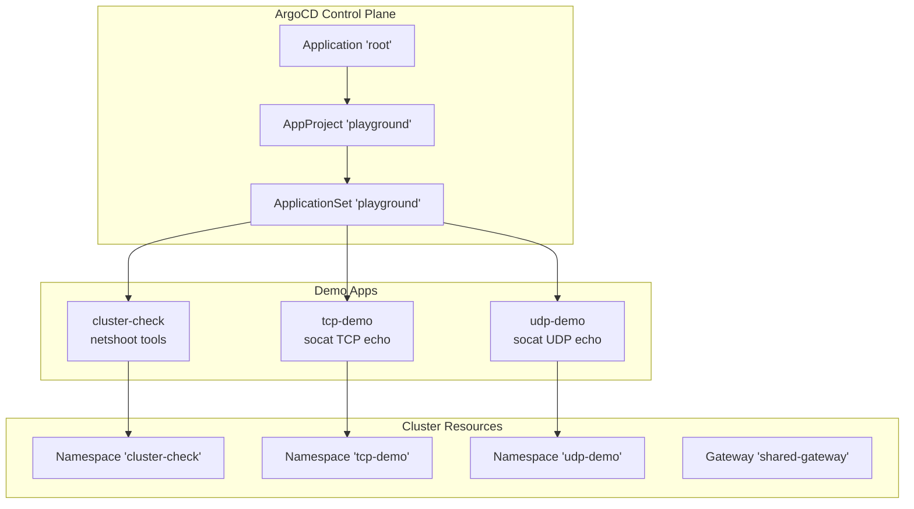
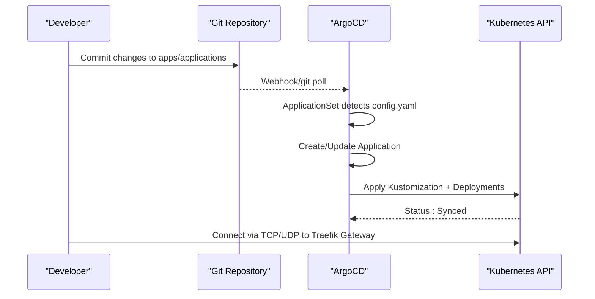
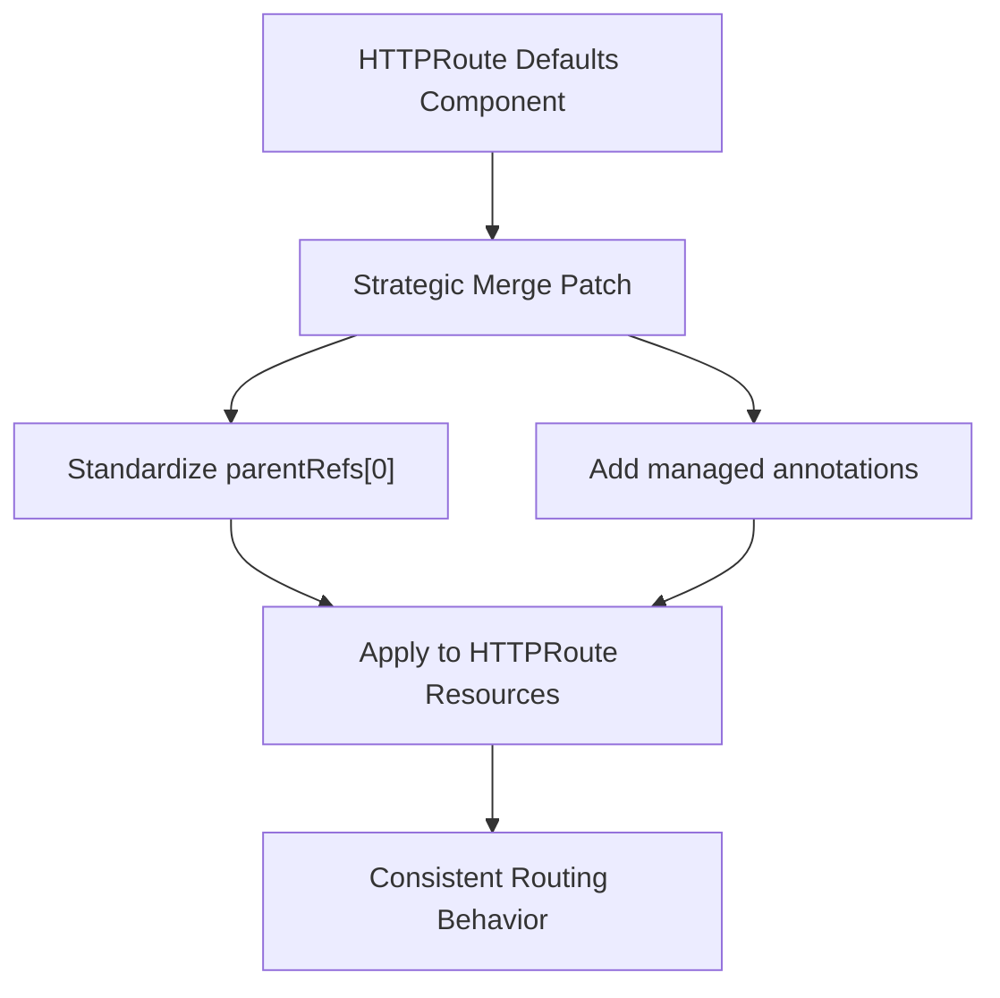
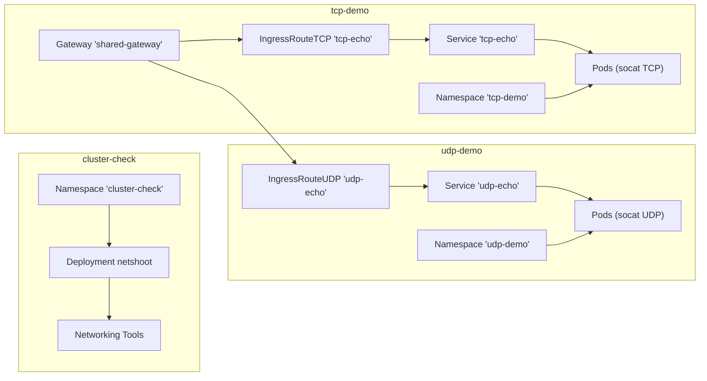

# Demo Applications

<cite>
**Referenced Files in This Document**
- [config.yaml](file://apps/applications/cluster-check/config.yaml)
- [kustomization.yaml](file://apps/applications/cluster-check/kustomization.yaml)
- [deployment.yaml](file://apps/applications/cluster-check/chart/deployment.yaml)
- [config.yaml](file://apps/applications/tcp-demo/config.yaml)
- [kustomization.yaml](file://apps/applications/tcp-demo/kustomization.yaml)
- [deployment.yaml](file://apps/applications/tcp-demo/chart/deployment.yaml)
- [ingressroutetcp.yaml](file://apps/applications/tcp-demo/chart/ingressroutetcp.yaml)
- [service.yaml](file://apps/applications/tcp-demo/chart/service.yaml)
- [config.yaml](file://apps/applications/udp-demo/config.yaml)
- [kustomization.yaml](file://apps/applications/udp-demo/kustomization.yaml)
- [deployment.yaml](file://apps/applications/udp-demo/chart/deployment.yaml)
- [ingressrouteudp.yaml](file://apps/applications/udp-demo/chart/ingressrouteudp.yaml)
- [service.yaml](file://apps/applications/udp-demo/chart/service.yaml)
- [config.yaml](file://apps/applications/helloworld-api/config.yaml)
- [values.yaml](file://apps/applications/helloworld-api/chart/values.yaml)
- [values-service.yaml](file://apps/applications/helloworld-api/chart/values-service.yaml)
- [kustomization.yaml](file://apps/applications/helloworld-api/kustomization.yaml)
- [playground.yaml](file://projects/playground.yaml)
- [namespace.yaml](file://cluster-resources/default/namespace.yaml)
- [gateway.yaml](file://apps/infra/gateway-api/chart/gateway.yaml)
- [httproute-argocd.yaml](file://apps/infra/argocd-ingress/chart/httproute-argocd.yaml)
- [httproute-rancher.yaml](file://apps/infra/rancher/chart/httproute-rancher.yaml)
- [root.yaml](file://bootstrap/root.yaml)
- [argo_cd.md](file://guide/argocd/argo_cd.md)
- [kustomization.yaml](file://components/httproute-defaults/kustomization.yaml)
</cite>

## Update Summary
**Changes Made**
- Replaced hello-api documentation with new demo applications: cluster-check, tcp-demo, and udp-demo
- Updated project structure to reflect new apps/applications directory layout
- Added comprehensive documentation for cluster-check with netshoot tools
- Added detailed documentation for tcp-demo showcasing socat TCP echo server
- Added comprehensive documentation for udp-demo featuring socat UDP echo server
- Updated architecture diagrams to show new demo applications
- Revised dependency analysis to include new applications
- Enhanced troubleshooting guide with new application-specific guidance
- Updated learning tooling section to cover TCP/UDP routing demonstrations

## Table of Contents
1. [Introduction](#introduction)
2. [Project Structure](#project-structure)
3. [Core Components](#core-components)
4. [Architecture Overview](#architecture-overview)
5. [Detailed Component Analysis](#detailed-component-analysis)
6. [Component-Based HTTPRoute Standardization](#component-based-httproute-standardization)
7. [Dependency Analysis](#dependency-analysis)
8. [Performance Considerations](#performance-considerations)
9. [Troubleshooting Guide](#troubleshooting-guide)
10. [Conclusion](#conclusion)
11. [Appendices](#appendices)

## Introduction
This document explains the demo applications deployed in the playground environment, focusing on the new cluster-check, tcp-demo, and udp-demo applications. These applications replace the previous hello-api demo and provide comprehensive networking and connectivity testing capabilities. The cluster-check application offers network troubleshooting tools via netshoot, while tcp-demo and udp-demo showcase TCP and UDP routing capabilities using socat echo servers. Each application follows the established ArgoCD-driven GitOps synchronization model with namespace isolation and practical update/rollback guidance.

## Project Structure
The playground is managed as an ArgoCD ApplicationSet that discovers and deploys demo applications from the repository. The new apps/applications directory structure organizes each demo application with its own Kustomization and deployment configuration. Each demo app runs in its own namespace, providing isolation for safe experimentation and learning.



**Diagram sources**
- [root.yaml:10-19](file://bootstrap/root.yaml#L10-L19)
- [playground.yaml:23-45](file://projects/playground.yaml#L23-L45)
- [config.yaml:1-2](file://apps/applications/cluster-check/config.yaml#L1-L2)
- [config.yaml:1-4](file://apps/applications/tcp-demo/config.yaml#L1-L4)
- [config.yaml:1-4](file://apps/applications/udp-demo/config.yaml#L1-L4)

**Section sources**
- [playground.yaml:1-90](file://projects/playground.yaml#L1-L90)
- [root.yaml:1-37](file://bootstrap/root.yaml#L1-L37)
- [config.yaml:1-2](file://apps/applications/cluster-check/config.yaml#L1-L2)
- [config.yaml:1-4](file://apps/applications/tcp-demo/config.yaml#L1-L4)
- [config.yaml:1-4](file://apps/applications/udp-demo/config.yaml#L1-L4)

## Core Components
- Application discovery and deployment: Managed by an ApplicationSet that scans the apps/applications/**/config.yaml files and generates per-app Application resources. Namespaces are created automatically during sync.
- cluster-check module: Provides network troubleshooting capabilities using the nicolaka/netshoot container with comprehensive networking tools for cluster connectivity testing.
- tcp-demo module: Features an Alpine socat container running a TCP echo server on port 7777, demonstrating TCP routing and connection handling.
- udp-demo module: Features an Alpine socat container running a UDP echo server on port 7778, demonstrating UDP routing and datagram handling.
- Namespace isolation: Each demo app runs in its own namespace, isolated from others for safety and experimentation.
- Traefik Gateway integration: Both TCP and UDP demos leverage Traefik's specialized ingress controllers for non-HTTP protocols.

Key configuration anchors:
- cluster-check: netshoot container with sleep command for interactive troubleshooting
- tcp-demo: socat TCP-LISTEN server with fork/reuseaddr options
- udp-demo: socat UDP-LISTEN server with fork/reuseaddr options
- Kustomization namespace binding and ArgoCD annotations
- Traefik IngressRouteTCP and IngressRouteUDP resources

**Section sources**
- [playground.yaml:33-59](file://projects/playground.yaml#L33-L59)
- [deployment.yaml:16-26](file://apps/applications/cluster-check/chart/deployment.yaml#L16-L26)
- [deployment.yaml:16-28](file://apps/applications/tcp-demo/chart/deployment.yaml#L16-L28)
- [deployment.yaml:16-29](file://apps/applications/udp-demo/chart/deployment.yaml#L16-L29)
- [ingressroutetcp.yaml:1-16](file://apps/applications/tcp-demo/chart/ingressroutetcp.yaml#L1-L16)
- [ingressrouteudp.yaml:1-15](file://apps/applications/udp-demo/chart/ingressrouteudp.yaml#L1-L15)

## Architecture Overview
The new demo applications demonstrate various networking scenarios with Traefik Gateway integration:
- Changes are committed to the repository under apps/applications/<app-name>.
- ArgoCD's ApplicationSet detects the change via a Git generator and creates/updates an Application.
- The Application applies Kustomization and deployment manifests to the target namespace.
- Traefik Gateway routes TCP/UDP traffic to the appropriate IngressRoute resources.
- Services forward traffic to pods running the respective echo servers.



**Diagram sources**
- [playground.yaml:33-59](file://projects/playground.yaml#L33-L59)
- [config.yaml:1-4](file://apps/applications/tcp-demo/config.yaml#L1-L4)
- [config.yaml:1-4](file://apps/applications/udp-demo/config.yaml#L1-L4)

## Detailed Component Analysis

### cluster-check Application
The cluster-check application provides comprehensive network troubleshooting tools through the netshoot container, which includes popular networking utilities like curl, wget, nslookup, dig, and more.

**Container Configuration:**
- Image: nicolaka/netshoot:latest
- Command: sleep infinity (keeps container running indefinitely)
- Resources: Minimal CPU (50m) and memory (32Mi/64Mi limit) for safe playground usage
- Labels: app=cluster-check for easy identification

**Network Troubleshooting Capabilities:**
- DNS resolution testing with nslookup and dig
- HTTP/HTTPS connectivity verification
- Port connectivity validation
- Network path tracing and routing analysis
- Container networking inspection

**Usage Examples:**
- Interactive shell access for manual troubleshooting
- Automated connectivity scripts using included tools
- Service discovery and endpoint validation
- Network latency and bandwidth testing

**Section sources**
- [deployment.yaml:16-26](file://apps/applications/cluster-check/chart/deployment.yaml#L16-L26)
- [kustomization.yaml:1-8](file://apps/applications/cluster-check/kustomization.yaml#L1-L8)

### tcp-demo Application
The tcp-demo application showcases TCP routing capabilities using an Alpine socat container running a TCP echo server on port 7777.

**Container Configuration:**
- Image: alpine/socat:latest
- Args: ["-dd", "TCP-LISTEN:7777,fork,reuseaddr", "EXEC:cat"]
- Ports: containerPort: 7777 (TCP)
- Resources: Minimal CPU (50m) and memory (32Mi/64Mi limit)

**TCP Echo Server Features:**
- Fork mode for handling multiple concurrent connections
- Reuseaddr option for rapid restarts
- Debug output (-dd flag) for connection analysis
- Cat command echoing received data back to clients

**Traefik Integration:**
- IngressRouteTCP resource with HostSNI wildcard matching
- Entry point: tcp (non-HTTP TCP traffic)
- Service binding to tcp-echo service on port 7777

**Testing Scenarios:**
- Telnet-style echo testing
- Netcat connection verification
- Load balancing across multiple replicas
- Connection timeout and error handling demonstration

**Section sources**
- [deployment.yaml:16-28](file://apps/applications/tcp-demo/chart/deployment.yaml#L16-L28)
- [ingressroutetcp.yaml:1-16](file://apps/applications/tcp-demo/chart/ingressroutetcp.yaml#L1-L16)
- [kustomization.yaml:1-8](file://apps/applications/tcp-demo/kustomization.yaml#L1-L8)

### udp-demo Application
The udp-demo application demonstrates UDP routing capabilities using an Alpine socat container running a UDP echo server on port 7778.

**Container Configuration:**
- Image: alpine/socat:latest
- Args: ["-dd", "UDP-LISTEN:7778,fork,reuseaddr", "EXEC:cat"]
- Ports: containerPort: 7778 with UDP protocol
- Resources: Minimal CPU (50m) and memory (32Mi/64Mi limit)

**UDP Echo Server Features:**
- Fork mode for handling multiple concurrent datagrams
- Reuseaddr option for rapid restarts
- Debug output (-dd flag) for datagram analysis
- Cat command echoing received data back to clients

**Traefik Integration:**
- IngressRouteUDP resource for UDP traffic handling
- Entry point: udp (non-HTTP UDP traffic)
- Service binding to udp-echo service on port 7778

**Testing Scenarios:**
- UDP echo testing with nc -u
- Datagram loss and ordering demonstration
- Connectionless communication analysis
- Performance testing with varying packet sizes

**Section sources**
- [deployment.yaml:16-29](file://apps/applications/udp-demo/chart/deployment.yaml#L16-L29)
- [ingressrouteudp.yaml:1-15](file://apps/applications/udp-demo/chart/ingressrouteudp.yaml#L1-L15)
- [kustomization.yaml:1-8](file://apps/applications/udp-demo/kustomization.yaml#L1-L8)

### Kustomization and Namespace Binding
Each demo application uses a standardized Kustomization approach:
- Kustomization sets the target namespace to the application name
- ArgoCD annotations propagate through ApplicationSet templates to control sync ordering
- Sync waves ensure proper dependency ordering (cluster-check first, then TCP/UDP demos)

**Sync Wave Strategy:**
- cluster-check: No explicit sync wave (priority 0)
- tcp-demo: Sync wave 3
- udp-demo: Sync wave 3

**Section sources**
- [kustomization.yaml:1-8](file://apps/applications/cluster-check/kustomization.yaml#L1-L8)
- [kustomization.yaml:1-8](file://apps/applications/tcp-demo/kustomization.yaml#L1-L8)
- [kustomization.yaml:1-8](file://apps/applications/udp-demo/kustomization.yaml#L1-L8)
- [config.yaml:2-3](file://apps/applications/tcp-demo/config.yaml#L2-L3)
- [config.yaml:2-3](file://apps/applications/udp-demo/config.yaml#L2-L3)

### Relationship to Playground Namespace Isolation
- Cluster-level namespaces for infrastructure are pre-provisioned with early sync waves.
- Demo app namespaces are created during Application sync with CreateNamespace enabled.
- This ensures isolation and predictable resource ownership for each demo application.

**Section sources**
- [namespace.yaml:1-52](file://cluster-resources/default/namespace.yaml#L1-L52)
- [playground.yaml:72-74](file://projects/playground.yaml#L72-L74)

### ArgoCD Synchronization and GitOps Workflow
- ApplicationSet scans for config.yaml files under apps/applications/**/config.yaml.
- Templates derive Application names, destinations, and Kustomize paths.
- Sync policy automates pruning, self-healing, and retries.
- Sync waves coordinate order across cluster resources, gateways, and demo apps.

Practical implications:
- Use annotations to influence sync wave ordering.
- Leverage automated retry/backoff to handle transient failures.
- Self-healing keeps drift in check.
- Standardized patterns across all demo applications.

**Section sources**
- [playground.yaml:33-74](file://projects/playground.yaml#L33-L74)
- [config.yaml:1-4](file://apps/applications/cluster-check/config.yaml#L1-L4)
- [config.yaml:1-4](file://apps/applications/tcp-demo/config.yaml#L1-L4)
- [config.yaml:1-4](file://apps/applications/udp-demo/config.yaml#L1-L4)

### Learning Tooling and Testing Scenarios
- Demonstrates GitOps end-to-end: commit → ArgoCD → Kubernetes.
- Exercises TCP/UDP connectivity testing and routing.
- Provides a safe sandbox for experimenting with network protocols.
- **New**: Comprehensive networking troubleshooting capabilities via netshoot tools.
- **New**: Practical TCP/UDP echo server demonstrations for protocol validation.

## Component-Based HTTPRoute Standardization

### HTTPRoute Defaults Component System
The HTTPRoute defaults component provides centralized standardization for routing behavior across HTTP-based demo applications. While the new demo applications primarily use Traefik's specialized ingress controllers, this component remains relevant for HTTP-based applications in the playground.

**Component Capabilities:**
- Automatic parentRef standardization to shared-gateway in gateway-api namespace
- Consistent annotation management for tooling visibility
- Strategic merge patching that enhances existing configurations
- Non-intrusive application that preserves custom settings

**Configuration Behavior:**
- Ensures parentRefs[0] always references shared-gateway in gateway-api namespace
- Adds the routing.hoangvu75.space/managed annotation for tooling visibility
- Uses strategic merge patching to enhance existing HTTPRoute configurations
- Preserves custom settings while applying standard defaults

**Integration Benefits:**
- Reduces configuration duplication across demo applications
- Ensures consistent routing behavior standards
- Simplifies maintenance and updates
- Provides centralized control for routing policies



**Diagram sources**
- [kustomization.yaml:15-32](file://components/httproute-defaults/kustomization.yaml#L15-L32)

**Section sources**
- [kustomization.yaml:1-32](file://components/httproute-defaults/kustomization.yaml#L1-L32)

### Component Integration Patterns
HTTP-based demo applications integrate the HTTPRoute defaults component through their Kustomization files. This creates a consistent pattern for managing routing behavior across HTTP-based demo applications.

**Section sources**
- [kustomization.yaml:6-7](file://apps/applications/helloworld-api/kustomization.yaml#L6-L7)

## Dependency Analysis
The new demo applications depend on different infrastructure components:

**cluster-check Dependencies:**
- Namespace existence and proper RBAC for the ApplicationSet to create namespaces
- Minimal dependency on cluster infrastructure
- Standalone application for troubleshooting

**tcp-demo Dependencies:**
- Shared Gateway availability in the gateway-api namespace
- Traefik Gateway with TCP entry point configured
- IngressRouteTCP resource for TCP traffic routing
- Service for pod discovery and load balancing

**udp-demo Dependencies:**
- Shared Gateway availability in the gateway-api namespace
- Traefik Gateway with UDP entry point configured
- IngressRouteUDP resource for UDP traffic routing
- Service for pod discovery and load balancing



**Diagram sources**
- [gateway.yaml:1-27](file://apps/infra/gateway-api/chart/gateway.yaml#L1-L27)
- [ingressroutetcp.yaml:1-16](file://apps/applications/tcp-demo/chart/ingressroutetcp.yaml#L1-L16)
- [ingressrouteudp.yaml:1-15](file://apps/applications/udp-demo/chart/ingressrouteudp.yaml#L1-L15)
- [deployment.yaml:16-28](file://apps/applications/tcp-demo/chart/deployment.yaml#L16-L28)
- [deployment.yaml:16-29](file://apps/applications/udp-demo/chart/deployment.yaml#L16-L29)

**Section sources**
- [gateway.yaml:1-27](file://apps/infra/gateway-api/chart/gateway.yaml#L1-L27)
- [ingressroutetcp.yaml:1-16](file://apps/applications/tcp-demo/chart/ingressroutetcp.yaml#L1-L16)
- [ingressrouteudp.yaml:1-15](file://apps/applications/udp-demo/chart/ingressrouteudp.yaml#L1-L15)
- [deployment.yaml:16-26](file://apps/applications/cluster-check/chart/deployment.yaml#L16-L26)
- [deployment.yaml:16-28](file://apps/applications/tcp-demo/chart/deployment.yaml#L16-L28)
- [deployment.yaml:16-29](file://apps/applications/udp-demo/chart/deployment.yaml#L16-L29)

## Performance Considerations
- Resource requests and limits: All demo applications use minimal CPU (50m) and memory (32Mi/64Mi limit) allocations suitable for playground usage.
- Replicas: Single replica is appropriate for demos; scale up only when validating horizontal scaling behavior.
- Image choice: Lightweight containers (netshoot, socat) minimize overhead while providing comprehensive functionality.
- Network path: Traefik Gateway introduces minimal overhead for TCP/UDP routing; ensure entry points and service ports align with testing needs.
- Protocol-specific considerations: TCP demos benefit from connection pooling and reuseaddr options; UDP demos handle datagram processing efficiently.

## Troubleshooting Guide
Common issues and resolutions for the new demo applications:

**cluster-check Issues:**
- Container not running
  - Verify netshoot image pull and deployment status
  - Check namespace creation and RBAC permissions
  - Ensure minimal resource requests are sufficient
- Tools not available
  - Confirm netshoot container includes required networking tools
  - Use interactive shell to verify tool availability

**TCP Demo Issues:**
- TCP echo server not responding
  - Verify socat container started with correct arguments
  - Check IngressRouteTCP configuration and entry points
  - Confirm service port matches container port (7777)
- Connection timeouts
  - Verify Traefik Gateway TCP entry point is configured
  - Check firewall rules and security groups
  - Test with telnet or netcat clients

**UDP Demo Issues:**
- UDP echo server not responding
  - Verify socat container started with UDP arguments
  - Check IngressRouteUDP configuration and entry points
  - Confirm service port matches container port (7778)
- Packet loss or corruption
  - Verify UDP entry point configuration in Traefik
  - Test with netcat using -u flag: nc -u <host> 7778
  - Check for network jitter or MTU issues

**General Troubleshooting:**
- No traffic after sync
  - Check ArgoCD Application status and logs for sync errors
  - Validate that the namespace exists and the ApplicationSet generated the Application
- Rollback procedure
  - Adjust the deployment manifests to revert to a previous configuration
  - Trigger a manual sync or wait for auto-sync; ArgoCD self-healing will reconcile differences
- Health checks
  - Use appropriate tools for each protocol (telnet/netcat for TCP, nc -u for UDP)
  - Inspect pod logs and container health status
  - Verify service endpoints and port mappings

**Section sources**
- [deployment.yaml:16-26](file://apps/applications/cluster-check/chart/deployment.yaml#L16-L26)
- [deployment.yaml:16-28](file://apps/applications/tcp-demo/chart/deployment.yaml#L16-L28)
- [deployment.yaml:16-29](file://apps/applications/udp-demo/chart/deployment.yaml#L16-L29)
- [ingressroutetcp.yaml:1-16](file://apps/applications/tcp-demo/chart/ingressroutetcp.yaml#L1-L16)
- [ingressrouteudp.yaml:1-15](file://apps/applications/udp-demo/chart/ingressrouteudp.yaml#L1-L15)
- [playground.yaml:61-74](file://projects/playground.yaml#L61-L74)

## Conclusion
The new demo applications (cluster-check, tcp-demo, and udp-demo) provide comprehensive networking demonstration capabilities in the playground environment. The cluster-check application offers essential troubleshooting tools via netshoot, while tcp-demo and udp-demo showcase practical TCP and UDP routing implementations using socat echo servers. By leveraging Traefik Gateway's specialized ingress controllers and following the established ArgoCD GitOps workflow, these applications serve as excellent learning tools for network protocols, routing mechanisms, and safe experimentation in a controlled environment.

## Appendices

### Appendix A: Typical Update and Rollback Workflow
- Update: Modify deployment manifests in apps/applications/<app-name>/chart/, commit, and push.
- Sync: ArgoCD detects changes and reconciles the Application.
- Verification: Test the specific protocol functionality (TCP/UDP connectivity, netshoot tools).
- Rollback: Revert to a known-good commit; ArgoCD self-heals to the previous state.
- Component updates: Modify the HTTPRoute defaults component to change centralized routing behavior (for HTTP-based apps).

**Section sources**
- [playground.yaml:61-74](file://projects/playground.yaml#L61-L74)

### Appendix B: Related Ingress Examples in the Playground
- ArgoCD UI exposed via HTTPRoute attached to the shared Gateway.
- Rancher UI similarly routed through HTTPRoute to the Rancher Service.
- **New**: HTTP-based applications continue to benefit from HTTPRoute defaults component for standardized behavior.

These demonstrate consistent patterns for multiple demo apps with centralized standardization.

**Section sources**
- [httproute-argocd.yaml:1-29](file://apps/infra/argocd-ingress/chart/httproute-argocd.yaml#L1-L29)
- [httproute-rancher.yaml:1-30](file://apps/infra/rancher/chart/httproute-rancher.yaml#L1-L30)

### Appendix C: Getting Started with ArgoCD
- Install ArgoCD, expose the UI, apply repository secrets, and bootstrap the root Application.

**Section sources**
- [argo_cd.md:1-34](file://guide/argocd/argo_cd.md#L1-L34)

### Appendix D: HTTPRoute Defaults Component Usage
**Component Integration:**
To use the HTTPRoute defaults component in your own applications:
1. Add the component reference to your Kustomization:
   ```yaml
   components:
     - ../../../components/httproute-defaults
   ```
2. Ensure your HTTPRoute resources are properly structured
3. The component will automatically apply standardization rules

**Component Customization:**
The component can be customized by modifying the kustomization.yaml file in the components/httproute-defaults directory to adjust:
- Default parentRef settings
- Annotation patterns
- Strategic merge patch configurations

**Section sources**
- [kustomization.yaml:1-32](file://components/httproute-defaults/kustomization.yaml#L1-L32)