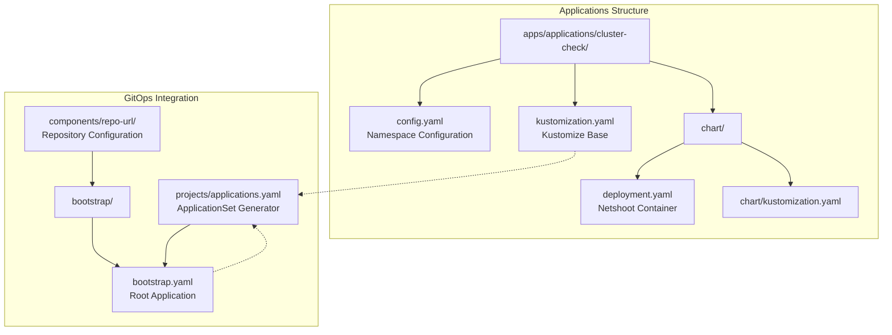
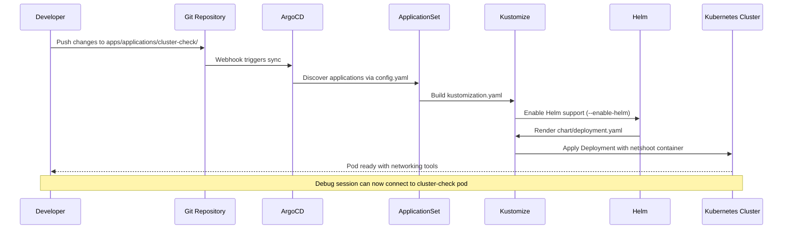
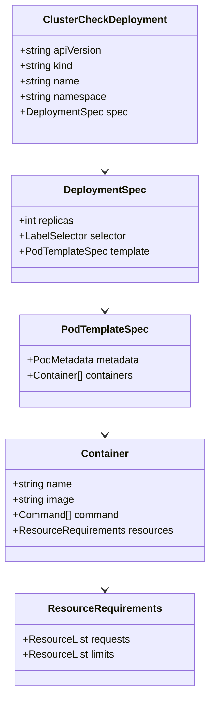
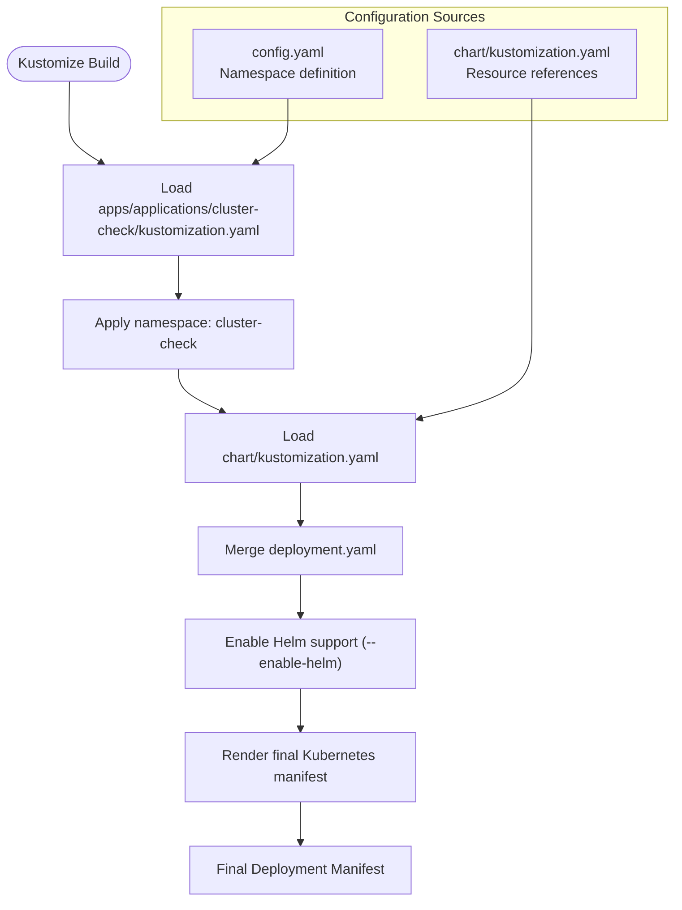
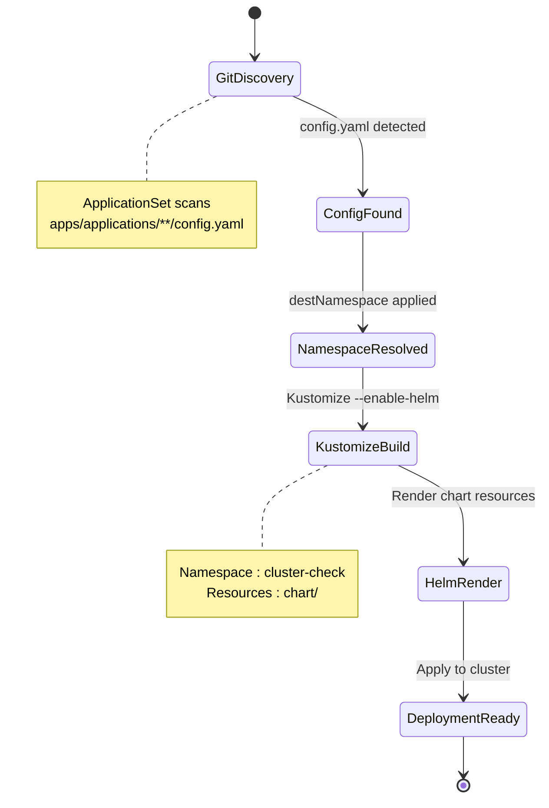
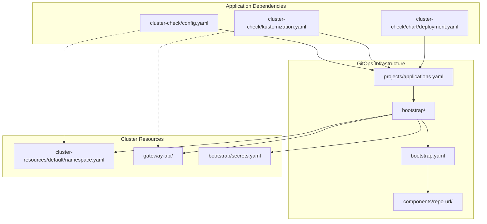

# Cluster-Check Debug Application

<cite>
**Referenced Files in This Document**
- [README.md](file://README.md)
- [config.yaml](file://apps/applications/cluster-check/config.yaml)
- [kustomization.yaml](file://apps/applications/cluster-check/kustomization.yaml)
- [deployment.yaml](file://apps/applications/cluster-check/chart/deployment.yaml)
- [kustomization.yaml](file://apps/applications/cluster-check/chart/kustomization.yaml)
- [applications.yaml](file://projects/applications.yaml)
- [bootstrap.yaml](file://bootstrap.yaml)
- [kustomization.yaml](file://bootstrap/kustomization.yaml)
- [cluster-resources.yaml](file://bootstrap/cluster-resources.yaml)
- [secrets.yaml](file://bootstrap/secrets.yaml)
- [kustomization.yaml](file://components/repo-url/kustomization.yaml)
</cite>

## Table of Contents
1. [Introduction](#introduction)
2. [Project Structure](#project-structure)
3. [Core Components](#core-components)
4. [Architecture Overview](#architecture-overview)
5. [Detailed Component Analysis](#detailed-component-analysis)
6. [Dependency Analysis](#dependency-analysis)
7. [Performance Considerations](#performance-considerations)
8. [Troubleshooting Guide](#troubleshooting-guide)
9. [Conclusion](#conclusion)

## Introduction
The Cluster-Check Debug Application is a specialized Kubernetes deployment designed to provide diagnostic capabilities for network connectivity and service accessibility within the cluster. It serves as a "jump pod" containing networking tools such as curl, nc, telnet, dig, and tcpdump, enabling administrators to troubleshoot connectivity issues, test service endpoints, and diagnose network problems without requiring privileged access to production workloads.

This debug application leverages the established GitOps infrastructure of the k8s_manifest repository, integrating seamlessly with the ArgoCD-driven deployment pipeline and following the same synchronization patterns as other applications in the cluster.

## Project Structure
The Cluster-Check application follows the standard application structure within the k8s_manifest repository, organized under the applications directory with dedicated chart and configuration files.

**Diagram sources**
- [config.yaml:1-2](file://apps/applications/cluster-check/config.yaml#L1-L2)
- [kustomization.yaml:1-8](file://apps/applications/cluster-check/kustomization.yaml#L1-L8)
- [kustomization.yaml:1-6](file://apps/applications/cluster-check/chart/kustomization.yaml#L1-L6)
- [applications.yaml:1-85](file://projects/applications.yaml#L1-L85)
- [bootstrap.yaml:1-26](file://bootstrap.yaml#L1-L26)

**Section sources**
- [README.md:117-118](file://README.md#L117-L118)
- [config.yaml:1-2](file://apps/applications/cluster-check/config.yaml#L1-L2)
- [kustomization.yaml:1-8](file://apps/applications/cluster-check/kustomization.yaml#L1-L8)

## Core Components
The Cluster-Check application consists of three primary components working together to deliver diagnostic capabilities:

### Namespace Configuration
The application defines its target namespace through a simple configuration file that establishes the deployment context within the cluster's organizational structure.

### Kustomize Base Configuration
The base Kustomize configuration orchestrates the application's deployment by specifying the target namespace and referencing the underlying chart resources. This configuration integrates with the broader GitOps pipeline through the ApplicationSet mechanism.

### Netshoot Container Deployment
The core deployment utilizes the nicolaka/netshoot container image, which provides a comprehensive set of networking diagnostic tools packaged in a single, lightweight container. The deployment is configured as a long-running process with minimal resource requirements, optimized for diagnostic tasks rather than serving traffic.

**Section sources**
- [config.yaml:1-2](file://apps/applications/cluster-check/config.yaml#L1-L2)
- [kustomization.yaml:1-8](file://apps/applications/cluster-check/kustomization.yaml#L1-L8)
- [deployment.yaml:1-29](file://apps/applications/cluster-check/chart/deployment.yaml#L1-L29)

## Architecture Overview
The Cluster-Check application operates within the established GitOps architecture of the k8s_manifest repository, following the same synchronization patterns as other applications while maintaining its specialized role as a diagnostic tool.

**Diagram sources**
- [applications.yaml:33-58](file://projects/applications.yaml#L33-L58)
- [kustomization.yaml:1-8](file://apps/applications/cluster-check/kustomization.yaml#L1-L8)
- [deployment.yaml:1-29](file://apps/applications/cluster-check/chart/deployment.yaml#L1-L29)

The architecture ensures that the Cluster-Check application follows the same synchronization timeline as other applications, leveraging the established bootstrap chain and repository configuration system.

## Detailed Component Analysis

### Deployment Configuration
The deployment specification defines a single-replica pod running the netshoot container with carefully tuned resource allocations for diagnostic workloads.

**Diagram sources**
- [deployment.yaml:4-29](file://apps/applications/cluster-check/chart/deployment.yaml#L4-L29)

The deployment configuration prioritizes diagnostic functionality over resource consumption, with conservative CPU and memory requests suitable for occasional use while ensuring availability during troubleshooting sessions.

**Section sources**
- [deployment.yaml:1-29](file://apps/applications/cluster-check/chart/deployment.yaml#L1-L29)

### Kustomize Integration
The Kustomize configuration provides namespace scoping and resource orchestration for the Cluster-Check application within the broader GitOps framework.

**Diagram sources**
- [kustomization.yaml:1-8](file://apps/applications/cluster-check/kustomization.yaml#L1-L8)
- [kustomization.yaml:1-6](file://apps/applications/cluster-check/chart/kustomization.yaml#L1-L6)

**Section sources**
- [kustomization.yaml:1-8](file://apps/applications/cluster-check/kustomization.yaml#L1-L8)
- [kustomization.yaml:1-6](file://apps/applications/cluster-check/chart/kustomization.yaml#L1-L6)

### Application Discovery and Synchronization
The ApplicationSet generator automatically discovers and deploys the Cluster-Check application alongside other applications in the cluster, following the established synchronization timeline.

**Diagram sources**
- [applications.yaml:33-58](file://projects/applications.yaml#L33-L58)
- [config.yaml:1-2](file://apps/applications/cluster-check/config.yaml#L1-L2)

**Section sources**
- [applications.yaml:33-58](file://projects/applications.yaml#L33-L58)
- [config.yaml:1-2](file://apps/applications/cluster-check/config.yaml#L1-L2)

## Dependency Analysis
The Cluster-Check application maintains loose coupling with the broader infrastructure while leveraging shared components for seamless integration.

**Diagram sources**
- [applications.yaml:33-58](file://projects/applications.yaml#L33-L58)
- [kustomization.yaml:1-8](file://apps/applications/cluster-check/kustomization.yaml#L1-L8)
- [deployment.yaml:1-29](file://apps/applications/cluster-check/chart/deployment.yaml#L1-L29)
- [bootstrap.yaml:1-26](file://bootstrap.yaml#L1-L26)
- [kustomization.yaml:1-63](file://bootstrap/kustomization.yaml#L1-L63)

The dependency graph reveals that the Cluster-Check application follows the same dependency chain as other applications, ensuring consistent behavior and predictable deployment characteristics.

**Section sources**
- [applications.yaml:33-58](file://projects/applications.yaml#L33-L58)
- [kustomization.yaml:1-8](file://apps/applications/cluster-check/kustomization.yaml#L1-L8)
- [deployment.yaml:1-29](file://apps/applications/cluster-check/chart/deployment.yaml#L1-L29)
- [bootstrap.yaml:1-26](file://bootstrap.yaml#L1-L26)

## Performance Considerations
The Cluster-Check application is designed with diagnostic efficiency in mind, optimizing for minimal resource consumption while providing comprehensive networking tools.

### Resource Optimization
The deployment utilizes conservative resource allocations appropriate for intermittent diagnostic use:
- CPU requests: 50m (minimal overhead)
- Memory requests: 32Mi (lightweight footprint)
- Memory limits: 64Mi (prevents resource exhaustion)

### Container Image Strategy
The nicolaka/netshoot image provides a complete networking toolkit in a single, optimized container, eliminating the need for multiple tool-specific images and reducing overall resource usage.

### Operational Impact
As a debug-only application, the Cluster-Check deployment has negligible impact on cluster performance during normal operations, with the pod typically remaining idle except during active troubleshooting sessions.

## Troubleshooting Guide

### Common Diagnostic Scenarios
The Cluster-Check application enables troubleshooting across multiple network layers and service boundaries within the cluster.

#### Connectivity Testing
Administrators can use the built-in tools to test connectivity between pods, services, and external endpoints, leveraging the same networking stack as production workloads.

#### Service Discovery Validation
The deployment allows verification of DNS resolution, service endpoint accessibility, and load balancing behavior using industry-standard diagnostic tools.

#### Network Policy Verification
Cluster-Check can help validate network policies and firewall configurations by testing connectivity from controlled environments within the cluster.

### Access Patterns
The application follows standard Kubernetes pod access patterns, allowing administrators to exec into the running pod and utilize the full suite of networking diagnostic tools for comprehensive troubleshooting.

**Section sources**
- [deployment.yaml:1-29](file://apps/applications/cluster-check/chart/deployment.yaml#L1-L29)
- [README.md:163-163](file://README.md#L163-L163)

## Conclusion
The Cluster-Check Debug Application represents a focused, purpose-built component within the k8s_manifest GitOps infrastructure. By leveraging the established deployment pipeline and following the same synchronization patterns as other applications, it provides reliable, consistent access to essential networking diagnostic capabilities.

The application's design emphasizes operational efficiency through minimal resource consumption, standardized integration with the existing infrastructure, and seamless alignment with the cluster's overall architecture. This approach ensures that diagnostic capabilities remain available when needed while maintaining the stability and predictability of the broader system.

Through its integration with the ApplicationSet discovery mechanism and the established bootstrap chain, the Cluster-Check application demonstrates how specialized tools can be effectively incorporated into automated deployment pipelines without compromising the reliability or maintainability of the overall system.