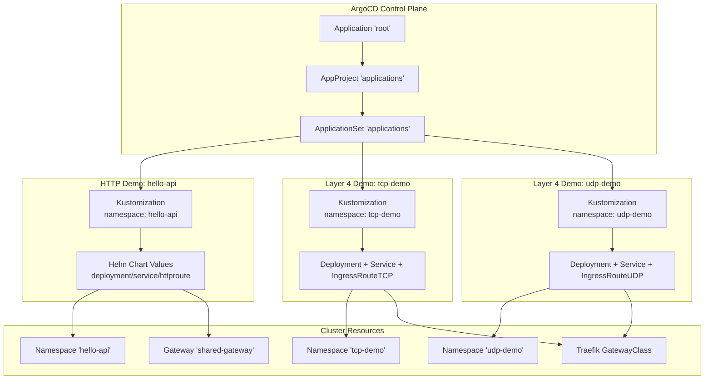
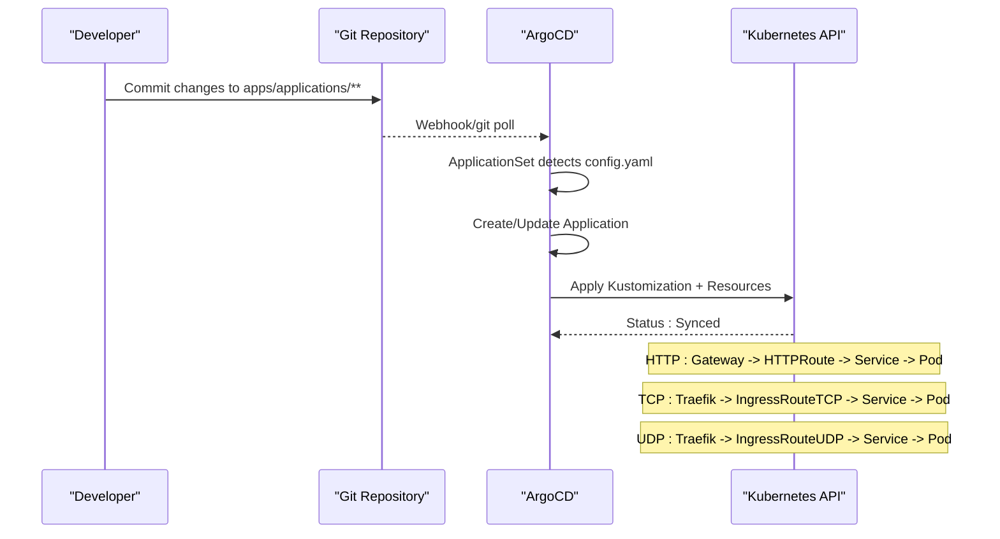
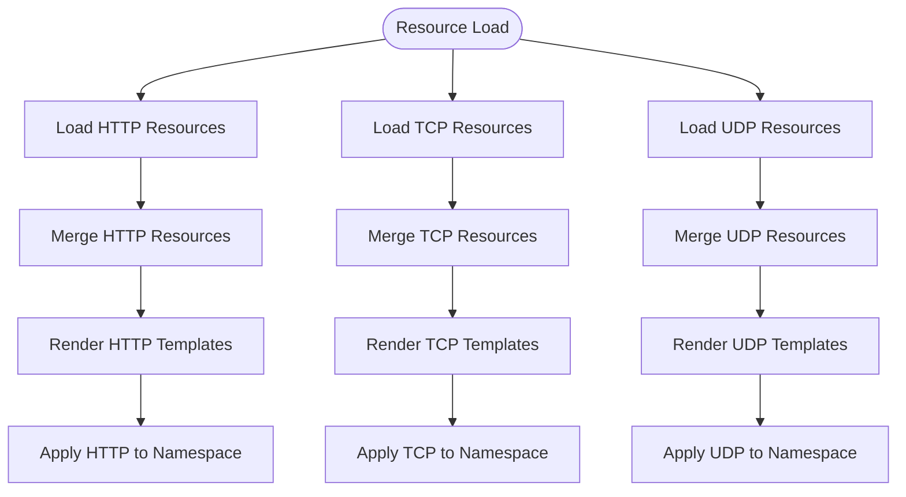
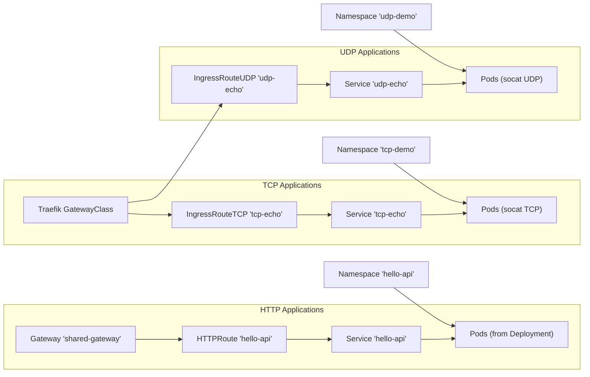

# Demo Applications

<cite>
**Referenced Files in This Document**
- [values.yaml](file://apps/applications/hello-api/chart/values.yaml)
- [values-service.yaml](file://apps/applications/hello-api/chart/values-service.yaml)
- [values-httproute.yaml](file://apps/applications/hello-api/chart/values-httproute.yaml)
- [kustomization.yaml](file://apps/applications/hello-api/kustomization.yaml)
- [config.yaml](file://apps/applications/hello-api/config.yaml)
- [applications.yaml](file://projects/applications.yaml)
- [namespace.yaml](file://cluster-resources/default/namespace.yaml)
- [gateway.yaml](file://apps/infra/gateway-api/chart/gateway.yaml)
- [httproute-argocd.yaml](file://apps/infra/argocd-ingress/chart/httproute-argocd.yaml)
- [httproute-rancher.yaml](file://apps/infra/rancher/chart/httproute-rancher.yaml)
- [root.yaml](file://bootstrap/root.yaml)
- [argo_cd.md](file://guide/argocd/argo_cd.md)
- [ingressroutetcp.yaml](file://apps/applications/tcp-demo/chart/ingressroutetcp.yaml)
- [ingressrouteudp.yaml](file://apps/applications/udp-demo/chart/ingressrouteudp.yaml)
- [deployment.yaml](file://apps/applications/tcp-demo/chart/deployment.yaml)
- [deployment.yaml](file://apps/applications/udp-demo/chart/deployment.yaml)
- [service.yaml](file://apps/applications/tcp-demo/chart/service.yaml)
- [service.yaml](file://apps/applications/udp-demo/chart/service.yaml)
- [kustomization.yaml](file://apps/applications/tcp-demo/kustomization.yaml)
- [kustomization.yaml](file://apps/applications/udp-demo/kustomization.yaml)
- [config.yaml](file://apps/applications/tcp-demo/config.yaml)
- [config.yaml](file://apps/applications/udp-demo/config.yaml)
- [README.md](file://guide/tcp-udp-demo/README.md)
</cite>

## Update Summary
**Changes Made**
- Added comprehensive documentation for new TCP Echo Demo and UDP Echo Demo applications
- Updated project structure to reflect new apps/applications/ directory layout
- Added Layer 4 routing demonstration capabilities alongside existing HTTP-based hello-api application
- Documented Traefik IngressRouteTCP and IngressRouteUDP implementations
- Included practical testing guides for TCP and UDP echo services
- Updated ApplicationSet configuration to support new demo applications directory
- Added resource allocation and performance considerations for Layer 4 routing

## Table of Contents
1. [Introduction](#introduction)
2. [Project Structure](#project-structure)
3. [Core Components](#core-components)
4. [Architecture Overview](#architecture-overview)
5. [Detailed Component Analysis](#detailed-component-analysis)
6. [Layer 4 Routing Demonstrations](#layer-4-routing-demonstrations)
7. [Dependency Analysis](#dependency-analysis)
8. [Performance Considerations](#performance-considerations)
9. [Troubleshooting Guide](#troubleshooting-guide)
10. [Conclusion](#conclusion)
11. [Appendices](#appendices)

## Introduction
This document explains the demo applications deployed in the playground environment, now expanded to include comprehensive Layer 4 routing demonstrations alongside the existing HTTP-based hello-api application. The catalog features three distinct demo applications: hello-api (HTTP-based), tcp-demo (TCP echo service), and udp-demo (UDP echo service). Each application demonstrates different routing capabilities using ArgoCD-driven GitOps synchronization, namespace isolation, and practical update/rollback guidance. The new TCP and UDP demo applications showcase Traefik's advanced routing capabilities for connection-oriented protocols beyond traditional HTTP.

## Project Structure
The playground has evolved to use a unified apps/applications/ directory structure managed by an ApplicationSet that discovers and deploys demo applications from the repository. The new structure supports both HTTP-based and Layer 4 routing demonstrations through standardized configuration patterns. Each demo app maintains its own Kustomization and resource definitions, enabling modular configuration and safe separation of concerns across different protocol families.

**Diagram sources**
- [root.yaml:10-19](file://bootstrap/root.yaml#L10-L19)
- [applications.yaml:24-85](file://projects/applications.yaml#L24-L85)
- [kustomization.yaml:4](file://apps/applications/hello-api/kustomization.yaml#L4)
- [gateway.yaml:1-27](file://apps/infra/gateway-api/chart/gateway.yaml#L1-L27)
- [ingressroutetcp.yaml:1-21](file://apps/applications/tcp-demo/chart/ingressroutetcp.yaml#L1-L21)
- [ingressrouteudp.yaml:1-20](file://apps/applications/udp-demo/chart/ingressrouteudp.yaml#L1-L20)

**Section sources**
- [applications.yaml:1-85](file://projects/applications.yaml#L1-L85)
- [root.yaml:1-37](file://bootstrap/root.yaml#L1-L37)
- [kustomization.yaml:1-8](file://apps/applications/hello-api/kustomization.yaml#L1-L8)

## Core Components
- **Application discovery and deployment**: Managed by an ApplicationSet that scans the apps/applications/**/config.yaml files and generates per-app Application resources. Namespaces are created automatically during sync with enhanced support for both HTTP and Layer 4 routing protocols.
- **hello-api module**: HTTP-based application composed of Helm values overlays for deployment, service, and HTTPRoute configuration to demonstrate standard web traffic routing.
- **tcp-demo module**: Layer 4 TCP echo service using Traefik's IngressRouteTCP to demonstrate connection-oriented protocol handling with socat-based TCP echo server.
- **udp-demo module**: Layer 4 UDP echo service using Traefik's IngressRouteUDP to demonstrate datagram protocol routing with socat-based UDP echo server.
- **Unified routing infrastructure**: Both HTTP and Layer 4 applications leverage the shared Gateway and Traefik infrastructure for consistent routing behavior and observability.
- **Namespace isolation**: Each demo application runs in its own namespace, providing complete isolation for safe experimentation with different protocol families.

Key configuration anchors:
- **HTTP applications**: Deployment and container image/ports/resources, Service exposure, HTTPRoute path matching and hostname configuration
- **Layer 4 applications**: Deployment with socat containers, Service definitions with protocol-specific ports, IngressRouteTCP/UDP entry points and match conditions
- **Shared infrastructure**: Gateway configuration, Traefik GatewayClass, namespace labeling for routing exposure
- **ApplicationSet templates**: Git-based discovery, namespace binding, and sync wave coordination

**Section sources**
- [applications.yaml:33-74](file://projects/applications.yaml#L33-L74)
- [config.yaml:1-4](file://apps/applications/hello-api/config.yaml#L1-L4)
- [config.yaml:1-4](file://apps/applications/tcp-demo/config.yaml#L1-L4)
- [config.yaml:1-4](file://apps/applications/udp-demo/config.yaml#L1-L4)
- [values.yaml:1-23](file://apps/applications/hello-api/chart/values.yaml#L1-L23)
- [ingressroutetcp.yaml:1-21](file://apps/applications/tcp-demo/chart/ingressroutetcp.yaml#L1-L21)
- [ingressrouteudp.yaml:1-20](file://apps/applications/udp-demo/chart/ingressrouteudp.yaml#L1-L20)

## Architecture Overview
The demo applications demonstrate comprehensive routing capabilities spanning HTTP and Layer 4 protocols through a unified ArgoCD-driven GitOps workflow:
- Changes are committed to the repository under apps/applications/<app-name>.
- ArgoCD's ApplicationSet detects the change via Git generator scanning for config.yaml files.
- The Application applies Kustomization and resource definitions to the target namespace.
- HTTP applications use HTTPRoute resources with shared Gateway for path-based routing.
- Layer 4 applications use IngressRouteTCP/UDP resources with Traefik for protocol-specific routing.
- Both HTTP and Layer 4 routing integrate with the same observability infrastructure including Traefik dashboard and metrics.

**Diagram sources**
- [applications.yaml:33-59](file://projects/applications.yaml#L33-L59)
- [config.yaml:1-4](file://apps/applications/hello-api/config.yaml#L1-L4)
- [config.yaml:1-4](file://apps/applications/tcp-demo/config.yaml#L1-L4)
- [config.yaml:1-4](file://apps/applications/udp-demo/config.yaml#L1-L4)
- [gateway.yaml:1-27](file://apps/infra/gateway-api/chart/gateway.yaml#L1-L27)
- [ingressroutetcp.yaml:1-21](file://apps/applications/tcp-demo/chart/ingressroutetcp.yaml#L1-L21)
- [ingressrouteudp.yaml:1-20](file://apps/applications/udp-demo/chart/ingressrouteudp.yaml#L1-L20)

## Detailed Component Analysis

### Multi-Value Configuration Approach
The hello-api module maintains the same three-values-file approach for HTTP applications:
- **Deployment and container configuration**: image, replicas, ports, args, and resource requests/limits for HTTP workloads.
- **Service configuration**: enabling the Service and mapping container ports to service ports for HTTP traffic.
- **HTTPRoute configuration**: enabling the route, attaching to a shared Gateway, setting hostnames, path matching, and backend references.

**Updated** The new Layer 4 applications use a simplified single-chart approach with embedded resource definitions rather than Helm values, focusing on protocol-specific configuration patterns.

Benefits:
- **HTTP applications**: Separation of concerns enables safer rollouts with incremental updates to routing policies.
- **Layer 4 applications**: Direct resource definition eliminates Helm complexity for protocol-specific deployments.
- **Consistent patterns**: Both approaches leverage the same ApplicationSet discovery mechanism.
- **Reusability**: Kustomization overlays enable environment-specific customizations.

**Diagram sources**
- [values.yaml:1-23](file://apps/applications/hello-api/chart/values.yaml#L1-L23)
- [deployment.yaml:1-28](file://apps/applications/tcp-demo/chart/deployment.yaml#L1-L28)
- [deployment.yaml:1-29](file://apps/applications/udp-demo/chart/deployment.yaml#L1-L29)

**Section sources**
- [values.yaml:1-23](file://apps/applications/hello-api/chart/values.yaml#L1-L23)
- [values-service.yaml:1-6](file://apps/applications/hello-api/chart/values-service.yaml#L1-L6)
- [values-httproute.yaml:1-26](file://apps/applications/hello-api/chart/values-httproute.yaml#L1-L26)
- [ingressroutetcp.yaml:1-21](file://apps/applications/tcp-demo/chart/ingressroutetcp.yaml#L1-L21)
- [ingressrouteudp.yaml:1-20](file://apps/applications/udp-demo/chart/ingressrouteudp.yaml#L1-L20)

### Service Definition
**HTTP Applications**: Service definitions enable standard Kubernetes service exposure with consistent port mappings and selector-based pod targeting.

**Layer 4 Applications**: Service definitions use ClusterIP type with protocol-specific port configurations:
- **TCP Demo**: Service exposes port 7777 with TCP protocol for connection-oriented echo functionality
- **UDP Demo**: Service exposes port 7778 with UDP protocol for datagram echo functionality

Operational notes:
- Ensure Service names match the backend references in corresponding IngressRoute resources.
- Protocol specification is critical for Layer 4 routing to function correctly.
- Container port specifications must align with the application's listening ports.

**Section sources**
- [values-service.yaml:1-6](file://apps/applications/hello-api/chart/values-service.yaml#L1-L6)
- [service.yaml:1-14](file://apps/applications/tcp-demo/chart/service.yaml#L1-L14)
- [service.yaml:1-15](file://apps/applications/udp-demo/chart/service.yaml#L1-L15)

### Ingress Routing via HTTPRoute
**HTTP Applications**: HTTPRoute resources provide path-based routing with hostname matching and backend service references to the shared Gateway infrastructure.

**Updated** HTTPRoute implementation uses direct standardization patterns without centralized component dependencies, ensuring consistent routing behavior across all demo applications.

Operational notes:
- Shared Gateway must exist in the gateway-api namespace for HTTP routing.
- PathPrefix matching enables clean separation of routes across demo applications.
- Direct HTTPRoute standardization ensures consistent behavior without component dependencies.

**Section sources**
- [values-httproute.yaml:1-26](file://apps/applications/hello-api/chart/values-httproute.yaml#L1-L26)
- [gateway.yaml:1-27](file://apps/infra/gateway-api/chart/gateway.yaml#L1-L27)

### HTTPRoute Setup Example
HTTPRoute configuration establishes routing policies for HTTP-based applications:
- Parent reference to shared Gateway in the gateway-api namespace
- Hostname configuration for domain-based routing
- Path match patterns for URL-based routing
- Backend references to Service resources with port specifications

**Updated** The HTTPRoute setup relies on direct standardization patterns, reducing complexity and eliminating component dependencies while ensuring consistent routing behavior.

**Section sources**
- [values-httproute.yaml:5-25](file://apps/applications/hello-api/chart/values-httproute.yaml#L5-L25)

### Kustomization and Namespace Binding
**HTTP Applications**: Kustomization sets target namespaces and applies ArgoCD annotations for sync wave coordination.

**Layer 4 Applications**: Kustomization follows the same pattern but manages direct resource definitions rather than Helm charts:
- Target namespace binding for tcp-demo and udp-demo
- ArgoCD annotations for sync wave ordering (wave 3 for demo applications)
- Resource aggregation combining deployment, service, and routing definitions

Operational notes:
- Namespace creation is handled by ArgoCD with CreateNamespace enabled.
- Keep namespace consistency across Kustomization and resource references.
- Sync waves coordinate startup order with infrastructure resources.

**Section sources**
- [kustomization.yaml:4](file://apps/applications/hello-api/kustomization.yaml#L4)
- [kustomization.yaml:4](file://apps/applications/tcp-demo/kustomization.yaml#L4)
- [kustomization.yaml:4](file://apps/applications/udp-demo/kustomization.yaml#L4)
- [config.yaml:1-4](file://apps/applications/hello-api/config.yaml#L1-L4)
- [config.yaml:1-4](file://apps/applications/tcp-demo/config.yaml#L1-L4)
- [config.yaml:1-4](file://apps/applications/udp-demo/config.yaml#L1-L4)

### Relationship to Playground Namespace Isolation
**Infrastructure namespaces**: Cluster-level namespaces for infrastructure are pre-provisioned with early sync waves to ensure stable foundation services.

**Demo application namespaces**: Each demo application namespace is created during Application sync with CreateNamespace enabled, providing complete isolation for HTTP and Layer 4 routing demonstrations.

**Updated** The new Layer 4 applications benefit from the same isolation guarantees as HTTP applications, with additional protocol-specific considerations for network connectivity.

**Section sources**
- [namespace.yaml:1-52](file://cluster-resources/default/namespace.yaml#L1-L52)
- [applications.yaml:72-74](file://projects/applications.yaml#L72-L74)

### ArgoCD Synchronization and GitOps Workflow
**ApplicationSet Configuration**: The unified applications.yaml manages discovery across all demo applications with Git-based generators scanning for config.yaml files.

**Sync Policy**: Automated synchronization with pruning, self-healing, and retry mechanisms ensures reliable deployment across HTTP and Layer 4 applications.

**Sync Waves**: Coordinated ordering ensures infrastructure stability before application deployment, with demo applications using wave 3 for consistent startup sequencing.

Practical implications:
- Use annotations to influence sync wave ordering for complex dependency chains.
- Leverage automated retry/backoff to handle transient failures in both HTTP and Layer 4 routing.
- Self-healing maintains consistency across all demo application types.
- Unified ApplicationSet simplifies management of diverse routing protocols.

**Section sources**
- [applications.yaml:33-74](file://projects/applications.yaml#L33-L74)
- [config.yaml:2-3](file://apps/applications/hello-api/config.yaml#L2-L3)
- [config.yaml:2-3](file://apps/applications/tcp-demo/config.yaml#L2-L3)
- [config.yaml:2-3](file://apps/applications/udp-demo/config.yaml#L2-L3)

### Learning Tooling and Testing Scenarios
**HTTP Applications**: Demonstrate GitOps end-to-end workflow with path-based routing, header forwarding, and backend binding for web traffic.

**Layer 4 Applications**: Provide hands-on experience with connection-oriented and datagram protocols through practical echo service testing.

**Updated** The expanded demo catalog now includes comprehensive routing demonstrations covering HTTP, TCP, and UDP protocols, serving as a complete learning toolkit for modern Kubernetes networking.

## Layer 4 Routing Demonstrations

### TCP Echo Demo Application
The tcp-demo application demonstrates Traefik's Layer 4 TCP routing capabilities through a simple echo service:
- **Protocol Support**: Uses IngressRouteTCP resource type for connection-oriented protocol handling
- **Entry Points**: Routes traffic from Traefik entryPoint "tcp" (port 9000) to tcp-echo service
- **Testing Method**: Netcat client (`nc <node-ip> 30900`) for immediate echo feedback
- **Container Technology**: Alpine socat container with TCP-LISTEN socket configuration
- **Resource Allocation**: Minimal CPU (50m) and memory (32Mi-64Mi) for efficient playground operation

**Operational Characteristics**:
- Connection-based protocol with persistent sessions
- Immediate response echoing of typed input
- Support for both NodePort and ClusterIP access methods
- Integration with Traefik dashboard for real-time monitoring

**Section sources**
- [ingressroutetcp.yaml:1-21](file://apps/applications/tcp-demo/chart/ingressroutetcp.yaml#L1-L21)
- [deployment.yaml:1-28](file://apps/applications/tcp-demo/chart/deployment.yaml#L1-L28)
- [service.yaml:1-14](file://apps/applications/tcp-demo/chart/service.yaml#L1-L14)
- [README.md:18-62](file://guide/tcp-udp-demo/README.md#L18-L62)

### UDP Echo Demo Application
The udp-demo application showcases Traefik's Layer 4 UDP routing capabilities:
- **Protocol Support**: Uses IngressRouteUDP resource type for datagram protocol handling
- **Entry Points**: Routes traffic from Traefik entryPoint "udp" (port 9001/UDP) to udp-echo service
- **Testing Method**: Netcat client with UDP flag (`nc -u <node-ip> 30901`) for datagram echo
- **Container Technology**: Alpine socat container with UDP-LISTEN socket configuration
- **Resource Allocation**: Identical minimal resource profile to TCP demo for consistency

**Operational Characteristics**:
- Connectionless protocol with best-effort delivery
- Potential initial packet loss during listener initialization
- Requires multiple test messages for reliable echo verification
- Suitable for network protocol testing and monitoring scenarios

**Section sources**
- [ingressrouteudp.yaml:1-20](file://apps/applications/udp-demo/chart/ingressrouteudp.yaml#L1-L20)
- [deployment.yaml:1-29](file://apps/applications/udp-demo/chart/deployment.yaml#L1-L29)
- [service.yaml:1-15](file://apps/applications/udp-demo/chart/service.yaml#L1-L15)
- [README.md:65-98](file://guide/tcp-udp-demo/README.md#L65-L98)

### Traefik Integration and Dashboard Visibility
Both Layer 4 applications integrate seamlessly with the Traefik dashboard for comprehensive observability:
- **Router Discovery**: Automatic detection of TCP and UDP routers in Traefik dashboard
- **Service Monitoring**: Real-time backend service status with pod server counts
- **Metrics Collection**: Prometheus metrics for connection tracking and performance monitoring
- **Access Logging**: JSON-formatted access logs for protocol-specific traffic analysis

**Dashboard Features**:
- Separate sections for HTTP, TCP, and UDP routing visualization
- Router naming conventions reflecting application and namespace structure
- Service backend mapping showing pod-level connectivity
- Metrics endpoints for operational monitoring and debugging

**Section sources**
- [README.md:115-154](file://guide/tcp-udp-demo/README.md#L115-L154)
- [README.md:157-184](file://guide/tcp-udp-demo/README.md#L157-L184)

## Dependency Analysis
The demo applications demonstrate different dependency patterns based on routing protocol:

**HTTP Applications**:
- Shared Gateway availability in the gateway-api namespace
- Namespace existence and proper RBAC for ApplicationSet operations
- Consistent naming between Service and HTTPRoute backendRefs
- Direct HTTPRoute standardization without component dependencies

**Layer 4 Applications**:
- Traefik GatewayClass and entryPoint configuration in gateway-api namespace
- Namespace labeling requirements for routing exposure (`routing.hoangvu75.space/expose: "true"`)
- Protocol-specific service port configurations (TCP 7777, UDP 7778)
- Socat container dependencies for echo service functionality

**Diagram sources**
- [gateway.yaml:1-27](file://apps/infra/gateway-api/chart/gateway.yaml#L1-L27)
- [values-httproute.yaml:24-25](file://apps/applications/hello-api/chart/values-httproute.yaml#L24-L25)
- [ingressroutetcp.yaml:1-21](file://apps/applications/tcp-demo/chart/ingressroutetcp.yaml#L1-L21)
- [ingressrouteudp.yaml:1-20](file://apps/applications/udp-demo/chart/ingressrouteudp.yaml#L1-L20)
- [values-service.yaml:5-6](file://apps/applications/hello-api/chart/values-service.yaml#L5-L6)
- [service.yaml:1-14](file://apps/applications/tcp-demo/chart/service.yaml#L1-L14)
- [service.yaml:1-15](file://apps/applications/udp-demo/chart/service.yaml#L1-L15)

**Section sources**
- [gateway.yaml:1-27](file://apps/infra/gateway-api/chart/gateway.yaml#L1-L27)
- [values-httproute.yaml:24-25](file://apps/applications/hello-api/chart/values-httproute.yaml#L24-L25)
- [ingressroutetcp.yaml:1-21](file://apps/applications/tcp-demo/chart/ingressroutetcp.yaml#L1-L21)
- [ingressrouteudp.yaml:1-20](file://apps/applications/udp-demo/chart/ingressrouteudp.yaml#L1-L20)
- [values-service.yaml:5-6](file://apps/applications/hello-api/chart/values-service.yaml#L5-L6)
- [service.yaml:1-14](file://apps/applications/tcp-demo/chart/service.yaml#L1-L14)
- [service.yaml:1-15](file://apps/applications/udp-demo/chart/service.yaml#L1-L15)

## Performance Considerations
**HTTP Applications**: Resource requests and limits use lightweight configurations suitable for playground HTTP services. Increase cautiously for load testing while maintaining cluster balance.

**Layer 4 Applications**: Both TCP and UDP demo applications use identical minimal resource profiles optimized for socat-based echo services:
- **CPU Requests**: 50m for both TCP and UDP applications
- **Memory Requests**: 32Mi for both TCP and UDP applications  
- **Memory Limits**: 64Mi for both TCP and UDP applications
- **Replica Count**: Single replica for both applications to minimize resource consumption

**Network Path Optimization**:
- HTTPRoute and Gateway introduce minimal overhead for web traffic
- Layer 4 routing through Traefik maintains low latency for connection-oriented protocols
- NodePort exposure (30900 for TCP, 30901 for UDP) provides direct cluster ingress
- ClusterIP services offer internal-only access without external exposure

**Scalability Considerations**:
- Layer 4 applications can scale horizontally while maintaining protocol semantics
- Socat containers efficiently handle connection multiplexing for echo functionality
- Resource allocation allows for concurrent testing scenarios without performance degradation

## Troubleshooting Guide
**Common HTTP Application Issues**:
- **Route not reachable**: Verify HTTPRoute exists in the application namespace and attaches to the shared Gateway. Confirm hostname and path prefix match client expectations.
- **No traffic after sync**: Check ArgoCD Application status and logs for sync errors. Validate namespace existence and ApplicationSet generation.
- **Rollback procedure**: Adjust Helm values to revert to previous images/tags; ArgoCD self-healing will reconcile differences.
- **Health checks**: Use curl or browser to test configured hostname and path; inspect pod logs for readiness/liveness probe issues.

**Updated** Common Layer 4 Application Issues:
- **TCP connection refused**: Verify IngressRouteTCP exists and entryPoints include "tcp". Check socat container logs for listener startup issues.
- **UDP packet loss**: Confirm IngressRouteUDP entryPoints include "udp" and service protocol is UDP. Expect initial packet loss during listener initialization.
- **Traefik dashboard missing routers**: Ensure namespaces have proper labeling (`routing.hoangvu75.space/expose: "true"`) and Traefik GatewayClass is configured.
- **NodePort accessibility**: Verify Traefik service NodePort configuration and firewall rules allow external access to ports 30900 (TCP) and 30901 (UDP).

**Updated** Troubleshooting Procedures:
- **Layer 4 connectivity testing**: Use netcat commands (`nc <node-ip> 30900` for TCP, `nc -u <node-ip> 30901` for UDP) to validate routing functionality.
- **Protocol-specific validation**: Test TCP echo service for immediate response, UDP echo service for datagram delivery with multiple message attempts.
- **Traefik metrics verification**: Check Prometheus metrics endpoints for active connections and router statistics.
- **Access log analysis**: Review JSON-formatted access logs for connection establishment and traffic patterns.

**Section sources**
- [values-httproute.yaml:1-26](file://apps/applications/hello-api/chart/values-httproute.yaml#L1-L26)
- [values-service.yaml:1-6](file://apps/applications/hello-api/chart/values-service.yaml#L1-L6)
- [ingressroutetcp.yaml:1-21](file://apps/applications/tcp-demo/chart/ingressroutetcp.yaml#L1-L21)
- [ingressrouteudp.yaml:1-20](file://apps/applications/udp-demo/chart/ingressrouteudp.yaml#L1-L20)
- [deployment.yaml:1-28](file://apps/applications/tcp-demo/chart/deployment.yaml#L1-L28)
- [deployment.yaml:1-29](file://apps/applications/udp-demo/chart/deployment.yaml#L1-L29)
- [applications.yaml:61-74](file://projects/applications.yaml#L61-L74)

## Conclusion
The expanded demo application catalog now provides comprehensive coverage of modern Kubernetes networking through HTTP, TCP, and UDP routing demonstrations. The unified apps/applications/ directory structure, powered by ApplicationSet-based GitOps workflows, enables consistent deployment patterns across diverse protocol families. The hello-api HTTP application demonstrates standard web traffic routing, while the new tcp-demo and udp-demo applications showcase Traefik's advanced Layer 4 capabilities for connection-oriented and datagram protocols.

By leveraging shared infrastructure components, consistent naming conventions, and coordinated sync waves, the demo applications serve as an excellent learning platform for understanding modern Kubernetes networking patterns. The combination of practical testing scenarios, comprehensive observability through Traefik dashboard integration, and robust troubleshooting guidance makes this catalog invaluable for both educational purposes and production readiness assessment.

## Appendices

### Appendix A: Typical Update and Rollback Workflow
**HTTP Applications**: Modify values in values.yaml or values-httproute.yaml, commit, and push. ArgoCD detects changes and reconciles the Application. Verification includes route testing and pod rollout confirmation. Rollback involves reverting to known-good commits with automatic self-healing.

**Updated** Layer 4 Applications**: For TCP and UDP demos, modify deployment specifications or service configurations directly in the chart resources. Since these use direct resource definitions rather than Helm values, updates require careful consideration of protocol-specific settings. Testing includes protocol-specific validation procedures for connection-oriented and datagram traffic.

**Section sources**
- [applications.yaml:61-74](file://projects/applications.yaml#L61-L74)
- [deployment.yaml:1-28](file://apps/applications/tcp-demo/chart/deployment.yaml#L1-L28)
- [deployment.yaml:1-29](file://apps/applications/udp-demo/chart/deployment.yaml#L1-L29)

### Appendix B: Related Ingress Examples in the Playground
**HTTP Applications**: ArgoCD UI and Rancher UI demonstrate HTTPRoute-based routing through the shared Gateway infrastructure, showcasing consistent patterns across multiple demo applications.

**Updated** Layer 4 Integration**: Both HTTP and Layer 4 applications benefit from the same underlying infrastructure, with HTTP applications using Gateway API and Layer 4 applications using Traefik's native routing capabilities. The unified ApplicationSet configuration ensures consistent deployment patterns across all routing protocols.

**Section sources**
- [httproute-argocd.yaml:1-29](file://apps/infra/argocd-ingress/chart/httproute-argocd.yaml#L1-L29)
- [httproute-rancher.yaml:1-30](file://apps/infra/rancher/chart/httproute-rancher.yaml#L1-L30)

### Appendix C: Getting Started with ArgoCD
**Installation Process**: Install ArgoCD, expose the UI, apply repository secrets, and bootstrap the root Application for unified application management.

**Updated** ApplicationSet Configuration**: The applications.yaml file provides comprehensive GitOps management for all demo applications, supporting both HTTP and Layer 4 routing demonstrations through standardized discovery and deployment patterns.

**Section sources**
- [argo_cd.md:1-34](file://guide/argocd/argo_cd.md#L1-L34)
- [applications.yaml:23-85](file://projects/applications.yaml#L23-L85)

### Appendix D: Layer 4 Routing Configuration Patterns
**TCP Application Pattern**:
1. IngressRouteTCP resource with entryPoints including "tcp"
2. HostSNI matching for flexible hostname handling
3. Service backend reference with appropriate port configuration
4. Socat container with TCP-LISTEN socket for echo functionality

**UDP Application Pattern**:
1. IngressRouteUDP resource with entryPoints including "udp"
2. Service backend with UDP protocol specification
3. Socat container with UDP-LISTEN socket configuration
4. Protocol-specific testing procedures accounting for connectionless nature

**Shared Infrastructure Requirements**:
- Traefik GatewayClass and entryPoint configuration
- Namespace labeling for routing exposure
- Resource allocation optimization for protocol-specific workloads
- Observability integration through dashboard and metrics collection

**Section sources**
- [ingressroutetcp.yaml:1-21](file://apps/applications/tcp-demo/chart/ingressroutetcp.yaml#L1-L21)
- [ingressrouteudp.yaml:1-20](file://apps/applications/udp-demo/chart/ingressrouteudp.yaml#L1-L20)
- [deployment.yaml:1-28](file://apps/applications/tcp-demo/chart/deployment.yaml#L1-L28)
- [deployment.yaml:1-29](file://apps/applications/udp-demo/chart/deployment.yaml#L1-L29)
- [README.md:1-184](file://guide/tcp-udp-demo/README.md#L1-L184)