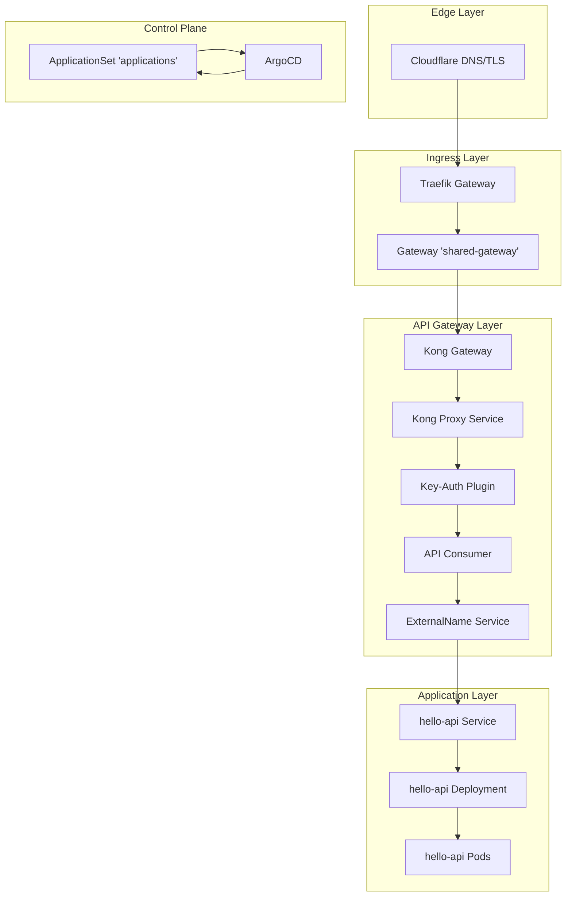
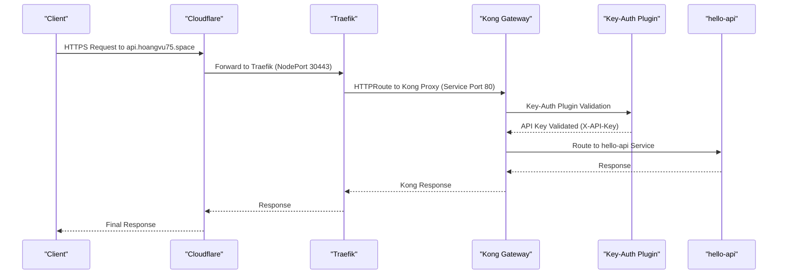
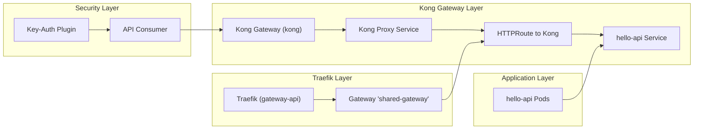

# Demo Applications

<cite>
**Referenced Files in This Document**
- [httproute-kong.yaml](file://apps/infra/kong/chart/httproute-kong.yaml)
- [default-user-consumer.yaml](file://apps/infra/kong/chart/consumers/default-user-consumer.yaml)
- [key-auth-plugin.yaml](file://apps/infra/kong/chart/plugins/key-auth-plugin.yaml)
- [hello-api-service.yaml](file://apps/infra/kong/chart/services/hello-api-service.yaml)
- [values.yaml](file://apps/infra/kong/chart/values.yaml)
- [values.yaml](file://apps/applications/hello-api/chart/values.yaml)
- [values-service.yaml](file://apps/applications/hello-api/chart/values-service.yaml)
- [values-httproute.yaml](file://apps/applications/hello-api/chart/values-httproute.yaml)
- [kustomization.yaml](file://apps/applications/hello-api/kustomization.yaml)
- [config.yaml](file://apps/applications/hello-api/config.yaml)
- [applications.yaml](file://projects/applications.yaml)
- [namespace.yaml](file://cluster-resources/default/namespace.yaml)
- [gateway.yaml](file://apps/infra/gateway-api/chart/gateway.yaml)
- [traefik.yaml](file://apps/infra/gateway-api/chart/traefik.yaml)
- [httproute-argocd.yaml](file://apps/infra/argocd-ingress/chart/httproute-argocd.yaml)
- [httproute-rancher.yaml](file://apps/infra/rancher/chart/httproute-rancher.yaml)
- [root.yaml](file://bootstrap/root.yaml)
- [ingressroutetcp.yaml](file://apps/applications/tcp-demo/chart/ingressroutetcp.yaml)
- [ingressrouteudp.yaml](file://apps/applications/udp-demo/chart/ingressrouteudp.yaml)
- [deployment.yaml](file://apps/applications/tcp-demo/chart/deployment.yaml)
- [deployment.yaml](file://apps/applications/udp-demo/chart/deployment.yaml)
- [service.yaml](file://apps/applications/tcp-demo/chart/service.yaml)
- [service.yaml](file://apps/applications/udp-demo/chart/service.yaml)
- [kustomization.yaml](file://apps/applications/tcp-demo/kustomization.yaml)
- [kustomization.yaml](file://apps/applications/udp-demo/kustomization.yaml)
- [config.yaml](file://apps/applications/tcp-demo/config.yaml)
- [config.yaml](file://apps/applications/udp-demo/config.yaml)
</cite>

## Update Summary
**Changes Made**
- Updated hello-api application routing architecture from direct HTTPRoute to Kong Gateway with centralized API key authentication
- Documented new Kong Gateway configuration with DB-less mode and key-auth plugin integration
- Added comprehensive Kong consumer and API key management patterns with secure credential distribution
- Revised HTTPRoute configuration to deprecated status with migration guidance to Kong Gateway
- Enhanced security model with enterprise-grade API key authentication through Kong key-auth plugin
- Updated application architecture diagrams to reflect new three-tier routing topology with Kong Gateway

## Table of Contents
1. [Introduction](#introduction)
2. [Project Structure](#project-structure)
3. [Core Components](#core-components)
4. [Architecture Overview](#architecture-overview)
5. [Detailed Component Analysis](#detailed-component-analysis)
6. [Layer 4 Routing Demonstrations](#layer-4-routing-demonstrations)
7. [Dependency Analysis](#dependency-analysis)
8. [Performance Considerations](#performance-considerations)
9. [Troubleshooting Guide](#troubleshooting-guide)
10. [Conclusion](#conclusion)
11. [Appendices](#appendices)

## Introduction
This document explains the demo applications deployed in the playground environment, featuring a comprehensive routing architecture that has been migrated from direct HTTPRoute to Kong Gateway integration. The hello-api application now demonstrates advanced API gateway capabilities through Kong's DB-less mode with built-in key authentication, while maintaining the existing Layer 4 routing demonstrations for TCP and UDP protocols. The new architecture showcases enterprise-grade API management features including rate limiting, authentication, and observability through a unified ArgoCD-driven GitOps workflow.

## Project Structure
The playground maintains its unified apps/applications/ directory structure while introducing Kong Gateway as the central routing layer. The new architecture features three distinct routing tiers: Cloudflare at the edge, Traefik as the ingress controller, Kong as the API gateway, and the hello-api application as the backend service. Each demo application continues to use standardized configuration patterns with enhanced security and observability capabilities.

**Diagram sources**
- [httproute-kong.yaml:1-30](file://apps/infra/kong/chart/httproute-kong.yaml#L1-L30)
- [values.yaml:1-43](file://apps/infra/kong/chart/values.yaml#L1-L43)
- [key-auth-plugin.yaml:1-12](file://apps/infra/kong/chart/plugins/key-auth-plugin.yaml#L1-L12)
- [default-user-consumer.yaml:1-24](file://apps/infra/kong/chart/consumers/default-user-consumer.yaml#L1-L24)
- [hello-api-service.yaml:1-11](file://apps/infra/kong/chart/services/hello-api-service.yaml#L1-L11)
- [gateway.yaml:1-34](file://apps/infra/gateway-api/chart/gateway.yaml#L1-L34)
- [traefik.yaml:1-157](file://apps/infra/gateway-api/chart/traefik.yaml#L1-L157)

**Section sources**
- [applications.yaml:1-85](file://projects/applications.yaml#L1-L85)
- [root.yaml:1-37](file://bootstrap/root.yaml#L1-L37)
- [kustomization.yaml:1-8](file://apps/applications/hello-api/kustomization.yaml#L1-L8)

## Core Components
- **Application discovery and deployment**: Managed by an ApplicationSet that scans apps/applications/**/config.yaml files and generates per-app Application resources with enhanced support for Kong Gateway integration.
- **hello-api module**: HTTP-based application now routed through Kong Gateway with key authentication, featuring DB-less mode configuration and centralized service management.
- **Kong Gateway infrastructure**: Enterprise-grade API gateway providing authentication, rate limiting, and observability with Traefik integration for seamless traffic flow.
- **Enhanced security model**: Key-auth plugin integrated into Kong configuration with predefined consumer credentials for development testing.
- **Unified routing architecture**: Three-tier routing from Cloudflare → Traefik → Kong → Application, providing enterprise-grade API management capabilities.
- **Namespace isolation**: Each demo application maintains complete isolation with Kong Gateway providing centralized routing policies.

Key configuration anchors:
- **Kong Gateway**: DB-less mode configuration, service definitions, route patterns, key-auth plugin setup, consumer credentials
- **Traefik Integration**: Gateway API compatibility, listener configuration, TLS termination, metrics collection
- **Application routing**: HTTPRoute pointing to Kong proxy service instead of direct application service
- **Security policies**: API key authentication, consumer management, credential distribution

**Section sources**
- [applications.yaml:33-74](file://projects/applications.yaml#L33-L74)
- [config.yaml:1-4](file://apps/applications/hello-api/config.yaml#L1-L4)
- [config.yaml:1-4](file://apps/applications/tcp-demo/config.yaml#L1-L4)
- [config.yaml:1-4](file://apps/applications/udp-demo/config.yaml#L1-L4)
- [values.yaml:1-23](file://apps/applications/hello-api/chart/values.yaml#L1-L23)
- [values.yaml:1-43](file://apps/infra/kong/chart/values.yaml#L1-L43)
- [httproute-kong.yaml:14-29](file://apps/infra/kong/chart/httproute-kong.yaml#L14-L29)

## Architecture Overview
The demo applications now feature a sophisticated three-tier routing architecture that demonstrates enterprise-grade API management capabilities:
- Cloudflare handles DNS resolution and TLS termination at the edge
- Traefik serves as the ingress controller with Gateway API support
- Kong Gateway provides API management, authentication, and observability
- Applications receive traffic through Kong's centralized routing layer
- Security is enforced through key-auth plugin with configurable credentials
- Observability is enhanced through Kong's metrics and logging capabilities

**Diagram sources**
- [httproute-kong.yaml:8-29](file://apps/infra/kong/chart/httproute-kong.yaml#L8-L29)
- [values.yaml:20-27](file://apps/infra/kong/chart/values.yaml#L20-L27)
- [key-auth-plugin.yaml:8-11](file://apps/infra/kong/chart/plugins/key-auth-plugin.yaml#L8-L11)
- [traefik.yaml:134-141](file://apps/infra/gateway-api/chart/traefik.yaml#L134-L141)

## Detailed Component Analysis

### Kong Gateway Integration
The hello-api application now routes through Kong Gateway as part of a comprehensive API management solution:
- **DB-less Mode**: Kong operates without persistent database using declarative configuration
- **Service Definition**: Centralized service configuration for hello-api with route patterns
- **Key Authentication**: Built-in key-auth plugin with predefined consumer credentials
- **Route Management**: Path-based routing with strip_path functionality for clean URL handling
- **Proxy Integration**: Kong proxy service acts as intermediary between Traefik and application

**Updated** The Kong configuration replaces the previous HTTPRoute approach with enterprise-grade API gateway capabilities, providing enhanced security and observability.

**Section sources**
- [values.yaml:1-43](file://apps/infra/kong/chart/values.yaml#L1-L43)
- [httproute-kong.yaml:1-30](file://apps/infra/kong/chart/httproute-kong.yaml#L1-L30)

### Multi-Value Configuration Approach
The hello-api module maintains its three-values-file approach with enhanced Kong integration:
- **Deployment and container configuration**: Standard HTTP echo service with resource optimization
- **Service configuration**: Kubernetes Service exposing application on port 5678
- **HTTPRoute configuration**: Now deprecated and disabled, replaced by Kong Gateway routing

**Updated** The HTTPRoute values file is marked as deprecated with migration guidance to Kong Gateway configuration.

**Section sources**
- [values.yaml:1-23](file://apps/applications/hello-api/chart/values.yaml#L1-L23)
- [values-service.yaml:1-6](file://apps/applications/hello-api/chart/values-service.yaml#L1-L6)
- [values-httproute.yaml:1-28](file://apps/applications/hello-api/chart/values-httproute.yaml#L1-L28)

### Service Definition
**HTTP Applications**: Service definitions enable standard Kubernetes service exposure with optimized resource allocation for the HTTP echo service.

**Layer 4 Applications**: Service definitions use ClusterIP type with protocol-specific port configurations for TCP and UDP echo services.

Operational notes:
- Service names must match backend references in Kong configuration
- Port specifications align with application container listening ports
- Resource optimization ensures efficient playground operation

**Section sources**
- [values-service.yaml:1-6](file://apps/applications/hello-api/chart/values-service.yaml#L1-L6)
- [service.yaml:1-14](file://apps/applications/tcp-demo/chart/service.yaml#L1-L14)
- [service.yaml:1-15](file://apps/applications/udp-demo/chart/service.yaml#L1-L15)

### Kong HTTPRoute Configuration
**Updated** The hello-api application now uses Kong Gateway HTTPRoute instead of direct HTTPRoute:
- **Parent Reference**: References shared-gateway in gateway-api namespace
- **Hostname Configuration**: api.hoangvu75.space for consistent domain routing
- **Path Matching**: Root path (/) with Kong proxy backend
- **Request Header Modification**: Sets forwarded protocol and port headers
- **Backend Reference**: Routes to Kong proxy service instead of direct application

**Section sources**
- [httproute-kong.yaml:1-30](file://apps/infra/kong/chart/httproute-kong.yaml#L1-L30)

### Kong Configuration and Security
**Enterprise-Grade Features**: Kong Gateway provides comprehensive API management capabilities:
- **DB-less Declarative Config**: YAML-based configuration without persistent storage
- **Key Authentication Plugin**: Built-in API key validation with configurable credentials
- **Consumer Management**: Predefined consumer with development API key
- **Service Routing**: Centralized service definition with route patterns
- **Security Integration**: API key authentication as part of the routing pipeline

**Section sources**
- [values.yaml:19-21](file://apps/infra/kong/chart/values.yaml#L19-L21)
- [values.yaml:20-27](file://apps/infra/kong/chart/values.yaml#L20-L27)
- [key-auth-plugin.yaml:1-12](file://apps/infra/kong/chart/plugins/key-auth-plugin.yaml#L1-L12)
- [default-user-consumer.yaml:1-24](file://apps/infra/kong/chart/consumers/default-user-consumer.yaml#L1-L24)

### Kong Consumer and API Key Management
**Updated** The Kong Gateway now includes comprehensive API key management:
- **Consumer Creation**: Default consumer named "default-user" with associated credentials
- **API Key Configuration**: Development API key "dev-api-key-123" distributed via Kubernetes Secret
- **Key Naming Convention**: Custom key header "X-API-Key" for authentication requests
- **Credential Distribution**: Secure credential management through Kong consumer and secret resources
- **Plugin Integration**: Key-auth plugin configured to validate consumer credentials

**Section sources**
- [default-user-consumer.yaml:1-24](file://apps/infra/kong/chart/consumers/default-user-consumer.yaml#L1-L24)
- [key-auth-plugin.yaml:8-11](file://apps/infra/kong/chart/plugins/key-auth-plugin.yaml#L8-L11)

### ExternalName Service Integration
**Updated** The Kong Gateway includes ExternalName service for hello-api:
- **Service Type**: ExternalName service in kong namespace
- **External Endpoint**: hello-api.hello-api.svc.cluster.local for application access
- **Namespace Isolation**: Maintains separation between Kong and application namespaces
- **Service Resolution**: Enables Kong to route to hello-api service without direct namespace coupling

**Section sources**
- [hello-api-service.yaml:1-11](file://apps/infra/kong/chart/services/hello-api-service.yaml#L1-L11)

### Kustomization and Namespace Binding
**HTTP Applications**: Kustomization sets target namespaces and applies ArgoCD annotations for sync wave coordination.

**Layer 4 Applications**: Kustomization follows the same pattern with direct resource definitions for protocol-specific deployments.

Operational notes:
- Namespace creation is handled by ArgoCD with CreateNamespace enabled
- Sync waves coordinate startup order with infrastructure resources
- Kong Gateway requires proper namespace isolation for security

**Section sources**
- [kustomization.yaml:4](file://apps/applications/hello-api/kustomization.yaml#L4)
- [kustomization.yaml:4](file://apps/applications/tcp-demo/kustomization.yaml#L4)
- [kustomization.yaml:4](file://apps/applications/udp-demo/kustomization.yaml#L4)
- [config.yaml:1-4](file://apps/applications/hello-api/config.yaml#L1-L4)
- [config.yaml:1-4](file://apps/applications/tcp-demo/config.yaml#L1-L4)
- [config.yaml:1-4](file://apps/applications/udp-demo/config.yaml#L1-L4)

### Relationship to Playground Namespace Isolation
**Infrastructure namespaces**: Cluster-level namespaces for infrastructure are pre-provisioned with coordinated sync waves for stable foundation services.

**Demo application namespaces**: Each demo application namespace is created during Application sync with CreateNamespace enabled, providing complete isolation for HTTP and Layer 4 routing demonstrations.

**Updated** Kong Gateway introduces additional security isolation through API key authentication and centralized policy management across all demo applications.

**Section sources**
- [namespace.yaml:1-52](file://cluster-resources/default/namespace.yaml#L1-L52)
- [applications.yaml:72-74](file://projects/applications.yaml#L72-L74)

### ArgoCD Synchronization and GitOps Workflow
**ApplicationSet Configuration**: The unified applications.yaml manages discovery across all demo applications with Git-based generators scanning for config.yaml files.

**Sync Policy**: Automated synchronization with pruning, self-healing, and retry mechanisms ensures reliable deployment across HTTP and Layer 4 applications.

**Sync Waves**: Coordinated ordering ensures infrastructure stability before application deployment, with Kong Gateway using wave 2 and applications using wave 3.

Practical implications:
- Kong Gateway requires earlier sync than applications for proper routing
- API key credentials are provisioned during Kong Gateway deployment
- Traefik gateway must be available before Kong HTTPRoute can attach
- Unified ApplicationSet simplifies management of diverse routing protocols

**Section sources**
- [applications.yaml:33-74](file://projects/applications.yaml#L33-L74)
- [config.yaml:2-3](file://apps/applications/hello-api/config.yaml#L2-L3)
- [config.yaml:2-3](file://apps/applications/tcp-demo/config.yaml#L2-L3)
- [config.yaml:2-3](file://apps/applications/udp-demo/config.yaml#L2-L3)

### Learning Tooling and Testing Scenarios
**HTTP Applications**: Demonstrate GitOps end-to-end workflow with Kong Gateway integration, API key authentication, and centralized routing policies.

**Layer 4 Applications**: Provide hands-on experience with connection-oriented and datagram protocols through practical echo service testing.

**Updated** The expanded demo catalog now includes enterprise-grade API management capabilities alongside comprehensive routing demonstrations, serving as a complete learning toolkit for modern Kubernetes networking and API management.

## Layer 4 Routing Demonstrations

### TCP Echo Demo Application
The tcp-demo application demonstrates Traefik's Layer 4 TCP routing capabilities through a simple echo service:
- **Protocol Support**: Uses IngressRouteTCP resource type for connection-oriented protocol handling
- **Entry Points**: Routes traffic from Traefik entryPoint "tcp" (port 9000) to tcp-echo service
- **Testing Method**: Netcat client (`nc <node-ip> 30900`) for immediate echo feedback
- **Container Technology**: Alpine socat container with TCP-LISTEN socket configuration
- **Resource Allocation**: Minimal CPU (50m) and memory (32Mi-64Mi) for efficient playground operation

**Operational Characteristics**:
- Connection-based protocol with persistent sessions
- Immediate response echoing of typed input
- Support for both NodePort and ClusterIP access methods
- Integration with Traefik dashboard for real-time monitoring

**Section sources**
- [ingressroutetcp.yaml:1-21](file://apps/applications/tcp-demo/chart/ingressroutetcp.yaml#L1-L21)
- [deployment.yaml:1-28](file://apps/applications/tcp-demo/chart/deployment.yaml#L1-L28)
- [service.yaml:1-14](file://apps/applications/tcp-demo/chart/service.yaml#L1-L14)

### UDP Echo Demo Application
The udp-demo application showcases Traefik's Layer 4 UDP routing capabilities:
- **Protocol Support**: Uses IngressRouteUDP resource type for datagram protocol handling
- **Entry Points**: Routes traffic from Traefik entryPoint "udp" (port 9001/UDP) to udp-echo service
- **Testing Method**: Netcat client with UDP flag (`nc -u <node-ip> 30901`) for datagram echo
- **Container Technology**: Alpine socat container with UDP-LISTEN socket configuration
- **Resource Allocation**: Identical minimal resource profile to TCP demo for consistency

**Operational Characteristics**:
- Connectionless protocol with best-effort delivery
- Potential initial packet loss during listener initialization
- Requires multiple test messages for reliable echo verification
- Suitable for network protocol testing and monitoring scenarios

**Section sources**
- [ingressrouteudp.yaml:1-20](file://apps/applications/udp-demo/chart/ingressrouteudp.yaml#L1-L20)
- [deployment.yaml:1-29](file://apps/applications/udp-demo/chart/deployment.yaml#L1-L29)
- [service.yaml:1-15](file://apps/applications/udp-demo/chart/service.yaml#L1-L15)

### Traefik Integration and Dashboard Visibility
Both Layer 4 applications integrate seamlessly with the Traefik dashboard for comprehensive observability:
- **Router Discovery**: Automatic detection of TCP and UDP routers in Traefik dashboard
- **Service Monitoring**: Real-time backend service status with pod server counts
- **Metrics Collection**: Prometheus metrics for connection tracking and performance monitoring
- **Access Logging**: JSON-formatted access logs for protocol-specific traffic analysis

**Dashboard Features**:
- Separate sections for HTTP, TCP, and UDP routing visualization
- Router naming conventions reflecting application and namespace structure
- Service backend mapping showing pod-level connectivity
- Metrics endpoints for operational monitoring and debugging

**Section sources**
- [traefik.yaml:1-157](file://apps/infra/gateway-api/chart/traefik.yaml#L1-L157)

## Dependency Analysis
The demo applications now feature a three-tier dependency structure with enhanced security and management capabilities:

**HTTP Applications with Kong Gateway**:
- Kong Gateway availability in the kong namespace with proper sync waves
- Traefik Gateway API compatibility for HTTPRoute attachment
- Namespace existence and proper RBAC for ApplicationSet operations
- API key authentication plugin configuration and consumer credentials
- Centralized service routing through Kong proxy service

**Layer 4 Applications**:
- Traefik GatewayClass and entryPoint configuration in gateway-api namespace
- Namespace labeling requirements for routing exposure (`routing.hoangvu75.space/expose: "true"`)
- Protocol-specific service port configurations (TCP 7777, UDP 7778)
- Socat container dependencies for echo service functionality

**Diagram sources**
- [httproute-kong.yaml:8-29](file://apps/infra/kong/chart/httproute-kong.yaml#L8-L29)
- [values.yaml:19-21](file://apps/infra/kong/chart/values.yaml#L19-L21)
- [gateway.yaml:1-34](file://apps/infra/gateway-api/chart/gateway.yaml#L1-L34)

**Section sources**
- [httproute-kong.yaml:1-30](file://apps/infra/kong/chart/httproute-kong.yaml#L1-L30)
- [values.yaml:1-43](file://apps/infra/kong/chart/values.yaml#L1-L43)
- [gateway.yaml:1-34](file://apps/infra/gateway-api/chart/gateway.yaml#L1-L34)

## Performance Considerations
**HTTP Applications with Kong Gateway**: The addition of Kong Gateway introduces minimal overhead while providing significant security and management benefits:
- **Resource Overhead**: Kong consumes additional CPU (100m-200m) and memory (128Mi-256Mi) for API management
- **Connection Handling**: Efficient connection pooling and request routing through Kong proxy
- **Authentication Processing**: Key-auth plugin adds minimal latency to request processing
- **Observability**: Enhanced metrics and logging capabilities with minimal performance impact

**Layer 4 Applications**: Both TCP and UDP demo applications continue to use minimal resource profiles optimized for socat-based echo services:
- **CPU Requests**: 50m for both TCP and UDP applications
- **Memory Requests**: 32Mi for both TCP and UDP applications  
- **Memory Limits**: 64Mi for both TCP and UDP applications
- **Replica Count**: Single replica for both applications to minimize resource consumption

**Network Path Optimization**:
- Kong Gateway introduces minimal latency compared to direct HTTPRoute routing
- Traefik maintains low-latency forwarding to Kong proxy service
- NodePort exposure (30900 for TCP, 30901 for UDP) provides direct cluster ingress
- ClusterIP services offer internal-only access without external exposure

**Scalability Considerations**:
- Kong Gateway can scale horizontally while maintaining API management policies
- Application deployments can scale independently behind Kong proxy
- Resource allocation allows for concurrent testing scenarios without performance degradation

## Troubleshooting Guide
**Common HTTP Application Issues with Kong Gateway**:
- **Route not reachable**: Verify Kong HTTPRoute exists in the kong namespace and attaches to the shared Gateway. Confirm hostname and path prefix match client expectations.
- **API key authentication failure**: Check Kong key-auth plugin configuration and verify API key header (X-API-Key) is included in requests.
- **No traffic after sync**: Check ArgoCD Application status and logs for sync errors. Validate namespace existence and ApplicationSet generation.
- **Rollback procedure**: Adjust Kong configuration values to revert to previous service definitions; ArgoCD self-healing will reconcile differences.
- **Health checks**: Use curl with API key header to test configured hostname and path; inspect pod logs for readiness/liveness probe issues.

**Updated** Common Kong Gateway Issues:
- **Kong proxy unreachable**: Verify Kong proxy service is running and accessible on port 80 within the kong namespace.
- **Key-auth plugin not working**: Check Kong plugin configuration and ensure API key is properly formatted and transmitted.
- **Service routing failure**: Confirm Kong service definition matches application Service name and namespace.
- **Consumer credentials invalid**: Verify API consumer credentials are properly configured in Kong declarative config.

**Updated** Troubleshooting Procedures:
- **Kong Gateway connectivity testing**: Use curl with API key header (`curl -H "X-API-Key: dev-api-key-123" https://api.hoangvu75.space/helloworld`) to validate routing functionality.
- **Kong metrics verification**: Check Kong metrics endpoints for active connections and request processing statistics.
- **Access log analysis**: Review Kong access logs for request routing and authentication events.
- **Traefik metrics verification**: Monitor Traefik metrics for upstream connection health and routing performance.

**Section sources**
- [values-httproute.yaml:1-28](file://apps/applications/hello-api/chart/values-httproute.yaml#L1-L28)
- [values-service.yaml:1-6](file://apps/applications/hello-api/chart/values-service.yaml#L1-L6)
- [httproute-kong.yaml:1-30](file://apps/infra/kong/chart/httproute-kong.yaml#L1-L30)
- [key-auth-plugin.yaml:8-11](file://apps/infra/kong/chart/plugins/key-auth-plugin.yaml#L8-L11)
- [default-user-consumer.yaml:21-22](file://apps/infra/kong/chart/consumers/default-user-consumer.yaml#L21-L22)
- [applications.yaml:61-74](file://projects/applications.yaml#L61-L74)

## Conclusion
The expanded demo application catalog now provides comprehensive coverage of modern Kubernetes networking through HTTP, TCP, and UDP routing demonstrations, enhanced by enterprise-grade Kong Gateway integration. The unified apps/applications/ directory structure, powered by ApplicationSet-based GitOps workflows, enables consistent deployment patterns across diverse protocol families with enhanced security and management capabilities.

The migration from direct HTTPRoute to Kong Gateway routing demonstrates advanced API management principles including centralized authentication, service routing, and observability. The hello-api application now showcases enterprise-grade features such as key-auth plugin integration, DB-less configuration, and centralized policy management, while maintaining the practical Layer 4 routing demonstrations for TCP and UDP protocols.

By leveraging shared infrastructure components, consistent naming conventions, coordinated sync waves, and enterprise-grade security features, the demo applications serve as an excellent learning platform for understanding modern Kubernetes networking patterns, API management, and production-ready deployment strategies. The combination of practical testing scenarios, comprehensive observability through multiple layers, and robust troubleshooting guidance makes this catalog invaluable for both educational purposes and production readiness assessment.

## Appendices

### Appendix A: Typical Update and Rollback Workflow
**HTTP Applications with Kong Gateway**: Modify values in Kong configuration files or application values.yaml, commit, and push. ArgoCD detects changes and reconciles the Application. Verification includes Kong HTTPRoute testing, API key authentication validation, and pod rollout confirmation. Rollback involves reverting to known-good commits with automatic self-healing through Kong's declarative configuration.

**Layer 4 Applications**: For TCP and UDP demos, modify deployment specifications or service configurations directly in the chart resources. Since these use direct resource definitions rather than Helm values, updates require careful consideration of protocol-specific settings. Testing includes protocol-specific validation procedures for connection-oriented and datagram traffic.

**Section sources**
- [applications.yaml:61-74](file://projects/applications.yaml#L61-L74)
- [deployment.yaml:1-28](file://apps/applications/tcp-demo/chart/deployment.yaml#L1-L28)
- [deployment.yaml:1-29](file://apps/applications/udp-demo/chart/deployment.yaml#L1-L29)

### Appendix B: Related Ingress Examples in the Playground
**HTTP Applications**: Kong Gateway HTTPRoute demonstrates advanced routing through the shared Gateway infrastructure, showcasing centralized API management capabilities alongside multiple demo applications.

**Layer 4 Integration**: Both HTTP and Layer 4 applications benefit from the same underlying infrastructure, with HTTP applications now using Kong Gateway routing and Layer 4 applications using Traefik's native routing capabilities. The unified ApplicationSet configuration ensures consistent deployment patterns across all routing protocols.

**Section sources**
- [httproute-argocd.yaml:1-29](file://apps/infra/argocd-ingress/chart/httproute-argocd.yaml#L1-L29)
- [httproute-rancher.yaml:1-30](file://apps/infra/rancher/chart/httproute-rancher.yaml#L1-L30)

### Appendix C: Getting Started with ArgoCD
**Installation Process**: Install ArgoCD, expose the UI, apply repository secrets, and bootstrap the root Application for unified application management.

**ApplicationSet Configuration**: The applications.yaml file provides comprehensive GitOps management for all demo applications, supporting both HTTP and Layer 4 routing demonstrations through standardized discovery and deployment patterns with enhanced Kong Gateway integration.

**Section sources**
- [applications.yaml:23-85](file://projects/applications.yaml#L23-L85)

### Appendix D: Kong Gateway Configuration Patterns
**Kong Gateway Pattern**:
1. **DB-less Configuration**: YAML-based declarative configuration without persistent database requirements
2. **Service Definition**: Centralized service configuration with route patterns and strip_path functionality
3. **Key Authentication**: Built-in key-auth plugin with consumer credentials for API protection
4. **Proxy Integration**: Kong proxy service as intermediary between Traefik and application services

**HTTP Application Pattern**:
1. **Kong HTTPRoute**: Routes from shared Gateway to Kong proxy service
2. **Request Header Modification**: Sets forwarded protocol and port headers for proper upstream handling
3. **Backend Reference**: Points to Kong proxy service instead of direct application service
4. **Path-Based Routing**: Clean URL patterns with optional path stripping for application consumption

**Shared Infrastructure Requirements**:
- Kong Gateway deployment with proper sync waves (wave 2)
- Traefik Gateway API compatibility and listener configuration
- Namespace labeling for routing exposure and security isolation
- Resource allocation optimization for enterprise-grade API management
- Observability integration through multiple metric endpoints

**Section sources**
- [values.yaml:1-43](file://apps/infra/kong/chart/values.yaml#L1-L43)
- [httproute-kong.yaml:1-30](file://apps/infra/kong/chart/httproute-kong.yaml#L1-L30)
- [traefik.yaml:1-157](file://apps/infra/gateway-api/chart/traefik.yaml#L1-L157)