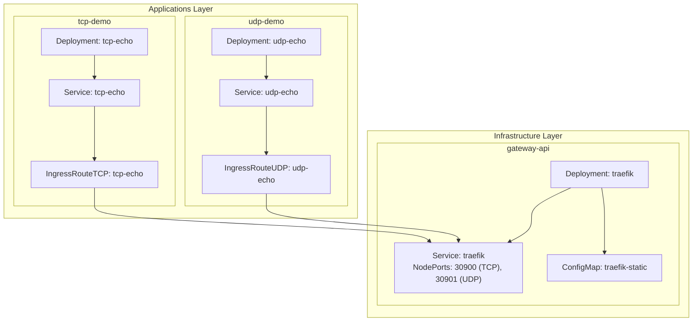
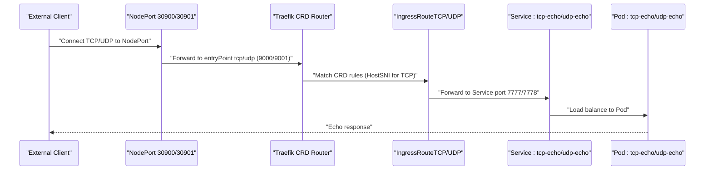
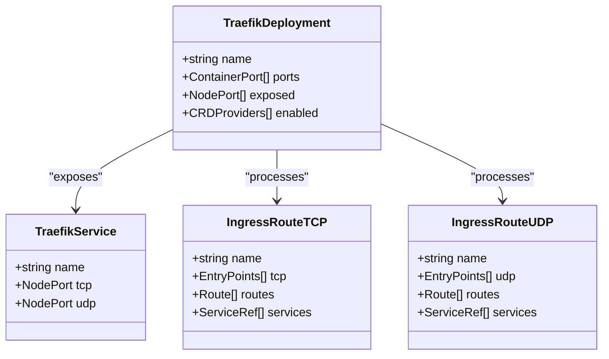
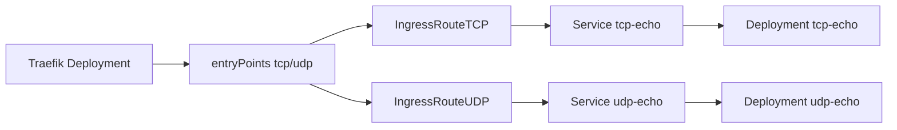

# TCP Echo Demo Application

<cite>
**Referenced Files in This Document**
- [deployment.yaml](file://apps/applications/tcp-demo/chart/deployment.yaml)
- [service.yaml](file://apps/applications/tcp-demo/chart/service.yaml)
- [ingressroutetcp.yaml](file://apps/applications/tcp-demo/chart/ingressroutetcp.yaml)
- [config.yaml](file://apps/applications/tcp-demo/config.yaml)
- [kustomization.yaml](file://apps/applications/tcp-demo/kustomization.yaml)
- [deployment.yaml](file://apps/applications/udp-demo/chart/deployment.yaml)
- [service.yaml](file://apps/applications/udp-demo/chart/service.yaml)
- [ingressrouteudp.yaml](file://apps/applications/udp-demo/chart/ingressrouteudp.yaml)
- [config.yaml](file://apps/applications/udp-demo/config.yaml)
- [kustomization.yaml](file://apps/applications/udp-demo/kustomization.yaml)
- [gateway.yaml](file://apps/infra/gateway-api/chart/gateway.yaml)
- [gatewayclass.yaml](file://apps/infra/gateway-api/chart/gatewayclass.yaml)
- [traefik.yaml](file://apps/infra/gateway-api/chart/traefik.yaml)
- [traefik-static.yaml](file://apps/infra/gateway-api/chart/traefik-static.yaml)
- [README.md](file://guide/tcp-udp-demo/README.md)
</cite>

## Update Summary
**Changes Made**
- Completely rewritten to reflect architectural shift from Gateway API-based routing to Traefik's native CRD-based routing (IngressRouteTCP/IngressRouteUDP)
- Updated core components section to clarify Traefik now uses native CRDs instead of Gateway API
- Revised architecture overview to show direct CRD-to-service routing without Gateway dependency
- Enhanced testing instructions with Git Bash compatible commands for both TCP and UDP protocols
- Improved troubleshooting guidance focusing on CRD validation and Traefik configuration
- Updated dependency analysis to reflect sync wave ordering for CRD-based routing

## Table of Contents
1. [Introduction](#introduction)
2. [Project Structure](#project-structure)
3. [Core Components](#core-components)
4. [Architecture Overview](#architecture-overview)
5. [Detailed Component Analysis](#detailed-component-analysis)
6. [Dependency Analysis](#dependency-analysis)
7. [Performance Considerations](#performance-considerations)
8. [Troubleshooting Guide](#troubleshooting-guide)
9. [Conclusion](#conclusion)

## Introduction
This document describes the TCP Echo Demo Application, a minimal demonstration of Layer 4 routing using Traefik's native CRD-based routing system. It deploys TCP and UDP echo services backed by socat and exposes them externally via Traefik's IngressRouteTCP and IngressRouteUDP resources. The application showcases direct CRD-to-service routing without requiring Gateway API infrastructure, making it more straightforward for Layer 4 traffic management. The guide includes comprehensive testing instructions, dashboard observation, and verification of access logs and metrics.

## Project Structure
The TCP Echo Demo is organized as a Kustomize overlay that composes Kubernetes manifests for TCP and UDP echo applications. Each application consists of a Deployment, Service, and Traefik-native IngressRoute resource. The infrastructure layer provides a Traefik deployment with native CRD support and NodePort exposure for external access.

**Diagram sources**
- [deployment.yaml:1-28](file://apps/applications/tcp-demo/chart/deployment.yaml#L1-L28)
- [service.yaml:1-14](file://apps/applications/tcp-demo/chart/service.yaml#L1-L14)
- [ingressroutetcp.yaml:1-21](file://apps/applications/tcp-demo/chart/ingressroutetcp.yaml#L1-L21)
- [deployment.yaml:1-29](file://apps/applications/udp-demo/chart/deployment.yaml#L1-L29)
- [service.yaml:1-15](file://apps/applications/udp-demo/chart/service.yaml#L1-L15)
- [ingressrouteudp.yaml:1-20](file://apps/applications/udp-demo/chart/ingressrouteudp.yaml#L1-L20)
- [traefik.yaml:1-147](file://apps/infra/gateway-api/chart/traefik.yaml#L1-L147)
- [traefik-static.yaml:1-66](file://apps/infra/gateway-api/chart/traefik-static.yaml#L1-L66)

**Section sources**
- [kustomization.yaml:1-8](file://apps/applications/tcp-demo/kustomization.yaml#L1-L8)
- [config.yaml:1-4](file://apps/applications/tcp-demo/config.yaml#L1-L4)
- [kustomization.yaml:1-8](file://apps/applications/udp-demo/kustomization.yaml#L1-L8)
- [config.yaml:1-4](file://apps/applications/udp-demo/config.yaml#L1-L4)

## Core Components
- TCP Echo Service
  - Deployment runs a single replica of socat listening on TCP port 7777 with fork/reuseaddr capabilities.
  - Service targets the Deployment with ClusterIP and port 7777.
  - IngressRouteTCP directly routes TCP traffic from Traefik's tcp entryPoint to the Service on port 7777.
- UDP Echo Service
  - Deployment runs a single replica of socat listening on UDP port 7778 with fork/reuseaddr capabilities.
  - Service targets the Deployment with ClusterIP and port 7778 (UDP).
  - IngressRouteUDP directly routes UDP traffic from Traefik's udp entryPoint to the Service on port 7778.
- Infrastructure
  - Traefik Deployment exposes NodePorts 30900 (TCP) and 30901 (UDP) for external access.
  - Traefik static configuration enables native CRD providers and defines entry points for tcp and udp protocols.
  - No Gateway API dependency - routing handled directly by Traefik's CRD controllers.

**Section sources**
- [deployment.yaml:1-28](file://apps/applications/tcp-demo/chart/deployment.yaml#L1-L28)
- [service.yaml:1-14](file://apps/applications/tcp-demo/chart/service.yaml#L1-L14)
- [ingressroutetcp.yaml:1-21](file://apps/applications/tcp-demo/chart/ingressroutetcp.yaml#L1-L21)
- [deployment.yaml:1-29](file://apps/applications/udp-demo/chart/deployment.yaml#L1-L29)
- [service.yaml:1-15](file://apps/applications/udp-demo/chart/service.yaml#L1-L15)
- [ingressrouteudp.yaml:1-20](file://apps/applications/udp-demo/chart/ingressrouteudp.yaml#L1-L20)
- [traefik.yaml:1-147](file://apps/infra/gateway-api/chart/traefik.yaml#L1-L147)
- [traefik-static.yaml:1-66](file://apps/infra/gateway-api/chart/traefik-static.yaml#L1-L66)

## Architecture Overview
The TCP Echo Demo demonstrates Layer 4 routing using Traefik's native CRD-based approach:
- External client connects to NodePort 30900 (TCP) or 30901 (UDP).
- Traefik receives traffic on the appropriate entryPoint (tcp:9000 or udp:9001) and processes CRD rules.
- IngressRouteTCP/IngressRouteUDP directly match traffic patterns and forward to the respective Service.
- The Service load-balances to the Deployment pods running socat echo servers.

**Diagram sources**
- [ingressroutetcp.yaml:14-20](file://apps/applications/tcp-demo/chart/ingressroutetcp.yaml#L14-L20)
- [ingressrouteudp.yaml:17-19](file://apps/applications/udp-demo/chart/ingressrouteudp.yaml#L17-L19)
- [service.yaml:7-13](file://apps/applications/tcp-demo/chart/service.yaml#L7-L13)
- [service.yaml:7-14](file://apps/applications/udp-demo/chart/service.yaml#L7-L14)
- [deployment.yaml:16-19](file://apps/applications/tcp-demo/chart/deployment.yaml#L16-L19)
- [deployment.yaml:16-19](file://apps/applications/udp-demo/chart/deployment.yaml#L16-L19)
- [traefik.yaml:135-143](file://apps/infra/gateway-api/chart/traefik.yaml#L135-L143)

## Detailed Component Analysis

### TCP Echo Application Stack
- Deployment
  - Container name: socat
  - Image: alpine/socat:latest
  - Arguments: TCP echo listener on 7777 with fork/reuseaddr and exec cat
  - Resources: CPU and memory requests/limits defined for lightweight workload
- Service
  - Type: ClusterIP
  - Selector: app=tcp-echo
  - Ports: name=tcp-echo, port=7777, targetPort=7777
- IngressRouteTCP
  - EntryPoints: tcp (directly from Traefik entryPoint)
  - Match: HostSNI(*) for flexible hostname handling
  - Services: tcp-echo port 7777
  - Annotation: sync wave 3 for proper sequencing

**Diagram sources**
- [ingressroutetcp.yaml:14-20](file://apps/applications/tcp-demo/chart/ingressroutetcp.yaml#L14-L20)
- [service.yaml:7-13](file://apps/applications/tcp-demo/chart/service.yaml#L7-L13)
- [deployment.yaml:16-19](file://apps/applications/tcp-demo/chart/deployment.yaml#L16-L19)

**Section sources**
- [deployment.yaml:1-28](file://apps/applications/tcp-demo/chart/deployment.yaml#L1-L28)
- [service.yaml:1-14](file://apps/applications/tcp-demo/chart/service.yaml#L1-L14)
- [ingressroutetcp.yaml:1-21](file://apps/applications/tcp-demo/chart/ingressroutetcp.yaml#L1-L21)
- [config.yaml:1-4](file://apps/applications/tcp-demo/config.yaml#L1-L4)
- [kustomization.yaml:1-8](file://apps/applications/tcp-demo/kustomization.yaml#L1-L8)

### UDP Echo Application Stack
- Deployment
  - Container name: socat
  - Image: alpine/socat:latest
  - Arguments: UDP echo listener on 7778 with fork/reuseaddr and exec cat
  - Resources: CPU and memory requests/limits defined for lightweight workload
- Service
  - Type: ClusterIP
  - Selector: app=udp-echo
  - Ports: name=udp-echo, port=7778, targetPort=7778 (UDP)
- IngressRouteUDP
  - EntryPoints: udp (directly from Traefik entryPoint)
  - Services: udp-echo port 7778
  - Annotation: sync wave 3 for proper sequencing

**Section sources**
- [deployment.yaml:1-29](file://apps/applications/udp-demo/chart/deployment.yaml#L1-L29)
- [service.yaml:1-15](file://apps/applications/udp-demo/chart/service.yaml#L1-L15)
- [ingressrouteudp.yaml:1-20](file://apps/applications/udp-demo/chart/ingressrouteudp.yaml#L1-L20)
- [config.yaml:1-4](file://apps/applications/udp-demo/config.yaml#L1-L4)
- [kustomization.yaml:1-8](file://apps/applications/udp-demo/kustomization.yaml#L1-L8)

### Traefik Infrastructure with Native CRD Support
- Traefik Deployment:
  - Container ports: 80 (web), 443 (websecure), 8080 (admin), 9000 (TCP), 9001 (UDP), 9082 (metrics)
  - NodePort Service exposing tcp:9000 (30900) and udp:9001 (30901)
  - Static config mounted via ConfigMap enabling native CRD providers
- CRD Providers:
  - IngressRouteTCP: handles TCP Layer 4 routing
  - IngressRouteUDP: handles UDP Layer 4 routing
  - No Gateway API dependency - direct CRD processing

**Diagram sources**
- [traefik.yaml:59-147](file://apps/infra/gateway-api/chart/traefik.yaml#L59-L147)
- [traefik-static.yaml:1-66](file://apps/infra/gateway-api/chart/traefik-static.yaml#L1-L66)
- [ingressroutetcp.yaml:6-20](file://apps/applications/tcp-demo/chart/ingressroutetcp.yaml#L6-L20)
- [ingressrouteudp.yaml:6-19](file://apps/applications/udp-demo/chart/ingressrouteudp.yaml#L6-L19)

**Section sources**
- [traefik.yaml:1-147](file://apps/infra/gateway-api/chart/traefik.yaml#L1-L147)
- [traefik-static.yaml:1-66](file://apps/infra/gateway-api/chart/traefik-static.yaml#L1-L66)

## Dependency Analysis
- Sync ordering
  - Argo CD sync waves ensure proper sequencing: traefik (wave 0) → apps (wave 3) - Gateway API components are not required
- CRD-based routing chain
  - IngressRouteTCP/UDP → Service → Deployment → Pod
- Resource dependencies
  - Both applications share the same Traefik instance but use separate entryPoints and services

**Diagram sources**
- [traefik.yaml:135-143](file://apps/infra/gateway-api/chart/traefik.yaml#L135-L143)
- [ingressroutetcp.yaml:14-20](file://apps/applications/tcp-demo/chart/ingressroutetcp.yaml#L14-L20)
- [ingressrouteudp.yaml:17-19](file://apps/applications/udp-demo/chart/ingressrouteudp.yaml#L17-L19)

**Section sources**
- [ingressroutetcp.yaml:1-21](file://apps/applications/tcp-demo/chart/ingressroutetcp.yaml#L1-L21)
- [ingressrouteudp.yaml:1-20](file://apps/applications/udp-demo/chart/ingressrouteudp.yaml#L1-L20)
- [traefik.yaml:64-65](file://apps/infra/gateway-api/chart/traefik.yaml#L64-L65)
- [config.yaml:1-4](file://apps/applications/tcp-demo/config.yaml#L1-L4)
- [config.yaml:1-4](file://apps/applications/udp-demo/config.yaml#L1-L4)

## Performance Considerations
- Resource limits
  - Both tcp-demo and udp-demo pods define CPU and memory requests/limits suitable for lightweight echo workloads.
- Concurrency model
  - socat uses fork and reuseaddr, allowing concurrent connections per pod for both TCP and UDP protocols.
- Observability
  - Access logs are emitted in JSON format and filtered for relevant status codes.
  - Prometheus metrics are exposed on the metrics endpoint for monitoring open connections and router statistics.

**Section sources**
- [deployment.yaml:22-27](file://apps/applications/tcp-demo/chart/deployment.yaml#L22-L27)
- [deployment.yaml:24-28](file://apps/applications/udp-demo/chart/deployment.yaml#L24-L28)
- [traefik.yaml:196-202](file://apps/infra/gateway-api/chart/traefik.yaml#L196-L202)

## Troubleshooting Guide
- No echo response
  - Verify NodePort connectivity to 30900 (TCP) and 30901 (UDP) and that Traefik is running.
  - Confirm IngressRouteTCP/UDP exists and matches entryPoints to the Service.
  - Check that socat pods are running and ready.
- Dashboard shows no routers
  - Ensure Argo CD sync waves completed and Traefik CRDs are installed.
  - Verify Traefik logs for CRD processing errors.
- Protocol-specific issues
  - TCP: Use curl with telnet scheme or netcat for testing
  - UDP: First packet may be lost during socat initialization, retry the command
- Logs and metrics verification
  - Use kubectl logs to filter tcp/udp-related entries.
  - Query Prometheus metrics endpoint for tcp/udp router and service metrics.

**Section sources**
- [README.md:115-206](file://guide/tcp-udp-demo/README.md#L115-L206)
- [traefik.yaml:196-202](file://apps/infra/gateway-api/chart/traefik.yaml#L196-L202)

## Conclusion
The TCP Echo Demo Application provides a concise example of Layer 4 routing using Traefik's native CRD-based approach. By combining simple socat-based echo services with Traefik's IngressRouteTCP and IngressRouteUDP resources, it demonstrates direct routing from external clients to Kubernetes Services and Pods without Gateway API dependencies. The included guide offers practical testing steps using Git Bash compatible commands, dashboard inspection, and observability checks to validate correct operation of both TCP and UDP echo services.