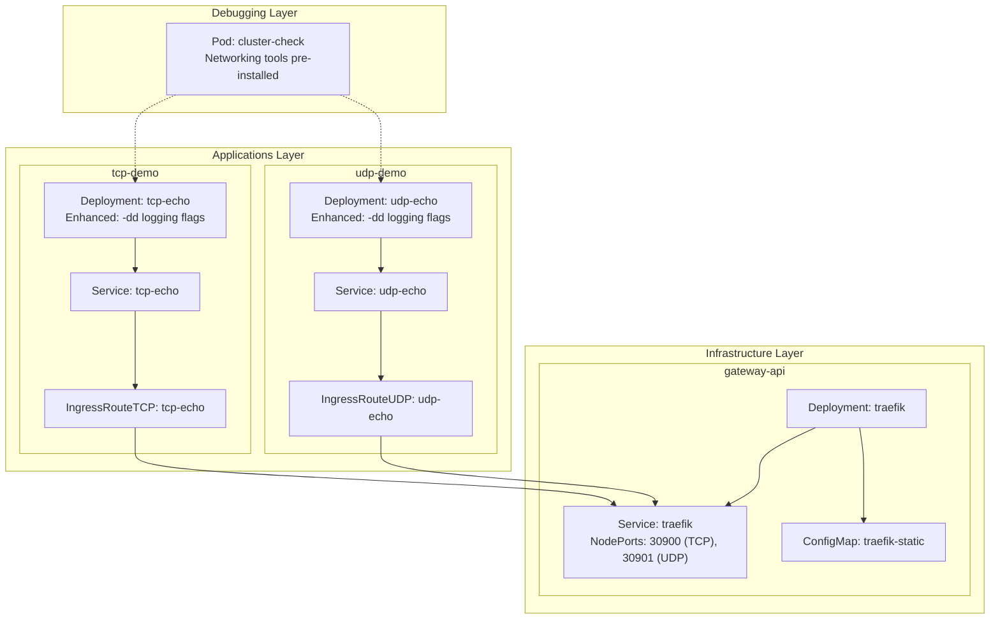
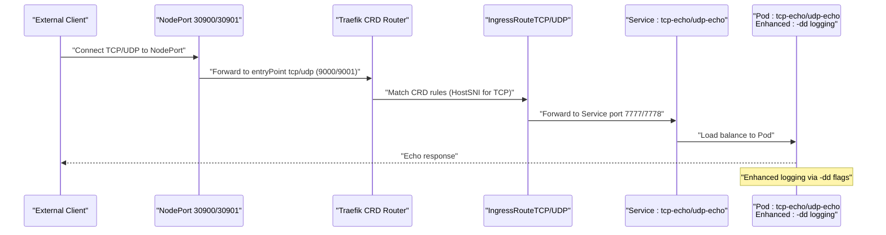
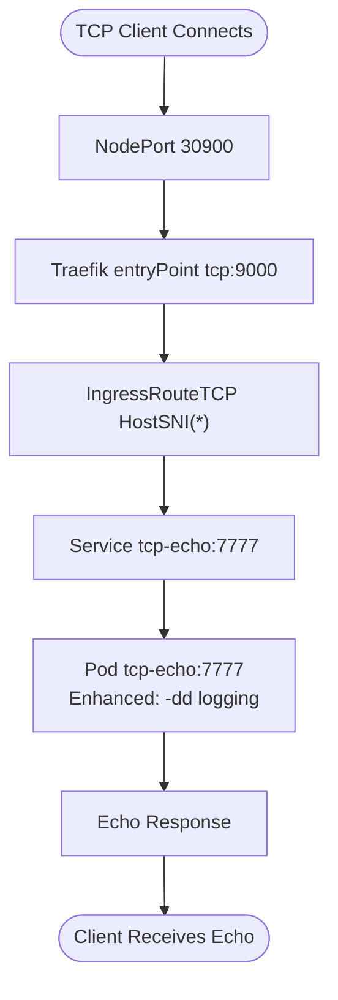
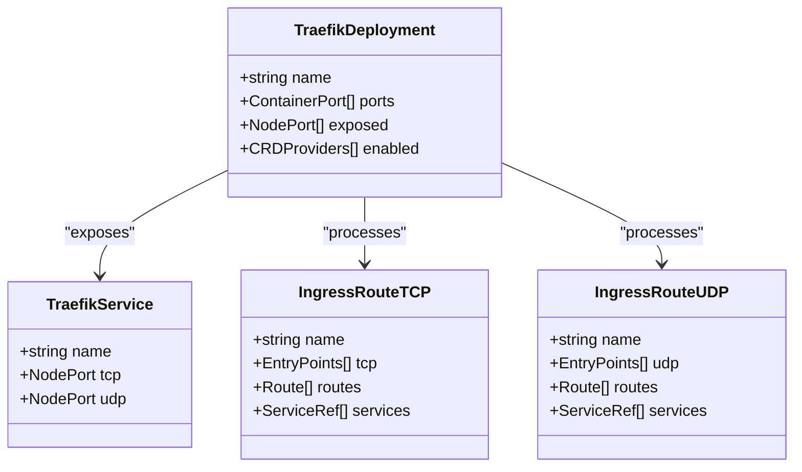
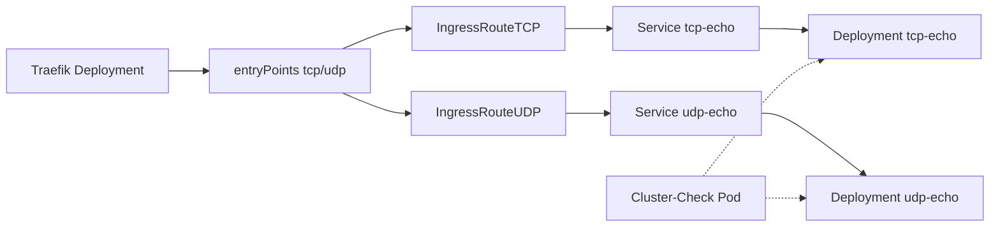

# TCP Echo Demo Application

<cite>
**Referenced Files in This Document**
- [deployment.yaml](file://apps/applications/tcp-demo/chart/deployment.yaml)
- [service.yaml](file://apps/applications/tcp-demo/chart/service.yaml)
- [ingressroutetcp.yaml](file://apps/applications/tcp-demo/chart/ingressroutetcp.yaml)
- [config.yaml](file://apps/applications/tcp-demo/config.yaml)
- [kustomization.yaml](file://apps/applications/tcp-demo/kustomization.yaml)
- [deployment.yaml](file://apps/applications/udp-demo/chart/deployment.yaml)
- [service.yaml](file://apps/applications/udp-demo/chart/service.yaml)
- [ingressrouteudp.yaml](file://apps/applications/udp-demo/chart/ingressrouteudp.yaml)
- [config.yaml](file://apps/applications/udp-demo/config.yaml)
- [kustomization.yaml](file://apps/applications/udp-demo/kustomization.yaml)
- [traefik.yaml](file://apps/infra/gateway-api/chart/traefik.yaml)
- [traefik-static.yaml](file://apps/infra/gateway-api/chart/traefik-static.yaml)
- [README.md](file://guide/tcp-udp-demo/README.md)
</cite>

## Update Summary
**Changes Made**
- Enhanced with cluster-check debugging workflow - added persistent debug jump pod with comprehensive networking tools
- Improved socat configurations with enhanced logging flags (-dd) for better debugging visibility
- Updated testing methodologies with multiple approaches including cluster-check, NodePort, and quick one-shot tests
- Strengthened troubleshooting guidance with protocol-specific considerations and observability verification steps

## Table of Contents
1. [Introduction](#introduction)
2. [Project Structure](#project-structure)
3. [Core Components](#core-components)
4. [Architecture Overview](#architecture-overview)
5. [Detailed Component Analysis](#detailed-component-analysis)
6. [Enhanced Debugging Workflow](#enhanced-debugging-workflow)
7. [Testing Methodologies](#testing-methodologies)
8. [Dependency Analysis](#dependency-analysis)
9. [Performance Considerations](#performance-considerations)
10. [Troubleshooting Guide](#troubleshooting-guide)
11. [Conclusion](#conclusion)

## Introduction
This document describes the TCP Echo Demo Application, a minimal demonstration of Layer 4 routing using Traefik's native CRD-based routing system. It deploys TCP and UDP echo services backed by socat and exposes them externally via Traefik's IngressRouteTCP and IngressRouteUDP resources. The application showcases direct CRD-to-service routing without requiring Gateway API infrastructure, making it more straightforward for Layer 4 traffic management. The guide includes comprehensive testing instructions, dashboard observation, and verification of access logs and metrics.

**Updated** Enhanced with cluster-check debugging workflow and improved socat configurations for better observability and troubleshooting capabilities.

## Project Structure
The TCP Echo Demo is organized as a Kustomize overlay that composes Kubernetes manifests for TCP and UDP echo applications. Each application consists of a Deployment, Service, and Traefik-native IngressRoute resource. The infrastructure layer provides a Traefik deployment with native CRD support and NodePort exposure for external access. A new cluster-check pod provides persistent debugging capabilities with comprehensive networking tools.



**Diagram sources**
- [deployment.yaml:19](file://apps/applications/tcp-demo/chart/deployment.yaml#L19)
- [deployment.yaml:19](file://apps/applications/udp-demo/chart/deployment.yaml#L19)
- [ingressroutetcp.yaml:14-20](file://apps/applications/tcp-demo/chart/ingressroutetcp.yaml#L14-L20)
- [ingressrouteudp.yaml:17-19](file://apps/applications/udp-demo/chart/ingressrouteudp.yaml#L17-L19)
- [traefik.yaml:135-143](file://apps/infra/gateway-api/chart/traefik.yaml#L135-L143)
- [traefik-static.yaml:1-66](file://apps/infra/gateway-api/chart/traefik-static.yaml#L1-L66)

**Section sources**
- [kustomization.yaml:1-8](file://apps/applications/tcp-demo/kustomization.yaml#L1-L8)
- [config.yaml:1-4](file://apps/applications/tcp-demo/config.yaml#L1-L4)
- [kustomization.yaml:1-8](file://apps/applications/udp-demo/kustomization.yaml#L1-L8)
- [config.yaml:1-4](file://apps/applications/udp-demo/config.yaml#L1-L4)

## Core Components
- TCP Echo Service
  - Deployment runs a single replica of socat listening on TCP port 7777 with fork/reuseaddr capabilities and enhanced debugging flags (-dd).
  - Service targets the Deployment with ClusterIP and port 7777.
  - IngressRouteTCP directly routes TCP traffic from Traefik's tcp entryPoint to the Service on port 7777.
- UDP Echo Service
  - Deployment runs a single replica of socat listening on UDP port 7778 with fork/reuseaddr capabilities and enhanced debugging flags (-dd).
  - Service targets the Deployment with ClusterIP and port 7778 (UDP).
  - IngressRouteUDP directly routes UDP traffic from Traefik's udp entryPoint to the Service on port 7778.
- Infrastructure
  - Traefik Deployment exposes NodePorts 30900 (TCP) and 30901 (UDP) for external access.
  - Traefik static configuration enables native CRD providers and defines entry points for tcp and udp protocols.
  - No Gateway API dependency - routing handled directly by Traefik's CRD controllers.
- Debugging Infrastructure
  - Cluster-check pod provides persistent debugging environment with comprehensive networking tools (curl, nc, telnet, dig, tcpdump).
  - Eliminates need for temporary debug pods and provides consistent debugging experience.

**Updated** Enhanced socat configurations with -dd flags for improved debugging visibility and added cluster-check pod for persistent debugging workflow.

**Section sources**
- [deployment.yaml:1-28](file://apps/applications/tcp-demo/chart/deployment.yaml#L1-L28)
- [service.yaml:1-14](file://apps/applications/tcp-demo/chart/service.yaml#L1-L14)
- [ingressroutetcp.yaml:1-21](file://apps/applications/tcp-demo/chart/ingressroutetcp.yaml#L1-L21)
- [deployment.yaml:1-29](file://apps/applications/udp-demo/chart/deployment.yaml#L1-L29)
- [service.yaml:1-15](file://apps/applications/udp-demo/chart/service.yaml#L1-L15)
- [ingressrouteudp.yaml:1-20](file://apps/applications/udp-demo/chart/ingressrouteudp.yaml#L1-L20)
- [traefik.yaml:1-147](file://apps/infra/gateway-api/chart/traefik.yaml#L1-L147)
- [traefik-static.yaml:1-66](file://apps/infra/gateway-api/chart/traefik-static.yaml#L1-L66)

## Architecture Overview
The TCP Echo Demo demonstrates Layer 4 routing using Traefik's native CRD-based approach with enhanced debugging capabilities:
- External client connects to NodePort 30900 (TCP) or 30901 (UDP).
- Traefik receives traffic on the appropriate entryPoint (tcp:9000 or udp:9001) and processes CRD rules.
- IngressRouteTCP/IngressRouteUDP directly match traffic patterns and forward to the respective Service.
- The Service load-balances to the Deployment pods running socat echo servers with enhanced logging.
- Cluster-check pod provides persistent debugging environment for troubleshooting.



**Diagram sources**
- [ingressroutetcp.yaml:14-20](file://apps/applications/tcp-demo/chart/ingressroutetcp.yaml#L14-L20)
- [ingressrouteudp.yaml:17-19](file://apps/applications/udp-demo/chart/ingressrouteudp.yaml#L17-L19)
- [service.yaml:7-13](file://apps/applications/tcp-demo/chart/service.yaml#L7-L13)
- [service.yaml:7-14](file://apps/applications/udp-demo/chart/service.yaml#L7-L14)
- [deployment.yaml:16-19](file://apps/applications/tcp-demo/chart/deployment.yaml#L16-L19)
- [deployment.yaml:16-19](file://apps/applications/udp-demo/chart/deployment.yaml#L16-L19)
- [traefik.yaml:135-143](file://apps/infra/gateway-api/chart/traefik.yaml#L135-L143)

## Detailed Component Analysis

### TCP Echo Application Stack
- Deployment
  - Container name: socat
  - Image: alpine/socat:latest
  - Arguments: Enhanced with -dd flags for debugging, TCP echo listener on 7777 with fork/reuseaddr and exec cat
  - Resources: CPU and memory requests/limits defined for lightweight workload
- Service
  - Type: ClusterIP
  - Selector: app=tcp-echo
  - Ports: name=tcp-echo, port=7777, targetPort=7777
- IngressRouteTCP
  - EntryPoints: tcp (directly from Traefik entryPoint)
  - Match: HostSNI(*) for flexible hostname handling
  - Services: tcp-echo port 7777
  - Annotation: sync wave 3 for proper sequencing



**Diagram sources**
- [ingressroutetcp.yaml:14-20](file://apps/applications/tcp-demo/chart/ingressroutetcp.yaml#L14-L20)
- [service.yaml:7-13](file://apps/applications/tcp-demo/chart/service.yaml#L7-L13)
- [deployment.yaml:16-19](file://apps/applications/tcp-demo/chart/deployment.yaml#L16-L19)

**Section sources**
- [deployment.yaml:1-28](file://apps/applications/tcp-demo/chart/deployment.yaml#L1-L28)
- [service.yaml:1-14](file://apps/applications/tcp-demo/chart/service.yaml#L1-L14)
- [ingressroutetcp.yaml:1-21](file://apps/applications/tcp-demo/chart/ingressroutetcp.yaml#L1-L21)
- [config.yaml:1-4](file://apps/applications/tcp-demo/config.yaml#L1-L4)
- [kustomization.yaml:1-8](file://apps/applications/tcp-demo/kustomization.yaml#L1-L8)

### UDP Echo Application Stack
- Deployment
  - Container name: socat
  - Image: alpine/socat:latest
  - Arguments: Enhanced with -dd flags for debugging, UDP echo listener on 7778 with fork/reuseaddr and exec cat
  - Resources: CPU and memory requests/limits defined for lightweight workload
- Service
  - Type: ClusterIP
  - Selector: app=udp-echo
  - Ports: name=udp-echo, port=7778, targetPort=7778 (UDP)
- IngressRouteUDP
  - EntryPoints: udp (directly from Traefik entryPoint)
  - Services: udp-echo port 7778
  - Annotation: sync wave 3 for proper sequencing

**Section sources**
- [deployment.yaml:1-29](file://apps/applications/udp-demo/chart/deployment.yaml#L1-L29)
- [service.yaml:1-15](file://apps/applications/udp-demo/chart/service.yaml#L1-L15)
- [ingressrouteudp.yaml:1-20](file://apps/applications/udp-demo/chart/ingressrouteudp.yaml#L1-L20)
- [config.yaml:1-4](file://apps/applications/udp-demo/config.yaml#L1-L4)
- [kustomization.yaml:1-8](file://apps/applications/udp-demo/kustomization.yaml#L1-L8)

### Traefik Infrastructure with Native CRD Support
- Traefik Deployment:
  - Container ports: 80 (web), 443 (websecure), 8080 (admin), 9000 (TCP), 9001 (UDP), 9082 (metrics)
  - NodePort Service exposing tcp:9000 (30900) and udp:9001 (30901)
  - Static config mounted via ConfigMap enabling native CRD providers
- CRD Providers:
  - IngressRouteTCP: handles TCP Layer 4 routing
  - IngressRouteUDP: handles UDP Layer 4 routing
  - No Gateway API dependency - direct CRD processing



**Diagram sources**
- [traefik.yaml:59-147](file://apps/infra/gateway-api/chart/traefik.yaml#L59-L147)
- [traefik-static.yaml:1-66](file://apps/infra/gateway-api/chart/traefik-static.yaml#L1-L66)
- [ingressroutetcp.yaml:6-20](file://apps/applications/tcp-demo/chart/ingressroutetcp.yaml#L6-L20)
- [ingressrouteudp.yaml:6-19](file://apps/applications/udp-demo/chart/ingressrouteudp.yaml#L6-L19)

**Section sources**
- [traefik.yaml:1-147](file://apps/infra/gateway-api/chart/traefik.yaml#L1-L147)
- [traefik-static.yaml:1-66](file://apps/infra/gateway-api/chart/traefik-static.yaml#L1-L66)

## Enhanced Debugging Workflow
The cluster-check debugging workflow provides a persistent, comprehensive debugging environment for testing and troubleshooting the TCP/UDP echo services:

### Cluster-Check Pod Features
- Persistent debugging environment with all essential networking tools pre-installed
- Comprehensive toolset: curl, nc (netcat), telnet, dig, tcpdump, nslookup, nmap
- Eliminates need for temporary debug pods and provides consistent debugging experience
- Ideal for repeated testing scenarios and complex troubleshooting workflows

### Execution Commands
```bash
# Access the cluster-check pod
kubectl exec -it -n cluster-check deploy/cluster-check -- bash

# Test TCP echo service
echo "hello" | nc tcp-echo.tcp-demo 7777

# Test UDP echo service  
echo "hello" | nc -u udp-echo.udp-demo 7778

# UDP first packet may be lost - run twice if needed
```

### Benefits Over Temporary Debug Pods
- No need to recreate debug pods for each test session
- Pre-configured tool availability eliminates setup overhead
- Persistent environment supports iterative debugging workflows
- Reduced resource consumption compared to multiple temporary pods

**Section sources**
- [README.md:18-50](file://guide/tcp-udp-demo/README.md#L18-L50)

## Testing Methodologies
Multiple testing approaches are available, each suited for different scenarios and environments:

### 1. Cluster-Check Testing (Recommended)
**Most reliable and comprehensive approach for development and debugging**

```bash
# Execute commands from within cluster-check pod
kubectl exec -it -n cluster-check deploy/cluster-check -- bash

# TCP testing
echo "hello" | nc tcp-echo.tcp-demo 7777

# UDP testing (first packet may be lost)
echo "hello" | nc -u udp-echo.udp-demo 7778
```

### 2. NodePort Testing (External Access)
**Direct external testing via cluster NodePorts**

```bash
# Get cluster node IP
NODE_IP=$(kubectl get nodes -o jsonpath='{.items[0].status.addresses[?(@.type=="InternalIP")].address}')

# TCP testing (Git Bash compatible)
echo "hello" | curl -s telnet://$NODE_IP:30900

# UDP testing (Python required)
python3 -c "import socket; s=socket.socket(socket.AF_INET,socket.SOCK_DGRAM); s.settimeout(3); s.sendto(b'hello',('$NODE_IP',30901)); print('Got:', s.recvfrom(1024)[0].decode())"
```

### 3. One-Shot Testing (Quick Verification)
**Rapid testing without cluster-check setup**

```bash
# TCP one-shot test
kubectl run -it --rm debug --image=nicolaka/netshoot -- bash -c "echo 'hello' | nc tcp-echo.tcp-demo 7777"

# UDP one-shot test
kubectl run -it --rm debug --image=nicolaka/netshoot -- bash -c "echo 'hello' | nc -u udp-echo.udp-demo 7778"
```

### Testing Protocol Considerations
- **TCP**: Uses telnet scheme with curl for Git Bash compatibility
- **UDP**: First packet may be lost during socat initialization - run commands twice
- **Logging**: Enhanced -dd flags in socat provide detailed connection information
- **Timeouts**: UDP operations should include appropriate timeout handling

**Section sources**
- [README.md:53-77](file://guide/tcp-udp-demo/README.md#L53-L77)
- [deployment.yaml:19](file://apps/applications/tcp-demo/chart/deployment.yaml#L19)
- [deployment.yaml:19](file://apps/applications/udp-demo/chart/deployment.yaml#L19)

## Dependency Analysis
- Sync ordering
  - Argo CD sync waves ensure proper sequencing: traefik (wave 0) → apps (wave 3) - Gateway API components are not required
- CRD-based routing chain
  - IngressRouteTCP/UDP → Service → Deployment → Pod
- Resource dependencies
  - Both applications share the same Traefik instance but use separate entryPoints and services
- Debugging dependencies
  - Cluster-check pod provides persistent debugging environment independent of application deployments



**Diagram sources**
- [traefik.yaml:135-143](file://apps/infra/gateway-api/chart/traefik.yaml#L135-L143)
- [ingressroutetcp.yaml:14-20](file://apps/applications/tcp-demo/chart/ingressroutetcp.yaml#L14-L20)
- [ingressrouteudp.yaml:17-19](file://apps/applications/udp-demo/chart/ingressrouteudp.yaml#L17-L19)

**Section sources**
- [ingressroutetcp.yaml:1-21](file://apps/applications/tcp-demo/chart/ingressroutetcp.yaml#L1-L21)
- [ingressrouteudp.yaml:1-20](file://apps/applications/udp-demo/chart/ingressrouteudp.yaml#L1-L20)
- [traefik.yaml:64-65](file://apps/infra/gateway-api/chart/traefik.yaml#L64-L65)
- [config.yaml:1-4](file://apps/applications/tcp-demo/config.yaml#L1-L4)
- [config.yaml:1-4](file://apps/applications/udp-demo/config.yaml#L1-L4)

## Performance Considerations
- Resource limits
  - Both tcp-demo and udp-demo pods define CPU and memory requests/limits suitable for lightweight echo workloads.
- Concurrency model
  - socat uses fork and reuseaddr, allowing concurrent connections per pod for both TCP and UDP protocols.
- Enhanced logging overhead
  - The -dd flags in socat provide detailed debugging information but may increase logging overhead.
- Observability
  - Access logs are emitted in JSON format and filtered for relevant status codes.
  - Prometheus metrics are exposed on the metrics endpoint for monitoring open connections and router statistics.

**Section sources**
- [deployment.yaml:22-27](file://apps/applications/tcp-demo/chart/deployment.yaml#L22-L27)
- [deployment.yaml:24-28](file://apps/applications/udp-demo/chart/deployment.yaml#L24-L28)
- [traefik.yaml:196-202](file://apps/infra/gateway-api/chart/traefik.yaml#L196-L202)

## Troubleshooting Guide
- No echo response
  - Verify NodePort connectivity to 30900 (TCP) and 30901 (UDP) and that Traefik is running.
  - Confirm IngressRouteTCP/UDP exists and matches entryPoints to the Service.
  - Check that socat pods are running and ready.
  - Use cluster-check pod for persistent debugging environment.
- Dashboard shows no routers
  - Ensure Argo CD sync waves completed and Traefik CRDs are installed.
  - Verify Traefik logs for CRD processing errors.
- Protocol-specific issues
  - TCP: Use curl with telnet scheme or netcat for testing
  - UDP: First packet may be lost during socat initialization, retry the command
  - Enhanced -dd logging flags provide detailed connection information for debugging
- Logs and metrics verification
  - Use kubectl logs to filter tcp/udp-related entries with enhanced debugging output.
  - Query Prometheus metrics endpoint for tcp/udp router and service metrics.
- Cluster-check debugging workflow
  - Access persistent debugging environment with comprehensive networking tools
  - Eliminates need for temporary debug pods and provides consistent testing experience

**Updated** Enhanced troubleshooting with cluster-check debugging workflow, improved socat logging capabilities, and multiple testing methodology options.

**Section sources**
- [README.md:115-142](file://guide/tcp-udp-demo/README.md#L115-L142)
- [traefik.yaml:196-202](file://apps/infra/gateway-api/chart/traefik.yaml#L196-L202)

## Conclusion
The TCP Echo Demo Application provides a concise example of Layer 4 routing using Traefik's native CRD-based approach with enhanced debugging capabilities. By combining simple socat-based echo services with Traefik's IngressRouteTCP and IngressRouteUDP resources, it demonstrates direct routing from external clients to Kubernetes Services and Pods without Gateway API dependencies. The enhanced cluster-check debugging workflow provides persistent debugging environment with comprehensive networking tools, while improved socat configurations offer better observability through enhanced logging. The included guide offers practical testing steps using multiple methodologies, dashboard inspection, and observability checks to validate correct operation of both TCP and UDP echo services.