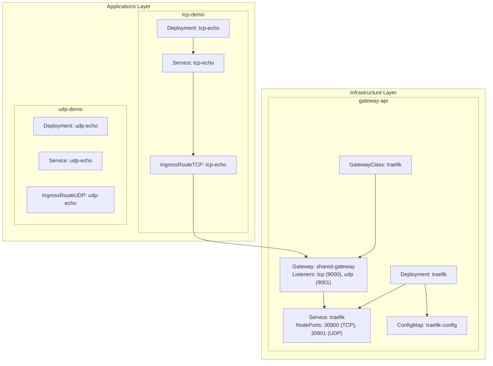
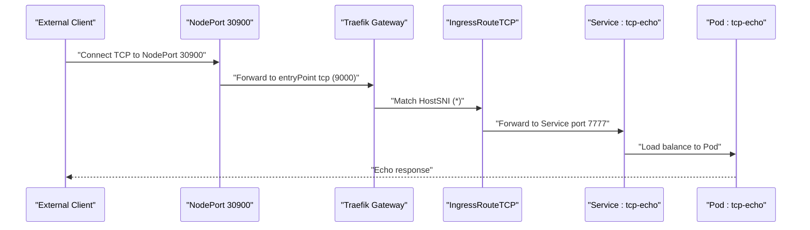
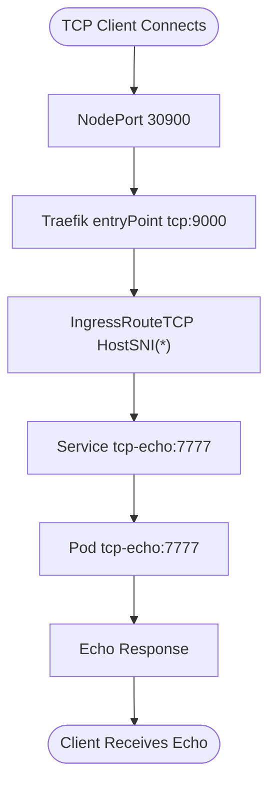
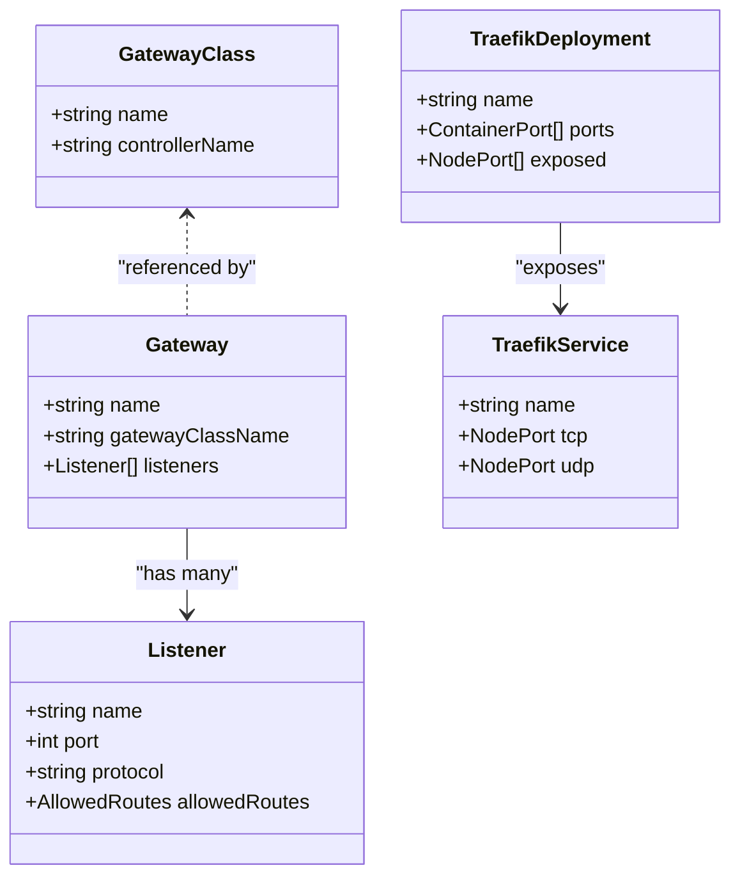
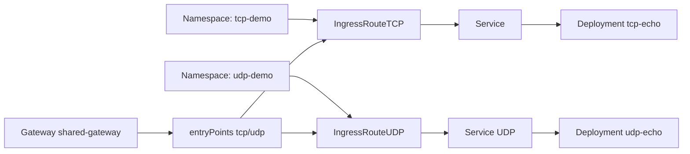

# TCP Echo Demo Application

<cite>
**Referenced Files in This Document**
- [deployment.yaml](file://apps/applications/tcp-demo/chart/deployment.yaml)
- [service.yaml](file://apps/applications/tcp-demo/chart/service.yaml)
- [ingressroutetcp.yaml](file://apps/applications/tcp-demo/chart/ingressroutetcp.yaml)
- [config.yaml](file://apps/applications/tcp-demo/config.yaml)
- [kustomization.yaml](file://apps/applications/tcp-demo/kustomization.yaml)
- [deployment.yaml](file://apps/applications/udp-demo/chart/deployment.yaml)
- [service.yaml](file://apps/applications/udp-demo/chart/service.yaml)
- [ingressrouteudp.yaml](file://apps/applications/udp-demo/chart/ingressrouteudp.yaml)
- [config.yaml](file://apps/applications/udp-demo/config.yaml)
- [kustomization.yaml](file://apps/applications/udp-demo/kustomization.yaml)
- [gateway.yaml](file://apps/infra/gateway-api/chart/gateway.yaml)
- [gatewayclass.yaml](file://apps/infra/gateway-api/chart/gatewayclass.yaml)
- [traefik.yaml](file://apps/infra/gateway-api/chart/traefik.yaml)
- [traefik-config.yaml](file://apps/infra/gateway-api/chart/traefik-config.yaml)
- [README.md](file://guide/tcp-udp-demo/README.md)
</cite>

## Table of Contents
1. [Introduction](#introduction)
2. [Project Structure](#project-structure)
3. [Core Components](#core-components)
4. [Architecture Overview](#architecture-overview)
5. [Detailed Component Analysis](#detailed-component-analysis)
6. [Dependency Analysis](#dependency-analysis)
7. [Performance Considerations](#performance-considerations)
8. [Troubleshooting Guide](#troubleshooting-guide)
9. [Conclusion](#conclusion)

## Introduction
This document describes the TCP Echo Demo Application, a minimal demonstration of Layer 4 routing using Traefik Gateway API. It deploys a TCP echo service backed by socat and exposes it externally via a Gateway TCP listener and NodePort. The guide includes testing instructions, dashboard observation, and verification of access logs and metrics.

## Project Structure
The TCP Echo Demo is organized as a Kustomize overlay that composes Kubernetes manifests for a Deployment, Service, and IngressRouteTCP. It is placed under the applications layer alongside a similar UDP demo. The infrastructure layer provides a shared Gateway with TCP/UDP listeners and a Traefik implementation configured for Gateway API.

**Diagram sources**
- [deployment.yaml:1-28](file://apps/applications/tcp-demo/chart/deployment.yaml#L1-L28)
- [service.yaml:1-14](file://apps/applications/tcp-demo/chart/service.yaml#L1-L14)
- [ingressroutetcp.yaml:1-21](file://apps/applications/tcp-demo/chart/ingressroutetcp.yaml#L1-L21)
- [gateway.yaml:1-51](file://apps/infra/gateway-api/chart/gateway.yaml#L1-L51)
- [gatewayclass.yaml:1-10](file://apps/infra/gateway-api/chart/gatewayclass.yaml#L1-L10)
- [traefik.yaml:1-144](file://apps/infra/gateway-api/chart/traefik.yaml#L1-L144)
- [traefik-config.yaml:1-66](file://apps/infra/gateway-api/chart/traefik-config.yaml#L1-L66)

**Section sources**
- [kustomization.yaml:1-8](file://apps/applications/tcp-demo/kustomization.yaml#L1-L8)
- [config.yaml:1-4](file://apps/applications/tcp-demo/config.yaml#L1-L4)
- [kustomization.yaml:1-8](file://apps/applications/udp-demo/kustomization.yaml#L1-L8)
- [config.yaml:1-4](file://apps/applications/udp-demo/config.yaml#L1-L4)

## Core Components
- TCP Echo Service
  - Deployment runs a single replica of socat listening on TCP port 7777.
  - Service targets the Deployment with ClusterIP and port 7777.
  - IngressRouteTCP matches any SNI host and forwards to the Service on port 7777.
- Infrastructure
  - GatewayClass defines the Traefik controller.
  - Gateway exposes TCP and UDP listeners on ports 9000 and 9001 respectively.
  - Traefik Deployment mounts static configuration and exposes NodePorts 30900 (TCP) and 30901 (UDP).
  - Traefik static config enables Gateway CRD provider and defines entry points for web, websecure, tcp, udp, and metrics.

**Section sources**
- [deployment.yaml:1-28](file://apps/applications/tcp-demo/chart/deployment.yaml#L1-L28)
- [service.yaml:1-14](file://apps/applications/tcp-demo/chart/service.yaml#L1-L14)
- [ingressroutetcp.yaml:1-21](file://apps/applications/tcp-demo/chart/ingressroutetcp.yaml#L1-L21)
- [gatewayclass.yaml:1-10](file://apps/infra/gateway-api/chart/gatewayclass.yaml#L1-L10)
- [gateway.yaml:1-51](file://apps/infra/gateway-api/chart/gateway.yaml#L1-L51)
- [traefik.yaml:1-144](file://apps/infra/gateway-api/chart/traefik.yaml#L1-L144)
- [traefik-config.yaml:1-66](file://apps/infra/gateway-api/chart/traefik-config.yaml#L1-L66)

## Architecture Overview
The TCP Echo Demo demonstrates Layer 4 routing from external clients to the tcp-echo service:
- External client connects to NodePort 30900.
- Traefik Gateway receives TCP traffic on entry point tcp (port 9000) and forwards to the IngressRouteTCP route.
- The route resolves to the tcp-echo Service on port 7777.
- The Deployment pod responds with an echo of the received data.

**Diagram sources**
- [ingressroutetcp.yaml:1-21](file://apps/applications/tcp-demo/chart/ingressroutetcp.yaml#L1-L21)
- [service.yaml:1-14](file://apps/applications/tcp-demo/chart/service.yaml#L1-L14)
- [deployment.yaml:1-28](file://apps/applications/tcp-demo/chart/deployment.yaml#L1-L28)
- [traefik.yaml:117-140](file://apps/infra/gateway-api/chart/traefik.yaml#L117-L140)
- [gateway.yaml:34-42](file://apps/infra/gateway-api/chart/gateway.yaml#L34-L42)

## Detailed Component Analysis

### TCP Echo Application Stack
- Deployment
  - Container name: socat
  - Image: alpine/socat
  - Arguments: TCP echo listener on 7777 with fork/reuseaddr and exec cat
  - Resources: CPU and memory requests/limits defined
- Service
  - Type: ClusterIP
  - Selector: app=tcp-echo
  - Ports: name=tcp-echo, port=7777, targetPort=7777
- IngressRouteTCP
  - EntryPoints: tcp
  - Match: HostSNI(*)
  - Services: tcp-echo port 7777
  - Annotation: sync wave 3

**Diagram sources**
- [ingressroutetcp.yaml:14-20](file://apps/applications/tcp-demo/chart/ingressroutetcp.yaml#L14-L20)
- [service.yaml:7-13](file://apps/applications/tcp-demo/chart/service.yaml#L7-L13)
- [deployment.yaml:16-19](file://apps/applications/tcp-demo/chart/deployment.yaml#L16-L19)

**Section sources**
- [deployment.yaml:1-28](file://apps/applications/tcp-demo/chart/deployment.yaml#L1-L28)
- [service.yaml:1-14](file://apps/applications/tcp-demo/chart/service.yaml#L1-L14)
- [ingressroutetcp.yaml:1-21](file://apps/applications/tcp-demo/chart/ingressroutetcp.yaml#L1-L21)
- [config.yaml:1-4](file://apps/applications/tcp-demo/config.yaml#L1-L4)
- [kustomization.yaml:1-8](file://apps/applications/tcp-demo/kustomization.yaml#L1-L8)

### UDP Echo Application Stack (Reference)
- Deployment: socat UDP echo on 7778
- Service: ClusterIP UDP port 7778
- IngressRouteUDP: entryPoint udp, service port 7778
- Namespace: udp-demo

**Section sources**
- [deployment.yaml:1-29](file://apps/applications/udp-demo/chart/deployment.yaml#L1-L29)
- [service.yaml:1-15](file://apps/applications/udp-demo/chart/service.yaml#L1-L15)
- [ingressrouteudp.yaml:1-20](file://apps/applications/udp-demo/chart/ingressrouteudp.yaml#L1-L20)
- [config.yaml:1-4](file://apps/applications/udp-demo/config.yaml#L1-L4)
- [kustomization.yaml:1-8](file://apps/applications/udp-demo/kustomization.yaml#L1-L8)

### Gateway and Traefik Infrastructure
- GatewayClass: defines controllerName "traefik.io/gateway-controller"
- Gateway: shared-gateway with listeners:
  - http:80, https:443 (TLS terminate)
  - tcp:9000, udp:9001
  - Allowed routes from namespaces labeled with routing.hoangvu75.space/expose=true
- Traefik Deployment:
  - Container ports: 80, 443, 8080, 9000 (TCP), 9001 (UDP), 9082 (metrics)
  - NodePort Service exposing tcp:9000 (30900) and udp:9001 (30901)
  - Static config mounted via ConfigMap enabling Gateway CRD provider and entryPoints

**Diagram sources**
- [gatewayclass.yaml:1-10](file://apps/infra/gateway-api/chart/gatewayclass.yaml#L1-L10)
- [gateway.yaml:1-51](file://apps/infra/gateway-api/chart/gateway.yaml#L1-L51)
- [traefik.yaml:56-144](file://apps/infra/gateway-api/chart/traefik.yaml#L56-L144)

**Section sources**
- [gatewayclass.yaml:1-10](file://apps/infra/gateway-api/chart/gatewayclass.yaml#L1-L10)
- [gateway.yaml:1-51](file://apps/infra/gateway-api/chart/gateway.yaml#L1-L51)
- [traefik.yaml:1-144](file://apps/infra/gateway-api/chart/traefik.yaml#L1-L144)
- [traefik-config.yaml:1-66](file://apps/infra/gateway-api/chart/traefik-config.yaml#L1-L66)

## Dependency Analysis
- Namespace scoping
  - tcp-demo and udp-demo namespaces must be labeled to allow routes from shared-gateway.
- Sync ordering
  - Argo CD sync waves ensure proper sequencing: traefik (wave 0) → gateway-class (wave 1) → gateway (wave 2) → apps (wave 3).
- Routing chain
  - IngressRouteTCP → Service → Deployment → Pod

**Diagram sources**
- [ingressroutetcp.yaml:1-21](file://apps/applications/tcp-demo/chart/ingressroutetcp.yaml#L1-L21)
- [ingressrouteudp.yaml:1-20](file://apps/applications/udp-demo/chart/ingressrouteudp.yaml#L1-L20)
- [gateway.yaml:14-42](file://apps/infra/gateway-api/chart/gateway.yaml#L14-L42)

**Section sources**
- [ingressroutetcp.yaml:1-21](file://apps/applications/tcp-demo/chart/ingressroutetcp.yaml#L1-L21)
- [ingressrouteudp.yaml:1-20](file://apps/applications/udp-demo/chart/ingressrouteudp.yaml#L1-L20)
- [gateway.yaml:14-42](file://apps/infra/gateway-api/chart/gateway.yaml#L14-L42)
- [config.yaml:1-4](file://apps/applications/tcp-demo/config.yaml#L1-L4)
- [config.yaml:1-4](file://apps/applications/udp-demo/config.yaml#L1-L4)

## Performance Considerations
- Resource limits
  - Both tcp-demo and udp-demo pods define CPU and memory requests/limits suitable for lightweight echo workloads.
- Concurrency model
  - socat uses fork and reuseaddr, allowing concurrent connections per pod.
- Observability
  - Access logs are emitted in JSON format and filtered for relevant status codes.
  - Prometheus metrics are exposed on the metrics endpoint for monitoring open connections and router statistics.

**Section sources**
- [deployment.yaml:22-27](file://apps/applications/tcp-demo/chart/deployment.yaml#L22-L27)
- [deployment.yaml:23-28](file://apps/applications/udp-demo/chart/deployment.yaml#L23-L28)
- [traefik-config.yaml:47-65](file://apps/infra/gateway-api/chart/traefik-config.yaml#L47-L65)
- [traefik.yaml:101-107](file://apps/infra/gateway-api/chart/traefik.yaml#L101-L107)

## Troubleshooting Guide
- No echo response
  - Verify NodePort connectivity to 30900 and that the Gateway listener accepts routes from the namespace.
  - Confirm IngressRouteTCP exists and matches HostSNI(*) to the Service.
- Dashboard shows no routers
  - Ensure Argo CD sync waves completed and Gateway CRDs are installed.
  - Check Traefik logs for discovery errors.
- Logs and metrics verification
  - Use kubectl logs to filter tcp-related entries.
  - Query Prometheus metrics endpoint for tcp router and service metrics.

**Section sources**
- [README.md:115-184](file://guide/tcp-udp-demo/README.md#L115-L184)
- [traefik.yaml:117-140](file://apps/infra/gateway-api/chart/traefik.yaml#L117-L140)
- [traefik-config.yaml:40-65](file://apps/infra/gateway-api/chart/traefik-config.yaml#L40-L65)

## Conclusion
The TCP Echo Demo Application provides a concise example of Layer 4 routing with Traefik Gateway API. By combining a simple socat-based echo service with a Gateway TCP listener and NodePort exposure, it demonstrates end-to-end forwarding from external clients to a Kubernetes Service and Pod. The included guide offers practical testing steps, dashboard inspection, and observability checks to validate correct operation.