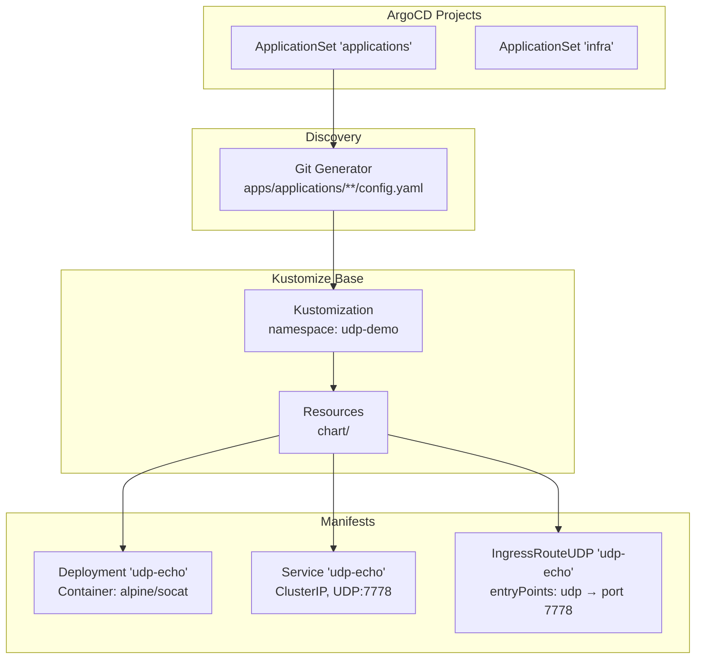
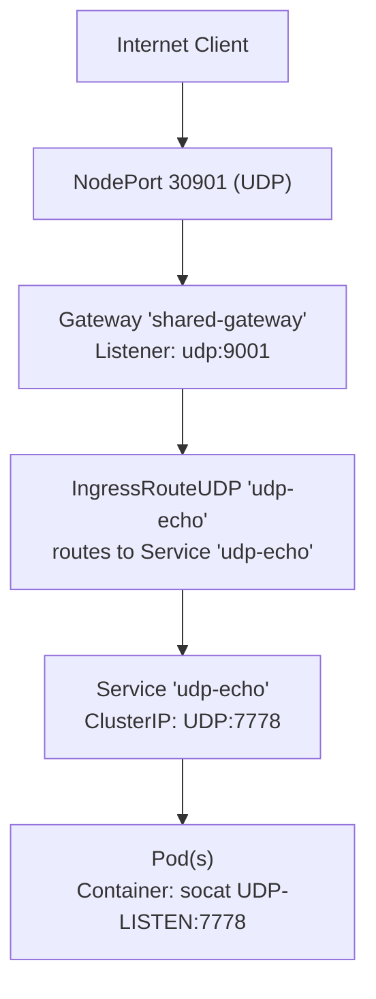
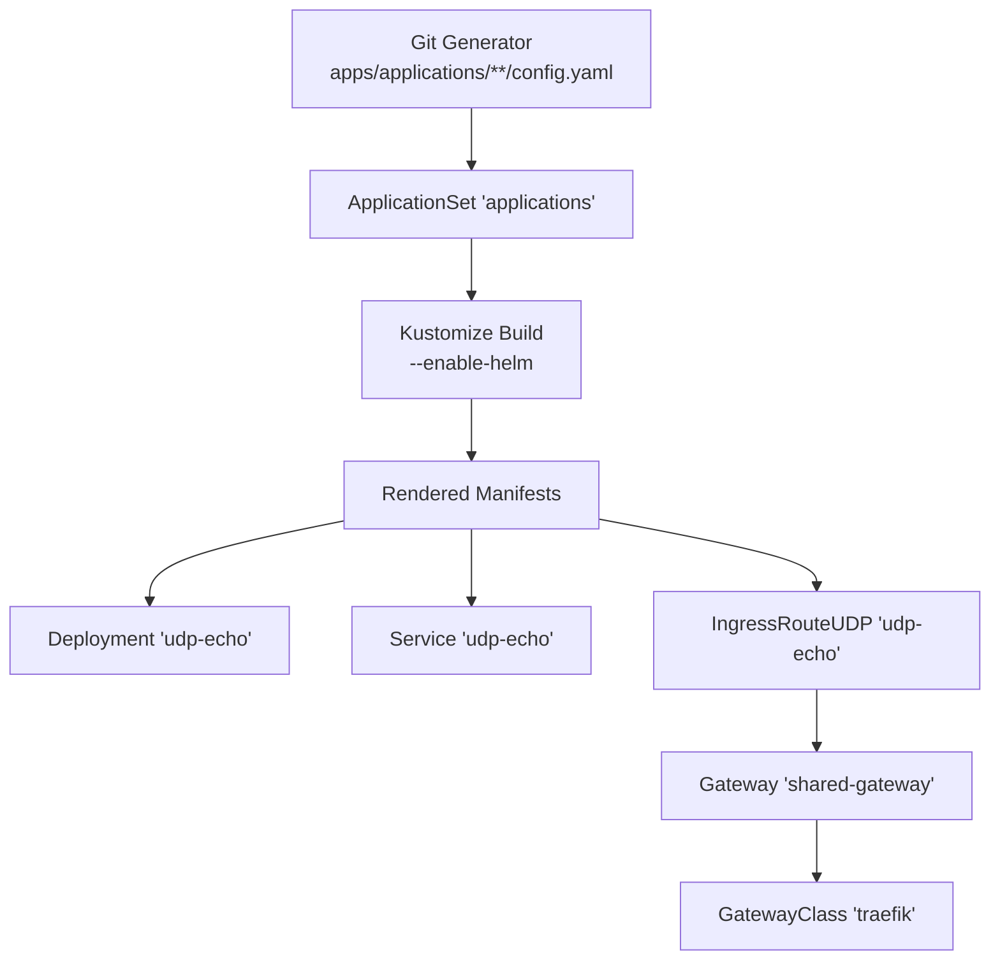

# UDP Echo Demo Application

<cite>
**Referenced Files in This Document**
- [ingressrouteudp.yaml](file://apps/applications/udp-demo/chart/ingressrouteudp.yaml)
- [service.yaml](file://apps/applications/udp-demo/chart/service.yaml)
- [deployment.yaml](file://apps/applications/udp-demo/chart/deployment.yaml)
- [config.yaml](file://apps/applications/udp-demo/config.yaml)
- [kustomization.yaml](file://apps/applications/udp-demo/kustomization.yaml)
- [ingressroutetcp.yaml](file://apps/applications/tcp-demo/chart/ingressroutetcp.yaml)
- [gateway.yaml](file://apps/infra/gateway-api/chart/gateway.yaml)
- [gatewayclass.yaml](file://apps/infra/gateway-api/chart/gatewayclass.yaml)
- [README.md](file://guide/tcp-udp-demo/README.md)
- [README.md](file://README.md)
- [applications.yaml](file://projects/applications.yaml)
- [infra.yaml](file://projects/infra.yaml)
</cite>

## Table of Contents
1. [Introduction](#introduction)
2. [Project Structure](#project-structure)
3. [Core Components](#core-components)
4. [Architecture Overview](#architecture-overview)
5. [Detailed Component Analysis](#detailed-component-analysis)
6. [Dependency Analysis](#dependency-analysis)
7. [Performance Considerations](#performance-considerations)
8. [Troubleshooting Guide](#troubleshooting-guide)
9. [Conclusion](#conclusion)

## Introduction
This document describes the UDP Echo Demo Application, a demonstration of Traefik's Layer 4 routing capabilities using the Gateway API. The demo deploys a UDP echo service backed by a simple container that listens on a UDP port and echoes received packets back to clients. It is designed to be tested via NodePort and verified through the Traefik dashboard and metrics.

The application follows a GitOps workflow using ArgoCD, Kustomize, and Helm. It leverages the shared Gateway infrastructure to route UDP traffic from the cluster's entry points to the demo service.

## Project Structure
The UDP Echo Demo is organized as a standard ArgoCD application with a Kustomize base that renders Kubernetes manifests. The application is discovered and deployed by ApplicationSets defined in the projects configuration.

**Diagram sources**
- [applications.yaml:33-58](file://projects/applications.yaml#L33-L58)
- [kustomization.yaml:1-8](file://apps/applications/udp-demo/kustomization.yaml#L1-L8)
- [deployment.yaml:1-29](file://apps/applications/udp-demo/chart/deployment.yaml#L1-L29)
- [service.yaml:1-15](file://apps/applications/udp-demo/chart/service.yaml#L1-L15)
- [ingressrouteudp.yaml:1-20](file://apps/applications/udp-demo/chart/ingressrouteudp.yaml#L1-L20)

**Section sources**
- [README.md:106-119](file://README.md#L106-L119)
- [applications.yaml:33-58](file://projects/applications.yaml#L33-L58)
- [kustomization.yaml:1-8](file://apps/applications/udp-demo/kustomization.yaml#L1-L8)

## Core Components
The UDP Echo Demo consists of three primary Kubernetes resources:

- Deployment: Runs a container that listens on UDP port 7778 and echoes incoming packets back to clients.
- Service: Exposes the Deployment internally as a ClusterIP service on UDP port 7778.
- IngressRouteUDP: Routes inbound UDP traffic from the Gateway's UDP entry point to the Service.

These components work together to provide a simple UDP echo service accessible via NodePort 30901.

**Section sources**
- [deployment.yaml:1-29](file://apps/applications/udp-demo/chart/deployment.yaml#L1-L29)
- [service.yaml:1-15](file://apps/applications/udp-demo/chart/service.yaml#L1-L15)
- [ingressrouteudp.yaml:1-20](file://apps/applications/udp-demo/chart/ingressrouteudp.yaml#L1-L20)

## Architecture Overview
The UDP Echo Demo integrates with the shared Gateway infrastructure to route Layer 4 UDP traffic. Clients connect to Traefik via NodePort 30901, which is handled by the Gateway's UDP listener. The IngressRouteUDP selects the appropriate backend service, and the Service targets the Deployment pods.

**Diagram sources**
- [gateway.yaml:43-51](file://apps/infra/gateway-api/chart/gateway.yaml#L43-L51)
- [ingressrouteudp.yaml:14-20](file://apps/applications/udp-demo/chart/ingressrouteudp.yaml#L14-L20)
- [service.yaml:7-15](file://apps/applications/udp-demo/chart/service.yaml#L7-L15)
- [deployment.yaml:17-22](file://apps/applications/udp-demo/chart/deployment.yaml#L17-L22)

## Detailed Component Analysis

### Deployment: UDP Echo Pod
The Deployment runs a single replica of a container that listens on UDP port 7778 using socat. The container configuration ensures the pod receives and echoes UDP packets. Resource requests and limits are set to constrain CPU and memory usage.

Key characteristics:
- Container image: alpine/socat
- Listen port: 7778 (UDP)
- Arguments: socat UDP-LISTEN with fork and reuseaddr
- Resources: requests and limits defined

**Section sources**
- [deployment.yaml:17-29](file://apps/applications/udp-demo/chart/deployment.yaml#L17-L29)

### Service: ClusterIP Exposure
The Service exposes the Deployment internally as a ClusterIP service. It matches pods labeled with app=udp-echo and forwards traffic to UDP port 7778.

Key characteristics:
- Type: ClusterIP
- Selector: app=udp-echo
- Ports: name=udp-echo, port=7778, targetPort=7778, protocol=UDP

**Section sources**
- [service.yaml:7-15](file://apps/applications/udp-demo/chart/service.yaml#L7-L15)

### IngressRouteUDP: UDP Routing
The IngressRouteUDP binds the Gateway's UDP entry point to the Service. It specifies the entryPoints and routes traffic to the Service named udp-echo on port 7778.

Key characteristics:
- Kind: IngressRouteUDP
- entryPoints: udp
- routes.services: udp-echo port 7778
- Annotation: sync-wave 3 for ordering

**Section sources**
- [ingressrouteudp.yaml:14-20](file://apps/applications/udp-demo/chart/ingressrouteudp.yaml#L14-L20)

### Gateway and GatewayClass: Infrastructure
The shared Gateway defines listeners for HTTP, HTTPS, TCP, and UDP protocols. The GatewayClass identifies the Traefik controller responsible for managing Gateway resources. Together, they enable Layer 4 routing for the UDP demo.

Key characteristics:
- Gateway 'shared-gateway' listeners: http(:80), https(:443), tcp(:9000), udp(:9001)
- GatewayClass 'traefik' controller: traefik.io/gateway-controller

**Section sources**
- [gateway.yaml:10-51](file://apps/infra/gateway-api/chart/gateway.yaml#L10-L51)
- [gatewayclass.yaml:1-10](file://apps/infra/gateway-api/chart/gatewayclass.yaml#L1-L10)

### Comparison with TCP Demo
The TCP demo demonstrates equivalent behavior for TCP traffic. Both demos share the same Gateway infrastructure and follow the same sync-wave ordering to ensure proper resource creation order.

Key characteristics:
- TCP demo: IngressRouteTCP routes to Service 'tcp-echo' port 7777
- UDP demo: IngressRouteUDP routes to Service 'udp-echo' port 7778
- Both use sync-wave 3 for ordering

**Section sources**
- [ingressroutetcp.yaml:14-21](file://apps/applications/tcp-demo/chart/ingressroutetcp.yaml#L14-L21)
- [ingressrouteudp.yaml:14-20](file://apps/applications/udp-demo/chart/ingressrouteudp.yaml#L14-L20)

## Dependency Analysis
The UDP Echo Demo depends on the shared Gateway infrastructure and ApplicationSet discovery. The following diagram shows the dependency chain from discovery to manifest rendering and resource creation.

**Diagram sources**
- [applications.yaml:33-58](file://projects/applications.yaml#L33-L58)
- [kustomization.yaml:4-7](file://apps/applications/udp-demo/kustomization.yaml#L4-L7)
- [ingressrouteudp.yaml:1-20](file://apps/applications/udp-demo/chart/ingressrouteudp.yaml#L1-L20)
- [gateway.yaml:1-51](file://apps/infra/gateway-api/chart/gateway.yaml#L1-L51)
- [gatewayclass.yaml:1-10](file://apps/infra/gateway-api/chart/gatewayclass.yaml#L1-L10)

**Section sources**
- [applications.yaml:33-58](file://projects/applications.yaml#L33-L58)
- [kustomization.yaml:4-7](file://apps/applications/udp-demo/kustomization.yaml#L4-L7)
- [README.md:76-86](file://README.md#L76-L86)

## Performance Considerations
- UDP is connectionless, which can cause the first packet to be dropped during listener initialization. Sending a few test messages helps mitigate this.
- The Deployment runs a single replica. For production scenarios, consider scaling the Deployment to increase availability and throughput.
- Resource limits are set to constrain memory usage. Monitor pod resource consumption during load testing.

[No sources needed since this section provides general guidance]

## Troubleshooting Guide
Common verification steps and diagnostics for the UDP Echo Demo:

- Verify Gateway readiness and listeners:
  - Confirm the Gateway 'shared-gateway' exists and has UDP listener enabled.
  - Ensure the GatewayClass 'traefik' is present and recognized by the controller.

- Validate IngressRouteUDP:
  - Check that the IngressRouteUDP 'udp-echo' exists in the udp-demo namespace.
  - Confirm entryPoints includes 'udp' and routes to the correct Service and port.

- Test connectivity:
  - From outside the cluster, use a UDP client to send messages to NodePort 30901.
  - From inside the cluster, use a pod to send UDP messages to udp-echo.udp-demo:7778.

- Observe Traefik dashboard:
  - Navigate to the Traefik dashboard to confirm the UDP router and backend service appear after sync completes.

- Review metrics and logs:
  - Use kubectl logs on the Traefik deployment to inspect access logs for UDP traffic.
  - Query Prometheus metrics endpoints for Traefik to verify router and service metrics.

**Section sources**
- [README.md:115-184](file://guide/tcp-udp-demo/README.md#L115-L184)
- [ingressrouteudp.yaml:1-20](file://apps/applications/udp-demo/chart/ingressrouteudp.yaml#L1-L20)
- [gateway.yaml:43-51](file://apps/infra/gateway-api/chart/gateway.yaml#L43-L51)

## Conclusion
The UDP Echo Demo Application demonstrates Traefik's Layer 4 routing capabilities using the Gateway API. By leveraging a shared Gateway with UDP listeners, the demo provides a straightforward UDP echo service accessible via NodePort. The GitOps workflow ensures predictable deployments through ArgoCD, Kustomize, and Helm, with clear ordering guarantees to maintain reliable routing.