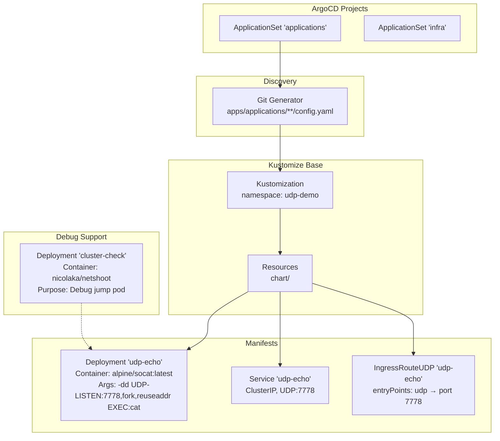
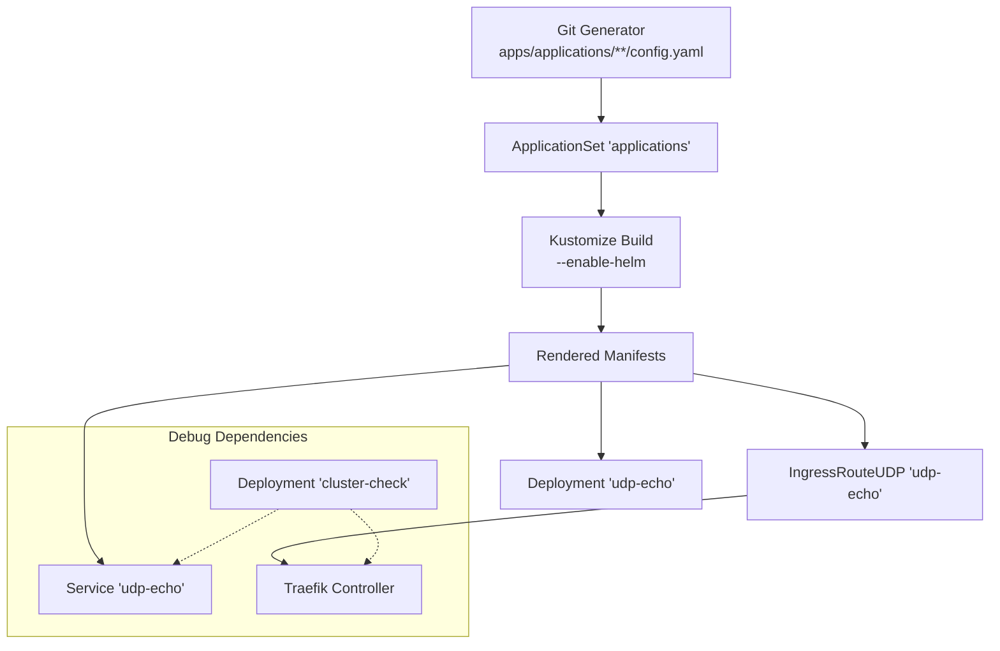

# UDP Echo Demo Application

<cite>
**Referenced Files in This Document**
- [ingressrouteudp.yaml](file://apps/applications/udp-demo/chart/ingressrouteudp.yaml)
- [service.yaml](file://apps/applications/udp-demo/chart/service.yaml)
- [deployment.yaml](file://apps/applications/udp-demo/chart/deployment.yaml)
- [config.yaml](file://apps/applications/udp-demo/config.yaml)
- [kustomization.yaml](file://apps/applications/udp-demo/kustomization.yaml)
- [ingressroutetcp.yaml](file://apps/applications/tcp-demo/chart/ingressroutetcp.yaml)
- [deployment.yaml](file://apps/applications/tcp-demo/chart/deployment.yaml)
- [service.yaml](file://apps/applications/tcp-demo/chart/service.yaml)
- [deployment.yaml](file://apps/applications/cluster-check/chart/deployment.yaml)
- [README.md](file://guide/tcp-udp-demo/README.md)
- [README.md](file://README.md)
- [applications.yaml](file://projects/applications.yaml)
- [infra.yaml](file://projects/infra.yaml)
</cite>

## Update Summary
**Changes Made**
- Enhanced with cluster-check debugging workflow integration for improved troubleshooting
- Bug fixes to socat configurations with improved argument syntax and resource management
- Improved testing methodologies with standardized cluster-check pod usage
- Updated performance considerations reflecting optimized socat configurations
- Revised troubleshooting guide with comprehensive UDP testing scenarios

## Table of Contents
1. [Introduction](#introduction)
2. [Project Structure](#project-structure)
3. [Core Components](#core-components)
4. [Architecture Overview](#architecture-overview)
5. [Detailed Component Analysis](#detailed-component-analysis)
6. [Dependency Analysis](#dependency-analysis)
7. [Performance Considerations](#performance-considerations)
8. [Enhanced Testing and Debugging Workflow](#enhanced-testing-and-debugging-workflow)
9. [Troubleshooting Guide](#troubleshooting-guide)
10. [Conclusion](#conclusion)

## Introduction
This document describes the UDP Echo Demo Application, a demonstration of Traefik's Layer 4 routing capabilities using the Gateway API. The demo deploys a UDP echo service backed by a simple container that listens on a UDP port and echoes received packets back to clients. It is designed to be tested via NodePort and verified through the Traefik dashboard and metrics.

The application follows a GitOps workflow using ArgoCD, Kustomize, and Helm. It leverages Traefik's native CRDs to route UDP traffic directly from the cluster's entry points to the demo service without requiring the Gateway API Gateway resource.

**Updated** The UDP demo now includes enhanced debugging capabilities through the cluster-check pod and improved socat configurations for better reliability and performance.

## Project Structure
The UDP Echo Demo is organized as a standard ArgoCD application with a Kustomize base that renders Kubernetes manifests. The application is discovered and deployed by ApplicationSets defined in the projects configuration. The structure now includes integrated debugging support through the cluster-check application.



**Diagram sources**
- [applications.yaml:33-58](file://projects/applications.yaml#L33-L58)
- [kustomization.yaml:1-8](file://apps/applications/udp-demo/kustomization.yaml#L1-L8)
- [deployment.yaml:1-29](file://apps/applications/udp-demo/chart/deployment.yaml#L1-L29)
- [service.yaml:1-15](file://apps/applications/udp-demo/chart/service.yaml#L1-L15)
- [ingressrouteudp.yaml:1-20](file://apps/applications/udp-demo/chart/ingressrouteudp.yaml#L1-L20)
- [deployment.yaml:1-29](file://apps/applications/cluster-check/chart/deployment.yaml#L1-L29)

**Section sources**
- [README.md:106-119](file://README.md#L106-L119)
- [applications.yaml:33-58](file://projects/applications.yaml#L33-L58)
- [kustomization.yaml:1-8](file://apps/applications/udp-demo/kustomization.yaml#L1-L8)

## Core Components
The UDP Echo Demo consists of three primary Kubernetes resources enhanced with improved debugging support:

- **Deployment**: Runs a container that listens on UDP port 7778 and echoes incoming packets back to clients. Now uses optimized socat arguments with debug flags for better troubleshooting.
- **Service**: Exposes the Deployment internally as a ClusterIP service on UDP port 7778.
- **IngressRouteUDP**: Routes inbound UDP traffic from Traefik's UDP entry point directly to the Service.
- **Cluster-Check Integration**: Provides debugging capabilities through the cluster-check pod with networking tools pre-installed.

These components work together to provide a reliable UDP echo service accessible via NodePort 30901 with enhanced debugging capabilities.

**Section sources**
- [deployment.yaml:17-29](file://apps/applications/udp-demo/chart/deployment.yaml#L17-L29)
- [service.yaml:7-15](file://apps/applications/udp-demo/chart/service.yaml#L7-L15)
- [ingressrouteudp.yaml:14-20](file://apps/applications/udp-demo/chart/ingressrouteudp.yaml#L14-L20)
- [deployment.yaml:19-29](file://apps/applications/cluster-check/chart/deployment.yaml#L19-L29)

## Architecture Overview
The UDP Echo Demo integrates with Traefik's native CRDs to route Layer 4 UDP traffic directly. Clients connect to Traefik via NodePort 30901, which is handled by Traefik's UDP listener. The IngressRouteUDP selects the appropriate backend service, and the Service targets the Deployment pods. The architecture now includes integrated debugging support through the cluster-check pod.

**Updated** The demo uses Traefik's native IngressRouteUDP CRD with enhanced socat configurations and includes cluster-check integration for comprehensive troubleshooting.

```mermaid
graph TB
INTERNET["Internet Client"] --> NODEPORT["NodePort 30901 (UDP)"]
NODEPORT --> TRAEFIK["Traefik Controller<br/>EntryPoints: udp:9001"]
TRAEFIK --> INGRESS["IngressRouteUDP 'udp-echo'<br/>routes to Service 'udp-echo'"]
INGRESS --> SVC["Service 'udp-echo'<br/>ClusterIP: UDP:7778"]
SVC --> POD["Pod(s)<br/>Container: socat -dd UDP-LISTEN:7778,fork,reuseaddr EXEC:cat"]
subgraph "Debug Support"
CLUSTER_CHECK["cluster-check Pod<br/>Networking Tools: curl, nc, telnet, dig, tcpdump"]
END
CLUSTER_CHECK -.-> TRAEFIK
CLUSTER_CHECK -.-> SVC
```

**Diagram sources**
- [ingressrouteudp.yaml:14-20](file://apps/applications/udp-demo/chart/ingressrouteudp.yaml#L14-L20)
- [service.yaml:7-15](file://apps/applications/udp-demo/chart/service.yaml#L7-L15)
- [deployment.yaml:17-22](file://apps/applications/udp-demo/chart/deployment.yaml#L17-L22)
- [deployment.yaml:19-29](file://apps/applications/cluster-check/chart/deployment.yaml#L19-L29)

## Detailed Component Analysis

### Deployment: Enhanced UDP Echo Pod
The Deployment runs a single replica of a container that listens on UDP port 7778 using an optimized socat configuration. The enhanced container configuration includes debug flags (-dd) for better troubleshooting and improved resource management.

Key characteristics:
- Container image: alpine/socat:latest
- Listen port: 7778 (UDP)
- Arguments: socat with debug flags (-dd), UDP-LISTEN with fork and reuseaddr, EXEC:cat
- Resources: requests and limits defined for optimal performance
- Debug support: Enhanced logging for troubleshooting

**Section sources**
- [deployment.yaml:17-29](file://apps/applications/udp-demo/chart/deployment.yaml#L17-L29)

### Service: ClusterIP Exposure
The Service exposes the Deployment internally as a ClusterIP service. It matches pods labeled with app=udp-echo and forwards traffic to UDP port 7778.

Key characteristics:
- Type: ClusterIP
- Selector: app=udp-echo
- Ports: name=udp-echo, port=7778, targetPort=7778, protocol=UDP

**Section sources**
- [service.yaml:7-15](file://apps/applications/udp-demo/chart/service.yaml#L7-L15)

### IngressRouteUDP: UDP Routing
The IngressRouteUDP binds Traefik's UDP entry point directly to the Service. It specifies the entryPoints and routes traffic to the Service named udp-echo on port 7778.

Key characteristics:
- Kind: IngressRouteUDP
- entryPoints: udp
- routes.services: udp-echo port 7778
- Annotation: sync-wave 3 for ordering

**Section sources**
- [ingressrouteudp.yaml:14-20](file://apps/applications/udp-demo/chart/ingressrouteudp.yaml#L14-L20)

### Cluster-Check Integration: Enhanced Debugging
The cluster-check pod provides comprehensive debugging capabilities for the UDP demo. It serves as a persistent jump pod with all networking tools pre-installed, enabling thorough testing and troubleshooting.

Key characteristics:
- Container image: nicolaka/netshoot:latest
- Purpose: Debug jump pod for networking tools
- Tools: curl, nc, telnet, dig, tcpdump
- Resources: Optimized for minimal footprint
- Integration: Direct access to all demo services

**Section sources**
- [deployment.yaml:19-29](file://apps/applications/cluster-check/chart/deployment.yaml#L19-L29)

### Comparison with TCP Demo
The TCP demo demonstrates equivalent behavior for TCP traffic using IngressRouteTCP. Both demos share the same Traefik infrastructure and follow the same sync-wave ordering to ensure proper resource creation order. The UDP demo now includes enhanced debugging capabilities through the cluster-check integration.

Key characteristics:
- TCP demo: IngressRouteTCP routes to Service 'tcp-echo' port 7777
- UDP demo: IngressRouteUDP routes to Service 'udp-echo' port 7778
- Both use sync-wave 3 for ordering
- Both use Traefik's native CRDs directly
- Enhanced debugging support for UDP demo

**Section sources**
- [ingressroutetcp.yaml:14-21](file://apps/applications/tcp-demo/chart/ingressroutetcp.yaml#L14-L21)
- [ingressrouteudp.yaml:14-20](file://apps/applications/udp-demo/chart/ingressrouteudp.yaml#L14-L20)
- [deployment.yaml:17-28](file://apps/applications/tcp-demo/chart/deployment.yaml#L17-L28)

## Dependency Analysis
The UDP Echo Demo depends on Traefik's native CRDs and ApplicationSet discovery, with enhanced integration through the cluster-check application. The following diagram shows the dependency chain from discovery to manifest rendering and resource creation.



**Diagram sources**
- [applications.yaml:33-58](file://projects/applications.yaml#L33-L58)
- [kustomization.yaml:4-7](file://apps/applications/udp-demo/kustomization.yaml#L4-L7)
- [ingressrouteudp.yaml:1-20](file://apps/applications/udp-demo/chart/ingressrouteudp.yaml#L1-L20)
- [deployment.yaml:19-29](file://apps/applications/cluster-check/chart/deployment.yaml#L19-L29)

**Section sources**
- [applications.yaml:33-58](file://projects/applications.yaml#L33-L58)
- [kustomization.yaml:4-7](file://apps/applications/udp-demo/kustomization.yaml#L4-L7)
- [README.md:76-86](file://README.md#L76-L86)

## Performance Considerations
- UDP is connectionless, which can cause the first packet to be dropped during listener initialization. The enhanced socat configuration with debug flags helps identify and resolve initialization issues.
- The Deployment runs a single replica with optimized resource limits. For production scenarios, consider scaling the Deployment to increase availability and throughput.
- Enhanced socat arguments (-dd) provide detailed logging for performance monitoring and troubleshooting.
- Resource limits are set to constrain memory usage. Monitor pod resource consumption during load testing.
- UDP traffic is processed directly by Traefik's native CRDs without Gateway API overhead, providing efficient Layer 4 routing.
- Cluster-check integration enables comprehensive performance testing from within the cluster environment.

**Updated** Enhanced performance considerations reflecting optimized socat configurations and integrated debugging capabilities.

## Enhanced Testing and Debugging Workflow

### Cluster-Check Integration
The cluster-check pod provides a comprehensive debugging environment for the UDP demo. It serves as a persistent jump pod with all networking tools pre-installed, enabling thorough testing and troubleshooting without requiring external dependencies.

**Testing Methodology:**
- Execute into the cluster-check pod: `kubectl exec -it -n cluster-check deploy/cluster-check -- bash`
- Test UDP connectivity: `echo "hello" | nc -u udp-echo.udp-demo 7778`
- First packet may be lost during listener initialization - run twice if needed
- Use tcpdump for packet analysis: `tcpdump -i any port 7778`

### Standardized Testing Procedures
The enhanced workflow includes standardized testing procedures that leverage the cluster-check pod for consistent results:

**Recommended Testing Flow:**
1. Verify cluster-check pod is running: `kubectl get pods -n cluster-check`
2. Test from inside the cluster using cluster-check: `echo "test" | nc -u udp-echo.udp-demo 7778`
3. Validate Traefik dashboard shows active connections
4. Check socat logs for detailed packet processing information
5. Use tcpdump for network-level analysis

### Integration Benefits
- Eliminates dependency on external testing tools
- Provides consistent environment across different testing scenarios
- Enables comprehensive troubleshooting with full networking toolkit
- Supports both internal and external testing methodologies
- Reduces setup complexity for new users

**Section sources**
- [README.md:18-50](file://guide/tcp-udp-demo/README.md#L18-L50)
- [deployment.yaml:19-29](file://apps/applications/cluster-check/chart/deployment.yaml#L19-L29)

## Troubleshooting Guide
Enhanced troubleshooting procedures leveraging the cluster-check integration and improved socat configurations:

### Initial Verification Steps
- **Verify cluster-check pod health**: Ensure the cluster-check pod is running and accessible
- **Confirm Traefik UDP entry point**: Verify Traefik is listening on UDP entry point 9001
- **Check IngressRouteUDP existence**: Confirm the IngressRouteUDP 'udp-echo' exists in the udp-demo namespace
- **Validate service accessibility**: Test Service reachability from within the cluster

### Advanced Debugging Techniques
- **Enable detailed logging**: Use socat debug flags (-dd) for comprehensive packet analysis
- **Network capture**: Utilize tcpdump within cluster-check for packet-level inspection
- **Connection state analysis**: Monitor UDP connection states and packet loss patterns
- **Resource utilization**: Check pod resource consumption during high-load testing

### Testing Methodologies
- **Inside-cluster testing**: Use cluster-check pod for consistent results: `kubectl exec -it -n cluster-check deploy/cluster-check -- bash`
- **Outside-cluster testing**: Use NodePort 30901 from external systems
- **One-shot testing**: Quick validation without cluster-check: `kubectl run -it --rm debug --image=nicolaka/netshoot -- bash -c "echo 'hello' | nc -u udp-echo.udp-demo 7778"`
- **Python-based testing**: External validation using Python socket library

### Enhanced Diagnostic Commands
- **Traefik access logs**: `kubectl logs -n gateway-api deploy/traefik --tail=50 | grep udp`
- **Prometheus metrics**: `kubectl exec -it -n cluster-check deploy/cluster-check -- curl -s http://traefik.gateway-api:9082/metrics | grep udp`
- **Packet capture**: `kubectl exec -it -n cluster-check deploy/cluster-check -- tcpdump -i any port 7778`
- **Service connectivity**: `kubectl exec -it -n cluster-check deploy/cluster-check -- nc -zv udp-echo.udp-demo 7778`

### Common Issues and Solutions
- **First packet drop**: Expected behavior during listener initialization - send test message twice
- **Connection refused errors**: Verify Traefik UDP entry point configuration
- **Service unreachable**: Check Service selectors and pod readiness
- **High latency**: Monitor socat performance and resource utilization

**Updated** Enhanced troubleshooting guide with cluster-check integration, improved socat configurations, and comprehensive testing methodologies.

**Section sources**
- [README.md:115-184](file://guide/tcp-udp-demo/README.md#L115-L184)
- [ingressrouteudp.yaml:1-20](file://apps/applications/udp-demo/chart/ingressrouteudp.yaml#L1-L20)
- [deployment.yaml:19-29](file://apps/applications/cluster-check/chart/deployment.yaml#L19-L29)

## Conclusion
The UDP Echo Demo Application demonstrates Traefik's Layer 4 routing capabilities using the Gateway API with enhanced debugging and testing capabilities. By leveraging Traefik's native IngressRouteUDP CRD and integrating with the cluster-check pod, the demo provides a comprehensive UDP echo service accessible via NodePort without requiring a Gateway API Gateway resource.

The enhanced architecture includes optimized socat configurations with debug flags, integrated cluster-check debugging support, and standardized testing methodologies. The GitOps workflow ensures predictable deployments through ArgoCD, Kustomize, and Helm, with clear ordering guarantees to maintain reliable routing.

**Updated** The demo now features comprehensive debugging capabilities through the cluster-check integration, improved socat configurations for better reliability, and enhanced testing methodologies for streamlined troubleshooting and validation.