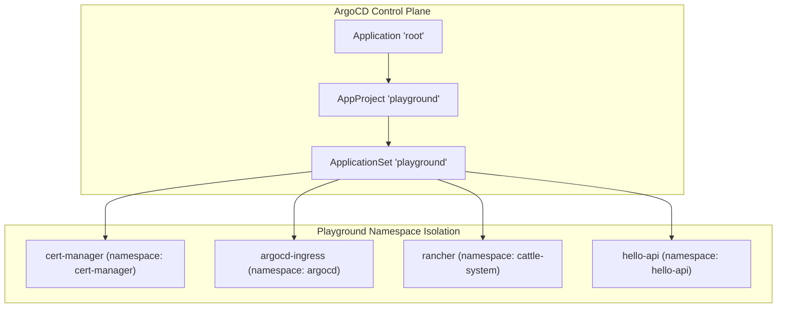
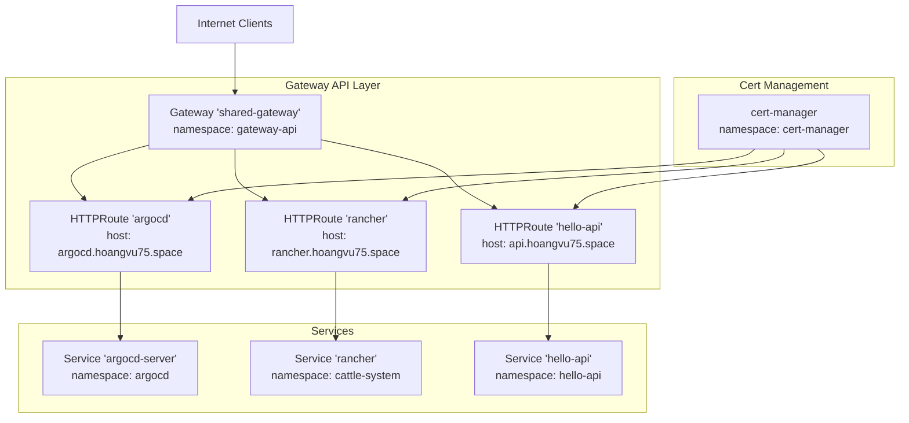
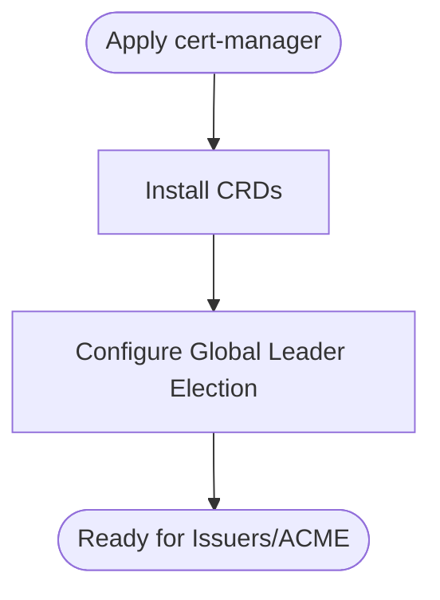
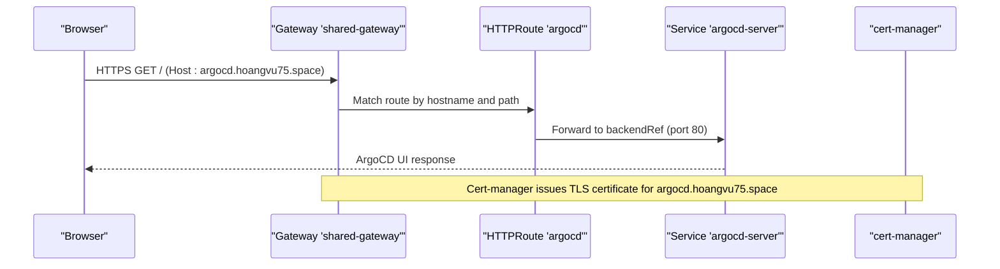
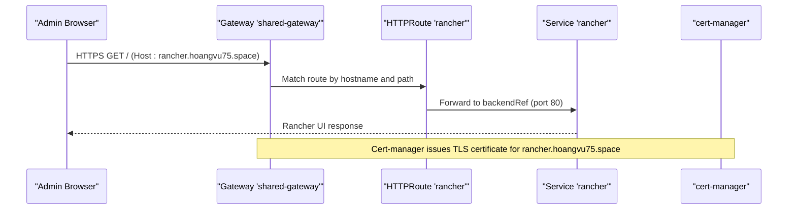
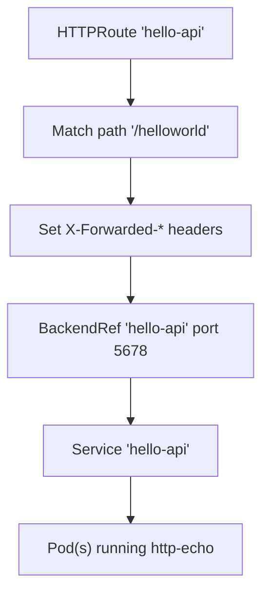
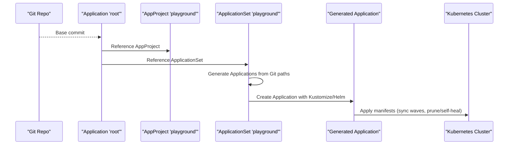
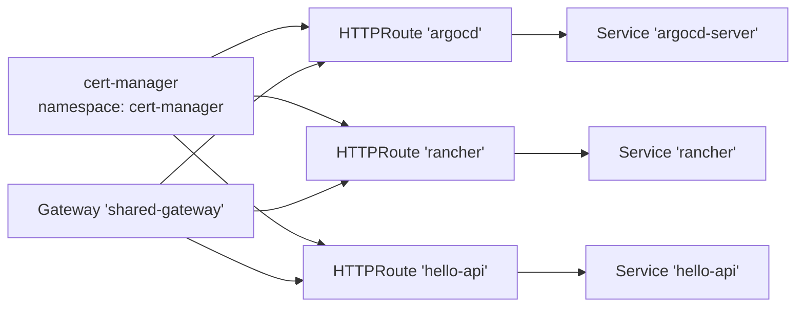

# Playground Applications

<cite>
**Referenced Files in This Document**
- [apps/playground/cert-manager/kustomization.yaml](file://apps/playground/cert-manager/kustomization.yaml)
- [apps/playground/cert-manager/chart/values.yaml](file://apps/playground/cert-manager/chart/values.yaml)
- [apps/playground/cert-manager/config.yaml](file://apps/playground/cert-manager/config.yaml)
- [apps/playground/argocd-ingress/kustomization.yaml](file://apps/playground/argocd-ingress/kustomization.yaml)
- [apps/playground/argocd-ingress/chart/values.yaml](file://apps/playground/argocd-ingress/chart/values.yaml)
- [apps/playground/argocd-ingress/chart/httproute-argocd.yaml](file://apps/playground/argocd-ingress/chart/httproute-argocd.yaml)
- [apps/playground/rancher/kustomization.yaml](file://apps/playground/rancher/kustomization.yaml)
- [apps/playground/rancher/chart/values.yaml](file://apps/playground/rancher/chart/values.yaml)
- [apps/playground/rancher/chart/httproute-rancher.yaml](file://apps/playground/rancher/chart/httproute-rancher.yaml)
- [apps/playground/hello-api/kustomization.yaml](file://apps/playground/hello-api/kustomization.yaml)
- [apps/playground/hello-api/chart/values.yaml](file://apps/playground/hello-api/chart/values.yaml)
- [apps/playground/hello-api/chart/values-service.yaml](file://apps/playground/hello-api/chart/values-service.yaml)
- [apps/playground/hello-api/chart/values-httproute.yaml](file://apps/playground/hello-api/chart/values-httproute.yaml)
- [projects/playground.yaml](file://projects/playground.yaml)
- [bootstrap/root.yaml](file://bootstrap/root.yaml)
</cite>

## Table of Contents
1. [Introduction](#introduction)
2. [Project Structure](#project-structure)
3. [Core Components](#core-components)
4. [Architecture Overview](#architecture-overview)
5. [Detailed Component Analysis](#detailed-component-analysis)
6. [Dependency Analysis](#dependency-analysis)
7. [Performance Considerations](#performance-considerations)
8. [Troubleshooting Guide](#troubleshooting-guide)
9. [Conclusion](#conclusion)
10. [Appendices](#appendices)

## Introduction
This document explains the playground applications that provide user-facing services and experimental features in a Kubernetes cluster managed by ArgoCD. It covers:
- Automated TLS certificate management via cert-manager and Gateway API HTTPRoute
- Secure exposure of ArgoCD UI through HTTPRoute backed by a shared gateway
- Rancher management interface setup and HTTPRoute exposure
- Demo application deployment patterns and how playground differs from production-grade infrastructure
- Relationship between playground applications and main cluster resources, including namespace isolation and resource allocation strategies

## Project Structure
Playground applications are organized under apps/playground and orchestrated by ArgoCD ApplicationSet and AppProject definitions. Each service is packaged as a Kustomize overlay with optional Helm charts and Gateway API manifests.

**Diagram sources**
- [bootstrap/root.yaml:1-37](file://bootstrap/root.yaml#L1-L37)
- [projects/playground.yaml:1-90](file://projects/playground.yaml#L1-L90)
- [apps/playground/cert-manager/kustomization.yaml:1-6](file://apps/playground/cert-manager/kustomization.yaml#L1-L6)
- [apps/playground/argocd-ingress/kustomization.yaml:1-9](file://apps/playground/argocd-ingress/kustomization.yaml#L1-L9)
- [apps/playground/rancher/kustomization.yaml:1-9](file://apps/playground/rancher/kustomization.yaml#L1-L9)
- [apps/playground/hello-api/kustomization.yaml:1-8](file://apps/playground/hello-api/kustomization.yaml#L1-L8)

**Section sources**
- [bootstrap/root.yaml:1-37](file://bootstrap/root.yaml#L1-L37)
- [projects/playground.yaml:1-90](file://projects/playground.yaml#L1-L90)

## Core Components
- cert-manager: Installs CRDs and configures leader election and global settings for certificate management.
- ArgoCD ingress: Exposes the ArgoCD UI via HTTPRoute attached to a shared gateway.
- Rancher: Deploys the Rancher management plane with hostname and ingress disabled in favor of HTTPRoute.
- hello-api: A minimal demo service with Deployment, Service, and HTTPRoute for path-based routing.

**Section sources**
- [apps/playground/cert-manager/chart/values.yaml:1-6](file://apps/playground/cert-manager/chart/values.yaml#L1-L6)
- [apps/playground/argocd-ingress/chart/values.yaml:1-7](file://apps/playground/argocd-ingress/chart/values.yaml#L1-L7)
- [apps/playground/argocd-ingress/chart/httproute-argocd.yaml:1-29](file://apps/playground/argocd-ingress/chart/httproute-argocd.yaml#L1-L29)
- [apps/playground/rancher/chart/values.yaml:1-9](file://apps/playground/rancher/chart/values.yaml#L1-L9)
- [apps/playground/rancher/chart/httproute-rancher.yaml:1-30](file://apps/playground/rancher/chart/httproute-rancher.yaml#L1-L30)
- [apps/playground/hello-api/chart/values.yaml:1-23](file://apps/playground/hello-api/chart/values.yaml#L1-L23)
- [apps/playground/hello-api/chart/values-service.yaml:1-6](file://apps/playground/hello-api/chart/values-service.yaml#L1-L6)
- [apps/playground/hello-api/chart/values-httproute.yaml:1-26](file://apps/playground/hello-api/chart/values-httproute.yaml#L1-L26)

## Architecture Overview
The playground leverages a shared Gateway API gateway to expose services securely. cert-manager provisions certificates for domains used by HTTPRoute hosts. ArgoCD ApplicationSet and AppProject orchestrate deployments across namespaces with explicit sync waves and pruning policies.

**Diagram sources**
- [apps/playground/argocd-ingress/chart/httproute-argocd.yaml:1-29](file://apps/playground/argocd-ingress/chart/httproute-argocd.yaml#L1-L29)
- [apps/playground/rancher/chart/httproute-rancher.yaml:1-30](file://apps/playground/rancher/chart/httproute-rancher.yaml#L1-L30)
- [apps/playground/hello-api/chart/values-httproute.yaml:1-26](file://apps/playground/hello-api/chart/values-httproute.yaml#L1-L26)
- [apps/playground/cert-manager/chart/values.yaml:1-6](file://apps/playground/cert-manager/chart/values.yaml#L1-L6)

## Detailed Component Analysis

### cert-manager Configuration
- Purpose: Install cert-manager CRDs and configure global leader election and CRD installation.
- Namespace: Deployed into cert-manager.
- Sync behavior: Controlled via annotations to ensure proper ordering during ArgoCD synchronization.

**Diagram sources**
- [apps/playground/cert-manager/chart/values.yaml:1-6](file://apps/playground/cert-manager/chart/values.yaml#L1-L6)

**Section sources**
- [apps/playground/cert-manager/kustomization.yaml:1-6](file://apps/playground/cert-manager/kustomization.yaml#L1-L6)
- [apps/playground/cert-manager/config.yaml:1-5](file://apps/playground/cert-manager/config.yaml#L1-L5)
- [apps/playground/cert-manager/chart/values.yaml:1-6](file://apps/playground/cert-manager/chart/values.yaml#L1-L6)

### ArgoCD Ingress Exposure via HTTPRoute
- Purpose: Expose ArgoCD UI securely through a shared gateway using HTTPRoute.
- Hostname: argocd.hoangvu75.space
- Routing: Path prefix “/”, header filters set for forwarded proto/port, backend to argocd-server:80.
- Namespace: argocd
- Sync wave: Ensured after cert-manager and before service reconciliation.

**Diagram sources**
- [apps/playground/argocd-ingress/chart/httproute-argocd.yaml:1-29](file://apps/playground/argocd-ingress/chart/httproute-argocd.yaml#L1-L29)
- [apps/playground/argocd-ingress/chart/values.yaml:1-7](file://apps/playground/argocd-ingress/chart/values.yaml#L1-L7)

**Section sources**
- [apps/playground/argocd-ingress/kustomization.yaml:1-9](file://apps/playground/argocd-ingress/kustomization.yaml#L1-L9)
- [apps/playground/argocd-ingress/chart/httproute-argocd.yaml:1-29](file://apps/playground/argocd-ingress/chart/httproute-argocd.yaml#L1-L29)
- [apps/playground/argocd-ingress/chart/values.yaml:1-7](file://apps/playground/argocd-ingress/chart/values.yaml#L1-L7)

### Rancher Management Interface Setup
- Purpose: Provide a management plane for cluster administration and multi-cluster management.
- Hostname: rancher.hoangvu75.space
- Ingress: Disabled in chart values; exposed via HTTPRoute.
- Namespace: cattle-system
- Sync wave: Ensured after cert-manager and before service reconciliation.

**Diagram sources**
- [apps/playground/rancher/chart/httproute-rancher.yaml:1-30](file://apps/playground/rancher/chart/httproute-rancher.yaml#L1-L30)
- [apps/playground/rancher/chart/values.yaml:1-9](file://apps/playground/rancher/chart/values.yaml#L1-L9)

**Section sources**
- [apps/playground/rancher/kustomization.yaml:1-9](file://apps/playground/rancher/kustomization.yaml#L1-L9)
- [apps/playground/rancher/chart/httproute-rancher.yaml:1-30](file://apps/playground/rancher/chart/httproute-rancher.yaml#L1-L30)
- [apps/playground/rancher/chart/values.yaml:1-9](file://apps/playground/rancher/chart/values.yaml#L1-L9)

### Demo Application Deployment Pattern (hello-api)
- Purpose: Demonstrate a minimal HTTP echo service with a dedicated namespace and HTTPRoute.
- Service: hello-api exposed via HTTPRoute under path prefix “/helloworld”.
- Resource allocation: Small CPU/memory requests/limits suitable for demos.
- Namespace: hello-api

**Diagram sources**
- [apps/playground/hello-api/chart/values-httproute.yaml:1-26](file://apps/playground/hello-api/chart/values-httproute.yaml#L1-L26)
- [apps/playground/hello-api/chart/values-service.yaml:1-6](file://apps/playground/hello-api/chart/values-service.yaml#L1-L6)
- [apps/playground/hello-api/chart/values.yaml:1-23](file://apps/playground/hello-api/chart/values.yaml#L1-L23)

**Section sources**
- [apps/playground/hello-api/kustomization.yaml:1-8](file://apps/playground/hello-api/kustomization.yaml#L1-L8)
- [apps/playground/hello-api/chart/values.yaml:1-23](file://apps/playground/hello-api/chart/values.yaml#L1-L23)
- [apps/playground/hello-api/chart/values-service.yaml:1-6](file://apps/playground/hello-api/chart/values-service.yaml#L1-L6)
- [apps/playground/hello-api/chart/values-httproute.yaml:1-26](file://apps/playground/hello-api/chart/values-httproute.yaml#L1-L26)

### Playground Orchestration via ArgoCD
- AppProject playground: Allows cluster and namespace-wide resource whitelisting and permits wildcard destinations.
- ApplicationSet playground: Generates per-service Application resources from Git paths, applying sync waves and pruning policies.
- Root Application: Points to projects and configures sync options and ignore differences.

**Diagram sources**
- [bootstrap/root.yaml:1-37](file://bootstrap/root.yaml#L1-L37)
- [projects/playground.yaml:1-90](file://projects/playground.yaml#L1-L90)

**Section sources**
- [bootstrap/root.yaml:1-37](file://bootstrap/root.yaml#L1-L37)
- [projects/playground.yaml:1-90](file://projects/playground.yaml#L1-L90)

## Dependency Analysis
- Namespace isolation: Each service resides in its own namespace to reduce blast radius and simplify governance.
- Shared gateway: All HTTPRoute-based services attach to a single shared gateway, reducing infrastructure overhead.
- Certificate provisioning: cert-manager is deployed first and expected to issue certificates prior to HTTPRoute attachment.
- Sync ordering: Annotations enforce sync waves to ensure cert-manager precedes HTTPRoute creation and services become ready before routes attach.

**Diagram sources**
- [apps/playground/cert-manager/chart/values.yaml:1-6](file://apps/playground/cert-manager/chart/values.yaml#L1-L6)
- [apps/playground/argocd-ingress/chart/httproute-argocd.yaml:1-29](file://apps/playground/argocd-ingress/chart/httproute-argocd.yaml#L1-L29)
- [apps/playground/rancher/chart/httproute-rancher.yaml:1-30](file://apps/playground/rancher/chart/httproute-rancher.yaml#L1-L30)
- [apps/playground/hello-api/chart/values-httproute.yaml:1-26](file://apps/playground/hello-api/chart/values-httproute.yaml#L1-L26)

**Section sources**
- [apps/playground/cert-manager/config.yaml:1-5](file://apps/playground/cert-manager/config.yaml#L1-L5)
- [apps/playground/argocd-ingress/chart/httproute-argocd.yaml:1-29](file://apps/playground/argocd-ingress/chart/httproute-argocd.yaml#L1-L29)
- [apps/playground/rancher/chart/httproute-rancher.yaml:1-30](file://apps/playground/rancher/chart/httproute-rancher.yaml#L1-L30)
- [apps/playground/hello-api/chart/values-httproute.yaml:1-26](file://apps/playground/hello-api/chart/values-httproute.yaml#L1-L26)

## Performance Considerations
- Resource allocation: Demo services use minimal CPU and memory requests/limits; adjust for higher traffic or latency-sensitive workloads.
- Gateway sharing: Using a shared gateway reduces controller overhead but requires careful route design to avoid conflicts.
- Sync waves: Proper sequencing prevents race conditions between certificate issuance and route attachment.
- Pruning and self-healing: Automated pruning and self-healing keep environments clean and resilient; tune retry/backoff for stability.

[No sources needed since this section provides general guidance]

## Troubleshooting Guide
- HTTPRoute not attaching:
  - Verify the shared gateway exists and is healthy.
  - Confirm HTTPRoute hostnames match DNS and certificate is issued.
- Certificate issues:
  - Ensure cert-manager is installed and CRDs are present.
  - Check issuer configuration and ACME account registration.
- Service unreachable:
  - Validate Service selectors and ports match HTTPRoute backendRefs.
  - Confirm pod readiness and network policies allow traffic.
- Sync order problems:
  - Review sync-wave annotations on HTTPRoute and cert-manager resources.

**Section sources**
- [apps/playground/argocd-ingress/chart/httproute-argocd.yaml:1-29](file://apps/playground/argocd-ingress/chart/httproute-argocd.yaml#L1-L29)
- [apps/playground/rancher/chart/httproute-rancher.yaml:1-30](file://apps/playground/rancher/chart/httproute-rancher.yaml#L1-L30)
- [apps/playground/hello-api/chart/values-httproute.yaml:1-26](file://apps/playground/hello-api/chart/values-httproute.yaml#L1-L26)
- [apps/playground/cert-manager/chart/values.yaml:1-6](file://apps/playground/cert-manager/chart/values.yaml#L1-L6)

## Conclusion
The playground applications demonstrate a pragmatic, GitOps-driven approach to delivering user-facing services with secure exposure via Gateway API and automated certificate management. By isolating services into dedicated namespaces, leveraging a shared gateway, and enforcing sync waves, the setup balances simplicity with operational reliability. These patterns differ from production-grade infrastructure primarily in resource sizing, HA configurations, and stricter security controls, while retaining the same orchestration and networking primitives.

[No sources needed since this section summarizes without analyzing specific files]

## Appendices
- Playground vs. Production:
  - Resource limits and replicas should be increased for production.
  - Enable ingressClass or load balancer exposure for public endpoints.
  - Add observability, WAF, and advanced TLS policies.
- Related Resources:
  - Root Application and AppProject definitions govern how playground apps are applied and pruned.

**Section sources**
- [bootstrap/root.yaml:1-37](file://bootstrap/root.yaml#L1-L37)
- [projects/playground.yaml:1-90](file://projects/playground.yaml#L1-L90)