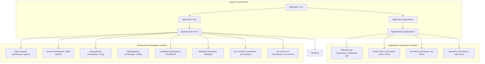
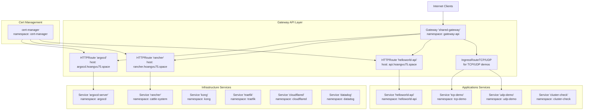
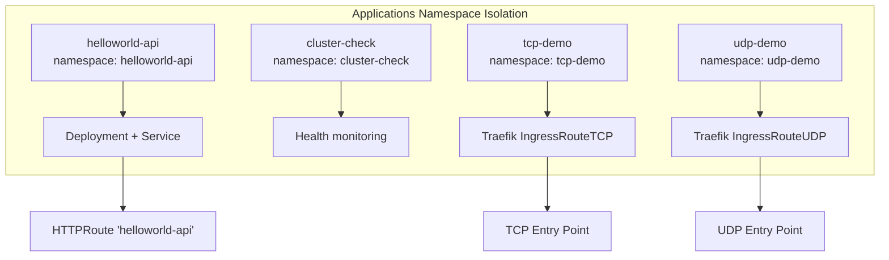
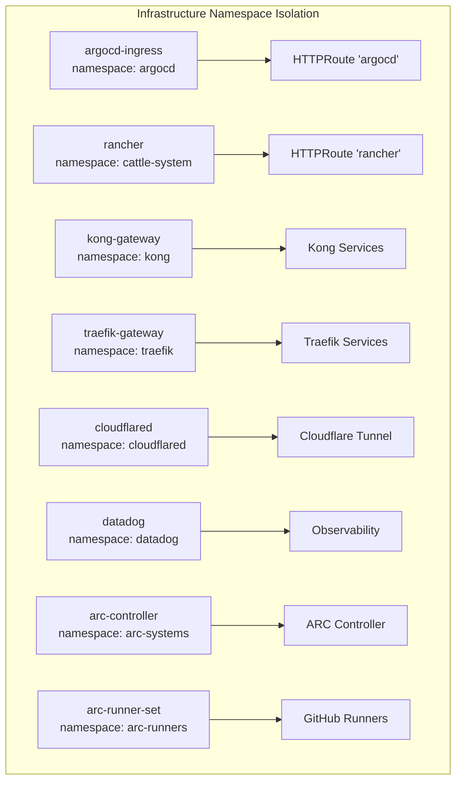
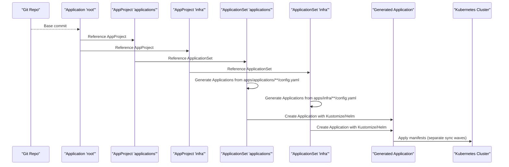
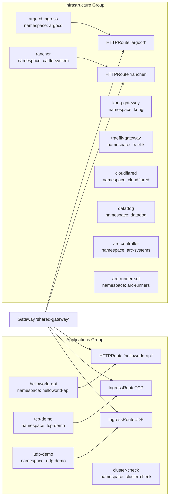

# Playground Applications

<cite>
**Referenced Files in This Document**
- [apps/applications/helloworld-api/kustomization.yaml](file://apps/applications/helloworld-api/kustomization.yaml)
- [apps/applications/helloworld-api/chart/values.yaml](file://apps/applications/helloworld-api/chart/values.yaml)
- [apps/applications/helloworld-api/chart/values-service.yaml](file://apps/applications/helloworld-api/chart/values-service.yaml)
- [apps/applications/cluster-check/kustomization.yaml](file://apps/applications/cluster-check/kustomization.yaml)
- [apps/applications/tcp-demo/kustomization.yaml](file://apps/applications/tcp-demo/kustomization.yaml)
- [apps/applications/tcp-demo/chart/ingressroutetcp.yaml](file://apps/applications/tcp-demo/chart/ingressroutetcp.yaml)
- [apps/applications/udp-demo/kustomization.yaml](file://apps/applications/udp-demo/kustomization.yaml)
- [apps/applications/udp-demo/chart/ingressrouteudp.yaml](file://apps/applications/udp-demo/chart/ingressrouteudp.yaml)
- [apps/infra/argocd-ingress/kustomization.yaml](file://apps/infra/argocd-ingress/kustomization.yaml)
- [apps/infra/argocd-ingress/chart/httproute-argocd.yaml](file://apps/infra/argocd-ingress/chart/httproute-argocd.yaml)
- [apps/infra/rancher/kustomization.yaml](file://apps/infra/rancher/kustomization.yaml)
- [apps/infra/rancher/chart/httproute-rancher.yaml](file://apps/infra/rancher/chart/httproute-rancher.yaml)
- [apps/infra/kong-gateway/kustomization.yaml](file://apps/infra/kong-gateway/kustomization.yaml)
- [apps/infra/traefik-gateway/kustomization.yaml](file://apps/infra/traefik-gateway/kustomization.yaml)
- [apps/infra/cloudflared/kustomization.yaml](file://apps/infra/cloudflared/kustomization.yaml)
- [apps/infra/datadog/kustomization.yaml](file://apps/infra/datadog/kustomization.yaml)
- [apps/infra/arc-controller/kustomization.yaml](file://apps/infra/arc-controller/kustomization.yaml)
- [apps/infra/arc-runner-set/kustomization.yaml](file://apps/infra/arc-runner-set/kustomization.yaml)
- [projects/applications.yaml](file://projects/applications.yaml)
- [projects/infra.yaml](file://projects/infra.yaml)
- [bootstrap/root.yaml](file://bootstrap/root.yaml)
</cite>

## Update Summary
**Changes Made**
- Updated all file references from `apps/playground/` to `apps/applications/` and `apps/infra/`
- Reorganized project structure references to reflect new directory layout
- Updated ApplicationSet generators to point to new `apps/applications/**/config.yaml` and `apps/infra/**/config.yaml` paths
- Modified namespace isolation examples to reflect new application categorization
- Updated architecture diagrams to show consolidated infrastructure and application groups

## Table of Contents
1. [Introduction](#introduction)
2. [Project Structure](#project-structure)
3. [Core Components](#core-components)
4. [Architecture Overview](#architecture-overview)
5. [Detailed Component Analysis](#detailed-component-analysis)
6. [Dependency Analysis](#dependency-analysis)
7. [Performance Considerations](#performance-considerations)
8. [Troubleshooting Guide](#troubleshooting-guide)
9. [Conclusion](#conclusion)
10. [Appendices](#appendices)

## Introduction
This document explains the playground applications that provide user-facing services and experimental features in a Kubernetes cluster managed by ArgoCD. The applications have been reorganized into two main categories: applications (user-facing services) and infrastructure (system services and platform components). It covers:
- Automated TLS certificate management via cert-manager and Gateway API HTTPRoute
- Secure exposure of ArgoCD UI through HTTPRoute backed by a shared gateway
- Rancher management interface setup and HTTPRoute exposure
- Demo application deployment patterns including TCP/UDP protocols
- How the consolidated application structure differs from the previous playground organization
- Relationship between applications and infrastructure components, including namespace isolation and resource allocation strategies

## Project Structure
Playground applications are now organized under `apps/applications/` and `apps/infra/` directories, orchestrated by separate ArgoCD ApplicationSets and AppProjects. Each service maintains its own Kustomize overlay with optional Helm charts and Gateway API manifests.

**Diagram sources**
- [bootstrap/root.yaml:1-37](file://bootstrap/root.yaml#L1-L37)
- [projects/applications.yaml:1-85](file://projects/applications.yaml#L1-L85)
- [projects/infra.yaml:1-86](file://projects/infra.yaml#L1-L86)
- [apps/applications/helloworld-api/kustomization.yaml:1-8](file://apps/applications/helloworld-api/kustomization.yaml#L1-L8)
- [apps/infra/argocd-ingress/kustomization.yaml:1-8](file://apps/infra/argocd-ingress/kustomization.yaml#L1-L8)
- [apps/infra/rancher/kustomization.yaml:1-9](file://apps/infra/rancher/kustomization.yaml#L1-L9)

**Section sources**
- [bootstrap/root.yaml:1-37](file://bootstrap/root.yaml#L1-L37)
- [projects/applications.yaml:1-85](file://projects/applications.yaml#L1-L85)
- [projects/infra.yaml:1-86](file://projects/infra.yaml#L1-L86)

## Core Components
The consolidated structure separates concerns into two distinct categories:

**Applications Category** (User-facing services):
- helloworld-api: Minimal HTTP echo service with Deployment, Service, and HTTPRoute
- cluster-check: Health monitoring and cluster status checking
- tcp-demo: TCP protocol demonstration with Traefik IngressRouteTCP
- udp-demo: UDP protocol demonstration with Traefik IngressRouteUDP

**Infrastructure Category** (System services):
- argocd-ingress: ArgoCD UI exposure via HTTPRoute
- rancher: Rancher management interface with HTTPRoute
- kong-gateway: API gateway with Kong
- traefik-gateway: Alternative gateway implementation
- cloudflared: Cloudflare tunneling service
- datadog: Observability and monitoring
- arc-controller: GitHub Actions Runner Controller (manages runner scale sets)
- arc-runner-set: GitHub Actions runner scale set (ephemeral CI runners)

**Section sources**
- [apps/applications/helloworld-api/chart/values.yaml:1-23](file://apps/applications/helloworld-api/chart/values.yaml#L1-L23)
- [apps/applications/tcp-demo/chart/ingressroutetcp.yaml:1-16](file://apps/applications/tcp-demo/chart/ingressroutetcp.yaml#L1-L16)
- [apps/applications/udp-demo/chart/ingressrouteudp.yaml:1-15](file://apps/applications/udp-demo/chart/ingressrouteudp.yaml#L1-L15)
- [apps/infra/argocd-ingress/chart/httproute-argocd.yaml:1-29](file://apps/infra/argocd-ingress/chart/httproute-argocd.yaml#L1-L29)
- [apps/infra/rancher/chart/httproute-rancher.yaml:1-30](file://apps/infra/rancher/chart/httproute-rancher.yaml#L1-L30)

## Architecture Overview
The reorganized architecture maintains the same Gateway API pattern but with improved separation of concerns. Applications are user-facing services, while infrastructure provides platform capabilities. Both categories leverage the shared Gateway API gateway for secure exposure.

**Diagram sources**
- [apps/infra/argocd-ingress/chart/httproute-argocd.yaml:1-29](file://apps/infra/argocd-ingress/chart/httproute-argocd.yaml#L1-L29)
- [apps/infra/rancher/chart/httproute-rancher.yaml:1-30](file://apps/infra/rancher/chart/httproute-rancher.yaml#L1-L30)
- [apps/applications/helloworld-api/chart/values-service.yaml:1-6](file://apps/applications/helloworld-api/chart/values-service.yaml#L1-L6)
- [apps/applications/tcp-demo/chart/ingressroutetcp.yaml:1-16](file://apps/applications/tcp-demo/chart/ingressroutetcp.yaml#L1-L16)
- [apps/applications/udp-demo/chart/ingressrouteudp.yaml:1-15](file://apps/applications/udp-demo/chart/ingressrouteudp.yaml#L1-L15)

## Detailed Component Analysis

### Applications Category
The applications category contains user-facing services and experimental features:

**helloworld-api** (Minimal HTTP Echo Service)
- Purpose: Demonstrate a basic HTTP echo service with Deployment, Service, and HTTPRoute
- Resource allocation: Small CPU/memory requests/limits suitable for demos
- Namespace: helloworld-api

**cluster-check** (Health Monitoring)
- Purpose: Provides cluster health monitoring and status checking capabilities
- Resource allocation: Minimal footprint for continuous monitoring
- Namespace: cluster-check

**tcp-demo** (TCP Protocol Demo)
- Purpose: Demonstrates TCP protocol handling with Traefik IngressRouteTCP
- Protocol: TCP echo service on port 7777
- Namespace: tcp-demo

**udp-demo** (UDP Protocol Demo)
- Purpose: Demonstrates UDP protocol handling with Traefik IngressRouteUDP
- Protocol: UDP echo service on port 7778
- Namespace: udp-demo

**Diagram sources**
- [apps/applications/helloworld-api/chart/values.yaml:1-23](file://apps/applications/helloworld-api/chart/values.yaml#L1-L23)
- [apps/applications/tcp-demo/chart/ingressroutetcp.yaml:1-16](file://apps/applications/tcp-demo/chart/ingressroutetcp.yaml#L1-L16)
- [apps/applications/udp-demo/chart/ingressrouteudp.yaml:1-15](file://apps/applications/udp-demo/chart/ingressrouteudp.yaml#L1-L15)

**Section sources**
- [apps/applications/helloworld-api/kustomization.yaml:1-8](file://apps/applications/helloworld-api/kustomization.yaml#L1-L8)
- [apps/applications/helloworld-api/chart/values.yaml:1-23](file://apps/applications/helloworld-api/chart/values.yaml#L1-L23)
- [apps/applications/cluster-check/kustomization.yaml:1-8](file://apps/applications/cluster-check/kustomization.yaml#L1-L8)
- [apps/applications/tcp-demo/kustomization.yaml:1-8](file://apps/applications/tcp-demo/kustomization.yaml#L1-L8)
- [apps/applications/tcp-demo/chart/ingressroutetcp.yaml:1-16](file://apps/applications/tcp-demo/chart/ingressroutetcp.yaml#L1-L16)
- [apps/applications/udp-demo/kustomization.yaml:1-8](file://apps/applications/udp-demo/kustomization.yaml#L1-L8)
- [apps/applications/udp-demo/chart/ingressrouteudp.yaml:1-15](file://apps/applications/udp-demo/chart/ingressrouteudp.yaml#L1-L15)

### Infrastructure Category
The infrastructure category provides platform services and system components:

**argocd-ingress** (ArgoCD UI Exposure)
- Purpose: Expose ArgoCD UI securely through a shared gateway using HTTPRoute
- Hostname: argocd.hoangvu75.space
- Routing: Path prefix "/", header filters for forwarded proto/port, backend to argocd-server:80
- Namespace: argocd

**rancher** (Management Interface)
- Purpose: Provide management plane for cluster administration and multi-cluster management
- Hostname: rancher.hoangvu75.space
- Ingress: Disabled in chart values; exposed via HTTPRoute
- Namespace: cattle-system

**Additional Infrastructure Components**
- kong-gateway: API gateway with Kong
- traefik-gateway: Alternative gateway implementation
- cloudflared: Cloudflare tunneling service
- datadog: Observability and monitoring
- arc-controller: GitHub Actions Runner Controller
- arc-runner-set: GitHub Actions runner scale set

**Diagram sources**
- [apps/infra/argocd-ingress/chart/httproute-argocd.yaml:1-29](file://apps/infra/argocd-ingress/chart/httproute-argocd.yaml#L1-L29)
- [apps/infra/rancher/chart/httproute-rancher.yaml:1-30](file://apps/infra/rancher/chart/httproute-rancher.yaml#L1-L30)

**Section sources**
- [apps/infra/argocd-ingress/kustomization.yaml:1-8](file://apps/infra/argocd-ingress/kustomization.yaml#L1-L8)
- [apps/infra/argocd-ingress/chart/httproute-argocd.yaml:1-29](file://apps/infra/argocd-ingress/chart/httproute-argocd.yaml#L1-L29)
- [apps/infra/rancher/kustomization.yaml:1-9](file://apps/infra/rancher/kustomization.yaml#L1-L9)
- [apps/infra/rancher/chart/httproute-rancher.yaml:1-30](file://apps/infra/rancher/chart/httproute-rancher.yaml#L1-L30)

### Consolidated Orchestration via ArgoCD
The reorganized structure uses separate ApplicationSets for applications and infrastructure, each with their own AppProjects and sync policies:

**Applications Project**: Manages user-facing services with namespace isolation
**Infrastructure Project**: Manages system services and platform components

**Diagram sources**
- [bootstrap/root.yaml:1-37](file://bootstrap/root.yaml#L1-L37)
- [projects/applications.yaml:1-85](file://projects/applications.yaml#L1-L85)
- [projects/infra.yaml:1-86](file://projects/infra.yaml#L1-L86)

**Section sources**
- [bootstrap/root.yaml:1-37](file://bootstrap/root.yaml#L1-L37)
- [projects/applications.yaml:1-85](file://projects/applications.yaml#L1-L85)
- [projects/infra.yaml:1-86](file://projects/infra.yaml#L1-L86)

## Dependency Analysis
The reorganized structure maintains the same dependency patterns but with improved separation:

**Namespace Isolation**: Applications and infrastructure maintain separate namespaces to reduce blast radius and simplify governance.

**Shared Gateway**: Both application and infrastructure HTTPRoute-based services attach to the single shared gateway, reducing infrastructure overhead.

**Sync Ordering**: Separate sync waves ensure proper sequencing - applications typically sync after infrastructure components.

**Certificate Provisioning**: cert-manager is deployed first and expected to issue certificates prior to HTTPRoute attachment.

**Diagram sources**
- [apps/applications/helloworld-api/chart/values-service.yaml:1-6](file://apps/applications/helloworld-api/chart/values-service.yaml#L1-L6)
- [apps/applications/tcp-demo/chart/ingressroutetcp.yaml:1-16](file://apps/applications/tcp-demo/chart/ingressroutetcp.yaml#L1-L16)
- [apps/applications/udp-demo/chart/ingressrouteudp.yaml:1-15](file://apps/applications/udp-demo/chart/ingressrouteudp.yaml#L1-L15)
- [apps/infra/argocd-ingress/chart/httproute-argocd.yaml:1-29](file://apps/infra/argocd-ingress/chart/httproute-argocd.yaml#L1-L29)
- [apps/infra/rancher/chart/httproute-rancher.yaml:1-30](file://apps/infra/rancher/chart/httproute-rancher.yaml#L1-L30)

**Section sources**
- [apps/applications/helloworld-api/kustomization.yaml:1-8](file://apps/applications/helloworld-api/kustomization.yaml#L1-L8)
- [apps/infra/argocd-ingress/chart/httproute-argocd.yaml:1-29](file://apps/infra/argocd-ingress/chart/httproute-argocd.yaml#L1-L29)
- [apps/infra/rancher/chart/httproute-rancher.yaml:1-30](file://apps/infra/rancher/chart/httproute-rancher.yaml#L1-L30)

## Performance Considerations
- Resource allocation: Demo services use minimal CPU and memory requests/limits; adjust for higher traffic or latency-sensitive workloads.
- Gateway sharing: Using a shared gateway reduces controller overhead but requires careful route design to avoid conflicts.
- Separate sync waves: Applications and infrastructure have different sync timing to prevent race conditions.
- Namespace isolation: Improved separation reduces resource contention between user-facing services and system components.
- Protocol diversity: Support for both HTTP and TCP/UDP protocols enables comprehensive testing scenarios.

## Troubleshooting Guide
- HTTPRoute not attaching:
  - Verify the shared gateway exists and is healthy.
  - Confirm HTTPRoute hostnames match DNS and certificate is issued.
- Service unreachable:
  - Validate Service selectors and ports match HTTPRoute backendRefs.
  - Confirm pod readiness and network policies allow traffic.
- Protocol-specific issues:
  - For TCP/UDP demos, verify Traefik IngressRouteTCP/UDP configuration.
  - Check entry points and port mappings for protocol-specific services.
- Sync order problems:
  - Review sync-wave annotations on HTTPRoute and infrastructure resources.
  - Ensure applications sync after infrastructure components are ready.

**Section sources**
- [apps/infra/argocd-ingress/chart/httproute-argocd.yaml:1-29](file://apps/infra/argocd-ingress/chart/httproute-argocd.yaml#L1-L29)
- [apps/infra/rancher/chart/httproute-rancher.yaml:1-30](file://apps/infra/rancher/chart/httproute-rancher.yaml#L1-L30)
- [apps/applications/tcp-demo/chart/ingressroutetcp.yaml:1-16](file://apps/applications/tcp-demo/chart/ingressroutetcp.yaml#L1-L16)
- [apps/applications/udp-demo/chart/ingressrouteudp.yaml:1-15](file://apps/applications/udp-demo/chart/ingressrouteudp.yaml#L1-L15)

## Conclusion
The reorganized playground applications demonstrate a more structured, GitOps-driven approach to delivering both user-facing services and infrastructure components. By separating applications (helloworld-api, cluster-check, tcp-demo, udp-demo) from infrastructure (argocd-ingress, rancher, kong-gateway, etc.), the setup provides better organization, clearer responsibilities, and improved maintainability. The consolidation maintains the same orchestration patterns and networking primitives while offering a more scalable foundation for expanding the playground environment.

## Appendices
- Applications vs. Infrastructure:
  - Applications: User-facing services and experimental features (helloworld-api, tcp-demo, udp-demo)
  - Infrastructure: System services and platform components (argocd-ingress, rancher, gateways, monitoring)
- Sync Strategy:
  - Applications: Typically sync after infrastructure components
  - Infrastructure: Critical system services with earlier sync timing
- Related Resources:
  - Root Application and separate AppProjects for applications and infrastructure govern how components are applied and pruned.

**Section sources**
- [bootstrap/root.yaml:1-37](file://bootstrap/root.yaml#L1-L37)
- [projects/applications.yaml:1-85](file://projects/applications.yaml#L1-L85)
- [projects/infra.yaml:1-86](file://projects/infra.yaml#L1-L86)