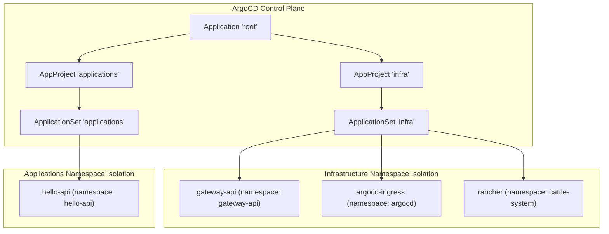
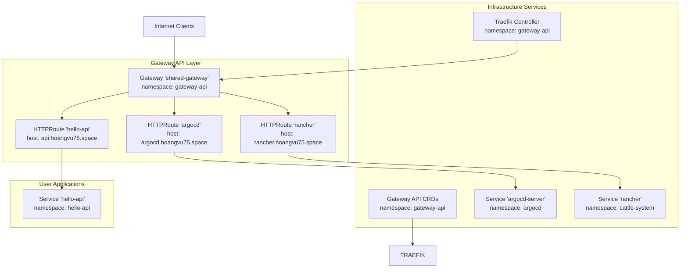
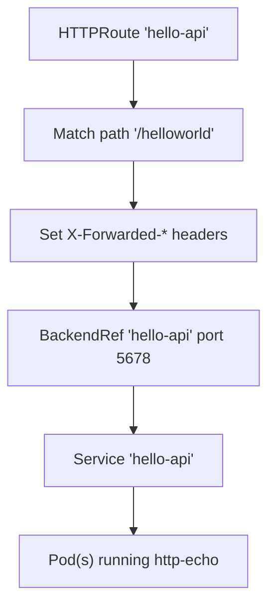
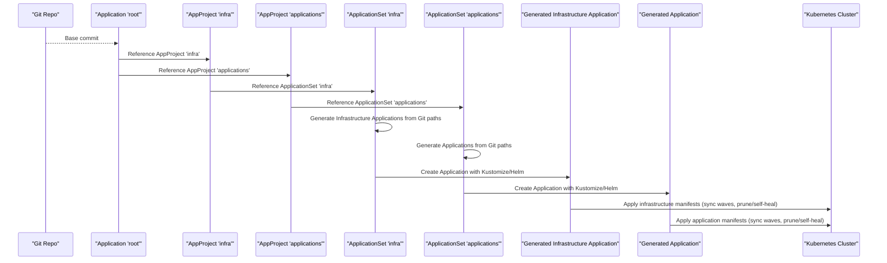
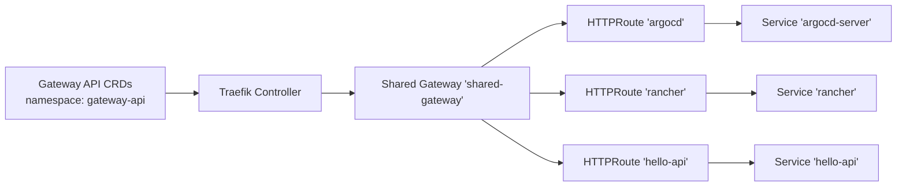

# Playground Applications

<cite>
**Referenced Files in This Document**
- [apps/applications/hello-api/config.yaml](file://apps/applications/hello-api/config.yaml)
- [apps/applications/hello-api/chart/kustomization.yaml](file://apps/applications/hello-api/chart/kustomization.yaml)
- [apps/applications/hello-api/chart/values.yaml](file://apps/applications/hello-api/chart/values.yaml)
- [apps/applications/hello-api/chart/values-service.yaml](file://apps/applications/hello-api/chart/values-service.yaml)
- [apps/applications/hello-api/chart/values-httproute.yaml](file://apps/applications/hello-api/chart/values-httproute.yaml)
- [apps/infra/argocd-ingress/config.yaml](file://apps/infra/argocd-ingress/config.yaml)
- [apps/infra/argocd-ingress/chart/kustomization.yaml](file://apps/infra/argocd-ingress/chart/kustomization.yaml)
- [apps/infra/argocd-ingress/chart/values.yaml](file://apps/infra/argocd-ingress/chart/values.yaml)
- [apps/infra/argocd-ingress/chart/httproute-argocd.yaml](file://apps/infra/argocd-ingress/chart/httproute-argocd.yaml)
- [apps/infra/rancher/config.yaml](file://apps/infra/rancher/config.yaml)
- [apps/infra/rancher/chart/kustomization.yaml](file://apps/infra/rancher/chart/kustomization.yaml)
- [apps/infra/rancher/chart/values.yaml](file://apps/infra/rancher/chart/values.yaml)
- [apps/infra/rancher/chart/httproute-rancher.yaml](file://apps/infra/rancher/chart/httproute-rancher.yaml)
- [apps/infra/gateway-api/config.yaml](file://apps/infra/gateway-api/config.yaml)
- [apps/infra/gateway-api/chart/kustomization.yaml](file://apps/infra/gateway-api/chart/kustomization.yaml)
- [apps/infra/gateway-api/chart/gateway.yaml](file://apps/infra/gateway-api/chart/gateway.yaml)
- [apps/infra/gateway-api/chart/gatewayclass.yaml](file://apps/infra/gateway-api/chart/gatewayclass.yaml)
- [apps/infra/gateway-api/chart/traefik.yaml](file://apps/infra/gateway-api/chart/traefik.yaml)
- [apps/infra/gateway-api/chart/httproute-traefik-dashboard.yaml](file://apps/infra/gateway-api/chart/httproute-traefik-dashboard.yaml)
- [projects/applications.yaml](file://projects/applications.yaml)
- [projects/infra.yaml](file://projects/infra.yaml)
- [projects/kustomization.yaml](file://projects/kustomization.yaml)
- [bootstrap/root.yaml](file://bootstrap/root.yaml)
</cite>

## Update Summary
**Changes Made**
- Removed all references to playground applications as the playground concept no longer exists
- Updated project structure to reflect new categorization into infrastructure and applications projects
- Replaced playground-specific orchestrations with new infrastructure and applications project configurations
- Updated component organization to separate infrastructure applications (argocd-ingress, rancher, gateway-api) from user-facing applications (hello-api)
- Revised architecture diagrams to show the new project-based organization

## Table of Contents
1. [Introduction](#introduction)
2. [Project Structure](#project-structure)
3. [Core Components](#core-components)
4. [Architecture Overview](#architecture-overview)
5. [Detailed Component Analysis](#detailed-component-analysis)
6. [Dependency Analysis](#dependency-analysis)
7. [Performance Considerations](#performance-considerations)
8. [Troubleshooting Guide](#troubleshooting-guide)
9. [Conclusion](#conclusion)
10. [Appendices](#appendices)

## Introduction
This document explains the infrastructure and applications projects that provide user-facing services and experimental features in a Kubernetes cluster managed by ArgoCD. The previous playground concept has been reorganized into two distinct project categories:

- Infrastructure applications: Core platform services including ArgoCD ingress, Rancher management interface, and Gateway API infrastructure
- Applications: User-facing services such as the hello-api demo application

The documentation covers:
- Automated TLS certificate management via cert-manager and Gateway API HTTPRoute
- Secure exposure of ArgoCD UI through HTTPRoute backed by a shared gateway
- Rancher management interface setup and HTTPRoute exposure
- Demo application deployment patterns and how infrastructure differs from user-facing applications
- Relationship between infrastructure and applications projects, including namespace isolation and resource allocation strategies

## Project Structure
Applications are now organized under apps/infra and apps/applications, each orchestrated by separate ArgoCD ApplicationSet and AppProject definitions. Infrastructure services are grouped together in the infra project, while user-facing applications are managed separately in the applications project.

**Diagram sources**
- [bootstrap/root.yaml:1-37](file://bootstrap/root.yaml#L1-L37)
- [projects/infra.yaml:1-85](file://projects/infra.yaml#L1-L85)
- [projects/applications.yaml:1-85](file://projects/applications.yaml#L1-L85)
- [apps/infra/gateway-api/config.yaml:1-6](file://apps/infra/gateway-api/config.yaml#L1-L6)
- [apps/infra/argocd-ingress/config.yaml:1-4](file://apps/infra/argocd-ingress/config.yaml#L1-L4)
- [apps/infra/rancher/config.yaml:1-5](file://apps/infra/rancher/config.yaml#L1-L5)
- [apps/applications/hello-api/config.yaml:1-4](file://apps/applications/hello-api/config.yaml#L1-L4)

**Section sources**
- [bootstrap/root.yaml:1-37](file://bootstrap/root.yaml#L1-L37)
- [projects/infra.yaml:1-85](file://projects/infra.yaml#L1-L85)
- [projects/applications.yaml:1-85](file://projects/applications.yaml#L1-L85)

## Core Components
- **Infrastructure Applications**:
  - gateway-api: Installs Gateway API CRDs and configures Traefik as the gateway controller
  - argocd-ingress: Exposes the ArgoCD UI via HTTPRoute attached to a shared gateway
  - rancher: Deploys the Rancher management plane with hostname and ingress disabled in favor of HTTPRoute

- **Applications**:
  - hello-api: A minimal demo service with Deployment, Service, and HTTPRoute for path-based routing

**Section sources**
- [apps/infra/gateway-api/chart/gateway.yaml:1-20](file://apps/infra/gateway-api/chart/gateway.yaml#L1-L20)
- [apps/infra/gateway-api/chart/gatewayclass.yaml:1-15](file://apps/infra/gateway-api/chart/gatewayclass.yaml#L1-L15)
- [apps/infra/gateway-api/chart/traefik.yaml:1-25](file://apps/infra/gateway-api/chart/traefik.yaml#L1-L25)
- [apps/infra/argocd-ingress/chart/values.yaml:1-7](file://apps/infra/argocd-ingress/chart/values.yaml#L1-L7)
- [apps/infra/argocd-ingress/chart/httproute-argocd.yaml:1-29](file://apps/infra/argocd-ingress/chart/httproute-argocd.yaml#L1-L29)
- [apps/infra/rancher/chart/values.yaml:1-9](file://apps/infra/rancher/chart/values.yaml#L1-L9)
- [apps/infra/rancher/chart/httproute-rancher.yaml:1-30](file://apps/infra/rancher/chart/httproute-rancher.yaml#L1-L30)
- [apps/applications/hello-api/chart/values.yaml:1-23](file://apps/applications/hello-api/chart/values.yaml#L1-L23)
- [apps/applications/hello-api/chart/values-service.yaml:1-6](file://apps/applications/hello-api/chart/values-service.yaml#L1-L6)
- [apps/applications/hello-api/chart/values-httproute.yaml:1-26](file://apps/applications/hello-api/chart/values-httproute.yaml#L1-L26)

## Architecture Overview
The infrastructure and applications projects leverage a shared Gateway API gateway to expose services securely. Gateway API CRDs are installed first, followed by the gateway controller (Traefik). Services are then exposed through HTTPRoute resources with automated certificate management.

**Diagram sources**
- [apps/infra/gateway-api/chart/gateway.yaml:1-20](file://apps/infra/gateway-api/chart/gateway.yaml#L1-L20)
- [apps/infra/gateway-api/chart/traefik.yaml:1-25](file://apps/infra/gateway-api/chart/traefik.yaml#L1-L25)
- [apps/infra/argocd-ingress/chart/httproute-argocd.yaml:1-29](file://apps/infra/argocd-ingress/chart/httproute-argocd.yaml#L1-L29)
- [apps/infra/rancher/chart/httproute-rancher.yaml:1-30](file://apps/infra/rancher/chart/httproute-rancher.yaml#L1-L30)
- [apps/applications/hello-api/chart/values-httproute.yaml:1-26](file://apps/applications/hello-api/chart/values-httproute.yaml#L1-L26)

## Detailed Component Analysis

### Infrastructure Project Organization
The infrastructure project manages core platform services that enable user-facing applications to operate securely and reliably.

**Gateway API Infrastructure**:
- Purpose: Install Gateway API CRDs and deploy Traefik as the gateway controller
- Namespace: gateway-api
- Sync behavior: Controlled via annotations to ensure proper ordering during ArgoCD synchronization

**ArgoCD Ingress Exposure via HTTPRoute**:
- Purpose: Expose ArgoCD UI securely through a shared gateway using HTTPRoute
- Hostname: argocd.hoangvu75.space
- Routing: Path prefix "/", header filters set for forwarded proto/port, backend to argocd-server:80
- Namespace: argocd
- Sync wave: Ensured after gateway API installation and before service reconciliation

**Rancher Management Interface Setup**:
- Purpose: Provide a management plane for cluster administration and multi-cluster management
- Hostname: rancher.hoangvu75.space
- Ingress: Disabled in chart values; exposed via HTTPRoute
- Namespace: cattle-system
- Sync wave: Ensured after gateway API installation and before service reconciliation

**Section sources**
- [apps/infra/gateway-api/config.yaml:1-6](file://apps/infra/gateway-api/config.yaml#L1-L6)
- [apps/infra/gateway-api/chart/kustomization.yaml:1-6](file://apps/infra/gateway-api/chart/kustomization.yaml#L1-L6)
- [apps/infra/argocd-ingress/config.yaml:1-4](file://apps/infra/argocd-ingress/config.yaml#L1-L4)
- [apps/infra/argocd-ingress/chart/httproute-argocd.yaml:1-29](file://apps/infra/argocd-ingress/chart/httproute-argocd.yaml#L1-L29)
- [apps/infra/rancher/config.yaml:1-5](file://apps/infra/rancher/config.yaml#L1-L5)
- [apps/infra/rancher/chart/httproute-rancher.yaml:1-30](file://apps/infra/rancher/chart/httproute-rancher.yaml#L1-L30)

### Applications Project Organization
The applications project manages user-facing services that provide business functionality and demonstration capabilities.

**Demo Application Deployment Pattern (hello-api)**:
- Purpose: Demonstrate a minimal HTTP echo service with a dedicated namespace and HTTPRoute
- Service: hello-api exposed via HTTPRoute under path prefix "/helloworld"
- Resource allocation: Small CPU/memory requests/limits suitable for demos
- Namespace: hello-api
- Sync wave: Ensured after infrastructure services are ready

**Diagram sources**
- [apps/applications/hello-api/chart/values-httproute.yaml:1-26](file://apps/applications/hello-api/chart/values-httproute.yaml#L1-L26)
- [apps/applications/hello-api/chart/values-service.yaml:1-6](file://apps/applications/hello-api/chart/values-service.yaml#L1-L6)
- [apps/applications/hello-api/chart/values.yaml:1-23](file://apps/applications/hello-api/chart/values.yaml#L1-L23)

**Section sources**
- [apps/applications/hello-api/config.yaml:1-4](file://apps/applications/hello-api/config.yaml#L1-L4)
- [apps/applications/hello-api/chart/kustomization.yaml:1-8](file://apps/applications/hello-api/chart/kustomization.yaml#L1-L8)
- [apps/applications/hello-api/chart/values.yaml:1-23](file://apps/applications/hello-api/chart/values.yaml#L1-L23)
- [apps/applications/hello-api/chart/values-service.yaml:1-6](file://apps/applications/hello-api/chart/values-service.yaml#L1-L6)
- [apps/applications/hello-api/chart/values-httproute.yaml:1-26](file://apps/applications/hello-api/chart/values-httproute.yaml#L1-L26)

### Project-Based Orchestration via ArgoCD
The infrastructure and applications projects use separate AppProject and ApplicationSet configurations to manage different types of services with appropriate resource permissions and sync policies.

**Infrastructure Project (infra)**:
- AppProject: Manages core platform services with cluster-wide resource access
- ApplicationSet: Generates infrastructure applications from apps/infra paths with sync waves
- Root Application: Points to projects and configures sync options and ignore differences

**Applications Project (applications)**:
- AppProject: Manages user-facing applications with namespace isolation
- ApplicationSet: Generates application resources from apps/applications paths with appropriate sync ordering
- Sync waves: Ensures infrastructure services are ready before applications deploy

**Diagram sources**
- [bootstrap/root.yaml:1-37](file://bootstrap/root.yaml#L1-L37)
- [projects/infra.yaml:1-85](file://projects/infra.yaml#L1-L85)
- [projects/applications.yaml:1-85](file://projects/applications.yaml#L1-L85)

**Section sources**
- [bootstrap/root.yaml:1-37](file://bootstrap/root.yaml#L1-L37)
- [projects/infra.yaml:1-85](file://projects/infra.yaml#L1-L85)
- [projects/applications.yaml:1-85](file://projects/applications.yaml#L1-L85)

## Dependency Analysis
The project-based organization creates clear dependency relationships between infrastructure and applications:

- **Infrastructure-first approach**: Gateway API CRDs, gateway controller, and core infrastructure services are deployed before user-facing applications
- **Namespace isolation**: Infrastructure services in dedicated namespaces (gateway-api, argocd, cattle-system) separate from application namespaces (hello-api)
- **Shared gateway pattern**: All HTTPRoute-based services attach to the same gateway, reducing infrastructure overhead
- **Sync ordering**: Annotations enforce proper sequencing to prevent race conditions between infrastructure setup and application deployment

**Diagram sources**
- [apps/infra/gateway-api/chart/gateway.yaml:1-20](file://apps/infra/gateway-api/chart/gateway.yaml#L1-L20)
- [apps/infra/gateway-api/chart/traefik.yaml:1-25](file://apps/infra/gateway-api/chart/traefik.yaml#L1-L25)
- [apps/infra/argocd-ingress/chart/httproute-argocd.yaml:1-29](file://apps/infra/argocd-ingress/chart/httproute-argocd.yaml#L1-L29)
- [apps/infra/rancher/chart/httproute-rancher.yaml:1-30](file://apps/infra/rancher/chart/httproute-rancher.yaml#L1-L30)
- [apps/applications/hello-api/chart/values-httproute.yaml:1-26](file://apps/applications/hello-api/chart/values-httproute.yaml#L1-L26)

**Section sources**
- [apps/infra/gateway-api/config.yaml:1-6](file://apps/infra/gateway-api/config.yaml#L1-L6)
- [apps/infra/argocd-ingress/config.yaml:1-4](file://apps/infra/argocd-ingress/config.yaml#L1-L4)
- [apps/infra/rancher/config.yaml:1-5](file://apps/infra/rancher/config.yaml#L1-L5)
- [apps/applications/hello-api/config.yaml:1-4](file://apps/applications/hello-api/config.yaml#L1-L4)

## Performance Considerations
- **Resource allocation**: Demo services use minimal CPU and memory requests/limits; adjust for higher traffic or latency-sensitive workloads
- **Gateway sharing**: Using a shared gateway reduces controller overhead but requires careful route design to avoid conflicts
- **Project-based scaling**: Separate projects allow independent scaling and resource allocation for infrastructure vs. applications
- **Sync waves**: Proper sequencing prevents race conditions between infrastructure setup and application deployment
- **Pruning and self-healing**: Automated pruning and self-healing keep environments clean and resilient; tune retry/backoff for stability

## Troubleshooting Guide
- **HTTPRoute not attaching**:
  - Verify the shared gateway exists and is healthy
  - Confirm HTTPRoute hostnames match DNS and certificates are issued
  - Check that Gateway API CRDs are installed before creating HTTPRoutes

- **Gateway API issues**:
  - Ensure Gateway API CRDs are installed in the gateway-api namespace
  - Verify Traefik controller is running and healthy
  - Check gatewayclass association and gateway status

- **Certificate issues**:
  - Ensure cert-manager is installed and CRDs are present
  - Check issuer configuration and ACME account registration
  - Verify DNS resolution for certificate domains

- **Service unreachable**:
  - Validate Service selectors and ports match HTTPRoute backendRefs
  - Confirm pod readiness and network policies allow traffic
  - Check namespace isolation and RBAC permissions

- **Sync order problems**:
  - Review sync-wave annotations on HTTPRoute and infrastructure resources
  - Verify project-based ordering (infra first, then applications)
  - Check ApplicationSet generation and template application creation

**Section sources**
- [apps/infra/gateway-api/chart/gateway.yaml:1-20](file://apps/infra/gateway-api/chart/gateway.yaml#L1-L20)
- [apps/infra/gateway-api/chart/traefik.yaml:1-25](file://apps/infra/gateway-api/chart/traefik.yaml#L1-L25)
- [apps/infra/argocd-ingress/chart/httproute-argocd.yaml:1-29](file://apps/infra/argocd-ingress/chart/httproute-argocd.yaml#L1-L29)
- [apps/infra/rancher/chart/httproute-rancher.yaml:1-30](file://apps/infra/rancher/chart/httproute-rancher.yaml#L1-L30)
- [apps/applications/hello-api/chart/values-httproute.yaml:1-26](file://apps/applications/hello-api/chart/values-httproute.yaml#L1-L26)

## Conclusion
The reorganized infrastructure and applications projects demonstrate a pragmatic, GitOps-driven approach to managing Kubernetes services with clear separation of concerns. The infrastructure project handles core platform services (gateway API, ArgoCD ingress, Rancher) while the applications project manages user-facing services like hello-api. By isolating infrastructure into dedicated namespaces, leveraging a shared gateway, and enforcing proper sync ordering, the setup balances operational simplicity with scalability and maintainability. This project-based organization differs from the previous playground concept by providing more structured governance, clearer resource boundaries, and better separation between platform services and user applications.

## Appendices
- **Infrastructure vs. Applications Separation**:
  - Infrastructure project: Core platform services with cluster-wide access
  - Applications project: User-facing services with namespace isolation
  - Clear dependency hierarchy ensures proper service availability

- **Related Resources**:
  - Root Application and AppProject definitions govern how infrastructure and applications are applied and pruned
  - Project-based organization enables independent scaling and resource allocation
  - Sync waves ensure proper sequencing between infrastructure and application deployment

**Section sources**
- [bootstrap/root.yaml:1-37](file://bootstrap/root.yaml#L1-L37)
- [projects/infra.yaml:1-85](file://projects/infra.yaml#L1-L85)
- [projects/applications.yaml:1-85](file://projects/applications.yaml#L1-L85)