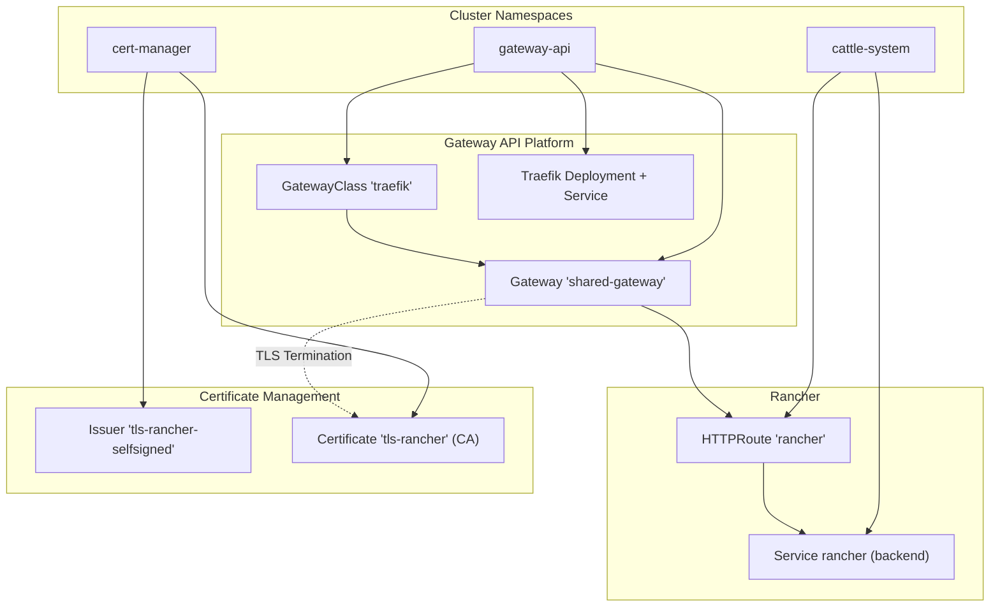
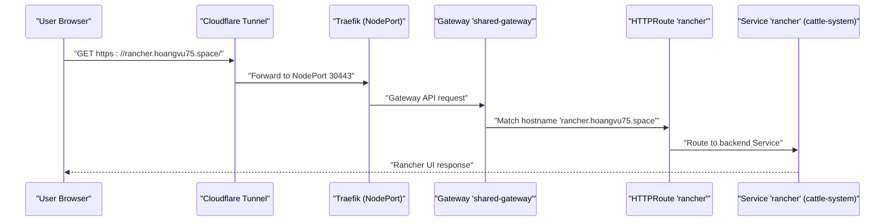
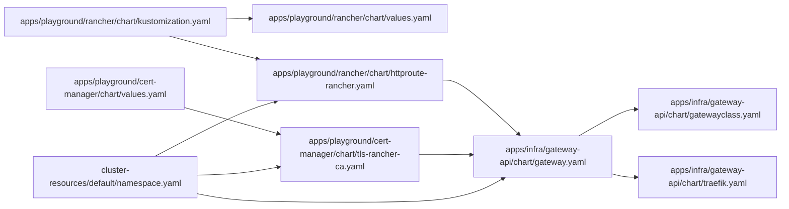

# Rancher Management Interface

<cite>
**Referenced Files in This Document**
- [README.md](file://README.md)
- [kustomization.yaml](file://kustomization.yaml)
- [apps/playground/rancher/chart/values.yaml](file://apps/playground/rancher/chart/values.yaml)
- [apps/playground/rancher/chart/kustomization.yaml](file://apps/playground/rancher/chart/kustomization.yaml)
- [apps/playground/rancher/config.yaml](file://apps/playground/rancher/config.yaml)
- [apps/playground/rancher/chart/httproute-rancher.yaml](file://apps/playground/rancher/chart/httproute-rancher.yaml)
- [apps/infra/gateway-api/chart/kustomization.yaml](file://apps/infra/gateway-api/chart/kustomization.yaml)
- [apps/infra/gateway-api/chart/gatewayclass.yaml](file://apps/infra/gateway-api/chart/gatewayclass.yaml)
- [apps/infra/gateway-api/chart/gateway.yaml](file://apps/infra/gateway-api/chart/gateway.yaml)
- [apps/infra/gateway-api/chart/traefik.yaml](file://apps/infra/gateway-api/chart/traefik.yaml)
- [apps/playground/cert-manager/chart/tls-rancher-ca.yaml](file://apps/playground/cert-manager/chart/tls-rancher-ca.yaml)
- [apps/playground/cert-manager/chart/values.yaml](file://apps/playground/cert-manager/chart/values.yaml)
- [apps/playground/cert-manager/config.yaml](file://apps/playground/cert-manager/config.yaml)
- [cluster-resources/default/namespace.yaml](file://cluster-resources/default/namespace.yaml)
- [bootstrap/cluster-resources.yaml](file://bootstrap/cluster-resources.yaml)
</cite>

## Table of Contents
1. [Introduction](#introduction)
2. [Project Structure](#project-structure)
3. [Core Components](#core-components)
4. [Architecture Overview](#architecture-overview)
5. [Detailed Component Analysis](#detailed-component-analysis)
6. [Dependency Analysis](#dependency-analysis)
7. [Performance Considerations](#performance-considerations)
8. [Troubleshooting Guide](#troubleshooting-guide)
9. [Conclusion](#conclusion)
10. [Appendices](#appendices)

## Introduction
This document explains how the Rancher management interface is deployed and configured in this GitOps-driven Kubernetes cluster. It covers the Helm chart installation via Kustomize/Helm, high availability and persistence considerations, HTTPRoute-based ingress using the Gateway API, custom domain and certificate management, Rancher server configuration parameters, and operational guidance for multi-cluster management, cluster registration, and security hardening. Practical examples focus on cluster import workflows, node pool management, and accessing the Rancher dashboard.

## Project Structure
The Rancher stack is composed of:
- A Rancher Helm chart packaged via Kustomize with a dedicated values file and an HTTPRoute for ingress.
- A Gateway API platform powered by Traefik, including GatewayClass, Gateway, and Traefik controller resources.
- A local CA and certificate for Rancher using cert-manager.
- Shared cluster namespaces created early in the sync order to ensure prerequisites are present.

**Diagram sources**
- [apps/infra/gateway-api/chart/gatewayclass.yaml:1-10](file://apps/infra/gateway-api/chart/gatewayclass.yaml#L1-L10)
- [apps/infra/gateway-api/chart/gateway.yaml:1-27](file://apps/infra/gateway-api/chart/gateway.yaml#L1-L27)
- [apps/infra/gateway-api/chart/traefik.yaml:1-120](file://apps/infra/gateway-api/chart/traefik.yaml#L1-L120)
- [apps/playground/rancher/chart/httproute-rancher.yaml:1-30](file://apps/playground/rancher/chart/httproute-rancher.yaml#L1-L30)
- [apps/playground/cert-manager/chart/tls-rancher-ca.yaml:1-34](file://apps/playground/cert-manager/chart/tls-rancher-ca.yaml#L1-L34)

**Section sources**
- [README.md:1-163](file://README.md#L1-L163)
- [kustomization.yaml:1-21](file://kustomization.yaml#L1-L21)

## Core Components
- Rancher Helm chart deployment via Kustomize with a dedicated values file and HTTPRoute.
- Gateway API platform with Traefik as the controller, exposing HTTP and HTTPS listeners.
- Local CA and certificate for Rancher issued by cert-manager.
- Shared namespaces created early to guarantee prerequisites exist before dependent apps deploy.

Key configuration highlights:
- Rancher values include hostname, initial admin password, replica count, and disabled ingress.
- Rancher HTTPRoute references the shared Gateway and sets forwarding headers for HTTPS.
- Gateway exposes HTTP/HTTPS listeners and terminates TLS with a wildcard certificate secret.
- cert-manager provisions a self-signed CA and a local Rancher certificate in the cattle-system namespace.

**Section sources**
- [apps/playground/rancher/chart/values.yaml:1-9](file://apps/playground/rancher/chart/values.yaml#L1-L9)
- [apps/playground/rancher/chart/kustomization.yaml:1-13](file://apps/playground/rancher/chart/kustomization.yaml#L1-L13)
- [apps/playground/rancher/config.yaml:1-5](file://apps/playground/rancher/config.yaml#L1-L5)
- [apps/playground/rancher/chart/httproute-rancher.yaml:1-30](file://apps/playground/rancher/chart/httproute-rancher.yaml#L1-L30)
- [apps/infra/gateway-api/chart/gatewayclass.yaml:1-10](file://apps/infra/gateway-api/chart/gatewayclass.yaml#L1-L10)
- [apps/infra/gateway-api/chart/gateway.yaml:1-27](file://apps/infra/gateway-api/chart/gateway.yaml#L1-L27)
- [apps/infra/gateway-api/chart/traefik.yaml:1-120](file://apps/infra/gateway-api/chart/traefik.yaml#L1-L120)
- [apps/playground/cert-manager/chart/tls-rancher-ca.yaml:1-34](file://apps/playground/cert-manager/chart/tls-rancher-ca.yaml#L1-L34)
- [apps/playground/cert-manager/chart/values.yaml:1-6](file://apps/playground/cert-manager/chart/values.yaml#L1-L6)
- [apps/playground/cert-manager/config.yaml:1-5](file://apps/playground/cert-manager/config.yaml#L1-L5)
- [cluster-resources/default/namespace.yaml:1-52](file://cluster-resources/default/namespace.yaml#L1-L52)

## Architecture Overview
Rancher is exposed through the Gateway API using Traefik as the controller. The network flow is:
- External traffic reaches the cluster via Cloudflare tunnel.
- Traefik listens on NodePorts and acts as the Gateway API controller.
- The Gateway routes traffic to HTTPRoutes by hostname.
- The Rancher HTTPRoute forwards to the Rancher Service on port 80.
- TLS termination occurs at the Gateway using a wildcard certificate secret.

**Diagram sources**
- [README.md:38-48](file://README.md#L38-L48)
- [apps/infra/gateway-api/chart/gateway.yaml:1-27](file://apps/infra/gateway-api/chart/gateway.yaml#L1-L27)
- [apps/playground/rancher/chart/httproute-rancher.yaml:1-30](file://apps/playground/rancher/chart/httproute-rancher.yaml#L1-L30)

**Section sources**
- [README.md:38-48](file://README.md#L38-L48)

## Detailed Component Analysis

### Rancher Helm Chart Installation and Configuration
- Deployment method: Rancher is installed via a Helm chart packaged through Kustomize. The chart is fetched from the official Rancher releases repository and deployed into the cattle-system namespace.
- Values customization: The values file sets the Rancher hostname, initial admin password, replica count, and disables the Rancher ingress (since Gateway API is used).
- HTTPRoute integration: An HTTPRoute named rancher is included alongside the chart to expose Rancher via the Gateway API, setting proper headers for HTTPS.

Operational notes:
- High availability: The replica count is configurable in values; increasing it enables HA mode.
- Persistent storage: The values file does not define persistence; for production, configure persistent storage in the values file according to Rancher’s HA requirements.
- Ingress choice: Since ingress is disabled in values, all external access is handled by the HTTPRoute and Gateway.

**Section sources**
- [apps/playground/rancher/chart/kustomization.yaml:1-13](file://apps/playground/rancher/chart/kustomization.yaml#L1-L13)
- [apps/playground/rancher/chart/values.yaml:1-9](file://apps/playground/rancher/chart/values.yaml#L1-L9)
- [apps/playground/rancher/chart/httproute-rancher.yaml:1-30](file://apps/playground/rancher/chart/httproute-rancher.yaml#L1-L30)

### HTTPRoute Setup for Rancher Access
- Parent reference: The HTTPRoute references the shared Gateway in the gateway-api namespace.
- Hostname: The route matches the Rancher hostname and forwards to the Rancher Service on port 80.
- Header filters: The route injects X-Forwarded-Proto and X-Forwarded-Port headers to inform Rancher that traffic arrives over HTTPS.
- Sync order: The HTTPRoute is applied after the Gateway exists, ensuring routing resolution.

Practical steps:
- Verify the Gateway exists and is ready.
- Confirm the HTTPRoute is applied in the cattle-system namespace.
- Ensure DNS resolves the Rancher hostname to the cluster ingress endpoint.

**Section sources**
- [apps/playground/rancher/chart/httproute-rancher.yaml:1-30](file://apps/playground/rancher/chart/httproute-rancher.yaml#L1-L30)
- [apps/infra/gateway-api/chart/gateway.yaml:1-27](file://apps/infra/gateway-api/chart/gateway.yaml#L1-L27)

### Gateway API Platform (Traefik)
- GatewayClass: Defines the Traefik controller for Gateway API.
- Gateway: Exposes HTTP (port 80) and HTTPS (port 443) listeners, allowing routes from all namespaces and terminating TLS with a certificate reference.
- Traefik controller: Runs as a Deployment and Service in the gateway-api namespace with minimal resource requests and NodePort exposure.

Operational notes:
- The Gateway TLS termination uses a wildcard certificate secret referenced by the Gateway.
- Traefik watches Gateway API resources and programs routing dynamically.

**Section sources**
- [apps/infra/gateway-api/chart/gatewayclass.yaml:1-10](file://apps/infra/gateway-api/chart/gatewayclass.yaml#L1-L10)
- [apps/infra/gateway-api/chart/gateway.yaml:1-27](file://apps/infra/gateway-api/chart/gateway.yaml#L1-L27)
- [apps/infra/gateway-api/chart/traefik.yaml:1-120](file://apps/infra/gateway-api/chart/traefik.yaml#L1-L120)

### Certificate Management for Rancher
- Local CA: A self-signed Issuer is created to issue a CA certificate.
- Rancher certificate: A Certificate resource issues a CA certificate stored in a secret, intended for internal use.
- Namespace placement: Both Issuer and Certificate are created in the cattle-system namespace.
- cert-manager configuration: The chart values enable CRD installation and leader election namespace is set.

Operational notes:
- The Gateway references a wildcard certificate secret; ensure it exists and is valid.
- The Rancher certificate can be used for internal trust or as a CA for downstream components.

**Section sources**
- [apps/playground/cert-manager/chart/tls-rancher-ca.yaml:1-34](file://apps/playground/cert-manager/chart/tls-rancher-ca.yaml#L1-L34)
- [apps/playground/cert-manager/chart/values.yaml:1-6](file://apps/playground/cert-manager/chart/values.yaml#L1-L6)
- [apps/playground/cert-manager/config.yaml:1-5](file://apps/playground/cert-manager/config.yaml#L1-L5)

### Namespace Isolation and Shared Resources
- Shared namespaces: Namespaces for gateway-api, cert-manager, cattle-system, and others are pre-provisioned with a negative sync wave to ensure readiness before apps deploy.
- Rancher namespace: The cattle-system namespace is the target for Rancher resources.
- Sync waves: The overall sync order ensures prerequisites are created before dependent applications.

**Section sources**
- [cluster-resources/default/namespace.yaml:1-52](file://cluster-resources/default/namespace.yaml#L1-L52)
- [apps/playground/rancher/config.yaml:1-5](file://apps/playground/rancher/config.yaml#L1-L5)
- [apps/playground/cert-manager/config.yaml:1-5](file://apps/playground/cert-manager/config.yaml#L1-L5)
- [README.md:76-86](file://README.md#L76-L86)

### Multi-Cluster Management and Cluster Registration
- Rancher server configuration parameters: The values file sets the hostname and initial admin password; adjust replicas for HA.
- Cluster registration: After Rancher is reachable, register downstream clusters by downloading the cluster registration YAML from the Rancher UI and applying it to the target cluster.
- Multi-cluster management: Use Rancher’s built-in cluster management to monitor and operate imported clusters.

Note: The repository does not include downstream cluster registration manifests; follow Rancher’s UI-guided process to generate and apply the registration YAML.

**Section sources**
- [apps/playground/rancher/chart/values.yaml:1-9](file://apps/playground/rancher/chart/values.yaml#L1-L9)

### Node Pool Management and Dashboard Access
- Node pools: Manage worker nodes and taints in downstream clusters via your cloud provider console or CLI.
- Dashboard access: Navigate to the Rancher UI using the configured hostname and log in with the initial admin password from the values file.

Note: The repository does not include node pool manifests; manage node pools externally and ensure network policies allow access to the Rancher UI.

**Section sources**
- [apps/playground/rancher/chart/values.yaml:1-9](file://apps/playground/rancher/chart/values.yaml#L1-L9)

## Dependency Analysis
The Rancher stack depends on:
- Gateway API platform (GatewayClass, Gateway, Traefik) for ingress.
- cert-manager for issuing a local CA and certificate.
- Shared namespaces created early to avoid race conditions.

**Diagram sources**
- [apps/playground/rancher/chart/kustomization.yaml:1-13](file://apps/playground/rancher/chart/kustomization.yaml#L1-L13)
- [apps/playground/rancher/chart/values.yaml:1-9](file://apps/playground/rancher/chart/values.yaml#L1-L9)
- [apps/playground/rancher/chart/httproute-rancher.yaml:1-30](file://apps/playground/rancher/chart/httproute-rancher.yaml#L1-L30)
- [apps/infra/gateway-api/chart/gatewayclass.yaml:1-10](file://apps/infra/gateway-api/chart/gatewayclass.yaml#L1-L10)
- [apps/infra/gateway-api/chart/gateway.yaml:1-27](file://apps/infra/gateway-api/chart/gateway.yaml#L1-L27)
- [apps/infra/gateway-api/chart/traefik.yaml:1-120](file://apps/infra/gateway-api/chart/traefik.yaml#L1-L120)
- [apps/playground/cert-manager/chart/values.yaml:1-6](file://apps/playground/cert-manager/chart/values.yaml#L1-L6)
- [apps/playground/cert-manager/chart/tls-rancher-ca.yaml:1-34](file://apps/playground/cert-manager/chart/tls-rancher-ca.yaml#L1-L34)
- [cluster-resources/default/namespace.yaml:1-52](file://cluster-resources/default/namespace.yaml#L1-L52)

**Section sources**
- [apps/playground/rancher/chart/kustomization.yaml:1-13](file://apps/playground/rancher/chart/kustomization.yaml#L1-L13)
- [apps/infra/gateway-api/chart/kustomization.yaml:1-8](file://apps/infra/gateway-api/chart/kustomization.yaml#L1-L8)
- [apps/playground/cert-manager/chart/kustomization.yaml:1-8](file://apps/playground/cert-manager/chart/kustomization.yaml#L1-L8)

## Performance Considerations
- Horizontal scaling: Increase the Rancher replica count in the values file to improve availability and throughput.
- Resource requests: Tune CPU and memory requests/limits for the Rancher pods and the Traefik Gateway controller based on workload.
- Storage: Configure persistent volumes for Rancher in HA mode to maintain state across restarts.
- Gateway performance: Ensure the Gateway and Traefik controller are sized appropriately for the number of HTTPRoutes and TLS handshakes.

[No sources needed since this section provides general guidance]

## Troubleshooting Guide
Common issues and resolutions:
- Rancher not reachable:
  - Verify the HTTPRoute exists in the cattle-system namespace and references the correct Gateway.
  - Confirm the Gateway is ready and listening on port 443.
  - Check that DNS resolves the Rancher hostname to the cluster ingress endpoint.
- TLS handshake errors:
  - Ensure the Gateway references a valid wildcard certificate secret.
  - Confirm the cert-manager Issuer and Certificate are created and healthy.
- Initial admin password:
  - Retrieve the initial admin password from the values file and use it to log in.
- Cluster registration failures:
  - Ensure the Rancher UI is accessible and the cluster’s kubeconfig is valid.
  - Confirm outbound connectivity from the target cluster to the Rancher hostname.
- Sync order problems:
  - Review the sync waves to ensure namespaces and Gateway resources are created before Rancher and HTTPRoute.

**Section sources**
- [apps/playground/rancher/chart/httproute-rancher.yaml:1-30](file://apps/playground/rancher/chart/httproute-rancher.yaml#L1-L30)
- [apps/infra/gateway-api/chart/gateway.yaml:1-27](file://apps/infra/gateway-api/chart/gateway.yaml#L1-L27)
- [apps/playground/cert-manager/chart/tls-rancher-ca.yaml:1-34](file://apps/playground/cert-manager/chart/tls-rancher-ca.yaml#L1-L34)
- [apps/playground/rancher/chart/values.yaml:1-9](file://apps/playground/rancher/chart/values.yaml#L1-L9)
- [README.md:76-86](file://README.md#L76-L86)

## Conclusion
This repository provides a complete, GitOps-driven deployment of the Rancher management interface using the Gateway API and Traefik. The setup includes a local CA for certificate management, strict sync ordering for prerequisites, and a clear path for multi-cluster management and cluster registration. For production, scale replicas, configure persistent storage, and harden security with RBAC and audit logging as outlined in the Appendices.

[No sources needed since this section summarizes without analyzing specific files]

## Appendices

### Security Considerations
- Administrative access:
  - Change the initial admin password immediately after first login.
  - Enforce strong authentication and consider integrating with an external identity provider.
- RBAC configuration:
  - Define roles and role bindings to limit administrative privileges.
  - Apply least-privilege principles to users and service accounts.
- Audit logging:
  - Enable Rancher audit logging to track administrative actions.
  - Centralize logs for monitoring and compliance.

[No sources needed since this section provides general guidance]

### Practical Examples

#### Cluster Import Workflow
- From the Rancher UI, navigate to the cluster to import.
- Click “Create” to generate the registration YAML.
- Apply the generated YAML to the downstream cluster using kubectl.
- Return to Rancher to confirm the cluster appears and becomes active.

[No sources needed since this section provides general guidance]

#### Node Pool Management
- Manage node pools via your cloud provider console or CLI.
- Ensure adequate capacity and appropriate taints for control plane vs. worker nodes.
- Validate that the target cluster’s kubeconfig remains valid for Rancher registration.

[No sources needed since this section provides general guidance]

#### Rancher Dashboard Access
- Open the configured hostname in a browser.
- Log in with the initial admin password from the values file.
- Change the password and configure users and RBAC as needed.

**Section sources**
- [apps/playground/rancher/chart/values.yaml:1-9](file://apps/playground/rancher/chart/values.yaml#L1-L9)