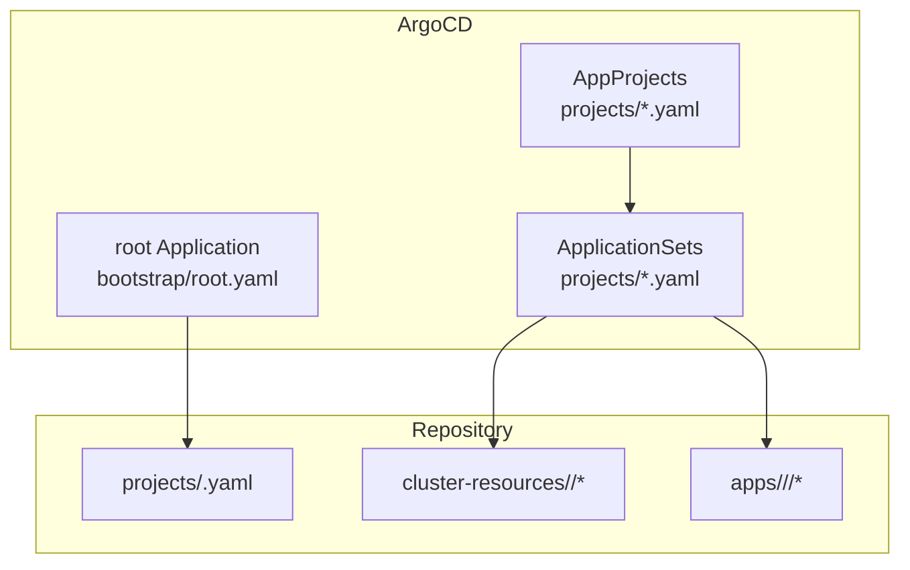
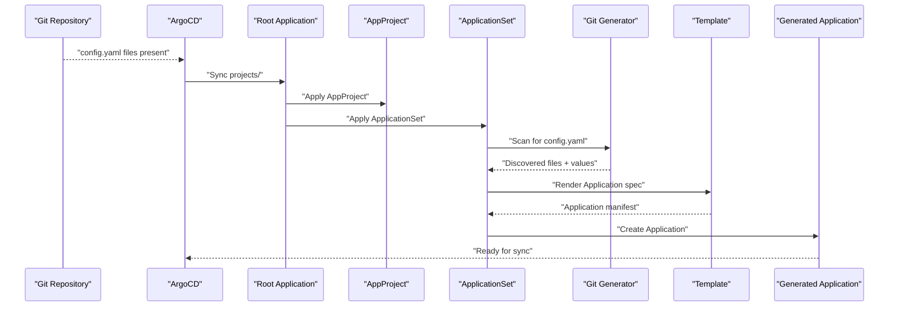
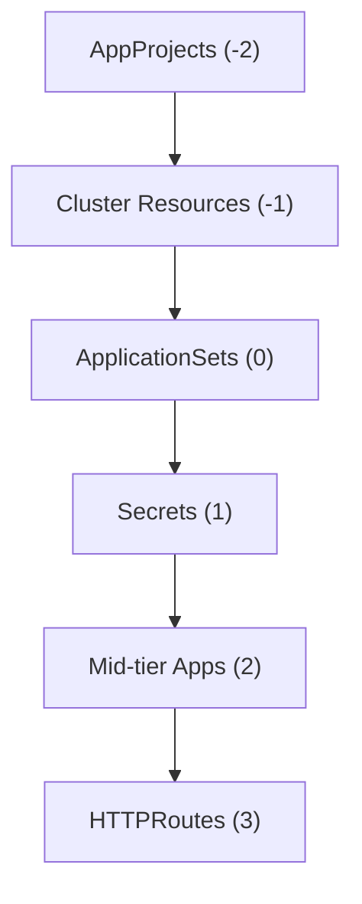
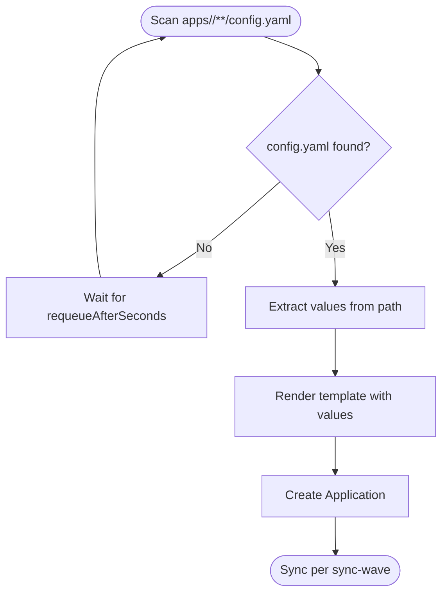
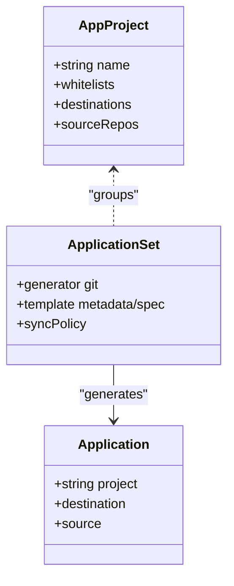

# ApplicationSets Overview

<cite>
**Referenced Files in This Document**
- [README.md](file://README.md)
- [infra.yaml](file://projects/infra.yaml)
- [playground.yaml](file://projects/playground.yaml)
- [root.yaml](file://bootstrap/root.yaml)
- [cluster-resources.yaml](file://bootstrap/cluster-resources.yaml)
- [secrets.yaml](file://bootstrap/secrets.yaml)
- [namespace.yaml](file://cluster-resources/default/namespace.yaml)
- [cloudflared config.yaml](file://apps/infra/cloudflared/config.yaml)
- [datadog config.yaml](file://apps/infra/datadog/config.yaml)
- [argocd-ingress config.yaml](file://apps/playground/argocd-ingress/config.yaml)
- [rancher config.yaml](file://apps/playground/rancher/config.yaml)
- [cloudflared kustomization.yaml](file://apps/infra/cloudflared/kustomization.yaml)
- [argocd-ingress kustomization.yaml](file://apps/playground/argocd-ingress/kustomization.yaml)
</cite>

## Table of Contents
1. [Introduction](#introduction)
2. [Project Structure](#project-structure)
3. [Core Components](#core-components)
4. [Architecture Overview](#architecture-overview)
5. [Detailed Component Analysis](#detailed-component-analysis)
6. [Dependency Analysis](#dependency-analysis)
7. [Performance Considerations](#performance-considerations)
8. [Troubleshooting Guide](#troubleshooting-guide)
9. [Conclusion](#conclusion)
10. [Appendices](#appendices)

## Introduction
This document explains the ArgoCD ApplicationSets architecture and implementation used in this repository. ApplicationSets act as dynamic application generators that scan the repository for per-application configuration files and automatically create ArgoCD Applications. This enables scalable, declarative management of many applications with consistent templates, grouping via AppProjects, and ordered synchronization through sync waves.

Key goals:
- Automatically discover applications by scanning repository structure for config files
- Generate ArgoCD Applications dynamically using a shared template
- Group applications into AppProjects for permissions and scoping
- Control deployment order using sync waves
- Simplify infrastructure management with GitOps

## Project Structure
The repository follows a GitOps pattern:
- A root Application (bootstrap) points to the projects directory
- AppProjects define boundaries and permissions
- ApplicationSets scan for per-app config.yaml files and generate Applications
- Per-app folders contain Kustomize manifests and optional Helm charts
- Shared cluster resources and namespaces are provisioned with earlier sync waves

**Diagram sources**
- [root.yaml:15-18](file://bootstrap/root.yaml#L15-L18)
- [infra.yaml:23-45](file://projects/infra.yaml#L23-L45)
- [playground.yaml:23-45](file://projects/playground.yaml#L23-L45)

**Section sources**
- [README.md:57-118](file://README.md#L57-L118)
- [root.yaml:15-18](file://bootstrap/root.yaml#L15-L18)
- [infra.yaml:23-45](file://projects/infra.yaml#L23-L45)
- [playground.yaml:23-45](file://projects/playground.yaml#L23-L45)

## Core Components
- AppProject: Defines resource whitelists, destinations, and source repositories for a logical grouping of applications.
- ApplicationSet: Scans the repository for matching files and generates ArgoCD Applications using a shared template and optional values.
- Application (per app): Represents a single generated ArgoCD Application that deploys a specific app’s manifests via Kustomize and optional Helm.
- Root Application: Bootstraps the system by syncing the projects directory, which contains AppProjects and ApplicationSets.

How discovery works:
- ApplicationSets use a Git generator to scan for config.yaml files under specific paths
- Values extracted from the file path are passed into the template to construct Application metadata, destination, and source
- Generated Applications are grouped into AppProjects and synchronized according to sync waves

**Section sources**
- [infra.yaml:2-21](file://projects/infra.yaml#L2-L21)
- [playground.yaml:2-21](file://projects/playground.yaml#L2-L21)
- [infra.yaml:33-45](file://projects/infra.yaml#L33-L45)
- [playground.yaml:33-45](file://projects/playground.yaml#L33-L45)
- [root.yaml:15-18](file://bootstrap/root.yaml#L15-L18)

## Architecture Overview
The system uses a layered approach:
- Bootstrap layer: Root Application syncs projects
- Project layer: AppProjects and ApplicationSets
- Discovery layer: ApplicationSets scan for config.yaml files
- Generation layer: ApplicationSet template produces Applications
- Execution layer: ArgoCD synchronizes Applications per sync wave

**Diagram sources**
- [root.yaml:15-18](file://bootstrap/root.yaml#L15-L18)
- [infra.yaml:33-45](file://projects/infra.yaml#L33-L45)
- [playground.yaml:33-45](file://projects/playground.yaml#L33-L45)

## Detailed Component Analysis

### AppProject: Grouping and Permissions
- AppProjects define allowed destinations, cluster and namespace resource whitelists, and source repositories.
- They also carry sync-wave annotations to control when the project itself is applied during bootstrap.

Benefits:
- Logical separation of concerns
- Controlled access and resource scoping
- Consistent sync ordering across the project

**Section sources**
- [infra.yaml:2-21](file://projects/infra.yaml#L2-L21)
- [playground.yaml:2-21](file://projects/playground.yaml#L2-L21)

### ApplicationSet: Dynamic Discovery and Generation
- Generators: Git generator scans for config.yaml files under specific paths and extracts values from the file path.
- Template: Builds Application metadata, destination, project, and source based on values and per-app overrides.
- Sync Policy: Automated sync with pruning and self-healing; retry policy configured; optional sync options.

Generator behavior:
- Scans for config.yaml under apps/<project>/**/
- Extracts values such as project name, app name, and repo URL placeholders
- Passes values into the template to compute Application fields

Template behavior:
- Computes Application name, destination namespace, project, repoURL, and source path
- Supports per-app overrides via config.yaml (e.g., destNamespace, annotations)

Sync policy:
- Automated sync with pruning and self-healing
- Retry policy with bounded backoff
- Optional sync options for robustness

**Section sources**
- [infra.yaml:33-85](file://projects/infra.yaml#L33-L85)
- [playground.yaml:33-90](file://projects/playground.yaml#L33-L90)

### Per-App Configuration: config.yaml
Per-app config.yaml files provide:
- Optional destination namespace override
- Optional annotations, including per-app sync-wave

Examples:
- Infrastructure apps set destNamespace and sync-wave
- Playground apps expose UIs via HTTPRoutes and set appropriate namespaces and waves

**Section sources**
- [cloudflared config.yaml:1-4](file://apps/infra/cloudflared/config.yaml#L1-L4)
- [datadog config.yaml:1-6](file://apps/infra/datadog/config.yaml#L1-L6)
- [argocd-ingress config.yaml:1-4](file://apps/playground/argocd-ingress/config.yaml#L1-L4)
- [rancher config.yaml:1-5](file://apps/playground/rancher/config.yaml#L1-L5)

### Manifest Composition: Kustomization and Helm
- Each app folder contains a Kustomization that sets the namespace and references a chart directory
- Kustomize buildOptions enable Helm integration for rendering charts
- This allows mixing static manifests and templated charts consistently across apps

**Section sources**
- [cloudflared kustomization.yaml:1-8](file://apps/infra/cloudflared/kustomization.yaml#L1-L8)
- [argocd-ingress kustomization.yaml:1-9](file://apps/playground/argocd-ingress/kustomization.yaml#L1-L9)
- [infra.yaml:59-60](file://projects/infra.yaml#L59-L60)
- [playground.yaml:59-60](file://projects/playground.yaml#L59-L60)

### Bootstrap and Cluster Resources
- Root Application points to projects and ignores certain diffs for ApplicationSet templates
- Cluster resources ApplicationSet provisions shared namespaces and other cluster-level objects
- Secrets Application syncs a private repository at a specific wave to avoid exposing credentials

**Section sources**
- [root.yaml:15-36](file://bootstrap/root.yaml#L15-L36)
- [cluster-resources.yaml:1-33](file://bootstrap/cluster-resources.yaml#L1-L33)
- [secrets.yaml:1-24](file://bootstrap/secrets.yaml#L1-L24)

## Dependency Analysis
The system exhibits clear dependency ordering:
- AppProjects are applied first (wave -2) to establish boundaries
- Shared namespaces are created early (wave -1) so apps can reference them
- ApplicationSets are applied at wave 0 to generate Applications
- Secrets are applied at wave 1 to supply credentials
- Mid-tier apps (wave 2) depend on cluster resources
- HTTPRoutes are applied last (wave 3) to ensure Gateways exist

**Diagram sources**
- [README.md:76-85](file://README.md#L76-L85)
- [infra.yaml:6-7](file://projects/infra.yaml#L6-L7)
- [playground.yaml:6-7](file://projects/playground.yaml#L6-L7)
- [cluster-resources.yaml:4-5](file://bootstrap/cluster-resources.yaml#L4-L5)
- [secrets.yaml:7](file://bootstrap/secrets.yaml#L7)
- [cloudflared config.yaml:3](file://apps/infra/cloudflared/config.yaml#L3)
- [argocd-ingress config.yaml:3](file://apps/playground/argocd-ingress/config.yaml#L3)

**Section sources**
- [README.md:76-85](file://README.md#L76-L85)
- [namespace.yaml:1-52](file://cluster-resources/default/namespace.yaml#L1-L52)

## Performance Considerations
- Requeue interval: Git generator requeues periodically to detect changes efficiently
- Retry policy: Bounded retries with constant backoff reduce transient failure impact
- Dry-run optimization: Using sync options can skip dry-runs for missing resources when safe
- Template computation: Go templates with minimal branching keep generation fast

[No sources needed since this section provides general guidance]

## Troubleshooting Guide
Common issues and resolutions:
- Application not appearing
  - Verify config.yaml exists under the expected path and is readable by the Git generator
  - Confirm ApplicationSet is applied and scanning the correct path
- Wrong destination namespace
  - Check per-app config.yaml for destNamespace override
  - Ensure template logic resolves to the intended namespace
- Sync order problems
  - Adjust per-app or ApplicationSet sync-wave annotations
  - Review shared namespace creation wave to ensure prerequisites
- Missing credentials
  - Ensure Secrets Application is applied at the correct wave and repo URL is substituted
- Helm rendering failures
  - Confirm Kustomize buildOptions include enabling Helm
  - Validate chart references and values in per-app Kustomization

**Section sources**
- [README.md:128-134](file://README.md#L128-L134)
- [infra.yaml:59-60](file://projects/infra.yaml#L59-L60)
- [playground.yaml:59-60](file://projects/playground.yaml#L59-L60)
- [cloudflared config.yaml:1-4](file://apps/infra/cloudflared/config.yaml#L1-L4)
- [argocd-ingress config.yaml:1-4](file://apps/playground/argocd-ingress/config.yaml#L1-L4)

## Conclusion
ApplicationSets provide a powerful mechanism to scale GitOps deployments by dynamically discovering and generating Applications from repository structure. Combined with AppProjects for grouping and sync waves for ordering, this approach simplifies infrastructure management, improves consistency, and reduces manual overhead across many applications.

[No sources needed since this section summarizes without analyzing specific files]

## Appendices

### Appendix A: How Discovery Works
- Git generator scans for config.yaml files matching the specified path pattern
- Values extracted from the file path are passed into the template
- Template constructs Application metadata, destination, project, and source
- Generated Applications are grouped into AppProjects and synchronized per sync wave

**Diagram sources**
- [infra.yaml:38-45](file://projects/infra.yaml#L38-L45)
- [playground.yaml:38-45](file://projects/playground.yaml#L38-L45)
- [infra.yaml:46-85](file://projects/infra.yaml#L46-L85)
- [playground.yaml:46-90](file://projects/playground.yaml#L46-L90)

### Appendix B: Relationship Between ApplicationSets and AppProjects
- AppProjects define the logical grouping and permissions boundary
- ApplicationSets generate Applications that belong to the associated AppProject
- Both share the same project name in values and template fields

**Diagram sources**
- [infra.yaml:2-21](file://projects/infra.yaml#L2-L21)
- [infra.yaml:23-85](file://projects/infra.yaml#L23-L85)
- [playground.yaml:2-21](file://projects/playground.yaml#L2-L21)
- [playground.yaml:23-90](file://projects/playground.yaml#L23-L90)

### Appendix C: Configuration Examples (by reference)
- ApplicationSet generators and template (Infrastructure project)
  - [infra.yaml:33-85](file://projects/infra.yaml#L33-L85)
- ApplicationSet generators and template (Playground project)
  - [playground.yaml:33-90](file://projects/playground.yaml#L33-L90)
- Per-app config.yaml with destNamespace and sync-wave
  - [cloudflared config.yaml:1-4](file://apps/infra/cloudflared/config.yaml#L1-L4)
  - [datadog config.yaml:1-6](file://apps/infra/datadog/config.yaml#L1-L6)
  - [argocd-ingress config.yaml:1-4](file://apps/playground/argocd-ingress/config.yaml#L1-L4)
  - [rancher config.yaml:1-5](file://apps/playground/rancher/config.yaml#L1-L5)
- Root Application pointing to projects and ignoring diffs
  - [root.yaml:15-36](file://bootstrap/root.yaml#L15-L36)
- Cluster resources ApplicationSet provisioning namespaces
  - [cluster-resources.yaml:1-33](file://bootstrap/cluster-resources.yaml#L1-L33)
- Secrets Application sync with wave
  - [secrets.yaml:1-24](file://bootstrap/secrets.yaml#L1-L24)