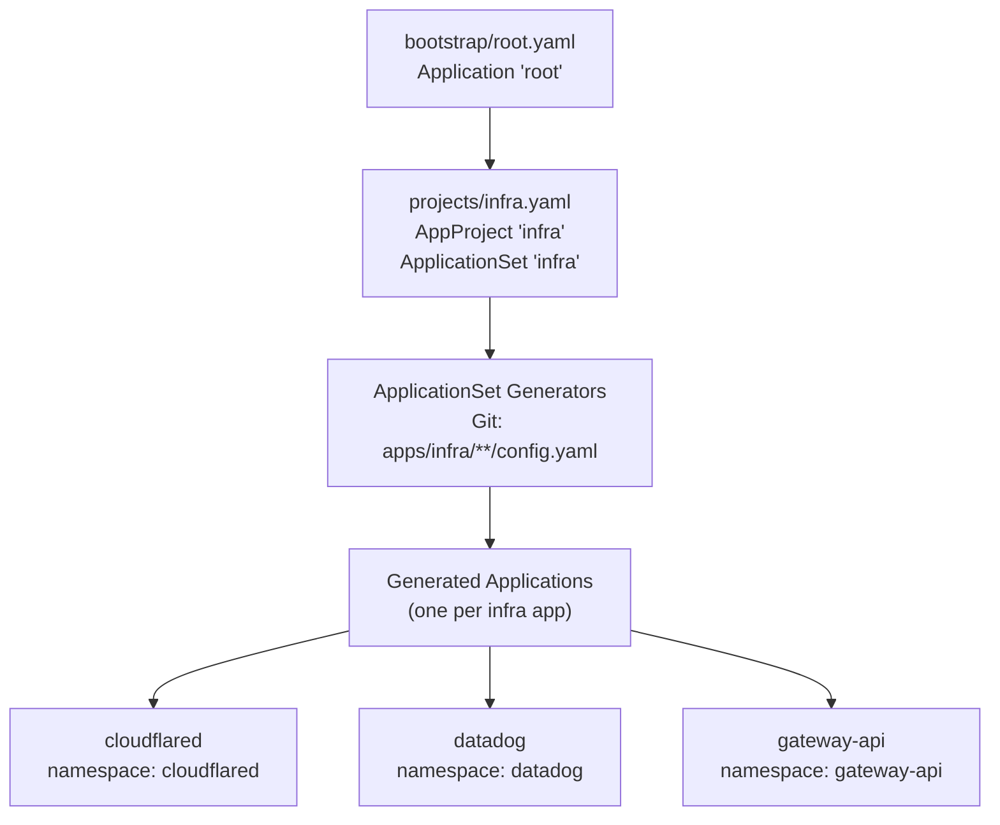
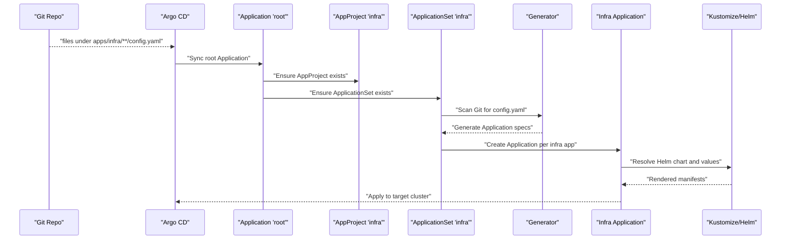
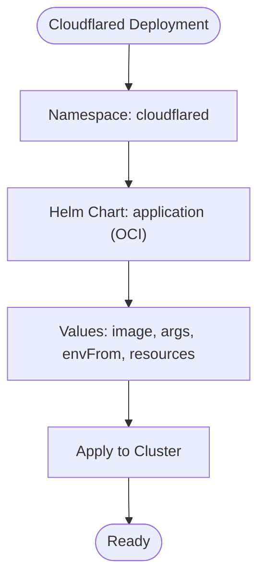
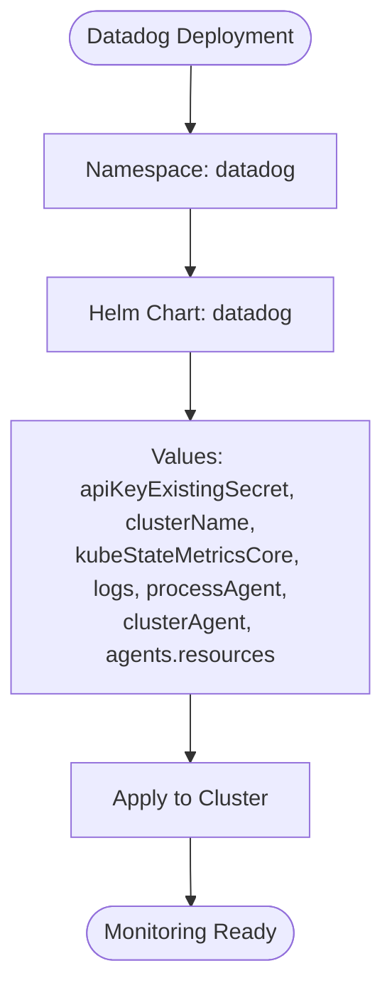
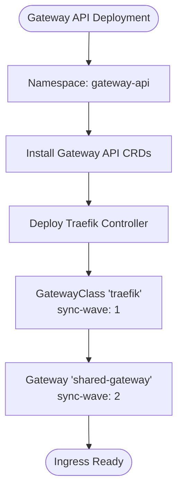
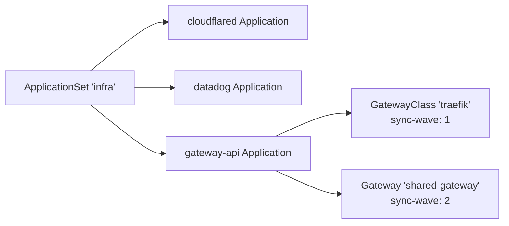

# Infrastructure Projects

<cite>
**Referenced Files in This Document**
- [infra.yaml](file://projects/infra.yaml)
- [root.yaml](file://bootstrap/root.yaml)
- [cloudflared config.yaml](file://apps/infra/cloudflared/config.yaml)
- [cloudflared kustomization.yaml](file://apps/infra/cloudflared/kustomization.yaml)
- [cloudflared chart kustomization.yaml](file://apps/infra/cloudflared/chart/kustomization.yaml)
- [cloudflared chart values.yaml](file://apps/infra/cloudflared/chart/values.yaml)
- [datadog config.yaml](file://apps/infra/datadog/config.yaml)
- [datadog kustomization.yaml](file://apps/infra/datadog/kustomization.yaml)
- [datadog chart kustomization.yaml](file://apps/infra/datadog/chart/kustomization.yaml)
- [datadog chart values.yaml](file://apps/infra/datadog/chart/values.yaml)
- [gateway-api config.yaml](file://apps/infra/gateway-api/config.yaml)
- [gateway-api kustomization.yaml](file://apps/infra/gateway-api/kustomization.yaml)
- [gateway-api chart kustomization.yaml](file://apps/infra/gateway-api/chart/kustomization.yaml)
- [gateway-api gatewayclass.yaml](file://apps/infra/gateway-api/chart/gatewayclass.yaml)
- [gateway-api gateway.yaml](file://apps/infra/gateway-api/chart/gateway.yaml)
</cite>

## Table of Contents
1. [Introduction](#introduction)
2. [Project Structure](#project-structure)
3. [Core Components](#core-components)
4. [Architecture Overview](#architecture-overview)
5. [Detailed Component Analysis](#detailed-component-analysis)
6. [Dependency Analysis](#dependency-analysis)
7. [Performance Considerations](#performance-considerations)
8. [Troubleshooting Guide](#troubleshooting-guide)
9. [Conclusion](#conclusion)

## Introduction
This document explains how the infrastructure project is managed using Argo CD ApplicationSet. It describes how infra.yaml defines the infrastructure ApplicationSet that provisions and maintains critical cluster infrastructure components. It also documents the separation of infrastructure applications from user applications, including namespace isolation and deployment strategies. The infrastructure applications covered are:
- Cloudflared tunnel for secure connectivity
- Datadog monitoring agent for observability
- Gateway API controller for ingress management

It further explains sync waves and ordering to ensure a safe startup sequence, highlights configuration options specific to infrastructure applications, and provides troubleshooting guidance for common deployment failures.

## Project Structure
The infrastructure project is organized under projects/infra.yaml and is bootstrapped via bootstrap/root.yaml. The ApplicationSet scans Git paths matching apps/infra/**/config.yaml to generate per-cluster Applications. Each infrastructure application defines its own namespace and Helm chart configuration.

**Diagram sources**
- [root.yaml:1-37](file://bootstrap/root.yaml#L1-L37)
- [infra.yaml:23-85](file://projects/infra.yaml#L23-L85)

**Section sources**
- [root.yaml:1-37](file://bootstrap/root.yaml#L1-L37)
- [infra.yaml:1-85](file://projects/infra.yaml#L1-L85)

## Core Components
- AppProject infra: Defines the project scope, permissions, and sync wave for infrastructure. It allows whitelisting of cluster and namespace resources and targets all destinations and repositories.
- ApplicationSet infra: Scans Git for infrastructure app configs, generates Applications with per-app namespace and source path, and applies sync policy and retry behavior.
- Namespace isolation: Each infrastructure app deploys into its own namespace (cloudflared, datadog, gateway-api) to prevent cross-contamination and simplify ownership.
- Sync waves: Infrastructure apps are scheduled with explicit sync waves to ensure proper startup order.

Key configuration anchors:
- AppProject annotations set sync wave and pruning behavior for the project.
- ApplicationSet sets a base sync wave and uses per-resource annotations to fine-tune ordering.
- Per-app config.yaml files override destination namespace and set per-resource sync waves.

**Section sources**
- [infra.yaml:1-21](file://projects/infra.yaml#L1-L21)
- [infra.yaml:23-85](file://projects/infra.yaml#L23-L85)
- [cloudflared config.yaml:1-4](file://apps/infra/cloudflared/config.yaml#L1-L4)
- [datadog config.yaml:1-6](file://apps/infra/datadog/config.yaml#L1-L6)
- [gateway-api config.yaml:1-6](file://apps/infra/gateway-api/config.yaml#L1-L6)

## Architecture Overview
The infrastructure lifecycle follows this flow:
- The root Application monitors the projects directory and ensures the infra AppProject and ApplicationSet exist.
- The ApplicationSet generator discovers apps/infra/**/config.yaml files and creates Applications for each infrastructure component.
- Each Application resolves its Helm chart via Kustomize, targeting the appropriate namespace and applying per-app overrides.

**Diagram sources**
- [root.yaml:10-18](file://bootstrap/root.yaml#L10-L18)
- [infra.yaml:33-58](file://projects/infra.yaml#L33-L58)
- [cloudflared chart kustomization.yaml:4-10](file://apps/infra/cloudflared/chart/kustomization.yaml#L4-L10)
- [datadog chart kustomization.yaml:4-10](file://apps/infra/datadog/chart/kustomization.yaml#L4-L10)
- [gateway-api chart kustomization.yaml:4-7](file://apps/infra/gateway-api/chart/kustomization.yaml#L4-L7)

## Detailed Component Analysis

### Cloudflared Tunnel
Cloudflared provides secure connectivity to cluster services via Cloudflare tunnels. It is deployed into the cloudflared namespace and uses a Helm chart configured via values.yaml.

- Namespace isolation: Deployed to cloudflared namespace via kustomization.
- Helm chart: Uses a custom OCI repository and release name cloudflared.
- Security and runtime: Container runs with minimal probes; credentials are injected via a Kubernetes Secret mounted through envFrom.
- Resource requirements: Defined in values.yaml with CPU/memory requests/limits.

**Diagram sources**
- [cloudflared kustomization.yaml:4](file://apps/infra/cloudflared/kustomization.yaml#L4)
- [cloudflared chart kustomization.yaml:6-10](file://apps/infra/cloudflared/chart/kustomization.yaml#L6-L10)
- [cloudflared chart values.yaml:11-36](file://apps/infra/cloudflared/chart/values.yaml#L11-L36)

**Section sources**
- [cloudflared kustomization.yaml:1-8](file://apps/infra/cloudflared/kustomization.yaml#L1-L8)
- [cloudflared chart kustomization.yaml:1-11](file://apps/infra/cloudflared/chart/kustomization.yaml#L1-L11)
- [cloudflared chart values.yaml:1-40](file://apps/infra/cloudflared/chart/values.yaml#L1-L40)
- [cloudflared config.yaml:1-4](file://apps/infra/cloudflared/config.yaml#L1-L4)

### Datadog Monitoring Agent
Datadog provides cluster observability, metrics, logs, APM, and orchestrator explorer. It is deployed into the datadog namespace and uses the official Datadog Helm chart.

- Namespace isolation: Deployed to datadog namespace via kustomization.
- Helm chart: Official Datadog chart from helm.datadoghq.com.
- Credentials: API key is supplied via an existing Kubernetes Secret referenced in values.
- Workload placement: Tolerations allow scheduling on control plane nodes; resources are specified for the agent.

**Diagram sources**
- [datadog kustomization.yaml:4](file://apps/infra/datadog/kustomization.yaml#L4)
- [datadog chart kustomization.yaml:6](file://apps/infra/datadog/chart/kustomization.yaml#L6)
- [datadog chart values.yaml:1-89](file://apps/infra/datadog/chart/values.yaml#L1-L89)

**Section sources**
- [datadog kustomization.yaml:1-8](file://apps/infra/datadog/kustomization.yaml#L1-L8)
- [datadog chart kustomization.yaml:1-11](file://apps/infra/datadog/chart/kustomization.yaml#L1-L11)
- [datadog chart values.yaml:1-89](file://apps/infra/datadog/chart/values.yaml#L1-L89)
- [datadog config.yaml:1-6](file://apps/infra/datadog/config.yaml#L1-L6)

### Gateway API Controller and Shared Gateway
Gateway API introduces modern ingress abstractions. The gateway-api app installs standard CRDs and a controller (Traefik), then deploys a shared Gateway and GatewayClass.

- Namespace isolation: Deployed to gateway-api namespace via kustomization.
- CRDs and controller: Installed from upstream standard install manifest.
- GatewayClass: Declares Traefik as the controller; annotated with sync wave to ensure CRDs are ready first.
- Gateway: Defines HTTP/HTTPS listeners and references TLS certificates.

**Diagram sources**
- [gateway-api kustomization.yaml:7](file://apps/infra/gateway-api/kustomization.yaml#L7)
- [gateway-api chart kustomization.yaml:4-7](file://apps/infra/gateway-api/chart/kustomization.yaml#L4-L7)
- [gateway-api gatewayclass.yaml:6](file://apps/infra/gateway-api/chart/gatewayclass.yaml#L6)
- [gateway-api gateway.yaml:7](file://apps/infra/gateway-api/chart/gateway.yaml#L7)

**Section sources**
- [gateway-api kustomization.yaml:1-9](file://apps/infra/gateway-api/kustomization.yaml#L1-L9)
- [gateway-api chart kustomization.yaml:1-8](file://apps/infra/gateway-api/chart/kustomization.yaml#L1-L8)
- [gateway-api gatewayclass.yaml:1-10](file://apps/infra/gateway-api/chart/gatewayclass.yaml#L1-L10)
- [gateway-api gateway.yaml:1-27](file://apps/infra/gateway-api/chart/gateway.yaml#L1-L27)
- [gateway-api config.yaml:1-6](file://apps/infra/gateway-api/config.yaml#L1-L6)

## Dependency Analysis
The ApplicationSet generates Applications for each infrastructure component. Dependencies are resolved through:
- Namespace isolation: Each app targets its own namespace.
- Sync waves: Per-resource annotations ensure CRDs and controllers are applied before dependent resources.
- Kustomize/Helm: Each app’s chart is resolved independently, pulling values from its values.yaml.

**Diagram sources**
- [infra.yaml:33-58](file://projects/infra.yaml#L33-L58)
- [gateway-api gatewayclass.yaml:6](file://apps/infra/gateway-api/chart/gatewayclass.yaml#L6)
- [gateway-api gateway.yaml:7](file://apps/infra/gateway-api/chart/gateway.yaml#L7)

**Section sources**
- [infra.yaml:23-85](file://projects/infra.yaml#L23-L85)
- [gateway-api gatewayclass.yaml:1-10](file://apps/infra/gateway-api/chart/gatewayclass.yaml#L1-L10)
- [gateway-api gateway.yaml:1-27](file://apps/infra/gateway-api/chart/gateway.yaml#L1-L27)

## Performance Considerations
- Resource sizing: Each app’s values.yaml defines CPU/memory requests/limits. Adjust these based on observed cluster load and node capacity.
- Probes: Cloudflared disables liveness/readiness probes by default; ensure this aligns with your health checking strategy.
- Retries: The ApplicationSet sync policy includes retry configuration to handle transient failures during initial rollout.
- Tolerations: Datadog agents tolerate control plane nodes to ensure monitoring coverage; verify taint/toleration policies match your cluster topology.

[No sources needed since this section provides general guidance]

## Troubleshooting Guide
Common issues and resolutions:
- Missing namespaces: Ensure CreateNamespace is enabled for the project or per-application where needed. The root Application enables CreateNamespace globally.
- CRDs not found: Gateway API resources depend on CRDs being present. Verify the standard install manifest is applied before GatewayClass and Gateway.
- Credentials missing: Datadog requires an existing Secret containing the API key. Confirm the Secret exists and matches the name referenced in values.
- Tunnel connectivity: Cloudflared requires a valid tunnel token. Confirm the Secret referenced by envFrom exists and contains the expected key.
- Sync ordering: If resources fail due to missing dependencies, review per-resource sync-wave annotations and adjust as needed.

Operational anchors:
- Root Application enables CreateNamespace and allows empty resources to avoid blocking initialization.
- ApplicationSet retries with bounded backoff to recover from transient errors.
- Per-app config.yaml can override destination namespace and add sync-wave annotations for fine-grained ordering.

**Section sources**
- [root.yaml:34-36](file://bootstrap/root.yaml#L34-L36)
- [infra.yaml:66-71](file://projects/infra.yaml#L66-L71)
- [gateway-api config.yaml:3-5](file://apps/infra/gateway-api/config.yaml#L3-L5)
- [datadog chart values.yaml:1-5](file://apps/infra/datadog/chart/values.yaml#L1-L5)
- [cloudflared chart values.yaml:19-21](file://apps/infra/cloudflared/chart/values.yaml#L19-L21)

## Conclusion
The infrastructure project leverages Argo CD’s ApplicationSet to automate the deployment of critical cluster components. By isolating infrastructure apps into dedicated namespaces and enforcing strict sync waves, the system ensures a reliable and predictable startup sequence. The documented configuration options enable operators to tailor resource allocation, security posture, and monitoring while maintaining separation from user workloads.