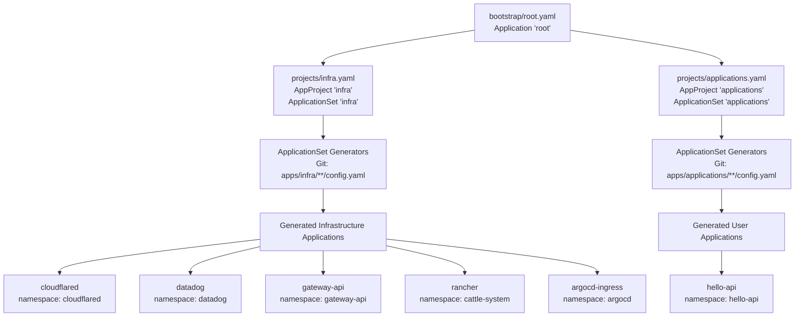
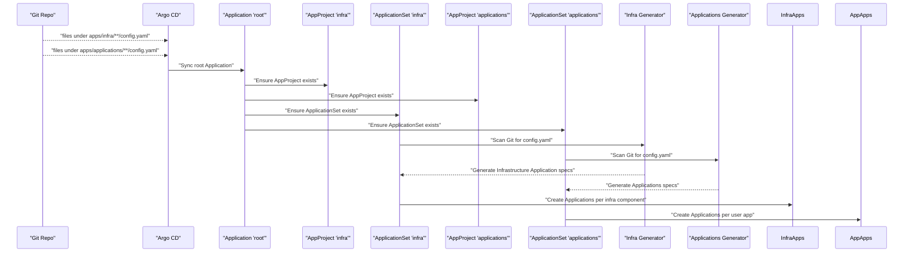
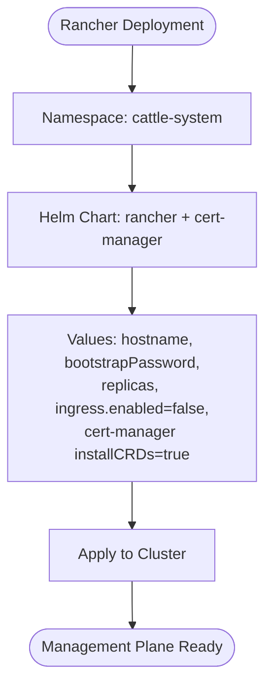
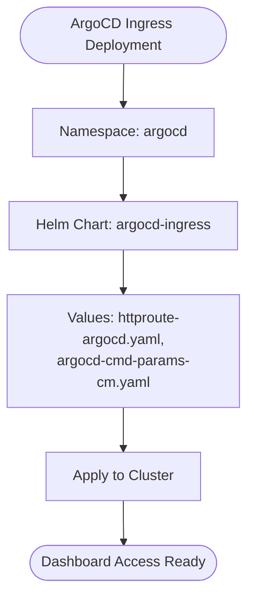
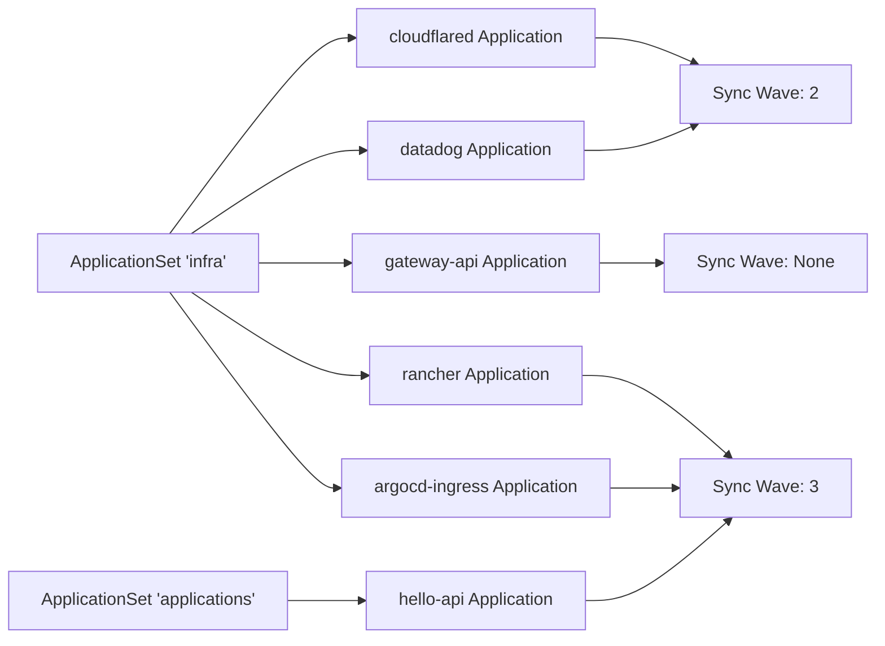

# Infrastructure Projects

<cite>
**Referenced Files in This Document**
- [infra.yaml](file://projects/infra.yaml)
- [applications.yaml](file://projects/applications.yaml)
- [root.yaml](file://bootstrap/root.yaml)
- [rancher config.yaml](file://apps/infra/rancher/config.yaml)
- [rancher values-cert-manager.yaml](file://apps/infra/rancher/chart/values-cert-manager.yaml)
- [rancher values.yaml](file://apps/infra/rancher/chart/values.yaml)
- [cloudflared config.yaml](file://apps/infra/cloudflared/config.yaml)
- [cloudflared chart kustomization.yaml](file://apps/infra/cloudflared/chart/kustomization.yaml)
- [cloudflared chart values.yaml](file://apps/infra/cloudflared/chart/values.yaml)
- [datadog config.yaml](file://apps/infra/datadog/config.yaml)
- [datadog chart kustomization.yaml](file://apps/infra/datadog/chart/kustomization.yaml)
- [datadog chart values.yaml](file://apps/infra/datadog/chart/values.yaml)
- [gateway-api config.yaml](file://apps/infra/gateway-api/config.yaml)
- [gateway-api chart kustomization.yaml](file://apps/infra/gateway-api/chart/kustomization.yaml)
- [gateway-api gatewayclass.yaml](file://apps/infra/gateway-api/chart/gatewayclass.yaml)
- [gateway-api gateway.yaml](file://apps/infra/gateway-api/chart/gateway.yaml)
- [argocd-ingress config.yaml](file://apps/infra/argocd-ingress/config.yaml)
- [hello-api config.yaml](file://apps/applications/hello-api/config.yaml)
</cite>

## Update Summary
**Changes Made**
- Updated project structure to reflect new organization with separate infra and applications project directories
- Added comprehensive documentation for the consolidated Rancher application with integrated cert-manager functionality
- Updated infrastructure component coverage to include the new argocd-ingress application
- Revised sync wave ordering to accommodate the new project structure and component dependencies
- Enhanced documentation to clarify the separation between infrastructure and user-facing applications

## Table of Contents
1. [Introduction](#introduction)
2. [Project Structure](#project-structure)
3. [Core Components](#core-components)
4. [Architecture Overview](#architecture-overview)
5. [Detailed Component Analysis](#detailed-component-analysis)
6. [Dependency Analysis](#dependency-analysis)
7. [Performance Considerations](#performance-considerations)
8. [Troubleshooting Guide](#troubleshooting-guide)
9. [Conclusion](#conclusion)

## Introduction
This document explains how the infrastructure and applications projects are managed using Argo CD ApplicationSet. It describes how projects/infra.yaml defines the infrastructure ApplicationSet that provisions and maintains critical cluster infrastructure components, while projects/applications.yaml manages user-facing applications. The infrastructure applications covered include:
- Cloudflared tunnel for secure connectivity
- Datadog monitoring agent for observability
- Gateway API controller for ingress management
- Rancher management plane with integrated cert-manager
- ArgoCD ingress controller for dashboard access

The document also documents the separation of infrastructure applications from user applications, including namespace isolation and deployment strategies. It explains sync waves and ordering to ensure a safe startup sequence, highlights configuration options specific to infrastructure applications, and provides troubleshooting guidance for common deployment failures.

## Project Structure
The infrastructure and applications projects are now organized under separate directories within projects/. The infrastructure project is managed by projects/infra.yaml and the applications project by projects/applications.yaml. Both are bootstrapped via bootstrap/root.yaml. The ApplicationSets scan Git paths matching their respective directory structures to generate per-cluster Applications.

**Diagram sources**
- [root.yaml:1-37](file://bootstrap/root.yaml#L1-L37)
- [infra.yaml:23-85](file://projects/infra.yaml#L23-L85)
- [applications.yaml:23-85](file://projects/applications.yaml#L23-L85)

**Section sources**
- [root.yaml:1-37](file://bootstrap/root.yaml#L1-L37)
- [infra.yaml:1-85](file://projects/infra.yaml#L1-L85)
- [applications.yaml:1-85](file://projects/applications.yaml#L1-L85)

## Core Components
The infrastructure and applications projects each define their own AppProject and ApplicationSet with distinct sync wave configurations:

**Infrastructure Project (projects/infra.yaml):**
- AppProject infra: Defines the project scope, permissions, and sync wave for infrastructure components. Allows whitelisting of cluster and namespace resources and targets all destinations and repositories.
- ApplicationSet infra: Scans Git for infrastructure app configs, generates Applications with per-app namespace and source path, and applies sync policy and retry behavior.
- Namespace isolation: Each infrastructure app deploys into its own namespace (cloudflared, datadog, gateway-api, cattle-system) to prevent cross-contamination and simplify ownership.
- Sync waves: Infrastructure apps are scheduled with explicit sync waves to ensure proper startup order.

**Applications Project (projects/applications.yaml):**
- AppProject applications: Defines the project scope for user-facing applications with similar configuration patterns.
- ApplicationSet applications: Manages user applications separately from infrastructure components.
- Namespace isolation: Each user application deploys into its designated namespace (e.g., hello-api).

Key configuration anchors:
- AppProject annotations set sync wave and pruning behavior for each project.
- ApplicationSet sets a base sync wave and uses per-resource annotations to fine-tune ordering.
- Per-app config.yaml files override destination namespace and set per-resource sync waves.

**Section sources**
- [infra.yaml:1-21](file://projects/infra.yaml#L1-L21)
- [infra.yaml:23-85](file://projects/infra.yaml#L23-L85)
- [applications.yaml:1-21](file://projects/applications.yaml#L1-L21)
- [applications.yaml:23-85](file://projects/applications.yaml#L23-L85)
- [cloudflared config.yaml:1-4](file://apps/infra/cloudflared/config.yaml#L1-L4)
- [datadog config.yaml:1-6](file://apps/infra/datadog/config.yaml#L1-L6)
- [gateway-api config.yaml:1-6](file://apps/infra/gateway-api/config.yaml#L1-L6)
- [rancher config.yaml:1-5](file://apps/infra/rancher/config.yaml#L1-L5)
- [argocd-ingress config.yaml:1-4](file://apps/infra/argocd-ingress/config.yaml#L1-L4)
- [hello-api config.yaml:1-4](file://apps/applications/hello-api/config.yaml#L1-L4)

## Architecture Overview
The infrastructure and applications lifecycle follows this flow:
- The root Application monitors the projects directory and ensures both infra and applications AppProjects and ApplicationSets exist.
- The ApplicationSet generators discover their respective config.yaml files and create Applications for each component.
- Each Application resolves its Helm chart via Kustomize, targeting the appropriate namespace and applying per-app overrides.

**Diagram sources**
- [root.yaml:10-18](file://bootstrap/root.yaml#L10-L18)
- [infra.yaml:33-58](file://projects/infra.yaml#L33-L58)
- [applications.yaml:33-58](file://projects/applications.yaml#L33-L58)

## Detailed Component Analysis

### Cloudflared Tunnel
Cloudflared provides secure connectivity to cluster services via Cloudflare tunnels. It is deployed into the cloudflared namespace and uses a Helm chart configured via values.yaml.

- Namespace isolation: Deployed to cloudflared namespace via kustomization.
- Helm chart: Uses a custom OCI repository and release name cloudflared.
- Security and runtime: Container runs with minimal probes; credentials are injected via a Kubernetes Secret mounted through envFrom.
- Resource requirements: Defined in values.yaml with CPU/memory requests/limits.

**Diagram sources**
- [cloudflared chart kustomization.yaml:4-10](file://apps/infra/cloudflared/chart/kustomization.yaml#L4-L10)
- [cloudflared chart values.yaml:11-36](file://apps/infra/cloudflared/chart/values.yaml#L11-L36)

**Section sources**
- [cloudflared config.yaml:1-4](file://apps/infra/cloudflared/config.yaml#L1-L4)
- [cloudflared chart kustomization.yaml:1-11](file://apps/infra/cloudflared/chart/kustomization.yaml#L1-L11)
- [cloudflared chart values.yaml:1-40](file://apps/infra/cloudflared/chart/values.yaml#L1-L40)

### Datadog Monitoring Agent
Datadog provides cluster observability, metrics, logs, APM, and orchestrator explorer. It is deployed into the datadog namespace and uses the official Datadog Helm chart.

- Namespace isolation: Deployed to datadog namespace via kustomization.
- Helm chart: Official Datadog chart from helm.datadoghq.com.
- Credentials: API key is supplied via an existing Kubernetes Secret referenced in values.
- Workload placement: Tolerations allow scheduling on control plane nodes; resources are specified for the agent.

**Diagram sources**
- [datadog chart kustomization.yaml:4-10](file://apps/infra/datadog/chart/kustomization.yaml#L4-L10)
- [datadog chart values.yaml:1-89](file://apps/infra/datadog/chart/values.yaml#L1-L89)

**Section sources**
- [datadog config.yaml:1-6](file://apps/infra/datadog/config.yaml#L1-L6)
- [datadog chart kustomization.yaml:1-11](file://apps/infra/datadog/chart/kustomization.yaml#L1-L11)
- [datadog chart values.yaml:1-89](file://apps/infra/datadog/chart/values.yaml#L1-L89)

### Gateway API Controller and Shared Gateway
Gateway API introduces modern ingress abstractions. The gateway-api app installs standard CRDs and a controller (Traefik), then deploys a shared Gateway and GatewayClass.

- Namespace isolation: Deployed to gateway-api namespace via kustomization.
- CRDs and controller: Installed from upstream standard install manifest.
- GatewayClass: Declares Traefik as the controller; annotated with sync wave to ensure CRDs are ready first.
- Gateway: Defines HTTP/HTTPS listeners and references TLS certificates.

**Diagram sources**
- [gateway-api chart kustomization.yaml:4-7](file://apps/infra/gateway-api/chart/kustomization.yaml#L4-L7)
- [gateway-api gatewayclass.yaml:6](file://apps/infra/gateway-api/chart/gatewayclass.yaml#L6)
- [gateway-api gateway.yaml:7](file://apps/infra/gateway-api/chart/gateway.yaml#L7)

**Section sources**
- [gateway-api config.yaml:1-6](file://apps/infra/gateway-api/config.yaml#L1-L6)
- [gateway-api chart kustomization.yaml:1-8](file://apps/infra/gateway-api/chart/kustomization.yaml#L1-L8)
- [gateway-api gatewayclass.yaml:1-10](file://apps/infra/gateway-api/chart/gatewayclass.yaml#L1-L10)
- [gateway-api gateway.yaml:1-27](file://apps/infra/gateway-api/chart/gateway.yaml#L1-L27)

### Rancher Management Plane with Integrated Cert-Manager
Rancher provides a comprehensive management plane for Kubernetes clusters with integrated cert-manager functionality. It is deployed into the cattle-system namespace and includes both Rancher core and cert-manager components.

- Namespace isolation: Deployed to cattle-system namespace via kustomization.
- Consolidated deployment: Includes both Rancher management plane and cert-manager in a single application.
- Certificate management: Integrated cert-manager handles TLS certificate issuance and renewal.
- Configuration: Hostname, bootstrap password, replica count, and ingress settings are configured via values.yaml.

**Diagram sources**
- [rancher config.yaml:1-5](file://apps/infra/rancher/config.yaml#L1-L5)
- [rancher values.yaml:1-9](file://apps/infra/rancher/chart/values.yaml#L1-L9)
- [rancher values-cert-manager.yaml:1-6](file://apps/infra/rancher/chart/values-cert-manager.yaml#L1-L6)

**Section sources**
- [rancher config.yaml:1-5](file://apps/infra/rancher/config.yaml#L1-L5)
- [rancher values.yaml:1-9](file://apps/infra/rancher/chart/values.yaml#L1-L9)
- [rancher values-cert-manager.yaml:1-6](file://apps/infra/rancher/chart/values-cert-manager.yaml#L1-L6)

### ArgoCD Ingress Controller
The argocd-ingress application provides ingress access to the ArgoCD dashboard and other ArgoCD services. It is deployed into the argocd namespace.

- Namespace isolation: Deployed to argocd namespace via kustomization.
- Ingress management: Provides HTTPRoute resources for ArgoCD dashboard access.
- Configuration: Includes HTTPRoute definitions and command parameters configuration.

**Diagram sources**
- [argocd-ingress config.yaml:1-4](file://apps/infra/argocd-ingress/config.yaml#L1-L4)

**Section sources**
- [argocd-ingress config.yaml:1-4](file://apps/infra/argocd-ingress/config.yaml#L1-L4)

## Dependency Analysis
The ApplicationSets generate Applications for infrastructure and user-facing components. Dependencies are resolved through:
- Namespace isolation: Each app targets its own namespace.
- Sync waves: Per-resource annotations ensure proper startup order across components.
- Kustomize/Helm: Each app's chart is resolved independently, pulling values from its values.yaml.

**Diagram sources**
- [infra.yaml:33-58](file://projects/infra.yaml#L33-L58)
- [applications.yaml:33-58](file://projects/applications.yaml#L33-L58)
- [cloudflared config.yaml:2-3](file://apps/infra/cloudflared/config.yaml#L2-L3)
- [datadog config.yaml:4-5](file://apps/infra/datadog/config.yaml#L4-L5)
- [rancher config.yaml:2-3](file://apps/infra/rancher/config.yaml#L2-L3)
- [argocd-ingress config.yaml:2-3](file://apps/infra/argocd-ingress/config.yaml#L2-L3)
- [hello-api config.yaml:2-3](file://apps/applications/hello-api/config.yaml#L2-L3)

**Section sources**
- [infra.yaml:23-85](file://projects/infra.yaml#L23-L85)
- [applications.yaml:23-85](file://projects/applications.yaml#L23-L85)
- [cloudflared config.yaml:1-4](file://apps/infra/cloudflared/config.yaml#L1-L4)
- [datadog config.yaml:1-6](file://apps/infra/datadog/config.yaml#L1-L6)
- [rancher config.yaml:1-5](file://apps/infra/rancher/config.yaml#L1-L5)
- [argocd-ingress config.yaml:1-4](file://apps/infra/argocd-ingress/config.yaml#L1-L4)
- [hello-api config.yaml:1-4](file://apps/applications/hello-api/config.yaml#L1-L4)

## Performance Considerations
- Resource sizing: Each app's values.yaml defines CPU/memory requests/limits. Adjust these based on observed cluster load and node capacity.
- Probes: Cloudflared disables liveness/readiness probes by default; ensure this aligns with your health checking strategy.
- Retries: The ApplicationSet sync policy includes retry configuration to handle transient failures during initial rollout.
- Tolerations: Datadog agents tolerate control plane nodes to ensure monitoring coverage; verify taint/toleration policies match your cluster topology.
- Namespace isolation: Separate projects ensure better resource allocation and prevent cross-contamination between infrastructure and user applications.

## Troubleshooting Guide
Common issues and resolutions:
- Missing namespaces: Ensure CreateNamespace is enabled for the project or per-application where needed. The root Application enables CreateNamespace globally.
- CRDs not found: Gateway API resources depend on CRDs being present. Verify the standard install manifest is applied before GatewayClass and Gateway.
- Credentials missing: Datadog requires an existing Secret containing the API key. Confirm the Secret exists and matches the name referenced in values.
- Tunnel connectivity: Cloudflared requires a valid tunnel token. Confirm the Secret referenced by envFrom exists and contains the expected key.
- Rancher bootstrap: Verify the bootstrap password is correct and accessible. Check cert-manager integration for certificate issuance.
- Sync ordering: If resources fail due to missing dependencies, review per-resource sync-wave annotations and adjust as needed.
- Project separation: Ensure infrastructure and applications are deployed to their respective projects to avoid conflicts.

Operational anchors:
- Root Application enables CreateNamespace and allows empty resources to avoid blocking initialization.
- ApplicationSet retries with bounded backoff to recover from transient errors.
- Per-app config.yaml can override destination namespace and add sync-wave annotations for fine-grained ordering.
- Separate projects provide better isolation and troubleshooting capabilities.

**Section sources**
- [root.yaml:34-36](file://bootstrap/root.yaml#L34-L36)
- [infra.yaml:66-71](file://projects/infra.yaml#L66-L71)
- [applications.yaml:66-71](file://projects/applications.yaml#L66-L71)
- [gateway-api config.yaml:3-5](file://apps/infra/gateway-api/config.yaml#L3-L5)
- [datadog config.yaml:2-3](file://apps/infra/datadog/config.yaml#L2-L3)
- [cloudflared config.yaml:2-3](file://apps/infra/cloudflared/config.yaml#L2-L3)
- [rancher config.yaml:2-3](file://apps/infra/rancher/config.yaml#L2-L3)

## Conclusion
The infrastructure and applications projects leverage Argo CD's ApplicationSet to automate the deployment of critical cluster components and user-facing applications. The new project organization with separate infra and applications directories provides better separation of concerns and improved manageability. By isolating infrastructure apps into dedicated namespaces and enforcing strict sync waves, the system ensures a reliable and predictable startup sequence. The consolidated Rancher application with integrated cert-manager functionality simplifies certificate management while maintaining security best practices. The documented configuration options enable operators to tailor resource allocation, security posture, and monitoring while maintaining clear separation between infrastructure and user workloads.