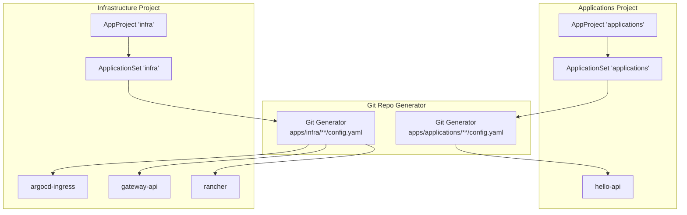
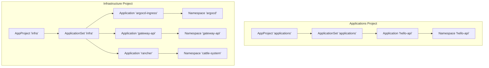
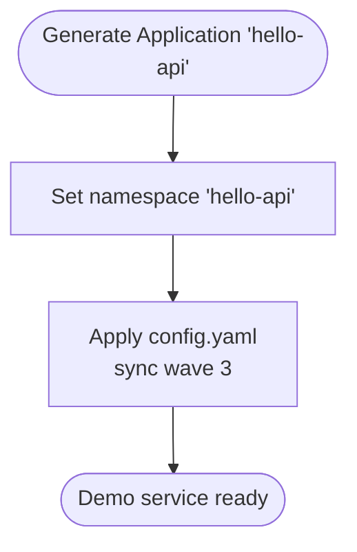
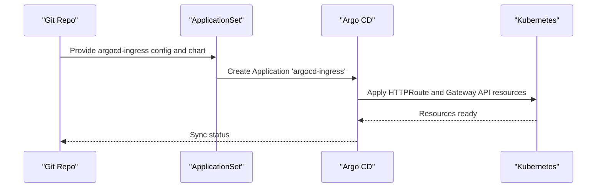
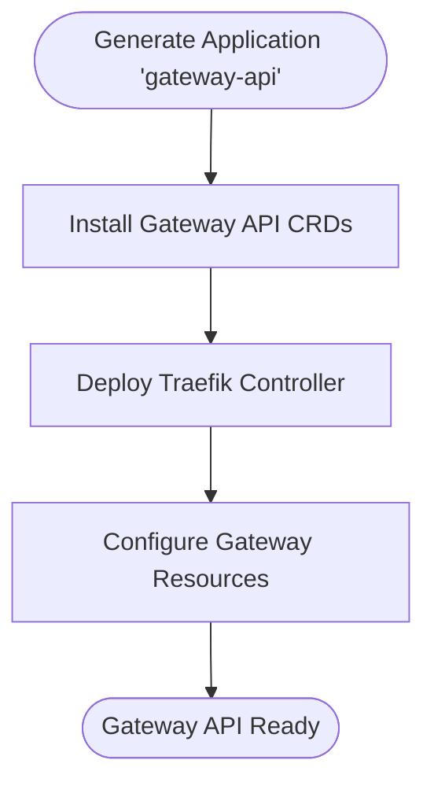
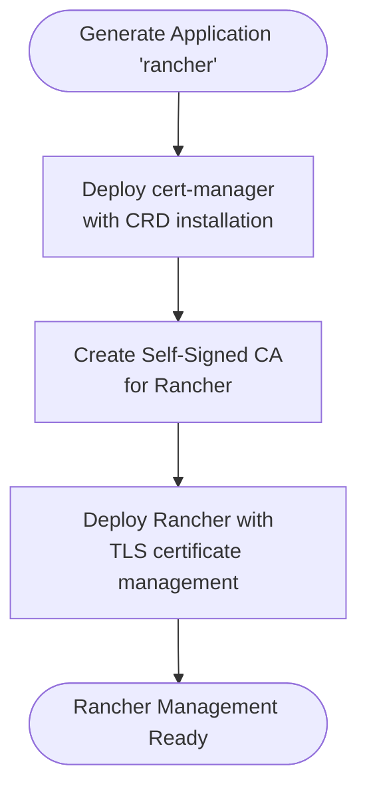
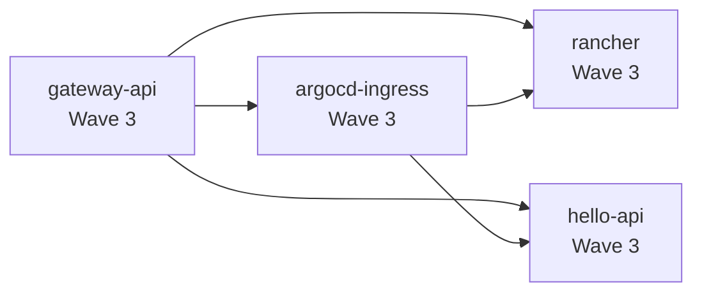

# Playground Projects

<cite>
**Referenced Files in This Document**
- [applications.yaml](file://projects/applications.yaml)
- [infra.yaml](file://projects/infra.yaml)
- [config.yaml](file://apps/applications/hello-api/config.yaml)
- [kustomization.yaml](file://apps/applications/hello-api/kustomization.yaml)
- [config.yaml](file://apps/infra/argocd-ingress/config.yaml)
- [config.yaml](file://apps/infra/gateway-api/config.yaml)
- [config.yaml](file://apps/infra/rancher/config.yaml)
- [values-cert-manager.yaml](file://apps/infra/rancher/chart/values-cert-manager.yaml)
- [tls-rancher-ca.yaml](file://apps/infra/rancher/chart/tls-rancher-ca.yaml)
</cite>

## Update Summary
**Changes Made**
- Complete restructuring of project organization from single playground project to separate applications and infrastructure projects
- Cert-manager functionality moved from playground layer to infrastructure layer as part of Rancher deployment
- Hello-api application reclassified from playground to applications project
- Updated ApplicationSet configuration to support new project structure with dedicated infra and applications projects
- Removed all playground-specific references and renamed to reflect new organizational model

## Table of Contents
1. [Introduction](#introduction)
2. [Project Structure](#project-structure)
3. [Core Components](#core-components)
4. [Architecture Overview](#architecture-overview)
5. [Detailed Component Analysis](#detailed-component-analysis)
6. [Dependency Analysis](#dependency-analysis)
7. [Performance Considerations](#performance-considerations)
8. [Troubleshooting Guide](#troubleshooting-guide)
9. [Conclusion](#conclusion)

## Introduction
This document explains the restructured project management and experimentation environment following the migration from the single playground project to separate applications and infrastructure project organization. The new structure maintains experimental capabilities while integrating core infrastructure components into appropriate project layers. The applications project now manages demonstration and experimental workloads, while the infrastructure project handles foundational services including certificate management, ingress exposure, and platform components.

**Updated** The playground concept has been completely restructured - the previous playground.yaml file was removed and replaced with separate applications.yaml and infra.yaml project definitions. The playground functionality is now integrated into dedicated project layers rather than existing as a standalone experimental environment.

## Project Structure
The project organization has been restructured into two distinct layers:

**Applications Project**: Manages demonstration and experimental applications including hello-api, with relaxed synchronization policies and namespace isolation.

**Infrastructure Project**: Handles foundational services including cert-manager integration, ingress management, and platform components, with proper dependency ordering.

Each project uses ApplicationSets to generate Argo CD Applications from Git repository files, with per-application configuration controlling deployment order and namespace isolation.

**Diagram sources**
- [applications.yaml:23-90](file://projects/applications.yaml#L23-L90)
- [infra.yaml:23-90](file://projects/infra.yaml#L23-L90)

**Section sources**
- [applications.yaml:1-90](file://projects/applications.yaml#L1-L90)
- [infra.yaml:1-90](file://projects/infra.yaml#L1-L90)

## Core Components
The new project structure consists of two specialized ApplicationSets:

**Applications Project**:
- AppProject 'applications': Defines permissive resource handling with CreateNamespace and SkipDryRunOnMissingResource sync options
- ApplicationSet 'applications': Generates applications from apps/applications/**/config.yaml with automated sync and pruning
- Focuses on demonstration and experimental workloads with relaxed policies

**Infrastructure Project**:
- AppProject 'infra': Manages foundational services with proper dependency ordering
- ApplicationSet 'infra': Generates infrastructure components from apps/infra/**/config.yaml
- Includes cert-manager integration, ingress management, and platform services

Key characteristics maintained:
- Automated sync with prune and self-heal enabled
- Namespace isolation through per-application configuration
- Sync wave ordering for dependency management
- Helm support through Kustomize build options

**Section sources**
- [applications.yaml:1-90](file://projects/applications.yaml#L1-L90)
- [infra.yaml:1-90](file://projects/infra.yaml#L1-L90)
- [config.yaml:1-4](file://apps/applications/hello-api/config.yaml#L1-L4)
- [config.yaml:1-5](file://apps/infra/rancher/config.yaml#L1-L5)

## Architecture Overview
The restructured architecture separates concerns into dedicated project layers:

**Applications Layer**: Contains hello-api as the primary demonstration service with HTTPRoute exposure and minimal resource requirements.

**Infrastructure Layer**: Houses cert-manager integration within Rancher deployment, argocd-ingress for external access, gateway-api for traffic management, and supporting platform services.

**Diagram sources**
- [applications.yaml:23-90](file://projects/applications.yaml#L23-L90)
- [infra.yaml:23-90](file://projects/infra.yaml#L23-L90)
- [kustomization.yaml](file://apps/applications/hello-api/kustomization.yaml)
- [kustomization.yaml](file://apps/infra/rancher/kustomization.yaml)

## Detailed Component Analysis

### hello-api (Applications Project)
Purpose:
- Lightweight demonstration service for testing and validation
- Exposed via HTTPRoute for quick ingress verification
- Minimal resource footprint suitable for experimental workloads

Deployment details:
- Located in apps/applications/hello-api with dedicated namespace configuration
- Configured for sync wave 3 to deploy after infrastructure components
- Uses Kustomization to set namespace and reference chart resources

**Diagram sources**
- [kustomization.yaml](file://apps/applications/hello-api/kustomization.yaml)
- [config.yaml](file://apps/applications/hello-api/config.yaml)

**Section sources**
- [kustomization.yaml](file://apps/applications/hello-api/kustomization.yaml)
- [config.yaml](file://apps/applications/hello-api/config.yaml)

### argocd-ingress (Infrastructure Project)
Purpose:
- Exposes Argo CD UI via HTTPRoute and Gateway API resources
- Provides external access to Argo CD management interface
- Integrates with Cloudflare tunnel for secure external connectivity

Deployment details:
- Located in apps/infra/argocd-ingress with argocd namespace
- Configured for sync wave 3 to deploy after gateway-api
- Uses HTTPRoute resources for modern ingress management

**Diagram sources**
- [infra.yaml:23-90](file://projects/infra.yaml#L23-L90)
- [config.yaml](file://apps/infra/argocd-ingress/config.yaml)

**Section sources**
- [config.yaml](file://apps/infra/argocd-ingress/config.yaml)

### gateway-api (Infrastructure Project)
Purpose:
- Provides Gateway API implementation for modern traffic management
- Requires CRDs to be installed before gateway resources
- Enables advanced routing capabilities for Kubernetes services

Deployment details:
- Located in apps/infra/gateway-api with dedicated namespace
- Includes GatewayClass, Gateway, and Traefik controller
- Configured with CreateNamespace sync option for dependency handling

**Diagram sources**
- [config.yaml](file://apps/infra/gateway-api/config.yaml)

**Section sources**
- [config.yaml](file://apps/infra/gateway-api/config.yaml)

### rancher (Infrastructure Project)
Purpose:
- Deploys Rancher management platform with integrated certificate management
- Includes embedded cert-manager for issuing TLS certificates
- Provides centralized Kubernetes cluster management interface

Deployment details:
- Located in apps/infra/rancher with cattle-system namespace
- Integrates cert-manager configuration and custom CA issuance
- Configured for sync wave 3 with proper dependency ordering

**Updated** Cert-manager functionality has been integrated directly into the Rancher deployment rather than existing as a separate playground component. The certificate management is now handled through Rancher's built-in cert-manager configuration.

**Diagram sources**
- [values-cert-manager.yaml](file://apps/infra/rancher/chart/values-cert-manager.yaml)
- [tls-rancher-ca.yaml](file://apps/infra/rancher/chart/tls-rancher-ca.yaml)

**Section sources**
- [config.yaml](file://apps/infra/rancher/config.yaml)
- [values-cert-manager.yaml](file://apps/infra/rancher/chart/values-cert-manager.yaml)
- [tls-rancher-ca.yaml](file://apps/infra/rancher/chart/tls-rancher-ca.yaml)

## Dependency Analysis
The restructured deployment maintains dependency ordering through sync waves:

**Applications Project**:
- hello-api: Wave 3 (deploys after infrastructure components)

**Infrastructure Project**:
- gateway-api: Wave 3 (provides traffic management foundation)
- argocd-ingress: Wave 3 (exposes services after gateway-api)
- rancher: Wave 3 (uses cert-manager and ingress infrastructure)

**Updated** The dependency structure has been simplified - cert-manager is now embedded within Rancher deployment, eliminating the need for a separate cert-manager application. The hello-api application maintains its position as the final experimental component.

**Diagram sources**
- [applications.yaml:23-90](file://projects/applications.yaml#L23-L90)
- [infra.yaml:23-90](file://projects/infra.yaml#L23-L90)
- [config.yaml](file://apps/applications/hello-api/config.yaml)
- [config.yaml](file://apps/infra/argocd-ingress/config.yaml)
- [config.yaml](file://apps/infra/gateway-api/config.yaml)
- [config.yaml](file://apps/infra/rancher/config.yaml)

**Section sources**
- [applications.yaml:23-90](file://projects/applications.yaml#L23-L90)
- [infra.yaml:23-90](file://projects/infra.yaml#L23-L90)
- [config.yaml](file://apps/applications/hello-api/config.yaml)
- [config.yaml](file://apps/infra/argocd-ingress/config.yaml)
- [config.yaml](file://apps/infra/gateway-api/config.yaml)
- [config.yaml](file://apps/infra/rancher/config.yaml)

## Performance Considerations
- Automated sync with prune and self-heal reduces operational overhead for both infrastructure and applications
- Retry backoff prevents excessive load during transient failures across both project layers
- CreateNamespace and SkipDryRunOnMissingResource options streamline namespace-first deployments
- Kustomize build with Helm support enables flexible chart customization without duplicating base manifests
- Separate project organization improves isolation and reduces cross-project interference

## Troubleshooting Guide
Common scenarios and checks:

**Applications Project Issues**:
- hello-api readiness: Verify Deployment and Service exist in hello-api namespace; test HTTPRoute routing
- Namespace isolation: Confirm CreateNamespace sync option is working for new namespaces

**Infrastructure Project Issues**:
- Gateway API readiness: Check CRD installation and Traefik controller status
- Certificate management: Verify cert-manager integration within Rancher deployment
- Ingress exposure: Confirm HTTPRoute resources and Gateway API compatibility

**Cross-Project Dependencies**:
- Sync wave ordering: Use Argo CD sync waves to ensure proper dependency resolution
- Resource conflicts: Monitor for namespace or resource conflicts between projects
- External connectivity: Verify Cloudflare tunnel and DNS configuration for argocd-ingress

**Updated** Troubleshooting procedures have been adapted to the new project structure, with separate focus areas for applications and infrastructure components.

Operational tips:
- Monitor sync status across both applications and infrastructure projects
- Use project-specific ApplicationSets for targeted troubleshooting
- Leverage sync waves to isolate dependency-related issues
- Enable verbose logging for certificate management and ingress components

**Section sources**
- [applications.yaml:61-75](file://projects/applications.yaml#L61-L75)
- [infra.yaml:61-75](file://projects/infra.yaml#L61-L75)
- [config.yaml](file://apps/applications/hello-api/config.yaml)
- [config.yaml](file://apps/infra/rancher/config.yaml)

## Conclusion
The restructured project organization provides improved separation of concerns while maintaining experimental capabilities. The applications project focuses on demonstration and experimental workloads with relaxed policies, while the infrastructure project manages foundational services with proper dependency ordering. The integration of cert-manager into the Rancher deployment eliminates redundant certificate management while maintaining the experimental nature of the overall environment. This new structure enables more maintainable and scalable management of both infrastructure and application workloads.