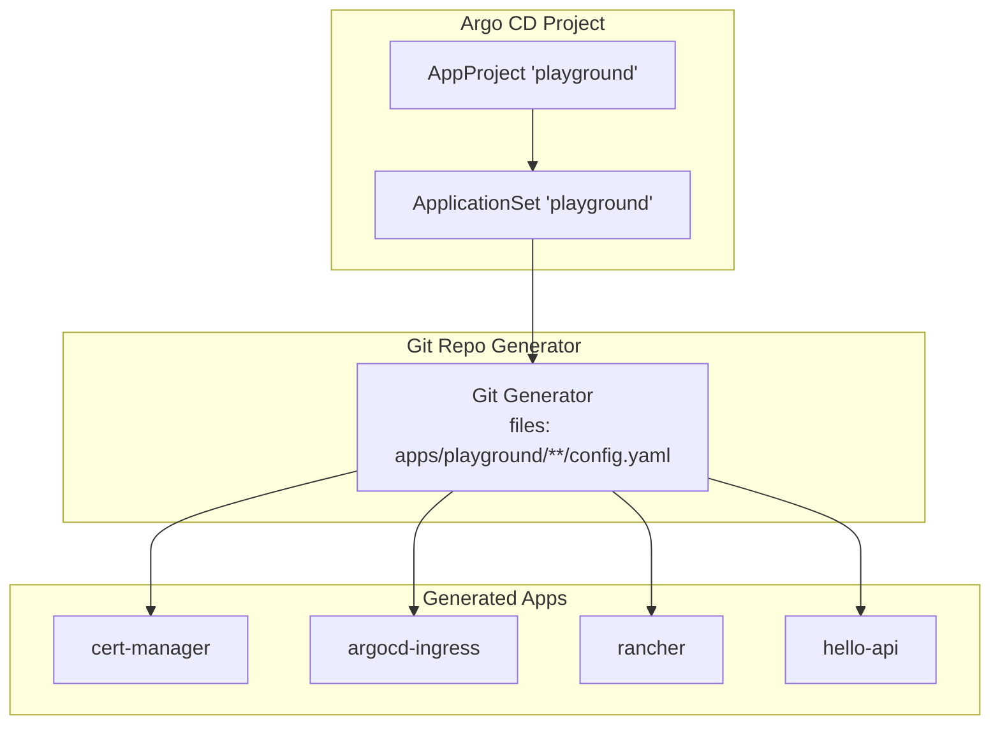
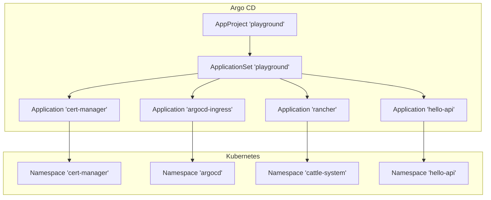
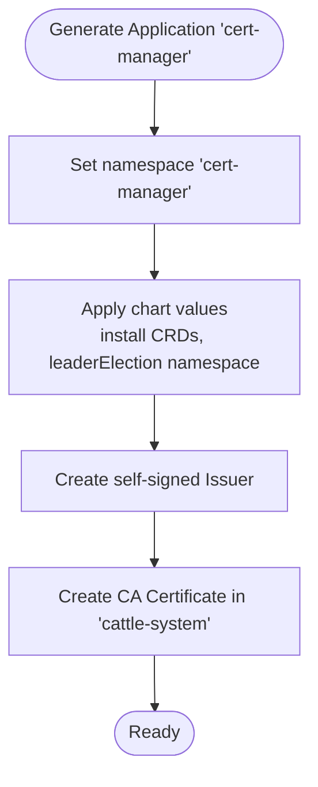
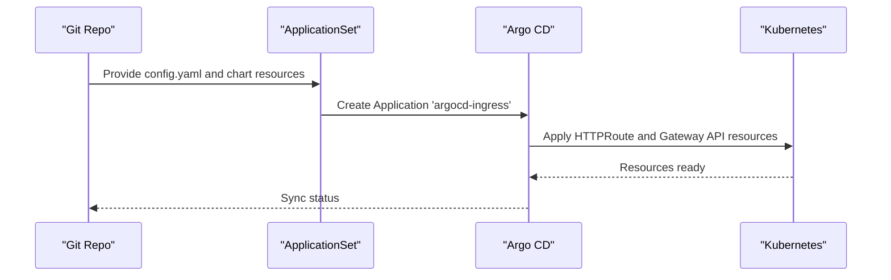
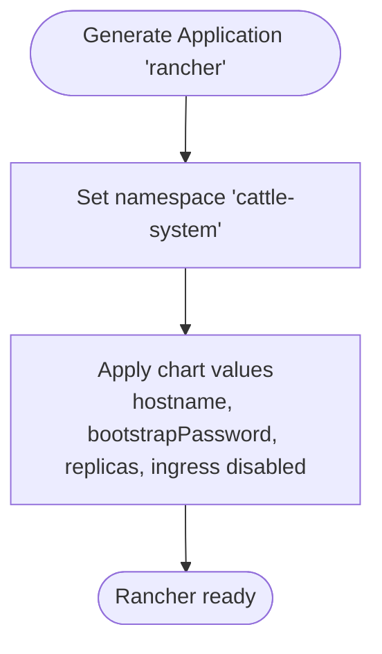
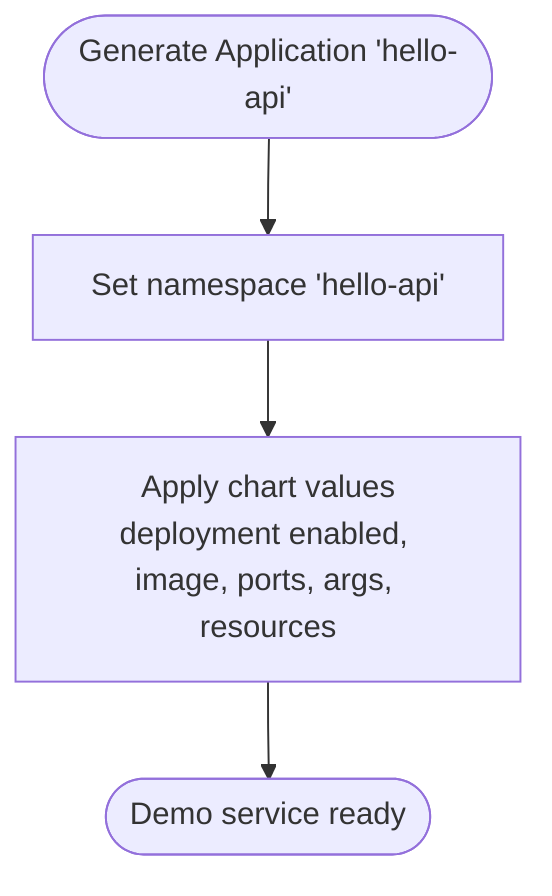
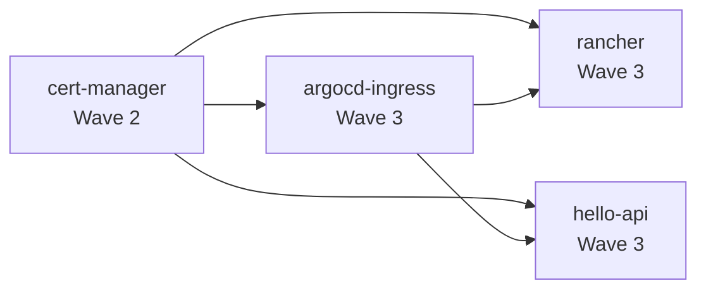

# Playground Projects

<cite>
**Referenced Files in This Document**
- [playground.yaml](file://projects/playground.yaml)
- [config.yaml](file://apps/playground/cert-manager/config.yaml)
- [kustomization.yaml](file://apps/playground/cert-manager/kustomization.yaml)
- [values.yaml](file://apps/playground/cert-manager/chart/values.yaml)
- [tls-rancher-ca.yaml](file://apps/playground/cert-manager/chart/tls-rancher-ca.yaml)
- [config.yaml](file://apps/playground/argocd-ingress/config.yaml)
- [kustomization.yaml](file://apps/playground/argocd-ingress/kustomization.yaml)
- [values.yaml](file://apps/playground/argocd-ingress/chart/values.yaml)
- [argocd-cmd-params-cm.yaml](file://apps/playground/argocd-ingress/chart/argocd-cmd-params-cm.yaml)
- [config.yaml](file://apps/playground/rancher/config.yaml)
- [kustomization.yaml](file://apps/playground/rancher/kustomization.yaml)
- [values.yaml](file://apps/playground/rancher/chart/values.yaml)
- [config.yaml](file://apps/playground/hello-api/config.yaml)
- [kustomization.yaml](file://apps/playground/hello-api/kustomization.yaml)
- [values.yaml](file://apps/playground/hello-api/chart/values.yaml)
</cite>

## Table of Contents
1. [Introduction](#introduction)
2. [Project Structure](#project-structure)
3. [Core Components](#core-components)
4. [Architecture Overview](#architecture-overview)
5. [Detailed Component Analysis](#detailed-component-analysis)
6. [Dependency Analysis](#dependency-analysis)
7. [Performance Considerations](#performance-considerations)
8. [Troubleshooting Guide](#troubleshooting-guide)
9. [Conclusion](#conclusion)

## Introduction
This document explains the playground project management and experimentation environment. It focuses on how the playground ApplicationSet in the Argo CD project manifest defines non-production applications and experimental deployments, and how specific playground applications are configured and deployed. The playground environment supports development, testing, and demonstration workflows with relaxed synchronization policies and namespace isolation. Applications covered include cert-manager for certificate management, argocd-ingress for exposing Argo CD, Rancher management interface, and hello-api demo service.

## Project Structure
The playground project is defined under the Argo CD project manifest and uses an ApplicationSet to generate Argo CD Applications from Git repository files. Each playground application is organized under apps/playground/<app-name> with its own Kustomization and optional Helm chart values. The ApplicationSet generator reads config.yaml files from each application to derive destination namespaces and annotations, while the template defines shared sync policy and kustomize build options.

**Diagram sources**
- [playground.yaml:23-90](file://projects/playground.yaml#L23-L90)

**Section sources**
- [playground.yaml:1-90](file://projects/playground.yaml#L1-L90)

## Core Components
- AppProject playground: Defines permissive resource whitelists and allows all repositories and clusters for the playground project. Includes sync annotations for ordering and pruning behavior.
- ApplicationSet playground: Generates Argo CD Applications from Git using a Go template. It sets shared sync policy, kustomize build options, and per-application namespace overrides via config.yaml.
- Per-application config.yaml: Provides destination namespace and sync wave annotations to control deployment order and namespace isolation.

Key characteristics of playground deployments:
- Relaxed sync policies: automated sync with prune and self-heal enabled, with retry backoff.
- Namespace isolation: each application deploys into its own namespace as defined in config.yaml.
- Sync wave ordering: annotations ensure a deterministic deployment sequence across cert-manager, argocd-ingress, rancher, and hello-api.

**Section sources**
- [playground.yaml:1-90](file://projects/playground.yaml#L1-L90)
- [config.yaml:1-5](file://apps/playground/cert-manager/config.yaml#L1-L5)
- [config.yaml:1-4](file://apps/playground/argocd-ingress/config.yaml#L1-L4)
- [config.yaml:1-5](file://apps/playground/rancher/config.yaml#L1-L5)
- [config.yaml:1-4](file://apps/playground/hello-api/config.yaml#L1-L4)

## Architecture Overview
The playground ApplicationSet generates four primary applications:
- cert-manager: Installs cert-manager and related CRDs, and creates a self-signed CA for Rancher.
- argocd-ingress: Provides HTTPRoute and related resources to expose Argo CD UI externally.
- rancher: Deploys Rancher with a managed hostname and disables the default ingress.
- hello-api: A simple demo service exposed via HTTPRoute for testing and demonstrations.

**Diagram sources**
- [playground.yaml:23-90](file://projects/playground.yaml#L23-L90)
- [kustomization.yaml](file://apps/playground/cert-manager/kustomization.yaml)
- [kustomization.yaml](file://apps/playground/argocd-ingress/kustomization.yaml)
- [kustomization.yaml](file://apps/playground/rancher/kustomization.yaml)
- [kustomization.yaml](file://apps/playground/hello-api/kustomization.yaml)

## Detailed Component Analysis

### cert-manager
Purpose:
- Installs cert-manager and CRDs.
- Creates a self-signed CA Issuer and a Certificate resource in the cattle-system namespace for Rancher.

Deployment details:
- Kustomization sets the namespace to cert-manager.
- Values configure global leader election namespace and CRD installation.
- Additional resources include a self-signed Issuer and a long-lived CA Certificate in cattle-system.

**Diagram sources**
- [kustomization.yaml](file://apps/playground/cert-manager/kustomization.yaml)
- [values.yaml](file://apps/playground/cert-manager/chart/values.yaml)
- [tls-rancher-ca.yaml](file://apps/playground/cert-manager/chart/tls-rancher-ca.yaml)

**Section sources**
- [kustomization.yaml](file://apps/playground/cert-manager/kustomization.yaml)
- [values.yaml](file://apps/playground/cert-manager/chart/values.yaml)
- [tls-rancher-ca.yaml](file://apps/playground/cert-manager/chart/tls-rancher-ca.yaml)
- [config.yaml:1-5](file://apps/playground/cert-manager/config.yaml#L1-L5)

### argocd-ingress
Purpose:
- Exposes Argo CD UI via HTTPRoute and related Gateway API resources.
- Disables default chart Service and Deployment to rely on HTTPRoute.

Deployment details:
- Kustomization sets the namespace to argocd.
- Values disable default Service and Deployment to avoid conflicts with HTTPRoute.
- Additional resources include HTTPRoute and other Gateway API manifests.

**Diagram sources**
- [playground.yaml:23-90](file://projects/playground.yaml#L23-L90)
- [kustomization.yaml](file://apps/playground/argocd-ingress/kustomization.yaml)
- [values.yaml](file://apps/playground/argocd-ingress/chart/values.yaml)
- [argocd-cmd-params-cm.yaml](file://apps/playground/argocd-ingress/chart/argocd-cmd-params-cm.yaml)

**Section sources**
- [kustomization.yaml](file://apps/playground/argocd-ingress/kustomization.yaml)
- [values.yaml](file://apps/playground/argocd-ingress/chart/values.yaml)
- [argocd-cmd-params-cm.yaml](file://apps/playground/argocd-ingress/chart/argocd-cmd-params-cm.yaml)
- [config.yaml:1-4](file://apps/playground/argocd-ingress/config.yaml#L1-L4)

### rancher
Purpose:
- Deploys Rancher with a managed hostname and a bootstrap admin password.
- Disables the default ingress to rely on HTTPRoute.

Deployment details:
- Kustomization sets the namespace to cattle-system.
- Values configure hostname, bootstrap password, replicas, and disables default ingress.

**Diagram sources**
- [kustomization.yaml](file://apps/playground/rancher/kustomization.yaml)
- [values.yaml](file://apps/playground/rancher/chart/values.yaml)

**Section sources**
- [kustomization.yaml](file://apps/playground/rancher/kustomization.yaml)
- [values.yaml](file://apps/playground/rancher/chart/values.yaml)
- [config.yaml:1-5](file://apps/playground/rancher/config.yaml#L1-L5)

### hello-api
Purpose:
- A lightweight demo service for testing and demonstrations.
- Exposed via HTTPRoute for quick validation of ingress and routing.

Deployment details:
- Kustomization sets the namespace to hello-api.
- Values enable Deployment, set replica count, container image, port, args, and minimal resource requests/limits.

**Diagram sources**
- [kustomization.yaml](file://apps/playground/hello-api/kustomization.yaml)
- [values.yaml](file://apps/playground/hello-api/chart/values.yaml)

**Section sources**
- [kustomization.yaml](file://apps/playground/hello-api/kustomization.yaml)
- [values.yaml](file://apps/playground/hello-api/chart/values.yaml)
- [config.yaml:1-4](file://apps/playground/hello-api/config.yaml#L1-L4)

## Dependency Analysis
The playground ApplicationSet orchestrates a strict deployment order using sync waves:
- cert-manager: Wave 2
- argocd-ingress: Wave 3
- rancher: Wave 3
- hello-api: Wave 3

This ensures that cert-manager is available before Rancher needs its CA, and that Argo CD is exposed before relying on its UI for management.

**Diagram sources**
- [playground.yaml:23-90](file://projects/playground.yaml#L23-L90)
- [config.yaml:1-5](file://apps/playground/cert-manager/config.yaml#L1-L5)
- [config.yaml:1-4](file://apps/playground/argocd-ingress/config.yaml#L1-L4)
- [config.yaml:1-5](file://apps/playground/rancher/config.yaml#L1-L5)
- [config.yaml:1-4](file://apps/playground/hello-api/config.yaml#L1-L4)

**Section sources**
- [playground.yaml:23-90](file://projects/playground.yaml#L23-L90)
- [config.yaml:1-5](file://apps/playground/cert-manager/config.yaml#L1-L5)
- [config.yaml:1-4](file://apps/playground/argocd-ingress/config.yaml#L1-L4)
- [config.yaml:1-5](file://apps/playground/rancher/config.yaml#L1-L5)
- [config.yaml:1-4](file://apps/playground/hello-api/config.yaml#L1-L4)

## Performance Considerations
- Automated sync with prune and self-heal reduces manual intervention for experimental environments.
- Retry backoff prevents excessive load during transient failures.
- Minimal resource requests/limits for demo services keep the playground lightweight.
- Kustomize build with Helm support enables flexible chart customization without duplicating base manifests.

## Troubleshooting Guide
Common scenarios and checks:
- cert-manager readiness: Verify Issuer and Certificate resources exist in the cattle-system namespace and that CRDs are installed.
- Argo CD exposure: Confirm HTTPRoute exists and references the correct Gateway; check that Service/Deployment are disabled per chart values.
- Rancher accessibility: Ensure hostname resolves and that the self-signed CA is trusted by clients; confirm ingress is disabled in chart values.
- hello-api availability: Validate Deployment and Service exist in the hello-api namespace; test HTTPRoute routing.

Operational tips:
- Use Argo CD sync waves to isolate dependencies and reduce race conditions.
- Enable CreateNamespace and SkipDryRunOnMissingResource to simplify namespace-first deployments.
- Monitor sync status and retries; adjust backoff settings if needed.

**Section sources**
- [playground.yaml:61-75](file://projects/playground.yaml#L61-L75)
- [values.yaml](file://apps/playground/cert-manager/chart/values.yaml)
- [tls-rancher-ca.yaml](file://apps/playground/cert-manager/chart/tls-rancher-ca.yaml)
- [values.yaml](file://apps/playground/argocd-ingress/chart/values.yaml)
- [values.yaml](file://apps/playground/rancher/chart/values.yaml)
- [values.yaml](file://apps/playground/hello-api/chart/values.yaml)

## Conclusion
The playground project provides a safe, isolated environment for experimentation and demonstrations. Its ApplicationSet-driven approach, combined with per-application namespace isolation and ordered sync waves, enables rapid iteration without impacting production infrastructure. The cert-manager, argocd-ingress, rancher, and hello-api applications collectively support development, testing, and demonstration workflows with minimal operational overhead.