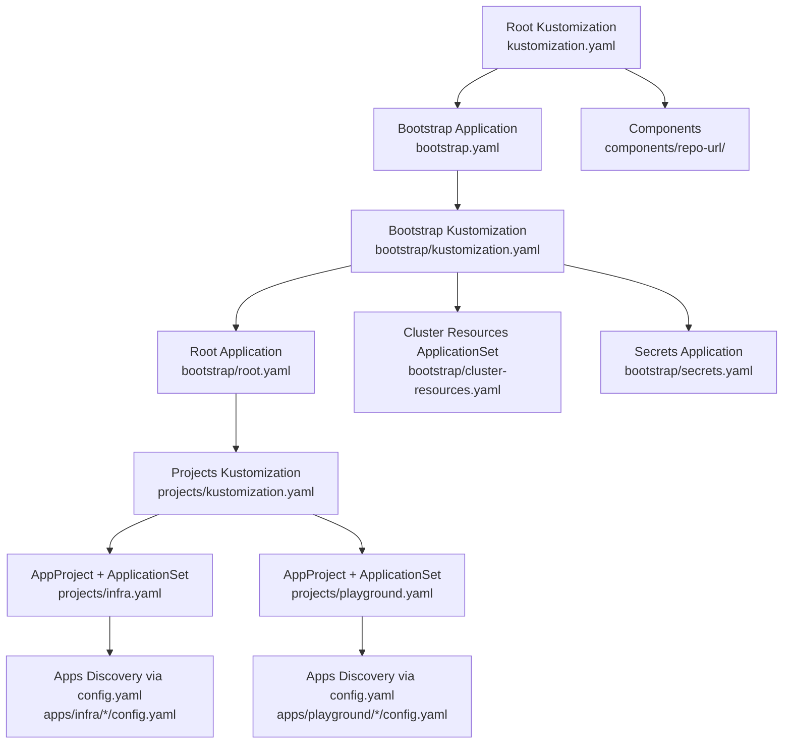
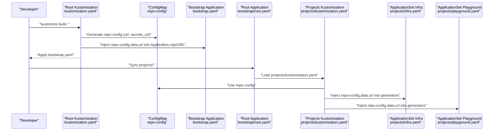
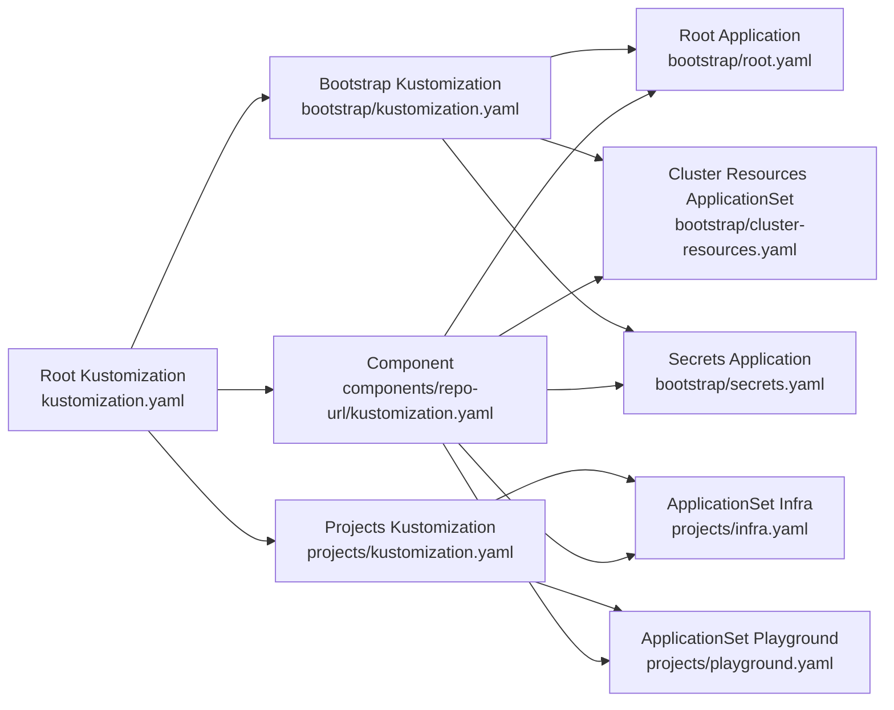

# Project Configuration

<cite>
**Referenced Files in This Document**
- [kustomization.yaml](file://kustomization.yaml)
- [bootstrap/kustomization.yaml](file://bootstrap/kustomization.yaml)
- [projects/kustomization.yaml](file://projects/kustomization.yaml)
- [components/repo-url/kustomization.yaml](file://components/repo-url/kustomization.yaml)
- [bootstrap.yaml](file://bootstrap.yaml)
- [bootstrap/root.yaml](file://bootstrap/root.yaml)
- [bootstrap/secrets.yaml](file://bootstrap/secrets.yaml)
- [projects/infra.yaml](file://projects/infra.yaml)
- [projects/playground.yaml](file://projects/playground.yaml)
- [apps/infra/cloudflared/config.yaml](file://apps/infra/cloudflared/config.yaml)
- [apps/playground/rancher/config.yaml](file://apps/playground/rancher/config.yaml)
- [README.md](file://README.md)
</cite>

## Table of Contents
1. [Introduction](#introduction)
2. [Project Structure](#project-structure)
3. [Core Components](#core-components)
4. [Architecture Overview](#architecture-overview)
5. [Detailed Component Analysis](#detailed-component-analysis)
6. [Dependency Analysis](#dependency-analysis)
7. [Performance Considerations](#performance-considerations)
8. [Troubleshooting Guide](#troubleshooting-guide)
9. [Conclusion](#conclusion)

## Introduction
This document explains the project configuration system and repository URL management across the GitOps pipeline. It focuses on how the root kustomization.yaml coordinates with components to inject repository URLs into ApplicationSet definitions, how the replacement mechanism substitutes placeholders, and how the repo-config-bootstrap and repo-config-projects components centralize URL configuration. It also describes how to manage different repository URLs for development, staging, and production environments, and provides configuration examples and troubleshooting guidance.

## Project Structure
The repository follows a layered structure:
- Root kustomization builds bootstrap.yaml and injects repository URLs via a shared component.
- bootstrap/ contains bootstrap-level Applications and ApplicationSets that orchestrate higher-level resources.
- projects/ defines AppProjects and ApplicationSets that discover applications from apps/**/config.yaml files.
- components/repo-url provides centralized repository URL configuration via a ConfigMap generator.
- apps/**/config.yaml files define per-application metadata and optional overrides.

**Diagram sources**
- [kustomization.yaml:1-21](file://kustomization.yaml#L1-L21)
- [bootstrap/kustomization.yaml:1-38](file://bootstrap/kustomization.yaml#L1-L38)
- [projects/kustomization.yaml:1-22](file://projects/kustomization.yaml#L1-L22)
- [bootstrap/root.yaml:1-37](file://bootstrap/root.yaml#L1-L37)
- [bootstrap/secrets.yaml:1-24](file://bootstrap/secrets.yaml#L1-L24)
- [projects/infra.yaml:1-85](file://projects/infra.yaml#L1-L85)
- [projects/playground.yaml:1-90](file://projects/playground.yaml#L1-L90)
- [apps/infra/cloudflared/config.yaml:1-4](file://apps/infra/cloudflared/config.yaml#L1-L4)
- [apps/playground/rancher/config.yaml:1-5](file://apps/playground/rancher/config.yaml#L1-L5)

**Section sources**
- [README.md:87-118](file://README.md#L87-L118)
- [kustomization.yaml:1-21](file://kustomization.yaml#L1-L21)
- [bootstrap/kustomization.yaml:1-38](file://bootstrap/kustomization.yaml#L1-L38)
- [projects/kustomization.yaml:1-22](file://projects/kustomization.yaml#L1-L22)

## Core Components
- Centralized repository configuration:
  - components/repo-url/kustomization.yaml generates a ConfigMap named repo-config containing url and secrets_url literals. This ConfigMap is consumed by replacements across kustomizations.
- Replacement mechanism:
  - Root kustomization.yaml injects repo-config.data.url into bootstrap.yaml’s Application.spec.source.repoURL.
  - bootstrap/kustomization.yaml injects repo-config.data.url into bootstrap/root.yaml’s Application.spec.source.repoURL and into bootstrap/cluster-resources.yaml’s ApplicationSet.spec.template.spec.source.repoURL.
  - bootstrap/kustomization.yaml also injects repo-config.data.secrets_url into bootstrap/secrets.yaml’s Application.spec.source.repoURL.
  - projects/kustomization.yaml injects repo-config.data.url into ApplicationSet.git.repoURL and ApplicationSet.git.values.repoURL fields.
- ApplicationSet templates:
  - ApplicationSet generators pass a placeholder value for repoURL that is later replaced by Kustomize.
  - ApplicationSet template.source.repoURL uses a default fallback to .values.repoURL, ensuring replacement propagates to generated Applications.

Key behaviors:
- Placeholder values are defined in YAML as PLACEHOLDER and replaced by Kustomize replacements.
- The same component is reused across root, bootstrap, and projects layers to maintain consistent URL configuration.

**Section sources**
- [components/repo-url/kustomization.yaml:1-11](file://components/repo-url/kustomization.yaml#L1-L11)
- [kustomization.yaml:10-21](file://kustomization.yaml#L10-L21)
- [bootstrap/kustomization.yaml:12-38](file://bootstrap/kustomization.yaml#L12-L38)
- [projects/kustomization.yaml:11-22](file://projects/kustomization.yaml#L11-L22)
- [projects/infra.yaml:34-45](file://projects/infra.yaml#L34-L45)
- [projects/infra.yaml:55-56](file://projects/infra.yaml#L55-L56)
- [projects/playground.yaml:34-45](file://projects/playground.yaml#L34-L45)
- [projects/playground.yaml:55-56](file://projects/playground.yaml#L55-L56)

## Architecture Overview
The configuration system relies on a three-layer injection strategy:
- Layer 1 (Root): Injects repo-config into bootstrap.yaml to create the initial root Application.
- Layer 2 (Bootstrap): Injects repo-config into bootstrap/root.yaml, bootstrap/cluster-resources.yaml, and bootstrap/secrets.yaml to orchestrate AppProjects, ApplicationSets, and secrets synchronization.
- Layer 3 (Projects): Injects repo-config into ApplicationSet generators so that discovered Applications inherit the configured repoURL.

**Diagram sources**
- [kustomization.yaml:4-6](file://kustomization.yaml#L4-L6)
- [kustomization.yaml:10-21](file://kustomization.yaml#L10-L21)
- [components/repo-url/kustomization.yaml:4-10](file://components/repo-url/kustomization.yaml#L4-L10)
- [bootstrap.yaml:15-17](file://bootstrap.yaml#L15-L17)
- [bootstrap/root.yaml:15-17](file://bootstrap/root.yaml#L15-L17)
- [projects/kustomization.yaml:4-5](file://projects/kustomization.yaml#L4-L5)
- [projects/kustomization.yaml:11-22](file://projects/kustomization.yaml#L11-L22)
- [projects/infra.yaml:34-45](file://projects/infra.yaml#L34-L45)
- [projects/playground.yaml:34-45](file://projects/playground.yaml#L34-L45)

## Detailed Component Analysis

### Root Kustomization and Replacement to Bootstrap
- Purpose: Build bootstrap.yaml and inject repository URLs from the shared component.
- Mechanism:
  - Includes components/repo-url to generate repo-config.
  - Uses a replacement to substitute repo-config.data.url into bootstrap.yaml’s Application.spec.source.repoURL.
- Outcome: bootstrap.yaml becomes a deployable manifest with real repoURL values.

**Section sources**
- [kustomization.yaml:4-6](file://kustomization.yaml#L4-L6)
- [kustomization.yaml:10-21](file://kustomization.yaml#L10-L21)
- [bootstrap.yaml:15-17](file://bootstrap.yaml#L15-L17)

### Bootstrap Kustomization and Replacement to Root, Cluster Resources, and Secrets
- Purpose: Apply the same component to replace placeholders in bootstrap-level resources.
- Mechanism:
  - Includes components/repo-url.
  - Replaces repo-config.data.url into:
    - bootstrap/root.yaml’s Application.spec.source.repoURL
    - bootstrap/cluster-resources.yaml’s ApplicationSet.spec.template.spec.source.repoURL
  - Replaces repo-config.data.secrets_url into bootstrap/secrets.yaml’s Application.spec.source.repoURL.
- Outcome: The root Application syncs projects/, the cluster resources ApplicationSet discovers namespaces, and the secrets Application syncs private repository content.

**Section sources**
- [bootstrap/kustomization.yaml:4-5](file://bootstrap/kustomization.yaml#L4-L5)
- [bootstrap/kustomization.yaml:12-38](file://bootstrap/kustomization.yaml#L12-L38)
- [bootstrap/root.yaml:15-17](file://bootstrap/root.yaml#L15-L17)
- [bootstrap/secrets.yaml:12-13](file://bootstrap/secrets.yaml#L12-L13)

### Projects Kustomization and Replacement to ApplicationSets
- Purpose: Inject repository URLs into ApplicationSet generators so discovered Applications inherit the correct repoURL.
- Mechanism:
  - Includes components/repo-url.
  - Replaces repo-config.data.url into:
    - ApplicationSet.generators[*].git.repoURL
    - ApplicationSet.generators[*].git.values.repoURL
- Outcome: Generated Applications receive the configured repoURL during ArgoCD reconciliation.

**Section sources**
- [projects/kustomization.yaml:4-5](file://projects/kustomization.yaml#L4-L5)
- [projects/kustomization.yaml:11-22](file://projects/kustomization.yaml#L11-L22)
- [projects/infra.yaml:34-45](file://projects/infra.yaml#L34-L45)
- [projects/playground.yaml:34-45](file://projects/playground.yaml#L34-L45)

### ApplicationSet Template Behavior and Propagation
- Generators pass a placeholder value for repoURL that is later replaced by Kustomize.
- Template uses a default fallback to .values.repoURL, ensuring replacement propagates to generated Applications.
- Discovery pattern:
  - ApplicationSet scans apps/infra/**/config.yaml and apps/playground/**/config.yaml.
  - Values include repoURL, which is replaced by the Kustomize replacement.

**Section sources**
- [projects/infra.yaml:34-45](file://projects/infra.yaml#L34-L45)
- [projects/infra.yaml:55-56](file://projects/infra.yaml#L55-L56)
- [projects/playground.yaml:34-45](file://projects/playground.yaml#L34-L45)
- [projects/playground.yaml:55-56](file://projects/playground.yaml#L55-L56)
- [apps/infra/cloudflared/config.yaml:1-4](file://apps/infra/cloudflared/config.yaml#L1-L4)
- [apps/playground/rancher/config.yaml:1-5](file://apps/playground/rancher/config.yaml#L1-L5)

### Relationship Between repo-config-bootstrap and repo-config-projects
- repo-config-bootstrap: Provided by components/repo-url and consumed by root and bootstrap kustomizations to inject repoURL into bootstrap-level Applications and ApplicationSets.
- repo-config-projects: Also provided by components/repo-url and consumed by projects/kustomization.yaml to inject repoURL into ApplicationSet generators.
- Both rely on the same ConfigMap generator and the same replacement mechanism, ensuring consistent URL propagation across all layers.

**Section sources**
- [components/repo-url/kustomization.yaml:4-10](file://components/repo-url/kustomization.yaml#L4-L10)
- [bootstrap/kustomization.yaml:4-5](file://bootstrap/kustomization.yaml#L4-L5)
- [projects/kustomization.yaml:4-5](file://projects/kustomization.yaml#L4-L5)

### Environment-Specific Repository URL Handling
- Single source of truth: The repo-config ConfigMap defines url and secrets_url literals. To support different environments, replace these literals with environment-specific values.
- Strategies:
  - Environment overlays: Create separate components or overlays that override repo-config literals for dev, staging, and prod.
  - Kustomize patches: Patch the repo-config ConfigMap generator to set url and secrets_url according to the target environment.
  - Namespace-specific components: Place environment-specific components under environment folders and include them conditionally in kustomization.yaml.
- Impact: Changing repo-config literals updates all replacements across root, bootstrap, and projects layers, ensuring consistent propagation.

**Section sources**
- [components/repo-url/kustomization.yaml:4-10](file://components/repo-url/kustomization.yaml#L4-L10)
- [kustomization.yaml:10-21](file://kustomization.yaml#L10-L21)
- [bootstrap/kustomization.yaml:12-38](file://bootstrap/kustomization.yaml#L12-L38)
- [projects/kustomization.yaml:11-22](file://projects/kustomization.yaml#L11-L22)

### Configuration Examples and Propagation Patterns
- Example 1: Replace repoURL in bootstrap.yaml
  - Source: components/repo-url/kustomization.yaml (generates repo-config)
  - Target: bootstrap.yaml (Application.spec.source.repoURL)
  - Replacement: kustomization.yaml
- Example 2: Replace repoURL in bootstrap/root.yaml
  - Source: components/repo-url/kustomization.yaml
  - Target: bootstrap/root.yaml (Application.spec.source.repoURL)
  - Replacement: bootstrap/kustomization.yaml
- Example 3: Replace repoURL in bootstrap/cluster-resources.yaml
  - Source: components/repo-url/kustomization.yaml
  - Target: bootstrap/cluster-resources.yaml (ApplicationSet.spec.template.spec.source.repoURL)
  - Replacement: bootstrap/kustomization.yaml
- Example 4: Replace secrets_url in bootstrap/secrets.yaml
  - Source: components/repo-url/kustomization.yaml
  - Target: bootstrap/secrets.yaml (Application.spec.source.repoURL)
  - Replacement: bootstrap/kustomization.yaml
- Example 5: Replace repoURL in ApplicationSet generators
  - Source: components/repo-url/kustomization.yaml
  - Targets: projects/infra.yaml and projects/playground.yaml (generators[*].git.repoURL and generators[*].git.values.repoURL)
  - Replacement: projects/kustomization.yaml

Propagation summary:
- Changes to repo-config literals propagate to all Applications and ApplicationSets because replacements are applied at each kustomization layer.

**Section sources**
- [components/repo-url/kustomization.yaml:4-10](file://components/repo-url/kustomization.yaml#L4-L10)
- [kustomization.yaml:10-21](file://kustomization.yaml#L10-L21)
- [bootstrap/kustomization.yaml:12-38](file://bootstrap/kustomization.yaml#L12-L38)
- [projects/kustomization.yaml:11-22](file://projects/kustomization.yaml#L11-L22)
- [projects/infra.yaml:34-45](file://projects/infra.yaml#L34-L45)
- [projects/playground.yaml:34-45](file://projects/playground.yaml#L34-L45)

## Dependency Analysis
The configuration system exhibits tight coupling between:
- components/repo-url and all kustomizations that consume replacements.
- ApplicationSet generators and template defaults that rely on values.repoURL.

**Diagram sources**
- [kustomization.yaml:4-6](file://kustomization.yaml#L4-L6)
- [bootstrap/kustomization.yaml:4-5](file://bootstrap/kustomization.yaml#L4-L5)
- [projects/kustomization.yaml:4-5](file://projects/kustomization.yaml#L4-L5)
- [components/repo-url/kustomization.yaml:4-10](file://components/repo-url/kustomization.yaml#L4-L10)
- [bootstrap/root.yaml:15-17](file://bootstrap/root.yaml#L15-L17)
- [bootstrap/secrets.yaml:12-13](file://bootstrap/secrets.yaml#L12-L13)
- [projects/infra.yaml:34-45](file://projects/infra.yaml#L34-L45)
- [projects/playground.yaml:34-45](file://projects/playground.yaml#L34-L45)

**Section sources**
- [kustomization.yaml:4-6](file://kustomization.yaml#L4-L6)
- [bootstrap/kustomization.yaml:4-5](file://bootstrap/kustomization.yaml#L4-L5)
- [projects/kustomization.yaml:4-5](file://projects/kustomization.yaml#L4-L5)
- [components/repo-url/kustomization.yaml:4-10](file://components/repo-url/kustomization.yaml#L4-L10)

## Performance Considerations
- Centralized URL management reduces duplication and minimizes reconciliation churn when updating repository URLs.
- Using a single ConfigMap generator ensures consistent values across all layers, avoiding scattered overrides.
- Keep replacement targets minimal and precise to avoid unnecessary diffs during sync.

## Troubleshooting Guide
Common issues and resolutions:
- Placeholder remains after kustomization:
  - Verify that components/repo-url is included in the kustomization and that replacements target the correct field paths.
  - Confirm that the ConfigMap repo-config exists and contains the expected keys.
- ApplicationSet discovery fails due to missing repoURL:
  - Ensure projects/kustomization.yaml includes components/repo-url and that replacements target generators[*].git.repoURL and generators[*].git.values.repoURL.
  - Confirm that ApplicationSet template.source.repoURL uses a default fallback to .values.repoURL.
- Secrets Application fails to sync:
  - Check that bootstrap/kustomization.yaml replaces repo-config.data.secrets_url into bootstrap/secrets.yaml.
  - Verify the private repository URL and credentials are accessible from the cluster.
- Inconsistent environment URLs:
  - Override repo-config literals via environment-specific components or overlays.
  - Validate that all layers (root, bootstrap, projects) consume the same repo-config values.

Operational checks:
- Inspect the generated repo-config ConfigMap and confirm url and secrets_url values.
- Review replacement targets in each kustomization to ensure they match the intended field paths.
- Confirm ApplicationSet generator values include repoURL and that template.source.repoURL falls back to .values.repoURL.

**Section sources**
- [components/repo-url/kustomization.yaml:4-10](file://components/repo-url/kustomization.yaml#L4-L10)
- [kustomization.yaml:10-21](file://kustomization.yaml#L10-L21)
- [bootstrap/kustomization.yaml:12-38](file://bootstrap/kustomization.yaml#L12-L38)
- [projects/kustomization.yaml:11-22](file://projects/kustomization.yaml#L11-L22)
- [projects/infra.yaml:34-45](file://projects/infra.yaml#L34-L45)
- [projects/infra.yaml:55-56](file://projects/infra.yaml#L55-L56)
- [projects/playground.yaml:34-45](file://projects/playground.yaml#L34-L45)
- [projects/playground.yaml:55-56](file://projects/playground.yaml#L55-L56)
- [bootstrap/secrets.yaml:12-13](file://bootstrap/secrets.yaml#L12-L13)

## Conclusion
The configuration system centralizes repository URL management through a shared ConfigMap and a layered replacement mechanism. By consistently applying the same component and replacements across root, bootstrap, and projects layers, it ensures that all Applications and ApplicationSets inherit the correct repoURL. This design simplifies environment-specific URL handling and guarantees consistent propagation of changes across the entire GitOps pipeline.