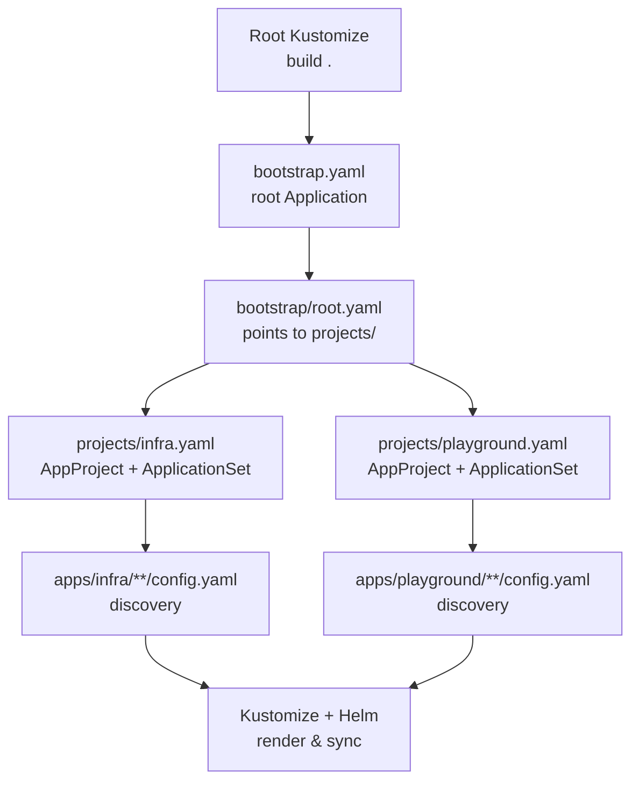
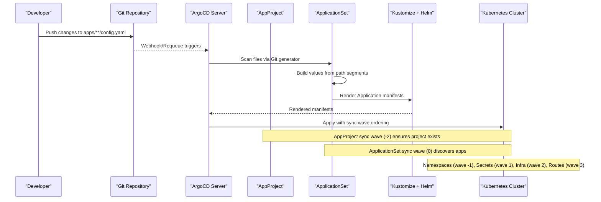
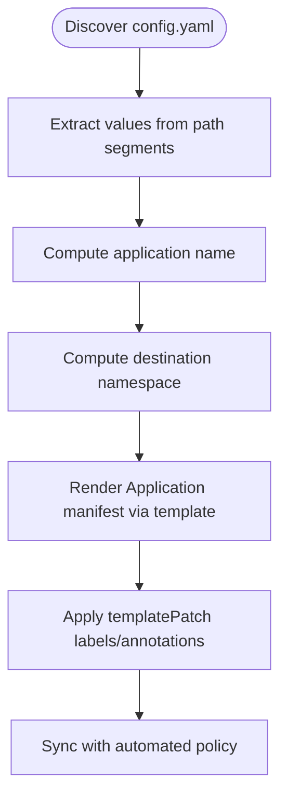
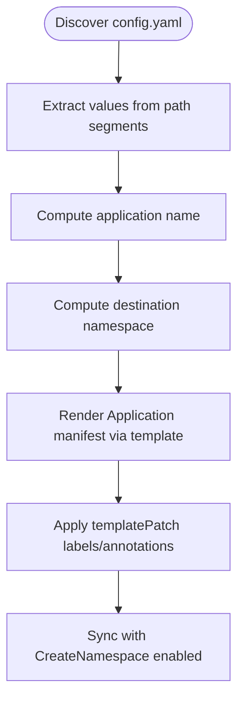
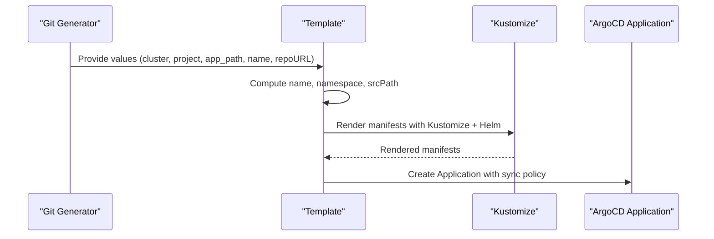
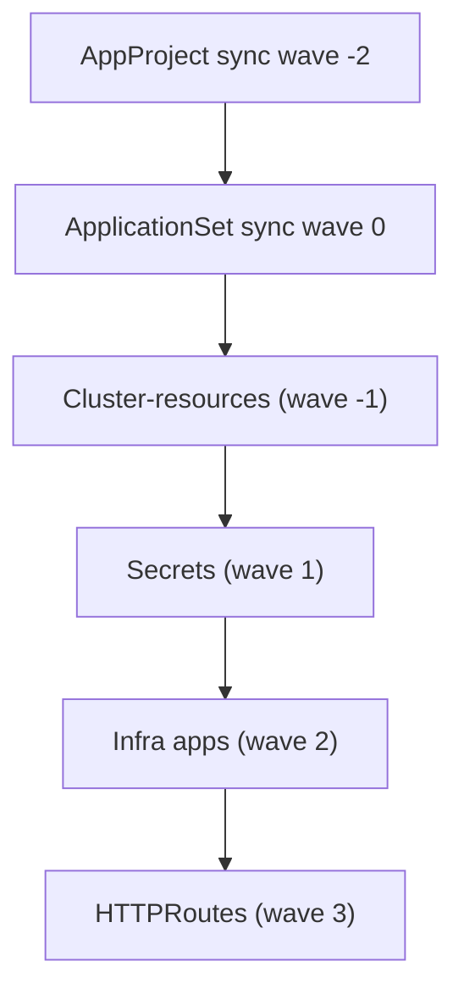
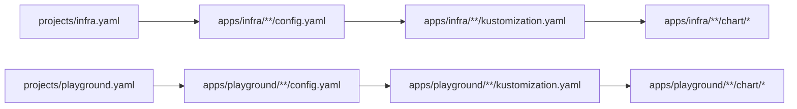
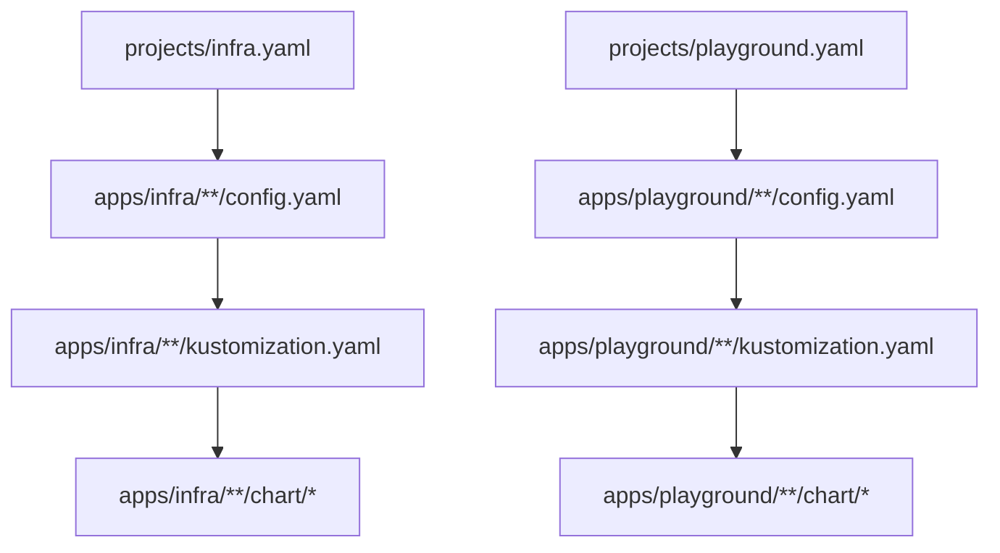

# Project Management

<cite>
**Referenced Files in This Document**
- [README.md](file://README.md)
- [bootstrap.yaml](file://bootstrap.yaml)
- [projects/infra.yaml](file://projects/infra.yaml)
- [projects/playground.yaml](file://projects/playground.yaml)
- [apps/infra/cloudflared/config.yaml](file://apps/infra/cloudflared/config.yaml)
- [apps/infra/datadog/config.yaml](file://apps/infra/datadog/config.yaml)
- [apps/infra/gateway-api/config.yaml](file://apps/infra/gateway-api/config.yaml)
- [apps/playground/argocd-ingress/config.yaml](file://apps/playground/argocd-ingress/config.yaml)
- [apps/playground/cert-manager/config.yaml](file://apps/playground/cert-manager/config.yaml)
- [apps/playground/hello-api/config.yaml](file://apps/playground/hello-api/config.yaml)
- [apps/playground/rancher/config.yaml](file://apps/playground/rancher/config.yaml)
- [apps/infra/cloudflared/kustomization.yaml](file://apps/infra/cloudflared/kustomization.yaml)
- [apps/playground/argocd-ingress/kustomization.yaml](file://apps/playground/argocd-ingress/kustomization.yaml)
- [apps/infra/cloudflared/chart/values.yaml](file://apps/infra/cloudflared/chart/values.yaml)
- [apps/playground/argocd-ingress/chart/values.yaml](file://apps/playground/argocd-ingress/chart/values.yaml)
</cite>

## Table of Contents
1. [Introduction](#introduction)
2. [Project Structure](#project-structure)
3. [Core Components](#core-components)
4. [Architecture Overview](#architecture-overview)
5. [Detailed Component Analysis](#detailed-component-analysis)
6. [Dependency Analysis](#dependency-analysis)
7. [Performance Considerations](#performance-considerations)
8. [Troubleshooting Guide](#troubleshooting-guide)
9. [Conclusion](#conclusion)
10. [Appendices](#appendices)

## Introduction
This document explains the project management system built on ArgoCD ApplicationSets. It covers how AppProjects and ApplicationSets are defined, how applications are discovered and deployed via config.yaml files, and how infrastructure (infra.yaml) and playground (playground.yaml) projects are separated. It also details the generators, templates, and dynamic application creation based on repository structure, along with configuration options for annotations, sync waves, and namespace management.

## Project Structure
The repository follows a GitOps pattern with a clear separation of concerns:
- Root Kustomize builds a bootstrap Application that seeds the cluster with foundational resources.
- The bootstrap process installs a root Application pointing to the projects/ directory, which defines AppProjects and ApplicationSets.
- ApplicationSets scan apps/infra/**/config.yaml and apps/playground/**/config.yaml to discover and render applications.
- Each discovered application is rendered by Kustomize and synced to the cluster.

**Diagram sources**
- [README.md:61-75](file://README.md#L61-L75)
- [bootstrap.yaml:10-18](file://bootstrap.yaml#L10-L18)
- [projects/infra.yaml:33-45](file://projects/infra.yaml#L33-L45)
- [projects/playground.yaml:33-45](file://projects/playground.yaml#L33-L45)

**Section sources**
- [README.md:57-118](file://README.md#L57-L118)
- [bootstrap.yaml:1-26](file://bootstrap.yaml#L1-L26)

## Core Components
- AppProject definitions: Two AppProjects are defined—infra and playground—each scoped to allow syncing from the repository and enabling broad cluster and namespace whitelists. They also set sync options and sync waves at the AppProject level.
- ApplicationSets: Each project defines an ApplicationSet that uses a Git generator to scan config.yaml files under its respective apps/ path. The generator extracts values from the file path and injects them into the template to produce ArgoCD Applications dynamically.
- Templates: The templates specify destination namespace, project, repoURL, targetRevision, and Kustomize build options. They also configure automated sync policies and retries.
- Config-driven customization: Individual apps contribute config.yaml files that can override destination namespace and add annotations (including sync wave) per application.

Key configuration highlights:
- Sync waves: Both AppProjects and individual apps can set sync waves to control order. AppProject-level waves are applied to the ApplicationSet itself, while app-level annotations can adjust per-application sync timing.
- Namespace management: destNamespace in config.yaml controls the target namespace; ApplicationSet templates default to the app folder name if not specified. Playground apps enable CreateNamespace in syncOptions to ensure namespaces are provisioned.
- Annotations: Both AppProject and app-level annotations are supported; labels and annotations are merged via templatePatch.

**Section sources**
- [projects/infra.yaml:1-21](file://projects/infra.yaml#L1-L21)
- [projects/infra.yaml:23-85](file://projects/infra.yaml#L23-L85)
- [projects/playground.yaml:1-21](file://projects/playground.yaml#L1-L21)
- [projects/playground.yaml:23-90](file://projects/playground.yaml#L23-L90)
- [apps/infra/cloudflared/config.yaml:1-4](file://apps/infra/cloudflared/config.yaml#L1-L4)
- [apps/infra/datadog/config.yaml:1-6](file://apps/infra/datadog/config.yaml#L1-L6)
- [apps/infra/gateway-api/config.yaml:1-6](file://apps/infra/gateway-api/config.yaml#L1-L6)
- [apps/playground/argocd-ingress/config.yaml:1-4](file://apps/playground/argocd-ingress/config.yaml#L1-L4)
- [apps/playground/cert-manager/config.yaml:1-5](file://apps/playground/cert-manager/config.yaml#L1-L5)
- [apps/playground/hello-api/config.yaml:1-4](file://apps/playground/hello-api/config.yaml#L1-L4)
- [apps/playground/rancher/config.yaml:1-5](file://apps/playground/rancher/config.yaml#L1-L5)

## Architecture Overview
The system orchestrates a deterministic sync order across multiple layers:
- AppProject-level sync waves ensure proper sequencing of project-wide resources.
- Bootstrap cluster-resources are applied early (wave -1) to pre-provision namespaces.
- ApplicationSets (wave 0) and platform components (wave 1) follow.
- Secrets from a private repository are synchronized (wave 1).
- Mid-tier infrastructure (wave 2) such as Gateways and monitoring agents.
- HTTPRoutes are applied last (wave 3) to ensure upstream gateways exist.

**Diagram sources**
- [README.md:76-86](file://README.md#L76-L86)
- [projects/infra.yaml:33-45](file://projects/infra.yaml#L33-L45)
- [projects/playground.yaml:33-45](file://projects/playground.yaml#L33-L45)

**Section sources**
- [README.md:76-86](file://README.md#L76-L86)
- [bootstrap.yaml:19-25](file://bootstrap.yaml#L19-L25)

## Detailed Component Analysis

### AppProject and ApplicationSet: infra.yaml
- AppProject: Grants broad permissions and sets sync options and sync wave at the project level. This ensures consistent behavior across all applications within the infra project.
- ApplicationSet: Uses a Git generator to watch apps/infra/**/config.yaml. Values extracted from path segments are injected into the template to compute name, namespace, and source path. The template enforces automated sync with pruning and self-healing, and includes retry configuration. The templatePatch merges labels and annotations from the discovered config.yaml.

**Diagram sources**
- [projects/infra.yaml:33-45](file://projects/infra.yaml#L33-L45)
- [projects/infra.yaml:46-85](file://projects/infra.yaml#L46-L85)

**Section sources**
- [projects/infra.yaml:1-85](file://projects/infra.yaml#L1-L85)

### AppProject and ApplicationSet: playground.yaml
- AppProject: Mirrors infra AppProject configuration for the playground project.
- ApplicationSet: Scans apps/playground/**/config.yaml with identical generator semantics. The key difference is that playground applications enable CreateNamespace and SkipDryRunOnMissingResource in syncOptions to simplify namespace provisioning and reduce noise during initial sync.

**Diagram sources**
- [projects/playground.yaml:33-45](file://projects/playground.yaml#L33-L45)
- [projects/playground.yaml:46-90](file://projects/playground.yaml#L46-L90)

**Section sources**
- [projects/playground.yaml:1-90](file://projects/playground.yaml#L1-L90)

### Application Discovery and Rendering
- Discovery: ApplicationSets use Git generators to match files at apps/infra/**/config.yaml and apps/playground/**/config.yaml. The generator populates values such as cluster, project, app_path, name, and repoURL.
- Template rendering: The template computes the application name, destination namespace, project, repoURL, targetRevision, and Kustomize path. Kustomize buildOptions enable Helm support.
- Namespace resolution: If destNamespace is not specified in config.yaml, the template defaults to the app’s folder name. Otherwise, it uses the value from config.yaml.
- Sync policy: Automated sync is enabled with pruning and self-healing. Retries are configured with bounded backoff.

**Diagram sources**
- [projects/infra.yaml:33-58](file://projects/infra.yaml#L33-L58)
- [projects/playground.yaml:33-58](file://projects/playground.yaml#L33-L58)

**Section sources**
- [projects/infra.yaml:33-60](file://projects/infra.yaml#L33-L60)
- [projects/playground.yaml:33-60](file://projects/playground.yaml#L33-L60)

### Namespace Management and Sync Waves
- AppProject-level sync waves: Both infra and playground AppProjects set sync wave -2 to ensure the project exists before downstream resources.
- App-level overrides: Individual apps can set destNamespace and annotations, including argocd.argoproj.io/sync-wave, to fine-tune ordering for specific applications.
- Playground special-case: Playground ApplicationSets enable CreateNamespace in syncOptions so namespaces are created automatically when missing.

**Diagram sources**
- [README.md:76-86](file://README.md#L76-L86)
- [projects/infra.yaml:4-6](file://projects/infra.yaml#L4-L6)
- [projects/playground.yaml:4-6](file://projects/playground.yaml#L4-L6)
- [apps/infra/cloudflared/config.yaml:3](file://apps/infra/cloudflared/config.yaml#L3)
- [apps/playground/argocd-ingress/config.yaml:3](file://apps/playground/argocd-ingress/config.yaml#L3)

**Section sources**
- [README.md:76-86](file://README.md#L76-L86)
- [apps/infra/cloudflared/config.yaml:1-4](file://apps/infra/cloudflared/config.yaml#L1-L4)
- [apps/playground/argocd-ingress/config.yaml:1-4](file://apps/playground/argocd-ingress/config.yaml#L1-L4)

### Relationship Between projects/ and apps/
- projects/: Contains AppProject and ApplicationSet definitions for infra and playground. These act as the control plane that discovers and renders applications.
- apps/: Contains the actual application definitions. Each app folder includes:
  - config.yaml: Controls destination namespace and optional annotations (including sync wave).
  - kustomization.yaml: Defines the namespace and references the chart/ directory.
  - chart/: Optional Helm chart values and manifests.

**Diagram sources**
- [projects/infra.yaml:38-39](file://projects/infra.yaml#L38-L39)
- [projects/playground.yaml:38-39](file://projects/playground.yaml#L38-L39)
- [apps/infra/cloudflared/kustomization.yaml:1-8](file://apps/infra/cloudflared/kustomization.yaml#L1-L8)
- [apps/playground/argocd-ingress/kustomization.yaml:1-9](file://apps/playground/argocd-ingress/kustomization.yaml#L1-L9)

**Section sources**
- [README.md:106-117](file://README.md#L106-L117)
- [apps/infra/cloudflared/kustomization.yaml:1-8](file://apps/infra/cloudflared/kustomization.yaml#L1-L8)
- [apps/playground/argocd-ingress/kustomization.yaml:1-9](file://apps/playground/argocd-ingress/kustomization.yaml#L1-L9)

### Practical Examples: config.yaml Options
- destNamespace: Overrides the default namespace derived from the app folder name.
- annotations: Supports argocd.argoproj.io/sync-wave to adjust per-app sync timing.
- syncOptions: Can be specified at the app level to control behavior such as CreateNamespace.

Examples:
- infra/cloudflared: Sets destNamespace and adds a sync wave annotation.
- infra/datadog: Includes a comment and sets destNamespace plus sync wave.
- infra/gateway-api: Adds syncOptions to create the namespace.
- playground/argocd-ingress: Sets destNamespace and adds a sync wave annotation.
- playground/cert-manager: Sets destNamespace and adds a sync wave annotation.
- playground/hello-api: Sets destNamespace and adds a sync wave annotation.
- playground/rancher: Sets destNamespace and adds a sync wave annotation.

**Section sources**
- [apps/infra/cloudflared/config.yaml:1-4](file://apps/infra/cloudflared/config.yaml#L1-L4)
- [apps/infra/datadog/config.yaml:1-6](file://apps/infra/datadog/config.yaml#L1-L6)
- [apps/infra/gateway-api/config.yaml:1-6](file://apps/infra/gateway-api/config.yaml#L1-L6)
- [apps/playground/argocd-ingress/config.yaml:1-4](file://apps/playground/argocd-ingress/config.yaml#L1-L4)
- [apps/playground/cert-manager/config.yaml:1-5](file://apps/playground/cert-manager/config.yaml#L1-L5)
- [apps/playground/hello-api/config.yaml:1-4](file://apps/playground/hello-api/config.yaml#L1-L4)
- [apps/playground/rancher/config.yaml:1-5](file://apps/playground/rancher/config.yaml#L1-L5)

## Dependency Analysis
- projects/infra.yaml and projects/playground.yaml depend on the repository structure under apps/. The Git generator depends on the presence of config.yaml files to produce Applications.
- apps/*/kustomization.yaml depends on the presence of chart/ directories to render Helm charts via Kustomize.
- Sync wave ordering ensures that prerequisites (namespaces, secrets, CRDs) are applied before dependent resources.

**Diagram sources**
- [projects/infra.yaml:38-39](file://projects/infra.yaml#L38-L39)
- [projects/playground.yaml:38-39](file://projects/playground.yaml#L38-L39)
- [apps/infra/cloudflared/kustomization.yaml:1-8](file://apps/infra/cloudflared/kustomization.yaml#L1-L8)
- [apps/playground/argocd-ingress/kustomization.yaml:1-9](file://apps/playground/argocd-ingress/kustomization.yaml#L1-L9)

**Section sources**
- [README.md:106-117](file://README.md#L106-L117)

## Performance Considerations
- Requeue interval: The Git generator is configured with a requeue interval to control polling frequency. This balances responsiveness with load.
- Retry policy: Automated sync includes bounded retries to handle transient failures.
- Kustomize build options: Enabling Helm support allows efficient chart rendering without manual templating overhead.
- Sync waves: Proper ordering reduces failed reconciliation cycles by ensuring prerequisites are present before dependent resources.

[No sources needed since this section provides general guidance]

## Troubleshooting Guide
- Missing namespaces: If an app fails to deploy due to a missing namespace, verify destNamespace in config.yaml and confirm whether CreateNamespace is enabled in the ApplicationSet or app-level syncOptions.
- Sync order issues: If HTTPRoutes fail because upstream gateways do not exist, review sync waves at both AppProject and app levels.
- Chart rendering problems: Ensure kustomization.yaml references the chart/ directory and that values are correctly supplied. Confirm Kustomize buildOptions include Helm support.
- Private secrets: Secrets from a private repository are synced via bootstrap/secrets.yaml; verify the bootstrap chain and sync waves align with the intended order.

**Section sources**
- [README.md:76-86](file://README.md#L76-L86)
- [apps/infra/gateway-api/config.yaml:3-6](file://apps/infra/gateway-api/config.yaml#L3-L6)
- [apps/playground/argocd-ingress/kustomization.yaml:1-9](file://apps/playground/argocd-ingress/kustomization.yaml#L1-L9)

## Conclusion
This project management system leverages ArgoCD ApplicationSets to automate application discovery and deployment across two distinct projects: infra and playground. By centralizing AppProject definitions and using Git generators to scan config.yaml files, the system achieves scalable, declarative control over application lifecycles. Sync waves, namespace management, and annotations provide precise control over rollout order and behavior, while Kustomize and Helm enable flexible rendering of complex workloads.

[No sources needed since this section summarizes without analyzing specific files]

## Appendices
- Adding a new application: Create a folder under apps/infra/<name>/ or apps/playground/<name>/, add config.yaml, kustomization.yaml, and optionally a chart/ directory. Commit and push; ArgoCD will detect and sync automatically.

**Section sources**
- [README.md:128-134](file://README.md#L128-L134)