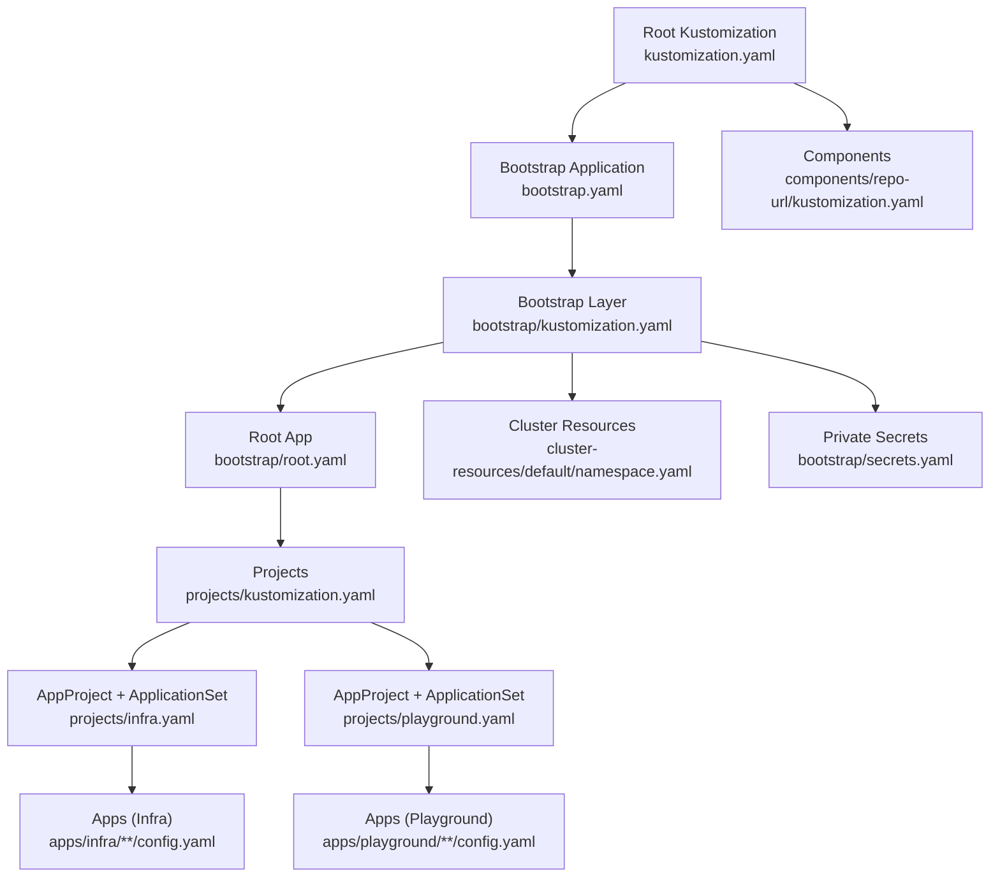
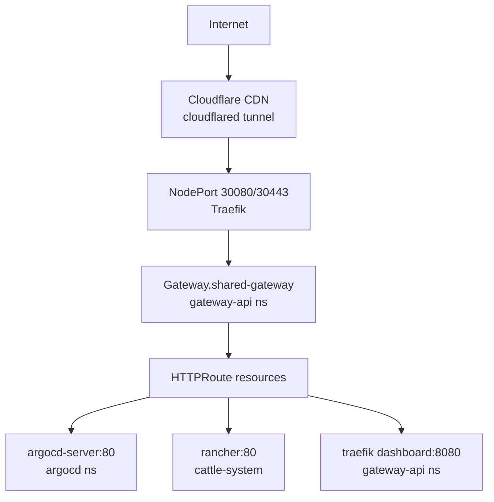
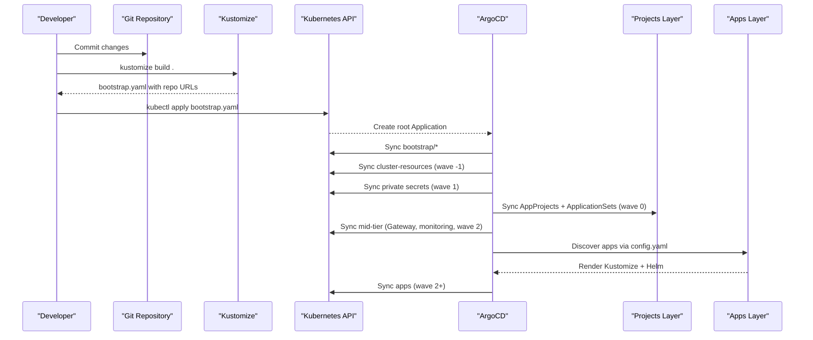
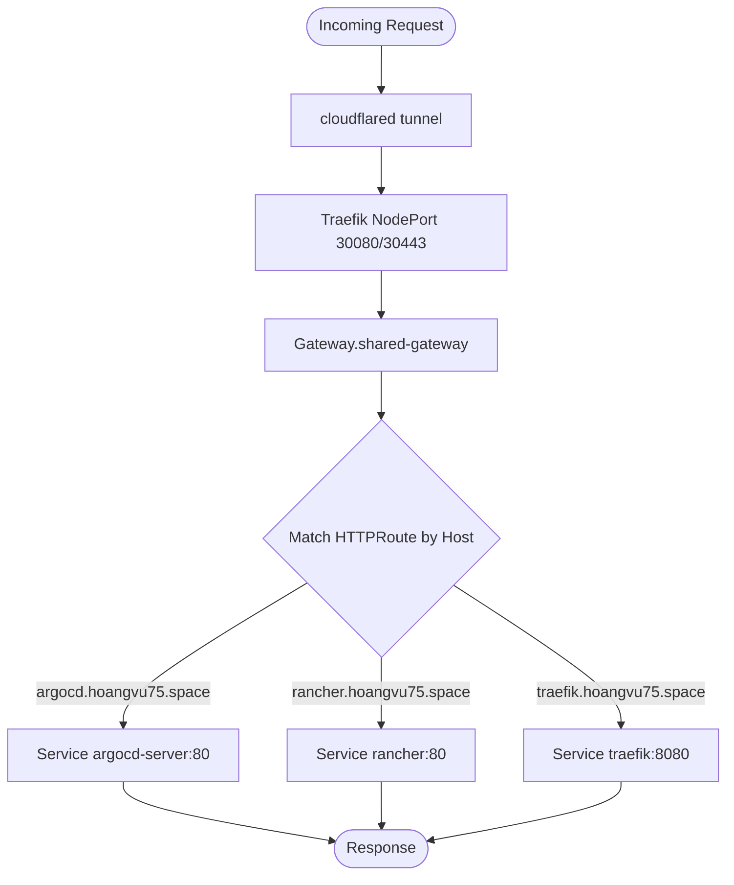
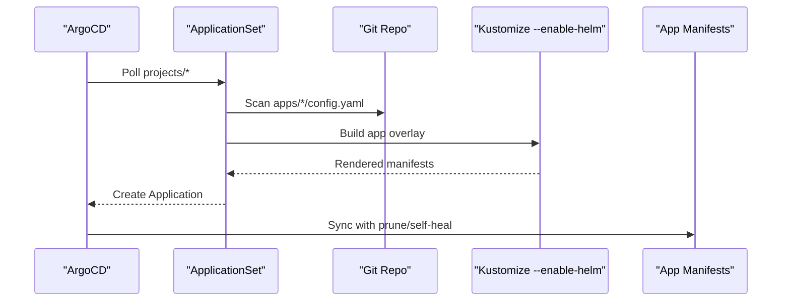
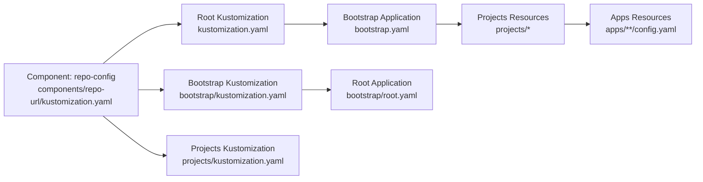

# Project Overview

<cite>
**Referenced Files in This Document**
- [README.md](file://README.md)
- [bootstrap.yaml](file://bootstrap.yaml)
- [kustomization.yaml](file://kustomization.yaml)
- [bootstrap/kustomization.yaml](file://bootstrap/kustomization.yaml)
- [bootstrap/root.yaml](file://bootstrap/root.yaml)
- [projects/kustomization.yaml](file://projects/kustomization.yaml)
- [projects/infra.yaml](file://projects/infra.yaml)
- [projects/playground.yaml](file://projects/playground.yaml)
- [components/repo-url/kustomization.yaml](file://components/repo-url/kustomization.yaml)
- [cluster-resources/default/namespace.yaml](file://cluster-resources/default/namespace.yaml)
- [apps/infra/gateway-api/chart/gateway.yaml](file://apps/infra/gateway-api/chart/gateway.yaml)
- [apps/infra/cloudflared/kustomization.yaml](file://apps/infra/cloudflared/kustomization.yaml)
- [apps/playground/argocd-ingress/kustomization.yaml](file://apps/playground/argocd-ingress/kustomization.yaml)
- [apps/playground/rancher/kustomization.yaml](file://apps/playground/rancher/kustomization.yaml)
- [apps/infra/datadog/kustomization.yaml](file://apps/infra/datadog/kustomization.yaml)
</cite>

## Table of Contents
1. [Introduction](#introduction)
2. [Project Structure](#project-structure)
3. [Core Components](#core-components)
4. [Architecture Overview](#architecture-overview)
5. [Detailed Component Analysis](#detailed-component-analysis)
6. [Dependency Analysis](#dependency-analysis)
7. [Performance Considerations](#performance-considerations)
8. [Troubleshooting Guide](#troubleshooting-guide)
9. [Conclusion](#conclusion)
10. [Appendices](#appendices)

## Introduction
This project is a GitOps-driven Kubernetes infrastructure management repository centered on declarative operations using ArgoCD, Kustomize, and Helm. It codifies the desired state of platform components and applications, ensuring reproducible deployments and safe operational practices. The system emphasizes:
- Declarative management: All changes flow through Git and are applied by ArgoCD.
- Secure separation of concerns: Sensitive secrets are isolated in a private repository and synchronized via ArgoCD.
- Predictable rollout order: Sync waves enforce safe sequencing of cluster resources, controllers, and applications.
- Modern ingress and routing: Cloudflare tunnels connect external traffic to a Traefik Gateway API controller, which routes requests to backend services using Kubernetes Gateway API resources.

Target audience:
- Platform engineers managing shared infrastructure and ingress.
- Application teams deploying workloads behind a unified Gateway API.
- Organizations adopting GitOps with ArgoCD, Kustomize, and Helm.

Use cases:
- Bootstrapping a cluster with ArgoCD and foundational platform components.
- Exposing internal services securely via Cloudflare tunnels and Traefik Gateway API.
- Managing multiple environments and projects with consistent sync ordering.
- Automating TLS termination and route management with HTTPRoute resources.

Key benefits:
- Consistency: Single source of truth in Git.
- Safety: Automated pruning and self-healing with explicit sync waves.
- Observability: Monitoring agent installed alongside platform components.
- Scalability: ApplicationSets discover and deploy apps from centralized config files.

## Project Structure
The repository organizes manifests into layers:
- Root Kustomization builds a bootstrap Application and injects repository URLs.
- Bootstrap layer applies the root Application, cluster resources, and private secrets.
- Projects define AppProjects and ApplicationSets that discover apps from config files.
- Apps are grouped under infra and playground, each with Kustomize overlays and optional Helm charts.
- Shared cluster resources (namespaces) are provisioned with negative sync waves to guarantee prerequisites.

**Diagram sources**
- [kustomization.yaml:1-21](file://kustomization.yaml#L1-L21)
- [bootstrap.yaml:1-26](file://bootstrap.yaml#L1-L26)
- [components/repo-url/kustomization.yaml:1-11](file://components/repo-url/kustomization.yaml#L1-L11)
- [bootstrap/kustomization.yaml:1-38](file://bootstrap/kustomization.yaml#L1-L38)
- [bootstrap/root.yaml:1-37](file://bootstrap/root.yaml#L1-L37)
- [projects/kustomization.yaml:1-22](file://projects/kustomization.yaml#L1-L22)
- [projects/infra.yaml:1-85](file://projects/infra.yaml#L1-L85)
- [projects/playground.yaml:1-90](file://projects/playground.yaml#L1-L90)
- [cluster-resources/default/namespace.yaml:1-52](file://cluster-resources/default/namespace.yaml#L1-L52)

**Section sources**
- [README.md:87-118](file://README.md#L87-L118)
- [kustomization.yaml:1-21](file://kustomization.yaml#L1-L21)
- [bootstrap/kustomization.yaml:1-38](file://bootstrap/kustomization.yaml#L1-L38)
- [projects/kustomization.yaml:1-22](file://projects/kustomization.yaml#L1-L22)

## Core Components
- Root Kustomization and Bootstrap Application: Builds the initial bootstrap Application and injects repository URLs from a shared component.
- Bootstrap Layer: Applies the root Application, cluster resources (namespaces), and private secrets using replacements.
- Projects (AppProjects + ApplicationSets): Define discovery rules and sync policies for apps located under apps/infra and apps/playground.
- Apps: Each app defines a config.yaml for discovery, optional Kustomize overlays, and Helm charts via Kustomize build options.
- Cluster Resources: Shared namespaces and cluster-wide objects are provisioned with negative sync waves to ensure prerequisites exist before apps deploy.
- Ingress and Routing: Gateway API Gateway and HTTPRoute resources route traffic from Traefik to backend services.

**Section sources**
- [README.md:57-86](file://README.md#L57-L86)
- [bootstrap.yaml:1-26](file://bootstrap.yaml#L1-L26)
- [bootstrap/root.yaml:1-37](file://bootstrap/root.yaml#L1-L37)
- [projects/infra.yaml:1-85](file://projects/infra.yaml#L1-L85)
- [projects/playground.yaml:1-90](file://projects/playground.yaml#L1-L90)
- [cluster-resources/default/namespace.yaml:1-52](file://cluster-resources/default/namespace.yaml#L1-L52)

## Architecture Overview
The system integrates external connectivity with internal Kubernetes services:
- External traffic arrives at Cloudflare Edge, tunneled into the cluster via cloudflared.
- Traefik runs as a Gateway API controller and exposes services on NodePort.
- A shared Gateway resource defines listeners for HTTP and HTTPS and binds TLS certificates.
- HTTPRoute resources attached to hostnames route traffic to backend Services.
- ArgoCD continuously reconciles desired state from this repository and private secrets.

**Diagram sources**
- [README.md:5-48](file://README.md#L5-L48)
- [apps/infra/gateway-api/chart/gateway.yaml:1-27](file://apps/infra/gateway-api/chart/gateway.yaml#L1-L27)
- [apps/playground/argocd-ingress/kustomization.yaml:1-9](file://apps/playground/argocd-ingress/kustomization.yaml#L1-L9)
- [apps/playground/rancher/kustomization.yaml:1-9](file://apps/playground/rancher/kustomization.yaml#L1-L9)

## Detailed Component Analysis

### Bootstrap Chain and Sync Ordering
The bootstrap chain establishes ArgoCD and cascades into project definitions and app deployments. It also enforces strict sync waves to avoid race conditions:
- Build root bootstrap manifest and apply it once.
- Replace placeholders with repository URLs from a shared component.
- Apply cluster resources (namespaces) with wave -1.
- Apply private secrets with wave 1.
- Create AppProjects and ApplicationSets with wave 0.
- Deploy mid-tier resources (Gateway, monitoring) with wave 2.
- Apply HTTPRoute resources last (wave 3) so routes bind to existing Gateway.

**Diagram sources**
- [README.md:59-75](file://README.md#L59-L75)
- [kustomization.yaml:10-21](file://kustomization.yaml#L10-L21)
- [bootstrap/kustomization.yaml:12-38](file://bootstrap/kustomization.yaml#L12-L38)
- [projects/infra.yaml:6-7](file://projects/infra.yaml#L6-L7)
- [projects/playground.yaml:6-7](file://projects/playground.yaml#L6-L7)
- [cluster-resources/default/namespace.yaml:8-9](file://cluster-resources/default/namespace.yaml#L8-L9)

**Section sources**
- [README.md:59-86](file://README.md#L59-L86)
- [kustomization.yaml:10-21](file://kustomization.yaml#L10-L21)
- [bootstrap/kustomization.yaml:12-38](file://bootstrap/kustomization.yaml#L12-L38)
- [projects/infra.yaml:6-7](file://projects/infra.yaml#L6-L7)
- [projects/playground.yaml:6-7](file://projects/playground.yaml#L6-L7)
- [cluster-resources/default/namespace.yaml:8-9](file://cluster-resources/default/namespace.yaml#L8-L9)

### Ingress and Routing Pipeline
External traffic is routed through Cloudflare tunnels to Traefik, which acts as a Gateway API controller. The shared Gateway listens on HTTP/HTTPS and terminates TLS using a wildcard certificate. HTTPRoute resources match hostnames and forward to backend Services.

**Diagram sources**
- [README.md:38-56](file://README.md#L38-L56)
- [apps/infra/gateway-api/chart/gateway.yaml:1-27](file://apps/infra/gateway-api/chart/gateway.yaml#L1-L27)
- [apps/playground/argocd-ingress/kustomization.yaml:1-9](file://apps/playground/argocd-ingress/kustomization.yaml#L1-L9)
- [apps/playground/rancher/kustomization.yaml:1-9](file://apps/playground/rancher/kustomization.yaml#L1-L9)

**Section sources**
- [README.md:38-56](file://README.md#L38-L56)
- [apps/infra/gateway-api/chart/gateway.yaml:1-27](file://apps/infra/gateway-api/chart/gateway.yaml#L1-L27)

### Application Discovery and Rendering
ApplicationSets scan the apps directories for config.yaml files and render each app using Kustomize with Helm support. Discovery is scoped per project (infra vs playground), and each app can override destination namespace and sync wave via annotations.

**Diagram sources**
- [projects/infra.yaml:33-60](file://projects/infra.yaml#L33-L60)
- [projects/playground.yaml:33-60](file://projects/playground.yaml#L33-L60)
- [apps/infra/cloudflared/kustomization.yaml:1-8](file://apps/infra/cloudflared/kustomization.yaml#L1-L8)
- [apps/infra/datadog/kustomization.yaml:1-8](file://apps/infra/datadog/kustomization.yaml#L1-L8)
- [apps/playground/argocd-ingress/kustomization.yaml:1-9](file://apps/playground/argocd-ingress/kustomization.yaml#L1-L9)
- [apps/playground/rancher/kustomization.yaml:1-9](file://apps/playground/rancher/kustomization.yaml#L1-L9)

**Section sources**
- [projects/infra.yaml:33-60](file://projects/infra.yaml#L33-L60)
- [projects/playground.yaml:33-60](file://projects/playground.yaml#L33-L60)
- [apps/infra/cloudflared/kustomization.yaml:1-8](file://apps/infra/cloudflared/kustomization.yaml#L1-L8)
- [apps/infra/datadog/kustomization.yaml:1-8](file://apps/infra/datadog/kustomization.yaml#L1-L8)
- [apps/playground/argocd-ingress/kustomization.yaml:1-9](file://apps/playground/argocd-ingress/kustomization.yaml#L1-L9)
- [apps/playground/rancher/kustomization.yaml:1-9](file://apps/playground/rancher/kustomization.yaml#L1-L9)

## Dependency Analysis
The system’s dependencies are primarily driven by Kustomize replacements and ArgoCD’s layered synchronization:
- Root Kustomization depends on a shared component to inject repository URLs into bootstrap and downstream resources.
- Bootstrap Kustomization depends on the same component to replace placeholders in root, cluster-resources, and secrets Applications.
- Projects Kustomization depends on the component to inject repo URLs into ApplicationSets.
- Apps depend on Kustomize overlays and optional Helm charts, orchestrated by ArgoCD.

**Diagram sources**
- [components/repo-url/kustomization.yaml:1-11](file://components/repo-url/kustomization.yaml#L1-L11)
- [kustomization.yaml:4-8](file://kustomization.yaml#L4-L8)
- [bootstrap/kustomization.yaml:4-10](file://bootstrap/kustomization.yaml#L4-L10)
- [projects/kustomization.yaml:4-9](file://projects/kustomization.yaml#L4-L9)
- [bootstrap.yaml:15-18](file://bootstrap.yaml#L15-L18)
- [bootstrap/root.yaml:15-18](file://bootstrap/root.yaml#L15-L18)

**Section sources**
- [kustomization.yaml:4-8](file://kustomization.yaml#L4-L8)
- [bootstrap/kustomization.yaml:4-10](file://bootstrap/kustomization.yaml#L4-L10)
- [projects/kustomization.yaml:4-9](file://projects/kustomization.yaml#L4-L9)
- [components/repo-url/kustomization.yaml:4-10](file://components/repo-url/kustomization.yaml#L4-L10)

## Performance Considerations
- Use sync waves to minimize conflicts during startup and reduce unnecessary rollouts.
- Keep ApplicationSet polling intervals reasonable to balance freshness and load.
- Prefer OCI Helm charts and enable Helm via Kustomize build options to centralize chart management.
- Limit concurrent syncs by organizing apps into projects and using appropriate retry/backoff policies.

## Troubleshooting Guide
Common issues and resolutions:
- Missing repository URLs: Verify the shared component is included and replacements are applied in root and bootstrap Kustomizations.
- Namespace prerequisites: Ensure cluster-resources are synced with wave -1 before apps attempt to create resources.
- HTTPRoute not applied: Confirm Gateway exists and TLS secret is ready before applying HTTPRoute resources.
- Private secrets not found: Validate the private secrets Application points to the correct repository and branch.
- ApplicationSet not discovering apps: Check config.yaml presence and path patterns in ApplicationSet generators.

**Section sources**
- [README.md:120-127](file://README.md#L120-L127)
- [README.md:160-163](file://README.md#L160-L163)
- [cluster-resources/default/namespace.yaml:8-9](file://cluster-resources/default/namespace.yaml#L8-L9)
- [apps/infra/gateway-api/chart/gateway.yaml:7](file://apps/infra/gateway-api/chart/gateway.yaml#L7)

## Conclusion
This repository demonstrates a production-grade GitOps setup that combines ArgoCD, Kustomize, and Helm to manage Kubernetes infrastructure and applications declaratively. By enforcing a bootstrap chain, repository URL injection, and strict sync waves, it ensures predictable, safe, and observable deployments. The integration of Cloudflare tunnels and Traefik Gateway API provides a modern, secure ingress model suitable for multi-tenant and multi-environment scenarios.

## Appendices

### Practical Examples of the Deployment Pipeline
- Adding a new app:
  - Create a folder under apps/infra/<name>/ or apps/playground/<name>/.
  - Add config.yaml to define destination namespace and optional sync wave.
  - Add Kustomize overlays and/or a chart directory.
  - Commit and push; ArgoCD discovers and syncs automatically.
- Exposing ArgoCD via HTTPRoute:
  - Place an HTTPRoute pointing to argocd-server Service in the argocd namespace.
  - Ensure the route matches the configured hostname and binds to the shared Gateway.
- Managing secrets:
  - Store sensitive values in the private repository and reference them via the secrets Application.
  - Keep the private repository out of this public repository to maintain security.

**Section sources**
- [README.md:128-143](file://README.md#L128-L143)
- [README.md:160-163](file://README.md#L160-L163)
- [apps/playground/argocd-ingress/kustomization.yaml:1-9](file://apps/playground/argocd-ingress/kustomization.yaml#L1-L9)