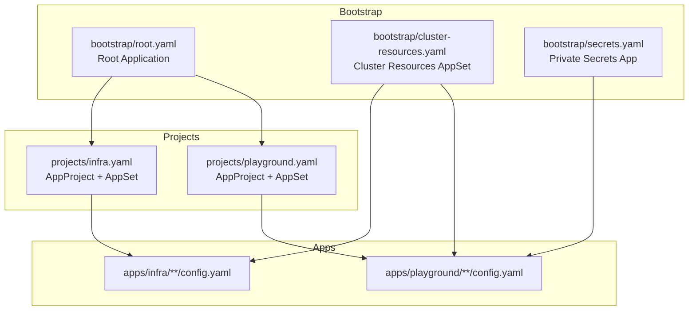
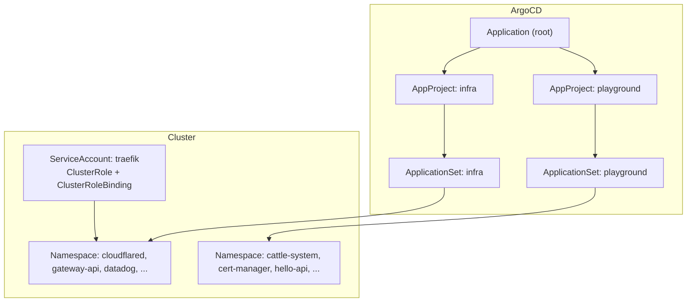
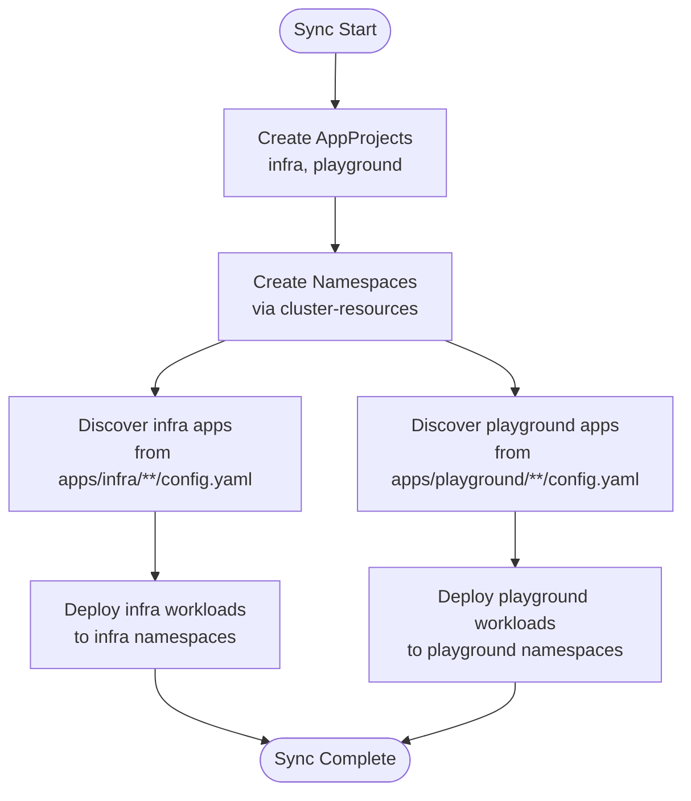
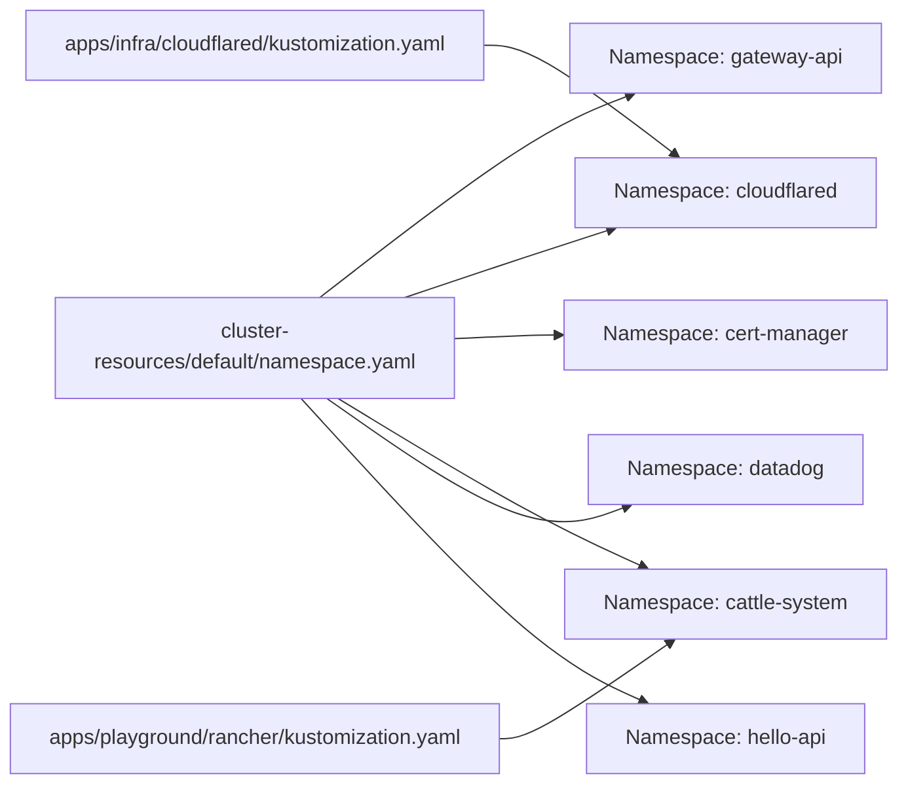
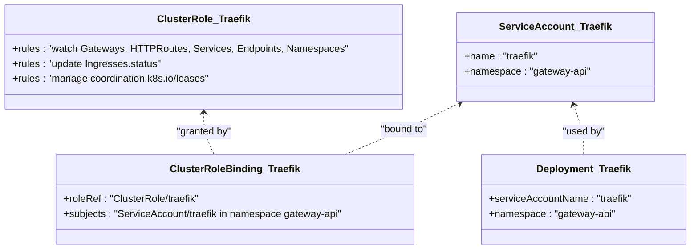
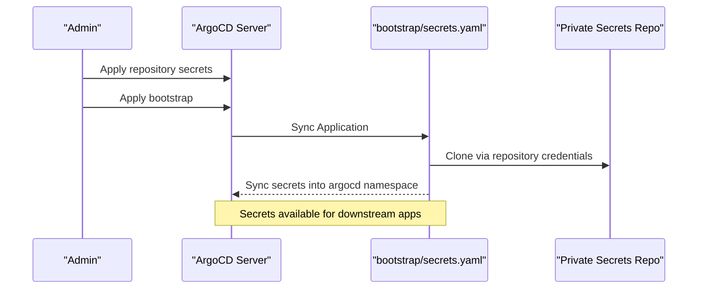
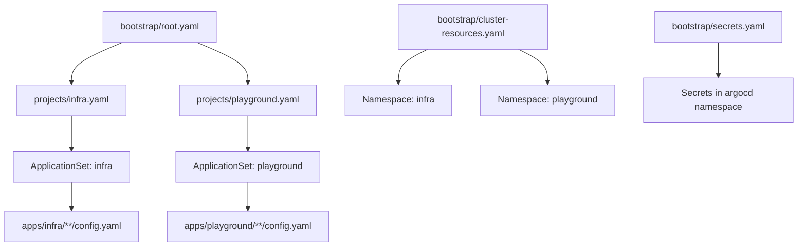

# Access Controls and RBAC

<cite>
**Referenced Files in This Document**
- [README.md](file://README.md)
- [infra.yaml](file://projects/infra.yaml)
- [playground.yaml](file://projects/playground.yaml)
- [root.yaml](file://bootstrap/root.yaml)
- [cluster-resources.yaml](file://bootstrap/cluster-resources.yaml)
- [namespace.yaml](file://cluster-resources/default/namespace.yaml)
- [kustomization.yaml](file://apps/infra/cloudflared/kustomization.yaml)
- [kustomization.yaml](file://apps/playground/rancher/kustomization.yaml)
- [traefik.yaml](file://apps/infra/gateway-api/chart/traefik.yaml)
- [kustomization.yaml](file://apps/infra/gateway-api/chart/kustomization.yaml)
- [secrets.yaml](file://bootstrap/secrets.yaml)
- [argocd-repository-secrets.yaml](file://guide/argocd/argocd-repository-secrets.yaml)
- [argo_cd.md](file://guide/argocd/argo_cd.md)
</cite>

## Table of Contents
1. [Introduction](#introduction)
2. [Project Structure](#project-structure)
3. [Core Components](#core-components)
4. [Architecture Overview](#architecture-overview)
5. [Detailed Component Analysis](#detailed-component-analysis)
6. [Dependency Analysis](#dependency-analysis)
7. [Performance Considerations](#performance-considerations)
8. [Troubleshooting Guide](#troubleshooting-guide)
9. [Conclusion](#conclusion)
10. [Appendices](#appendices)

## Introduction
This document explains access control and Role-Based Access Control (RBAC) mechanisms in the GitOps environment. It focuses on how ArgoCD project boundaries isolate infrastructure from playground applications, how namespace isolation contributes to security, and how least privilege is applied across layers. It also provides practical guidelines for configuring permissions for teams and automated processes.

## Project Structure
The repository organizes resources into two primary ArgoCD AppProjects:
- infra: for platform and infrastructure components
- playground: for experimental and user-facing applications

ArgoCD discovers applications via ApplicationSets that scan config.yaml files under apps/infra and apps/playground. Bootstrap order enforces safe creation of namespaces and cluster resources before application deployments.

**Diagram sources**
- [root.yaml:1-37](file://bootstrap/root.yaml#L1-L37)
- [cluster-resources.yaml:1-33](file://bootstrap/cluster-resources.yaml#L1-L33)
- [secrets.yaml:1-24](file://bootstrap/secrets.yaml#L1-L24)
- [infra.yaml:1-85](file://projects/infra.yaml#L1-L85)
- [playground.yaml:1-90](file://projects/playground.yaml#L1-L90)

**Section sources**
- [README.md:68-85](file://README.md#L68-L85)
- [root.yaml:1-37](file://bootstrap/root.yaml#L1-L37)
- [cluster-resources.yaml:1-33](file://bootstrap/cluster-resources.yaml#L1-L33)
- [infra.yaml:1-85](file://projects/infra.yaml#L1-L85)
- [playground.yaml:1-90](file://projects/playground.yaml#L1-L90)

## Core Components
- AppProjects define resource boundaries and source repositories per environment:
  - infra: infrastructure and platform components
  - playground: experimental and user-facing applications
- ApplicationSets discover and render applications from config.yaml files under apps/*/ using Kustomize and Helm.
- Namespace isolation is enforced by pre-creating shared namespaces with negative sync waves and scoping app Kustomizations to specific namespaces.
- RBAC is implemented at the application level (e.g., Traefik) to grant minimal required permissions.

Key boundary enforcement:
- AppProject spec.sourceRepos allows each project to reference only its intended repository subset.
- AppProject spec.destinations restricts where applications may deploy (namespace and server).
- AppProject spec.clusterResourceWhitelist and spec.namespaceResourceWhitelist define allowed cluster-wide and namespace-scoped resources.

**Section sources**
- [infra.yaml:9-21](file://projects/infra.yaml#L9-L21)
- [playground.yaml:9-21](file://projects/playground.yaml#L9-L21)
- [infra.yaml:33-58](file://projects/infra.yaml#L33-L58)
- [playground.yaml:33-58](file://projects/playground.yaml#L33-L58)
- [namespace.yaml:1-52](file://cluster-resources/default/namespace.yaml#L1-L52)
- [kustomization.yaml:1-8](file://apps/infra/cloudflared/kustomization.yaml#L1-L8)
- [kustomization.yaml:1-9](file://apps/playground/rancher/kustomization.yaml#L1-L9)

## Architecture Overview
The access control architecture combines ArgoCD AppProjects, namespace scoping, and application-specific RBAC to enforce least privilege and prevent cross-environment access.

**Diagram sources**
- [root.yaml:10-18](file://bootstrap/root.yaml#L10-L18)
- [infra.yaml:23-85](file://projects/infra.yaml#L23-L85)
- [playground.yaml:23-90](file://projects/playground.yaml#L23-L90)
- [namespace.yaml:4-52](file://cluster-resources/default/namespace.yaml#L4-L52)
- [traefik.yaml:43-54](file://apps/infra/gateway-api/chart/traefik.yaml#L43-L54)

## Detailed Component Analysis

### AppProject Boundaries: infra vs. playground
- Both projects whitelist cluster and namespace resources broadly to support Helm/Kustomize rendering, but they remain isolated by source repository scope and destination namespace/server restrictions.
- ApplicationSets under each project enumerate config.yaml files from their respective apps/* subtree, ensuring discovery remains scoped to the project’s domain.
- Sync wave ordering ensures AppProjects are created before namespaces and apps, preventing accidental cross-project deployments.

**Diagram sources**
- [infra.yaml:23-85](file://projects/infra.yaml#L23-L85)
- [playground.yaml:23-90](file://projects/playground.yaml#L23-L90)
- [cluster-resources.yaml:1-33](file://bootstrap/cluster-resources.yaml#L1-L33)
- [README.md:76-85](file://README.md#L76-L85)

**Section sources**
- [infra.yaml:9-21](file://projects/infra.yaml#L9-L21)
- [playground.yaml:9-21](file://projects/playground.yaml#L9-L21)
- [infra.yaml:33-58](file://projects/infra.yaml#L33-L58)
- [playground.yaml:33-58](file://projects/playground.yaml#L33-L58)
- [README.md:76-85](file://README.md#L76-L85)

### Namespace Isolation Strategies
- Shared namespaces are provisioned early (sync-wave -1) to guarantee existence before apps attempt to deploy.
- App Kustomizations set a fixed namespace, ensuring all resources belong to the intended namespace and cannot drift into others.
- Rancher is scoped to cattle-system; Cloudflared to cloudflared; Traefik to gateway-api; Cert-manager to cert-manager; and so forth.

**Diagram sources**
- [namespace.yaml:1-52](file://cluster-resources/default/namespace.yaml#L1-L52)
- [kustomization.yaml:1-8](file://apps/infra/cloudflared/kustomization.yaml#L1-L8)
- [kustomization.yaml:1-9](file://apps/playground/rancher/kustomization.yaml#L1-L9)

**Section sources**
- [namespace.yaml:1-52](file://cluster-resources/default/namespace.yaml#L1-L52)
- [kustomization.yaml:1-8](file://apps/infra/cloudflared/kustomization.yaml#L1-L8)
- [kustomization.yaml:1-9](file://apps/playground/rancher/kustomization.yaml#L1-L9)

### Application RBAC: Traefik as a Minimal-Privilege Example
Traefik runs with a dedicated ServiceAccount and a narrowly scoped ClusterRole that grants only the permissions required to watch Gateways, HTTPRoutes, Services, and manage leader election leases. This exemplifies least privilege.

**Diagram sources**
- [traefik.yaml:43-54](file://apps/infra/gateway-api/chart/traefik.yaml#L43-L54)
- [traefik.yaml:10-42](file://apps/infra/gateway-api/chart/traefik.yaml#L10-L42)
- [traefik.yaml:56-95](file://apps/infra/gateway-api/chart/traefik.yaml#L56-L95)

**Section sources**
- [traefik.yaml:10-42](file://apps/infra/gateway-api/chart/traefik.yaml#L10-L42)
- [traefik.yaml:43-54](file://apps/infra/gateway-api/chart/traefik.yaml#L43-L54)
- [traefik.yaml:56-95](file://apps/infra/gateway-api/chart/traefik.yaml#L56-L95)

### Repository and Secret Access Control
- Private secrets are stored in a separate private repository and synchronized via an Application that targets the argocd namespace. This prevents sensitive credentials from leaking into the public repository.
- Repository credentials are supplied via ArgoCD Secrets labeled for repository access, enabling ArgoCD to clone private repos without embedding credentials in manifests.

**Diagram sources**
- [secrets.yaml:1-24](file://bootstrap/secrets.yaml#L1-L24)
- [argocd-repository-secrets.yaml:1-30](file://guide/argocd/argocd-repository-secrets.yaml#L1-L30)
- [argo_cd.md:18-27](file://guide/argocd/argo_cd.md#L18-L27)

**Section sources**
- [secrets.yaml:1-24](file://bootstrap/secrets.yaml#L1-L24)
- [argocd-repository-secrets.yaml:1-30](file://guide/argocd/argocd-repository-secrets.yaml#L1-L30)
- [argo_cd.md:18-27](file://guide/argocd/argo_cd.md#L18-L27)

## Dependency Analysis
The following diagram maps how bootstrap, projects, and apps depend on each other to establish access control boundaries.

**Diagram sources**
- [root.yaml:1-37](file://bootstrap/root.yaml#L1-L37)
- [infra.yaml:23-85](file://projects/infra.yaml#L23-L85)
- [playground.yaml:23-90](file://projects/playground.yaml#L23-L90)
- [cluster-resources.yaml:1-33](file://bootstrap/cluster-resources.yaml#L1-L33)
- [secrets.yaml:1-24](file://bootstrap/secrets.yaml#L1-L24)

**Section sources**
- [root.yaml:1-37](file://bootstrap/root.yaml#L1-L37)
- [infra.yaml:23-85](file://projects/infra.yaml#L23-L85)
- [playground.yaml:23-90](file://projects/playground.yaml#L23-L90)
- [cluster-resources.yaml:1-33](file://bootstrap/cluster-resources.yaml#L1-L33)
- [secrets.yaml:1-24](file://bootstrap/secrets.yaml#L1-L24)

## Performance Considerations
- Negative sync waves ensure prerequisites (AppProjects, Namespaces) are ready before apps attempt to deploy, reducing failed reconciliation loops.
- ApplicationSets use targeted file discovery to minimize unnecessary scanning and improve sync throughput.
- Using ArgoCD’s automated sync policies with pruning and self-healing reduces manual intervention and stabilizes state.

[No sources needed since this section provides general guidance]

## Troubleshooting Guide
- If apps fail to deploy into the wrong namespace, verify the app’s Kustomization sets the correct namespace and that the target namespace exists prior to deployment.
- If ArgoCD cannot access private repositories, confirm repository credentials are applied and the Application targeting the private repo is synced.
- If RBAC prevents a workload from functioning, review the workload’s ServiceAccount and associated ClusterRole/Role bindings for least privilege alignment.

**Section sources**
- [kustomization.yaml:1-8](file://apps/infra/cloudflared/kustomization.yaml#L1-L8)
- [kustomization.yaml:1-9](file://apps/playground/rancher/kustomization.yaml#L1-L9)
- [argocd-repository-secrets.yaml:1-30](file://guide/argocd/argocd-repository-secrets.yaml#L1-L30)
- [traefik.yaml:10-42](file://apps/infra/gateway-api/chart/traefik.yaml#L10-L42)

## Conclusion
By combining ArgoCD AppProjects, strict namespace scoping, and minimal RBAC, this repository enforces strong separation between infrastructure and playground environments. Least privilege is applied consistently: AppProjects constrain source and destination scopes, namespaces isolate resources, and application-level RBAC limits privileges to what is necessary for operation.

[No sources needed since this section summarizes without analyzing specific files]

## Appendices

### Guidelines for Setting Up Permissions
- Team members:
  - Grant read-only access to ArgoCD UI and CLI for monitoring and auditing.
  - Provide write access only to the specific AppProject(s) they maintain (infra or playground).
  - Restrict repository access to the appropriate source repositories per project.
- Automated processes:
  - Use dedicated ServiceAccounts with minimal RBAC for each workload.
  - Store credentials in the private secrets repository and reference them via ArgoCD Secrets.
  - Keep sync waves ordered to ensure prerequisites exist before dependent resources.

**Section sources**
- [infra.yaml:9-21](file://projects/infra.yaml#L9-L21)
- [playground.yaml:9-21](file://projects/playground.yaml#L9-L21)
- [namespace.yaml:1-52](file://cluster-resources/default/namespace.yaml#L1-L52)
- [traefik.yaml:10-42](file://apps/infra/gateway-api/chart/traefik.yaml#L10-L42)
- [argocd-repository-secrets.yaml:1-30](file://guide/argocd/argocd-repository-secrets.yaml#L1-L30)