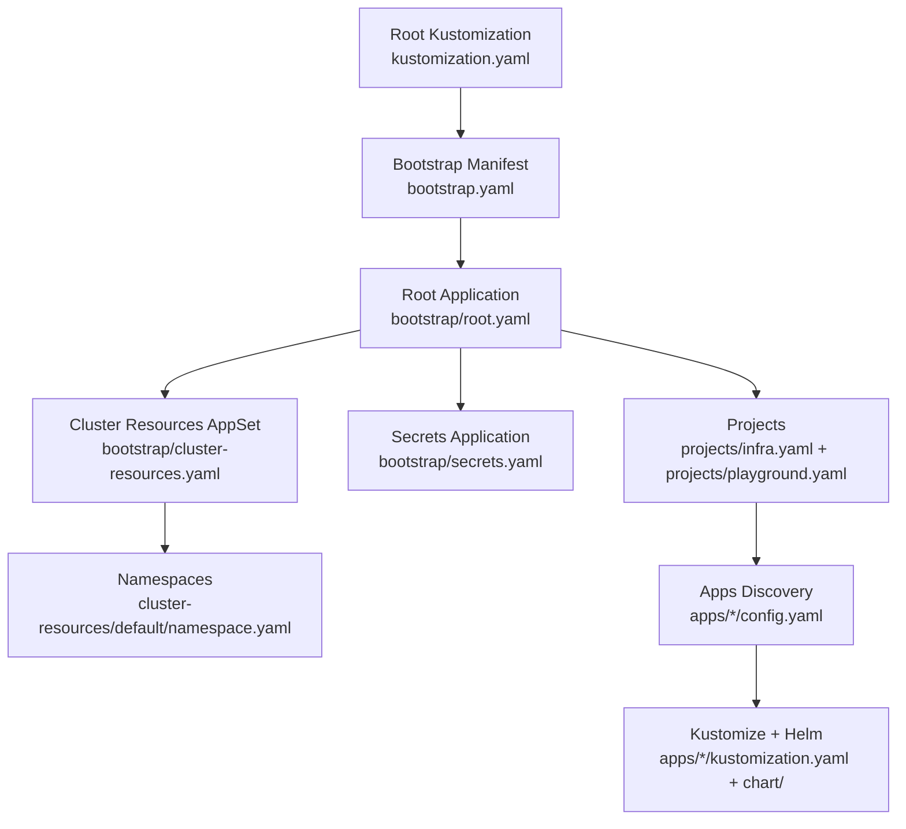
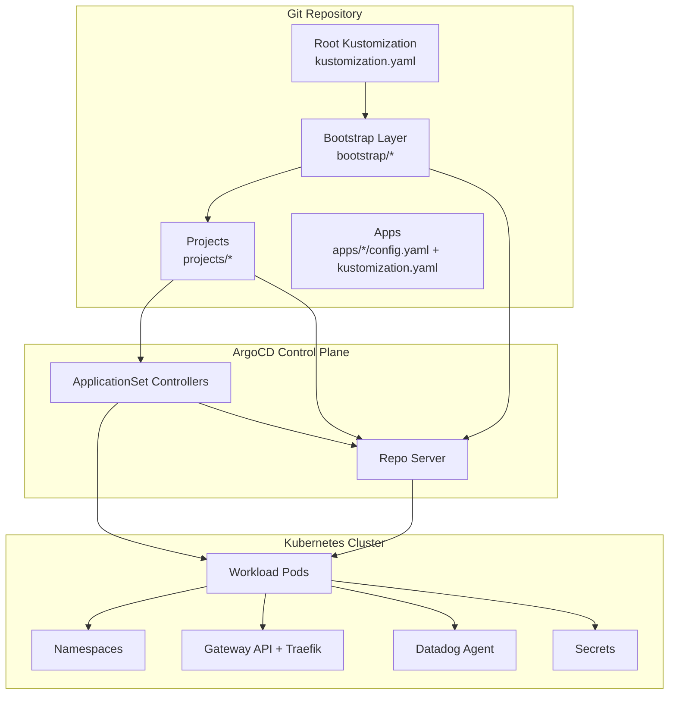
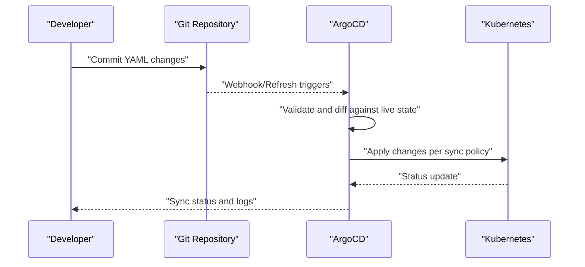
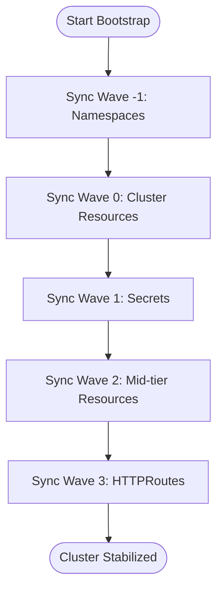
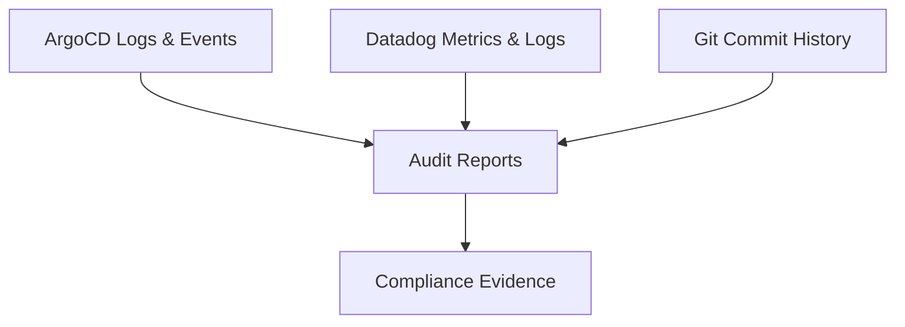
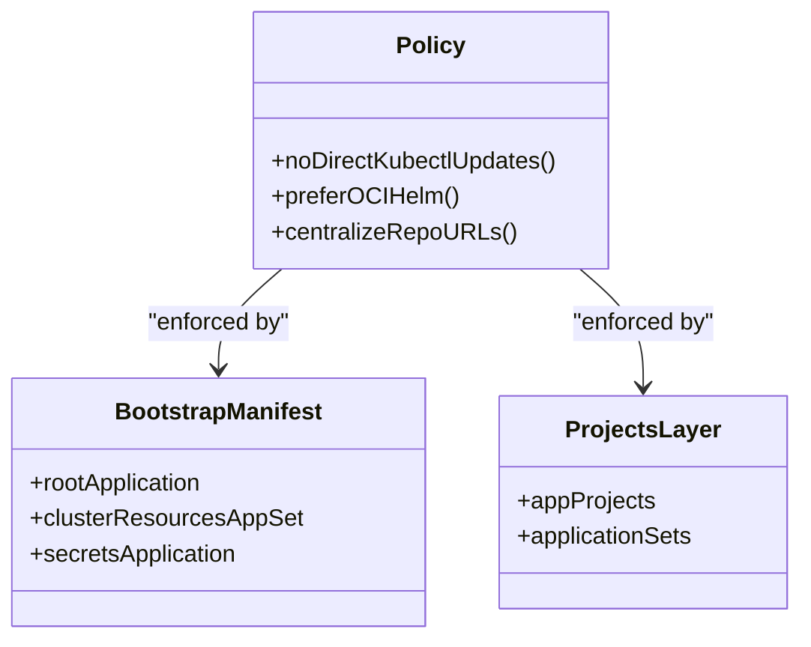
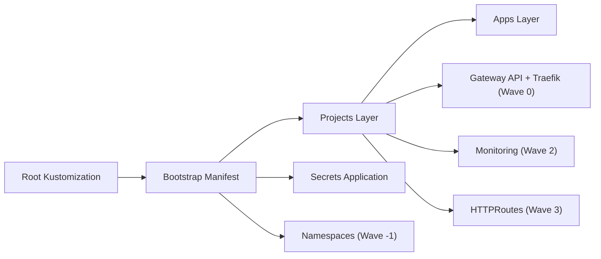

# Compliance and Audit

<cite>
**Referenced Files in This Document**
- [README.md](file://README.md)
- [bootstrap.yaml](file://bootstrap.yaml)
- [bootstrap/root.yaml](file://bootstrap/root.yaml)
- [bootstrap/cluster-resources.yaml](file://bootstrap/cluster-resources.yaml)
- [bootstrap/secrets.yaml](file://bootstrap/secrets.yaml)
- [cluster-resources/default/namespace.yaml](file://cluster-resources/default/namespace.yaml)
- [projects/kustomization.yaml](file://projects/kustomization.yaml)
- [.opencode/opencode.json](file://opencode.json)
- [.opencode/rules/gitops.md](file://.opencode/rules/gitops.md)
- [guide/argocd/argo_cd.md](file://guide/argocd/argo_cd.md)
- [apps/infra/gateway-api/kustomization.yaml](file://apps/infra/gateway-api/kustomization.yaml)
</cite>

## Table of Contents
1. [Introduction](#introduction)
2. [Project Structure](#project-structure)
3. [Core Components](#core-components)
4. [Architecture Overview](#architecture-overview)
5. [Detailed Component Analysis](#detailed-component-analysis)
6. [Dependency Analysis](#dependency-analysis)
7. [Performance Considerations](#performance-considerations)
8. [Troubleshooting Guide](#troubleshooting-guide)
9. [Conclusion](#conclusion)
10. [Appendices](#appendices)

## Introduction
This document explains how the GitOps environment establishes immutable audit trails and supports compliance and audit practices. It focuses on how Git-based change history provides a verifiable record of all cluster modifications, how ArgoCD’s declarative synchronization preserves evidence for audits, and how operational controls and governance policies are encoded in repository manifests and configuration. It also outlines logging and monitoring strategies, governance enforcement, and best practices for aligning with security standards and regulatory requirements.

## Project Structure
The repository organizes cluster bootstrapping, application projects, and application sets under a layered structure that enables auditable, repeatable deployments:
- Root Kustomization builds a bootstrap manifest and injects repository URLs centrally.
- Bootstrap layer defines the root Application and child Applications for cluster resources and secrets.
- Projects define AppProjects and ApplicationSets that discover applications via config files.
- Apps define infrastructure and playground applications with Kustomize overlays and optional Helm charts.
- Guides and OpenCode configuration codify operational rules and agent roles.

**Diagram sources**
- [README.md:87-118](file://README.md#L87-L118)
- [bootstrap.yaml:1-26](file://bootstrap.yaml#L1-L26)
- [bootstrap/root.yaml:1-37](file://bootstrap/root.yaml#L1-L37)
- [bootstrap/cluster-resources.yaml:1-33](file://bootstrap/cluster-resources.yaml#L1-L33)
- [bootstrap/secrets.yaml:1-24](file://bootstrap/secrets.yaml#L1-L24)
- [cluster-resources/default/namespace.yaml:1-52](file://cluster-resources/default/namespace.yaml#L1-L52)
- [projects/kustomization.yaml:1-22](file://projects/kustomization.yaml#L1-L22)

**Section sources**
- [README.md:87-118](file://README.md#L87-L118)
- [README.md:120-127](file://README.md#L120-L127)

## Core Components
- Declarative source of truth: All cluster state is defined in YAML manifests committed to Git. ArgoCD continuously reconciles the cluster to match the declared state.
- Immutable audit trail: Every change is recorded as a Git commit with author, date, and diff. This provides an immutable, time-stamped record of who changed what and when.
- Automated synchronization: ArgoCD syncs resources according to explicit policies, minimizing human intervention and reducing risk of unauthorized changes.
- Centralized repository URLs: Repository URLs are injected via Kustomize components to avoid hardcoding and to maintain a single source of truth for repository locations.
- Controlled access to secrets: Sensitive data is isolated in a private repository and synchronized via a dedicated Application with strict sync policies.

Key compliance enablers:
- No direct kubectl updates: All changes must go through Git, preserving an audit record.
- Helm chart provenance: Prefer OCI Helm charts for supply chain assurance and reproducibility.
- Namespace lifecycle: Namespaces are provisioned with explicit sync waves to ensure prerequisites exist before dependent workloads.

**Section sources**
- [README.md:120-127](file://README.md#L120-L127)
- [.opencode/rules/gitops.md:3-17](file://.opencode/rules/gitops.md#L3-L17)
- [README.md:160-163](file://README.md#L160-L163)
- [bootstrap/secrets.yaml:1-24](file://bootstrap/secrets.yaml#L1-L24)
- [projects/kustomization.yaml:1-22](file://projects/kustomization.yaml#L1-L22)

## Architecture Overview
The GitOps pipeline ensures that cluster state is derived from repository manifests and continuously reconciled by ArgoCD. The bootstrap process installs foundational resources and projects, while subsequent waves apply namespaces, ingress, monitoring, and application workloads.

**Diagram sources**
- [README.md:57-86](file://README.md#L57-L86)
- [bootstrap.yaml:1-26](file://bootstrap.yaml#L1-L26)
- [bootstrap/root.yaml:1-37](file://bootstrap/root.yaml#L1-L37)
- [bootstrap/cluster-resources.yaml:1-33](file://bootstrap/cluster-resources.yaml#L1-L33)
- [bootstrap/secrets.yaml:1-24](file://bootstrap/secrets.yaml#L1-L24)
- [apps/infra/gateway-api/kustomization.yaml:1-9](file://apps/infra/gateway-api/kustomization.yaml#L1-L9)

## Detailed Component Analysis

### Bootstrap and Immutable Audit Trail
- Root Application: Declares the bootstrap path and repository URL placeholder, enabling automated synchronization with pruning and self-healing.
- Root ApplicationSet: Discovers cluster resources and applies them with explicit sync waves to enforce order and stability.
- Secrets Application: Synchronizes secrets from a private repository with strict policies, ensuring sensitive data remains off the public repository.

**Diagram sources**
- [bootstrap.yaml:1-26](file://bootstrap.yaml#L1-L26)
- [bootstrap/root.yaml:1-37](file://bootstrap/root.yaml#L1-L37)
- [bootstrap/cluster-resources.yaml:1-33](file://bootstrap/cluster-resources.yaml#L1-L33)
- [bootstrap/secrets.yaml:1-24](file://bootstrap/secrets.yaml#L1-L24)

**Section sources**
- [bootstrap.yaml:1-26](file://bootstrap.yaml#L1-L26)
- [bootstrap/root.yaml:1-37](file://bootstrap/root.yaml#L1-L37)
- [bootstrap/cluster-resources.yaml:1-33](file://bootstrap/cluster-resources.yaml#L1-L33)
- [bootstrap/secrets.yaml:1-24](file://bootstrap/secrets.yaml#L1-L24)

### Namespace Lifecycle and Governance
- Namespaces are provisioned with explicit sync waves to ensure prerequisites exist before dependent workloads.
- Governance: Namespace creation and ownership are declared in manifests, preventing ad-hoc namespace creation outside the GitOps process.

**Diagram sources**
- [README.md:76-86](file://README.md#L76-L86)
- [cluster-resources/default/namespace.yaml:1-52](file://cluster-resources/default/namespace.yaml#L1-L52)

**Section sources**
- [README.md:76-86](file://README.md#L76-L86)
- [cluster-resources/default/namespace.yaml:1-52](file://cluster-resources/default/namespace.yaml#L1-L52)

### Logging and Monitoring for Audits
- Observability: The Datadog agent is deployed as part of the infrastructure stack to collect metrics and logs.
- Access and change visibility: ArgoCD maintains sync logs and events that reflect every reconciliation action, providing evidence of who triggered changes and when.
- Security posture: Prefer OCI Helm charts for supply chain assurance and reproducibility.

**Diagram sources**
- [apps/infra/gateway-api/kustomization.yaml:1-9](file://apps/infra/gateway-api/kustomization.yaml#L1-L9)
- [.opencode/rules/gitops.md:8-17](file://.opencode/rules/gitops.md#L8-L17)

**Section sources**
- [apps/infra/gateway-api/kustomization.yaml:1-9](file://apps/infra/gateway-api/kustomization.yaml#L1-L9)
- [.opencode/rules/gitops.md:8-17](file://.opencode/rules/gitops.md#L8-L17)

### Governance Policies and Enforcement
- No direct kubectl updates: All changes must be committed to Git; read-only kubectl commands remain permitted for diagnostics.
- Helm chart sourcing: Prefer OCI Helm charts hosted in trusted registries to ensure provenance and immutability.
- Repository URL centralization: Repository URLs are injected via Kustomize components to maintain a single source of truth and reduce misconfiguration risk.

**Diagram sources**
- [.opencode/rules/gitops.md:3-17](file://.opencode/rules/gitops.md#L3-L17)
- [projects/kustomization.yaml:1-22](file://projects/kustomization.yaml#L1-L22)

**Section sources**
- [.opencode/rules/gitops.md:3-17](file://.opencode/rules/gitops.md#L3-L17)
- [projects/kustomization.yaml:1-22](file://projects/kustomization.yaml#L1-L22)

## Dependency Analysis
The repository enforces dependencies between bootstrap stages and application layers to ensure a deterministic, auditable rollout order. The dependency graph below reflects the intended sequence and interdependencies among bootstrap, projects, and apps.

**Diagram sources**
- [README.md:57-86](file://README.md#L57-L86)
- [bootstrap.yaml:1-26](file://bootstrap.yaml#L1-L26)
- [bootstrap/root.yaml:1-37](file://bootstrap/root.yaml#L1-L37)
- [bootstrap/cluster-resources.yaml:1-33](file://bootstrap/cluster-resources.yaml#L1-L33)
- [bootstrap/secrets.yaml:1-24](file://bootstrap/secrets.yaml#L1-L24)
- [cluster-resources/default/namespace.yaml:1-52](file://cluster-resources/default/namespace.yaml#L1-L52)

**Section sources**
- [README.md:57-86](file://README.md#L57-L86)
- [bootstrap.yaml:1-26](file://bootstrap.yaml#L1-L26)
- [bootstrap/root.yaml:1-37](file://bootstrap/root.yaml#L1-L37)
- [bootstrap/cluster-resources.yaml:1-33](file://bootstrap/cluster-resources.yaml#L1-L33)
- [bootstrap/secrets.yaml:1-24](file://bootstrap/secrets.yaml#L1-L24)
- [cluster-resources/default/namespace.yaml:1-52](file://cluster-resources/default/namespace.yaml#L1-L52)

## Performance Considerations
- Minimizing drift: Automated pruning and self-healing reduce manual interventions and prevent configuration drift, lowering risk and simplifying audits.
- Ordered rollouts: Sync waves ensure prerequisites are established before dependent resources, reducing failed syncs and rework.
- Supply chain assurance: Using OCI Helm charts improves reproducibility and reduces reliance on mutable registries.

[No sources needed since this section provides general guidance]

## Troubleshooting Guide
- Resetting bootstrap: If necessary, remove finalizers and force-delete the bootstrap Application to recover from stuck states.
- Applying secrets for private repositories: Ensure repository credentials are applied so ArgoCD can access private repositories containing sensitive data.
- Verifying rollout order: Confirm sync waves and ApplicationSet behavior to ensure namespaces, gateways, and routes are applied in the correct sequence.

**Section sources**
- [guide/argocd/argo_cd.md:29-33](file://guide/argocd/argo_cd.md#L29-L33)
- [guide/argocd/argo_cd.md:18-22](file://guide/argocd/argo_cd.md#L18-L22)

## Conclusion
By enforcing a strict GitOps workflow—where all changes are declarative, versioned, and reconciled by ArgoCD—the repository establishes an immutable audit trail and supports compliance reporting. Centralized repository URL management, strict sync policies, and explicit sync waves ensure predictable, auditable deployments. Integrating observability and adhering to governance policies further strengthens evidence preservation and adherence to organizational security standards.

[No sources needed since this section summarizes without analyzing specific files]

## Appendices
- OpenCode configuration defines agent roles and permissions, including specialized agents for DevOps, solution architecture, SRE review, research, repository operations, and documentation writing. These roles help formalize responsibilities and approvals in the GitOps process.

**Section sources**
- [opencode.json:1-52](file://opencode.json#L1-L52)