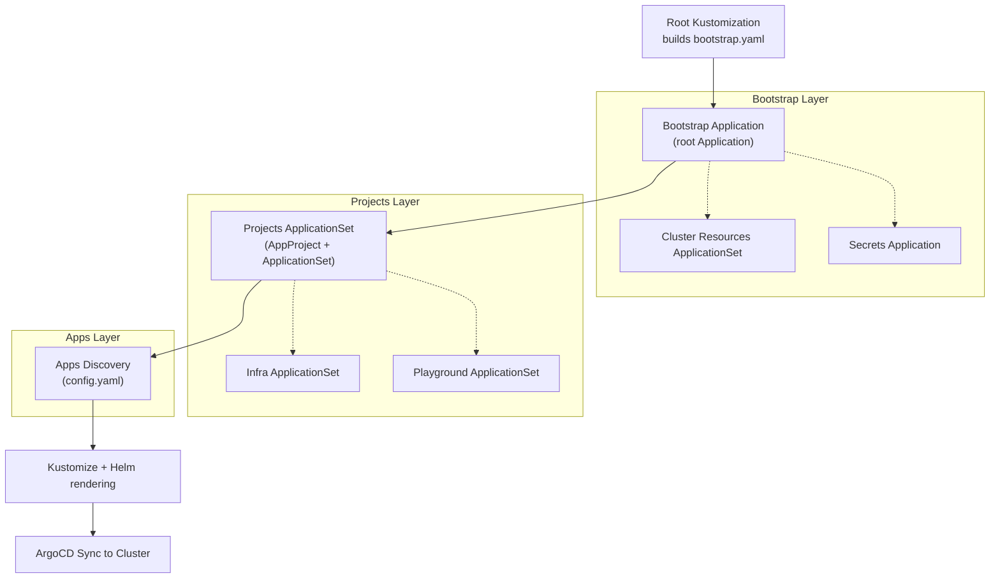
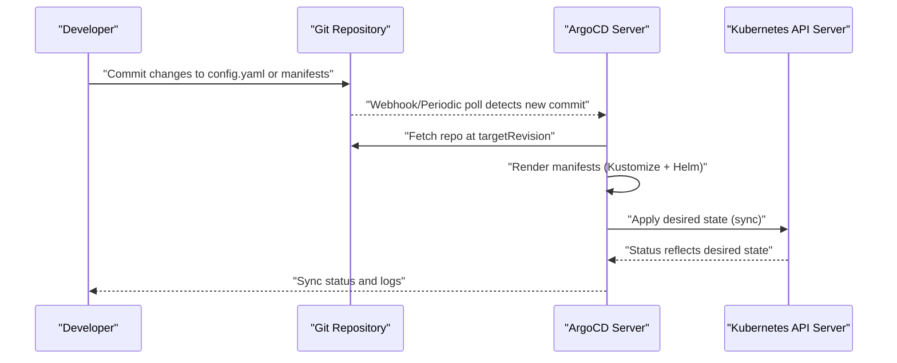
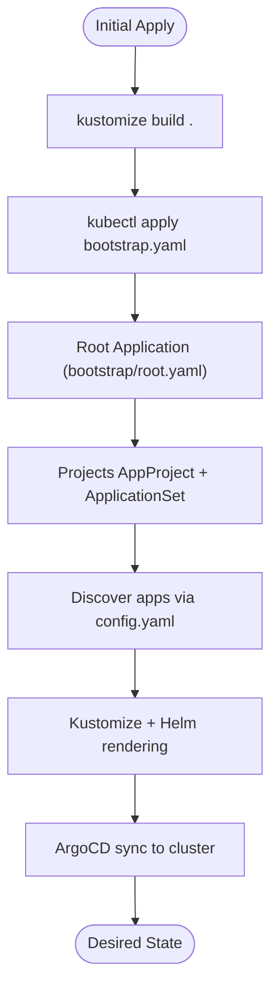
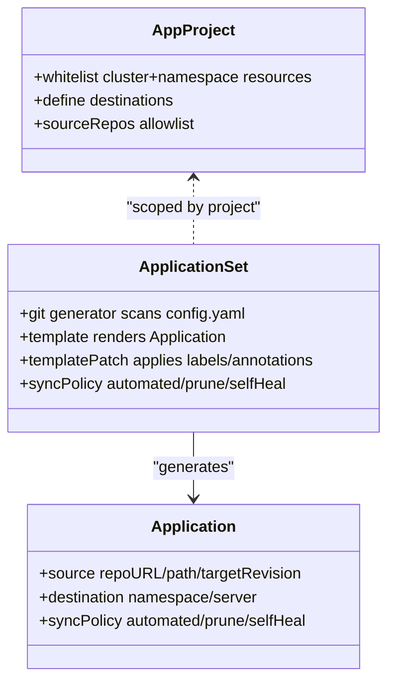
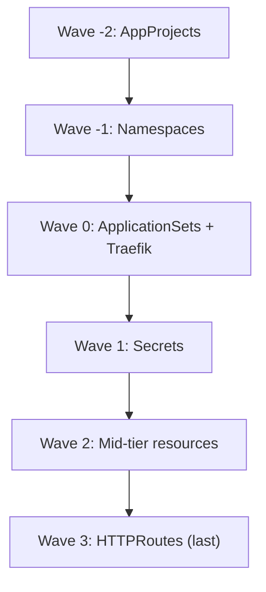
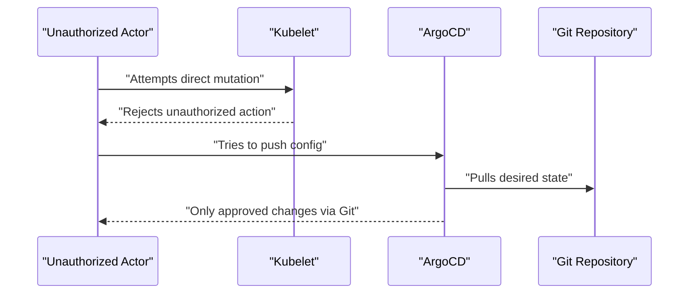
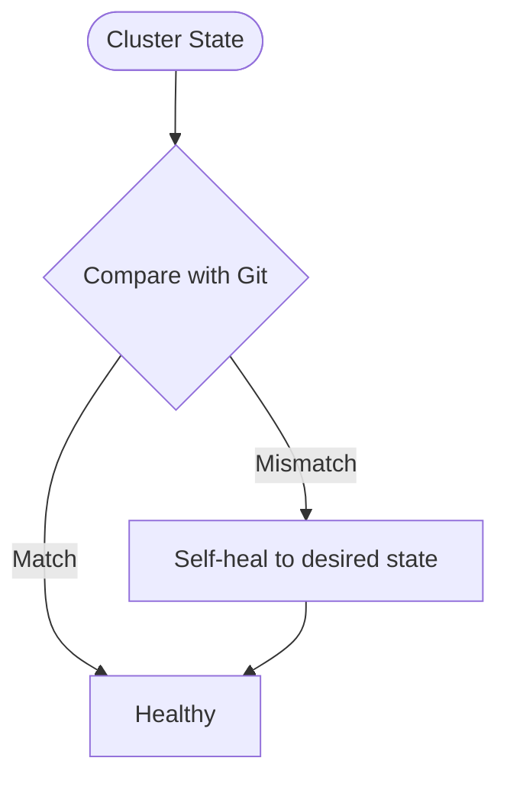
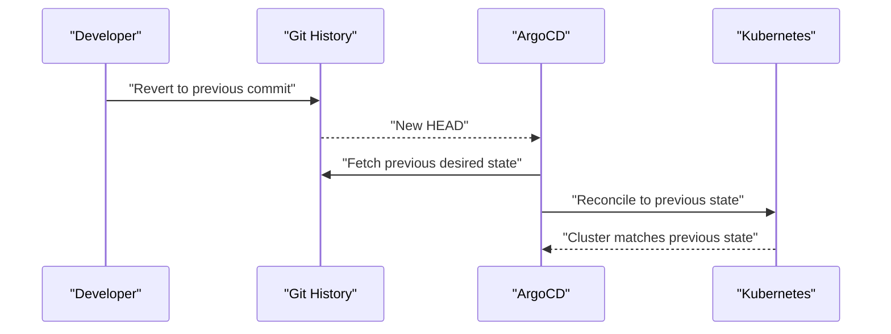
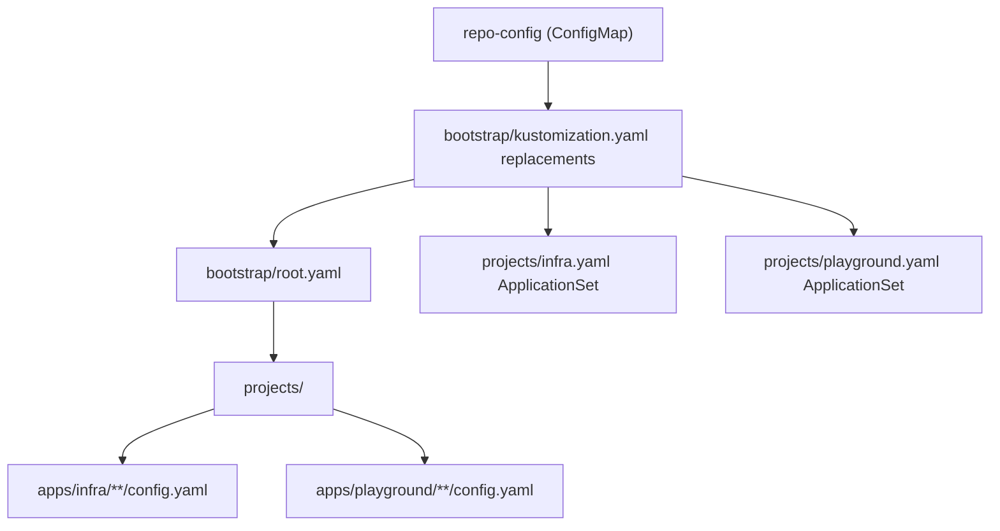

# GitOps Security Model

<cite>
**Referenced Files in This Document**
- [README.md](file://README.md)
- [bootstrap.yaml](file://bootstrap.yaml)
- [bootstrap/kustomization.yaml](file://bootstrap/kustomization.yaml)
- [bootstrap/root.yaml](file://bootstrap/root.yaml)
- [bootstrap/cluster-resources.yaml](file://bootstrap/cluster-resources.yaml)
- [bootstrap/secrets.yaml](file://bootstrap/secrets.yaml)
- [projects/infra.yaml](file://projects/infra.yaml)
- [projects/playground.yaml](file://projects/playground.yaml)
- [apps/infra/cloudflared/config.yaml](file://apps/infra/cloudflared/config.yaml)
- [apps/playground/argocd-ingress/config.yaml](file://apps/playground/argocd-ingress/config.yaml)
- [apps/infra/gateway-api/kustomization.yaml](file://apps/infra/gateway-api/kustomization.yaml)
- [guide/argocd/argocd-repository-secrets.yaml](file://guide/argocd/argocd-repository-secrets.yaml)
</cite>

## Table of Contents
1. [Introduction](#introduction)
2. [Project Structure](#project-structure)
3. [Core Components](#core-components)
4. [Architecture Overview](#architecture-overview)
5. [Detailed Component Analysis](#detailed-component-analysis)
6. [Dependency Analysis](#dependency-analysis)
7. [Performance Considerations](#performance-considerations)
8. [Troubleshooting Guide](#troubleshooting-guide)
9. [Conclusion](#conclusion)

## Introduction
This document explains the GitOps security model implemented in this repository and how it protects the Kubernetes cluster. It focuses on:
- Prohibiting direct kubectl updates to prevent unauthorized changes
- Ensuring auditability and traceability through Git commits
- Enforcing pull-based reconciliation so ArgoCD controls cluster state
- Applying ArgoCD’s ApplicationSet pattern to enforce configuration consistency
- Demonstrating how the workflow mitigates common attack vectors and enables drift detection and safe rollbacks

## Project Structure
The repository organizes GitOps resources across layers:
- Root Kustomization builds a bootstrap manifest that installs the initial ArgoCD Application
- Bootstrap layer defines the root Application, cluster resources ApplicationSet, and a secrets Application
- Projects define AppProjects and ApplicationSets that discover applications via config.yaml files
- Apps are grouped under infra and playground with per-app config.yaml and optional Helm charts

**Diagram sources**
- [README.md:57-118](file://README.md#L57-L118)
- [bootstrap.yaml:1-26](file://bootstrap.yaml#L1-L26)
- [bootstrap/root.yaml:1-37](file://bootstrap/root.yaml#L1-L37)
- [bootstrap/cluster-resources.yaml:1-33](file://bootstrap/cluster-resources.yaml#L1-L33)
- [bootstrap/secrets.yaml:1-24](file://bootstrap/secrets.yaml#L1-L24)
- [projects/infra.yaml:1-85](file://projects/infra.yaml#L1-L85)
- [projects/playground.yaml:1-90](file://projects/playground.yaml#L1-L90)

**Section sources**
- [README.md:57-118](file://README.md#L57-L118)
- [bootstrap.yaml:1-26](file://bootstrap.yaml#L1-L26)
- [bootstrap/kustomization.yaml:1-38](file://bootstrap/kustomization.yaml#L1-L38)
- [bootstrap/root.yaml:1-37](file://bootstrap/root.yaml#L1-L37)
- [bootstrap/cluster-resources.yaml:1-33](file://bootstrap/cluster-resources.yaml#L1-L33)
- [bootstrap/secrets.yaml:1-24](file://bootstrap/secrets.yaml#L1-L24)
- [projects/infra.yaml:1-85](file://projects/infra.yaml#L1-L85)
- [projects/playground.yaml:1-90](file://projects/playground.yaml#L1-L90)

## Core Components
- Pull-based reconciliation: ArgoCD continuously monitors the Git repository and reconciles cluster state to match desired manifests. This eliminates the possibility of ad-hoc, untraceable changes.
- No direct kubectl updates: The repository explicitly forbids direct kubectl mutations, ensuring all changes are committed to Git and reviewed.
- Auditability and traceability: Every change is tracked in Git history, enabling blame, diffs, and compliance reporting.
- ApplicationSet discovery: ApplicationSets scan the repository for config.yaml files and render Kustomize/Helm manifests, enforcing consistent configuration patterns across apps.
- Sync waves and ordering: Annotations and sync waves ensure safe, staged rollout of cluster resources, preventing race conditions and dependency failures.
- Drift detection and self-heal: Automated sync policies detect and remediate drift by restoring desired state.
- Rollback capability: Git history enables safe rollbacks by reverting to previous commits and allowing ArgoCD to reconcile to the desired state.

**Section sources**
- [README.md:120-127](file://README.md#L120-L127)
- [README.md:76-86](file://README.md#L76-L86)
- [projects/infra.yaml:26-27](file://projects/infra.yaml#L26-L27)
- [projects/playground.yaml:25-27](file://projects/playground.yaml#L25-L27)
- [bootstrap/root.yaml:19-36](file://bootstrap/root.yaml#L19-L36)
- [bootstrap/secrets.yaml:18-23](file://bootstrap/secrets.yaml#L18-L23)

## Architecture Overview
The GitOps pipeline follows a deterministic, secure flow:
- Initial bootstrap installs a root Application that points to the projects directory
- Projects define AppProjects and ApplicationSets that discover apps via config.yaml
- Each discovered app is rendered by Kustomize with optional Helm charts and synced to the cluster
- Secrets are managed in a separate private repository and synchronized via a dedicated Application

**Diagram sources**
- [README.md:57-75](file://README.md#L57-L75)
- [projects/infra.yaml:33-45](file://projects/infra.yaml#L33-L45)
- [projects/playground.yaml:33-45](file://projects/playground.yaml#L33-L45)
- [bootstrap/root.yaml:15-18](file://bootstrap/root.yaml#L15-L18)
- [bootstrap/secrets.yaml:12-15](file://bootstrap/secrets.yaml#L12-L15)

## Detailed Component Analysis

### Root Application and Bootstrap Chain
- The root Application is applied once to establish the GitOps baseline. It points to the projects directory and uses replacement logic to inject repository URLs from a shared ConfigMap.
- The bootstrap layer coordinates cluster resources, secrets, and project definitions with explicit sync waves to ensure safe ordering.

**Diagram sources**
- [README.md:59-75](file://README.md#L59-L75)
- [bootstrap.yaml:10-25](file://bootstrap.yaml#L10-L25)
- [bootstrap/root.yaml:15-18](file://bootstrap/root.yaml#L15-L18)
- [bootstrap/kustomization.yaml:12-37](file://bootstrap/kustomization.yaml#L12-L37)

**Section sources**
- [README.md:59-75](file://README.md#L59-L75)
- [bootstrap.yaml:1-26](file://bootstrap.yaml#L1-L26)
- [bootstrap/root.yaml:1-37](file://bootstrap/root.yaml#L1-L37)
- [bootstrap/kustomization.yaml:1-38](file://bootstrap/kustomization.yaml#L1-L38)

### ApplicationSet Pattern and Configuration Consistency
- ApplicationSets scan the repository for config.yaml files and generate Applications dynamically. This enforces a consistent pattern across apps and centralizes discovery logic.
- TemplatePatch allows consistent labeling and annotation propagation, ensuring uniform governance attributes across all generated Applications.

**Diagram sources**
- [projects/infra.yaml:23-85](file://projects/infra.yaml#L23-L85)
- [projects/playground.yaml:23-90](file://projects/playground.yaml#L23-L90)

**Section sources**
- [projects/infra.yaml:23-85](file://projects/infra.yaml#L23-L85)
- [projects/playground.yaml:23-90](file://projects/playground.yaml#L23-L90)

### Sync Waves and Ordering Controls
- Sync waves coordinate rollout order across the cluster. For example, namespaces and cluster resources are created before apps, and HTTPRoutes are synchronized last to ensure dependencies exist.
- Per-app config.yaml can override default namespace and add annotations for ordering, ensuring predictable deployments.

**Diagram sources**
- [README.md:76-86](file://README.md#L76-L86)
- [apps/infra/cloudflared/config.yaml:1-4](file://apps/infra/cloudflared/config.yaml#L1-L4)
- [apps/playground/argocd-ingress/config.yaml:1-4](file://apps/playground/argocd-ingress/config.yaml#L1-L4)

**Section sources**
- [README.md:76-86](file://README.md#L76-L86)
- [apps/infra/cloudflared/config.yaml:1-4](file://apps/infra/cloudflared/config.yaml#L1-L4)
- [apps/playground/argocd-ingress/config.yaml:1-4](file://apps/playground/argocd-ingress/config.yaml#L1-L4)

### Pull-Based Reconciliation and Unauthorized Change Prevention
- Pull-based reconciliation means ArgoCD pulls desired state from Git and applies it. There is no direct write path to the cluster outside of ArgoCD’s controlled sync.
- The prohibition on direct kubectl mutations removes the primary vector for unauthorized or accidental changes bypassing audit trails.

**Diagram sources**
- [README.md:120-127](file://README.md#L120-L127)
- [bootstrap/root.yaml:19-36](file://bootstrap/root.yaml#L19-L36)

**Section sources**
- [README.md:120-127](file://README.md#L120-L127)
- [bootstrap/root.yaml:19-36](file://bootstrap/root.yaml#L19-L36)

### Drift Detection and Self-Healing
- Automated sync policies enable self-healing: if drift is detected, ArgoCD re-applies the desired state from Git.
- Ignore differences and sync options help avoid noise while preserving meaningful drift detection.

**Diagram sources**
- [bootstrap/root.yaml:19-36](file://bootstrap/root.yaml#L19-L36)
- [projects/infra.yaml:61-71](file://projects/infra.yaml#L61-L71)
- [projects/playground.yaml:66-71](file://projects/playground.yaml#L66-L71)

**Section sources**
- [bootstrap/root.yaml:19-36](file://bootstrap/root.yaml#L19-L36)
- [projects/infra.yaml:61-71](file://projects/infra.yaml#L61-L71)
- [projects/playground.yaml:66-71](file://projects/playground.yaml#L66-L71)

### Rollback Capabilities
- Rollback relies on Git history: revert to a previous commit and let ArgoCD reconcile to the desired state.
- The separation of secrets into a private repository ensures sensitive data remains protected during rollbacks.

**Diagram sources**
- [README.md:160-163](file://README.md#L160-L163)
- [bootstrap/secrets.yaml:12-15](file://bootstrap/secrets.yaml#L12-L15)

**Section sources**
- [README.md:160-163](file://README.md#L160-L163)
- [bootstrap/secrets.yaml:1-24](file://bootstrap/secrets.yaml#L1-L24)

### Security Implications of Using ApplicationSet Pattern
- Consistent discovery and rendering reduce human error and misconfiguration.
- Centralized templatePatch ensures governance labels and annotations propagate uniformly.
- Whitelists and AppProjects constrain where and what can be deployed, reducing blast radius.

**Section sources**
- [projects/infra.yaml:23-85](file://projects/infra.yaml#L23-L85)
- [projects/playground.yaml:23-90](file://projects/playground.yaml#L23-L90)

### Mitigating Common Attack Vectors
- Privileged credentials: Repository credentials are stored as ArgoCD Secrets in the private secrets repository, not in the public repository.
- Supply chain attacks: Helm charts are referenced via OCI repositories and Kustomize, enabling reproducible builds.
- Misconfigurations: Sync waves and ignore differences minimize risky changes and reduce drift.
- Unauthorized access: Pull-based reconciliation and centralized policy enforcement remove ad-hoc mutation paths.

**Section sources**
- [README.md:160-163](file://README.md#L160-L163)
- [guide/argocd/argocd-repository-secrets.yaml:1-30](file://guide/argocd/argocd-repository-secrets.yaml#L1-L30)
- [apps/infra/gateway-api/kustomization.yaml:6-8](file://apps/infra/gateway-api/kustomization.yaml#L6-L8)

## Dependency Analysis
The bootstrap layer depends on shared repository URL configuration, which is injected into Applications and ApplicationSets. Projects depend on the root Application to establish the baseline, and apps depend on project-level AppProjects and ApplicationSets for discovery and rendering.

**Diagram sources**
- [bootstrap/kustomization.yaml:12-37](file://bootstrap/kustomization.yaml#L12-L37)
- [bootstrap/root.yaml:15-18](file://bootstrap/root.yaml#L15-L18)
- [projects/infra.yaml:33-45](file://projects/infra.yaml#L33-L45)
- [projects/playground.yaml:33-45](file://projects/playground.yaml#L33-L45)

**Section sources**
- [bootstrap/kustomization.yaml:1-38](file://bootstrap/kustomization.yaml#L1-L38)
- [bootstrap/root.yaml:15-18](file://bootstrap/root.yaml#L15-L18)
- [projects/infra.yaml:33-45](file://projects/infra.yaml#L33-L45)
- [projects/playground.yaml:33-45](file://projects/playground.yaml#L33-L45)

## Performance Considerations
- Retry backoff: ApplicationSets configure retry limits and backoff to handle transient errors gracefully.
- Dry-run optimization: SkipDryRun options reduce unnecessary dry-run operations for missing resources.
- Staged rollout: Sync waves prevent cascading failures and reduce contention during initial deployments.

**Section sources**
- [projects/infra.yaml:66-71](file://projects/infra.yaml#L66-L71)
- [projects/playground.yaml:66-71](file://projects/playground.yaml#L66-L71)
- [projects/playground.yaml:72-74](file://projects/playground.yaml#L72-L74)

## Troubleshooting Guide
- Verify repository URLs: Confirm that replacements in the bootstrap layer correctly inject repo URLs into Applications and ApplicationSets.
- Check sync waves: Ensure per-app annotations align with intended rollout order.
- Inspect ignore differences: Validate that ignoreDifferences and sync options are configured appropriately to avoid masking real drift.
- Review secret synchronization: Confirm the secrets Application targets the private repository and uses appropriate credentials.

**Section sources**
- [bootstrap/kustomization.yaml:12-37](file://bootstrap/kustomization.yaml#L12-L37)
- [bootstrap/root.yaml:19-36](file://bootstrap/root.yaml#L19-L36)
- [apps/infra/cloudflared/config.yaml:1-4](file://apps/infra/cloudflared/config.yaml#L1-L4)
- [apps/playground/argocd-ingress/config.yaml:1-4](file://apps/playground/argocd-ingress/config.yaml#L1-L4)
- [bootstrap/secrets.yaml:12-15](file://bootstrap/secrets.yaml#L12-L15)
- [guide/argocd/argocd-repository-secrets.yaml:1-30](file://guide/argocd/argocd-repository-secrets.yaml#L1-L30)

## Conclusion
This repository enforces a robust GitOps security model by:
- Prohibiting direct kubectl updates and relying on pull-based reconciliation
- Ensuring auditability and traceability through Git commits
- Using ApplicationSets to enforce configuration consistency and standardized discovery
- Leveraging sync waves, self-heal, and ignore differences to manage drift and maintain stability
- Separating sensitive secrets into a private repository for least-privilege access

These practices collectively mitigate common attack vectors, improve compliance, and provide reliable rollback and drift detection capabilities.