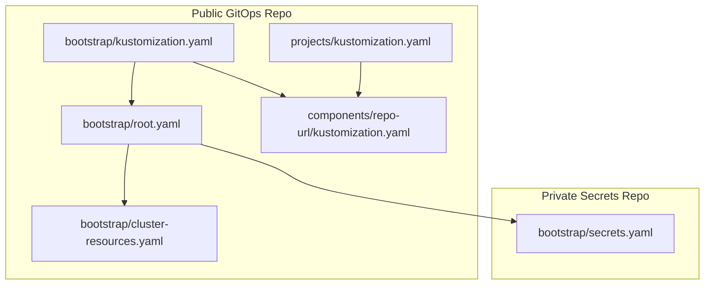
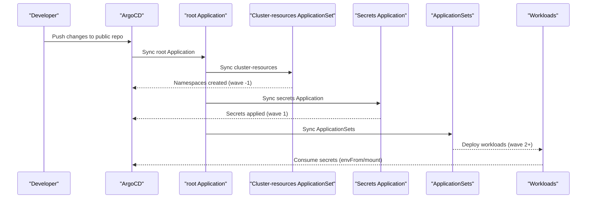
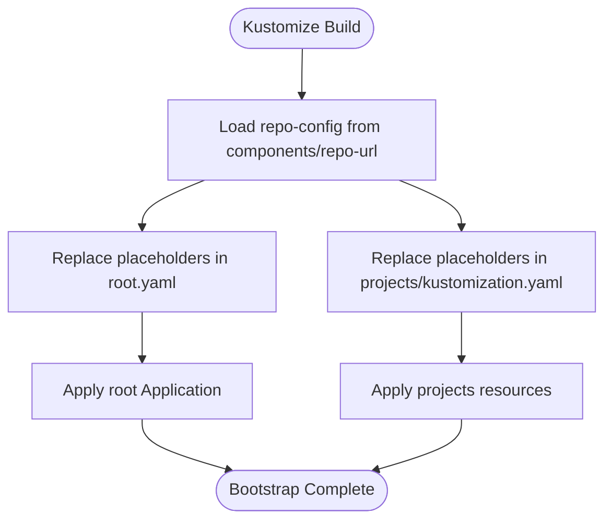
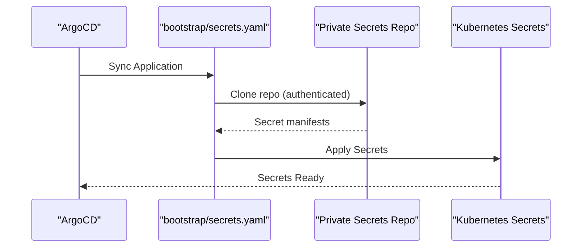
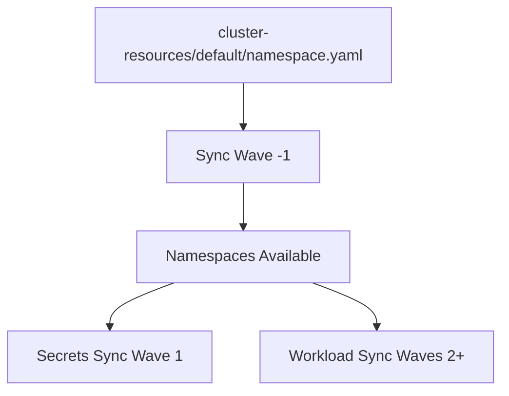
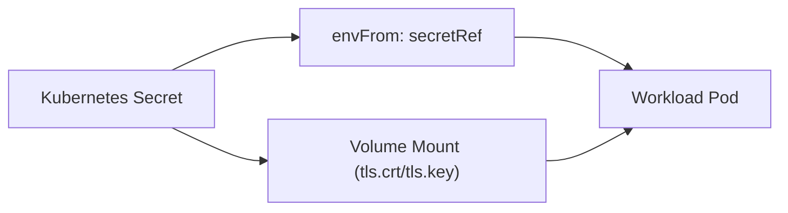
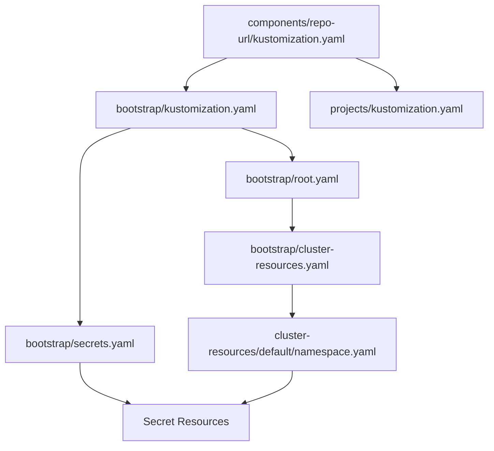

# Kubernetes Secrets Management Guide

<cite>
**Referenced Files in This Document**
- [README.md](file://README.md)
- [bootstrap/secrets.yaml](file://bootstrap/secrets.yaml)
- [bootstrap/root.yaml](file://bootstrap/root.yaml)
- [bootstrap/cluster-resources.yaml](file://bootstrap/cluster-resources.yaml)
- [bootstrap/kustomization.yaml](file://bootstrap/kustomization.yaml)
- [components/repo-url/kustomization.yaml](file://components/repo-url/kustomization.yaml)
- [projects/kustomization.yaml](file://projects/kustomization.yaml)
- [cluster-resources/default/namespace.yaml](file://cluster-resources/default/namespace.yaml)
- [guide/k8s_manifest_secrets/README.md](file://guide/k8s_manifest_secrets/README.md)
- [guide/argocd/README.md](file://guide/argocd/README.md)
- [guide/argocd/argocd-repository-secrets.yaml](file://guide/argocd/argocd-repository-secrets.yaml)
- [apps/infra/cloudflared/chart/values.yaml](file://apps/infra/cloudflared/chart/values.yaml)
- [apps/infra/datadog/chart/values.yaml](file://apps/infra/datadog/chart/values.yaml)
</cite>

## Table of Contents
1. [Introduction](#introduction)
2. [Project Structure](#project-structure)
3. [Core Components](#core-components)
4. [Architecture Overview](#architecture-overview)
5. [Detailed Component Analysis](#detailed-component-analysis)
6. [Dependency Analysis](#dependency-analysis)
7. [Performance Considerations](#performance-considerations)
8. [Troubleshooting Guide](#troubleshooting-guide)
9. [Conclusion](#conclusion)

## Introduction
This guide explains how the repository manages Kubernetes secrets using a secure separation between public and private Git repositories, Argo CD applications, and Kustomize replacements. It focuses on the bootstrap chain that ensures namespaces are created before secrets, and secrets are applied before dependent workloads. It also documents how applications consume secrets via environment variables and mounted volumes.

## Project Structure
The repository follows a GitOps pattern with:
- A public GitOps repository containing manifests and Argo CD configuration
- A private secrets repository containing Kubernetes Secret resources
- A bootstrap chain that installs a root Application, cluster namespaces, and a secrets Application
- ApplicationSets that render Helm charts and deploy workloads

**Diagram sources**
- [bootstrap/root.yaml:1-37](file://bootstrap/root.yaml#L1-L37)
- [bootstrap/cluster-resources.yaml:1-33](file://bootstrap/cluster-resources.yaml#L1-L33)
- [bootstrap/kustomization.yaml:1-63](file://bootstrap/kustomization.yaml#L1-L63)
- [components/repo-url/kustomization.yaml:1-13](file://components/repo-url/kustomization.yaml#L1-L13)
- [projects/kustomization.yaml:1-31](file://projects/kustomization.yaml#L1-L31)
- [bootstrap/secrets.yaml:1-24](file://bootstrap/secrets.yaml#L1-L24)

**Section sources**
- [README.md:87-118](file://README.md#L87-L118)
- [bootstrap/kustomization.yaml:1-63](file://bootstrap/kustomization.yaml#L1-L63)
- [components/repo-url/kustomization.yaml:1-13](file://components/repo-url/kustomization.yaml#L1-L13)
- [projects/kustomization.yaml:1-31](file://projects/kustomization.yaml#L1-L31)

## Core Components
- Bootstrap root Application: Defines the entry point for syncing projects and cluster resources
- Cluster-resources ApplicationSet: Creates shared namespaces with early sync waves
- Secrets Application: Syncs Kubernetes Secrets from a private repository
- Replacement mechanism: Kustomize injects repository URLs and revisions into placeholder fields
- ApplicationSets: Discover and render applications from config files

Key behaviors:
- Namespaces are created with sync wave -1
- Secrets are applied with sync wave 1
- Workloads that depend on secrets are applied later (wave 2+)

**Section sources**
- [bootstrap/root.yaml:1-37](file://bootstrap/root.yaml#L1-L37)
- [bootstrap/cluster-resources.yaml:1-33](file://bootstrap/cluster-resources.yaml#L1-L33)
- [bootstrap/secrets.yaml:1-24](file://bootstrap/secrets.yaml#L1-L24)
- [bootstrap/kustomization.yaml:12-62](file://bootstrap/kustomization.yaml#L12-L62)
- [cluster-resources/default/namespace.yaml:1-60](file://cluster-resources/default/namespace.yaml#L1-L60)
- [README.md:76-85](file://README.md#L76-L85)

## Architecture Overview
The secrets management architecture enforces a strict order:
1. Root Application points to projects
2. Cluster-resources ApplicationSet creates namespaces (wave -1)
3. Secrets Application syncs secrets from the private repo (wave 1)
4. ApplicationSets render apps and deploy workloads (wave 2+)
5. Applications consume secrets via envFrom or mounted volumes

**Diagram sources**
- [bootstrap/root.yaml:1-37](file://bootstrap/root.yaml#L1-L37)
- [bootstrap/cluster-resources.yaml:1-33](file://bootstrap/cluster-resources.yaml#L1-L33)
- [bootstrap/secrets.yaml:1-24](file://bootstrap/secrets.yaml#L1-L24)
- [README.md:68-75](file://README.md#L68-L75)

## Detailed Component Analysis

### Bootstrap and Replacement Mechanism
- The root Kustomization composes components and resources, replacing placeholders with real repository URLs and revisions
- The repo-url component centralizes repository definitions and versions
- Projects Kustomization mirrors the same replacement strategy for ApplicationSets

**Diagram sources**
- [bootstrap/kustomization.yaml:12-62](file://bootstrap/kustomization.yaml#L12-L62)
- [components/repo-url/kustomization.yaml:4-12](file://components/repo-url/kustomization.yaml#L4-L12)
- [projects/kustomization.yaml:11-30](file://projects/kustomization.yaml#L11-L30)

**Section sources**
- [bootstrap/kustomization.yaml:1-63](file://bootstrap/kustomization.yaml#L1-L63)
- [components/repo-url/kustomization.yaml:1-13](file://components/repo-url/kustomization.yaml#L1-L13)
- [projects/kustomization.yaml:1-31](file://projects/kustomization.yaml#L1-L31)

### Secrets Application and Private Repository
- The secrets Application references a private repository URL and target revision
- It uses a sync wave of 1 to ensure secrets exist before dependent apps
- The guide demonstrates how to apply repository credentials for Argo CD to access the private secrets repo

**Diagram sources**
- [bootstrap/secrets.yaml:1-24](file://bootstrap/secrets.yaml#L1-L24)
- [guide/argocd/argocd-repository-secrets.yaml:1-30](file://guide/argocd/argocd-repository-secrets.yaml#L1-L30)
- [guide/argocd/README.md:18-27](file://guide/argocd/README.md#L18-L27)

**Section sources**
- [bootstrap/secrets.yaml:1-24](file://bootstrap/secrets.yaml#L1-L24)
- [guide/argocd/README.md:18-27](file://guide/argocd/README.md#L18-L27)
- [guide/argocd/argocd-repository-secrets.yaml:1-30](file://guide/argocd/argocd-repository-secrets.yaml#L1-L30)
- [guide/k8s_manifest_secrets/README.md:1-42](file://guide/k8s_manifest_secrets/README.md#L1-L42)

### Namespace Creation and Sync Waves
- Namespaces are provisioned by an ApplicationSet with sync wave -1
- This ensures dependent resources (including secrets) can reference them safely
- The namespace definitions include annotations to control sync timing

**Diagram sources**
- [cluster-resources/default/namespace.yaml:1-60](file://cluster-resources/default/namespace.yaml#L1-L60)
- [bootstrap/cluster-resources.yaml:1-33](file://bootstrap/cluster-resources.yaml#L1-L33)
- [README.md:76-85](file://README.md#L76-L85)

**Section sources**
- [cluster-resources/default/namespace.yaml:1-60](file://cluster-resources/default/namespace.yaml#L1-L60)
- [bootstrap/cluster-resources.yaml:1-33](file://bootstrap/cluster-resources.yaml#L1-L33)
- [README.md:76-85](file://README.md#L76-L85)

### Application Consumption of Secrets
- Workloads consume secrets via envFrom pointing to Secret resources
- Some applications mount TLS secrets as volumes for ingress controllers
- Values files demonstrate how applications reference existing secret names

**Diagram sources**
- [apps/infra/cloudflared/chart/values.yaml:19-21](file://apps/infra/cloudflared/chart/values.yaml#L19-L21)
- [apps/infra/datadog/chart/values.yaml:1-89](file://apps/infra/datadog/chart/values.yaml#L1-L89)
- [guide/k8s_manifest_secrets/README.md:28-41](file://guide/k8s_manifest_secrets/README.md#L28-L41)

**Section sources**
- [apps/infra/cloudflared/chart/values.yaml:19-21](file://apps/infra/cloudflared/chart/values.yaml#L19-L21)
- [apps/infra/datadog/chart/values.yaml:1-89](file://apps/infra/datadog/chart/values.yaml#L1-L89)
- [guide/k8s_manifest_secrets/README.md:28-41](file://guide/k8s_manifest_secrets/README.md#L28-L41)

## Dependency Analysis
The secrets management pipeline depends on:
- Centralized repository configuration for URL and revision injection
- Strict sync waves to guarantee resource availability
- ApplicationSet discovery and rendering of Helm charts

**Diagram sources**
- [components/repo-url/kustomization.yaml:1-13](file://components/repo-url/kustomization.yaml#L1-L13)
- [bootstrap/kustomization.yaml:1-63](file://bootstrap/kustomization.yaml#L1-L63)
- [projects/kustomization.yaml:1-31](file://projects/kustomization.yaml#L1-L31)
- [bootstrap/root.yaml:1-37](file://bootstrap/root.yaml#L1-L37)
- [bootstrap/cluster-resources.yaml:1-33](file://bootstrap/cluster-resources.yaml#L1-L33)
- [bootstrap/secrets.yaml:1-24](file://bootstrap/secrets.yaml#L1-L24)
- [cluster-resources/default/namespace.yaml:1-60](file://cluster-resources/default/namespace.yaml#L1-L60)

**Section sources**
- [bootstrap/kustomization.yaml:12-62](file://bootstrap/kustomization.yaml#L12-L62)
- [projects/kustomization.yaml:11-30](file://projects/kustomization.yaml#L11-L30)
- [components/repo-url/kustomization.yaml:4-12](file://components/repo-url/kustomization.yaml#L4-L12)

## Performance Considerations
- Keep the private secrets repository minimal and focused on Secret resources to reduce sync time
- Use sync waves to avoid unnecessary retries when dependent resources are missing
- Limit the number of secrets per workload; prefer dedicated Secret resources for each credential
- Ensure Argo CD repository credentials are configured once and reused across Applications

## Troubleshooting Guide
Common issues and resolutions:
- Argo CD cannot access the private secrets repository
  - Verify repository credentials Secret exists and matches the repository type and URL
  - Confirm the secrets Application is set to sync wave 1 and that namespaces exist
  - Re-apply bootstrap after updating repository credentials
- Secrets not found by workloads
  - Confirm the Secret names match the references in application values files
  - Ensure the Secret namespace matches the workload namespace or is referenced correctly
  - Check that the workload’s envFrom or volume mounts reference the correct Secret name
- Sync order problems
  - Review sync waves for namespaces (-1), secrets (1), and workloads (2+)
  - Validate that replacement values for repoURL and targetRevision are correctly injected

**Section sources**
- [guide/argocd/README.md:18-33](file://guide/argocd/README.md#L18-L33)
- [bootstrap/secrets.yaml:1-24](file://bootstrap/secrets.yaml#L1-L24)
- [README.md:76-85](file://README.md#L76-L85)

## Conclusion
This repository implements a robust, GitOps-compliant secrets management strategy by separating sensitive data into a private repository, enforcing strict sync waves, and leveraging Argo CD and Kustomize replacements. By following the documented patterns, teams can safely manage credentials while maintaining declarative control over cluster state.