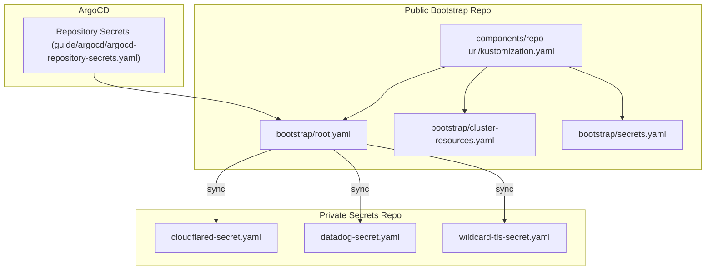
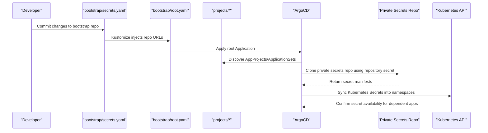
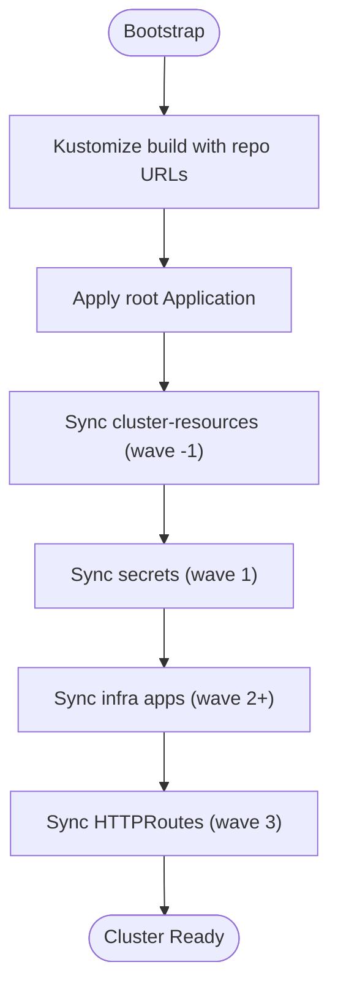
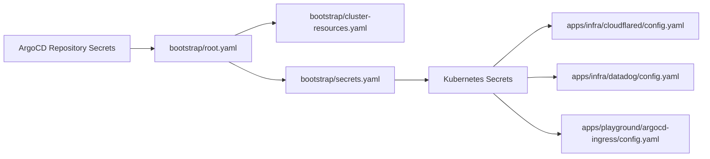

# Secret Management

<cite>
**Referenced Files in This Document**
- [README.md](file://README.md)
- [bootstrap/secrets.yaml](file://bootstrap/secrets.yaml)
- [bootstrap/root.yaml](file://bootstrap/root.yaml)
- [bootstrap/cluster-resources.yaml](file://bootstrap/cluster-resources.yaml)
- [guide/argocd/argocd-repository-secrets.yaml](file://guide/argocd/argocd-repository-secrets.yaml)
- [guide/argocd/README.md](file://guide/argocd/README.md)
- [guide/k8s_manifest_secrets/README.md](file://guide/k8s_manifest_secrets/README.md)
- [components/repo-url/kustomization.yaml](file://components/repo-url/kustomization.yaml)
- [projects/infra.yaml](file://projects/infra.yaml)
- [projects/playground.yaml](file://projects/playground.yaml)
- [apps/infra/cloudflared/config.yaml](file://apps/infra/cloudflared/config.yaml)
- [apps/infra/datadog/config.yaml](file://apps/infra/datadog/config.yaml)
- [apps/playground/argocd-ingress/config.yaml](file://apps/playground/argocd-ingress/config.yaml)
</cite>

## Update Summary
**Changes Made**
- Updated documentation references to reflect the renaming of argo_cd.md files to README.md format
- Updated file paths and references in all sections to point to the new README.md locations
- Maintained all existing content structure and technical accuracy
- Preserved all diagrams and examples while updating file references

## Table of Contents
1. [Introduction](#introduction)
2. [Project Structure](#project-structure)
3. [Core Components](#core-components)
4. [Architecture Overview](#architecture-overview)
5. [Detailed Component Analysis](#detailed-component-analysis)
6. [Dependency Analysis](#dependency-analysis)
7. [Performance Considerations](#performance-considerations)
8. [Troubleshooting Guide](#troubleshooting-guide)
9. [Conclusion](#conclusion)
10. [Appendices](#appendices)

## Introduction
This document explains secret management in the GitOps infrastructure system. It covers how sensitive data (such as API keys, Cloudflare tunnel tokens, and personal access tokens) are stored in a dedicated private repository and synchronized into the cluster via ArgoCD. It also documents the bootstrap and sync order, repository secret configuration for private repos, secret lifecycle practices, and integration with Kubernetes Secrets. Guidance is grounded in the repository's manifests and guides.

## Project Structure
Secrets are organized across:
- A public bootstrap repository containing ArgoCD Application definitions and Kustomize components that inject repository URLs.
- A private secrets repository containing Kubernetes Secret manifests for sensitive data.
- Guides that demonstrate secret formats and repository secret configuration for ArgoCD.

**Diagram sources**
- [bootstrap/root.yaml:15-18](file://bootstrap/root.yaml#L15-L18)
- [bootstrap/cluster-resources.yaml:26-28](file://bootstrap/cluster-resources.yaml#L26-L28)
- [bootstrap/secrets.yaml:13-15](file://bootstrap/secrets.yaml#L13-L15)
- [components/repo-url/kustomization.yaml:9-10](file://components/repo-url/kustomization.yaml#L9-L10)
- [guide/argocd/argocd-repository-secrets.yaml:12-16](file://guide/argocd/argocd-repository-secrets.yaml#L12-L16)
- [guide/k8s_manifest_secrets/README.md:10-18](file://guide/k8s_manifest_secrets/README.md#L10-L18)
- [guide/k8s_manifest_secrets/README.md:22-29](file://guide/k8s_manifest_secrets/README.md#L22-L29)
- [guide/k8s_manifest_secrets/README.md:34-45](file://guide/k8s_manifest_secrets/README.md#L34-L45)

**Section sources**
- [README.md:87-118](file://README.md#L87-L118)
- [README.md:160-163](file://README.md#L160-L163)

## Core Components
- Bootstrap Applications define the sync chain:
  - Root Application points to the projects directory.
  - Cluster-resources ApplicationSet provisions namespaces early.
  - Secrets Application synchronizes the private secrets repository.
- Kustomize centralizes repository URLs in a single component and substitutes placeholders during bootstrap.
- ArgoCD repository secrets connect ArgoCD to private repositories using typed Kubernetes Secrets labeled for ArgoCD.

Key responsibilities:
- bootstrap/root.yaml: Defines the root Application that orchestrates higher-level sync targets.
- bootstrap/cluster-resources.yaml: Creates namespaces and shared cluster resources prior to apps.
- bootstrap/secrets.yaml: Synchronizes the private secrets repository into the cluster.
- components/repo-url/kustomization.yaml: Provides centralized repo URLs for substitution.
- guide/argocd/argocd-repository-secrets.yaml: Demonstrates repository secret configuration for ArgoCD.
- guide/k8s_manifest_secrets/README.md: Documents secret manifest formats for Cloudflare, Datadog, and TLS.

**Section sources**
- [bootstrap/root.yaml:15-18](file://bootstrap/root.yaml#L15-L18)
- [bootstrap/cluster-resources.yaml:26-28](file://bootstrap/cluster-resources.yaml#L26-L28)
- [bootstrap/secrets.yaml:13-15](file://bootstrap/secrets.yaml#L13-L15)
- [components/repo-url/kustomization.yaml:9-10](file://components/repo-url/kustomization.yaml#L9-L10)
- [guide/argocd/argocd-repository-secrets.yaml:12-16](file://guide/argocd/argocd-repository-secrets.yaml#L12-L16)
- [guide/k8s_manifest_secrets/README.md:10-18](file://guide/k8s_manifest_secrets/README.md#L10-L18)
- [guide/k8s_manifest_secrets/README.md:22-29](file://guide/k8s_manifest_secrets/README.md#L22-L29)
- [guide/k8s_manifest_secrets/README.md:34-45](file://guide/k8s_manifest_secrets/README.md#L34-L45)

## Architecture Overview
The secret management architecture enforces separation of concerns:
- Public bootstrap repo controls sync order and repository injection.
- Private secrets repo holds Kubernetes Secret manifests.
- ArgoCD repository secrets enable secure cloning of private repos.
- Sync waves ensure prerequisites (namespaces) exist before secrets are applied.

**Diagram sources**
- [README.md:68-75](file://README.md#L68-L75)
- [README.md:76-86](file://README.md#L76-L86)
- [bootstrap/root.yaml:15-18](file://bootstrap/root.yaml#L15-L18)
- [bootstrap/cluster-resources.yaml:26-28](file://bootstrap/cluster-resources.yaml#L26-L28)
- [bootstrap/secrets.yaml:13-15](file://bootstrap/secrets.yaml#L13-L15)
- [components/repo-url/kustomization.yaml:9-10](file://components/repo-url/kustomization.yaml#L9-L10)
- [guide/argocd/argocd-repository-secrets.yaml:12-16](file://guide/argocd/argocd-repository-secrets.yaml#L12-L16)

## Detailed Component Analysis

### Bootstrap and Sync Order
- The bootstrap chain builds the root Application and injects repository URLs from a central component.
- Sync waves ensure namespaces are created before secrets are applied, and secrets are applied before dependent apps.

**Diagram sources**
- [README.md:68-75](file://README.md#L68-L75)
- [README.md:76-86](file://README.md#L76-L86)
- [bootstrap/cluster-resources.yaml:5](file://bootstrap/cluster-resources.yaml#L5)
- [bootstrap/secrets.yaml:7](file://bootstrap/secrets.yaml#L7)

**Section sources**
- [README.md:68-86](file://README.md#L68-L86)
- [bootstrap/cluster-resources.yaml:5](file://bootstrap/cluster-resources.yaml#L5)
- [bootstrap/secrets.yaml:7](file://bootstrap/secrets.yaml#L7)

### Private Secrets Repository and Secret Manifests
- The private repository contains Kubernetes Secret manifests for Cloudflare tunnel tokens, Datadog API keys, and TLS certificates.
- Secret names and keys are aligned with consuming applications' expectations.

Examples and references:
- Cloudflare tunnel token stored as a string field in a Secret named for the cloudflared component.
- Datadog API key stored as a string field in a Secret named for the Datadog agent.
- TLS certificate stored as a TLS Secret with PEM-encoded certificate and key.

**Section sources**
- [guide/k8s_manifest_secrets/README.md:10-18](file://guide/k8s_manifest_secrets/README.md#L10-L18)
- [guide/k8s_manifest_secrets/README.md:22-29](file://guide/k8s_manifest_secrets/README.md#L22-L29)
- [guide/k8s_manifest_secrets/README.md:34-45](file://guide/k8s_manifest_secrets/README.md#L34-L45)

### ArgoCD Repository Secrets for Private Repositories
- Repository secrets are Kubernetes Secrets labeled for ArgoCD and contain credentials for private Git repositories.
- These secrets enable ArgoCD to clone the public bootstrap repo and the private secrets repo.

Configuration highlights:
- Secret type is git.
- URL points to the respective repository.
- Username and password correspond to a service account or personal access token.

**Section sources**
- [guide/argocd/argocd-repository-secrets.yaml:12-16](file://guide/argocd/argocd-repository-secrets.yaml#L12-L16)
- [guide/argocd/argocd-repository-secrets.yaml:25-29](file://guide/argocd/argocd-repository-secrets.yaml#L25-L29)

### Consuming Secrets in Applications
- Applications declare a destination namespace and optional sync wave to ensure secrets exist before the app deploys.
- Example configurations show namespace assignments and sync wave ordering for cloudflared, Datadog, and ArgoCD ingress.

**Section sources**
- [apps/infra/cloudflared/config.yaml:1-4](file://apps/infra/cloudflared/config.yaml#L1-L4)
- [apps/infra/datadog/config.yaml:1-6](file://apps/infra/datadog/config.yaml#L1-L6)
- [apps/playground/argocd-ingress/config.yaml:1-4](file://apps/playground/argocd-ingress/config.yaml#L1-L4)

### Secret Lifecycle: Creation to Rotation
- Creation: Define Secret manifests in the private repository and ensure the Secrets are applied in the correct namespace before dependent apps.
- Access: Consume Secrets via volume mounts or environment variables in workloads that reference the Secret names and keys.
- Rotation: Replace values in the private repository, commit, and allow ArgoCD to resync. For long-lived tokens, revoke old tokens after successful rotation.
- Storage: Keep sensitive data only in the private repository; avoid committing secrets to the public bootstrap repository.
- Encryption: While the manifests are stored as Kubernetes Secrets, encryption-at-rest and in-transit are handled by Kubernetes and ArgoCD transport security; ensure repository access controls and credential hygiene.

Best practices:
- Use dedicated namespaces per component to scope secrets.
- Align Secret names and keys with application expectations.
- Use sync waves to enforce prerequisite ordering.
- Limit repository access to trusted identities and rotate credentials regularly.

**Section sources**
- [README.md:160-163](file://README.md#L160-L163)
- [bootstrap/secrets.yaml:13-15](file://bootstrap/secrets.yaml#L13-L15)
- [guide/k8s_manifest_secrets/README.md:10-18](file://guide/k8s_manifest_secrets/README.md#L10-L18)
- [guide/k8s_manifest_secrets/README.md:22-29](file://guide/k8s_manifest_secrets/README.md#L22-L29)
- [guide/k8s_manifest_secrets/README.md:34-45](file://guide/k8s_manifest_secrets/README.md#L34-L45)

## Dependency Analysis
Secrets depend on:
- Correctly configured repository secrets for ArgoCD to clone the private secrets repository.
- Proper sync waves so namespaces and Secrets are ready before apps consume them.
- Accurate Secret names and keys that match application expectations.

**Diagram sources**
- [guide/argocd/argocd-repository-secrets.yaml:12-16](file://guide/argocd/argocd-repository-secrets.yaml#L12-L16)
- [bootstrap/root.yaml:15-18](file://bootstrap/root.yaml#L15-L18)
- [bootstrap/cluster-resources.yaml:26-28](file://bootstrap/cluster-resources.yaml#L26-L28)
- [bootstrap/secrets.yaml:13-15](file://bootstrap/secrets.yaml#L13-L15)
- [apps/infra/cloudflared/config.yaml:1-4](file://apps/infra/cloudflared/config.yaml#L1-L4)
- [apps/infra/datadog/config.yaml:1-6](file://apps/infra/datadog/config.yaml#L1-L6)
- [apps/playground/argocd-ingress/config.yaml:1-4](file://apps/playground/argocd-ingress/config.yaml#L1-L4)

**Section sources**
- [README.md:76-86](file://README.md#L76-L86)
- [components/repo-url/kustomization.yaml:9-10](file://components/repo-url/kustomization.yaml#L9-L10)

## Performance Considerations
- Minimize unnecessary retries by ensuring repository credentials are correct and network connectivity is stable.
- Use sync waves to reduce contention and ensure prerequisites are established before heavy workloads.
- Keep the private secrets repository small and focused to reduce sync time.

## Troubleshooting Guide
Common issues and resolutions:
- ArgoCD cannot clone the private secrets repository:
  - Verify repository secret exists with the correct type, URL, username, and password.
  - Confirm the Secret is labeled for ArgoCD repository type.
  - Ensure the repository URL matches the private secrets repository and the branch/revision aligns with the bootstrap configuration.
- Secrets not found by applications:
  - Confirm the Secret is applied in the correct namespace.
  - Verify the application references the correct Secret name and key.
  - Check sync wave ordering so Secrets are applied before the app attempts to mount them.
- Namespace missing:
  - Ensure cluster-resources ApplicationSet runs before Secrets and apps.
  - Confirm the destination namespace annotation or configuration in the app's config file.

Operational checks:
- Review ArgoCD logs for repository clone errors.
- Inspect the root Application and Secrets Application statuses.
- Validate that repository URLs are substituted correctly during bootstrap.

**Section sources**
- [guide/argocd/argocd-repository-secrets.yaml:12-16](file://guide/argocd/argocd-repository-secrets.yaml#L12-L16)
- [README.md:76-86](file://README.md#L76-L86)
- [bootstrap/cluster-resources.yaml:5](file://bootstrap/cluster-resources.yaml#L5)
- [apps/infra/cloudflared/config.yaml:1-4](file://apps/infra/cloudflared/config.yaml#L1-L4)
- [apps/infra/datadog/config.yaml:1-6](file://apps/infra/datadog/config.yaml#L1-L6)
- [apps/playground/argocd-ingress/config.yaml:1-4](file://apps/playground/argocd-ingress/config.yaml#L1-L4)

## Conclusion
By separating sensitive data into a private repository and synchronizing it through ArgoCD with strict sync waves, this system ensures secure, auditable, and repeatable secret management. Following the documented patterns for repository secrets, Secret manifests, and application consumption helps maintain a robust and maintainable GitOps pipeline.

## Appendices

### Appendix A: Secret Manifest Formats
- Cloudflare tunnel token stored as a string field in a Secret.
- Datadog API key stored as a string field in a Secret.
- TLS certificate stored as a TLS Secret with PEM-encoded certificate and key.

**Section sources**
- [guide/k8s_manifest_secrets/README.md:10-18](file://guide/k8s_manifest_secrets/README.md#L10-L18)
- [guide/k8s_manifest_secrets/README.md:22-29](file://guide/k8s_manifest_secrets/README.md#L22-L29)
- [guide/k8s_manifest_secrets/README.md:34-45](file://guide/k8s_manifest_secrets/README.md#L34-L45)

### Appendix B: Repository Secret Configuration
- Configure ArgoCD repository secrets with type git, the correct URL, username, and password.
- Apply the Secret in the argocd namespace and label it for ArgoCD repository type.

**Section sources**
- [guide/argocd/argocd-repository-secrets.yaml:12-16](file://guide/argocd/argocd-repository-secrets.yaml#L12-L16)
- [guide/argocd/argocd-repository-secrets.yaml:25-29](file://guide/argocd/argocd-repository-secrets.yaml#L25-L29)

### Appendix C: ArgoCD Installation and Setup
- The guide provides step-by-step instructions for installing ArgoCD, exposing the UI, applying repository secrets, and bootstrapping the system.
- Includes commands for creating the argocd namespace, applying installation manifests, and managing bootstrap applications.

**Section sources**
- [guide/argocd/README.md:1-34](file://guide/argocd/README.md#L1-L34)