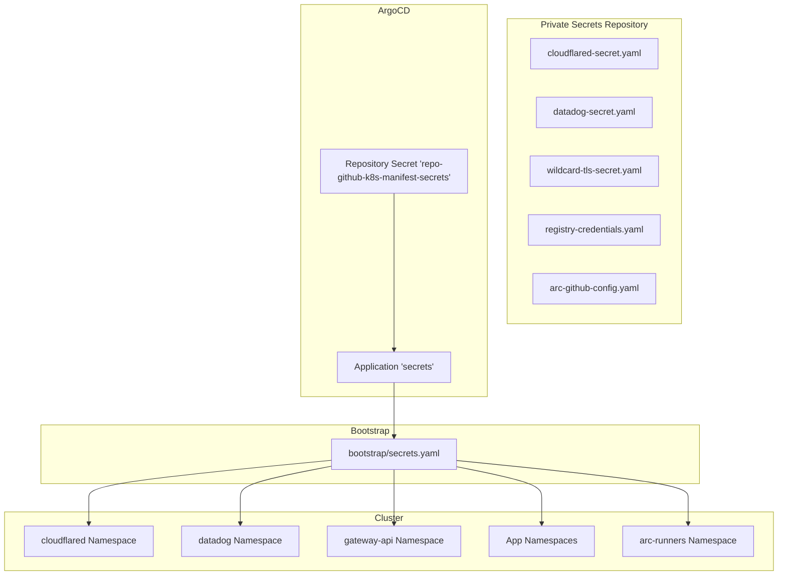
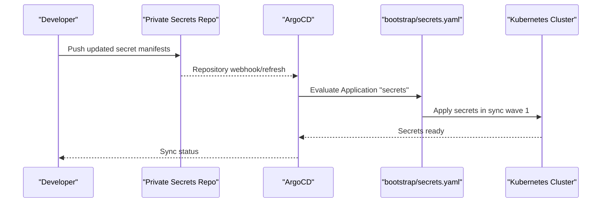
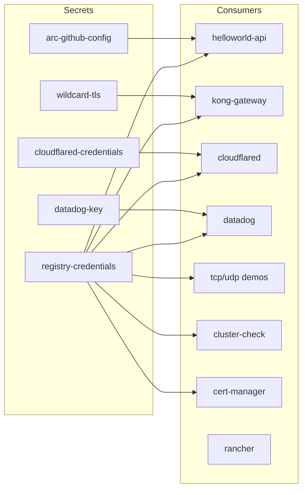

# Secret Storage and Management

<cite>
**Referenced Files in This Document**
- [README.md](file://guide/2. secret_storage/README.md)
- [README.md](file://guide/2. secret_storage/k8s_manifest_secrets/README.md)
- [secrets.yaml](file://bootstrap/secrets.yaml)
- [argocd-repository-secrets.yaml](file://guide/1. argocd (for setup)/argocd-repository-secrets.yaml)
- [cloudflared-secret.yaml](file://guide/2. secret_storage/k8s_manifest_secrets/cloudflared-secret.yaml)
- [datadog-secret.yaml](file://guide/2. secret_storage/k8s_manifest_secrets/datadog-secret.yaml)
- [wildcard-tls-secret.yaml](file://guide/2. secret_storage/k8s_manifest_secrets/wildcard-tls-secret.yaml)
- [registry-credentials.yaml](file://guide/2. secret_storage/k8s_manifest_secrets/registry-credentials.yaml)
- [arc-github-config.yaml](file://guide/2. secret_storage/k8s_manifest_secrets/arc-github-config.yaml)
- [values.yaml](file://apps/infra/kong-gateway/chart/values.yaml)
- [values.yaml](file://apps/infra/rancher/chart/values.yaml)
- [values-service.yaml](file://apps/applications/helloworld-api/chart/values-service.yaml)
- [config.yaml](file://apps/infra/arc-controller/config.yaml)
- [config.yaml](file://apps/infra/arc-runner-set/config.yaml)
</cite>

## Table of Contents
1. [Introduction](#introduction)
2. [Project Structure](#project-structure)
3. [Core Components](#core-components)
4. [Architecture Overview](#architecture-overview)
5. [Detailed Component Analysis](#detailed-component-analysis)
6. [Dependency Analysis](#dependency-analysis)
7. [Performance Considerations](#performance-considerations)
8. [Troubleshooting Guide](#troubleshooting-guide)
9. [Conclusion](#conclusion)

## Introduction
This document explains how secrets are stored, managed, and deployed in the GitOps-driven Kubernetes manifest repository. The approach uses a dedicated private repository for sensitive resources and ArgoCD to synchronize them into the cluster during a controlled sync wave. It covers the secret types used, their creation and rotation procedures, and how applications consume these secrets for secure operations such as image pulling and TLS termination.

## Project Structure
Secrets are organized under a dedicated guide section and a separate private repository. The bootstrap process defines an ArgoCD Application that targets the private secrets repository and applies the manifests during sync wave 1. Applications reference these secrets by name to access credentials securely.

**Diagram sources**
- [secrets.yaml:1-24](file://bootstrap/secrets.yaml#L1-L24)
- [argocd-repository-secrets.yaml](file://guide/1. argocd (for setup)/argocd-repository-secrets.yaml#L1-L30)
- [cloudflared-secret.yaml:1-9](file://guide/2. secret_storage/k8s_manifest_secrets/cloudflared-secret.yaml#L1-L9)
- [datadog-secret.yaml:1-9](file://guide/2. secret_storage/k8s_manifest_secrets/datadog-secret.yaml#L1-L9)
- [wildcard-tls-secret.yaml:1-12](file://guide/2. secret_storage/k8s_manifest_secrets/wildcard-tls-secret.yaml#L1-L12)
- [registry-credentials.yaml:1-98](file://guide/2. secret_storage/k8s_manifest_secrets/registry-credentials.yaml#L1-L98)
- [arc-github-config.yaml:1-9](file://guide/2. secret_storage/k8s_manifest_secrets/arc-github-config.yaml#L1-L9)

**Section sources**
- [README.md:1-76](file://guide/2. secret_storage/README.md#L1-L76)
- [README.md:1-238](file://guide/2. secret_storage/k8s_manifest_secrets/README.md#L1-L238)
- [secrets.yaml:1-24](file://bootstrap/secrets.yaml#L1-L24)
- [argocd-repository-secrets.yaml](file://guide/1. argocd (for setup)/argocd-repository-secrets.yaml#L1-L30)

## Core Components
- Private Secrets Repository: Contains Kubernetes Secret manifests for sensitive data such as tokens, certificates, and registry credentials. These are kept in a separate private repository to minimize exposure risk.
- Bootstrap ArgoCD Application: Defines the synchronization of the private secrets repository into the cluster during sync wave 1, ensuring secrets are applied before dependent workloads.
- Secret Types:
  - Opaque secrets for tokens (Cloudflare tunnel, Datadog API key, GitHub runner token).
  - TLS secrets for wildcard certificates used by Gateways.
  - Docker registry credentials stored as a single dockerconfigjson across multiple namespaces for unified image pull access.

Key operational characteristics:
- Sync waves: Secrets are synchronized in wave 1 to guarantee availability before applications attempt to use them.
- Namespace scoping: Each secret is scoped to its target namespace to enforce least privilege.
- Multi-document YAML: The registry credentials file includes multiple documents (one per namespace) to avoid duplication.

**Section sources**
- [README.md:6-76](file://guide/2. secret_storage/README.md#L6-L76)
- [README.md:7-12](file://guide/2. secret_storage/k8s_manifest_secrets/README.md#L7-L12)
- [secrets.yaml:6-10](file://bootstrap/secrets.yaml#L6-L10)
- [cloudflared-secret.yaml:1-9](file://guide/2. secret_storage/k8s_manifest_secrets/cloudflared-secret.yaml#L1-L9)
- [datadog-secret.yaml:1-9](file://guide/2. secret_storage/k8s_manifest_secrets/datadog-secret.yaml#L1-L9)
- [wildcard-tls-secret.yaml:1-12](file://guide/2. secret_storage/k8s_manifest_secrets/wildcard-tls-secret.yaml#L1-L12)
- [registry-credentials.yaml:1-98](file://guide/2. secret_storage/k8s_manifest_secrets/registry-credentials.yaml#L1-L98)
- [arc-github-config.yaml:1-9](file://guide/2. secret_storage/k8s_manifest_secrets/arc-github-config.yaml#L1-L9)

## Architecture Overview
The secret lifecycle follows a GitOps pattern: maintain secrets in a private repository, configure ArgoCD to sync them, and reference them from applications.

**Diagram sources**
- [secrets.yaml:1-24](file://bootstrap/secrets.yaml#L1-L24)
- [argocd-repository-secrets.yaml](file://guide/1. argocd (for setup)/argocd-repository-secrets.yaml#L17-L29)
- [README.md:3-3](file://guide/2. secret_storage/k8s_manifest_secrets/README.md#L3-L3)

## Detailed Component Analysis

### Cloudflare Tunnel Credentials
Purpose: Provides the Cloudflare tunnel token for secure connectivity.
- Secret type: Opaque
- Target namespace: cloudflared
- Usage: Consumed by the cloudflared component to establish tunnels.

Security considerations:
- Treat as a long-lived token; rotate periodically.
- Limit scope to the cloudflared namespace.

**Section sources**
- [cloudflared-secret.yaml:1-9](file://guide/2. secret_storage/k8s_manifest_secrets/cloudflared-secret.yaml#L1-L9)

### Datadog API Key
Purpose: Authenticates Datadog integrations and agent reporting.
- Secret type: Opaque
- Target namespace: datadog
- Usage: Mounted by Datadog agents or integrations.

Security considerations:
- Restrict access to the datadog namespace.
- Rotate keys according to policy.

**Section sources**
- [datadog-secret.yaml:1-9](file://guide/2. secret_storage/k8s_manifest_secrets/datadog-secret.yaml#L1-L9)

### Wildcard TLS Certificate
Purpose: Enables HTTPS termination for Gateway APIs using a wildcard certificate.
- Secret type: TLS
- Target namespace: gateway-api
- Usage: Referenced by Gateway listeners via certificateRefs.

Creation options:
- Self-signed for development.
- Let's Encrypt via cert-manager for production.
- Bring your own certificate from a commercial CA.

Operational notes:
- Keep the secret name aligned with Gateway certificateRefs.
- Update base64 values after regenerating certificates.

**Section sources**
- [wildcard-tls-secret.yaml:1-12](file://guide/2. secret_storage/k8s_manifest_secrets/wildcard-tls-secret.yaml#L1-L12)
- [README.md:137-230](file://guide/2. secret_storage/k8s_manifest_secrets/README.md#L137-L230)

### Docker Registry Credentials
Purpose: Unified credentials for Docker Hub and GHCR to enable image pulls across all namespaces.
- Secret type: kubernetes.io/dockerconfigjson
- Target namespaces: Multiple application namespaces (e.g., helloworld-api, gateway-api, cloudflared, datadog, tcp-demo, udp-demo, cluster-check, cattle-system, cert-manager, kong-gateway)
- Usage: Applications reference imagePullSecrets by name.

Creation and maintenance:
- Combine Docker Hub and GHCR credentials into a single .dockerconfigjson.
- Distribute the same encoded value across all namespace documents.
- Rotate tokens and update the secret(s) to propagate changes.

Integration example:
- Kong Gateway references the shared secret via pullSecrets.

**Section sources**
- [registry-credentials.yaml:1-98](file://guide/2. secret_storage/k8s_manifest_secrets/registry-credentials.yaml#L1-L98)
- [README.md:14-48](file://guide/2. secret_storage/k8s_manifest_secrets/README.md#L14-L48)
- [values.yaml:13-14](file://apps/infra/kong-gateway/chart/values.yaml#L13-L14)

### GitHub Runner Controller Token
Purpose: Authenticates the GitHub Actions Runner Controller with GitHub.
- Secret type: Opaque
- Target namespace: arc-runners
- Usage: Used by ARC components to register and manage runners.

Operational notes:
- Store securely and rotate periodically.
- Align with ARC deployment wave to ensure availability.

**Section sources**
- [arc-github-config.yaml:1-9](file://guide/2. secret_storage/k8s_manifest_secrets/arc-github-config.yaml#L1-L9)
- [config.yaml:1-4](file://apps/infra/arc-runner-set/config.yaml#L1-L4)

## Dependency Analysis
Secrets are consumed by applications and infrastructure components. The dependency chain ensures that secrets are present before dependent workloads start.

**Diagram sources**
- [registry-credentials.yaml:1-98](file://guide/2. secret_storage/k8s_manifest_secrets/registry-credentials.yaml#L1-L98)
- [wildcard-tls-secret.yaml:1-12](file://guide/2. secret_storage/k8s_manifest_secrets/wildcard-tls-secret.yaml#L1-L12)
- [cloudflared-secret.yaml:1-9](file://guide/2. secret_storage/k8s_manifest_secrets/cloudflared-secret.yaml#L1-L9)
- [datadog-secret.yaml:1-9](file://guide/2. secret_storage/k8s_manifest_secrets/datadog-secret.yaml#L1-L9)
- [arc-github-config.yaml:1-9](file://guide/2. secret_storage/k8s_manifest_secrets/arc-github-config.yaml#L1-L9)
- [values.yaml:13-14](file://apps/infra/kong-gateway/chart/values.yaml#L13-L14)
- [values.yaml:1-6](file://apps/applications/helloworld-api/chart/values-service.yaml#L1-L6)
- [values.yaml:1-9](file://apps/infra/rancher/chart/values.yaml#L1-L9)

**Section sources**
- [README.md:14-48](file://guide/2. secret_storage/k8s_manifest_secrets/README.md#L14-L48)
- [values.yaml:13-14](file://apps/infra/kong-gateway/chart/values.yaml#L13-L14)
- [values.yaml:1-6](file://apps/applications/helloworld-api/chart/values-service.yaml#L1-L6)
- [values.yaml:1-9](file://apps/infra/rancher/chart/values.yaml#L1-L9)

## Performance Considerations
- Minimize secret churn: Batch updates to reduce ArgoCD sync cycles.
- Use a single dockerconfigjson: Reduces duplication and simplifies maintenance across namespaces.
- Limit secret scope: Keep secrets in only the namespaces that require them to reduce RBAC complexity.
- Monitor pull secrets: Verify image pulls succeed after secret updates.

## Troubleshooting Guide
Common issues and resolutions:
- Secret not found in namespace:
  - Verify the bootstrap Application "secrets" is healthy and synced in wave 1.
  - Confirm the target namespace exists and the secret name matches the consumer references.
- TLS certificate errors:
  - Ensure the TLS secret name matches the Gateway certificateRefs.
  - Re-apply the secret after regenerating certificates.
- Image pull failures:
  - Confirm the dockerconfigjson is valid and identical across all namespace entries.
  - Verify the application references the correct imagePullSecrets name.
- Runner registration failures:
  - Check the arc-github-config secret exists in arc-runners and align with ARC deployment wave.

Verification steps:
- Check secret existence and data in the target namespace.
- Inspect pod events for image pull errors.
- Review ArgoCD sync logs for the secrets Application.

**Section sources**
- [README.md:128-136](file://guide/2. secret_storage/k8s_manifest_secrets/README.md#L128-L136)
- [README.md:231-238](file://guide/2. secret_storage/k8s_manifest_secrets/README.md#L231-L238)
- [secrets.yaml:6-10](file://bootstrap/secrets.yaml#L6-L10)
- [config.yaml:1-4](file://apps/infra/arc-controller/config.yaml#L1-L4)
- [config.yaml:1-4](file://apps/infra/arc-runner-set/config.yaml#L1-L4)

## Conclusion
The secret storage and management strategy leverages a private repository and ArgoCD to securely deploy and maintain sensitive data. By scoping secrets to specific namespaces, using a single unified registry credential, and controlling sync waves, the system achieves predictable, auditable, and secure secret delivery to applications and infrastructure components.