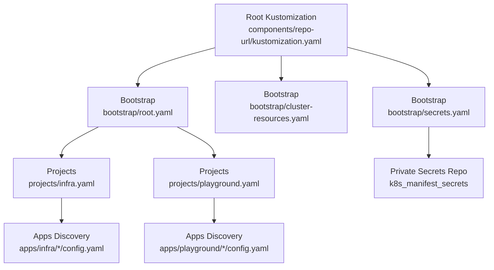
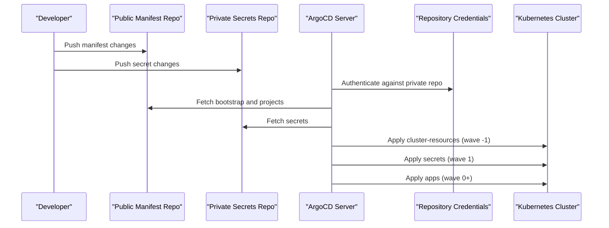
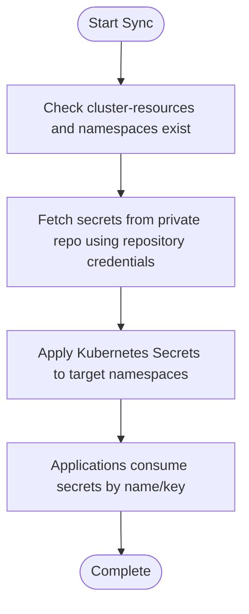
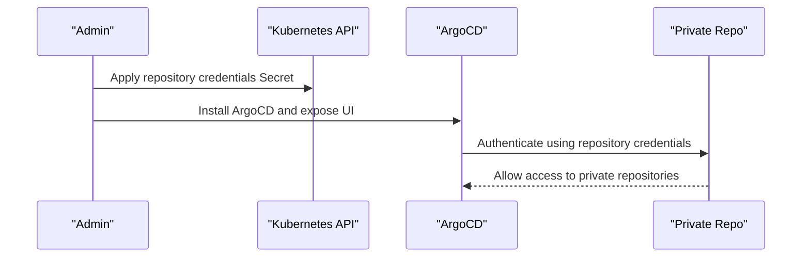
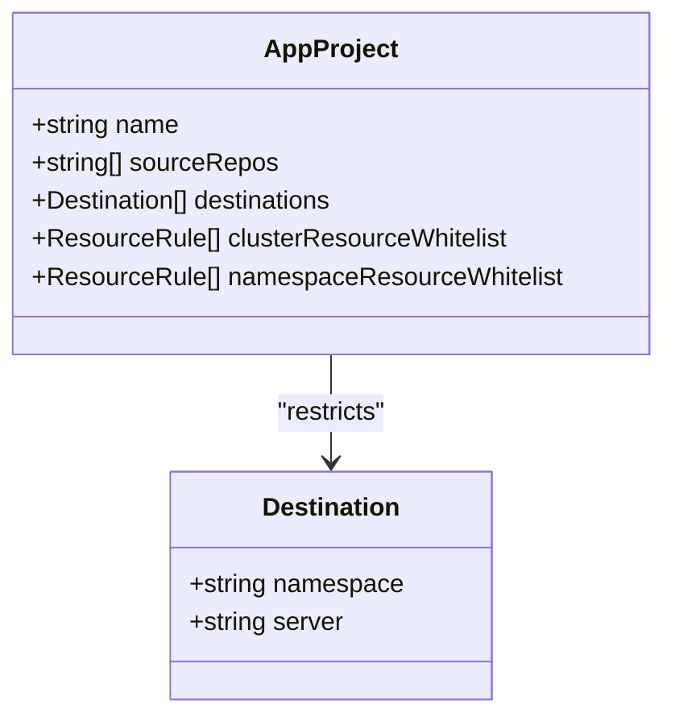
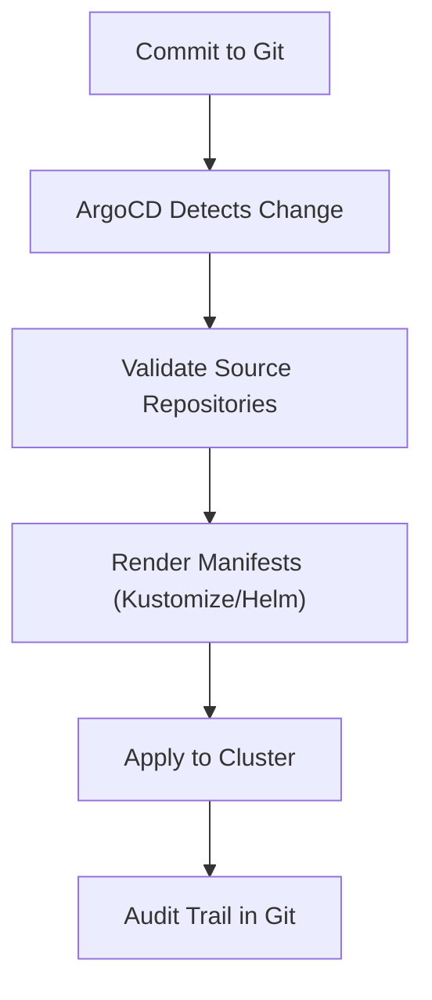
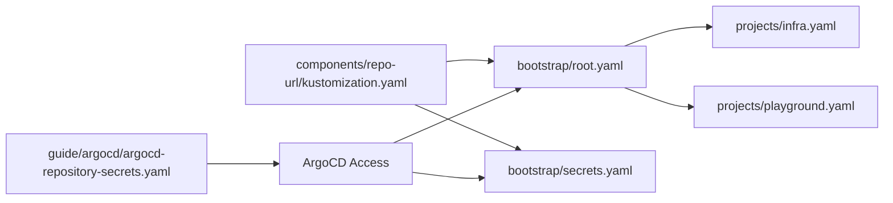

# Security Considerations

<cite>
**Referenced Files in This Document**
- [README.md](file://README.md)
- [bootstrap/secrets.yaml](file://bootstrap/secrets.yaml)
- [bootstrap/root.yaml](file://bootstrap/root.yaml)
- [bootstrap/cluster-resources.yaml](file://bootstrap/cluster-resources.yaml)
- [projects/infra.yaml](file://projects/infra.yaml)
- [projects/playground.yaml](file://projects/playground.yaml)
- [guide/argocd/argocd-repository-secrets.yaml](file://guide/argocd/argocd-repository-secrets.yaml)
- [guide/k8s_manifest_secrets/argo_cd.md](file://guide/k8s_manifest_secrets/argo_cd.md)
- [apps/infra/cloudflared/config.yaml](file://apps/infra/cloudflared/config.yaml)
- [apps/infra/datadog/config.yaml](file://apps/infra/datadog/config.yaml)
- [apps/playground/rancher/config.yaml](file://apps/playground/rancher/config.yaml)
- [apps/playground/cert-manager/config.yaml](file://apps/playground/cert-manager/config.yaml)
- [apps/playground/argocd-ingress/chart/argocd-cmd-params-cm.yaml](file://apps/playground/argocd-ingress/chart/argocd-cmd-params-cm.yaml)
- [components/repo-url/kustomization.yaml](file://components/repo-url/kustomization.yaml)
</cite>

## Table of Contents
1. [Introduction](#introduction)
2. [Project Structure](#project-structure)
3. [Core Components](#core-components)
4. [Architecture Overview](#architecture-overview)
5. [Detailed Component Analysis](#detailed-component-analysis)
6. [Dependency Analysis](#dependency-analysis)
7. [Performance Considerations](#performance-considerations)
8. [Troubleshooting Guide](#troubleshooting-guide)
9. [Conclusion](#conclusion)
10. [Appendices](#appendices)

## Introduction
This document consolidates security practices and considerations for the GitOps infrastructure management system. It focuses on secret management strategies using private repositories and a dedicated bootstrap/secrets.yaml, repository access controls, ArgoCD security configurations, and RBAC best practices. It also explains the GitOps security model, how it prevents unauthorized cluster modifications, and provides guidelines for managing secrets across environments, encryption strategies, compliance considerations, and mitigation strategies for common GitOps vulnerabilities.

## Project Structure
The repository follows a layered GitOps structure:
- Root Kustomization builds bootstrap artifacts and injects repository URLs centrally.
- Bootstrap layer defines the root Application, cluster-resources ApplicationSet, and the secrets Application.
- Projects define AppProjects and ApplicationSets that discover applications via config.yaml files.
- Apps define individual deployments with optional sync ordering via annotations.
- Guides document repository secrets and private secrets repository usage.

**Diagram sources**
- [components/repo-url/kustomization.yaml:1-11](file://components/repo-url/kustomization.yaml#L1-L11)
- [bootstrap/root.yaml:1-37](file://bootstrap/root.yaml#L1-L37)
- [bootstrap/cluster-resources.yaml:1-33](file://bootstrap/cluster-resources.yaml#L1-L33)
- [bootstrap/secrets.yaml:1-24](file://bootstrap/secrets.yaml#L1-L24)
- [projects/infra.yaml:1-85](file://projects/infra.yaml#L1-L85)
- [projects/playground.yaml:1-90](file://projects/playground.yaml#L1-L90)
- [apps/infra/cloudflared/config.yaml:1-4](file://apps/infra/cloudflared/config.yaml#L1-L4)
- [apps/playground/rancher/config.yaml:1-5](file://apps/playground/rancher/config.yaml#L1-L5)

**Section sources**
- [README.md:87-118](file://README.md#L87-L118)
- [components/repo-url/kustomization.yaml:1-11](file://components/repo-url/kustomization.yaml#L1-L11)

## Core Components
- Bootstrap root Application: Declares the source repository and path for projects, enabling centralized control of the GitOps surface.
- Cluster-resources ApplicationSet: Creates shared namespaces and cluster objects with a negative sync wave to ensure prerequisites exist before downstream resources.
- Secrets Application: Syncs sensitive resources from a private repository using a dedicated Application with a positive sync wave, ensuring secrets are applied after prerequisites.
- AppProjects: Define allowed source repositories and destinations, constraining where applications can deploy and what cluster resources they can manage.
- ApplicationSets: Discover and render applications via config.yaml files, applying Kustomize and Helm with controlled sync policies.

**Section sources**
- [bootstrap/root.yaml:1-37](file://bootstrap/root.yaml#L1-L37)
- [bootstrap/cluster-resources.yaml:1-33](file://bootstrap/cluster-resources.yaml#L1-L33)
- [bootstrap/secrets.yaml:1-24](file://bootstrap/secrets.yaml#L1-L24)
- [projects/infra.yaml:1-85](file://projects/infra.yaml#L1-L85)
- [projects/playground.yaml:1-90](file://projects/playground.yaml#L1-L90)

## Architecture Overview
The security model relies on:
- Separation of concerns: Public repository for manifests, private repository for secrets.
- Controlled sync order via sync waves to ensure prerequisites exist before dependent resources.
- AppProject scoping to restrict source repos and destinations.
- ArgoCD repository credentials stored as Kubernetes Secrets to access private repositories.

**Diagram sources**
- [README.md:76-86](file://README.md#L76-L86)
- [bootstrap/cluster-resources.yaml:1-33](file://bootstrap/cluster-resources.yaml#L1-L33)
- [bootstrap/secrets.yaml:1-24](file://bootstrap/secrets.yaml#L1-L24)
- [guide/argocd/argocd-repository-secrets.yaml:1-30](file://guide/argocd/argocd-repository-secrets.yaml#L1-L30)

## Detailed Component Analysis

### Secret Management Strategy
- Private Secrets Repository: Sensitive data (API keys, tunnel tokens, PATs) are maintained in a separate private repository and synced via bootstrap/secrets.yaml.
- Repository Access Control: ArgoCD repository credentials are stored as Kubernetes Secrets with label indicating secret type repository, enabling access to private repositories.
- Sync Ordering: The secrets Application uses a positive sync wave to ensure prerequisite namespaces and cluster resources exist prior to applying secrets.
- Secret Consumption: Applications reference secrets by name and key, as documented in guides for specific integrations (e.g., Datadog API key).

**Diagram sources**
- [bootstrap/secrets.yaml:1-24](file://bootstrap/secrets.yaml#L1-L24)
- [guide/argocd/argocd-repository-secrets.yaml:1-30](file://guide/argocd/argocd-repository-secrets.yaml#L1-L30)
- [guide/k8s_manifest_secrets/argo_cd.md:1-46](file://guide/k8s_manifest_secrets/argo_cd.md#L1-L46)
- [apps/infra/datadog/config.yaml:1-6](file://apps/infra/datadog/config.yaml#L1-L6)

**Section sources**
- [README.md:160-163](file://README.md#L160-L163)
- [bootstrap/secrets.yaml:1-24](file://bootstrap/secrets.yaml#L1-L24)
- [guide/argocd/argocd-repository-secrets.yaml:1-30](file://guide/argocd/argocd-repository-secrets.yaml#L1-L30)
- [guide/k8s_manifest_secrets/argo_cd.md:1-46](file://guide/k8s_manifest_secrets/argo_cd.md#L1-L46)
- [apps/infra/datadog/config.yaml:1-6](file://apps/infra/datadog/config.yaml#L1-L6)

### Repository Access Controls and ArgoCD Security Configurations
- Repository Credentials: Repository credentials are defined as Kubernetes Secrets with labels indicating secret type repository, enabling ArgoCD to authenticate against private repositories.
- ArgoCD Installation and Exposure: The guide documents installing ArgoCD, enabling Helm support, exposing the UI, and applying repository credentials.
- Insecure Server Setting: A ConfigMap sets the ArgoCD server insecure mode flag, which should be reviewed for production hardening.

**Diagram sources**
- [guide/argocd/argocd-repository-secrets.yaml:1-30](file://guide/argocd/argocd-repository-secrets.yaml#L1-L30)
- [guide/argocd/argo_cd.md:1-34](file://guide/argocd/argo_cd.md#L1-L34)
- [apps/playground/argocd-ingress/chart/argocd-cmd-params-cm.yaml:1-13](file://apps/playground/argocd-ingress/chart/argocd-cmd-params-cm.yaml#L1-L13)

**Section sources**
- [guide/argocd/argocd-repository-secrets.yaml:1-30](file://guide/argocd/argocd-repository-secrets.yaml#L1-L30)
- [guide/argocd/argo_cd.md:1-34](file://guide/argocd/argo_cd.md#L1-L34)
- [apps/playground/argocd-ingress/chart/argocd-cmd-params-cm.yaml:1-13](file://apps/playground/argocd-ingress/chart/argocd-cmd-params-cm.yaml#L1-L13)

### RBAC Best Practices and AppProject Scoping
- AppProject Definition: AppProjects restrict source repositories and destinations, limiting where applications can deploy and what cluster resources they can manage.
- Cluster and Namespace Whitelists: The infra and playground projects demonstrate permissive whitelists; adjust these to match least-privilege requirements in production.
- Destination Constraints: Destination servers and namespaces are constrained per project to prevent cross-project drift.

**Diagram sources**
- [projects/infra.yaml:1-85](file://projects/infra.yaml#L1-L85)
- [projects/playground.yaml:1-90](file://projects/playground.yaml#L1-L90)

**Section sources**
- [projects/infra.yaml:1-85](file://projects/infra.yaml#L1-L85)
- [projects/playground.yaml:1-90](file://projects/playground.yaml#L1-L90)

### GitOps Security Model and Unauthorized Modification Prevention
- Single Source of Truth: All changes must be committed to Git; ArgoCD enforces reconciliation based on repository state.
- No Direct Cluster Modifications: The repository explicitly forbids direct kubectl mutations for cluster state, enforcing Git-driven change control.
- Automated Sync Policies: Automated pruning, self-healing, and retry mechanisms ensure consistency while maintaining auditability through Git history.

**Diagram sources**
- [README.md:120-127](file://README.md#L120-L127)

**Section sources**
- [README.md:120-127](file://README.md#L120-L127)

### Managing Secrets Across Environments
- Environment Segregation: Maintain separate private repositories or branches per environment to isolate secrets.
- Sync Waves: Use sync waves to ensure environment-specific prerequisites are applied before environment-specific secrets.
- Consumption Patterns: Applications consume secrets by name and key; ensure naming conventions and keys align across environments.

**Section sources**
- [README.md:76-86](file://README.md#L76-L86)
- [apps/infra/cloudflared/config.yaml:1-4](file://apps/infra/cloudflared/config.yaml#L1-L4)
- [apps/infra/datadog/config.yaml:1-6](file://apps/infra/datadog/config.yaml#L1-L6)
- [apps/playground/rancher/config.yaml:1-5](file://apps/playground/rancher/config.yaml#L1-L5)
- [apps/playground/cert-manager/config.yaml:1-5](file://apps/playground/cert-manager/config.yaml#L1-L5)

### Encryption Strategies and Compliance Considerations
- Transport Security: Ensure HTTPS is used for all repository access and secure exposure of ArgoCD UI.
- At-Rest Encryption: Rely on Kubernetes Secrets encryption at rest and cluster storage encryption policies.
- Audit Logging: Maintain logs of ArgoCD operations and Git commits for compliance audits.
- Least Privilege: Restrict AppProject permissions and repository credentials to the minimal set required.

[No sources needed since this section provides general guidance]

### Common Security Vulnerabilities and Mitigation Strategies
- Hardcoded Credentials in Public Repos: Mitigate by moving secrets to a private repository and referencing them via ArgoCD Secrets.
- Overly Permissive AppProjects: Mitigate by narrowing sourceRepos, destinations, and whitelists to least privilege.
- Insecure ArgoCD Exposure: Mitigate by disabling insecure server settings and using secure ingress with mutual TLS.
- Supply Chain Risks: Mitigate by pinning Helm chart versions, using OCI registries, and validating provenance where applicable.

**Section sources**
- [apps/playground/argocd-ingress/chart/argocd-cmd-params-cm.yaml:1-13](file://apps/playground/argocd-ingress/chart/argocd-cmd-params-cm.yaml#L1-L13)
- [projects/infra.yaml:1-85](file://projects/infra.yaml#L1-L85)
- [projects/playground.yaml:1-90](file://projects/playground.yaml#L1-L90)

## Dependency Analysis
The security posture depends on the interplay between repository URLs, bootstrap Applications, AppProjects, and repository credentials.

**Diagram sources**
- [components/repo-url/kustomization.yaml:1-11](file://components/repo-url/kustomization.yaml#L1-L11)
- [bootstrap/root.yaml:1-37](file://bootstrap/root.yaml#L1-L37)
- [bootstrap/secrets.yaml:1-24](file://bootstrap/secrets.yaml#L1-L24)
- [projects/infra.yaml:1-85](file://projects/infra.yaml#L1-L85)
- [projects/playground.yaml:1-90](file://projects/playground.yaml#L1-L90)
- [guide/argocd/argocd-repository-secrets.yaml:1-30](file://guide/argocd/argocd-repository-secrets.yaml#L1-L30)

**Section sources**
- [components/repo-url/kustomization.yaml:1-11](file://components/repo-url/kustomization.yaml#L1-L11)
- [bootstrap/root.yaml:1-37](file://bootstrap/root.yaml#L1-L37)
- [bootstrap/secrets.yaml:1-24](file://bootstrap/secrets.yaml#L1-L24)
- [projects/infra.yaml:1-85](file://projects/infra.yaml#L1-L85)
- [projects/playground.yaml:1-90](file://projects/playground.yaml#L1-L90)
- [guide/argocd/argocd-repository-secrets.yaml:1-30](file://guide/argocd/argocd-repository-secrets.yaml#L1-L30)

## Performance Considerations
- Sync Waves: Properly ordered sync waves reduce failed reconciliations and retries.
- Retry Backoff: ApplicationSets define retry limits and backoff to handle transient failures gracefully.
- Kustomize Build Options: Enabling Helm via Kustomize build options streamlines rendering without manual steps.

**Section sources**
- [projects/infra.yaml:66-71](file://projects/infra.yaml#L66-L71)
- [projects/playground.yaml:66-71](file://projects/playground.yaml#L66-L71)
- [README.md:125-126](file://README.md#L125-L126)

## Troubleshooting Guide
- Cannot Access Private Repositories: Verify repository credentials Secret exists and matches repository URL and credentials.
- Secrets Not Applied: Confirm the secrets Application has a positive sync wave and runs after prerequisites.
- ArgoCD UI Insecure Mode: Review and remove insecure server setting in ConfigMap for production.
- AppProject Rejection: Ensure sourceRepos and destinations in AppProjects align with actual repository and cluster targets.

**Section sources**
- [guide/argocd/argocd-repository-secrets.yaml:1-30](file://guide/argocd/argocd-repository-secrets.yaml#L1-L30)
- [bootstrap/secrets.yaml:1-24](file://bootstrap/secrets.yaml#L1-L24)
- [apps/playground/argocd-ingress/chart/argocd-cmd-params-cm.yaml:1-13](file://apps/playground/argocd-ingress/chart/argocd-cmd-params-cm.yaml#L1-L13)
- [projects/infra.yaml:19-21](file://projects/infra.yaml#L19-L21)
- [projects/playground.yaml:19-21](file://projects/playground.yaml#L19-L21)

## Conclusion
By separating public manifests from private secrets, enforcing strict AppProject scoping, leveraging repository credentials, and using controlled sync waves, the system achieves a robust GitOps security model. Adhering to least privilege, secure exposure, and supply chain hygiene further strengthens the posture. Regular auditing, environment segregation, and adherence to the Git-driven change control principle help prevent unauthorized cluster modifications.

## Appendices
- Reference: Private Secrets Repository Documentation
  - [guide/k8s_manifest_secrets/argo_cd.md:1-46](file://guide/k8s_manifest_secrets/argo_cd.md#L1-L46)