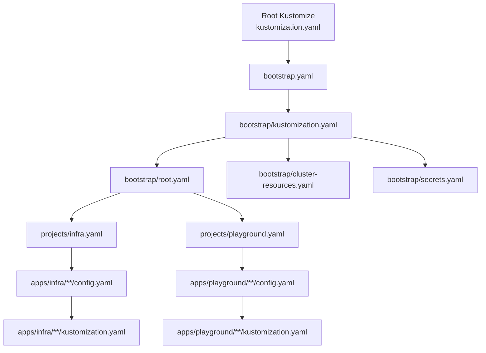
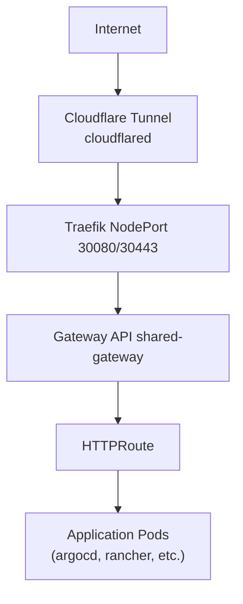
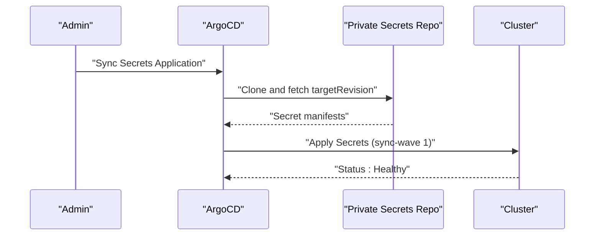
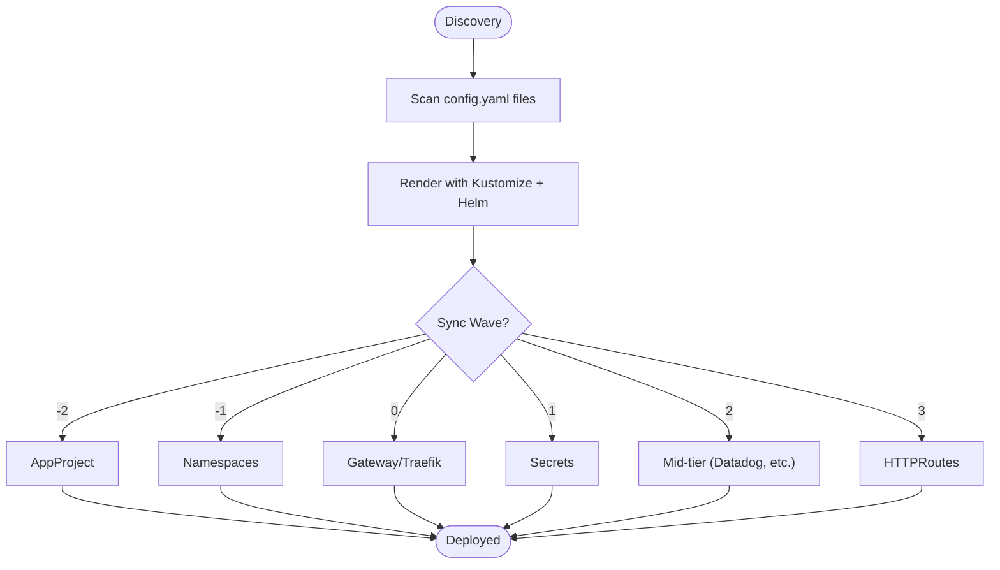
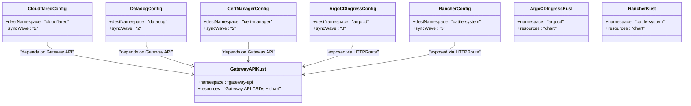
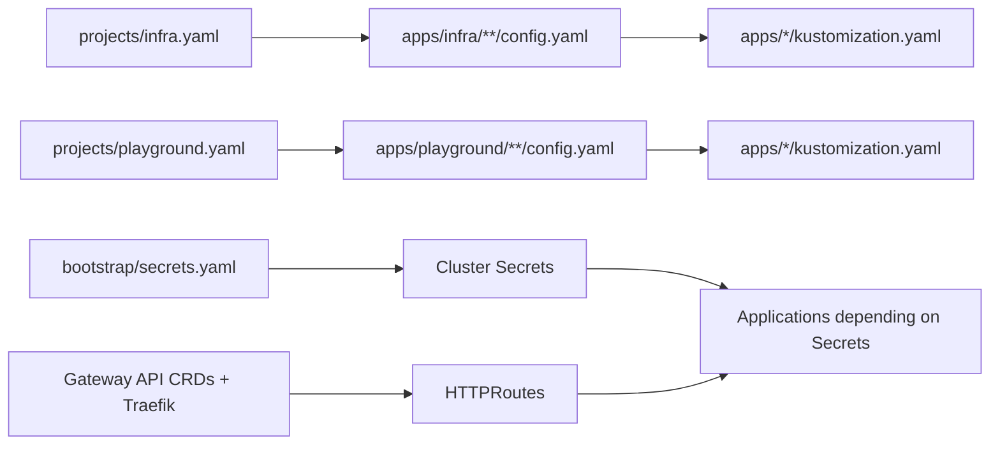

# Troubleshooting and Maintenance

<cite>
**Referenced Files in This Document**
- [README.md](file://README.md)
- [bootstrap.yaml](file://bootstrap.yaml)
- [bootstrap/secrets.yaml](file://bootstrap/secrets.yaml)
- [projects/infra.yaml](file://projects/infra.yaml)
- [projects/playground.yaml](file://projects/playground.yaml)
- [apps/infra/cloudflared/config.yaml](file://apps/infra/cloudflared/config.yaml)
- [apps/infra/datadog/config.yaml](file://apps/infra/datadog/config.yaml)
- [apps/playground/argocd-ingress/config.yaml](file://apps/playground/argocd-ingress/config.yaml)
- [apps/playground/cert-manager/config.yaml](file://apps/playground/cert-manager/config.yaml)
- [apps/playground/rancher/config.yaml](file://apps/playground/rancher/config.yaml)
- [apps/infra/gateway-api/kustomization.yaml](file://apps/infra/gateway-api/kustomization.yaml)
- [apps/playground/argocd-ingress/kustomization.yaml](file://apps/playground/argocd-ingress/kustomization.yaml)
- [apps/playground/rancher/kustomization.yaml](file://apps/playground/rancher/kustomization.yaml)
- [guide/argocd/argo_cd.md](file://guide/argocd/argo_cd.md)
- [guide/k8s_manifest_secrets/argo_cd.md](file://guide/k8s_manifest_secrets/argo_cd.md)
</cite>

## Table of Contents
1. [Introduction](#introduction)
2. [Project Structure](#project-structure)
3. [Core Components](#core-components)
4. [Architecture Overview](#architecture-overview)
5. [Detailed Component Analysis](#detailed-component-analysis)
6. [Dependency Analysis](#dependency-analysis)
7. [Performance Considerations](#performance-considerations)
8. [Troubleshooting Guide](#troubleshooting-guide)
9. [Maintenance Procedures](#maintenance-procedures)
10. [Monitoring and Alerting](#monitoring-and-alerting)
11. [Backup and Disaster Recovery](#backup-and-disaster-recovery)
12. [Conclusion](#conclusion)

## Introduction
This document provides comprehensive troubleshooting and maintenance guidance for a GitOps-driven Kubernetes cluster managed with ArgoCD, Kustomize, and Helm. It covers diagnostics of sync failures, configuration errors, and resource conflicts; step-by-step maintenance procedures for updating applications, managing secrets, and recovering from failed deployments; monitoring and alerting strategies; and backup and disaster recovery procedures including restoring from Git history and recovering from cluster state corruption.

## Project Structure
The repository follows a layered GitOps structure:
- Root Kustomization builds a bootstrap Application pointing to the bootstrap directory.
- Bootstrap applies cluster resources and secrets, then defines AppProjects and ApplicationSets.
- Projects define discovery rules for infrastructure and playground applications.
- Apps contain per-application manifests with optional Helm charts and Kustomize overlays.

**Diagram sources**
- [README.md:87-118](file://README.md#L87-L118)
- [bootstrap.yaml:1-26](file://bootstrap.yaml#L1-L26)
- [projects/infra.yaml:1-85](file://projects/infra.yaml#L1-L85)
- [projects/playground.yaml:1-90](file://projects/playground.yaml#L1-L90)

**Section sources**
- [README.md:57-86](file://README.md#L57-L86)
- [README.md:87-118](file://README.md#L87-L118)

## Core Components
- Bootstrap Application: Initializes the cluster by applying cluster resources and secrets, then discovers and deploys applications via ApplicationSets.
- AppProjects: Define resource whitelists and destinations for safe, scoped deployments.
- ApplicationSets: Discover applications by scanning config.yaml files and render them with Kustomize and Helm.
- Applications: Per-app ArgoCD Applications generated by ApplicationSets, configured with automated sync, pruning, and self-healing.

Key operational characteristics:
- Automated sync with prune and self-heal enabled.
- Retry policy with bounded backoff.
- Sync waves to enforce ordering across resources.

**Section sources**
- [bootstrap.yaml:19-26](file://bootstrap.yaml#L19-L26)
- [projects/infra.yaml:61-71](file://projects/infra.yaml#L61-L71)
- [projects/playground.yaml:66-71](file://projects/playground.yaml#L66-L71)
- [README.md:76-85](file://README.md#L76-L85)

## Architecture Overview
The platform integrates external ingress via Cloudflare tunnels and internal routing via Gateway API and Traefik. The network flow and hostnames are defined in the repository’s README.

**Diagram sources**
- [README.md:5-47](file://README.md#L5-L47)

**Section sources**
- [README.md:49-56](file://README.md#L49-L56)

## Detailed Component Analysis

### Bootstrap and Secrets Management
- Bootstrap Application sets automated sync with prune and self-heal, ensuring drift recovery.
- Secrets Application uses sync wave 1 to ensure TLS and credentials exist before dependent apps deploy.
- Private secrets are stored in a dedicated private repository and synced via ArgoCD.

**Diagram sources**
- [bootstrap/secrets.yaml:6-23](file://bootstrap/secrets.yaml#L6-L23)
- [guide/k8s_manifest_secrets/argo_cd.md:1-46](file://guide/k8s_manifest_secrets/argo_cd.md#L1-L46)

**Section sources**
- [bootstrap/secrets.yaml:1-24](file://bootstrap/secrets.yaml#L1-L24)
- [README.md:160-163](file://README.md#L160-L163)

### Application Discovery and Ordering
- ApplicationSets scan for config.yaml files under apps/infra and apps/playground.
- Sync waves enforce order: AppProjects (-2), Namespaces (-1), Gateway/Traefik (0), Secrets (1), Mid-tier (2), HTTPRoutes (3).

**Diagram sources**
- [projects/infra.yaml:33-45](file://projects/infra.yaml#L33-L45)
- [projects/playground.yaml:33-45](file://projects/playground.yaml#L33-L45)
- [README.md:76-85](file://README.md#L76-L85)

**Section sources**
- [projects/infra.yaml:23-85](file://projects/infra.yaml#L23-L85)
- [projects/playground.yaml:23-90](file://projects/playground.yaml#L23-L90)
- [README.md:76-85](file://README.md#L76-L85)

### Per-Application Configurations
- Cloudflared, Datadog, cert-manager, ArgoCD Ingress, and Rancher define destination namespaces and sync waves.
- Kustomization files set namespaces and include Helm charts where applicable.

**Diagram sources**
- [apps/infra/cloudflared/config.yaml:1-4](file://apps/infra/cloudflared/config.yaml#L1-L4)
- [apps/infra/datadog/config.yaml:1-6](file://apps/infra/datadog/config.yaml#L1-L6)
- [apps/playground/cert-manager/config.yaml:1-5](file://apps/playground/cert-manager/config.yaml#L1-L5)
- [apps/playground/argocd-ingress/config.yaml:1-4](file://apps/playground/argocd-ingress/config.yaml#L1-L4)
- [apps/playground/rancher/config.yaml:1-5](file://apps/playground/rancher/config.yaml#L1-L5)
- [apps/infra/gateway-api/kustomization.yaml:1-9](file://apps/infra/gateway-api/kustomization.yaml#L1-L9)
- [apps/playground/argocd-ingress/kustomization.yaml:1-9](file://apps/playground/argocd-ingress/kustomization.yaml#L1-L9)
- [apps/playground/rancher/kustomization.yaml:1-9](file://apps/playground/rancher/kustomization.yaml#L1-L9)

**Section sources**
- [apps/infra/cloudflared/config.yaml:1-4](file://apps/infra/cloudflared/config.yaml#L1-L4)
- [apps/infra/datadog/config.yaml:1-6](file://apps/infra/datadog/config.yaml#L1-L6)
- [apps/playground/argocd-ingress/config.yaml:1-4](file://apps/playground/argocd-ingress/config.yaml#L1-L4)
- [apps/playground/cert-manager/config.yaml:1-5](file://apps/playground/cert-manager/config.yaml#L1-L5)
- [apps/playground/rancher/config.yaml:1-5](file://apps/playground/rancher/config.yaml#L1-L5)
- [apps/infra/gateway-api/kustomization.yaml:1-9](file://apps/infra/gateway-api/kustomization.yaml#L1-L9)
- [apps/playground/argocd-ingress/kustomization.yaml:1-9](file://apps/playground/argocd-ingress/kustomization.yaml#L1-L9)
- [apps/playground/rancher/kustomization.yaml:1-9](file://apps/playground/rancher/kustomization.yaml#L1-L9)

## Dependency Analysis
- ApplicationSets depend on config.yaml presence and correct sync-wave annotations.
- Applications depend on namespaces created in earlier waves and on Secrets applied in wave 1.
- HTTPRoutes depend on Gateway resources existing before route creation.

**Diagram sources**
- [projects/infra.yaml:33-45](file://projects/infra.yaml#L33-L45)
- [projects/playground.yaml:33-45](file://projects/playground.yaml#L33-L45)
- [bootstrap/secrets.yaml:6-23](file://bootstrap/secrets.yaml#L6-L23)
- [README.md:76-85](file://README.md#L76-L85)

**Section sources**
- [README.md:76-85](file://README.md#L76-L85)

## Performance Considerations
- Use sync waves to avoid race conditions during resource creation.
- Enable automated self-heal and prune to maintain desired state consistently.
- Limit retries to prevent cascading failures; adjust backoff parameters as needed.
- Prefer OCI Helm charts and centralized repository URLs to reduce resolution overhead.

[No sources needed since this section provides general guidance]

## Troubleshooting Guide

### Diagnosing Sync Failures
Common causes:
- Missing or misconfigured sync waves causing resource ordering issues.
- Unavailable private repositories or missing repository credentials.
- Kustomize/Helm rendering errors due to invalid overlays or chart references.
- Resource conflicts (duplicate names, missing namespaces).

Diagnostic steps:
1. Inspect Application status and events:
   - Use ArgoCD UI to view sync status, health, and operation logs.
   - Use read-only kubectl commands to describe resources and check events.
2. Verify repository connectivity and credentials:
   - Confirm repository secrets exist and are applied.
   - Test clone access to the repository from the cluster.
3. Review Kustomize/Helm rendering:
   - Build locally with the same options used by ArgoCD.
   - Validate Kustomization and Helm chart references.
4. Check sync waves and ordering:
   - Ensure dependent resources are applied in the correct wave.
   - Confirm namespaces and cluster resources are present before apps deploy.

**Section sources**
- [projects/infra.yaml:61-71](file://projects/infra.yaml#L61-L71)
- [projects/playground.yaml:66-71](file://projects/playground.yaml#L66-L71)
- [README.md:76-85](file://README.md#L76-L85)

### Configuration Errors
Symptoms:
- Application stuck in Unknown or Degraded state.
- Missing or incorrect destination namespace.
- Misapplied annotations (e.g., wrong sync wave).

Resolution:
- Correct destination namespace in config.yaml if overridden.
- Remove conflicting annotations or align with intended sync wave.
- Validate Kustomization and Helm chart paths.

**Section sources**
- [apps/infra/cloudflared/config.yaml:1-4](file://apps/infra/cloudflared/config.yaml#L1-L4)
- [apps/infra/datadog/config.yaml:1-6](file://apps/infra/datadog/config.yaml#L1-L6)
- [apps/playground/argocd-ingress/config.yaml:1-4](file://apps/playground/argocd-ingress/config.yaml#L1-L4)
- [apps/playground/cert-manager/config.yaml:1-5](file://apps/playground/cert-manager/config.yaml#L1-L5)
- [apps/playground/rancher/config.yaml:1-5](file://apps/playground/rancher/config.yaml#L1-L5)

### Resource Conflicts
Symptoms:
- Duplicate resource names across namespaces or clusters.
- Missing dependencies (e.g., TLS secrets, Gateways) required by HTTPRoutes.

Resolution:
- Rename conflicting resources or adjust Kustomize overlays.
- Ensure prerequisite resources (Gateways, TLS secrets) are deployed in earlier waves.
- Use ArgoCD diff to inspect pending changes and resolve conflicts.

**Section sources**
- [README.md:76-85](file://README.md#L76-L85)

### Debugging Techniques Using ArgoCD UI, CLI, and Logs
- ArgoCD UI:
  - Navigate to the failing Application, review Conditions, Events, and Operation logs.
  - Use the Manifest Diff to compare live vs. desired state.
- ArgoCD CLI:
  - Use commands to get application status, sync, and logs.
  - Trigger manual sync or rollback if needed.
- Logs:
  - Inspect ArgoCD server, application controller, and repo server logs.
  - Check application pod logs for runtime errors.

**Section sources**
- [guide/argocd/argo_cd.md:1-34](file://guide/argocd/argo_cd.md#L1-L34)

## Maintenance Procedures

### Updating Applications
Steps:
1. Modify manifests in the application’s repository branch.
2. Push changes to the target revision.
3. ArgoCD automatically detects and syncs the change.
4. Monitor Application status and logs for completion.

Best practices:
- Use feature branches and pull requests for changes.
- Keep sync waves consistent to avoid regressions.
- Validate changes locally with Kustomize/Helm before committing.

**Section sources**
- [projects/infra.yaml:61-71](file://projects/infra.yaml#L61-L71)
- [projects/playground.yaml:66-71](file://projects/playground.yaml#L66-L71)

### Managing Secrets
Steps:
1. Store secrets in the private secrets repository.
2. Reference secrets in application manifests via Kustomize or Helm.
3. Ensure Secrets Application is synced in wave 1.
4. Verify secret availability in the target namespace.

Security:
- Restrict access to the private repository.
- Use ArgoCD repository credentials to access private repos.

**Section sources**
- [bootstrap/secrets.yaml:6-23](file://bootstrap/secrets.yaml#L6-L23)
- [guide/k8s_manifest_secrets/argo_cd.md:1-46](file://guide/k8s_manifest_secrets/argo_cd.md#L1-L46)
- [README.md:160-163](file://README.md#L160-L163)

### Recovering from Failed Deployments
Recovery strategies:
- Self-heal: Enabled by default; ArgoCD attempts to reconcile drift automatically.
- Manual sync: Force resync if automatic reconciliation fails.
- Rollback: Revert to a previous known-good revision.
- Prune: Remove orphaned resources if necessary.

Operational tips:
- Use dry-run to preview changes.
- Apply targeted fixes and re-sync incrementally.

**Section sources**
- [bootstrap.yaml:19-26](file://bootstrap.yaml#L19-L26)
- [projects/infra.yaml:61-71](file://projects/infra.yaml#L61-L71)
- [projects/playground.yaml:66-71](file://projects/playground.yaml#L66-L71)

## Monitoring and Alerting
Recommended practices:
- Use built-in ArgoCD health checks and condition reporting.
- Integrate with cluster monitoring (e.g., Datadog) for metrics and logs.
- Set up alerts for:
  - Application Degraded or Missing states.
  - Persistent sync failures or stuck operations.
  - Repository connectivity issues.

[No sources needed since this section provides general guidance]

## Backup and Disaster Recovery

### Restoring from Git History
Steps:
1. Identify the last known-good revision.
2. Update the Application’s targetRevision to that commit.
3. Trigger a sync; ArgoCD will reconcile the cluster to that state.

Notes:
- Ensure repository access remains intact.
- Validate changes with a dry-run before applying.

**Section sources**
- [projects/infra.yaml:55-58](file://projects/infra.yaml#L55-L58)
- [projects/playground.yaml:55-58](file://projects/playground.yaml#L55-L58)

### Recovering from Cluster State Corruption
Approach:
- Recreate cluster state from Git using ArgoCD’s automated sync.
- If critical resources are missing, manually apply bootstrap and secrets in the correct order.
- Verify sync waves and dependencies are satisfied.

Operational tips:
- Maintain a minimal bootstrap Application for emergency recovery.
- Keep private secrets synchronized to restore credentials quickly.

**Section sources**
- [bootstrap.yaml:19-26](file://bootstrap.yaml#L19-L26)
- [bootstrap/secrets.yaml:6-23](file://bootstrap/secrets.yaml#L6-L23)
- [README.md:76-85](file://README.md#L76-L85)

## Conclusion
This troubleshooting and maintenance guide leverages the repository’s GitOps structure to diagnose and resolve common issues efficiently. By enforcing sync waves, validating repository access, and using ArgoCD’s UI, CLI, and logs, teams can maintain a resilient and observable cluster. Regular monitoring, disciplined change management, and robust backup/recovery procedures ensure quick recovery from failures and minimal downtime.