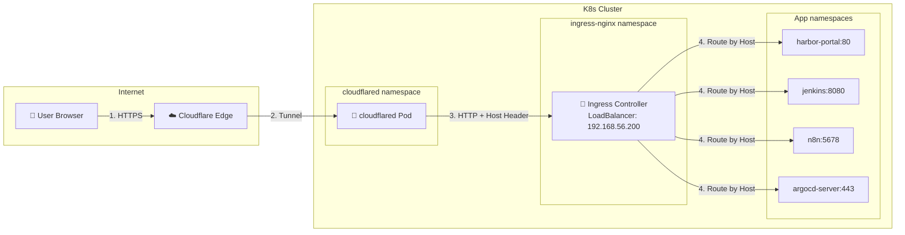

# Network Flow: DNS → K8s Service

## Architecture Overview



---

## Flow Chi Tiết

### 1️⃣ User → Cloudflare Edge
- **DNS**: `hoangvu75.space` → Cloudflare nameservers
- **SSL/TLS**: Cloudflare terminate SSL, cấp certificate tự động

### 2️⃣ Cloudflare → cloudflared Pod (Tunnel)
- **cloudflared** tạo **outbound connection** tới Cloudflare
- Không cần mở port, không cần public IP
- Forward request tới ingress controller

### 3️⃣ cloudflared → Ingress Controller
- Request HTTP với **Host header** (vd: `harbor.localhost`)
- Ingress route dựa trên Host

### 4️⃣ Ingress → App Service
- Match host → route tới ClusterIP service

---

## Cloudflare Tunnel Routes

| Public URL | Service URL | Host Header |
|------------|-------------|-------------|
| `harbor.hoangvu75.space` | `ingress-nginx-controller.ingress-nginx.svc:80` | `harbor.localhost` |
| `jenkins.hoangvu75.space` | `ingress-nginx-controller.ingress-nginx.svc:80` | `jenkins.localhost` |
| `argocd.hoangvu75.space` | `ingress-nginx-controller.ingress-nginx.svc:80` | `argocd.localhost` |
| `n8n.hoangvu75.space` | `ingress-nginx-controller.ingress-nginx.svc:80` | `n8n.localhost` |
| `dashboard.hoangvu75.space` | `ingress-nginx-controller.ingress-nginx.svc:80` | `kubedashboard.localhost` |

---

## MetalLB - Vai trò

| Access Method | Cần MetalLB? |
|---------------|--------------|
| Từ LAN (`192.168.56.x`) | ✅ Có - cấp LoadBalancer IP |
| Từ Internet qua Cloudflare Tunnel | ❌ Không - bypass hoàn toàn |

**Config:**
```yaml
# metallb-config.yaml - IP pool cho LAN access
addresses:
- 192.168.56.200-192.168.56.210
```

> Cloudflare Tunnel **bypass MetalLB** - traffic đi thẳng tới ClusterIP.

---

## Summary

| Layer | Component | Vai trò |
|-------|-----------|---------|
| DNS | Cloudflare | Resolve domain → edge |
| Edge | Cloudflare | SSL termination, WAF |
| Tunnel | cloudflared | Bridge Cloudflare ↔ K8s |
| Routing | Ingress Controller | Route by Host header |
| LB | MetalLB | External IP cho LAN (không dùng cho tunnel) |
