# Network Flow: DNS → K8s Service

## Architecture Overview

```mermaid
flowchart LR
    subgraph Internet
        User[👤 User Browser]
        CF[☁️ Cloudflare Edge]
    end
    
    subgraph "K8s Cluster"
        subgraph cloudflared-ns["cloudflared namespace"]
            TUN[🔗 cloudflared Pod]
        end
        
        subgraph ingress-ns["ingress-nginx namespace"]
            ING[🚪 Ingress Controller<br/>Type: ClusterIP]
        end
        
        subgraph app-ns["App namespaces"]
            SVC1[harbor-portal:80]
            SVC2[jenkins:8080]
            SVC3[n8n:5678]
            SVC4[argocd-server:443]
        end
    end
    
    User -->|1. HTTPS| CF
    CF -->|2. Tunnel| TUN
    TUN -->|3. HTTP + Host Header| ING
    ING -->|4. Route by Host| SVC1
    ING -->|4. Route by Host| SVC2
    ING -->|4. Route by Host| SVC3
    ING -->|4. Route by Host| SVC4
```

---

## Detailed Flow

### 1️⃣ User → Cloudflare Edge
- **DNS**: `hoangvu75.space` → Cloudflare nameservers
- **SSL/TLS**: Cloudflare terminates SSL, automatically issues certificates

### 2️⃣ Cloudflare → cloudflared Pod (Tunnel)
- **cloudflared** creates an **outbound connection** to Cloudflare
- No open ports required, no public IP needed
- Forwards requests to the ingress controller

### 3️⃣ cloudflared → Ingress Controller
- HTTP Request with **Host header** (e.g., `harbor.localhost`)
- Ingress routes based on the Host

### 4️⃣ Ingress → App Service
- Match host → route to ClusterIP service

---

## Cloudflare Tunnel Routes

| Public URL | Service URL | Host Header |
|------------|-------------|-------------|
| `harbor.hoangvu75.space` | `ingress-nginx-controller.ingress-nginx.svc:80` | `harbor.localhost` |
| `jenkins.hoangvu75.space` | `ingress-nginx-controller.ingress-nginx.svc:80` | `jenkins.localhost` |
| `argocd.hoangvu75.space` | `ingress-nginx-controller.ingress-nginx.svc:80` | `argocd.localhost` |
| `n8n.hoangvu75.space` | `ingress-nginx-controller.ingress-nginx.svc:80` | `n8n.localhost` |
| `dashboard.hoangvu75.space` | `ingress-nginx-controller.ingress-nginx.svc:80` | `kubedashboard.localhost` |

---

## Note on LAN Access
Currently **MetalLB has been removed**, so there is no LAN IP (`192.168.56.200`) for Ingress.
- **Primary Access:** Via Cloudflare Tunnel (Internet).
- **Local Access:** Requires `kubectl port-forward`.

---

## Summary

| Layer | Component | Role |
|-------|-----------|------|
| DNS | Cloudflare | Resolve domain → edge |
| Edge | Cloudflare | SSL termination, WAF |
| Tunnel | cloudflared | Bridge Cloudflare ↔ K8s |
| Routing | Ingress Controller | Route by Host header |
